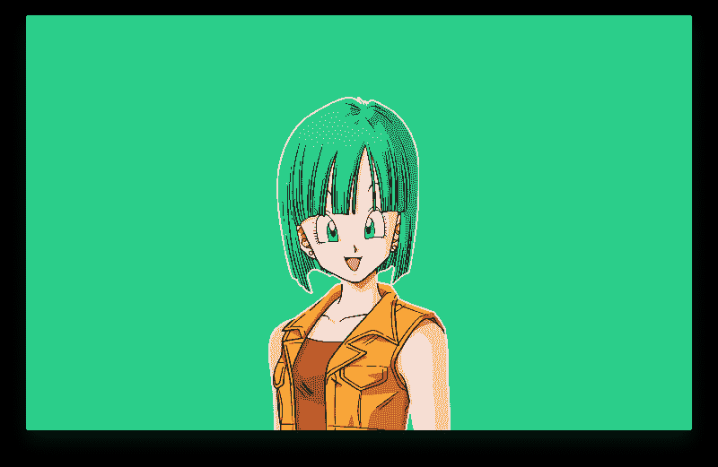
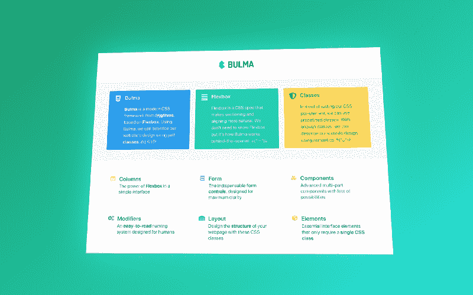
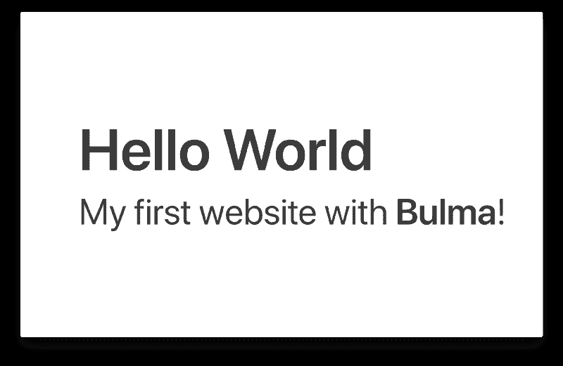
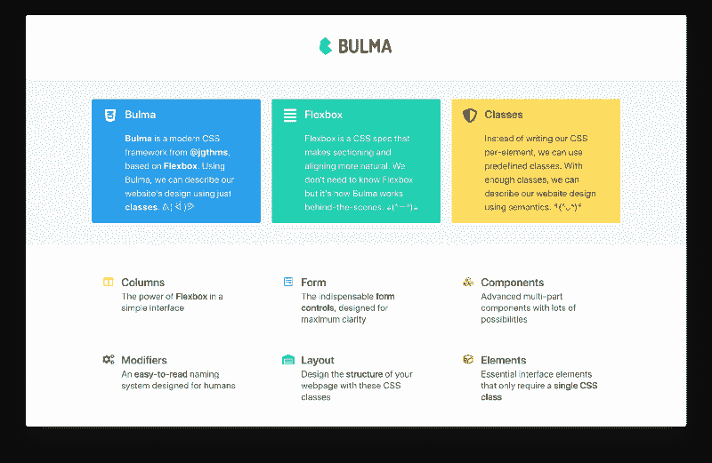
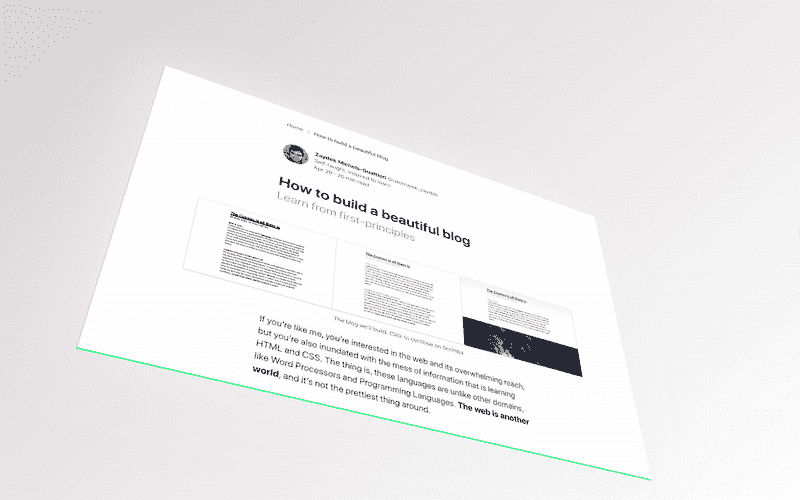

# 免费课程:升一级？与布尔玛 CSS

> 原文：<https://www.freecodecamp.org/news/free-course-level-up-with-bulma-css-d82dcb4b980a/>

作者 ZAYDEK

#### KAMEHAMEHAAAA？

# 免费课程:升一级？与布尔玛 CSS

#### 自 Bootstrap 以来最好的 CSS 框架

在我开始写这篇文章之前，我只想分享我正在开发一个产品，我很乐意收集一些关于如何更好地为 web 开发人员服务的数据。我创建了一个[简短问卷](https://twitter.com/username_ZAYDEK/status/1103914471267790854)在阅读这篇文章之前或之后进行检查。请检查一下，谢谢！现在，回到我们的常规节目。



The OG Bulma. [→](http://dragonball.wikia.com/wiki/Bulma)

### 认识布尔玛 CSS！免费课程？h[e](https://scrimba.com/g/gbulma)

除了是龙珠 Z 中第二长的角色，[布尔玛](https://bulma.io/)是基于来自杰瑞米·托马斯 [@jgthms](https://jgthms.com/) 的 Flexbox 的现代 CSS 框架。随着 GitHub 上[每月 150，000+下载量](https://github.com/jgthms/bulma/)和[260，000+星级](https://github.com/jgthms/bulma)，布尔玛正在迅速被接受。好吧…告诉我更多。？

有了布尔玛，我们可以轻松创建美观且响应迅速的网站。Jeremy 将布尔玛设计成一套可重复使用的 Sass T1 模式来启动新项目。不知道*萨斯*？Sass *将*编译成 CSS。一旦 [Flexbox](https://en.wikipedia.org/wiki/CSS_flex-box_layout) 标准化，杰瑞米就用它来驱动我们现在所知的布尔玛。

在这篇文章中，我详细介绍了布尔玛是如何工作的，以及我们可以用它做些什么。



Want to learn how to *build* this 3D graphic? [Let me know!](http://bit.do/subscribe-d82dcb4b980a)

### 我还在 Scrimba 上教布尔玛 CSS，我们在那里建立这些网站。免费— [点击此处报名](https://scrimba.com/g/gbulma)！？

#### Scrimba.com 是一个前端开发平台，网站被记录为事件，而不是视频，并且可以编辑。？

### 布尔玛是如何工作的？

布尔玛编译成 CSS 时是 Sass 的 [4.5K 行](https://github.com/jgthms/bulma/tree/master/sass)和 [9.5K 行](https://github.com/jgthms/bulma/blob/master/css/bulma.css)。这些代码到底在做什么？！布尔玛解决了 90%的常见网站模式，如[栏](https://bulma.io/documentation/columns/)、[表单](https://bulma.io/documentation/form/)、[组件](https://bulma.io/documentation/components/)、[修饰符](https://bulma.io/documentation/modifiers/)、[布局](https://bulma.io/documentation/layout/)，以及[元素](https://bulma.io/documentation/elements/)。代码也是响应性的，可以进一步主题化和定制化。

布尔玛不能解决所有问题，但是比手工编写 Sass 或 CSS 要高效得多。由于布尔玛编译成 CSS，它可以适应 JavaScript 框架和库，如 Angular，React 和 Vue。简而言之，布尔玛像 Bootstrap 一样工作，但是没有 JavaScript。

与 Bootstrap 不同，布尔玛依赖于 CSS，而不是 JavaScript。但是和 Bootstrap 一样，它自带 [CSS 重置](https://github.com/jgthms/bulma/blob/master/sass/base/minireset.sass)。现在，让我们从基本原理出发，来看看布尔玛是如何工作的。我假设你[对 HTML/CSS](https://medium.freecodecamp.org/how-to-design-and-develop-a-beautiful-blog-from-scratch-a0cd1af46845) 很熟悉，但仅此而已，因此这就是经典 CSS 的样子:

注意:虽然这不是布尔玛，但它确实展示了布尔玛是如何运作的。

```
<!DOCTYPE html><html>  <head>    …    <style>
```

```
p {  line-height: 2;}
```

```
 </style>  </head>  <body>    <p>      A long time ago in a galaxy far far away…    </p>  </body></html>
```

这里我们在 HTML 中定义了一个`p`，在 CSS 中将所有的`p`定义为具有双倍行距，例如`line-height: 2`。等等——如果我们不希望所有的`p`都是双倍行距呢？或者，如果我们希望一些而不是全部是双倍行距呢？那么我们可以使用类来选择加入 CSS:

```
<!DOCTYPE html><html>  <head>    …    <style>
```

```
.double-spaced {  line-height: 2;}
```

```
 </style>  </head>  <body>    <p class="double-spaced">      A long time ago in a galaxy far far away…    </p>  </body></html>
```

所以我们定义了一个名为`double-spaced`的类，我们选择使用它，而不是让元素继承 CSS，就像第一个例子一样。这是更明智的，因为它使我们以后更难覆盖我们的 CSS。不过，我们可以更进一步，让它变得更难，我们可以让我们的类有条件:

```
<!DOCTYPE html><html>  <head>    …    <style>
```

```
p.double-spaced {  line-height: 2;}
```

```
 </style>  </head>  <body>    <p class="double-spaced">      A long time ago in a galaxy far far away…    </p>  </body></html>
```

现在`double-spaced`需要出现一个`p`元素。这是**有条件 CSS** ，我们可以更进一步！我们可以只使用类，例如`class-1.class-2`来创建**条件类**。这是布尔玛用来创建 HTML/CSS 合同的技术之一。

> 我们现在只是在 HTML 中写 CSS 吗？

> (坐下)

这里的区别在于，布尔玛强调使用语义的通用模式，而不是一对一的 CSS 规则。这意味着我们用布尔玛来描述关系——而不是规则——因此更有力。此外，布尔玛的[新文档](https://bulma.io/documentation/)是惊人的，并采取了 CSS 的猜测了很多。

除了条件类，布尔玛还定义了丰富的 HTML/CSS 契约，这导致了更灵活的 CSS 和更惯用的代码。这对于跨团队共享代码非常有用。这些契约详细描述了类之间的关系。下面是一个 HTML/CSS 契约的简单示例:

```
<section class="section">  <div class="container">    ...  </div></section>
```

只要有足够多设计良好的类和契约，我们就可以创建各种漂亮的、有布尔玛支持的响应性网站。查看世博会！ ⭐️现在，在我们开始之前，让我们从“你好，世界”开始，然后是下面的幻灯片——[那不是幻灯片，是一个网站](https://www.youtube.com/watch?v=EVekNsgUqn4)。



Click either one to open in Scrimba’s interactive playground. ?

在不久的将来，我将发布两篇✌️摩尔的文章，详细介绍我们如何与布尔玛一起创建一个[漂亮的博客](https://twitter.com/username_ZAYDEK/status/994209963558944769)和一个[特斯拉发布页面](https://twitter.com/username_ZAYDEK/status/994209997373423617)！如需更新，请在[媒体](https://medium.com/@ZAYDEK) ✍️和[推特](https://twitter.com/username_ZAYDEK)上关注我。？然而，我确实在免费互动 Scrimba 课程中教授这些内容。点击这里免费注册！？

废话不多说…

### “你好，世界”


A *little* zoomed in. ? Click to open in Scrimba’s interactive playground. ?

既然我们了解了布尔玛是如何工作的，让我们来学习如何“Hello World”:

```
<!DOCTYPE html><html>  <head>    <meta charset="utf-8">    <meta        name="viewport" content="width=device-width,        initial-scale=1">    <title>Hello Bulma!</title>    <link rel="stylesheet" href="https://…/bulma.min.css">    <script defer src="https://…/all.js"></script>  </head>  <body>    <section class="section">      <div class="container">        <h1 class="title">          Hello World        </h1>        <p class="subtitle">          My first website with <strong>Bulma</strong>!        </p>      </div>    </section>  </body></html>
```

回来——别害怕！？所有的布尔玛网站都是从他的模板开始的。我们先关注 h `ead` 元素；指向 b `ulma.min.css` 的 l `ink` 加载布尔玛，指向 a `ll.js` 的 s `cript` 加载 F [ont 牛逼图标。](https://fontawesome.com/) N **注:**布尔玛支持所有图标字体库。

布尔玛更喜欢使用 [HTML5 元素](https://developer.mozilla.org/en-US/docs/Web/Guide/HTML/HTML5)，例如在适当的时候使用`section`而不是`div` 。可读性更强，更地道。等等——如果客户端的浏览器过时了，因此不能识别 HTML5 元素，该怎么办？布尔玛也会处理的！

```
/* bulma.css#L312 */
```

```
article,aside,figure,footer,header,hgroup,section {  display: block;}
```

谢谢布尔玛！？‍这保证了 HTML5 元素被呈现为块元素，而不管客户端的浏览器。好的——我们来复习一下 b `ody:`

```
<section class="section">  <div class="container">    <h1 class="title">      Hello World    </h1>    <;p class="subtitle">      My first website with <strong>Bulma<;/strong>!    </p>  </div></section>
```

当我第一次学习布尔玛的时候，我(╯ □ )╯︵ ┻━┻，因为它太简洁了。但是一旦我冷静下来，我开始认识到一个突现的模式:我们网站的树形结构。这比我想象的要简单得多:

```
 .section       |  .container     /   \.title  .subtitle   /       \ ...       ...
```

*啊啊。*其中`.section`定义新内容的开始，`.container`是内容(如文本)的包装类，用于响应式设计。而`.title`和`.subtitle`是为了美观。这样做之后，布尔玛处理了许多细节，比如最佳实践*和*响应式设计。？？

### 超越“你好世界”？


Click to open in Scrimba’s interactive playground. ?

把布尔玛想象成有修饰物的乐高积木，就像颜色的变化。所以，构建这个网站只需要一些片段和修饰词，比如`.columns`、`.media`、`.icon`——就这样。虽然代码*更复杂，那是因为它是代码。网站的组成很简单:

```
 .column            |         .media          /   \.media-left  .media-content        /       \    .icon      .content      /           \    ...           ...
```

以上是一个布尔玛柱看起来像一棵树。在代码中:

```
…<div class="column">  <article class="media notification is-info">    <figure class="media-left">      <span class="icon is-medium">        <i class="fab fa-2x fa-css3-alt"></i>      </span>    </figure>    <div class="media-content">      <div class="content">        <h1 class="title is-size-4">          Bulma        </h1>        <p class="is-size-5">          <strong>Bulma</strong> is a modern CSS framework...        </p>      </div>    </div>  </article></div>…
```

**注**:修饰语如`.notification`、`.is-info`、`.is-medium`等有助于我们网站的个性化。有些修饰符是有条件的，需要另一个类，有些是通用的。你可以在这里了解更多关于他们的信息[。而对于一个完整网站的互动游乐场，](https://bulma.io/documentation/modifiers/)[点击这里](https://scrimba.com/c/cyr3dT3)。？


Click to open in Scrimba’s interactive playground. ?

> 布尔玛令人着迷！我们可以使用语义设计漂亮且有响应性的网站——无需编写 CSS。

### 最后的想法？

我最喜欢布尔玛的一点是，它是一种不用问他就能理解其创造者如何思考的方式。我怎么做 X？[查一下！](https://github.com/jgthms/bulma/) **这是一个强有力的想法——我们可以从 CSS 大师的头脑中寻找答案，而不是自己去破解不理想的解决方案。**

**感谢阅读！起初，我对学习布尔玛有些犹豫，但后来逐渐意识到它的强大和地道。所以我决定，布尔玛不应该被忽视，因为设计和开发网站往往比预期的要难得多。再次——**感谢您的阅读！** *？？？***

### *像这样？还有两个——点击这里的和这里的！*



Want to learn how to *build* this 3D graphic? [Let me know!](http://bit.do/subscribe-d82dcb4b980a)

#### *考虑支持 [jgthms](https://jgthms.com/) 上 [Patreon](https://www.patreon.com/jgthms) ！他决心把布尔玛作为他的谋生之道和全职工作。？‍?*