# 如何在 10 分钟内将 HTTPS 免费添加到您的网站，以及为什么您现在比…

> 原文：<https://www.freecodecamp.org/news/free-https-c051ca570324/>

作者 Ayo Isaiah

# 如何在 10 分钟内将 HTTPS 免费添加到您的网站，以及为什么您现在比以往任何时候都更需要这样做

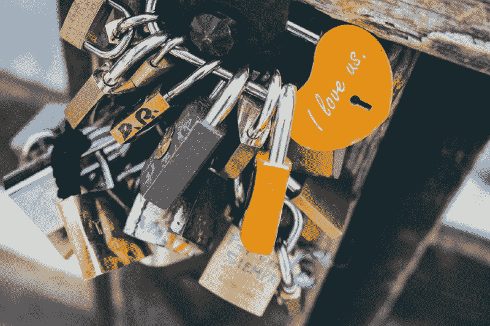

Photo by [Daniel Corneschi](https://unsplash.com/@corneschi?utm_source=medium&utm_medium=referral) on [Unsplash](https://unsplash.com?utm_source=medium&utm_medium=referral)

上周，谷歌宣布，将于 7 月上市的 Chrome 68 将把所有的 HTTP 页面标记为“不安全”。


The planned change in the Chrome address bar

这是迄今为止推动网络走向默认加密的最强有力的一击，而且已经持续了很长时间。

尽管有大量的证据表明为什么每个人都应该加入 HTTPS 的行列，但是很多人仍然看不到为他们的网站提供安全服务的价值。

> "*为什么我的博客*需要这个？"

我以前写过 HTTPS 的[值，但只是重申一下:](https://freshman.tech/the-value-of-https/)

*   HTTPS 保护用户免受中间人攻击。
*   HTTPS 被要求利用浏览器中的许多新功能，比如服务人员
*   HTTPS 影响 [SEO](https://freshman.tech/the-value-of-https/#https-can-provide-seo-benefits)

如果你不相信，读读[doesmysiteneedhttps.com](https://doesmysiteneedhttps.com/)来全面了解为什么每个网站都应该安全服务。

如果你还是不明白，那么你的生活将会变得更加艰难。

为了让用户远离不安全的网站，浏览器一直在羞辱那些在特定环境下提供不安全服务的网站。

Chrome 56 通过将带有敏感登录字段的页面标记为“不安全”开创了这一趋势，而 Chrome 62 则将这一警告扩展到了所有包含任何类型输入字段的 HTTP 页面。此外，该警告会以匿名模式显示在所有 HTTP 页面上，无论它们是否包含输入字段。

当用户试图填写不安全的登录表单时，Firefox 也会发出警告。

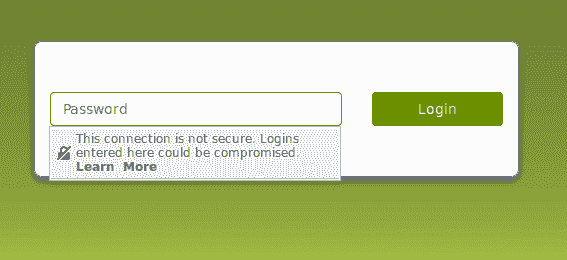

现在 Chrome 已经决定在以后的所有 HTTP 页面上放置这个警告。最终,“不安全”标签旁边的图标会改变，文本会变成红色，以进一步强调 HTTP 页面不可信。

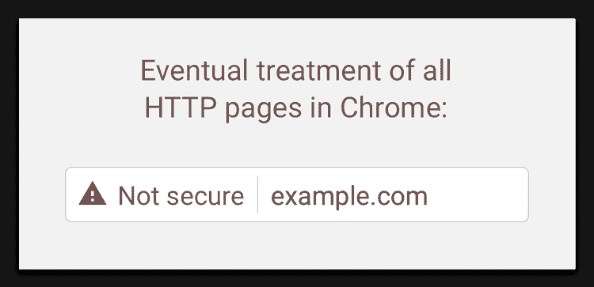

为了防止用户在你的网站上看到这个警告，你需要获得一个有效的 SSL 证书。好消息是，这样做并不像以前那样困难或昂贵。事实上，我将向您展示如何使用 [Cloudflare](https://www.cloudflare.com) 在您的站点上免费部署 HTTPS。而且根本用不了多少时间。

### 为什么选择 Cloudflare？

无论您拥有什么样的服务器端基础架构，CloudFlare 都可以帮助您免费获得 SSL 证书。它也适用于托管在不提供服务器访问的平台上的网站，如 [GitHub Pages](https://pages.github.com/) 、 [Ghost](https://ghost.org/) 等。

你不需要安装任何东西或者写任何代码。这使得在您的网站上部署 HTTPS 成为一个非常好的选择，设置时间应该不超过 10 分钟。

它还在网站的安全性和性能方面提供了无数的其他好处，我在这里不打算介绍。但我会简单介绍一下它是如何工作的，这样你就能很好地理解它是如何完成所有这些工作的。

### Cloudflare 的工作原理

Cloudflare 正好位于网站访问者和服务器之间的流量中间。访问者可能是普通人、爬虫和机器人(如搜索引擎机器人)或黑客。通过充当 web 服务器和网站访问者之间的中介，Cloudflare 有助于过滤掉所有非法流量，只让好的流量通过。

现在你可能想知道这是否会对你的网站速度产生负面影响，但事实恰恰相反。Cloudflare 在全球各地都有数据中心，因此它将只使用离您的访问者最近的端点，这将使您的网站比以前快得多。

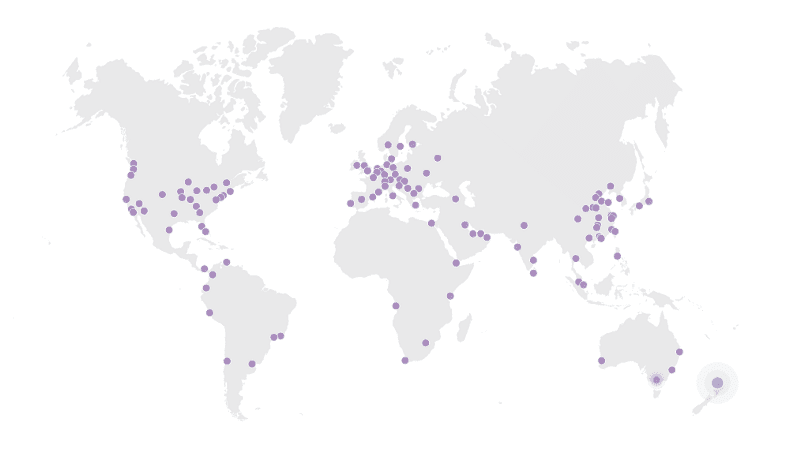

Distribution of Cloudflare’s global network

现在我们知道了 Cloudflare 的工作原理，让我们看看如何在他们的基础架构上建立一个网站，以及如何免费访问 HTTPS。这里的重点将是 Cloudflare 免费提供的功能，但请注意，付费计划也可以提供一系列额外的功能。

### 设置新站点

在 Cloudflare 上注册了之后，你要做的第一件事就是添加一个域名并扫描 DNS 记录。

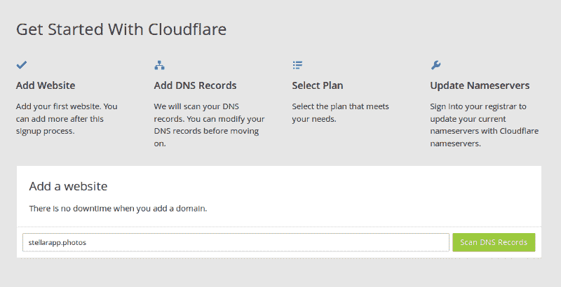

扫描完成后，将显示该域上的所有 DNS 记录。您可以选择想要启用 Cloudflare 的子域，并进行任何所需的修改。准备好之后，点击**继续**进入下一步。

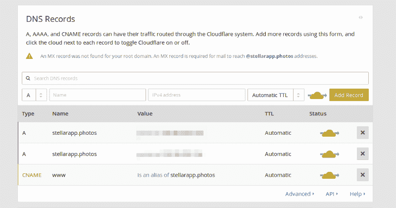

选择自由计划并点击**继续。**

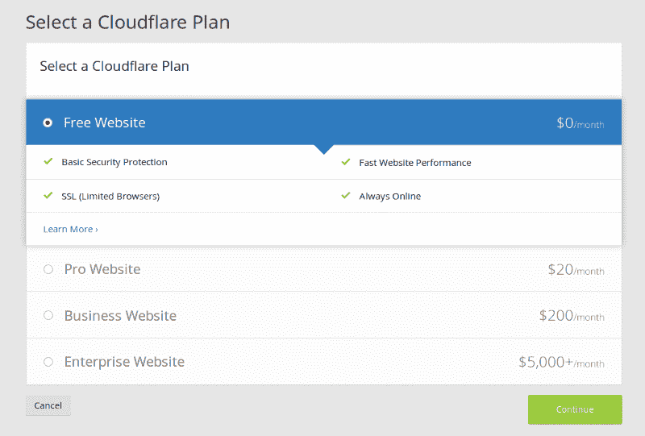

接下来，您需要将域注册商上的名称服务器更改为 Cloudflare 提供的服务器。每个域名注册商的流程略有不同，所以请咨询您的域名注册商。

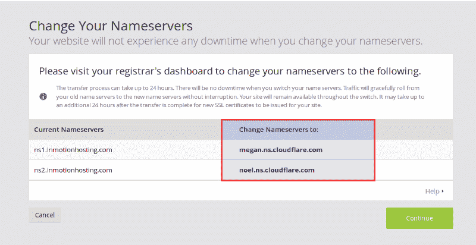

下面是它在 [Namecheap](http://namecheap.com) 中的样子:

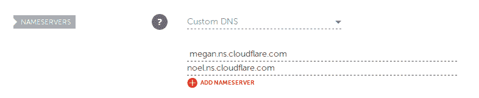

Changing nameservers in Namecheap

现在，您必须等待名称服务器更改完成传播。过一会儿，点击**重新检查名称服务器**，查看您的站点现在是否在 Cloudflare 上处于活动状态。这是安装过程中最长的一部分，可能需要 24 小时，但根据我的经验，只需要不到 5 分钟。

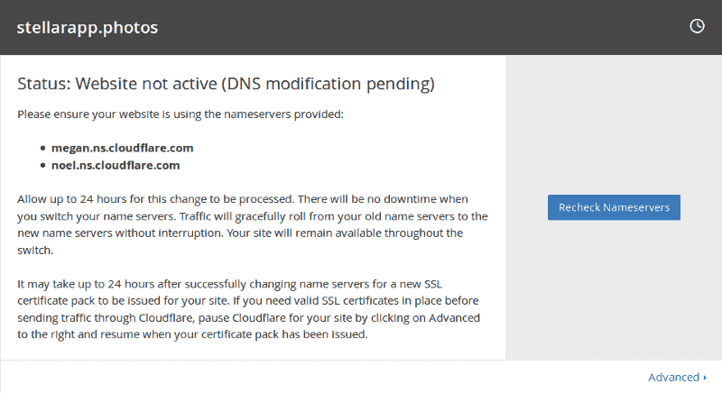

一旦您的名称服务器更新通过了 Cloudflare 的验证，您的站点就会在该服务上处于活动状态。

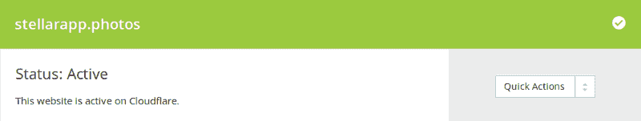

如果您想绝对确定您的 DNS 设置已经传播到任何地方，[我的 DNS 是什么](http://whatsmydns.net)提供了一种方法来检查您的域在不同位置解析到什么 IP 地址。

您也可以在命令行中使用`dig`或`nslookup`来验证您的域名 DNS 配置。

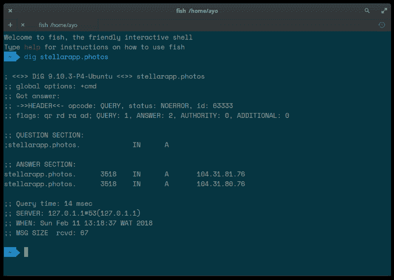

Under ANSWER SECTION, you will see what IP Address your domain resolves to

这样，您可以确保所有流向您的域的流量现在都通过 Cloudflare 进行路由。

在开始配置 Cloudflare 之前，请确保您的浏览器没有使用缓存中的旧 DNS 记录。在 Chrome 和 Firefox 中，你可以通过清除你的浏览器历史来做到这一点。

### 免费获得 SSL

SSL 仍然是一项高级服务，许多证书颁发机构在颁发 SSL 证书之前会收取大量费用。这不是你在任何地方都能免费得到的东西，但是这个行业正在迅速改变。

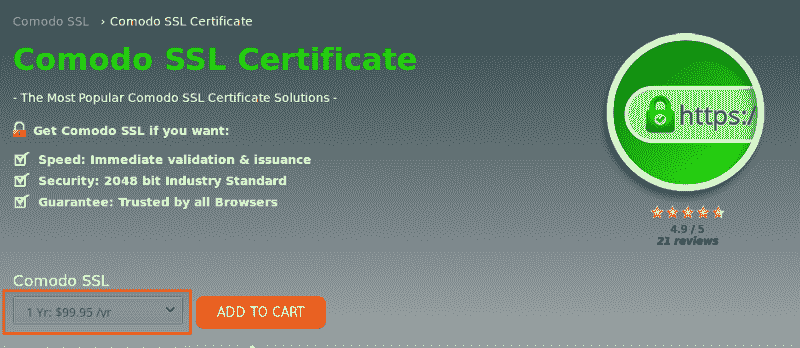

Comodo charges $99.95/year for an SSL cert

既然您已经将 Cloudflare 放在了 web 流量的中间，那么您应该会自动在您的域上获得 SSL。证书可能需要 24 小时才能生效，但根据我的经验，这根本不需要很长时间。

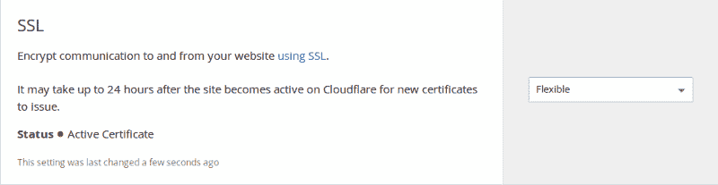

You can check if your site’s certificate is active under Crypto settings.

一旦证书被激活，在浏览器中加载你的站点。你应该在 HTTPS 上看到这个站点，在地址栏里看到一个漂亮的绿色挂锁。

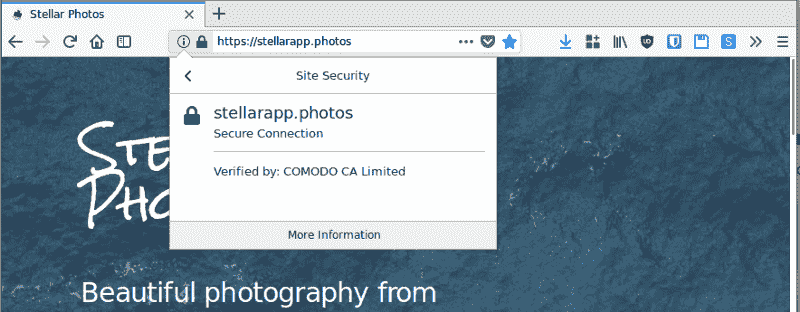

如果你查看更多关于证书的信息，你会看到颁发证书的认证机构(在我的例子中是 Comodo)和过期日期。Cloudflare 的一大优点是证书续订会自动完成，因此您无需担心。

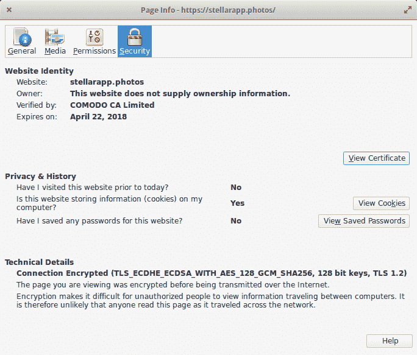

### 灵活、完整和完整(严格)SSL 之间的区别

Cloudflare 使得在您的站点上免费获得 SSL 变得非常容易，无需进行任何配置，但这并不总是等同于直接从起点通过 SSL 为您的站点提供服务。

Cloudflare 的 SSL 有三种实现。第一个是灵活的 SSL，这是默认设置。在这种情况下，您站点的用户和 Cloudflare 之间的流量会被加密，但这种加密不会一直到达源服务器。Cloudflare 仍然通过普通 HTTP 与您的服务器通信。

这意味着 Cloudflare 和您的服务器之间的任何中间人(如网络提供商)都可以看到流量。如果您在网站上收集敏感信息，请避免使用此选项。

为了对原始服务器进行全程加密，您需要使用完全或完全(严格)实现。前者要求您在服务器上安装有效的证书，但是证书的真实性不会得到验证，因此您可以使用自签名证书。另一方面，完整(严格)实现要求您安装一个由可信证书颁发机构签名的有效 SSL 证书。

如果您不想从 Comodo 这样的网站购买 SSL，您可以从 Cloudflare 获得免费的原始 CA 证书，这些证书可以与完整或完整(严格)选项一起使用，因为它们受到 Cloudflare 的信任。但请记住，这些证书仅受 Cloudflare 信任，因此如果您决定将您的网站从 Cloudflare 的基础架构中移除，它们将停止工作。

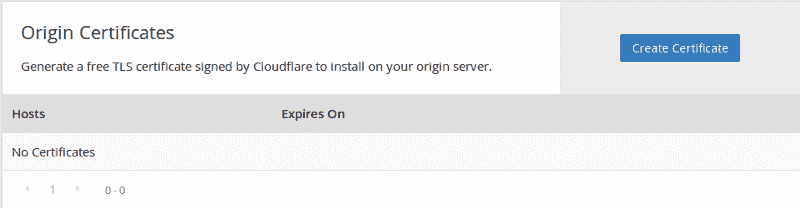

如果你不能控制你的服务器环境，比如说你的网站托管在 GitHub 页面或类似的平台上，你将不能使用完整或完全(严格)的实现，这意味着即使你的用户在地址栏看到 HTTPS，流量也不会一直加密到原始服务器。

但与完全没有 HTTPS 相比，这仍然是一个巨大的进步，因为它将保护你的用户在客户端免于被夹在中间。

### 加强 SSL 实施

无论您选择什么样的 SSL 实现，都有办法加强它，确保用户永远无法通过不安全的 HTTP 访问您的站点。 [Qualys SSL Labs](https://www.ssllabs.com/ssltest/) 是一款帮助您对 SSL 配置进行测试的工具，看看是否还有改进的空间。

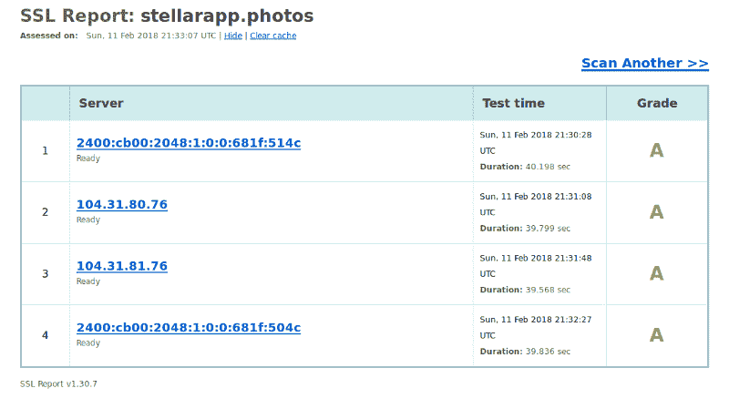

即使我在我的领域获得了 A 级，如果你深入研究结果，你会发现在密钥交换和密码强度方面肯定还有改进的空间。

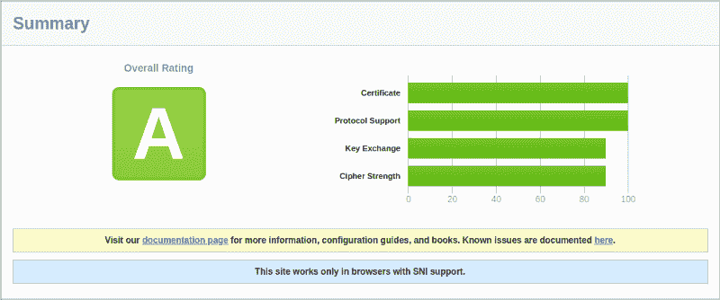

让我们来看看我们可以在 Cloudflare 中做些什么来加强我们的 SSL 并获得更高的评级。

#### 到处强制 HTTPS

一旦你去了 HTTPS，你肯定想阻止用户通过不安全的连接访问你的网站。您可以在 Cloudflare 中通过 301 将所有 HTTP 流量重定向到 HTTPS 来实现这一点。

在加密设置下，找到**总是使用 HTTPS** 选项并将其打开。

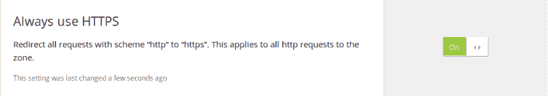

#### 启用 HTTP 严格传输安全(HSTS)

我曾经写过 HSTS 是如何加强你的网站 SSL 的，现在让我们简单回顾一下。

仅通过 301 将 HTTP 流量重定向到 HTTPS 的问题是，初始的不安全请求仍然通过网络传输，这意味着任何有权访问流量的人都可以读取该请求。

HSTS 是一个响应头，它通过告诉浏览器在指定的时间内不能向网站发出不安全的请求来解决这个问题。

这是标题的外观:

```
strict-transport-security: max-age=31536000
```

一旦浏览器收到这个头，在接下来的 31，536，000 秒(相当于一年)内，它不会向您的站点发出不安全的请求。相反，所有 HTTP 请求在通过网络发送出去之前，都会在内部升级到 HTTPS。

如果你想阻止所有的子域通过 HTTP 被访问，你将需要`includeSubdomains`指令。您还可以添加`preload`指令，允许浏览器供应商将您的站点作为 HTTPS 站点放入浏览器中。

```
strict-transport-security: max-age=31536000; includeSubdomains; preload
```

一旦你在你的域名上启用了 HSTS，你就可以很确定一旦有人通过 HTTPS 加载了你的网站，他们将只能通过安全方案访问你的网站。

因此，在你的网站启用 HSTS 之前，确保你确信你的所有流量都将通过 HTTPS 提供服务，否则你会遇到问题。

要在 Cloudflare 中启用此功能，请转到**加密**设置并向下滚动到 **HTTP 严格传输安全(HSTS)** 部分。点击**更改 HSTS 设置，**启用所有相关选项，点击**保存**。

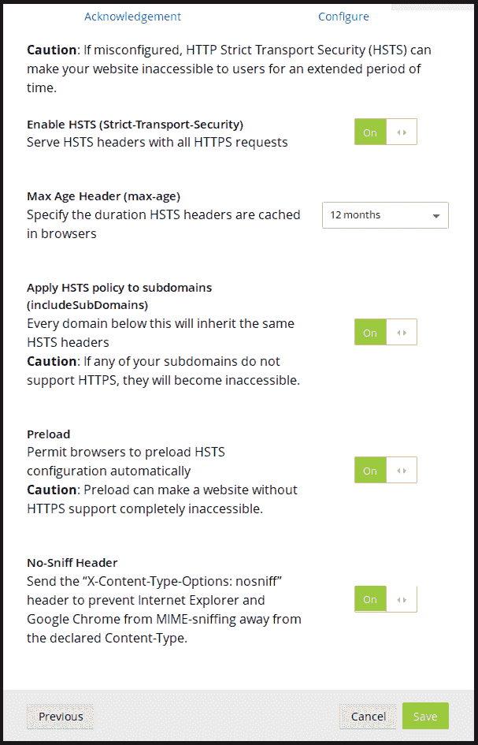

如果你想知道的话，浏览器对 HSTS 的支持非常好。

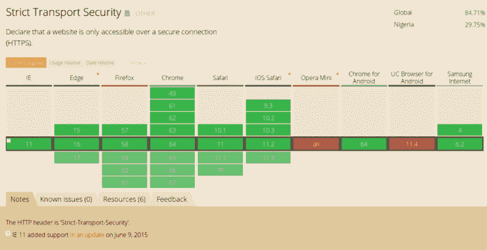

#### 修复不安全的方案引用

如果您在安全页面上不安全地嵌入了被动资源(如图像),浏览器仍然可以很好地加载它。它只是把地址栏的绿色挂锁拿掉了。你可以在这里看到这个错误[的例子。](https://mixed.badssl.com/)

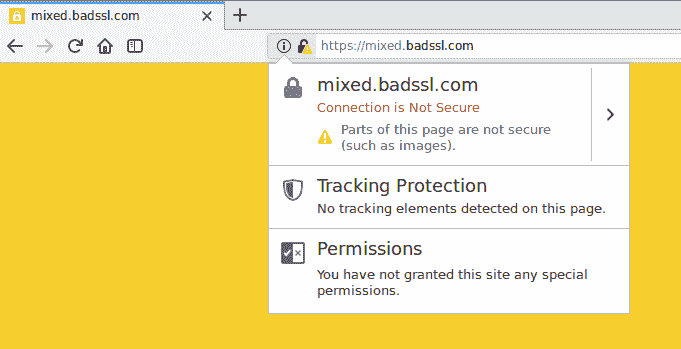

如果您检查浏览器控制台，您会看到一些警告或错误，指向不安全嵌入的资源。在这种情况下

```

```

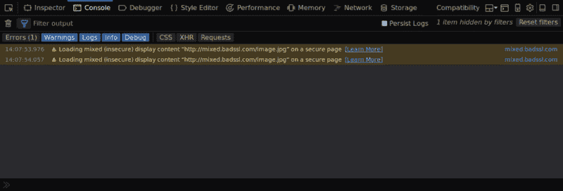

要解决这个问题，只需将方案更改为 HTTPS，一切都会恢复正常。

```

```

如果你的网站中有很多不安全的嵌入内容，那么找到并修复每一个内容可能会非常繁琐。但是 Cloudflare 可以通过[自动 HTTPS 重写](https://support.cloudflare.com/hc/en-us/articles/227227647-How-do-I-use-Automatic-HTTPS-Rewrites-)功能再次帮助您。

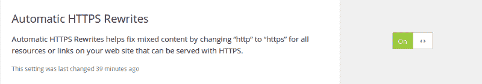

为了确保你的网站上没有不安全的内容，考虑在你的网站上实施[内容安全策略](https://freshman.tech/securing-your-website/#content-security-policy-csp)。

现在让我们看看上面的更改对我们的 SSL 实验室报告有何影响。我在我的域名上重新进行了测试，现在我们得到了 A+的评级。

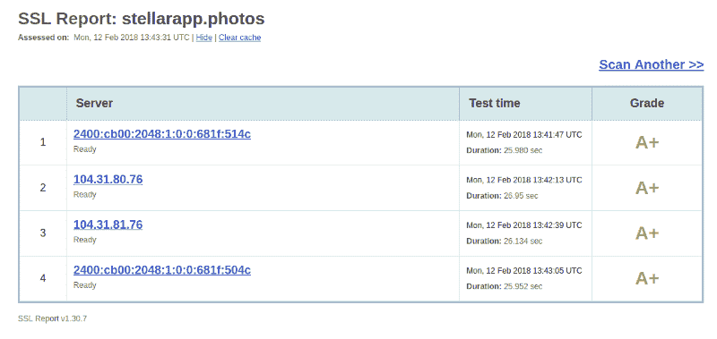

如果您检查图表中的单个评级，什么都没有改变，但我们仍然可以在几分钟内免费获得一个真正安全的 SSL 实现。

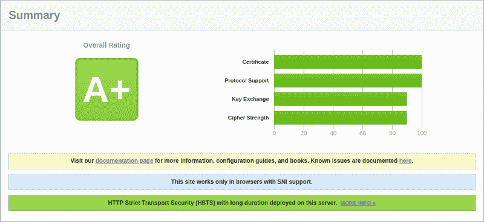

### 免费 SSL 的 Cloudflare 替代方案

如果出于某种原因，你不喜欢使用 Cloudflare，还有其他方法可以免费在 HTTPS 上获得你的网站。这里有两个选项可以尝试:

#### 让我们加密

如果您可以控制您的服务器，您可以使用[让我们加密](https://letsencrypt.org/)在您的站点上快速部署 HTTPS。他们提供免费的 SSL 证书，有效期为三个月，可以自动更新。

即使你不能访问服务器，也要检查你的网络主机。有些主机会允许您使用 Let's Encrypt SSL，而不提供 shell 访问。

#### 亚马逊 AWS 证书管理器

亚马逊还为其亚马逊网络服务(AWS)基础设施上的客户颁发并自动更新 SSL 证书。这样，如果你使用像 Cloudfront 这样的 AWS 资源，你就可以在你的站点上设置并忘记 HTTPS。

不管你如何在你的网站上实现 HTTPS，最重要的事情是确保你尽快设置好，这样你的用户就能获得它提供的安全优势，并且你不会错过浏览器中的一些很酷的功能，这些功能将帮助你创造更好的网络体验。

如果你喜欢这篇文章，请和其他可能从阅读中受益的人分享。顺便说一下，请访问我的博客，查看关于 web 开发的文章。感谢阅读。