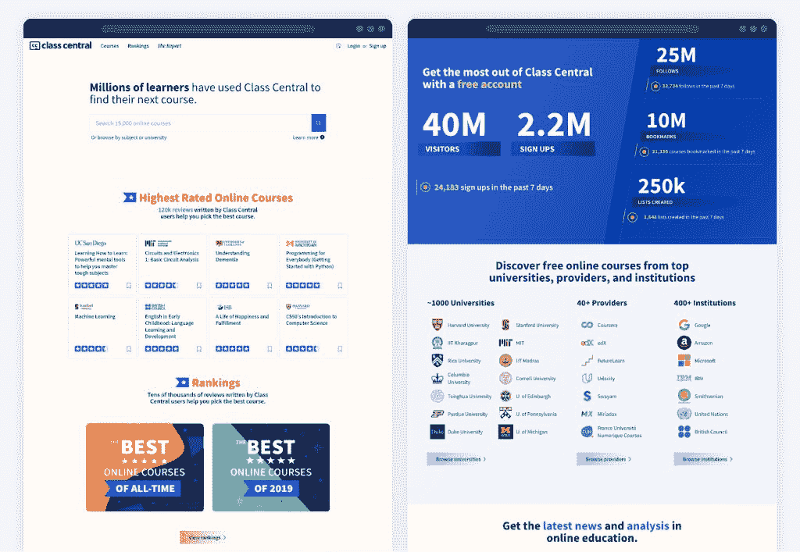

# 720+免费在线编程和计算机科学课程，你可以开始这个新的一年

> 原文：<https://www.freecodecamp.org/news/free-online-programming-cs-courses/>

十年前，像麻省理工和斯坦福这样的大学首次向公众开放免费在线课程。如今，全球近 1000 所[学校](https://www.classcentral.com/universities)已经创建了数以千计的免费在线课程。

我整理了一份 720 多门免费在线课程的清单，你可以在这个月开始学习。为此，我利用了 [Class Central](https://www.classcentral.com/) 超过 50，000 个[在线课程的数据库](https://www.classcentral.com/)。我还包括了每门课程的平均评分。

[Class Central](https://www.classcentral.com/)'s Homepage

我根据难度将这些课程分为以下几类:

*   新手
*   中间的
*   先进的

首次开设的课程标记为 ****【新】**** 。

这些课程中有许多是完全自定进度的。其余的将在全年的不同时间开始。你可以在 Class Central 的[计算机科学](https://www.classcentral.com/subject/cs)、[数据科学](https://www.classcentral.com/subject/data-science)和[编程](https://www.classcentral.com/subject/programming-and-software-development)主题页面上找到 2022 年晚些时候开始的技术相关课程的完整列表。

我知道这是一个很长的列表，可能会让编程新手望而生畏。在这种情况下，你可能会发现大卫·文丘里(David Venturi)推荐的最佳[数据科学在线课程](https://www.classcentral.com/report/best-data-science-curriculum/)很有用——即使你不打算学习数据科学。我希望将来能创造更多这样的指南。

最后，如果你不知道如何注册免费的 Coursera 课程，不要担心——我也写了一篇关于如何注册的文章。

## 初级编程课程(223)

*   [Python 交互式编程入门(上)](https://www.classcentral.com/course/interactivepython1-408?utm_source=fcc_medium&utm_medium=web&utm_campaign=cs_programming_january_2022)来自*莱斯大学*★★★★(2910)
*   [计算机科学入门及使用 Python 编程](https://www.classcentral.com/course/edx-introduction-to-computer-science-and-programming-using-python-1341?utm_source=fcc_medium&utm_medium=web&utm_campaign=cs_programming_january_2022)来自*麻省理工*★★★★(99)
*   [学习编程:多伦多*大学的基础*](https://www.classcentral.com/course/programming1-385?utm_source=fcc_medium&utm_medium=web&utm_campaign=cs_programming_january_2022)★★★★(86)
*   [CS50 的计算机科学入门](https://www.classcentral.com/course/edx-cs50-s-introduction-to-computer-science-442?utm_source=fcc_medium&utm_medium=web&utm_campaign=cs_programming_january_2022)来自*哈佛大学*★★★★(53)
*   [来自*密西根大学的 HTML5*](https://www.classcentral.com/course/introhtml-4307?utm_source=fcc_medium&utm_medium=web&utm_campaign=cs_programming_january_2022) 简介★★★☆(37)
*   [互联网历史、技术和安全](https://www.classcentral.com/course/insidetheinternet-335?utm_source=fcc_medium&utm_medium=web&utm_campaign=cs_programming_january_2022)来自*密西根大学*★★★★(35)
*   [Linux 简介](https://www.classcentral.com/course/edx-introduction-to-linux-1857?utm_source=fcc_medium&utm_medium=web&utm_campaign=cs_programming_january_2022)来自 *Linux 基金会*★★★☆(34)
*   [【新】区块链及其应用](https://www.classcentral.com/course/swayam-blockchain-and-its-applications-58413?utm_source=fcc_medium&utm_medium=web&utm_campaign=cs_programming_january_2022)来自*印度理工学院，哈拉格普尔*
*   [【新】人工智能技术和平台](https://www.classcentral.com/course/technologies-and-platforms-for-artificial-intelli-58952?utm_source=fcc_medium&utm_medium=web&utm_campaign=cs_programming_january_2022)来自*意大利米兰理工大学*
*   [【新】AI 基础](https://www.classcentral.com/course/udacity-ai-fundamentals-59066?utm_source=fcc_medium&utm_medium=web&utm_campaign=cs_programming_january_2022)来自*微软*
*   [【新】来自 *IBM* 的 DevOps](https://www.classcentral.com/course/intro-to-devops-59511?utm_source=fcc_medium&utm_medium=web&utm_campaign=cs_programming_january_2022) 介绍
*   [HTML 和 CSS 简介](https://www.classcentral.com/course/udacity-intro-to-html-and-css-2659?utm_source=fcc_medium&utm_medium=web&utm_campaign=cs_programming_january_2022)
*   [网络安全介绍](https://www.classcentral.com/course/introduction-to-cyber-security-2448?utm_source=fcc_medium&utm_medium=web&utm_campaign=cs_programming_january_2022)来自*开放大学*★★★☆(18)
*   [从第一原理构建现代计算机:从 Nand 到 Tetris(以项目为中心的课程)](https://www.classcentral.com/course/build-a-computer-3234?utm_source=fcc_medium&utm_medium=web&utm_campaign=cs_programming_january_2022)来自*耶路撒冷希伯来大学*★★★★(14)
*   [编程基础](https://www.classcentral.com/course/edx-programming-basics-1650?utm_source=fcc_medium&utm_medium=web&utm_campaign=cs_programming_january_2022)来自*印度理工学院孟买* ★★☆☆☆(13)
*   [计算机科学 101](https://www.classcentral.com/course/edx-computer-science-101-2175?utm_source=fcc_medium&utm_medium=web&utm_campaign=cs_programming_january_2022) 来自*斯坦福大学*★★★☆(11)
*   [来自*密西根大学的 CSS3*](https://www.classcentral.com/course/introcss-4294?utm_source=fcc_medium&utm_medium=web&utm_campaign=cs_programming_january_2022) 简介★★★★(11)
*   [数字媒体创意编程&移动应用](https://www.classcentral.com/course/digitalmedia-529?utm_source=fcc_medium&utm_medium=web&utm_campaign=cs_programming_january_2022)来自*伦敦大学国际课程*★★★☆(10)
*   [HTML5 编码要点和最佳实践](https://www.classcentral.com/course/edx-html5-coding-essentials-and-best-practices-3444?utm_source=fcc_medium&utm_medium=web&utm_campaign=cs_programming_january_2022)来自*万维网联盟(W3C)*★★★☆(9)
*   [物联网和嵌入式系统介绍](https://www.classcentral.com/course/iot-4338?utm_source=fcc_medium&utm_medium=web&utm_campaign=cs_programming_january_2022)来自*加州大学欧文分校*★★★☆(8)
*   [可用证券](https://www.classcentral.com/course/usablesec-1727?utm_source=fcc_medium&utm_medium=web&utm_campaign=cs_programming_january_2022)来自*马里兰大学，学院公园* ★★★☆☆(8)
*   [自己编码！爱丁堡*大学*★★★☆(7)编程入门](https://www.classcentral.com/course/codeyourself-2938?utm_source=fcc_medium&utm_medium=web&utm_campaign=cs_programming_january_2022)
*   [开始编程:打造你的第一款手机游戏](https://www.classcentral.com/course/begin-programming-1243?utm_source=fcc_medium&utm_medium=web&utm_campaign=cs_programming_january_2022)来自*雷丁大学*★★★☆(7)
*   [HTML、CSS 和 Javascript 面向 Web 开发者](https://www.classcentral.com/course/html-css-javascript-for-web-developers-4270?utm_source=fcc_medium&utm_medium=web&utm_campaign=cs_programming_january_2022)来自*约翰·霍普金斯大学*★★★★(6)
*   [学习编程:来自多伦多*大学的*](https://www.classcentral.com/course/programming2-390?utm_source=fcc_medium&utm_medium=web&utm_campaign=cs_programming_january_2022)★★★★(6)
*   [关系数据库简介](https://www.classcentral.com/course/udacity-intro-to-relational-databases-3253?utm_source=fcc_medium&utm_medium=web&utm_campaign=cs_programming_january_2022)
*   [计算机编程范例-基础](https://www.classcentral.com/course/edx-paradigms-of-computer-programming-fundamentals-2298?utm_source=fcc_medium&utm_medium=web&utm_campaign=cs_programming_january_2022)来自*卢万天主教大学*★★★★(4)
*   [计算机编程范例——抽象和并发](https://www.classcentral.com/course/edx-paradigms-of-computer-programming-abstraction-and-concurrency-2630?utm_source=fcc_medium&utm_medium=web&utm_campaign=cs_programming_january_2022)来自*卢万天主教大学*★★★☆(4)
*   [从零开始编程](https://www.classcentral.com/course/edx-programming-in-scratch-2954?utm_source=fcc_medium&utm_medium=web&utm_campaign=cs_programming_january_2022)来自*哈维·马德学院*★★★★(4)
*   如何在一个周末创建一个网站！(以项目为中心的课程)来自*纽约州立大学*★★★★(3)
*   [加州大学洛杉矶分校*的 p5.js*](https://www.classcentral.com/course/kadenze-introduction-to-programming-for-the-visual-arts-with-p5-js-3770?utm_source=fcc_medium&utm_medium=web&utm_campaign=cs_programming_january_2022) 视觉艺术编程入门★★★☆(3)
*   [HTML5 和 CSS 基础](https://www.classcentral.com/course/edx-html5-and-css-fundamentals-5764?utm_source=fcc_medium&utm_medium=web&utm_campaign=cs_programming_january_2022)来自*万维网联盟(W3C)*★★★☆(3)
*   [Linux 命令行基础知识](https://www.classcentral.com/course/udacity-linux-command-line-basics-4049?utm_source=fcc_medium&utm_medium=web&utm_campaign=cs_programming_january_2022)
*   [面向对象编程](https://www.classcentral.com/course/edx-object-oriented-programming-1651?utm_source=fcc_medium&utm_medium=web&utm_campaign=cs_programming_january_2022)来自*印度孟买理工学院*★★★☆(2)
*   [思考。创造。代码](https://www.classcentral.com/course/edx-think-create-code-3231?utm_source=fcc_medium&utm_medium=web&utm_campaign=cs_programming_january_2022)来自*阿德莱德大学*★★★★(2)
*   [智能手机内部的计算技术](https://www.classcentral.com/course/edx-the-computing-technology-inside-your-smartphone-2809?utm_source=fcc_medium&utm_medium=web&utm_campaign=cs_programming_january_2022)来自*康乃尔大学*★★★★(2)
*   [面向所有人的 CS:计算机科学和 Python 编程入门](https://www.classcentral.com/course/edx-cs-for-all-introduction-to-computer-science-and-python-programming-3483?utm_source=fcc_medium&utm_medium=web&utm_campaign=cs_programming_january_2022)来自*哈维·马德学院*★★★★(2)
*   [网络:朋友、金钱和字节](https://www.classcentral.com/course/friendsmoneybytes-359?utm_source=fcc_medium&utm_medium=web&utm_campaign=cs_programming_january_2022)来自*普林斯顿大学* ★★★☆☆(1)
*   [面向对象编程简介(Java)](https://www.classcentral.com/course/intropoojava-441?utm_source=fcc_medium&utm_medium=web&utm_campaign=cs_programming_january_2022) 来自*洛桑联邦理工学院*【1)
*   [CS50 用 Python 介绍人工智能](https://www.classcentral.com/course/edx-cs50-s-introduction-to-artificial-intelligence-with-python-18122?utm_source=fcc_medium&utm_medium=web&utm_campaign=cs_programming_january_2022)来自*哈佛大学*
*   [CS50 的理解技术](https://www.classcentral.com/course/edx-cs50-s-understanding-technology-10142?utm_source=fcc_medium&utm_medium=web&utm_campaign=cs_programming_january_2022)来自*哈佛大学*
*   来自*哈佛大学*的
*   [CS50 的游戏开发入门](https://www.classcentral.com/course/edx-cs50-s-introduction-to-game-development-11504?utm_source=fcc_medium&utm_medium=web&utm_campaign=cs_programming_january_2022)来自*哈佛大学*
*   [来自*哈佛大学*的 CS50 用 Python 和 JavaScript 的 Web 编程](https://www.classcentral.com/course/edx-cs50-s-web-programming-with-python-and-javascript-11506?utm_source=fcc_medium&utm_medium=web&utm_campaign=cs_programming_january_2022)
*   [CS50 与 React Native 的移动应用开发](https://www.classcentral.com/course/edx-cs50-s-mobile-app-development-with-react-native-11505?utm_source=fcc_medium&utm_medium=web&utm_campaign=cs_programming_january_2022)来自*哈佛大学*
*   [CS50 的 AP 计算机科学原理](https://www.classcentral.com/course/edx-cs50-s-ap-computer-science-principles-7017?utm_source=fcc_medium&utm_medium=web&utm_campaign=cs_programming_january_2022)来自*哈佛大学*
*   [部署来自*哈佛大学*的 TinyML](https://www.classcentral.com/course/edx-deploying-tinyml-21643?utm_source=fcc_medium&utm_medium=web&utm_campaign=cs_programming_january_2022)
*   [来自*哈佛大学*的 TinyML](https://www.classcentral.com/course/edx-applications-of-tinyml-21642?utm_source=fcc_medium&utm_medium=web&utm_campaign=cs_programming_january_2022) 的申请
*   [CS50 的律师计算机科学](https://www.classcentral.com/course/edx-cs50-s-computer-science-for-lawyers-16857?utm_source=fcc_medium&utm_medium=web&utm_campaign=cs_programming_january_2022)来自*哈佛大学*
*   [数据库:OLAP 和递归](https://www.classcentral.com/course/edx-databases-olap-and-recursion-20359?utm_source=fcc_medium&utm_medium=web&utm_campaign=cs_programming_january_2022)来自*斯坦福大学*
*   [数据库:来自*斯坦福大学*的半结构化数据](https://www.classcentral.com/course/edx-databases-semistructured-data-20360?utm_source=fcc_medium&utm_medium=web&utm_campaign=cs_programming_january_2022)
*   [数据库:建模和理论](https://www.classcentral.com/course/edx-databases-modeling-and-theory-20362?utm_source=fcc_medium&utm_medium=web&utm_campaign=cs_programming_january_2022)来自*斯坦福大学*
*   [黑客工具](https://www.classcentral.com/course/independent-hacker-tools-13160?utm_source=fcc_medium&utm_medium=web&utm_campaign=cs_programming_january_2022)来自*麻省理工*
*   [加密货币和区块链:数字货币简介](https://www.classcentral.com/course/wharton-cryptocurrency-blockchain-introd-13733?utm_source=fcc_medium&utm_medium=web&utm_campaign=cs_programming_january_2022)来自*宾夕法尼亚大学*
*   [解决问题的计算思维](https://www.classcentral.com/course/computational-thinking-problem-solving-12278?utm_source=fcc_medium&utm_medium=web&utm_campaign=cs_programming_january_2022)来自*宾夕法尼亚大学*
*   [区块链和加密货币讲解](https://www.classcentral.com/course/crypto-finance-18184?utm_source=fcc_medium&utm_medium=web&utm_campaign=cs_programming_january_2022)来自*密西根大学*
*   [使用来自密西根大学*的 Django*](https://www.classcentral.com/course/django-javascript-jquery-json-20951?utm_source=fcc_medium&utm_medium=web&utm_campaign=cs_programming_january_2022) 中的 JavaScript、JQuery 和 JSON
*   [用 PHP 构建数据库应用](https://www.classcentral.com/course/database-applications-php-9570?utm_source=fcc_medium&utm_medium=web&utm_campaign=cs_programming_january_2022)来自*密西根大学*
*   [来自*密西根大学*的 JavaScript、jQuery 和 JSON](https://www.classcentral.com/course/javascript-jquery-json-9568?utm_source=fcc_medium&utm_medium=web&utm_campaign=cs_programming_january_2022)
*   [结构化查询语言(SQL)简介](https://www.classcentral.com/course/intro-sql-9567?utm_source=fcc_medium&utm_medium=web&utm_campaign=cs_programming_january_2022)来自*密西根大学*
*   [在 Django 构建 Web 应用](https://www.classcentral.com/course/django-build-web-apps-20953?utm_source=fcc_medium&utm_medium=web&utm_campaign=cs_programming_january_2022)来自*密执安大学*
*   来自密西根大学*的 [Web 应用技术和 Django](https://www.classcentral.com/course/django-database-web-apps-20955?utm_source=fcc_medium&utm_medium=web&utm_campaign=cs_programming_january_2022)*
*   [Django 特色和图书馆](https://www.classcentral.com/course/django-features-libraries-20952?utm_source=fcc_medium&utm_medium=web&utm_campaign=cs_programming_january_2022)来自*密西根大学*
*   来自密西根大学*的 [Web 应用技术和 Django](https://www.classcentral.com/course/web-application-technologies-and-django-22250?utm_source=fcc_medium&utm_medium=web&utm_campaign=cs_programming_january_2022)*
*   [数据库架构、规模和 NoSQL 与弹性研究](https://www.classcentral.com/course/database-architecture-scale-nosql-elasticsearch-p-37625?utm_source=fcc_medium&utm_medium=web&utm_campaign=cs_programming_january_2022)来自*密执安大学*
*   [使用来自密西根大学*的 Django*](https://www.classcentral.com/course/using-javascript-jquery-and-json-in-django-22363?utm_source=fcc_medium&utm_medium=web&utm_campaign=cs_programming_january_2022) 中的 JavaScript、jQuery 和 JSON
*   [Unix 工作台](https://www.classcentral.com/course/unix-8866?utm_source=fcc_medium&utm_medium=web&utm_campaign=cs_programming_january_2022)来自*约翰·霍普金斯大学*
*   [来自*加州大学欧文分校的区块链系统*](https://www.classcentral.com/course/blockchain-system-16867?utm_source=fcc_medium&utm_medium=web&utm_campaign=cs_programming_january_2022)
*   [区块链](https://www.classcentral.com/course/uciblockchain-16866?utm_source=fcc_medium&utm_medium=web&utm_campaign=cs_programming_january_2022)来自*加州大学欧文分校*
*   [计算的美丽和快乐——AP CS 原理第二部分](https://www.classcentral.com/course/edx-the-beauty-and-joy-of-computing-ap-cs-principles-part-2-2532?utm_source=fcc_medium&utm_medium=web&utm_campaign=cs_programming_january_2022)来自*加州大学柏克莱分校*
*   [计算的美丽和快乐(计算机科学原理)，第 4 部分](https://www.classcentral.com/course/edx-the-beauty-and-joy-of-computing-cs-principles-part-4-2543?utm_source=fcc_medium&utm_medium=web&utm_campaign=cs_programming_january_2022)来自*加州大学柏克莱分校*
*   [计算的美丽和快乐(CS 原理)，第 3 部分](https://www.classcentral.com/course/edx-the-beauty-and-joy-of-computing-cs-principles-part-3-2548?utm_source=fcc_medium&utm_medium=web&utm_campaign=cs_programming_january_2022)来自*加州大学柏克莱分校*
*   [软件测试](https://www.classcentral.com/course/swayam-software-testing-14295?utm_source=fcc_medium&utm_medium=web&utm_campaign=cs_programming_january_2022)来自*印度理工学院，哈拉格普尔*
*   [数据库系统介绍](https://www.classcentral.com/course/swayam-introduction-to-database-systems-17660?utm_source=fcc_medium&utm_medium=web&utm_campaign=cs_programming_january_2022)来自*印度理工学院马德拉斯*
*   [计算机科学:有目的的编程](https://www.classcentral.com/course/cs-programming-java-13151?utm_source=fcc_medium&utm_medium=web&utm_campaign=cs_programming_january_2022)来自*普林斯顿大学*
*   [物联网简介](https://www.classcentral.com/course/swayam-introduction-to-internet-of-things-10093?utm_source=fcc_medium&utm_medium=web&utm_campaign=cs_programming_january_2022)来自*印度理工学院，哈拉格普尔*
*   [通过 C 语言编程解决问题](https://www.classcentral.com/course/swayam-problem-solving-through-programming-in-c-10090?utm_source=fcc_medium&utm_medium=web&utm_campaign=cs_programming_january_2022)来自*印度理工学院，哈拉格普尔*
*   [Java 编程](https://www.classcentral.com/course/swayam-programming-in-java-12930?utm_source=fcc_medium&utm_medium=web&utm_campaign=cs_programming_january_2022)来自*印度理工学院，哈拉格普尔*
*   [与系统交互并管理内存](https://www.classcentral.com/course/interacting-system-managing-memory-10760?utm_source=fcc_medium&utm_medium=web&utm_campaign=cs_programming_january_2022)来自*杜克大学*
*   [云计算基础](https://www.classcentral.com/course/cloud-computing-foundations-duke-37670?utm_source=fcc_medium&utm_medium=web&utm_campaign=cs_programming_january_2022)来自*杜克大学*
*   [编程基础](https://www.classcentral.com/course/programming-fundamentals-9574?utm_source=fcc_medium&utm_medium=web&utm_campaign=cs_programming_january_2022)来自*杜克大学*
*   [使用 Python 的计算入门](https://www.classcentral.com/course/edx-introduction-to-computing-using-python-7622?utm_source=fcc_medium&utm_medium=web&utm_campaign=cs_programming_january_2022)来自*佐治亚理工学院*
*   [网络安全介绍](https://www.classcentral.com/course/edx-introduction-to-cybersecurity-8651?utm_source=fcc_medium&utm_medium=web&utm_campaign=cs_programming_january_2022)来自*华府大学*
*   [国际化和本地化介绍](https://www.classcentral.com/course/edx-introduction-to-internationalization-and-localization-14385?utm_source=fcc_medium&utm_medium=web&utm_campaign=cs_programming_january_2022)来自*华盛顿大学*
*   [c++](https://www.classcentral.com/course/swayam-an-introduction-to-programming-through-c-13892?utm_source=fcc_medium&utm_medium=web&utm_campaign=cs_programming_january_2022)编程入门，来自*印度理工学院孟买*
*   [构建交互式 3D 角色和社交虚拟现实](https://www.classcentral.com/course/interactive-3d-characters-social-virtual-9362?utm_source=fcc_medium&utm_medium=web&utm_campaign=cs_programming_january_2022)来自*伦敦大学国际项目*
*   [计算机如何工作](https://www.classcentral.com/course/how-computers-work-12188?utm_source=fcc_medium&utm_medium=web&utm_campaign=cs_programming_january_2022)来自*伦敦大学国际课程*
*   [计算机编程入门](https://www.classcentral.com/course/introduction-to-computer-programming-12185?utm_source=fcc_medium&utm_medium=web&utm_campaign=cs_programming_january_2022)来自*伦敦大学国际课程*
*   [软件工程:简介](https://www.classcentral.com/course/edx-software-engineering-introduction-8205?utm_source=fcc_medium&utm_medium=web&utm_campaign=cs_programming_january_2022)来自*不列颠哥伦比亚大学*
*   [为设计师、经理、&企业家编码 III](https://www.classcentral.com/course/uva-coding-for-design-managers-3-17345?utm_source=fcc_medium&utm_medium=web&utm_campaign=cs_programming_january_2022) 来自*弗吉尼亚大学*
*   [编码为设计师、经理、&企业家我](https://www.classcentral.com/course/uva-coding-for-design-managers-1-17343?utm_source=fcc_medium&utm_medium=web&utm_campaign=cs_programming_january_2022)来自*弗吉尼亚大学*
*   [编码为设计师、经理、&企业家 II](https://www.classcentral.com/course/uva-coding-for-design-managers-2-17344?utm_source=fcc_medium&utm_medium=web&utm_campaign=cs_programming_january_2022) 来自*弗吉尼亚大学*
*   [市场营销中的人工智能](https://www.classcentral.com/course/uva-darden-artificial-intelligence-marketing-22337?utm_source=fcc_medium&utm_medium=web&utm_campaign=cs_programming_january_2022)来自*弗吉尼亚大学*
*   [计算社会科学方法](https://www.classcentral.com/course/computational-social-science-methods-17299?utm_source=fcc_medium&utm_medium=web&utm_campaign=cs_programming_january_2022)来自*加州大学戴维斯分校*
*   [安全编码原理](https://www.classcentral.com/course/secure-coding-principles-14478?utm_source=fcc_medium&utm_medium=web&utm_campaign=cs_programming_january_2022)来自*加州大学戴维斯分校*
*   [来自*加州大学戴维斯分校*的 Web 开发简介](https://www.classcentral.com/course/web-development-7027?utm_source=fcc_medium&utm_medium=web&utm_campaign=cs_programming_january_2022)
*   [识别安全漏洞](https://www.classcentral.com/course/identifying-security-vulnerabilities-14376?utm_source=fcc_medium&utm_medium=web&utm_campaign=cs_programming_january_2022)来自*加州大学戴维斯分校*
*   [人人电脑编程](https://www.classcentral.com/course/computer-programming-for-everyone-17488?utm_source=fcc_medium&utm_medium=web&utm_campaign=cs_programming_january_2022)来自*利兹大学*
*   [Python 编程要领](https://www.classcentral.com/course/python-programming-9549?utm_source=fcc_medium&utm_medium=web&utm_campaign=cs_programming_january_2022)来自*莱斯大学*
*   [网页设计:策略和信息架构](https://www.classcentral.com/course/web-design-strategy-12097?utm_source=fcc_medium&utm_medium=web&utm_campaign=cs_programming_january_2022)来自*加州艺术学院*
*   圣彼得堡国立理工大学的базы данных
*   [明尼苏达大学*的云安全基础知识*](https://www.classcentral.com/course/cloud-security-basics-17944?utm_source=fcc_medium&utm_medium=web&utm_campaign=cs_programming_january_2022)
*   [明尼苏达大学*的软件测试简介*](https://www.classcentral.com/course/introduction-software-testing-19607?utm_source=fcc_medium&utm_medium=web&utm_campaign=cs_programming_january_2022)
*   [来自*钦奈数学学院*的使用 Python](https://www.classcentral.com/course/swayam-programming-data-structures-and-algorithms-using-python-14260?utm_source=fcc_medium&utm_medium=web&utm_campaign=cs_programming_january_2022) 的编程、数据结构和算法
*   [使用 Python 计算的乐趣](https://www.classcentral.com/course/swayam-the-joy-of-computing-using-python-12931?utm_source=fcc_medium&utm_medium=web&utm_campaign=cs_programming_january_2022)来自*印度理工学院，Ropar*
*   [从零开始编程](https://www.classcentral.com/course/programming-with-scratch-20849?utm_source=fcc_medium&utm_medium=web&utm_campaign=cs_programming_january_2022)来自*香港科技大学*
*   [AP 计算机科学 A: Java 编程类和对象](https://www.classcentral.com/course/edx-ap-computer-science-a-java-programming-classes-and-objects-7211?utm_source=fcc_medium&utm_medium=web&utm_campaign=cs_programming_january_2022)来自*普渡大学*
*   [AP 计算机科学 A: Java 编程循环和数据结构](https://www.classcentral.com/course/edx-ap-computer-science-a-java-programming-loops-and-data-structures-7212?utm_source=fcc_medium&utm_medium=web&utm_campaign=cs_programming_january_2022)来自*普渡大学*
*   [AP 计算机科学 A: Java 编程多态性和高级数据结构](https://www.classcentral.com/course/edx-ap-computer-science-a-java-programming-polymorphism-and-advanced-data-structures-7219?utm_source=fcc_medium&utm_medium=web&utm_campaign=cs_programming_january_2022)来自*普渡大学*
*   [人人共享网络安全](https://www.classcentral.com/course/cybersecurity-for-everyone-43819?utm_source=fcc_medium&utm_medium=web&utm_campaign=cs_programming_january_2022)来自*马里兰大学学院公园*
*   [什么是“头脑”，什么是人工智能？](https://www.classcentral.com/course/mind-machine-artificial-intelligence-17330?utm_source=fcc_medium&utm_medium=web&utm_campaign=cs_programming_january_2022)来自*科罗拉多大学博尔德分校*
*   [树和图:基础知识](https://www.classcentral.com/course/trees-graphs-basics-40797?utm_source=fcc_medium&utm_medium=web&utm_campaign=cs_programming_january_2022)来自*科罗拉多大学博尔德分校*
*   [数据科学的网络安全](https://www.classcentral.com/course/cybersecurity-for-data-science-40795?utm_source=fcc_medium&utm_medium=web&utm_campaign=cs_programming_january_2022)来自*科罗拉多大学博尔德分校*
*   [Unix 工具:数据、软件和生产工程](https://www.classcentral.com/course/edx-unix-tools-data-software-and-production-engineering-18180?utm_source=fcc_medium&utm_medium=web&utm_campaign=cs_programming_january_2022)来自*代尔夫特理工大学*
*   [AI 实践:应用来自*代尔夫特理工大学*的 AI](https://www.classcentral.com/course/edx-ai-in-practice-applying-ai-21198?utm_source=fcc_medium&utm_medium=web&utm_campaign=cs_programming_january_2022)
*   [AI 在实践:准备 AI](https://www.classcentral.com/course/edx-ai-in-practice-preparing-for-ai-21197?utm_source=fcc_medium&utm_medium=web&utm_campaign=cs_programming_january_2022) 来自*代尔夫特理工大学*
*   [Scratch:来自*代尔夫特理工大学*的程序员 voor kinderen (8+)](https://www.classcentral.com/course/edx-scratch-programmeren-voor-kinderen-8-6564?utm_source=fcc_medium&utm_medium=web&utm_campaign=cs_programming_january_2022)
*   [网络安全经济学](https://www.classcentral.com/course/edx-cyber-security-economics-2680?utm_source=fcc_medium&utm_medium=web&utm_campaign=cs_programming_january_2022)来自*代尔夫特理工大学*
*   [商业网络安全介绍](https://www.classcentral.com/course/intro-cyber-security-business-9421?utm_source=fcc_medium&utm_medium=web&utm_campaign=cs_programming_january_2022)来自*科罗拉多大学系统*
*   [主动计算机安全](https://www.classcentral.com/course/proactive-computer-security-9422?utm_source=fcc_medium&utm_medium=web&utm_campaign=cs_programming_january_2022)来自*科罗拉多大学系统*
*   [TCP/IP 和高级主题](https://www.classcentral.com/course/tcp-ip-advanced-9269?utm_source=fcc_medium&utm_medium=web&utm_campaign=cs_programming_january_2022)来自*科罗拉多大学系统*
*   [软件设计作为软件开发生命周期的一个元素](https://www.classcentral.com/course/software-design-development-life-cycle-9653?utm_source=fcc_medium&utm_medium=web&utm_campaign=cs_programming_january_2022)来自*科罗拉多大学系统*
*   [作为抽象的软件设计](https://www.classcentral.com/course/software-design-abstraction-9654?utm_source=fcc_medium&utm_medium=web&utm_campaign=cs_programming_january_2022)来自*科罗拉多大学系统*
*   [软件设计方法和工具](https://www.classcentral.com/course/software-design-methods-tools-9652?utm_source=fcc_medium&utm_medium=web&utm_campaign=cs_programming_january_2022)来自*科罗拉多大学系统*
*   Shell 编程——所有程序员的必备来自孟买*印度理工学院*
*   [来自孟买*印度理工学院*的学生、工程师和科学家](https://www.classcentral.com/course/edx-latex-for-students-engineers-and-scientists-15201?utm_source=fcc_medium&utm_medium=web&utm_campaign=cs_programming_january_2022)使用的乳胶
*   来自*莫斯科物理技术学院的*
*   [面向初学者的竞争性编程](https://www.classcentral.com/course/competitive-programming-for-beginners-27986?utm_source=fcc_medium&utm_medium=web&utm_campaign=cs_programming_january_2022)来自*莫斯科物理技术学院*
*   T0 物联网应用设计基础 t1 from T2 移动计算与技术 T3
*   [来自*那不勒斯费德里科第二大学*的 Programmazione I](https://www.classcentral.com/course/edx-programmazione-i-13571?utm_source=fcc_medium&utm_medium=web&utm_campaign=cs_programming_january_2022)
*   [介绍来自*那不勒斯费德里科第二大学*的全部信息](https://www.classcentral.com/course/edx-introduzione-all-informatica-11403?utm_source=fcc_medium&utm_medium=web&utm_campaign=cs_programming_january_2022)
*   [巴斯迪·达蒂](https://www.classcentral.com/course/edx-basi-di-dati-13478?utm_source=fcc_medium&utm_medium=web&utm_campaign=cs_programming_january_2022)来自*那不勒斯费德里科第二大学*
*   [базыданных(数据库)](https://www.classcentral.com/course/data-bases-intr-9345?utm_source=fcc_medium&utm_medium=web&utm_campaign=cs_programming_january_2022)来自*圣彼得堡国立大学*
*   [物联网简介](https://www.classcentral.com/course/edx-introduction-to-the-internet-of-things-14520?utm_source=fcc_medium&utm_medium=web&utm_campaign=cs_programming_january_2022)来自*巴黎理工大学*
*   [商务专业人员的信通技术基础:软件开发](https://www.classcentral.com/course/edx-fundamentos-tic-para-profesionales-de-negocios-desarrollo-de-software-8495?utm_source=fcc_medium&utm_medium=web&utm_campaign=cs_programming_january_2022)来自*瓦莱西亚理工大学*
*   [软件工程结构 UML 图](https://www.classcentral.com/course/edx-diagramas-uml-estructurales-para-la-ingenieria-del-software-14426?utm_source=fcc_medium&utm_medium=web&utm_campaign=cs_programming_january_2022)来自*瓦莱西亚理工大学*
*   [商业专业人员的信通技术基础:商业应用](https://www.classcentral.com/course/edx-fundamentos-tic-para-profesionales-de-negocios-aplicaciones-empresariales-7475?utm_source=fcc_medium&utm_medium=web&utm_campaign=cs_programming_january_2022)来自*瓦莱西亚理工大学*
*   [视频游戏设计与平衡](https://www.classcentral.com/course/edx-video-game-design-and-balance-6660?utm_source=fcc_medium&utm_medium=web&utm_campaign=cs_programming_january_2022)来自*罗彻斯特理工学院*
*   [商业深度学习](https://www.classcentral.com/course/deep-learning-business-9431?utm_source=fcc_medium&utm_medium=web&utm_campaign=cs_programming_january_2022)来自*延世大学*
*   [来自*延世大学*的 TCP/IP 介绍](https://www.classcentral.com/course/tcpip-9143?utm_source=fcc_medium&utm_medium=web&utm_campaign=cs_programming_january_2022)
*   [网络安全基础知识:实践方法](https://www.classcentral.com/course/edx-cyber-security-basics-a-hands-on-approach-7849?utm_source=fcc_medium&utm_medium=web&utm_campaign=cs_programming_january_2022)来自*卡洛斯三世大学*
*   [UML 介绍](https://www.classcentral.com/course/uml-21107?utm_source=fcc_medium&utm_medium=web&utm_campaign=cs_programming_january_2022)来自*安第斯大学*
*   [道德黑客:简介](https://www.classcentral.com/course/ethical-hacking-an-introduction-13186?utm_source=fcc_medium&utm_medium=web&utm_campaign=cs_programming_january_2022)来自*考文垂大学*
*   [网络安全格局](https://www.classcentral.com/course/cyber-security-landscape-13775?utm_source=fcc_medium&utm_medium=web&utm_campaign=cs_programming_january_2022)来自*考文垂大学*
*   [决策者的区块链](https://www.classcentral.com/course/blockchain-decision-maker-13811?utm_source=fcc_medium&utm_medium=web&utm_campaign=cs_programming_january_2022)来自 *EIT Digital*
*   [区块链 360:专业人士的艺术状态](https://www.classcentral.com/course/blockchain-professionals-12595?utm_source=fcc_medium&utm_medium=web&utm_campaign=cs_programming_january_2022)来自 *EIT Digital*
*   [网络数据](https://www.classcentral.com/course/web-data-13103?utm_source=fcc_medium&utm_medium=web&utm_campaign=cs_programming_january_2022)来自 *EIT 数码*
*   [问题解决、Python 编程和视频游戏](https://www.classcentral.com/course/problem-solving-programming-video-games-11500?utm_source=fcc_medium&utm_medium=web&utm_campaign=cs_programming_january_2022)来自*阿尔伯塔大学*
*   [物联网介绍](https://www.classcentral.com/course/edx-introduction-to-the-internet-of-things-iot-9750?utm_source=fcc_medium&utm_medium=web&utm_campaign=cs_programming_january_2022)来自*科廷大学*
*   [Linux 基础知识:命令行界面](https://www.classcentral.com/course/edx-linux-basics-the-command-line-interface-11537?utm_source=fcc_medium&utm_medium=web&utm_campaign=cs_programming_january_2022)来自*达特茅斯学院*
*   [C 编程:指针和内存管理](https://www.classcentral.com/course/edx-c-programming-pointers-and-memory-management-11533?utm_source=fcc_medium&utm_medium=web&utm_campaign=cs_programming_january_2022)来自*达特茅斯学院*
*   [C 编程:入门](https://www.classcentral.com/course/edx-c-programming-getting-started-11534?utm_source=fcc_medium&utm_medium=web&utm_campaign=cs_programming_january_2022)来自*达特茅斯学院*
*   [C 编程:语言基础](https://www.classcentral.com/course/edx-c-programming-language-foundations-11535?utm_source=fcc_medium&utm_medium=web&utm_campaign=cs_programming_january_2022)来自 *Institut Mines-Télécom*
*   [C 编程:高级数据类型](https://www.classcentral.com/course/edx-c-programming-advanced-data-types-11536?utm_source=fcc_medium&utm_medium=web&utm_campaign=cs_programming_january_2022)来自*达特茅斯学院*
*   C 编程:使用来自*达特茅斯学院*的 Linux 工具和库
*   [C 编程:模块化编程和内存管理](https://www.classcentral.com/course/edx-c-programming-modular-programming-and-memory-management-11666?utm_source=fcc_medium&utm_medium=web&utm_campaign=cs_programming_january_2022)来自*达特茅斯学院*
*   [解锁信息安全 I:从密码学到缓冲区溢出](https://www.classcentral.com/course/edx-unlocking-information-security-part-i-16964?utm_source=fcc_medium&utm_medium=web&utm_campaign=cs_programming_january_2022)来自*特拉维夫大学*
*   [解锁信息安全 II:互联网视角](https://www.classcentral.com/course/edx-unlocking-information-security-part-ii-16965?utm_source=fcc_medium&utm_medium=web&utm_campaign=cs_programming_january_2022)来自*特拉维夫大学*
*   [c 语言编程简介:控制指令和文本文件](https://www.classcentral.com/course/edx-introduccion-a-la-programacion-en-c-instrucciones-de-control-y-ficheros-de-texto-12157?utm_source=fcc_medium&utm_medium=web&utm_campaign=cs_programming_january_2022)来自*马德里自治大学*
*   [AWS 基础:解决安全风险](https://www.classcentral.com/course/aws-fundamentals-addressing-security-ris-14513?utm_source=fcc_medium&utm_medium=web&utm_campaign=cs_programming_january_2022)来自*亚马逊网络服务*
*   [AWS 机器学习入门](https://www.classcentral.com/course/aws-machine-learning-16924?utm_source=fcc_medium&utm_medium=web&utm_campaign=cs_programming_january_2022)来自*亚马逊网络服务*
*   [用自举工具设计网页 4](https://www.classcentral.com/course/disenando-paginas-bootstrap4-12411?utm_source=fcc_medium&utm_medium=web&utm_campaign=cs_programming_january_2022) 来自*南部大学*
*   [python 面向对象编程](https://www.classcentral.com/course/programacion-python-objetos-13656?utm_source=fcc_medium&utm_medium=web&utm_campaign=cs_programming_january_2022)来自*南方大学*
*   [从*摩德纳和雷焦艾米利亚大学*引进一种乳胶](https://www.classcentral.com/course/eduopen-introduzione-a-latex-7719?utm_source=fcc_medium&utm_medium=web&utm_campaign=cs_programming_january_2022)
*   [Web 编码基础:HTML、CSS 和 Javascript](https://www.classcentral.com/course/kadenze-web-coding-fundamentals-html-css-and-javascript-3781?utm_source=fcc_medium&utm_medium=web&utm_campaign=cs_programming_january_2022) 来自*新加坡国立大学*
*   [python 计算机科学概论第 1 部分](https://www.classcentral.com/course/ciencia-computacao-python-conceitos-7497?utm_source=fcc_medium&utm_medium=web&utm_campaign=cs_programming_january_2022)【来自圣保罗大学】
*   [python 计算机科学概论第 2 部分](https://www.classcentral.com/course/ciencia-computacao-python-conceitos-2-8600?utm_source=fcc_medium&utm_medium=web&utm_campaign=cs_programming_january_2022)【来自圣保罗大学】
*   [Git 和 GitHub 简介](https://www.classcentral.com/course/introduction-git-github-18060?utm_source=fcc_medium&utm_medium=web&utm_campaign=cs_programming_january_2022)来自*谷歌*
*   [网页可访问性](https://www.classcentral.com/course/udacity-web-accessibility-6531?utm_source=fcc_medium&utm_medium=web&utm_campaign=cs_programming_january_2022)来自*谷歌*
*   [技术支持基础知识](https://www.classcentral.com/course/technical-support-fundamentals-10220?utm_source=fcc_medium&utm_medium=web&utm_campaign=cs_programming_january_2022)来自*谷歌*
*   [CSS 基础知识](https://www.classcentral.com/course/edx-css-basics-7199?utm_source=fcc_medium&utm_medium=web&utm_campaign=cs_programming_january_2022)来自*微软*
*   [向*微软*学习 Java](https://www.classcentral.com/course/edx-learn-to-program-in-java-8718?utm_source=fcc_medium&utm_medium=web&utm_campaign=cs_programming_january_2022) 编程
*   [新兴市场的企业家如何掌握区块链技术](https://www.classcentral.com/course/entrepreneurs-blockchain-technology-13078?utm_source=fcc_medium&utm_medium=web&utm_campaign=cs_programming_january_2022)来自*开普敦大学*
*   [渗透测试-利用](https://www.classcentral.com/course/edx-penetration-testing-exploitation-21434?utm_source=fcc_medium&utm_medium=web&utm_campaign=cs_programming_january_2022)来自*纽大(NYU)*
*   [信息安全-认证和访问控制](https://www.classcentral.com/course/edx-information-security-authentication-and-access-control-21426?utm_source=fcc_medium&utm_medium=web&utm_campaign=cs_programming_january_2022)来自*纽约大学(NYU)*
*   [网络攻击对策](https://www.classcentral.com/course/cyber-attack-countermeasures-9666?utm_source=fcc_medium&utm_medium=web&utm_campaign=cs_programming_january_2022)来自*纽约大学(NYU)*
*   [网络攻击简介](https://www.classcentral.com/course/intro-cyber-attacks-9667?utm_source=fcc_medium&utm_medium=web&utm_campaign=cs_programming_january_2022)来自*纽约大学(NYU)*
*   [数据库查询介绍](https://www.classcentral.com/course/edx-introduction-to-database-queries-20797?utm_source=fcc_medium&utm_medium=web&utm_campaign=cs_programming_january_2022)来自*纽大(NYU)*
*   [网络入门](https://www.classcentral.com/course/edx-introduction-to-networking-17999?utm_source=fcc_medium&utm_medium=web&utm_campaign=cs_programming_january_2022)来自*纽大(NYU)*
*   [来自*纽约大学(NYU)* 的计算和编程基础](https://www.classcentral.com/course/edx-basics-of-computing-and-programming-17997?utm_source=fcc_medium&utm_medium=web&utm_campaign=cs_programming_january_2022)
*   [电脑硬件和操作系统](https://www.classcentral.com/course/edx-computer-hardware-and-operating-systems-17998?utm_source=fcc_medium&utm_medium=web&utm_campaign=cs_programming_january_2022)来自*纽大(NYU)*
*   [创意编码](https://www.classcentral.com/course/edx-creative-coding-13438?utm_source=fcc_medium&utm_medium=web&utm_campaign=cs_programming_january_2022)来自*纽约大学(NYU)*
*   [NoSQL 数据库基础知识](https://www.classcentral.com/course/nosql-basics-45191?utm_source=fcc_medium&utm_medium=web&utm_campaign=cs_programming_january_2022)来自 *IBM*
*   [AI for Everyone:掌握基础](https://www.classcentral.com/course/edx-ai-for-everyone-master-the-basics-17898?utm_source=fcc_medium&utm_medium=web&utm_campaign=cs_programming_january_2022)来自 *IBM*
*   [关系数据库管理(DBA)](https://www.classcentral.com/course/relational-database-administration-47971?utm_source=fcc_medium&utm_medium=web&utm_campaign=cs_programming_january_2022) 来自 *IBM*
*   [来自 *IBM* 的 HTML5、CSS3 和 JavaScript](https://www.classcentral.com/course/edx-introduction-to-cloud-development-with-html5-css3-and-javascript-20965?utm_source=fcc_medium&utm_medium=web&utm_campaign=cs_programming_january_2022) 云开发简介
*   [来自 *IBM* 的 HTML、CSS、JavaScript](https://www.classcentral.com/course/introduction-to-web-development-with-html-css-jav-53747?utm_source=fcc_medium&utm_medium=web&utm_campaign=cs_programming_january_2022)Web 开发入门
*   [云计算简介](https://www.classcentral.com/course/edx-introduction-to-cloud-computing-20957?utm_source=fcc_medium&utm_medium=web&utm_campaign=cs_programming_january_2022)来自 *IBM*
*   [为大家介绍量子计算 2](https://www.classcentral.com/course/introduction-to-quantum-computing-for-everyone-2-25375?utm_source=fcc_medium&utm_medium=web&utm_campaign=cs_programming_january_2022) 来自*芝加哥大学*
*   [为大家介绍量子计算](https://www.classcentral.com/course/quantum-computing-24327?utm_source=fcc_medium&utm_medium=web&utm_campaign=cs_programming_january_2022)来自*芝加哥大学*
*   [区块链技术及应用介绍](https://www.classcentral.com/course/introduction-to-blockchain-dlt-54642?utm_source=fcc_medium&utm_medium=web&utm_campaign=cs_programming_january_2022)来自*伦敦大学学院*
*   [慕尼黑工业大学*的软件工程基础*](https://www.classcentral.com/course/edx-software-engineering-essentials-8527?utm_source=fcc_medium&utm_medium=web&utm_campaign=cs_programming_january_2022)
*   [学习面向对象的编程](https://www.classcentral.com/course/edx-lernen-objekt-orientierter-programmierung-8772?utm_source=fcc_medium&utm_medium=web&utm_campaign=cs_programming_january_2022)来自*慕尼黑技术大学*
*   [开源网络技术介绍](https://www.classcentral.com/course/edx-introduction-to-open-source-networking-technologies-11389?utm_source=fcc_medium&utm_medium=web&utm_campaign=cs_programming_january_2022)来自 *Linux 基金会*
*   [区块链:理解其用途和含义](https://www.classcentral.com/course/edx-blockchain-understanding-its-uses-and-implications-11607?utm_source=fcc_medium&utm_medium=web&utm_campaign=cs_programming_january_2022)来自 *Linux 基金会*
*   [devo PS 和站点可靠性工程介绍](https://www.classcentral.com/course/edx-introduction-to-devops-and-site-reliability-engineering-17389?utm_source=fcc_medium&utm_medium=web&utm_campaign=cs_programming_january_2022)来自 *Linux 基金会*
*   [C for Everyone:结构化编程](https://www.classcentral.com/course/c-structured-programming-17287?utm_source=fcc_medium&utm_medium=web&utm_campaign=cs_programming_january_2022)来自*加州大学圣克鲁斯分校*
*   [C for Everyone:编程基础](https://www.classcentral.com/course/c-for-everyone-16909?utm_source=fcc_medium&utm_medium=web&utm_campaign=cs_programming_january_2022)来自*加州大学圣克鲁斯分校*
*   [Python I 编程简介:学习 python 编程](https://www.classcentral.com/course/aprendiendo-programar-python-8900?utm_source=fcc_medium&utm_medium=web&utm_campaign=cs_programming_january_2022)来自*智利天主教大学*
*   [AI For Everyone](https://www.classcentral.com/course/ai-for-everyone-12502?utm_source=fcc_medium&utm_medium=web&utm_campaign=cs_programming_january_2022) 来自 *deeplearning.ai*
*   [应用程序发明者的移动计算–CS 原理](https://www.classcentral.com/course/edx-mobile-computing-with-app-inventor-cs-principles-3590?utm_source=fcc_medium&utm_medium=web&utm_campaign=cs_programming_january_2022)来自*华威大学*
*   [计算机科学与编程入门](https://www.classcentral.com/course/introduction-to-computer-science-and-programming-32127?utm_source=fcc_medium&utm_medium=web&utm_campaign=cs_programming_january_2022)来自*东京工业大学*
*   [边编程边学习的计算机科学入门: introduction to computer science and programming](https://www.classcentral.com/course/edx-introduction-to-computer-science-and-programming-13874?utm_source=fcc_medium&utm_medium=web&utm_campaign=cs_programming_january_2022)from *Tokyo institute of technology【*
*   [网络安全基础](https://www.classcentral.com/course/edx-web-security-fundamentals-8726?utm_source=fcc_medium&utm_medium=web&utm_campaign=cs_programming_january_2022)来自*鲁汶大学*
*   [智能系统:深度学习和自主系统简介](https://www.classcentral.com/course/intelligent-systems-52886?utm_source=fcc_medium&utm_medium=web&utm_campaign=cs_programming_january_2022)来自*约克大学*
*   [计算形式和形状:用 Rhinoscript 库进行 Python 编程](https://www.classcentral.com/course/kadenze-computing-form-and-shape-python-programming-with-the-rhinoscript-library-7596?utm_source=fcc_medium&utm_medium=web&utm_campaign=cs_programming_january_2022)来自*罗德岛设计学院*
*   [元素 AI](https://www.classcentral.com/course/independent-elements-of-ai-12469?utm_source=fcc_medium&utm_medium=web&utm_campaign=cs_programming_january_2022) 来自*赫尔辛基大学*
*   [了解量子计算机](https://www.classcentral.com/course/intro-to-quantum-computing-8706?utm_source=fcc_medium&utm_medium=web&utm_campaign=cs_programming_january_2022)来自*庆应义塾大学*
*   [Web 开发介绍](https://www.classcentral.com/course/introduction-to-web-development-17895?utm_source=fcc_medium&utm_medium=web&utm_campaign=cs_programming_january_2022)来自*树莓派基金会*
*   [用来自*树莓派基金会的 GUI*](https://www.classcentral.com/course/programming-with-guis-13844?utm_source=fcc_medium&utm_medium=web&utm_campaign=cs_programming_january_2022)编程
*   [计算机如何工作:揭开计算的神秘面纱](https://www.classcentral.com/course/how-computers-work-12030?utm_source=fcc_medium&utm_medium=web&utm_campaign=cs_programming_january_2022)来自*树莓派基金会*
*   [网页设计采用 HTML5 + CSS](https://www.classcentral.com/course/miriadax-diseno-web-con-html5-css-14585?utm_source=fcc_medium&utm_medium=web&utm_campaign=cs_programming_january_2022) 来自*电话大学*
*   [Python 中的面向对象编程:创建你自己的冒险游戏](https://www.classcentral.com/course/object-oriented-principles-8884?utm_source=fcc_medium&utm_medium=web&utm_campaign=cs_programming_january_2022)来自*树莓派基金会*
*   [计算机网络](https://www.classcentral.com/course/swayam-computer-networks-13951?utm_source=fcc_medium&utm_medium=web&utm_campaign=cs_programming_january_2022)来自*的 Devi Ahilya Viswavidyalaya，Indore*
*   [网络无障碍介绍](https://www.classcentral.com/course/edx-introduction-to-web-accessibility-17252?utm_source=fcc_medium&utm_medium=web&utm_campaign=cs_programming_january_2022)来自*万维网联盟(W3C)*
*   [数据隐私基础](https://www.classcentral.com/course/northeastern-data-privacy-20025?utm_source=fcc_medium&utm_medium=web&utm_campaign=cs_programming_january_2022)来自*东北大学*
*   [MongoDB 简介](https://www.classcentral.com/course/introduction-mongodb-9455?utm_source=fcc_medium&utm_medium=web&utm_campaign=cs_programming_january_2022)来自 *MongoDB 大学*
*   [使用来自*大西洋*的 Git](https://www.classcentral.com/course/version-control-with-git-10166?utm_source=fcc_medium&utm_medium=web&utm_campaign=cs_programming_january_2022) 进行版本控制
*   [HTTP &网络服务器](https://www.classcentral.com/course/udacity-http-web-servers-8374?utm_source=fcc_medium&utm_medium=web&utm_campaign=cs_programming_january_2022)
*   [用 Git 进行版本控制](https://www.classcentral.com/course/udacity-version-control-with-git-8430?utm_source=fcc_medium&utm_medium=web&utm_campaign=cs_programming_january_2022)
*   [ES6 - JavaScript 改进](https://www.classcentral.com/course/udacity-es6-javascript-improved-8543?utm_source=fcc_medium&utm_medium=web&utm_campaign=cs_programming_january_2022)
*   [面向所有人的网络应用](https://www.classcentral.com/course/independent-web-applications-for-everybody-7362?utm_source=fcc_medium&utm_medium=web&utm_campaign=cs_programming_january_2022)
*   [MongoDB 基础知识](https://www.classcentral.com/course/mongodb-university-m001-mongodb-basics-8824?utm_source=fcc_medium&utm_medium=web&utm_campaign=cs_programming_january_2022)

## 中级编程课程(344)

*   [用 Python 使用数据库](https://www.classcentral.com/course/python-databases-4272?utm_source=fcc_medium&utm_medium=web&utm_campaign=cs_programming_january_2022)来自*密西根大学*★★★★(291)
*   [机器学习](https://www.classcentral.com/course/machine-learning-835?utm_source=fcc_medium&utm_medium=web&utm_campaign=cs_programming_january_2022)来自*斯坦福大学*★★★★(263)
*   [分而治之，排序搜索，随机化算法](https://www.classcentral.com/course/algorithms-divide-conquer-374?utm_source=fcc_medium&utm_medium=web&utm_campaign=cs_programming_january_2022)来自*斯坦福大学*★★★★(61)
*   [Scala 中的函数式编程原理](https://www.classcentral.com/course/progfun-422?utm_source=fcc_medium&utm_medium=web&utm_campaign=cs_programming_january_2022)来自*洛桑联邦理工学院*★★★★(58)
*   [算法，第一部分](https://www.classcentral.com/course/algs4partI-339?utm_source=fcc_medium&utm_medium=web&utm_campaign=cs_programming_january_2022)来自*普林斯顿大学*★★★☆(51)
*   [CS188.1x:来自*加州大学柏克莱分校的人工智能*](https://www.classcentral.com/course/edx-cs188-1x-artificial-intelligence-445?utm_source=fcc_medium&utm_medium=web&utm_campaign=cs_programming_january_2022)★★★★(30)
*   [计算原理(上)](https://www.classcentral.com/course/principlescomputing1-1724?utm_source=fcc_medium&utm_medium=web&utm_campaign=cs_programming_january_2022)来自*莱斯大学*★★★★(26)
*   [【新】机器学习入门(泰米尔语)](https://www.classcentral.com/course/swayam-introduction-to-machine-learning-tamil-58480?utm_source=fcc_medium&utm_medium=web&utm_campaign=cs_programming_january_2022)来自*印度理工学院马德拉斯*
*   [【新】通信网络](https://www.classcentral.com/course/swayam-communication-networks-58423?utm_source=fcc_medium&utm_medium=web&utm_campaign=cs_programming_january_2022)来自*印度理工学院，哈拉格普尔*
*   [【新】计算机系统设计与工程](https://www.classcentral.com/course/swayam-design-and-engineering-of-computer-systems-58436?utm_source=fcc_medium&utm_medium=web&utm_campaign=cs_programming_january_2022)来自 *NPTEL*
*   [【新】投资中使用 R 进行回归和机器学习](https://www.classcentral.com/course/using-r-for-regression-and-machine-learning-in-in-59138?utm_source=fcc_medium&utm_medium=web&utm_campaign=cs_programming_january_2022)来自*成均馆大学*
*   [实用机器学习](https://www.classcentral.com/course/predmachlearn-1719?utm_source=fcc_medium&utm_medium=web&utm_campaign=cs_programming_january_2022)来自*约翰·霍普金斯大学* ★★★☆☆(22)
*   [软件安全](https://www.classcentral.com/course/software-security-1728?utm_source=fcc_medium&utm_medium=web&utm_campaign=cs_programming_january_2022)来自*马里兰大学，学院公园*★★★★(22)
*   [算法，第二部分](https://www.classcentral.com/course/algs4partII-340?utm_source=fcc_medium&utm_medium=web&utm_campaign=cs_programming_january_2022)来自*普林斯顿大学*★★★★(21)
*   响应式网站基础:用 HTML、CSS 和 JavaScript 编写代码来自伦敦大学国际课程*★★★☆(21)*
*   *[云计算概念，第 1 部分](https://www.classcentral.com/course/cloud-computing-2717?utm_source=fcc_medium&utm_medium=web&utm_campaign=cs_programming_january_2022)来自伊利诺伊大学厄巴纳-香槟分校*★★★☆☆(19)**
*   **[自动机理论](https://www.classcentral.com/course/edx-automata-theory-376?utm_source=fcc_medium&utm_medium=web&utm_campaign=cs_programming_january_2022)来自*斯坦福大学*★★★☆(17)**
*   **[编程语言，A 部分](https://www.classcentral.com/course/programming-languages-452?utm_source=fcc_medium&utm_medium=web&utm_campaign=cs_programming_january_2022)来自华盛顿*大学*★★★★(17)**
*   **[加州大学圣克鲁斯分校*的 C 程序员 C++，A 部分*](https://www.classcentral.com/course/c-plus-plus-a-671?utm_source=fcc_medium&utm_medium=web&utm_campaign=cs_programming_january_2022)★★★☆☆(16)**
*   **[面向 Java 开发者的 MongoDB】](https://www.classcentral.com/course/mongodb-university-mongodb-for-java-developers-599?utm_source=fcc_medium&utm_medium=web&utm_campaign=cs_programming_january_2022)**
*   **[计算原理(下)](https://www.classcentral.com/course/principlescomputing2-3198?utm_source=fcc_medium&utm_medium=web&utm_campaign=cs_programming_january_2022)来自*莱斯大学*★★★☆(15)**
*   **[算法思维(上)](https://www.classcentral.com/course/algorithmicthink1-1725?utm_source=fcc_medium&utm_medium=web&utm_campaign=cs_programming_january_2022)来自*莱斯大学*★★★☆(14)**
*   **[计算机程序设计](https://www.classcentral.com/course/udacity-design-of-computer-programs-323?utm_source=fcc_medium&utm_medium=web&utm_campaign=cs_programming_january_2022)来自*斯坦福大学*★★★☆(13)**
*   **[机器学习课程简介](https://www.classcentral.com/course/udacity-introduction-to-machine-learning-course-2996?utm_source=fcc_medium&utm_medium=web&utm_campaign=cs_programming_january_2022)来自*斯坦福大学*★★★☆(12)**
*   **[加州大学圣地亚哥分校*的算法工具箱*](https://www.classcentral.com/course/algorithmic-toolbox-5471?utm_source=fcc_medium&utm_medium=web&utm_campaign=cs_programming_january_2022)★★★☆(12)**
*   **[离散优化](https://www.classcentral.com/course/optimization-487?utm_source=fcc_medium&utm_medium=web&utm_campaign=cs_programming_january_2022)来自*墨尔本大学*★★★☆(12)**
*   **[响应式网页设计](https://www.classcentral.com/course/responsive-web-design-4200?utm_source=fcc_medium&utm_medium=web&utm_campaign=cs_programming_january_2022)来自*伦敦大学国际课程* ★★★☆☆(11)**
*   **[与来自密歇根大学*的 JavaScript*](https://www.classcentral.com/course/javascript-4295?utm_source=fcc_medium&utm_medium=web&utm_campaign=cs_programming_january_2022) 的交互性★★★☆(10)**
*   **[阿尔伯塔大学*的软件产品管理入门*](https://www.classcentral.com/course/introduction-to-software-product-managem-4196?utm_source=fcc_medium&utm_medium=web&utm_campaign=cs_programming_january_2022)★★★☆(10)**
*   **[编程语言](https://www.classcentral.com/course/udacity-programming-languages-325?utm_source=fcc_medium&utm_medium=web&utm_campaign=cs_programming_january_2022)来自*弗吉尼亚大学* ★★★☆☆(9)**
*   **[算法思维(下)](https://www.classcentral.com/course/algorithmicthink2-3200?utm_source=fcc_medium&utm_medium=web&utm_campaign=cs_programming_january_2022)来自*莱斯大学*★★★☆(9)**
*   **[图像和视频处理:从火星到好莱坞中途在医院停留](https://www.classcentral.com/course/images-462?utm_source=fcc_medium&utm_medium=web&utm_campaign=cs_programming_january_2022)来自*杜克大学*★★★☆(8)**
*   **[文字检索和搜索引擎](https://www.classcentral.com/course/textretrieval-2734?utm_source=fcc_medium&utm_medium=web&utm_campaign=cs_programming_january_2022)来自*伊利诺伊大学香槟分校* ★★★☆☆(8)**
*   **[编译人员](https://www.classcentral.com/course/compilers-328?utm_source=fcc_medium&utm_medium=web&utm_campaign=cs_programming_january_2022)来自*史丹福大学*★★★★(7)**
*   **[采用响应式设计的高级造型](https://www.classcentral.com/course/responsivedesign-4190?utm_source=fcc_medium&utm_medium=web&utm_campaign=cs_programming_january_2022)来自*密西根大学*★★★☆(7)**
*   **[云计算应用，第 1 部分:云系统和基础设施](https://www.classcentral.com/course/cloud-applications-part1-2738?utm_source=fcc_medium&utm_medium=web&utm_campaign=cs_programming_january_2022)来自*伊利诺伊大学香槟分校* ★★★☆☆(7)**
*   **[犹他大学*的软件测试*](https://www.classcentral.com/course/udacity-software-testing-365?utm_source=fcc_medium&utm_medium=web&utm_campaign=cs_programming_january_2022)★★★☆(7)**
*   **[物联网:我们是如何走到这一步的？](https://www.classcentral.com/course/internet-of-things-history-4276?utm_source=fcc_medium&utm_medium=web&utm_campaign=cs_programming_january_2022)来自*加州大学圣地亚哥分校* ★★☆☆☆(6)**
*   **[客户需求和软件需求](https://www.classcentral.com/course/client-needs-and-software-requirements-4302?utm_source=fcc_medium&utm_medium=web&utm_campaign=cs_programming_january_2022)来自*阿尔伯塔大学*★★★☆(6)**
*   **[从数据中学习(机器学习入门课程)](https://www.classcentral.com/course/independent-learning-from-data-introductory-machine-learning-course-366?utm_source=fcc_medium&utm_medium=web&utm_campaign=cs_programming_january_2022)来自*加州理工*★★★☆(6)**
*   **[响应式网页设计基础](https://www.classcentral.com/course/udacity-responsive-web-design-fundamentals-3255?utm_source=fcc_medium&utm_medium=web&utm_campaign=cs_programming_january_2022)来自*谷歌*★★★☆(6)**
*   **[AJAX 简介](https://www.classcentral.com/course/udacity-intro-to-ajax-2997?utm_source=fcc_medium&utm_medium=web&utm_campaign=cs_programming_january_2022)**
*   **[数据结构和性能](https://www.classcentral.com/course/data-structures-optimizing-performance-4203?utm_source=fcc_medium&utm_medium=web&utm_campaign=cs_programming_january_2022)来自*加州大学圣地亚哥分校*★★★★(5)**
*   **[计算机图形学](https://www.classcentral.com/course/edx-computer-graphics-548?utm_source=fcc_medium&utm_medium=web&utm_campaign=cs_programming_january_2022)来自*加州大学圣地亚哥分校*★★★☆(5)**
*   **[云计算概念:第二部分](https://www.classcentral.com/course/cloudcomputing2-2942?utm_source=fcc_medium&utm_medium=web&utm_campaign=cs_programming_january_2022)来自*伊利诺伊大学香槟分校*★★★★(5)**
*   **[meteor . js 开发简介](https://www.classcentral.com/course/meteor-development-4328?utm_source=fcc_medium&utm_medium=web&utm_campaign=cs_programming_january_2022)来自*伦敦大学国际课程*★★★★(5)**
*   **[用 JavaScript 和 MongoDB 开发 Web 应用](https://www.classcentral.com/course/web-application-development-4288?utm_source=fcc_medium&utm_medium=web&utm_campaign=cs_programming_january_2022)来自*伦敦大学国际课程*★★★☆(5)**
*   **[如何编码:简单数据](https://www.classcentral.com/course/edx-how-to-code-simple-data-3465?utm_source=fcc_medium&utm_medium=web&utm_campaign=cs_programming_january_2022)来自*英属哥伦比亚大学*★★★☆(5)**
*   **[devo PS 简介](https://www.classcentral.com/course/udacity-intro-to-devops-4013?utm_source=fcc_medium&utm_medium=web&utm_campaign=cs_programming_january_2022)来自 *Nutanix* ★★★☆☆(5)**
*   **[与 MongoDB 的数据角力](https://www.classcentral.com/course/udacity-data-wrangling-with-mongodb-1479?utm_source=fcc_medium&utm_medium=web&utm_campaign=cs_programming_january_2022)来自 *MongoDB 大学*★★★☆(5)**
*   **[并行编程概念](https://www.classcentral.com/course/openhpi-parallel-programming-concepts-1701?utm_source=fcc_medium&utm_medium=web&utm_campaign=cs_programming_january_2022)**
*   **[字符串上的算法](https://www.classcentral.com/course/algorithms-on-strings-5470?utm_source=fcc_medium&utm_medium=web&utm_campaign=cs_programming_january_2022)来自*加州大学圣地亚哥分校* ★★★☆☆(4)**
*   **[计算机架构](https://www.classcentral.com/course/comparch-342?utm_source=fcc_medium&utm_medium=web&utm_campaign=cs_programming_january_2022)来自*普林斯顿大学*★★★★(4)**
*   **[算法分析](https://www.classcentral.com/course/aofa-921?utm_source=fcc_medium&utm_medium=web&utm_campaign=cs_programming_january_2022)来自*普林斯顿大学*★★★★(4)**
*   **[云联网](https://www.classcentral.com/course/cloudnetworking-2732?utm_source=fcc_medium&utm_medium=web&utm_campaign=cs_programming_january_2022)来自*伊利诺伊大学香槟分校*★★★☆(4)**
*   **[数据库管理精要](https://www.classcentral.com/course/dbessentials-4337?utm_source=fcc_medium&utm_medium=web&utm_campaign=cs_programming_january_2022)来自*科罗拉多大学系统*★★★☆(4)**
*   **[网站性能优化](https://www.classcentral.com/course/udacity-website-performance-optimization-2189?utm_source=fcc_medium&utm_medium=web&utm_campaign=cs_programming_january_2022)来自*谷歌*★★★☆(4)**
*   **[用 Python 实现的实用数值方法](https://www.classcentral.com/course/independent-practical-numerical-methods-with-python-2339?utm_source=fcc_medium&utm_medium=web&utm_campaign=cs_programming_january_2022)来自*乔治·华盛顿大学*★★★☆(4)**
*   **[交互式计算机图形学](https://www.classcentral.com/course/interactivegraphics-2067?utm_source=fcc_medium&utm_medium=web&utm_campaign=cs_programming_january_2022)来自*东京大学* ★★☆☆☆(4)**
*   **[软件调试](https://www.classcentral.com/course/udacity-software-debugging-457?utm_source=fcc_medium&utm_medium=web&utm_campaign=cs_programming_january_2022)来自*萨尔州大学*★★★★(4)**
*   **[Java 中的软件构造](https://www.classcentral.com/course/edx-software-construction-in-java-6469?utm_source=fcc_medium&utm_medium=web&utm_campaign=cs_programming_january_2022)来自*麻省理工*★★★★(3)**
*   **[数据结构](https://www.classcentral.com/course/data-structures-5475?utm_source=fcc_medium&utm_medium=web&utm_campaign=cs_programming_january_2022)来自*加州大学圣地亚哥分校* ★★★☆☆(3)**
*   **[精通软件工程面试](https://www.classcentral.com/course/cs-tech-interview-4261?utm_source=fcc_medium&utm_medium=web&utm_campaign=cs_programming_january_2022)来自*加州大学圣地亚哥分校*★★★☆(3)**
*   **[物联网:建立您的 DragonBoard 开发平台](https://www.classcentral.com/course/internet-of-things-dragonboard-4260?utm_source=fcc_medium&utm_medium=web&utm_campaign=cs_programming_january_2022)来自*加州大学圣地亚哥分校* ★★★☆☆(3)**
*   **[网络画报:没有微积分的原理](https://www.classcentral.com/course/ni-891?utm_source=fcc_medium&utm_medium=web&utm_campaign=cs_programming_january_2022)来自*普林斯顿大学*★★★☆(3)**
*   **[使用来自*微软*★★★☆(3)的 Transact-SQL](https://www.classcentral.com/course/edx-querying-data-with-transact-sql-3341?utm_source=fcc_medium&utm_medium=web&utm_campaign=cs_programming_january_2022) 查询数据**
*   **[自主移动机器人](https://www.classcentral.com/course/edx-autonomous-mobile-robots-1564?utm_source=fcc_medium&utm_medium=web&utm_campaign=cs_programming_january_2022)来自 *ETH Zurich* ★★★☆☆(3)**
*   **[算法介绍](https://www.classcentral.com/course/udacity-intro-to-algorithms-364?utm_source=fcc_medium&utm_medium=web&utm_campaign=cs_programming_january_2022)**
*   **[MongoDB for。NET 开发者](https://www.classcentral.com/course/mongodb-university-mongodb-for-net-developers-3273?utm_source=fcc_medium&utm_medium=web&utm_campaign=cs_programming_january_2022)**
*   **[编译人员](https://www.classcentral.com/course/edx-compilers-2716?utm_source=fcc_medium&utm_medium=web&utm_campaign=cs_programming_january_2022)来自*史丹福大学*★★★☆(2)**
*   **[移动应用体验第一部分:从一个领域到一个 App 创意](https://www.classcentral.com/course/edx-mobile-application-experiences-part-1-from-a-domain-to-an-app-idea-1523?utm_source=fcc_medium&utm_medium=web&utm_campaign=cs_programming_january_2022)来自*麻省理工学院*★★★★(2)**
*   **[图的算法](https://www.classcentral.com/course/algorithms-on-graphs-5479?utm_source=fcc_medium&utm_medium=web&utm_campaign=cs_programming_january_2022)来自*加州大学圣地亚哥分校*★★★☆(2)**
*   **[物联网:通信技术](https://www.classcentral.com/course/internet-of-things-communication-4173?utm_source=fcc_medium&utm_medium=web&utm_campaign=cs_programming_january_2022)来自*加州大学圣地亚哥分校* ★★★☆☆(2)**
*   **[来自加州大学圣地亚哥分校*的 Java 高级数据结构*](https://www.classcentral.com/course/advanced-data-structures-4346?utm_source=fcc_medium&utm_medium=web&utm_campaign=cs_programming_january_2022)★★★☆(2)**
*   **[浏览器渲染优化](https://www.classcentral.com/course/udacity-browser-rendering-optimization-3524?utm_source=fcc_medium&utm_medium=web&utm_campaign=cs_programming_january_2022)来自*谷歌*★★★☆(2)**
*   **[开发国际软件第一部](https://www.classcentral.com/course/edx-developing-international-software-part-1-3996?utm_source=fcc_medium&utm_medium=web&utm_campaign=cs_programming_january_2022)来自*微软*★★★☆(2)**
*   **[近似算法第一部分](https://www.classcentral.com/course/approximation-algorithms-part-1-5026?utm_source=fcc_medium&utm_medium=web&utm_campaign=cs_programming_january_2022)来自*高等师范学校*★★★★(2)**
*   **[JavaScript 测试](https://www.classcentral.com/course/udacity-javascript-testing-3351?utm_source=fcc_medium&utm_medium=web&utm_campaign=cs_programming_january_2022)**
*   **[全堆叠基础](https://www.classcentral.com/course/udacity-full-stack-foundations-3254?utm_source=fcc_medium&utm_medium=web&utm_campaign=cs_programming_january_2022)**
*   **[配置 Linux 网络服务器](https://www.classcentral.com/course/udacity-configuring-linux-web-servers-4050?utm_source=fcc_medium&utm_medium=web&utm_campaign=cs_programming_january_2022)**
*   **[高级算法和复杂性](https://www.classcentral.com/course/advanced-algorithms-and-complexity-5474?utm_source=fcc_medium&utm_medium=web&utm_campaign=cs_programming_january_2022)来自*加州大学圣地亚哥分校* ★★★☆☆(1)**
*   **[机器学习:无监督学习](https://www.classcentral.com/course/udacity-machine-learning-unsupervised-learning-1848?utm_source=fcc_medium&utm_medium=web&utm_campaign=cs_programming_january_2022)来自*布朗大学*★★★☆(1)**
*   **[响应式网站教程和示例](https://www.classcentral.com/course/responsive-website-examples-4356?utm_source=fcc_medium&utm_medium=web&utm_campaign=cs_programming_january_2022)来自*伦敦大学国际课程*★★★★(1)**
*   **[算法设计与分析](https://www.classcentral.com/course/swayam-design-and-analysis-of-algorithms-3984?utm_source=fcc_medium&utm_medium=web&utm_campaign=cs_programming_january_2022)来自*金奈数学研究所* ★★★☆☆(1)**
*   **[MATLAB 和 Octave for 初学者](https://www.classcentral.com/course/edx-matlab-and-octave-for-beginners-7376?utm_source=fcc_medium&utm_medium=web&utm_campaign=cs_programming_january_2022)来自*洛桑联邦理工学院*★☆☆☆(1)**
*   **[算法](https://www.classcentral.com/course/edx-algorithms-5752?utm_source=fcc_medium&utm_medium=web&utm_campaign=cs_programming_january_2022)来自*印度孟买理工学院*★★★★(1)**
*   **[Web 应用开发:基本概念](https://www.classcentral.com/course/webapps1-5497?utm_source=fcc_medium&utm_medium=web&utm_campaign=cs_programming_january_2022)来自*新墨西哥大学*★★★☆(1)**
*   **[计算机编程范例](https://www.classcentral.com/course/edx-paradigms-of-computer-programming-1487?utm_source=fcc_medium&utm_medium=web&utm_campaign=cs_programming_january_2022)来自*卢万天主教大学*★★★☆(1)**
*   **Haskell 中的函数式编程:为你的编码增压来自*格拉斯哥大学*★★★☆(1)**
*   **[JavaScript 承诺](https://www.classcentral.com/course/udacity-javascript-promises-5680?utm_source=fcc_medium&utm_medium=web&utm_campaign=cs_programming_january_2022)来自*谷歌*★★★★(1)**
*   **[网络安全与移动](https://www.classcentral.com/course/cybersecurity-and-mobility-6584?utm_source=fcc_medium&utm_medium=web&utm_campaign=cs_programming_january_2022)来自佐治亚州*大学系统*★☆☆☆(1)**
*   **[用计算机编程语言玩转数据数据处理使用 Python](https://www.classcentral.com/course/hipython-4286?utm_source=fcc_medium&utm_medium=web&utm_campaign=cs_programming_january_2022) 来自*南大*★★★★(1)**
*   **[HTML5 应用和游戏](https://www.classcentral.com/course/edx-html5-apps-and-games-4671?utm_source=fcc_medium&utm_medium=web&utm_campaign=cs_programming_january_2022)来自*万维网联盟(W3C)* ★★★☆☆(1)**
*   **[技术面试](https://www.classcentral.com/course/udacity-technical-interview-6143?utm_source=fcc_medium&utm_medium=web&utm_campaign=cs_programming_january_2022)来自*Pramp*★★★★(1)**
*   **[网络开发者网络](https://www.classcentral.com/course/udacity-networking-for-web-developers-5965?utm_source=fcc_medium&utm_medium=web&utm_campaign=cs_programming_january_2022)**
*   **[理论计算机科学简介](https://www.classcentral.com/course/udacity-intro-to-theoretical-computer-science-455?utm_source=fcc_medium&utm_medium=web&utm_campaign=cs_programming_january_2022)**
*   **[来自*哈佛大学的 TinyML*](https://www.classcentral.com/course/edx-fundamentals-of-tinyml-21641?utm_source=fcc_medium&utm_medium=web&utm_campaign=cs_programming_january_2022) 基础**
*   **[生物定量方法](https://www.classcentral.com/course/edx-quantitative-methods-for-biology-17849?utm_source=fcc_medium&utm_medium=web&utm_campaign=cs_programming_january_2022)来自*哈佛大学***
*   **[使用 Python 进行研究](https://www.classcentral.com/course/edx-using-python-for-research-7204?utm_source=fcc_medium&utm_medium=web&utm_campaign=cs_programming_january_2022)来自*哈佛大学***
*   **[算法:设计和分析，第二部分](https://www.classcentral.com/course/edx-algorithms-design-and-analysis-part-2-19393?utm_source=fcc_medium&utm_medium=web&utm_campaign=cs_programming_january_2022)来自*斯坦福大学***
*   **[图搜索、最短路径和数据结构](https://www.classcentral.com/course/algorithms-graphs-data-structures-7354?utm_source=fcc_medium&utm_medium=web&utm_campaign=cs_programming_january_2022)来自*斯坦福大学***
*   **[概率图形模型 3:向*斯坦福大学*学习](https://www.classcentral.com/course/probabilistic-graphical-models-3-learnin-7293?utm_source=fcc_medium&utm_medium=web&utm_campaign=cs_programming_january_2022)**
*   **[最短路径重访，NP 完全问题及其对策](https://www.classcentral.com/course/algorithms-npcomplete-7351?utm_source=fcc_medium&utm_medium=web&utm_campaign=cs_programming_january_2022)来自*史丹福大学***
*   **[贪婪算法、最小生成树和动态规划](https://www.classcentral.com/course/algorithms-greedy-7350?utm_source=fcc_medium&utm_medium=web&utm_campaign=cs_programming_january_2022)来自*斯坦福大学***
*   **[算法:设计和分析，第一部分](https://www.classcentral.com/course/edx-algorithms-design-and-analysis-part-1-8984?utm_source=fcc_medium&utm_medium=web&utm_campaign=cs_programming_january_2022)来自*史丹福大学***
*   **[Java 高级软件构造](https://www.classcentral.com/course/edx-advanced-software-construction-in-java-6475?utm_source=fcc_medium&utm_medium=web&utm_campaign=cs_programming_january_2022)来自*麻省理工***
*   **[建模与仿真的计算思维](https://www.classcentral.com/course/edx-computational-thinking-for-modeling-and-simulation-12764?utm_source=fcc_medium&utm_medium=web&utm_campaign=cs_programming_january_2022)来自*麻省理工***
*   **[移动应用体验第三部分:构建移动应用](https://www.classcentral.com/course/edx-mobile-application-experiences-part-3-building-mobile-apps-5633?utm_source=fcc_medium&utm_medium=web&utm_campaign=cs_programming_january_2022)来自*麻省理工学院***
*   **[计算结构 2:计算机体系结构](https://www.classcentral.com/course/edx-computation-structures-2-computer-architecture-4810?utm_source=fcc_medium&utm_medium=web&utm_campaign=cs_programming_january_2022)来自*麻省理工学院***
*   **[移动应用体验](https://www.classcentral.com/course/edx-mobile-application-experiences-7840?utm_source=fcc_medium&utm_medium=web&utm_campaign=cs_programming_january_2022)来自*麻省理工***
*   **[宾夕法尼亚大学*的软件开发基础*](https://www.classcentral.com/course/edx-software-development-fundamentals-8516?utm_source=fcc_medium&utm_medium=web&utm_campaign=cs_programming_january_2022)**
*   **[数据结构和软件设计](https://www.classcentral.com/course/edx-data-structures-and-software-design-8517?utm_source=fcc_medium&utm_medium=web&utm_campaign=cs_programming_january_2022)来自*宾夕法尼亚大学***
*   **[算法设计与分析](https://www.classcentral.com/course/edx-algorithm-design-and-analysis-8520?utm_source=fcc_medium&utm_medium=web&utm_campaign=cs_programming_january_2022)来自*宾夕法尼亚大学***
*   **[Django 特色和图书馆](https://www.classcentral.com/course/django-features-and-libraries-22362?utm_source=fcc_medium&utm_medium=web&utm_campaign=cs_programming_january_2022)来自*密西根大学***
*   **[AR/VR/MR/XR 简介:技术、应用&问题](https://www.classcentral.com/course/intro-augmented-virtual-mixed-extended-reality-te-23274?utm_source=fcc_medium&utm_medium=web&utm_campaign=cs_programming_january_2022)来自*密执安大学***
*   **[用 WebXR，Unity 开发 AR/VR/MR/XR 应用&虚幻](https://www.classcentral.com/course/develop-augmented-virtual-mixed-extended-reality--23273?utm_source=fcc_medium&utm_medium=web&utm_campaign=cs_programming_january_2022)来自*密西根大学***
*   **[医疗保健系统工程基础](https://www.classcentral.com/course/foundations-of-healthcare-systems-engineering-21475?utm_source=fcc_medium&utm_medium=web&utm_campaign=cs_programming_january_2022)来自*约翰·霍普金斯大学***
*   **[来自*约翰·霍普金斯大学*的 R](https://www.classcentral.com/course/neurohacking-6420?utm_source=fcc_medium&utm_medium=web&utm_campaign=cs_programming_january_2022) 神经黑客入门**
*   **[Merkle 树和加密货币](https://www.classcentral.com/course/merkle-cryptocurrencies-16868?utm_source=fcc_medium&utm_medium=web&utm_campaign=cs_programming_january_2022)来自*加州大学欧文分校***
*   **[游戏、传感器和媒体](https://www.classcentral.com/course/games-4280?utm_source=fcc_medium&utm_medium=web&utm_campaign=cs_programming_january_2022)来自*加州大学欧文分校***
*   **[区块链技术](https://www.classcentral.com/course/edx-blockchain-technology-11428?utm_source=fcc_medium&utm_medium=web&utm_campaign=cs_programming_january_2022)来自*加州大学柏克莱分校***
*   **[比特币和加密货币](https://www.classcentral.com/course/edx-bitcoin-and-cryptocurrencies-11417?utm_source=fcc_medium&utm_medium=web&utm_campaign=cs_programming_january_2022)来自*加州大学伯克利分校***
*   **[数据科学:机器学习和预测](https://www.classcentral.com/course/edx-data-science-machine-learning-and-predictions-10320?utm_source=fcc_medium&utm_medium=web&utm_campaign=cs_programming_january_2022)来自*加州大学伯克利分校***
*   **[虚拟现实如何工作](https://www.classcentral.com/course/edx-how-virtual-reality-works-8514?utm_source=fcc_medium&utm_medium=web&utm_campaign=cs_programming_january_2022)来自*加州大学圣地亚哥分校***
*   **[算法设计和技术](https://www.classcentral.com/course/edx-algorithmic-design-and-techniques-10241?utm_source=fcc_medium&utm_medium=web&utm_campaign=cs_programming_january_2022)来自*加州大学圣地亚哥分校***
*   **[物联网:设备的感应和驱动](https://www.classcentral.com/course/internet-of-things-sensing-actuation-4182?utm_source=fcc_medium&utm_medium=web&utm_campaign=cs_programming_january_2022)来自*加州大学圣地亚哥分校***
*   **[数据结构基础](https://www.classcentral.com/course/edx-data-structures-fundamentals-10246?utm_source=fcc_medium&utm_medium=web&utm_campaign=cs_programming_january_2022)来自*加州大学圣地亚哥分校***
*   **[图算法](https://www.classcentral.com/course/edx-graph-algorithms-10247?utm_source=fcc_medium&utm_medium=web&utm_campaign=cs_programming_january_2022)来自*加州大学圣地亚哥分校***
*   **[字符串处理和模式匹配算法](https://www.classcentral.com/course/edx-string-processing-and-pattern-matching-algorithms-10248?utm_source=fcc_medium&utm_medium=web&utm_campaign=cs_programming_january_2022)来自*加州大学圣地亚哥分校***
*   **[《我的世界》，编码和教学](https://www.classcentral.com/course/edx-minecraft-coding-and-teaching-7480?utm_source=fcc_medium&utm_medium=web&utm_campaign=cs_programming_january_2022)来自*加州大学圣地亚哥分校***
*   **[数据结构:来自加州大学圣地亚哥分校*的一种主动学习方法*](https://www.classcentral.com/course/edx-data-structures-an-active-learning-approach-10436?utm_source=fcc_medium&utm_medium=web&utm_campaign=cs_programming_january_2022)**
*   **[计算机科学:算法、理论和机器](https://www.classcentral.com/course/computerscience2-10671?utm_source=fcc_medium&utm_medium=web&utm_campaign=cs_programming_january_2022)来自*普林斯顿大学***
*   **[软计算简介](https://www.classcentral.com/course/swayam-introduction-to-soft-computing-10053?utm_source=fcc_medium&utm_medium=web&utm_campaign=cs_programming_january_2022)来自*印度理工学院，哈拉格普尔***
*   **[云计算](https://www.classcentral.com/course/swayam-cloud-computing-10027?utm_source=fcc_medium&utm_medium=web&utm_campaign=cs_programming_january_2022)来自*印度理工学院，哈拉格普尔***
*   **[科学计算工具](https://www.classcentral.com/course/swayam-tools-in-scientific-computing-23129?utm_source=fcc_medium&utm_medium=web&utm_campaign=cs_programming_january_2022)来自*印度理工学院，哈拉格普尔***
*   **[计算机网络和互联网协议](https://www.classcentral.com/course/swayam-computer-networks-and-internet-protocol-17551?utm_source=fcc_medium&utm_medium=web&utm_campaign=cs_programming_january_2022)来自*印度理工学院，Kharagpur***
*   **[数据库管理系统](https://www.classcentral.com/course/swayam-data-base-management-system-9914?utm_source=fcc_medium&utm_medium=web&utm_campaign=cs_programming_january_2022)来自*印度理工学院，哈拉格普尔***
*   **[机器学习入门](https://www.classcentral.com/course/machine-learning-duke-12086?utm_source=fcc_medium&utm_medium=web&utm_campaign=cs_programming_january_2022)来自*杜克大学***
*   **[Java 编程:搭建推荐系统](https://www.classcentral.com/course/java-programming-recommender-5113?utm_source=fcc_medium&utm_medium=web&utm_campaign=cs_programming_january_2022)来自*杜克大学***
*   **[云虚拟化、容器和 API](https://www.classcentral.com/course/cloud-virtualization-containers-api-duke-40279?utm_source=fcc_medium&utm_medium=web&utm_campaign=cs_programming_january_2022)来自*杜克大学***
*   **[数据结构&算法一:数组列表、链表、栈和队列](https://www.classcentral.com/course/data-structures-algorithms-i-arraylists-linkedlis-23256?utm_source=fcc_medium&utm_medium=web&utm_campaign=cs_programming_january_2022)来自*佐治亚理工学院***
*   **[数据结构&算法 II:二叉树、堆、SkipLists 和 hashmap](https://www.classcentral.com/course/data-structures-algorithms-ii-binary-trees-heaps--23255?utm_source=fcc_medium&utm_medium=web&utm_campaign=cs_programming_january_2022)来自*佐治亚理工学院***
*   **[研究生算法简介](https://www.classcentral.com/course/udacity-introduction-to-graduate-algorithms-10625?utm_source=fcc_medium&utm_medium=web&utm_campaign=cs_programming_january_2022)来自*佐治亚理工学院***
*   **[云应用](https://www.classcentral.com/course/cloud-app-21382?utm_source=fcc_medium&utm_medium=web&utm_campaign=cs_programming_january_2022)来自*佐治亚理工学院***
*   **[云系统软件](https://www.classcentral.com/course/cloud-sys-software-21380?utm_source=fcc_medium&utm_medium=web&utm_campaign=cs_programming_january_2022)来自*佐治亚理工学院***
*   **[网络功能虚拟化](https://www.classcentral.com/course/network-virtual-21379?utm_source=fcc_medium&utm_medium=web&utm_campaign=cs_programming_january_2022)来自*佐治亚理工学院***
*   **[数据库系统概念&设计](https://www.classcentral.com/course/udacity-database-systems-concepts-design-8573?utm_source=fcc_medium&utm_medium=web&utm_campaign=cs_programming_january_2022)来自*佐治亚理工学院***
*   **[软件分析&测试](https://www.classcentral.com/course/udacity-software-analysis-testing-8568?utm_source=fcc_medium&utm_medium=web&utm_campaign=cs_programming_january_2022)来自*佐治亚理工学院***
*   **[编程语言，B 部分](https://www.classcentral.com/course/programming-languages-part-b-6920?utm_source=fcc_medium&utm_medium=web&utm_campaign=cs_programming_january_2022)来自*华府大学***
*   **[构建网络安全工具包](https://www.classcentral.com/course/edx-building-a-cybersecurity-toolkit-8653?utm_source=fcc_medium&utm_medium=web&utm_campaign=cs_programming_january_2022)来自*华府大学***
*   **[网络安全:CISO 的观点](https://www.classcentral.com/course/edx-cybersecurity-the-ciso-s-view-8652?utm_source=fcc_medium&utm_medium=web&utm_campaign=cs_programming_january_2022)来自*华盛顿大学***
*   **[寻找你的网络安全职业道路](https://www.classcentral.com/course/edx-finding-your-cybersecurity-career-path-8654?utm_source=fcc_medium&utm_medium=web&utm_campaign=cs_programming_january_2022)来自*华盛顿大学***
*   **[编程语言，C 部分](https://www.classcentral.com/course/programming-languages-part-c-7187?utm_source=fcc_medium&utm_medium=web&utm_campaign=cs_programming_january_2022)来自*华府大学***
*   **[无序数据结构](https://www.classcentral.com/course/cs-fundamentals-3-14487?utm_source=fcc_medium&utm_medium=web&utm_campaign=cs_programming_january_2022)来自*伊利诺伊大学香槟分校***
*   **[c++中面向对象的数据结构](https://www.classcentral.com/course/cs-fundamentals-1-14489?utm_source=fcc_medium&utm_medium=web&utm_campaign=cs_programming_january_2022)来自*伊利诺伊大学香槟分校***
*   **[用 Python 进行会计机器学习](https://www.classcentral.com/course/machine-learning-accounting-python-18078?utm_source=fcc_medium&utm_medium=web&utm_campaign=cs_programming_january_2022)来自*伊利诺伊大学厄巴纳-香槟分校***
*   **[有序数据结构](https://www.classcentral.com/course/cs-fundamentals-2-14488?utm_source=fcc_medium&utm_medium=web&utm_campaign=cs_programming_january_2022)来自*伊利诺伊大学香槟分校***
*   **[伊利诺伊大学厄巴纳-香槟分校*的会计数据分析基础 II*](https://www.classcentral.com/course/data-analytics-accountancy-2-10515?utm_source=fcc_medium&utm_medium=web&utm_campaign=cs_programming_january_2022)**
*   **[布法罗*大学的区块链平台*](https://www.classcentral.com/course/blockchain-platforms-11313?utm_source=fcc_medium&utm_medium=web&utm_campaign=cs_programming_january_2022)**
*   **布法罗*大学*的[分散应用(Dapps)](https://www.classcentral.com/course/decentralized-apps-on-blockchain-11316?utm_source=fcc_medium&utm_medium=web&utm_campaign=cs_programming_january_2022)**
*   **布法罗*大学*的[智能合同](https://www.classcentral.com/course/smarter-contracts-11315?utm_source=fcc_medium&utm_medium=web&utm_campaign=cs_programming_january_2022)**
*   **[布法罗*大学的区块链基础知识*](https://www.classcentral.com/course/blockchain-basics-11314?utm_source=fcc_medium&utm_medium=web&utm_campaign=cs_programming_january_2022)**
*   **[超级计算](https://www.classcentral.com/course/supercomputing-7660?utm_source=fcc_medium&utm_medium=web&utm_campaign=cs_programming_january_2022)来自*欧洲高级计算合作伙伴***
*   **[计算机科学数学](https://www.classcentral.com/course/mathematics-for-computer-science-12817?utm_source=fcc_medium&utm_medium=web&utm_campaign=cs_programming_january_2022)来自*伦敦大学国际课程***
*   **[马里兰*大学系统*的数据科学和产品管理敏捷系统](https://www.classcentral.com/course/edx-data-science-and-agile-systems-for-product-management-19101?utm_source=fcc_medium&utm_medium=web&utm_campaign=cs_programming_january_2022)**
*   **[软件构建:数据抽象](https://www.classcentral.com/course/edx-software-construction-data-abstraction-8200?utm_source=fcc_medium&utm_medium=web&utm_campaign=cs_programming_january_2022)来自*不列颠哥伦比亚大学***
*   **[实施策略:AI 和认知计算](https://www.classcentral.com/course/implementation-strategies-ai-and-cognitive-comput-23304?utm_source=fcc_medium&utm_medium=web&utm_campaign=cs_programming_january_2022)来自*不列颠哥伦比亚大学***
*   **[实施策略:云计算](https://www.classcentral.com/course/implementation-strategies-cloud-computing-23305?utm_source=fcc_medium&utm_medium=web&utm_campaign=cs_programming_january_2022)来自*不列颠哥伦比亚大学***
*   **[软件构造:面向对象设计](https://www.classcentral.com/course/edx-software-construction-object-oriented-design-8201?utm_source=fcc_medium&utm_medium=web&utm_campaign=cs_programming_january_2022)来自*不列颠哥伦比亚大学***
*   **[如何编码:复杂的数据](https://www.classcentral.com/course/edx-how-to-code-complex-data-3464?utm_source=fcc_medium&utm_medium=web&utm_campaign=cs_programming_january_2022)来自*不列颠哥伦比亚大学***
*   **[人工智能简介](https://www.classcentral.com/course/swayam-an-introduction-to-artificial-intelligence-17510?utm_source=fcc_medium&utm_medium=web&utm_campaign=cs_programming_january_2022)来自*印度理工学院德里***
*   **[识别 C/c++编程中的安全漏洞](https://www.classcentral.com/course/identifying-security-vulnerabilities-c-p-14509?utm_source=fcc_medium&utm_medium=web&utm_campaign=cs_programming_january_2022)来自*加州大学戴维斯分校***
*   **[持续集成](https://www.classcentral.com/course/continuous-integration-13654?utm_source=fcc_medium&utm_medium=web&utm_campaign=cs_programming_january_2022)来自*加州大学戴维斯分校***
*   **[DevOps 文化和心态](https://www.classcentral.com/course/devops-culture-and-mindset-12549?utm_source=fcc_medium&utm_medium=web&utm_campaign=cs_programming_january_2022)来自*加州大学戴维斯分校***
*   **[利用和保护 Java 应用程序中的漏洞](https://www.classcentral.com/course/exploiting-securing-vulnerabilities-java-15154?utm_source=fcc_medium&utm_medium=web&utm_campaign=cs_programming_january_2022)来自*加州大学戴维斯分校***
*   **[来自加州大学戴维斯分校*的 Spark SQL*](https://www.classcentral.com/course/spark-sql-17045?utm_source=fcc_medium&utm_medium=web&utm_campaign=cs_programming_january_2022) 分布式计算**
*   **[加州大学戴维斯分校*的 SQL*](https://www.classcentral.com/course/data-wrangling-analysis-abtesting-14375?utm_source=fcc_medium&utm_medium=web&utm_campaign=cs_programming_january_2022) 进行数据辩论、分析和 AB 测试**
*   **[数据科学 SQL](https://www.classcentral.com/course/sql-for-data-science-9725?utm_source=fcc_medium&utm_medium=web&utm_campaign=cs_programming_january_2022)来自*加州大学戴维斯分校***
*   **[游戏设计与开发 3: 3D 射击游戏](https://www.classcentral.com/course/game-design-and-development-3-32224?utm_source=fcc_medium&utm_medium=web&utm_campaign=cs_programming_january_2022)来自*密西根州立大学***
*   **[游戏设计与开发 4:来自*密西根州立大学*的 3D 平台玩家](https://www.classcentral.com/course/game-design-and-development-4-32230?utm_source=fcc_medium&utm_medium=web&utm_campaign=cs_programming_january_2022)**
*   **[游戏设计开发 1: 2D 射手](https://www.classcentral.com/course/game-design-and-development-1-32228?utm_source=fcc_medium&utm_medium=web&utm_campaign=cs_programming_january_2022)来自*密西根州立大学***
*   **[游戏设计与开发 2: 2D 平台玩家](https://www.classcentral.com/course/game-design-and-development-2-32226?utm_source=fcc_medium&utm_medium=web&utm_campaign=cs_programming_january_2022)来自*密西根州立大学***
*   **[信号、系统和学习](https://www.classcentral.com/course/edx-signals-systems-and-learning-20053?utm_source=fcc_medium&utm_medium=web&utm_campaign=cs_programming_january_2022)来自*莱斯大学***
*   **[计算机组成来自*北京大学*的计算机组织](https://www.classcentral.com/course/pkuco-2351?utm_source=fcc_medium&utm_medium=web&utm_campaign=cs_programming_january_2022)**
*   **[算法设计与分析（高级)|算法高级设计与分析](https://www.classcentral.com/course/edx-advanced-design-and-analysis-of-algorithms-6364?utm_source=fcc_medium&utm_medium=web&utm_campaign=cs_programming_january_2022)来自*北大***
*   **[Operating system and virtualization security](https://www.classcentral.com/course/osvirtsecurity-2348?utm_source=fcc_medium&utm_medium=web&utm_campaign=cs_programming_january_2022) from *Peking University***
*   **[算法基础](https://www.classcentral.com/course/suanfa-jichu-4306?utm_source=fcc_medium&utm_medium=web&utm_campaign=cs_programming_january_2022)来自*北京大学***
*   **[面向对象技术高级课程(先进的面向对象技术)](https://www.classcentral.com/course/aoo-1737?utm_source=fcc_medium&utm_medium=web&utm_campaign=cs_programming_january_2022)来自*北京大学***
*   **[数据结构基础](https://www.classcentral.com/course/spdsalgo-2761?utm_source=fcc_medium&utm_medium=web&utm_campaign=cs_programming_january_2022)来自*北京大学***
*   **[计算机辅助翻译原理与实践计算机辅助翻译的原理与实践](https://www.classcentral.com/course/catmooc-2354?utm_source=fcc_medium&utm_medium=web&utm_campaign=cs_programming_january_2022)来自*北京大学***
*   **[算法设计与分析算法设计与分析](https://www.classcentral.com/course/algorithms-3230?utm_source=fcc_medium&utm_medium=web&utm_campaign=cs_programming_january_2022)来自*北京大学***
*   **[操作系统原理(操作系统)](https://www.classcentral.com/course/os-3229?utm_source=fcc_medium&utm_medium=web&utm_campaign=cs_programming_january_2022)来自*北大***
*   **[Advanced data structure and algorithm](https://www.classcentral.com/course/spdsalgo2-2762?utm_source=fcc_medium&utm_medium=web&utm_campaign=cs_programming_january_2022) From *Peking University***
*   **[Java 程序设计](https://www.classcentral.com/course/java-chengxu-sheji-8692?utm_source=fcc_medium&utm_medium=web&utm_campaign=cs_programming_january_2022)来自*北京大学***
*   **[LAFF——关于正确性编程](https://www.classcentral.com/course/edx-laff-on-programming-for-correctness-7852?utm_source=fcc_medium&utm_medium=web&utm_campaign=cs_programming_january_2022)来自*德克萨斯大学奥斯丁分校***
*   **[документыипрезентациив乳胶(乳胶入门)](https://www.classcentral.com/course/latex-1377?utm_source=fcc_medium&utm_medium=web&utm_campaign=cs_programming_january_2022)来自*高等经济学院***
*   **[自动化分析简介](https://www.classcentral.com/course/automated-analysis-19609?utm_source=fcc_medium&utm_medium=web&utm_campaign=cs_programming_january_2022)来自*明尼苏达大学***
*   **[黑盒和白盒测试](https://www.classcentral.com/course/black-box-white-box-testing-19612?utm_source=fcc_medium&utm_medium=web&utm_campaign=cs_programming_january_2022)来自*明尼苏达大学***
*   **[建筑质量软件的工程实践](https://www.classcentral.com/course/engineering-practices-secure-software-qu-9515?utm_source=fcc_medium&utm_medium=web&utm_campaign=cs_programming_january_2022)来自*明尼苏达大学***
*   **[明尼苏达大学*的软件开发过程和方法*](https://www.classcentral.com/course/software-processes-9514?utm_source=fcc_medium&utm_medium=web&utm_campaign=cs_programming_january_2022)**
*   **[精益软件开发](https://www.classcentral.com/course/lean-software-development-9512?utm_source=fcc_medium&utm_medium=web&utm_campaign=cs_programming_january_2022)来自*明尼苏达大学***
*   **[社交网络](https://www.classcentral.com/course/swayam-social-networks-9920?utm_source=fcc_medium&utm_medium=web&utm_campaign=cs_programming_january_2022)来自*印度理工学院，Ropar***
*   **[前端 Web UI 框架和工具:Bootstrap 4](https://www.classcentral.com/course/bootstrap-4-8682?utm_source=fcc_medium&utm_medium=web&utm_campaign=cs_programming_january_2022) 来自*香港科技大学***
*   **[用来自*的应用发明者*](https://www.classcentral.com/course/app-inventor-android-8687?utm_source=fcc_medium&utm_medium=web&utm_campaign=cs_programming_january_2022)开发安卓应用**
*   **[服务器端开发使用来自*的 NodeJS，Express 和 MongoDB*](https://www.classcentral.com/course/server-side-nodejs-8888?utm_source=fcc_medium&utm_medium=web&utm_campaign=cs_programming_january_2022) 香港科技大学**
*   **[应用量子计算 I:基础](https://www.classcentral.com/course/edx-applied-quantum-computing-i-fundamentals-21183?utm_source=fcc_medium&utm_medium=web&utm_campaign=cs_programming_january_2022)来自*普渡大学***
*   **[用 Java Spring 框架构建云服务](https://www.classcentral.com/course/cloud-services-java-spring-framework-13273?utm_source=fcc_medium&utm_medium=web&utm_campaign=cs_programming_january_2022)来自*范德比尔特大学***
*   **[用于搜索、排序和索引的算法](https://www.classcentral.com/course/algorithms-searching-sorting-indexing-40796?utm_source=fcc_medium&utm_medium=web&utm_campaign=cs_programming_january_2022)来自*科罗拉多大学博尔德分校***
*   **[动态规划，贪婪算法](https://www.classcentral.com/course/dynamic-programming-greedy-algorithms-43547?utm_source=fcc_medium&utm_medium=web&utm_campaign=cs_programming_january_2022)来自*科罗拉多大学博尔德分校***
*   **[项目规划和机器学习](https://www.classcentral.com/course/industrial-iot-project-planning-machine--12284?utm_source=fcc_medium&utm_medium=web&utm_campaign=cs_programming_january_2022)来自*科罗拉多大学博尔德分校***
*   **[全球软件开发](https://www.classcentral.com/course/edx-global-software-development-9119?utm_source=fcc_medium&utm_medium=web&utm_campaign=cs_programming_january_2022)来自*代尔夫特理工大学***
*   **[自动化软件测试:单元测试、覆盖标准和可测性设计](https://www.classcentral.com/course/edx-automated-software-testing-unit-testing-coverage-criteria-and-design-for-testability-12038?utm_source=fcc_medium&utm_medium=web&utm_campaign=cs_programming_january_2022)来自*代尔夫特理工大学***
*   **[自动化软件测试:基于模型和状态的测试](https://www.classcentral.com/course/edx-automated-software-testing-model-and-state-based-testing-12039?utm_source=fcc_medium&utm_medium=web&utm_campaign=cs_programming_january_2022)来自*代尔夫特理工大学***
*   **[量子信息基础](https://www.classcentral.com/course/fundamentals-of-quantum-information-34203?utm_source=fcc_medium&utm_medium=web&utm_campaign=cs_programming_january_2022)来自*代尔夫特理工大学***
*   **[高级系统安全主题](https://www.classcentral.com/course/advanced-system-security-topics-13381?utm_source=fcc_medium&utm_medium=web&utm_campaign=cs_programming_january_2022)来自*科罗拉多大学系统***
*   **[国土安全&网络安全联系——这与恐怖分子无关](https://www.classcentral.com/course/homeland-security-cybersecurity-connecti-8820?utm_source=fcc_medium&utm_medium=web&utm_campaign=cs_programming_january_2022)来自*科罗拉多大学系统***
*   **[点对点协议和局域网](https://www.classcentral.com/course/peer-to-peer-protocols-local-area-networ-9266?utm_source=fcc_medium&utm_medium=web&utm_campaign=cs_programming_january_2022)来自*科罗拉多大学系统***
*   **[算法、数据收集和开始编码](https://www.classcentral.com/course/algorithms-data-collection-code-15137?utm_source=fcc_medium&utm_medium=web&utm_campaign=cs_programming_january_2022)来自*科罗拉多大学系统***
*   **[数据分析和表示、选择和迭代](https://www.classcentral.com/course/data-analysis-representation-selection-i-15139?utm_source=fcc_medium&utm_medium=web&utm_campaign=cs_programming_january_2022)来自*科罗拉多大学系统***
*   **[黑客攻击和打补丁](https://www.classcentral.com/course/hacking-patching-9529?utm_source=fcc_medium&utm_medium=web&utm_campaign=cs_programming_january_2022)来自*科罗拉多大学系统***
*   **[云计算安全](https://www.classcentral.com/course/cloud-computing-security-11754?utm_source=fcc_medium&utm_medium=web&utm_campaign=cs_programming_january_2022)来自*科罗拉多大学系统***
*   **[软件设计威胁和缓解](https://www.classcentral.com/course/software-design-threats-mitigations-9655?utm_source=fcc_medium&utm_medium=web&utm_campaign=cs_programming_january_2022)来自*科罗拉多大学系统***
*   **[网络通信基础](https://www.classcentral.com/course/fundamentals-network-communications-9267?utm_source=fcc_medium&utm_medium=web&utm_campaign=cs_programming_january_2022)来自*科罗拉多大学系统***
*   **[需求引出:工件和涉众分析](https://www.classcentral.com/course/requirements-elicitation-9811?utm_source=fcc_medium&utm_medium=web&utm_campaign=cs_programming_january_2022)来自*科罗拉多大学系统***
*   **[Linux 服务器管理和安全](https://www.classcentral.com/course/linux-server-management-security-9319?utm_source=fcc_medium&utm_medium=web&utm_campaign=cs_programming_january_2022)来自*科罗拉多大学系统***
*   **[需求规格:目标和冲突分析](https://www.classcentral.com/course/requirements-specification-goals-9807?utm_source=fcc_medium&utm_medium=web&utm_campaign=cs_programming_january_2022)来自*科罗拉多大学系统***
*   **[检测和缓解网络威胁和攻击](https://www.classcentral.com/course/detecting-cyber-attacks-9419?utm_source=fcc_medium&utm_medium=web&utm_campaign=cs_programming_january_2022)来自*科罗拉多大学系统***
*   **[SRS 文件:要求和图解符号](https://www.classcentral.com/course/srs-documents-requirements-9808?utm_source=fcc_medium&utm_medium=web&utm_campaign=cs_programming_january_2022)来自*科罗拉多大学系统***
*   **[安全软件开发的需求收集](https://www.classcentral.com/course/requirements-gathering-secure-9809?utm_source=fcc_medium&utm_medium=web&utm_campaign=cs_programming_january_2022)来自*科罗拉多大学系统***
*   **[软件需求优先级:风险分析](https://www.classcentral.com/course/software-requirements-prioritization-9810?utm_source=fcc_medium&utm_medium=web&utm_campaign=cs_programming_january_2022)来自*科罗拉多大学系统***
*   **[游戏开发者的数据结构和设计模式](https://www.classcentral.com/course/data-structures-design-patterns-10139?utm_source=fcc_medium&utm_medium=web&utm_campaign=cs_programming_january_2022)来自*科罗拉多大学系统***
*   **[分组交换网络和算法](https://www.classcentral.com/course/packet-switching-networks-algorithms-9268?utm_source=fcc_medium&utm_medium=web&utm_campaign=cs_programming_january_2022)来自*科罗拉多大学系统***
*   **[数据结构基础](https://www.classcentral.com/course/edx-foundations-of-data-structures-5755?utm_source=fcc_medium&utm_medium=web&utm_campaign=cs_programming_january_2022)来自*印度理工学院孟买***
*   **[数据结构的实现](https://www.classcentral.com/course/edx-implementation-of-data-structures-5753?utm_source=fcc_medium&utm_medium=web&utm_campaign=cs_programming_january_2022)来自*印度理工学院孟买***
*   **часть 2 来自*莫斯科物理技术学院***
*   **[основыhtmlиCSS](https://www.classcentral.com/course/html-css-9155?utm_source=fcc_medium&utm_medium=web&utm_campaign=cs_programming_january_2022)来自*莫斯科物理技术学院***
*   **[来自*那不勒斯费德里科第二大学*的新数字技术](https://www.classcentral.com/course/edx-nuove-tecnologie-digitali-11406?utm_source=fcc_medium&utm_medium=web&utm_campaign=cs_programming_january_2022)**
*   **[我来自*那不勒斯费德里科第二大学*](https://www.classcentral.com/course/edx-i-sistemi-operativi-moderni-10696?utm_source=fcc_medium&utm_medium=web&utm_campaign=cs_programming_january_2022)**
*   **[编程实验室:工具和程序](https://www.classcentral.com/course/edx-laboratorio-di-programmazione-strumenti-e-programmi-13481?utm_source=fcc_medium&utm_medium=web&utm_campaign=cs_programming_january_2022)来自*那不勒斯大学费德里科二世***
*   **[量子计算入门](https://www.classcentral.com/course/quantum-computing-algorithms-12776?utm_source=fcc_medium&utm_medium=web&utm_campaign=cs_programming_january_2022)来自*圣彼得堡国立大学***
*   **T0 区块 T1 区块的基础及实际应用**
*   **[量子计算。更少的公式-更多的理解](https://www.classcentral.com/course/quantum-computing-lfmu-21504?utm_source=fcc_medium&utm_medium=web&utm_campaign=cs_programming_january_2022)来自*圣彼得堡国立大学***
*   **[竞争力程序员的核心技能](https://www.classcentral.com/course/competitive-programming-core-skills-11713?utm_source=fcc_medium&utm_medium=web&utm_campaign=cs_programming_january_2022)来自*圣彼得堡国立大学***
*   **[NoSQL 系统](https://www.classcentral.com/course/nosql-databases-12414?utm_source=fcc_medium&utm_medium=web&utm_campaign=cs_programming_january_2022)来自*墨西哥国立自治大学***
*   **[来自*墨西哥国立自治大学*的关系数据库系统](https://www.classcentral.com/course/relational-database-12430?utm_source=fcc_medium&utm_medium=web&utm_campaign=cs_programming_january_2022)**
*   **[体现的认知](https://www.classcentral.com/course/cognicion-12452?utm_source=fcc_medium&utm_medium=web&utm_campaign=cs_programming_january_2022)来自*墨西哥国立自治大学***
*   **[云计算工程与管理](https://www.classcentral.com/course/edx-cloud-computing-engineering-and-management-8172?utm_source=fcc_medium&utm_medium=web&utm_campaign=cs_programming_january_2022)来自*马里兰大学系统***
*   **[人工智能简介:主要算法](https://www.classcentral.com/course/edx-introduccion-a-la-inteligencia-artificial-principales-algoritmos-17247?utm_source=fcc_medium&utm_medium=web&utm_campaign=cs_programming_january_2022)来自*伽利略大学***
*   **[数据结构和算法设计第一部分|数据结构与算法设计（上)](https://www.classcentral.com/course/edx-data-structures-and-algorithm-design-part-i-1646?utm_source=fcc_medium&utm_medium=web&utm_campaign=cs_programming_january_2022)来自*清华***
*   **[数据结构与算法(一)](https://www.classcentral.com/course/data-structures-algorithms-1-17914?utm_source=fcc_medium&utm_medium=web&utm_campaign=cs_programming_january_2022)来自*清华***
*   **T0T 网络管理:从理论到实践 t1from T2T singhua university T3**
*   **[数据结构与算法(二)](https://www.classcentral.com/course/data-structures-algorithms-2-17915?utm_source=fcc_medium&utm_medium=web&utm_campaign=cs_programming_january_2022)来自*清华***
*   **[数据结构与算法(三)](https://www.classcentral.com/course/data-structures-algorithms-3-17916?utm_source=fcc_medium&utm_medium=web&utm_campaign=cs_programming_january_2022)来自*清华***
*   **[数据结构与算法(四)](https://www.classcentral.com/course/data-structures-algorithms-4-17917?utm_source=fcc_medium&utm_medium=web&utm_campaign=cs_programming_january_2022)来自*清华***
*   **[r](https://www.classcentral.com/course/algoritmica-basica-48081?utm_source=fcc_medium&utm_medium=web&utm_campaign=cs_programming_january_2022)中的算法和编程来自*蒙特雷技术***
*   **[企业软件生命周期管理](https://www.classcentral.com/course/edx-enterprise-software-lifecycle-management-6304?utm_source=fcc_medium&utm_medium=web&utm_campaign=cs_programming_january_2022)来自*国立研究核大学 MEPhI***
*   **T0 在 t1 from T2 国家研究中心 T3 软件开发中使用操作系统机制**
*   **[虚幻引擎入门](https://www.classcentral.com/course/edx-getting-started-with-unreal-engine-21127?utm_source=fcc_medium&utm_medium=web&utm_campaign=cs_programming_january_2022)来自*罗彻斯特理工学院***
*   **[软件架构师代码:构建数字世界](https://www.classcentral.com/course/edx-the-software-architect-code-building-the-digital-world-4812?utm_source=fcc_medium&utm_medium=web&utm_campaign=cs_programming_january_2022)来自*卡洛斯三世大学***
*   **[Java 编程简介:基础数据结构和算法](https://www.classcentral.com/course/edx-introduction-to-java-programming-fundamental-data-structures-and-algorithms-7454?utm_source=fcc_medium&utm_medium=web&utm_campaign=cs_programming_january_2022)来自*卡洛斯三世大学***
*   **[I/O 高效算法](https://www.classcentral.com/course/io-efficient-algorithms-16913?utm_source=fcc_medium&utm_medium=web&utm_campaign=cs_programming_january_2022)来自 *EIT 数字***
*   **[设计智能物联网设备](https://www.classcentral.com/course/iot-architecture-6839?utm_source=fcc_medium&utm_medium=web&utm_campaign=cs_programming_january_2022)来自 *EIT Digital***
*   **[物联网软件架构](https://www.classcentral.com/course/iot-software-architecture-6507?utm_source=fcc_medium&utm_medium=web&utm_campaign=cs_programming_january_2022)来自 *EIT Digital***
*   **[智能物联网设备架构简介](https://www.classcentral.com/course/iot-devices-6748?utm_source=fcc_medium&utm_medium=web&utm_campaign=cs_programming_january_2022)来自 *EIT Digital***
*   **基于客户端的 Web 应用开发:ReactJS & Angular 来自*马德里理工大学***
*   **[设计模式](https://www.classcentral.com/course/design-patterns-9215?utm_source=fcc_medium&utm_medium=web&utm_campaign=cs_programming_january_2022)来自*阿尔伯塔大学***
*   **[回顾来自*亚伯达大学*的&软件改进度量](https://www.classcentral.com/course/reviews-and-metrics-for-software-improve-4318?utm_source=fcc_medium&utm_medium=web&utm_campaign=cs_programming_january_2022)**
*   **[面向服务的架构](https://www.classcentral.com/course/service-oriented-architecture-9219?utm_source=fcc_medium&utm_medium=web&utm_campaign=cs_programming_january_2022)来自*阿尔伯塔大学***
*   **[软件架构](https://www.classcentral.com/course/software-architecture-9217?utm_source=fcc_medium&utm_medium=web&utm_campaign=cs_programming_january_2022)来自*阿尔伯塔大学***
*   **[面向对象设计](https://www.classcentral.com/course/object-oriented-design-9216?utm_source=fcc_medium&utm_medium=web&utm_campaign=cs_programming_january_2022)来自*阿尔伯塔大学***
*   **[与机器人交流](https://www.classcentral.com/course/edx-communicating-with-robots-and-bots-15152?utm_source=fcc_medium&utm_medium=web&utm_campaign=cs_programming_january_2022)来自*科廷大学***
*   **[物联网中的网络安全和隐私](https://www.classcentral.com/course/edx-cybersecurity-and-privacy-in-the-iot-9754?utm_source=fcc_medium&utm_medium=web&utm_campaign=cs_programming_january_2022)来自*科廷大学***
*   **[通过算法信息论理解人工智能](https://www.classcentral.com/course/artificial-intelligence-algorithmic-information-a-47955?utm_source=fcc_medium&utm_medium=web&utm_campaign=cs_programming_january_2022)来自 *Institut Mines-Télécom***
*   **[来自 *Institut Mines-Télécom* 的 Python](https://www.classcentral.com/course/edx-advanced-algorithmics-and-graph-theory-with-python-12017?utm_source=fcc_medium&utm_medium=web&utm_campaign=cs_programming_january_2022) 高级算法和图论**
*   **[程序建模](https://www.classcentral.com/course/edx-procedural-modelling-17212?utm_source=fcc_medium&utm_medium=web&utm_campaign=cs_programming_january_2022)来自*新加坡国立大学***
*   **[软件测试简介](https://www.classcentral.com/course/intro-teste-de-software-10389?utm_source=fcc_medium&utm_medium=web&utm_campaign=cs_programming_january_2022)来自*圣保罗大学***
*   **[在交易和金融中使用机器学习](https://www.classcentral.com/course/machine-learning-trading-finance-17911?utm_source=fcc_medium&utm_medium=web&utm_campaign=cs_programming_january_2022)来自*纽约金融学院***
*   **[数据结构和算法介绍](https://www.classcentral.com/course/udacity-intro-to-data-structures-and-algorithms-11457?utm_source=fcc_medium&utm_medium=web&utm_campaign=cs_programming_january_2022)来自*谷歌***
*   **[客户端-服务器通信](https://www.classcentral.com/course/udacity-client-server-communication-6527?utm_source=fcc_medium&utm_medium=web&utm_campaign=cs_programming_january_2022)来自*谷歌***
*   **[离线网络应用](https://www.classcentral.com/course/udacity-offline-web-applications-5679?utm_source=fcc_medium&utm_medium=web&utm_campaign=cs_programming_january_2022)来自*谷歌***
*   **[介绍来自*谷歌*的渐进式网络应用](https://www.classcentral.com/course/udacity-intro-to-progressive-web-apps-6548?utm_source=fcc_medium&utm_medium=web&utm_campaign=cs_programming_january_2022)**
*   **[谷歌地图 API](https://www.classcentral.com/course/udacity-google-maps-apis-6477?utm_source=fcc_medium&utm_medium=web&utm_campaign=cs_programming_january_2022)来自*谷歌***
*   **[数据结构介绍](https://www.classcentral.com/course/edx-introduction-to-data-structures-7391?utm_source=fcc_medium&utm_medium=web&utm_campaign=cs_programming_january_2022)来自*阿德莱德大学***
*   **[佐治亚州*大学系统*的网络安全和 X 因素](https://www.classcentral.com/course/cybersecurity-and-x-factor-6585?utm_source=fcc_medium&utm_medium=web&utm_campaign=cs_programming_january_2022)**
*   **[网络安全和物联网](https://www.classcentral.com/course/cybersecurity-and-the-internet-of-things-6586?utm_source=fcc_medium&utm_medium=web&utm_campaign=cs_programming_january_2022)来自佐治亚州*大学系统***
*   **[计算理论介绍](https://www.classcentral.com/course/complexity-explorer-introduction-to-computation-theory-11494?utm_source=fcc_medium&utm_medium=web&utm_campaign=cs_programming_january_2022)来自*圣达菲学院***
*   **[机器学习基础](https://www.classcentral.com/course/complexity-explorer-fundamentals-of-machine-learning-11493?utm_source=fcc_medium&utm_medium=web&utm_campaign=cs_programming_january_2022)来自*圣达菲学院***
*   **[高级数据库查询](https://www.classcentral.com/course/edx-advanced-database-queries-20798?utm_source=fcc_medium&utm_medium=web&utm_campaign=cs_programming_january_2022)来自*纽约大学(NYU)***
*   **[信息安全-信息安全简介](https://www.classcentral.com/course/edx-information-security-introduction-to-information-security-21423?utm_source=fcc_medium&utm_medium=web&utm_campaign=cs_programming_january_2022)来自*纽大(NYU)***
*   **[信息安全-高级主题](https://www.classcentral.com/course/edx-information-security-advanced-topics-21428?utm_source=fcc_medium&utm_medium=web&utm_campaign=cs_programming_january_2022)来自*纽约大学(NYU)***
*   **[渗透测试-后期开发](https://www.classcentral.com/course/edx-penetration-testing-post-exploitation-21435?utm_source=fcc_medium&utm_medium=web&utm_campaign=cs_programming_january_2022)来自*纽约大学(NYU)***
*   **[渗透测试-发现漏洞](https://www.classcentral.com/course/edx-penetration-testing-discovering-vulnerabilities-21433?utm_source=fcc_medium&utm_medium=web&utm_campaign=cs_programming_january_2022)来自*纽约大学(NYU)***
*   **[高级数据库管理](https://www.classcentral.com/course/edx-advanced-database-administration-20799?utm_source=fcc_medium&utm_medium=web&utm_campaign=cs_programming_january_2022)来自*纽约大学(NYU)***
*   **[金融领域的机器学习导游](https://www.classcentral.com/course/guided-tour-machine-learning-finance-11231?utm_source=fcc_medium&utm_medium=web&utm_campaign=cs_programming_january_2022)来自*纽约大学(NYU)***
*   **[企业和基础设施安全](https://www.classcentral.com/course/enterprise-infrastructure-security-9861?utm_source=fcc_medium&utm_medium=web&utm_campaign=cs_programming_january_2022)来自*纽约大学(NYU)***
*   **[金融机器学习基础](https://www.classcentral.com/course/fundamentals-machine-learning-in-finance-11226?utm_source=fcc_medium&utm_medium=web&utm_campaign=cs_programming_january_2022)来自*纽大(NYU)***
*   **[金融强化学习高级方法概述](https://www.classcentral.com/course/advanced-methods-reinforcement-learning--11240?utm_source=fcc_medium&utm_medium=web&utm_campaign=cs_programming_january_2022)来自*纽大(NYU)***
*   **[IBM Z 上的系统编程介绍](https://www.classcentral.com/course/introduction-to-system-programming-on-ibm-z-45966?utm_source=fcc_medium&utm_medium=web&utm_campaign=cs_programming_january_2022)来自 *IBM***
*   **[IBM Z 上的基本系统编程](https://www.classcentral.com/course/system-programming-16738?utm_source=fcc_medium&utm_medium=web&utm_campaign=cs_programming_january_2022)来自 *IBM***
*   **[网络安全合规框架&系统管理](https://www.classcentral.com/course/cybersecurity-compliance-framework-syste-14384?utm_source=fcc_medium&utm_medium=web&utm_campaign=cs_programming_january_2022)来自 *IBM***
*   **[量子计算机系统设计 III:处理噪音系统](https://www.classcentral.com/course/quantum-computer-systems-design-iii-56654?utm_source=fcc_medium&utm_medium=web&utm_campaign=cs_programming_january_2022)来自*芝加哥大学***
*   **[量子计算机系统设计 II:量子架构原理](https://www.classcentral.com/course/quantum-computer-systems-ii-56653?utm_source=fcc_medium&utm_medium=web&utm_campaign=cs_programming_january_2022)来自*芝加哥大学***
*   **[量子计算机系统设计 I:量子计算和编程简介](https://www.classcentral.com/course/quantum-computer-systems-design-i-56652?utm_source=fcc_medium&utm_medium=web&utm_campaign=cs_programming_january_2022)来自*芝加哥大学***
*   **[构建现代计算机从基本原理:Nand 到俄罗斯方块第二部分(以项目为中心的课程)](https://www.classcentral.com/course/nand2tetris2-8025?utm_source=fcc_medium&utm_medium=web&utm_campaign=cs_programming_january_2022)来自*耶路撒冷希伯来大学***
*   **[区块链可扩展性及其在分布式系统中的基础](https://www.classcentral.com/course/blockchain-scalability-21843?utm_source=fcc_medium&utm_medium=web&utm_campaign=cs_programming_january_2022)来自*悉尼大学***
*   **[利用 Node.js 的力量开发 Web 应用](https://www.classcentral.com/course/edx-web-app-development-with-the-power-of-node-js-10245?utm_source=fcc_medium&utm_medium=web&utm_campaign=cs_programming_january_2022)来自*慕尼黑工业大学***
*   **[云基础设施技术简介](https://www.classcentral.com/course/edx-introduction-to-cloud-infrastructure-technologies-6000?utm_source=fcc_medium&utm_medium=web&utm_campaign=cs_programming_january_2022)来自 *Linux 基金会***
*   **[Kubernetes 简介](https://www.classcentral.com/course/edx-introduction-to-kubernetes-8764?utm_source=fcc_medium&utm_medium=web&utm_campaign=cs_programming_january_2022)来自 *Linux 基金会***
*   **[devo PS 简介:转变和改进运营](https://www.classcentral.com/course/edx-introduction-to-devops-transforming-and-improving-operations-7506?utm_source=fcc_medium&utm_medium=web&utm_campaign=cs_programming_january_2022)来自 *Linux 基金会***
*   **[5G 与 Edge、IoT 和 AI 的商业考虑](https://www.classcentral.com/course/edx-business-considerations-for-5g-with-edge-iot-and-ai-13841?utm_source=fcc_medium&utm_medium=web&utm_campaign=cs_programming_january_2022)来自 *Linux 基金会***
*   **[开源和 5G 过渡](https://www.classcentral.com/course/edx-open-source-and-the-5g-transition-13842?utm_source=fcc_medium&utm_medium=web&utm_campaign=cs_programming_january_2022)来自 *Linux 基金会***
*   **[Kubernetes 上的无服务器介绍](https://www.classcentral.com/course/edx-introduction-to-serverless-on-kubernetes-21476?utm_source=fcc_medium&utm_medium=web&utm_campaign=cs_programming_january_2022)来自 *Linux 基金会***
*   **[面向应用程序开发人员的 Hyperledger 锯齿图](https://www.classcentral.com/course/edx-hyperledger-sawtooth-for-application-developers-16915?utm_source=fcc_medium&utm_medium=web&utm_campaign=cs_programming_january_2022)来自 *Linux 基金会***
*   **[2D 游戏开发用 libGDX](https://www.classcentral.com/course/udacity-2d-game-development-with-libgdx-4856?utm_source=fcc_medium&utm_medium=web&utm_campaign=cs_programming_january_2022) 来自*亚马逊***
*   **[面向音乐家和艺术家的机器学习](https://www.classcentral.com/course/kadenze-machine-learning-for-musicians-and-artists-3768?utm_source=fcc_medium&utm_medium=web&utm_campaign=cs_programming_january_2022)来自伦敦大学*金匠学院***
*   **[物联网系统架构:设计与评估](https://www.classcentral.com/course/edx-iot-system-architecture-design-and-evaluation-13241?utm_source=fcc_medium&utm_medium=web&utm_campaign=cs_programming_january_2022)来自*早稻田大学***
*   **[英特尔架构上的并行基础](https://www.classcentral.com/course/parallelism-ia-9390?utm_source=fcc_medium&utm_medium=web&utm_campaign=cs_programming_january_2022)来自*英特尔***
*   **[实用深度学习简介](https://www.classcentral.com/course/intro-practical-deep-learning-10449?utm_source=fcc_medium&utm_medium=web&utm_campaign=cs_programming_january_2022)来自*英特尔***
*   **[游戏行业的数据科学](https://www.classcentral.com/course/gaming-big-data-11192?utm_source=fcc_medium&utm_medium=web&utm_campaign=cs_programming_january_2022)来自*邓迪大学***
*   **[用 Java Spring 框架进行 Web 开发](https://www.classcentral.com/course/web-development-with-java-spring-framework-22866?utm_source=fcc_medium&utm_medium=web&utm_campaign=cs_programming_january_2022)来自*圣彼得堡国立理工大学***
*   **[乌尔比诺*大学*的人工智能](https://www.classcentral.com/course/independent-intelligenza-artificiale-48047?utm_source=fcc_medium&utm_medium=web&utm_campaign=cs_programming_january_2022)**
*   **[面向所有人的编程——可视化编程语言介绍](https://www.classcentral.com/course/edx-programming-for-everyone-an-introduction-to-visual-programming-languages-9381?utm_source=fcc_medium&utm_medium=web&utm_campaign=cs_programming_january_2022)来自*魏茨曼科学研究所***
*   **[主动老龄化物联网](https://www.classcentral.com/course/internet-aging-6528?utm_source=fcc_medium&utm_medium=web&utm_campaign=cs_programming_january_2022)来自*台北医科大学***
*   **【java 对象定向来自*航空技术研究所***
*   **[如何赢得编码比赛:冠军的秘密](https://www.classcentral.com/course/edx-how-to-win-coding-competitions-secrets-of-champions-6300?utm_source=fcc_medium&utm_medium=web&utm_campaign=cs_programming_january_2022)来自 *ITMO 大学***
*   **[简介:来自*伍斯特理工学院的*](https://www.classcentral.com/course/kadenze-introduction-elements-of-microgame-design-8395?utm_source=fcc_medium&utm_medium=web&utm_campaign=cs_programming_january_2022)小游戏设计元素**
*   **[红帽企业 Linux 基础](https://www.classcentral.com/course/edx-fundamentals-of-red-hat-enterprise-linux-8670?utm_source=fcc_medium&utm_medium=web&utm_campaign=cs_programming_january_2022)来自*红帽***
*   **[利用人工智能增强业务](https://www.classcentral.com/course/mejora-tu-negocio-con-inteligencia-artificial-47287?utm_source=fcc_medium&utm_medium=web&utm_campaign=cs_programming_january_2022)来自*安那瓜大学***
*   **[来自*钢骨*的 101 号钢骨](https://www.classcentral.com/course/independent-hacker101-10431?utm_source=fcc_medium&utm_medium=web&utm_campaign=cs_programming_january_2022)**
*   **[高性能计算中的 Python](https://www.classcentral.com/course/python-in-hpc-13774?utm_source=fcc_medium&utm_medium=web&utm_campaign=cs_programming_january_2022)来自*欧洲高级计算合作伙伴***
*   **[利用 MySQL / PHP 和 Joomla 设计互联网管理信息系统](https://www.classcentral.com/course/edx-diseno-de-sistemas-de-informacion-gerencial-para-internet-con-mysql-php-y-joomla-11425?utm_source=fcc_medium&utm_medium=web&utm_campaign=cs_programming_january_2022)【来自玫瑰大学】**
*   **[设计一个女权主义聊天机器人](https://www.classcentral.com/course/designing-a-feminist-chatbot-19294?utm_source=fcc_medium&utm_medium=web&utm_campaign=cs_programming_january_2022)来自*编码学院***
*   **[机器学习基础](https://www.classcentral.com/course/independent-foundations-of-machine-learning-13622?utm_source=fcc_medium&utm_medium=web&utm_campaign=cs_programming_january_2022)来自*彭博***
*   **[应用机器学习简介](https://www.classcentral.com/course/machine-learning-applied-15163?utm_source=fcc_medium&utm_medium=web&utm_campaign=cs_programming_january_2022)来自*阿尔伯塔机器智能研究所***
*   **[AI 中的偏见和歧视](https://www.classcentral.com/course/edx-bias-and-discrimination-in-ai-18144?utm_source=fcc_medium&utm_medium=web&utm_campaign=cs_programming_january_2022)来自*蒙特利尔大学***
*   **[深入学习要点](https://www.classcentral.com/course/edx-deep-learning-essentials-18145?utm_source=fcc_medium&utm_medium=web&utm_campaign=cs_programming_january_2022)来自*蒙特利尔大学***
*   **[用于数据分析的 SQL](https://www.classcentral.com/course/udacity-sql-for-data-analysis-10509?utm_source=fcc_medium&utm_medium=web&utm_campaign=cs_programming_january_2022)**
*   **[使用 Heroku 部署应用](https://www.classcentral.com/course/udacity-deploying-applications-with-heroku-6798?utm_source=fcc_medium&utm_medium=web&utm_campaign=cs_programming_january_2022)**
*   **【Sinatra 的动态网络应用**
*   **[UIKit 基础知识](https://www.classcentral.com/course/udacity-uikit-fundamentals-3350?utm_source=fcc_medium&utm_medium=web&utm_campaign=cs_programming_january_2022)**
*   **[虚拟现实场景和物体](https://www.classcentral.com/course/udacity-vr-scenes-and-objects-7380?utm_source=fcc_medium&utm_medium=web&utm_campaign=cs_programming_january_2022)**
*   **[面向 Javascript 开发者的 MongoDB】](https://www.classcentral.com/course/mongodb-university-mongodb-for-javascript-developers-12630?utm_source=fcc_medium&utm_medium=web&utm_campaign=cs_programming_january_2022)**
*   **[面向 Python 开发者的 MongoDB】](https://www.classcentral.com/course/mongodb-university-mongodb-for-python-developers-12631?utm_source=fcc_medium&utm_medium=web&utm_campaign=cs_programming_january_2022)**
*   **[设计 RESTful API](https://www.classcentral.com/course/udacity-designing-restful-apis-4887?utm_source=fcc_medium&utm_medium=web&utm_campaign=cs_programming_january_2022)**

## **高级编程课程(151)**

*   **[机器学习基础:案例研究方法](https://www.classcentral.com/course/ml-foundations-4352?utm_source=fcc_medium&utm_medium=web&utm_campaign=cs_programming_january_2022)来自*华盛顿大学*★★★☆(38)**
*   **[【新】OpenMP 和 MPI 并行编程简介](https://www.classcentral.com/course/swayam-introduction-to-parallel-programming-with-openmp-and-mpi-58484?utm_source=fcc_medium&utm_medium=web&utm_campaign=cs_programming_january_2022)来自*印度理工学院德里***
*   **[机器学习:回归](https://www.classcentral.com/course/ml-regression-4289?utm_source=fcc_medium&utm_medium=web&utm_campaign=cs_programming_january_2022)来自*华盛顿大学*★★★★(18)**
*   **[数据科学和分析的机器学习](https://www.classcentral.com/course/edx-machine-learning-for-data-science-and-analytics-4912?utm_source=fcc_medium&utm_medium=web&utm_campaign=cs_programming_january_2022)来自*哥伦比亚大学* ★★★☆☆(15)**
*   **[概率图形模型 1:表示法](https://www.classcentral.com/course/probabilistic-graphical-models-309?utm_source=fcc_medium&utm_medium=web&utm_campaign=cs_programming_january_2022)来自*斯坦福大学*★★★☆(14)**
*   **[来自加州大学圣地亚哥分校*的大数据机器学习*](https://www.classcentral.com/course/machinelearningwithbigdata-4238?utm_source=fcc_medium&utm_medium=web&utm_campaign=cs_programming_january_2022)★★☆☆☆(12)**
*   **[硬件安全](https://www.classcentral.com/course/hardwaresec-1729?utm_source=fcc_medium&utm_medium=web&utm_campaign=cs_programming_january_2022)来自*马里兰大学，学院园区* ★★★☆☆(11)**
*   **[人工智能入门](https://www.classcentral.com/course/udacity-introduction-to-artificial-intelligence-301?utm_source=fcc_medium&utm_medium=web&utm_campaign=cs_programming_january_2022)来自*斯坦福大学*★★★★(9)**
*   **[强化学习](https://www.classcentral.com/course/udacity-reinforcement-learning-1849?utm_source=fcc_medium&utm_medium=web&utm_campaign=cs_programming_january_2022)来自*布朗大学*★★☆☆(6)**
*   **[机器学习:分类](https://www.classcentral.com/course/ml-classification-4219?utm_source=fcc_medium&utm_medium=web&utm_campaign=cs_programming_january_2022)来自*华盛顿大学*★★★★(6)**
*   **[数据科学和分析的使能技术:物联网](https://www.classcentral.com/course/edx-enabling-technologies-for-data-science-and-analytics-the-internet-of-things-4911?utm_source=fcc_medium&utm_medium=web&utm_campaign=cs_programming_january_2022)来自*哥伦比亚大学*★☆☆☆(5)**
*   **[来自*佐治亚理工学院的高级操作系统*](https://www.classcentral.com/course/udacity-advanced-operating-systems-1016?utm_source=fcc_medium&utm_medium=web&utm_campaign=cs_programming_january_2022)★★★★(5)**
*   **[互动 3D 图形](https://www.classcentral.com/course/udacity-interactive-3d-graphics-552?utm_source=fcc_medium&utm_medium=web&utm_campaign=cs_programming_january_2022)来自*Autodesk*★★★★(5)**
*   **[机器学习](https://www.classcentral.com/course/udacity-machine-learning-1020?utm_source=fcc_medium&utm_medium=web&utm_campaign=cs_programming_january_2022)来自*佐治亚理工学院*★★★★(4)**
*   **[并行编程](https://www.classcentral.com/course/parprog1-5960?utm_source=fcc_medium&utm_medium=web&utm_campaign=cs_programming_january_2022)来自*洛桑联邦理工学院*⑷**
*   **[计算机架构介绍](https://www.classcentral.com/course/independent-introduction-to-computer-architecture-642?utm_source=fcc_medium&utm_medium=web&utm_campaign=cs_programming_january_2022)来自*卡耐基梅隆大学*★★★★(4)**
*   **[概率图形模型 2:推论](https://www.classcentral.com/course/probabilistic-graphical-models-2-inferen-7292?utm_source=fcc_medium&utm_medium=web&utm_campaign=cs_programming_january_2022)来自*斯坦福大学*★★★☆(3)**
*   **[机器学习:聚类&检索](https://www.classcentral.com/course/ml-clustering-and-retrieval-4313?utm_source=fcc_medium&utm_medium=web&utm_campaign=cs_programming_january_2022)来自*华盛顿大学*★★★★(3)**
*   **[实用预测分析:模型和方法](https://www.classcentral.com/course/datasci2-4341?utm_source=fcc_medium&utm_medium=web&utm_campaign=cs_programming_january_2022)来自*华盛顿大学*★★☆☆(3)**
*   **[回归建模实践](https://www.classcentral.com/course/regression-modeling-practice-4351?utm_source=fcc_medium&utm_medium=web&utm_campaign=cs_programming_january_2022)来自*卫斯理大学*★★★☆(3)**
*   **[用于数据分析的机器学习](https://www.classcentral.com/course/machine-learning-data-analysis-4354?utm_source=fcc_medium&utm_medium=web&utm_campaign=cs_programming_january_2022)来自*卫斯理大学* ★★★☆☆(3)**
*   **[定量形式化建模和最坏情况性能分析](https://www.classcentral.com/course/quantitative-formal-modeling-1-4864?utm_source=fcc_medium&utm_medium=web&utm_campaign=cs_programming_january_2022)来自 *EIT Digital* ★★★☆☆(3)**
*   **[最近邻协同过滤](https://www.classcentral.com/course/collaborative-filtering-6927?utm_source=fcc_medium&utm_medium=web&utm_campaign=cs_programming_january_2022)来自*明尼苏达大学* ★★☆☆☆(2)**
*   **[可计算性、复杂性&算法](https://www.classcentral.com/course/udacity-computability-complexity-algorithms-1024?utm_source=fcc_medium&utm_medium=web&utm_campaign=cs_programming_january_2022)来自*佐治亚理工学院*★★★★(1)**
*   **[高性能计算机架构](https://www.classcentral.com/course/udacity-high-performance-computer-architecture-1018?utm_source=fcc_medium&utm_medium=web&utm_campaign=cs_programming_january_2022)来自*佐治亚理工学院*★★★★(1)**
*   **[云计算应用，第 2 部分:云中的大数据和应用](https://www.classcentral.com/course/cloud-applications-2-6309?utm_source=fcc_medium&utm_medium=web&utm_campaign=cs_programming_january_2022)伊利诺伊大学厄巴纳-香槟分校 ★★★★☆(1)**
*   **[对数据仓库的关系数据库支持](https://www.classcentral.com/course/dwrelational-4199?utm_source=fcc_medium&utm_medium=web&utm_campaign=cs_programming_january_2022)来自*科罗拉多大学系统* ★★☆☆☆(1)**
*   **[程序员实用深度学习](https://www.classcentral.com/course/independent-practical-deep-learning-for-coders-7887?utm_source=fcc_medium&utm_medium=web&utm_campaign=cs_programming_january_2022)来自*fast . ai*★★★★(1)**
*   **[结构化机器学习项目](https://www.classcentral.com/course/machine-learning-projects-9056?utm_source=fcc_medium&utm_medium=web&utm_campaign=cs_programming_january_2022)来自 *deeplearning.ai***
*   **[卷积神经网络](https://www.classcentral.com/course/convolutional-neural-networks-9057?utm_source=fcc_medium&utm_medium=web&utm_campaign=cs_programming_january_2022)来自 *deeplearning.ai***
*   **[神经网络和深度学习](https://www.classcentral.com/course/neural-networks-deep-learning-9058?utm_source=fcc_medium&utm_medium=web&utm_campaign=cs_programming_january_2022)来自 *deeplearning.ai***
*   **[序列模型](https://www.classcentral.com/course/nlp-sequence-models-9055?utm_source=fcc_medium&utm_medium=web&utm_campaign=cs_programming_january_2022)来自 *deeplearning.ai***
*   **[浮士德中的实时音频信号处理](https://www.classcentral.com/course/kadenze-real-time-audio-signal-processing-in-faust-10144?utm_source=fcc_medium&utm_medium=web&utm_campaign=cs_programming_january_2022)来自*斯坦福大学***
*   **[计算结构 3:计算机组织](https://www.classcentral.com/course/edx-computation-structures-3-computer-organization-6245?utm_source=fcc_medium&utm_medium=web&utm_campaign=cs_programming_january_2022)来自*麻省理工***
*   **[用 Python 应用机器学习](https://www.classcentral.com/course/python-machine-learning-6673?utm_source=fcc_medium&utm_medium=web&utm_campaign=cs_programming_january_2022)来自*密西根大学***
*   **[用于乳腺癌检测的人工智能](https://www.classcentral.com/course/artificial-intelligence-for-breast-cancer-detecti-46386?utm_source=fcc_medium&utm_medium=web&utm_campaign=cs_programming_january_2022)来自*约翰·霍普金斯大学***
*   **[数据产品的设计思维和预测分析](https://www.classcentral.com/course/design-thinking-predictive-analytics-dat-13492?utm_source=fcc_medium&utm_medium=web&utm_campaign=cs_programming_january_2022)来自*加州大学圣地亚哥分校***
*   **[NP-Complete 问题](https://www.classcentral.com/course/edx-np-complete-problems-10275?utm_source=fcc_medium&utm_medium=web&utm_campaign=cs_programming_january_2022)来自*加州大学圣地亚哥分校***
*   **[部署机器学习模型](https://www.classcentral.com/course/deploying-machine-learning-models-13493?utm_source=fcc_medium&utm_medium=web&utm_campaign=cs_programming_january_2022)来自*加州大学圣地亚哥分校***
*   **[人工智能:知识表示和推理](https://www.classcentral.com/course/swayam-artificial-intelligence-knowledge-representation-and-reasoning-5290?utm_source=fcc_medium&utm_medium=web&utm_campaign=cs_programming_january_2022)来自*印度理工学院马德拉斯***
*   **[机器学习简介](https://www.classcentral.com/course/swayam-introduction-to-machine-learning-5288?utm_source=fcc_medium&utm_medium=web&utm_campaign=cs_programming_january_2022)来自*印度理工学院马德拉斯***
*   **[强化学习](https://www.classcentral.com/course/swayam-reinforcement-learning-6706?utm_source=fcc_medium&utm_medium=web&utm_campaign=cs_programming_january_2022)来自*印度理工学院马德拉斯***
*   **[GPU 架构和编程](https://www.classcentral.com/course/swayam-gpu-architectures-and-programming-17622?utm_source=fcc_medium&utm_medium=web&utm_campaign=cs_programming_january_2022)来自*印度理工学院，Kharagpur***
*   **[传统和非传统优化工具](https://www.classcentral.com/course/swayam-traditional-and-non-traditional-optimization-tools-10066?utm_source=fcc_medium&utm_medium=web&utm_campaign=cs_programming_january_2022)来自*印度理工学院，哈拉格普尔***
*   **[深度学习](https://www.classcentral.com/course/swayam-deep-learning-17566?utm_source=fcc_medium&utm_medium=web&utm_campaign=cs_programming_january_2022)来自*印度理工学院，哈拉格普尔***
*   **[视觉计算的深度学习](https://www.classcentral.com/course/swayam-deep-learning-for-visual-computing-9870?utm_source=fcc_medium&utm_medium=web&utm_campaign=cs_programming_january_2022)来自*印度理工学院，哈拉格普尔***
*   **[云机器学习工程和 MLOps](https://www.classcentral.com/course/cloud-machine-learning-engineering-mlops-duke-45957?utm_source=fcc_medium&utm_medium=web&utm_campaign=cs_programming_january_2022) 来自*杜克大学***
*   **[FA17:机器学习](https://www.classcentral.com/course/edx-fa17-machine-learning-8995?utm_source=fcc_medium&utm_medium=web&utm_campaign=cs_programming_january_2022)来自*佐治亚理工学院***
*   **[人工智能](https://www.classcentral.com/course/udacity-artificial-intelligence-8565?utm_source=fcc_medium&utm_medium=web&utm_campaign=cs_programming_january_2022)来自*佐治亚理工学院***
*   **[机器学习](https://www.classcentral.com/course/edx-machine-learning-9695?utm_source=fcc_medium&utm_medium=web&utm_campaign=cs_programming_january_2022)来自*佐治亚理工学院***
*   **[编者:理论与实践](https://www.classcentral.com/course/udacity-compilers-theory-and-practice-8572?utm_source=fcc_medium&utm_medium=web&utm_campaign=cs_programming_january_2022)来自*佐治亚理工学院***
*   **[网络物理系统安全](https://www.classcentral.com/course/udacity-cyber-physical-systems-security-8569?utm_source=fcc_medium&utm_medium=web&utm_campaign=cs_programming_january_2022)来自*佐治亚理工学院***
*   **[信息物理系统设计&分析](https://www.classcentral.com/course/udacity-cyber-physical-systems-design-analysis-10473?utm_source=fcc_medium&utm_medium=web&utm_campaign=cs_programming_january_2022)来自*佐治亚理工学院***
*   **[GT -进修-高级操作系统](https://www.classcentral.com/course/udacity-gt-refresher-advanced-os-4734?utm_source=fcc_medium&utm_medium=web&utm_campaign=cs_programming_january_2022)来自*佐治亚理工学院***
*   **[基于知识的人工智能:认知系统](https://www.classcentral.com/course/udacity-knowledge-based-ai-cognitive-systems-1025?utm_source=fcc_medium&utm_medium=web&utm_campaign=cs_programming_january_2022)来自*佐治亚理工学院***
*   **[量子机器学习](https://www.classcentral.com/course/edx-quantum-machine-learning-12860?utm_source=fcc_medium&utm_medium=web&utm_campaign=cs_programming_january_2022)来自*多伦多大学***
*   **[信息安全:背景和介绍](https://www.classcentral.com/course/information-security-data-8123?utm_source=fcc_medium&utm_medium=web&utm_campaign=cs_programming_january_2022)来自*伦敦大学国际课程***
*   **[离散优化建模高阶篇离散优化高级建模](https://www.classcentral.com/course/lisan-youhua-jianmo-gaojiepian-7775?utm_source=fcc_medium&utm_medium=web&utm_campaign=cs_programming_january_2022)来自*香港中文大学***
*   **[离散优化算法篇离散优化求解算法](https://www.classcentral.com/course/lisan-youhua-suanfapian-11217?utm_source=fcc_medium&utm_medium=web&utm_campaign=cs_programming_january_2022)来自*香港中文大学***
*   **[求解离散优化的算法](https://www.classcentral.com/course/solving-algorithms-discrete-optimization-11219?utm_source=fcc_medium&utm_medium=web&utm_campaign=cs_programming_january_2022)来自*墨尔本大学***
*   **[离散优化建模基础篇离散优化基础建模](https://www.classcentral.com/course/lisan-youhua-jianmo-jichupian-7772?utm_source=fcc_medium&utm_medium=web&utm_campaign=cs_programming_january_2022)来自*香港中文大学***
*   **[墨尔本*大学*的](https://www.classcentral.com/course/advancedmodeling-7757?utm_source=fcc_medium&utm_medium=web&utm_campaign=cs_programming_january_2022)离散优化高级建模**
*   **[离散优化基础建模](https://www.classcentral.com/course/basic-modeling-7759?utm_source=fcc_medium&utm_medium=web&utm_campaign=cs_programming_january_2022)来自*墨尔本大学***
*   **来自加州大学戴维斯分校*的计算机模拟***
*   **[Java 并发编程](https://www.classcentral.com/course/concurrent-programming-in-java-8910?utm_source=fcc_medium&utm_medium=web&utm_campaign=cs_programming_january_2022)来自*莱斯大学***
*   **[Java 分布式编程](https://www.classcentral.com/course/distributed-programming-in-java-8906?utm_source=fcc_medium&utm_medium=web&utm_campaign=cs_programming_january_2022)来自*莱斯大学***
*   **[Java 并行编程](https://www.classcentral.com/course/parallel-programming-in-java-8909?utm_source=fcc_medium&utm_medium=web&utm_campaign=cs_programming_january_2022)来自*莱斯大学***
*   **[机器学习](https://www.classcentral.com/course/edx-machine-learning-15170?utm_source=fcc_medium&utm_medium=web&utm_campaign=cs_programming_january_2022)来自*德克萨斯大学奥斯丁分校***
*   **[LAFF——关于高性能编程](https://www.classcentral.com/course/edx-laff-on-programming-for-high-performance-13675?utm_source=fcc_medium&utm_medium=web&utm_campaign=cs_programming_january_2022)来自*德克萨斯大学奥斯丁分校***
*   **t 0t 1 信息安全管理 t 2higher school of economics t 3**
*   **[形式概念分析简介](https://www.classcentral.com/course/formal-concept-analysis-7769?utm_source=fcc_medium&utm_medium=web&utm_campaign=cs_programming_january_2022)来自*高等经济学院***
*   **t0t 1 信息保护技术和工具 t2higher school of economics T3**
*   **[обработкаизображений](https://www.classcentral.com/course/stepik-obrabotka-izobrazheniy-10493?utm_source=fcc_medium&utm_medium=web&utm_campaign=cs_programming_january_2022)来自*高等经济学院***
*   **[机器学习的微积分和最优化](https://www.classcentral.com/course/calculus-and-optimization-for-machine-learning-17335?utm_source=fcc_medium&utm_medium=web&utm_campaign=cs_programming_january_2022)来自*高等经济学院***
*   **[实用强化学习](https://www.classcentral.com/course/practical-rl-9924?utm_source=fcc_medium&utm_medium=web&utm_campaign=cs_programming_january_2022)来自*高等经济学院***
*   **[机器学习线性代数的第一步](https://www.classcentral.com/course/first-steps-in-linear-algebra-for-machine-learnin-17334?utm_source=fcc_medium&utm_medium=web&utm_campaign=cs_programming_january_2022)来自*高等经济学院***
*   **[评估 ML 模型的财务影响](https://www.classcentral.com/course/estimating-ml-models-financial-impact-22787?utm_source=fcc_medium&utm_medium=web&utm_campaign=cs_programming_january_2022)来自*高等经济学院***
*   **[深度学习简介](https://www.classcentral.com/course/intro-to-deep-learning-9606?utm_source=fcc_medium&utm_medium=web&utm_campaign=cs_programming_january_2022)来自*高等经济学院***
*   **[通过机器学习应对大型强子对撞机挑战](https://www.classcentral.com/course/hadron-collider-machine-learning-9609?utm_source=fcc_medium&utm_medium=web&utm_campaign=cs_programming_january_2022)来自*高等经济学院***
*   **[机器学习的贝叶斯方法](https://www.classcentral.com/course/bayesian-methods-in-machine-learning-9604?utm_source=fcc_medium&utm_medium=web&utm_campaign=cs_programming_january_2022)来自*高等经济学院***
*   **[矩阵分解和高级技术](https://www.classcentral.com/course/matrix-factorization-6933?utm_source=fcc_medium&utm_medium=web&utm_campaign=cs_programming_january_2022)来自*明尼苏达大学***
*   **[推荐系统简介:非个性化和基于内容](https://www.classcentral.com/course/recommender-systems-introduction-6889?utm_source=fcc_medium&utm_medium=web&utm_campaign=cs_programming_january_2022)来自*明尼苏达大学***
*   **[推荐系统:评估和度量](https://www.classcentral.com/course/recommender-metrics-6918?utm_source=fcc_medium&utm_medium=web&utm_campaign=cs_programming_january_2022)来自*明尼苏达大学***
*   **[云计算和分布式系统](https://www.classcentral.com/course/swayam-cloud-computing-and-distributed-systems-17544?utm_source=fcc_medium&utm_medium=web&utm_campaign=cs_programming_january_2022)来自*印度理工学院巴特那***
*   **[深度学习——来自*印度理工学院的 IIT·罗帕*](https://www.classcentral.com/course/swayam-deep-learning-iit-ropar-22947?utm_source=fcc_medium&utm_medium=web&utm_campaign=cs_programming_january_2022)，罗帕**
*   **[高性能和并行计算简介](https://www.classcentral.com/course/introduction-high-performance-computing-22706?utm_source=fcc_medium&utm_medium=web&utm_campaign=cs_programming_january_2022)来自*科罗拉多大学博尔德分校***
*   **[代码中的自然:JavaScript 中的生物学](https://www.classcentral.com/course/edx-nature-in-code-biology-in-javascript-6881?utm_source=fcc_medium&utm_medium=web&utm_campaign=cs_programming_january_2022)来自*洛桑联邦理工学院***
*   **[优化:原理和算法-网络和离散优化](https://www.classcentral.com/course/network-and-discrete-optimization-22236?utm_source=fcc_medium&utm_medium=web&utm_campaign=cs_programming_january_2022)来自*洛桑联邦理工学院***
*   **[MATLAB & octave 用于初学者](https://www.classcentral.com/course/edx-matlab-et-octave-pour-debutants-4759?utm_source=fcc_medium&utm_medium=web&utm_campaign=cs_programming_january_2022)来自*洛桑联邦理工学院***
*   **[最优化:原理和算法-无约束非线性最优化](https://www.classcentral.com/course/unconstrained-nonlinear-optimization-22237?utm_source=fcc_medium&utm_medium=web&utm_campaign=cs_programming_january_2022)来自*洛桑联邦理工学院***
*   **[优化:原理和算法-线性优化](https://www.classcentral.com/course/linear-optimization-22235?utm_source=fcc_medium&utm_medium=web&utm_campaign=cs_programming_january_2022)来自*洛桑联邦理工学院***
*   **[机器学习 e 数据挖掘 R](https://www.classcentral.com/course/machine-learning-data-mining-con-r-43786?utm_source=fcc_medium&utm_medium=web&utm_campaign=cs_programming_january_2022) 来自*那不勒斯大学费德里科二世***
*   **[自然语言，从人到机器](https://www.classcentral.com/course/edx-il-linguaggio-naturale-dall-uomo-alla-macchina-11401?utm_source=fcc_medium&utm_medium=web&utm_campaign=cs_programming_january_2022)从*那不勒斯大学费德里科二世***
*   **[機器學習基石下(机器学习基础)-算法基础](https://www.classcentral.com/course/ntumlone-algorithmicfoundations-9737?utm_source=fcc_medium&utm_medium=web&utm_campaign=cs_programming_january_2022)来自*台大***
*   **[人工智慧：搜尋方法與邏輯推論(人工智能-搜索&逻辑)](https://www.classcentral.com/course/rengong-zhineng-10375?utm_source=fcc_medium&utm_medium=web&utm_campaign=cs_programming_january_2022)来自*台大***
*   **[人工智慧：機器學習與理論基礎(人工智能-学习&理论)](https://www.classcentral.com/course/ai2-11519?utm_source=fcc_medium&utm_medium=web&utm_campaign=cs_programming_january_2022)来自*台大***
*   **[运筹学(1):模型与应用](https://www.classcentral.com/course/operations-research-modeling-33417?utm_source=fcc_medium&utm_medium=web&utm_campaign=cs_programming_january_2022)来自*台大***
*   **[运筹学(2):优化算法](https://www.classcentral.com/course/operations-research-algorithms-33430?utm_source=fcc_medium&utm_medium=web&utm_campaign=cs_programming_january_2022)来自*台大***
*   **[单向量子计算](https://www.classcentral.com/course/one-way-quantum-computation-53418?utm_source=fcc_medium&utm_medium=web&utm_campaign=cs_programming_january_2022)来自*圣彼得堡国立大学***
*   **[机器学习的数学:多元微积分](https://www.classcentral.com/course/multivariate-calculus-machine-learning-10452?utm_source=fcc_medium&utm_medium=web&utm_campaign=cs_programming_january_2022)来自*伦敦帝国理工***
*   **[机器学习的数学:来自*伦敦帝国理工学院*的 PCA](https://www.classcentral.com/course/pca-machine-learning-10451?utm_source=fcc_medium&utm_medium=web&utm_campaign=cs_programming_january_2022)**
*   **[60 年人工智能](https://www.classcentral.com/course/sesenta-anos-inteligencia-artificial-12427?utm_source=fcc_medium&utm_medium=web&utm_campaign=cs_programming_january_2022)来自*墨西哥国立自治大学***
*   **[人工推理](https://www.classcentral.com/course/razonamiento-artificial-12446?utm_source=fcc_medium&utm_medium=web&utm_campaign=cs_programming_january_2022)来自*墨西哥国立自治大学***
*   **【verilog 的硬件设计简介来自*伽利略大学***
*   **[计算几何|计算几何](https://www.classcentral.com/course/edx-computational-geometry-5434?utm_source=fcc_medium&utm_medium=web&utm_campaign=cs_programming_january_2022)来自*清华***
*   **[大数据机器学习|大数据机器学习](https://www.classcentral.com/course/edx-big-data-machine-learning-12739?utm_source=fcc_medium&utm_medium=web&utm_campaign=cs_programming_january_2022)来自*清华***
*   **[系统验证:来自 *EIT Digital* 的自动机和行为等价物](https://www.classcentral.com/course/automata-system-validation-6825?utm_source=fcc_medium&utm_medium=web&utm_campaign=cs_programming_january_2022)**
*   **[自动推理:符号模型检查](https://www.classcentral.com/course/automated-reasoning-symbolic-model-checking-18066?utm_source=fcc_medium&utm_medium=web&utm_campaign=cs_programming_january_2022)来自 *EIT 数字***
*   **[系统验证(2):模型过程行为](https://www.classcentral.com/course/system-validation-behavior-7420?utm_source=fcc_medium&utm_medium=web&utm_campaign=cs_programming_january_2022)来自 *EIT 数字***
*   **[近似算法](https://www.classcentral.com/course/approximation-algorithms-13080?utm_source=fcc_medium&utm_medium=web&utm_campaign=cs_programming_january_2022)来自 *EIT 数字***
*   **[系统验证(4):建模软件、协议和其他行为](https://www.classcentral.com/course/system-validation-software-protocols-7803?utm_source=fcc_medium&utm_medium=web&utm_campaign=cs_programming_january_2022)来自 *EIT Digital***
*   **[系统验证(3):来自 *EIT 数字*的模态公式](https://www.classcentral.com/course/system-validation-modal-formulas-7808?utm_source=fcc_medium&utm_medium=web&utm_campaign=cs_programming_january_2022)要求**
*   **[阿尔伯塔*大学*的强化学习基础](https://www.classcentral.com/course/fundamentals-of-reinforcement-learning-14497?utm_source=fcc_medium&utm_medium=web&utm_campaign=cs_programming_january_2022)**
*   **[用函数逼近的预测和控制](https://www.classcentral.com/course/prediction-control-function-approximatio-14499?utm_source=fcc_medium&utm_medium=web&utm_campaign=cs_programming_january_2022)来自*亚伯达大学***
*   **[基于样本的学习方法](https://www.classcentral.com/course/sample-based-learning-methods-14496?utm_source=fcc_medium&utm_medium=web&utm_campaign=cs_programming_january_2022)来自*阿尔伯塔大学***
*   **[优化 ML 模型，部署人在回路管道](https://www.classcentral.com/course/ml-models-human-in-the-loop-pipelines-45865?utm_source=fcc_medium&utm_medium=web&utm_campaign=cs_programming_january_2022)来自 *deeplearning.ai***
*   **[表演造型](https://www.classcentral.com/course/edx-performative-modelling-17217?utm_source=fcc_medium&utm_medium=web&utm_campaign=cs_programming_january_2022)来自*新加坡国立大学***
*   **[生成模型](https://www.classcentral.com/course/edx-generative-modelling-17216?utm_source=fcc_medium&utm_medium=web&utm_campaign=cs_programming_january_2022)来自*新加坡国立大学***
*   **[金融强化学习](https://www.classcentral.com/course/reinforcement-learning-in-finance-11239?utm_source=fcc_medium&utm_medium=web&utm_campaign=cs_programming_january_2022)来自*纽约大学(NYU)***
*   **[深度学习和强化学习](https://www.classcentral.com/course/deep-learning-reinforcement-learning-21630?utm_source=fcc_medium&utm_medium=web&utm_campaign=cs_programming_january_2022)来自 *IBM***
*   **[云铸造和云原生软件架构简介](https://www.classcentral.com/course/edx-introduction-to-cloud-foundry-and-cloud-native-software-architecture-8387?utm_source=fcc_medium&utm_medium=web&utm_campaign=cs_programming_january_2022)来自 *Linux 基金会***
*   **[安全软件开发:需求、设计和重用](https://www.classcentral.com/course/secure-software-development-requirements-design-a-22217?utm_source=fcc_medium&utm_medium=web&utm_campaign=cs_programming_january_2022)来自 *Linux 基金会***
*   **[来自 *Linux 基金会*的 OpenStack](https://www.classcentral.com/course/edx-introduction-to-openstack-7202?utm_source=fcc_medium&utm_medium=web&utm_campaign=cs_programming_january_2022) 介绍**
*   **[构建 RISC-V CPU 内核](https://www.classcentral.com/course/building-a-risc-v-cpu-core-34202?utm_source=fcc_medium&utm_medium=web&utm_campaign=cs_programming_january_2022)来自 *Linux 基金会***
*   **[RISC-V 简介](https://www.classcentral.com/course/introduction-to-risc-v-34201?utm_source=fcc_medium&utm_medium=web&utm_campaign=cs_programming_january_2022)来自 *Linux 基金会***
*   **[Hyperledger 区块链技术介绍](https://www.classcentral.com/course/edx-introduction-to-hyperledger-blockchain-technologies-9484?utm_source=fcc_medium&utm_medium=web&utm_campaign=cs_programming_january_2022)来自 *Linux 基金会***
*   **[RISC-V 工具链和编译器优化技术](https://www.classcentral.com/course/risc-v-toolchain-and-compiler-optimization-techni-58737?utm_source=fcc_medium&utm_medium=web&utm_campaign=cs_programming_january_2022)来自 *Linux 基金会***
*   **[安全软件开发:验证和更多专业主题](https://www.classcentral.com/course/secure-software-development-verification-and-more-22215?utm_source=fcc_medium&utm_medium=web&utm_campaign=cs_programming_january_2022)来自 *Linux 基金会***
*   **[图像处理中的稀疏表示:从理论到实践](https://www.classcentral.com/course/edx-sparse-representations-in-image-processing-from-theory-to-practice-9135?utm_source=fcc_medium&utm_medium=web&utm_campaign=cs_programming_january_2022)来自*以色列技术学院***
*   **[信号和图像处理中的稀疏表示:基础](https://www.classcentral.com/course/edx-sparse-representations-in-signal-and-image-processing-fundamentals-9133?utm_source=fcc_medium&utm_medium=web&utm_campaign=cs_programming_january_2022)来自*以色列技术学院***
*   **[信息物理系统:建模与仿真](https://www.classcentral.com/course/cyber-physical-systems-1-9791?utm_source=fcc_medium&utm_medium=web&utm_campaign=cs_programming_january_2022)来自*加州大学圣克鲁斯分校***
*   **[在生产中部署机器学习模型](https://www.classcentral.com/course/deploying-machine-learning-models-in-production-43543?utm_source=fcc_medium&utm_medium=web&utm_campaign=cs_programming_january_2022)来自 *deeplearning.ai***
*   **[序列、时间序列和预测](https://www.classcentral.com/course/tensorflow-sequences-time-series-and-pre-13802?utm_source=fcc_medium&utm_medium=web&utm_campaign=cs_programming_january_2022)来自 *deeplearning.ai***
*   **[用于医疗诊断的 AI](https://www.classcentral.com/course/ai-for-medical-diagnosis-19461?utm_source=fcc_medium&utm_medium=web&utm_campaign=cs_programming_january_2022)来自 *deeplearning.ai***
*   **[用于医疗预后的 AI](https://www.classcentral.com/course/ai-for-medical-prognosis-19462?utm_source=fcc_medium&utm_medium=web&utm_campaign=cs_programming_january_2022)来自 *deeplearning.ai***
*   **[生产中的机器学习介绍](https://www.classcentral.com/course/introduction-to-machine-learning-in-production-43546?utm_source=fcc_medium&utm_medium=web&utm_campaign=cs_programming_january_2022)来自 *deeplearning.ai***
*   **[生产中的机器学习数据生命周期](https://www.classcentral.com/course/machine-learning-data-lifecycle-in-production-43545?utm_source=fcc_medium&utm_medium=web&utm_campaign=cs_programming_january_2022)来自 *deeplearning.ai***
*   **[生产中的机器学习建模管道](https://www.classcentral.com/course/machine-learning-modeling-pipelines-in-production-43544?utm_source=fcc_medium&utm_medium=web&utm_campaign=cs_programming_january_2022)来自 *deeplearning.ai***
*   **[AI 就医](https://www.classcentral.com/course/ai-for-medical-treatment-19463?utm_source=fcc_medium&utm_medium=web&utm_campaign=cs_programming_january_2022)来自 *deeplearning.ai***
*   **[应用来自 *deeplearning.ai* 的生成式对抗网络(GANs)](https://www.classcentral.com/course/apply-generative-adversarial-networks-gans-21792?utm_source=fcc_medium&utm_medium=web&utm_campaign=cs_programming_january_2022)**
*   **[从 *deeplearning.ai* 建立基本的生成性对抗网络(GANs)](https://www.classcentral.com/course/build-basic-generative-adversarial-networks-gans-21788?utm_source=fcc_medium&utm_medium=web&utm_campaign=cs_programming_january_2022)**
*   **[建立更好的生成性对抗网络](https://www.classcentral.com/course/build-better-generative-adversarial-networks-gans-21789?utm_source=fcc_medium&utm_medium=web&utm_campaign=cs_programming_january_2022)来自 *deeplearning.ai***
*   **[用来自 *deeplearning.ai* 的 TensorFlow](https://www.classcentral.com/course/custom-models-layers-loss-functions-with-tensorfl-22550?utm_source=fcc_medium&utm_medium=web&utm_campaign=cs_programming_january_2022) 定制模型、图层、损失函数**
*   **[用 TensorFlow 生成深度学习](https://www.classcentral.com/course/generative-deep-learning-with-tensorflow-22548?utm_source=fcc_medium&utm_medium=web&utm_campaign=cs_programming_january_2022)来自 *deeplearning.ai***
*   **[计算机系统设计:现代微处理器的先进概念](https://www.classcentral.com/course/edx-computer-system-design-advanced-concepts-of-modern-microprocessors-7046?utm_source=fcc_medium&utm_medium=web&utm_campaign=cs_programming_january_2022)来自*查尔姆斯理工大学***
*   **[近似算法第二部分](https://www.classcentral.com/course/approximation-algorithms-part-2-5688?utm_source=fcc_medium&utm_medium=web&utm_campaign=cs_programming_january_2022)来自*高等师范学校***
*   **[来自 *(ISC)* 的系统和应用安全](https://www.classcentral.com/course/systems-application-security-sscp-10338?utm_source=fcc_medium&utm_medium=web&utm_campaign=cs_programming_january_2022)**
*   **[来自 *(ISC)* 的安全运行和管理](https://www.classcentral.com/course/security-operations-administration-sscp-10335?utm_source=fcc_medium&utm_medium=web&utm_campaign=cs_programming_january_2022)**
*   **[来自 *(ISC)* 的门禁](https://www.classcentral.com/course/access-control-sscp-10337?utm_source=fcc_medium&utm_medium=web&utm_campaign=cs_programming_january_2022)**
*   **[大数据应用:大规模机器学习](https://www.classcentral.com/course/machine-learning-applications-big-data-9509?utm_source=fcc_medium&utm_medium=web&utm_campaign=cs_programming_january_2022)来自 *Yandex***
*   **[优化机器学习性能](https://www.classcentral.com/course/optimize-machine-learning-model-performance-17312?utm_source=fcc_medium&utm_medium=web&utm_campaign=cs_programming_january_2022)来自*阿尔伯塔机器智能研究所***