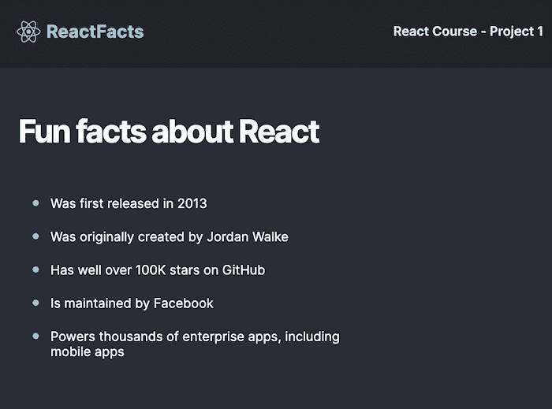
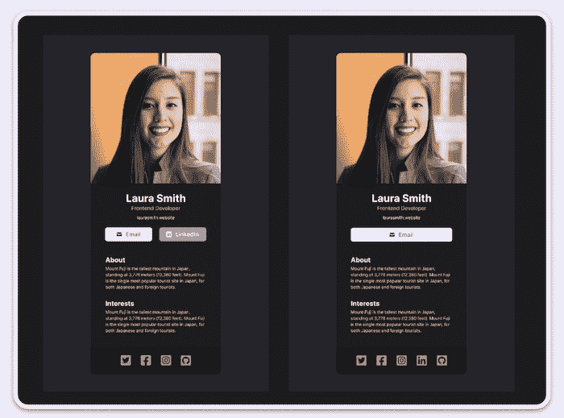
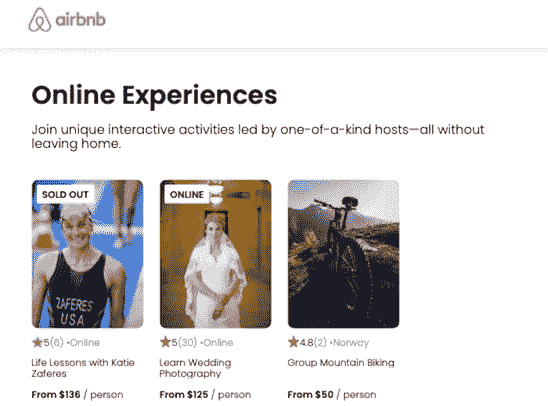
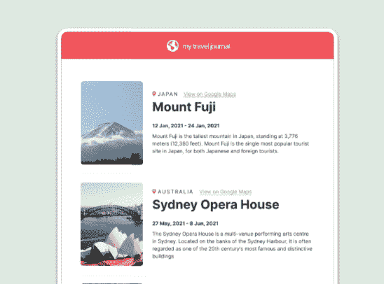
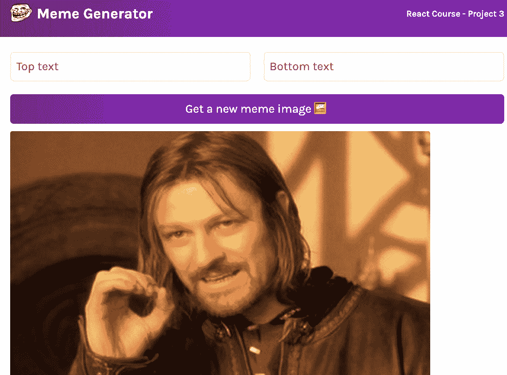
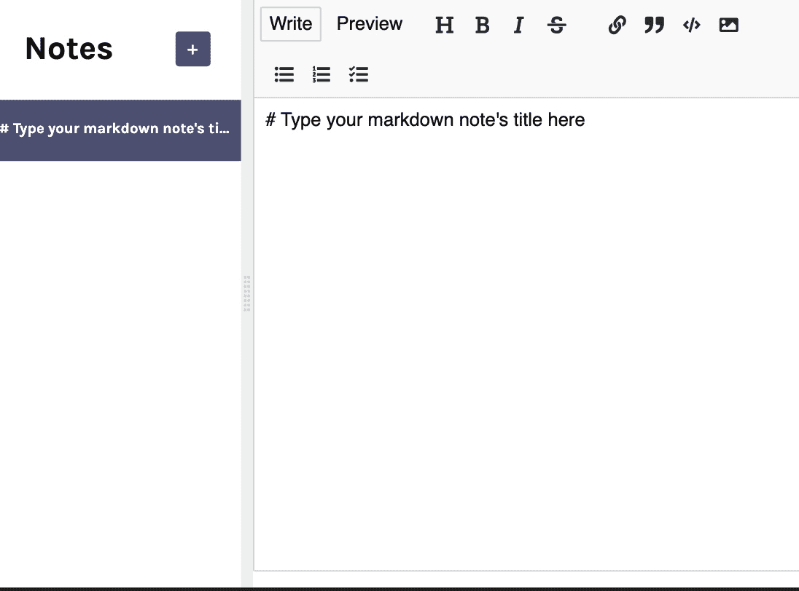
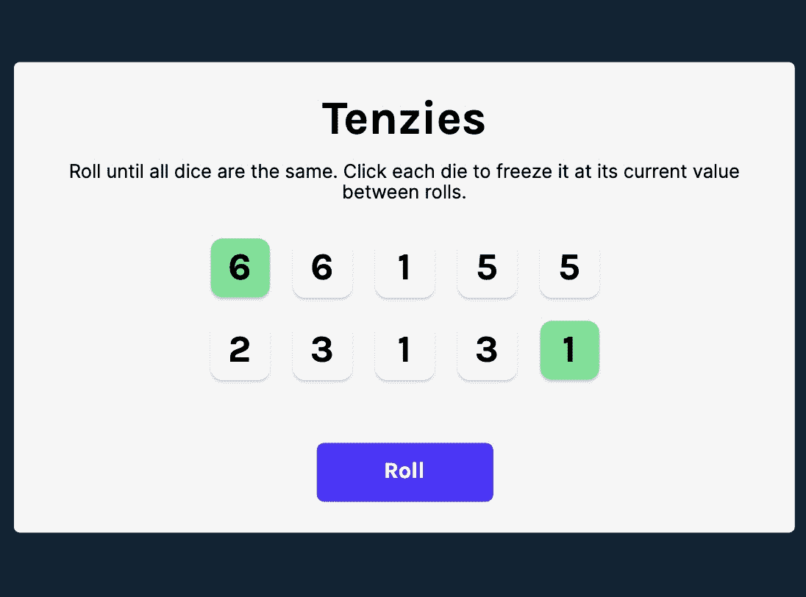
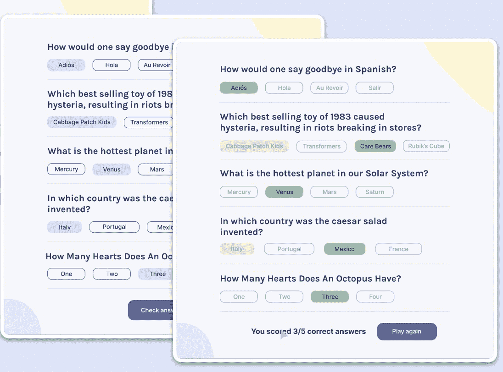

# 2022 年免费 React 课程

> 原文：<https://www.freecodecamp.org/news/free-react-course-2022/>

React 仍然是构建用户界面最流行的 JavaScript 库之一。如果你是前端开发者，知道 React 超级有帮助。

我们刚刚在 freeCodeCamp.org YouTube 频道上发布了一个全新的 12 小时 React 课程。在本课程中，您将通过构建八个真实项目和解决 140 多个编码挑战来做出反应。

鲍勃·齐罗尔教授这门课程。Bob 是 Scrimba 的教育主管，他之前的 React 课程是 YouTube 上最受欢迎的 React 课程之一。

以下是您将构建的项目:

### React facts 网站

你的第一个 React 应用将是一个关于 React 的静态网站！这向您介绍了库的基本原理。

React facts site.

### 个人项目:数字名片

你将通过完成你的第一个个人项目——一张数字名片——来结束第一部分。

Digital business card.

### AirBnB 体验克隆

通过创建 AirBnB Experiences 克隆，你将把你的 React 技能提升到一个新的水平。

AirBnb Experiences clone.

### 个人项目:旅行日志

你的第二个个人项目是旅行日记。

Travel journal.

### 热图生成器

在第 3 节中，Bob 将指导您构建他的经典热图生成器，其中更新了最新的 React 特性。

Meme generator.

### 便签应用

通过构建这个方便的 notes 应用程序，您将了解 React 的更多功能。

Notes app.

### 青少年游戏

你的第一个反应游戏将是流行的骰子游戏，Tenzies。

Tenzies game.

### 个人项目:问答游戏

在课程结束时，您将构建一个有趣的测验应用程序来巩固您所学的一切。

Quizzical.

以下是您将在本综合课程中了解的主题:

*   本地设置
*   为什么要反应？
*   JSX
*   reactdom.render()
*   定制组件
*   组织组件
*   可重用组件
*   JSX 境内的 JS
*   小道具
*   破坏道具
*   渲染数组
*   映射组件
*   关键道具
*   传递物体作为道具
*   传播物品作为道具
*   道具 vs 状态
*   useState
*   使用状态数组析构
*   改变状态
*   复杂状态
*   重构状态
*   传递状态作为道具
*   地方州
*   统一国家
*   条件渲染
*   反应形式
*   表单输入
*   表单状态对象
*   在 React 中提交表单
*   进行 API 调用
*   使用效果
*   useEffect 中的异步函数
*   带 React 的本地存储
*   惰性状态初始化

观看以下全部课程或在 freeCodeCamp.org YouTube 频道观看(12 小时观看)。

[https://www.youtube.com/embed/bMknfKXIFA8?feature=oembed](https://www.youtube.com/embed/bMknfKXIFA8?feature=oembed)