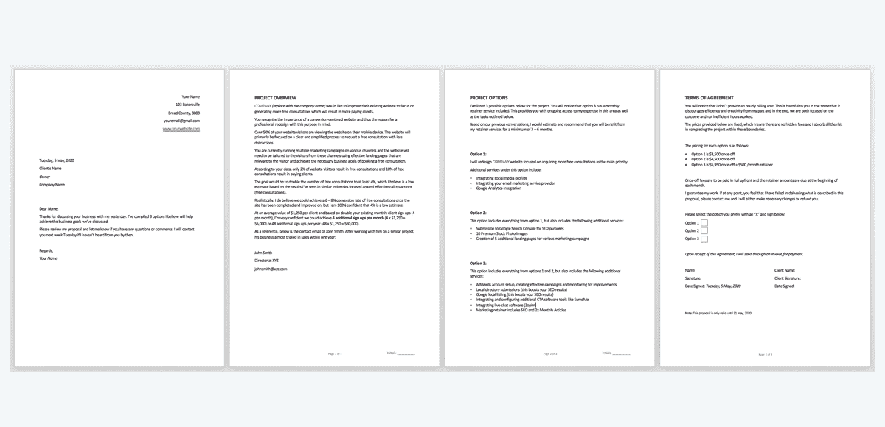
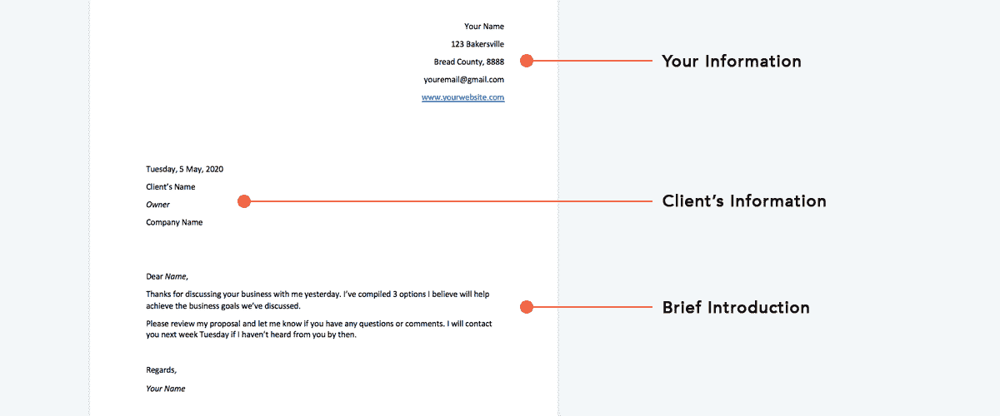
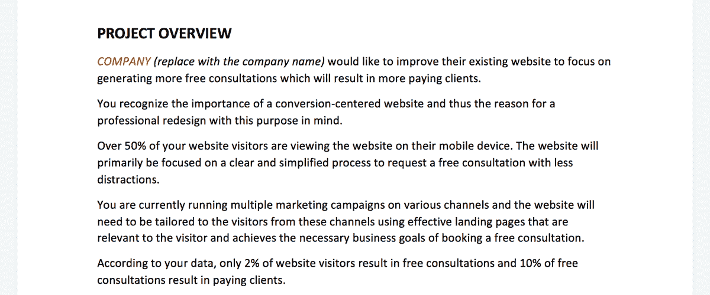
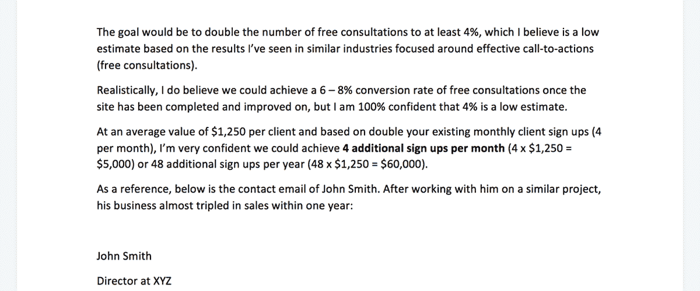
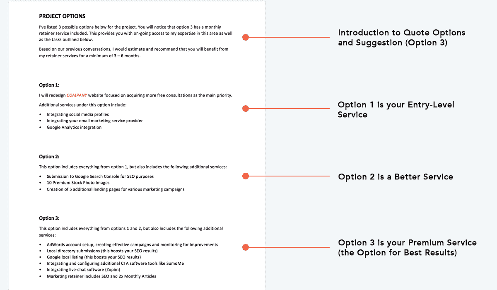

# 如何撰写赢得客户的自由职业建议书+免费模板

> 原文：<https://www.freecodecamp.org/news/free-web-design-proposal-template/>

您的潜在客户要求您向他们提供报价。所以你就把报价发给他们，对吗？

不对。

如果你这样做了，你将会错过一个巨大的机会。

在本文中，我将向您介绍提案前阶段，如何创建提案、发送提案，以及发送后该做些什么。

## 提案前阶段

在发送建议书之前，您需要了解一些事情。

这里有 10 个问题要问你的潜在客户:

1.  你的企业是做什么的？
2.  你理想的目标市场是谁？
3.  你希望网站访问者做什么？
4.  是什么让你从竞争对手中脱颖而出？
5.  一个普通的客户/顾客对你的企业有什么价值？
6.  你目前如何获得新客户/顾客？
7.  你平均每月有多少客户/销售额？
8.  你有专业形象和品牌形象吗？
9.  你希望这个项目什么时候完成？
10.  你还有什么想让我知道的吗？

一个小提示:如果你觉得客户的预算非常有限，而且对你来说没有利润，你可以问他们:“你是否为这个项目预留了预算，是否至少超过了 xxx 美元(插入你的绝对最低期望金额)？”这将证明进一步的提问是正确的，并帮助你决定是否应该麻烦发送一份提案。

一旦你有了所有这些信息，你就能创建一个完美的提案。

## 什么是提案模板？

A freelance proposal template

把它想象成一份你在会面后向潜在客户展示的文件，包括以下内容:

介绍/封面
项目概述(他们想要什么)
报价选项(总是提供 3 个选项)
协议条款(付款和交付条款)

这份文件展示了你对项目和业务需求的理解，以及你能为他们提供解决方案。

## 简介/封面

Proposal Template - Cover Page

## 分解项目概述

这是该提案最重要的方面。

您需要关注以下两个关键领域:

1.  突出问题
2.  展示解决方案

## 突出问题

Proposal Template - The Problem

首先要提到的是公司的目标，所以这是有关联的:

> “…改进您现有的网站，专注于产生更多的免费咨询，这将带来更多的付费客户。”

这表明你和你的客户是一致的。现在，我们强调当前的问题是:

> “根据你的数据，只有 2%的网站访问者会带来免费咨询，10%的免费咨询会带来付费客户。”

你在这里所做的事情表明，有一个主要问题需要解决，这将引导我们找到解决方案。

## 展示解决方案:

Proposal Template - The Solution

现在是时候提供一个解决方案了——如何帮助企业实现他们的目标。

### 你怎么知道解决方案是什么？

这是你需要更好地装备自己的地方，无论是从知识还是经验的角度来说。

最好的方法是阅读案例研究。你需要知道网站和营销不好的公司的例子，也需要知道网站和营销好的公司的例子。

假设一家保险公司找到你，要求你通过他们的网站增加他们的销售线索。

你需要做的是找出他们做对了什么，做错了什么，可以改进。

例如，您可能会在研究中发现，向“匿名”公司添加视频可以建立信任，并可以额外增加 5%的表单填写量。

或者，您可能发现他们的信息可以更好地呈现，他们需要客户证明，他们的网页加载时间太长，或者他们的营销需要改进。

无论它是什么，你需要了解它，唯一的方法就是阅读 CRO(转化率优化)的内容。

一些推荐的资源有 CrazyEgg、Kissmetrics、DigitalMarketer、Moz、CXL 和 Nielson Norman。

也就是说，基于您获得的知识或经验，您可以相应地定制解决方案。

在这种情况下，上述问题的解决方案可能是:

> “我们的目标是将免费咨询的数量增加一倍，至少达到 4%，根据我在类似行业中看到的围绕有效行动号召(免费咨询)的结果，我认为这是一个较低的估计。实际上，我确实相信，一旦网站建成并得到改善，我们可以实现 6-8%的免费咨询转化率，但我 100%相信 4%是一个较低的估计。
> 
> 平均每个客户价值 1，250 美元，基于您现有的每月客户注册量的两倍(每月 4 个)，我非常有信心我们可以实现每月 4 个额外注册量(4x 1，250 美元= 5，000 美元)或每年 48 个额外注册量(48x 1，250 美元= 60，000 美元)。”

这最后一段至关重要。我们现在做的是基于价值的价格锚定。

你可以在这里阅读更多关于定价[的内容，但重点是使用**潜在回报**和抵消，而不是针对项目的**价格，我们将在下面的要点中涉及这一点。**](https://studywebdevelopment.com/how-to-charge-for-a-website.html)

## 解释报价选项

Proposal Template - Pricing Options

总是给出 3 个选项供选择。

W.庞德斯通的书《无价之宝》讲述了一个有趣的销售啤酒的实验。

给一组人提供了两种啤酒:2.5 美元的优质啤酒和 1.8 美元的便宜啤酒。

几乎 80%的人选择了优质啤酒。

在这次测试之后，除了前两种啤酒之外，第三种超级廉价啤酒作为 1.60 美元的选项被添加进来。现在，80%的人买了 1.8 美元的啤酒，其余的人买了 2.5 美元的啤酒。没有人买最便宜的选项。

在第三次测试中，他们拿走了 1.60 美元的啤酒，换成了更贵的 3.40 美元的啤酒。大多数人选择了 2.50 美元的啤酒，少数人选择了 1.80 美元的啤酒，大约 10%的人选择了最贵的 3.40 美元的啤酒。

要点:大多数客户从不选择最便宜的选项。他们选择选项 2 或 3。

## 协议条款:

Proposal Template - Terms of Agreement

条款中的要点是你提到价格的地方。

你会注意到这是一次性费用，而且不是按小时计费的。我反对按小时计费，出于各种原因，我更喜欢一次性定价。

让我们记住，我们希望客户选择方案 2 或方案 3。

选项 2 应该只比选项 1 多 30%左右，因为它使这个选项看起来更有吸引力。

方案三应该比方案二高 20-40%，这也让方案二(中间选择)看起来更合理。

## 发送建议:

不要让这部分过程过于复杂。

让您的计划书模板在这里进行“讨论”。你所需要做的就是写一封直截了当的电子邮件，并附上建议书模板(PDF 版本)。

我喜欢在计划书模板封面上提到完全相同的介绍。

以下是一封电子邮件示例:

> 您好[客户名称]，
> 
> 感谢您昨天与我讨论您的业务。我总结了 3 个选项，我相信它们将有助于实现我们讨论过的业务目标。请审阅我的提案，如果您有任何问题或意见，请告诉我。如果到那时我还没有收到你的消息，我会在下周二联系你。
> 
> 问候，
> 你的名字

## 提议后阶段

我很惊讶地看到大多数开发人员没有充分利用这个阶段。

如果一周后你还没有收到他们的回复，你需要继续跟进，直到你得到肯定或否定的答复。

如果企业说他们不感兴趣(或没有兴趣)，那么找出**为什么**？

你的定价太高了吗？他们不理解你的价值吗？他们拒绝的理由是什么？

找出这一点，并相应地调整您的建议和沟通。

就是这样:)

我希望这篇文章对你有所帮助。

## 免费下载计划书模板。

这是完整的提案模板，你可以立即免费下载。

如果你觉得这篇文章有帮助，你可以在我的博客上阅读更多关于如何作为自由开发者获得客户的信息。如果你是认真的，我也有一个[流行的自由职业套装](https://studywebdevelopment.com/freelancing.html)。

感谢你的阅读和欢呼，

狭海峡