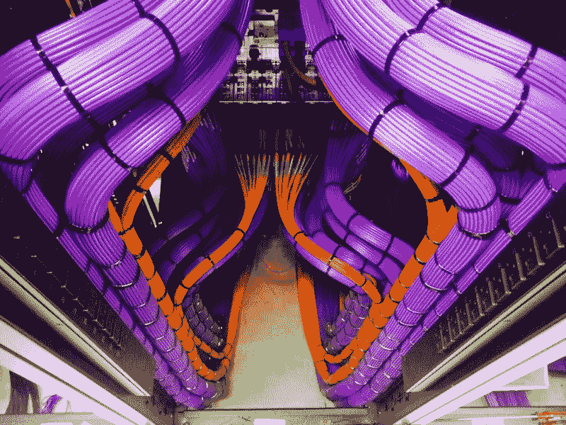

# 如何在公共网络上获得免费 wifi

> 原文：<https://www.freecodecamp.org/news/free-wifi-on-public-networks-daf716cebc80/>

凯尔·麦克唐纳

# 如何在公共网络上获得免费 wifi



[Photo Credit](https://www.reddit.com/user/chamorro671)

这个简短的教程描述了一些从公共无线网络接入互联网的方法，这是一项基本的人权。

本教程已经在 Mac 上测试过，应该可以在 Linux 上运行，还没有在 Windows 上测试过。

### 准备

确保在无法上网之前完成这一步*。*

1.  安装 [Python pip](https://pip.pypa.io/en/stable/installing/) 。
2.  制作此存储库的副本[，并为我们将使用的脚本安装依赖项:](https://github.com/kylemcdonald/FreeWifi)

```
git clone https://github.com/kylemcdonald/FreeWificd FreeWifi && pip install -r requirements.txt
```

### 如何获得额外的时间

如果你有免费的互联网接入，但你的时间用完了，第一件事就是打开一个隐姓埋名/私人窗口。以下是一些浏览器的说明:

*   [Chrome](https://support.google.com/chrome/answer/95464?source=gsearch&hl=en) (移动和桌面)
*   [iOS 版 Safari](https://support.apple.com/en-us/HT203036)
*   [Mac 版 Safari](https://support.apple.com/kb/ph21413?locale=en_US)
*   [微软 Edge](https://support.microsoft.com/en-us/instantanswers/34b9a3a6-68bc-510b-2a9e-833107495ee5/browse-inprivate-in-microsoft-edge)

匿名/私人窗口将暂时清除任何可能用于跟踪您在线时间的 cookies，使您看起来像一个“新用户”，并允许您再次登录无线门户。

不幸的是，大多数系统跟踪 MAC 地址而不是 cookies。MAC 地址是分配给每个网络接口的唯一标识符。这意味着你需要一个新的 MAC 地址来获得额外的时间。幸运的是，MAC 地址可以在软件中改变，而不需要更换硬件。`spoof-mac`命令行实用程序通过输入`sudo spoof-mac randomize Wi-Fi`使这变得容易。如果命令运行失败，尝试输入`spoof-mac list --wifi`来检查你的无线设备的名称，然后手动使用。随机化您的 MAC 后，尝试再次登录无线门户。当您使用完互联网后，运行`sudo spoof-mac reset Wi-Fi`来重置您的 MAC 地址。

请注意，MAC 地址欺骗可能会被解释为非法活动，这取决于您这样做的原因。在某些情况下，这肯定不是非法的:最近的移动操作系统，如 iOS 8+和 Android 6+在搜索无线网络时会自动随机化其 MAC 地址，以避免被跟踪。但是当[艾伦·施瓦茨解放 JSTOR](https://en.wikipedia.org/wiki/MAC_spoofing#Controversy) 时，MAC 地址欺骗被宣称为意图犯罪的信号。

### 如何获得免费访问

如果网络是开放的，但由于某种原因您无法访问，您也可以尝试假冒已经在使用该网络的设备的 MAC 地址。对路由器而言，您的设备和另一台设备看起来就像一台设备。如果它们互相打断，这可能会导致一些小问题，但对于轻度浏览来说，通常会很好。

要查找使用网络的其他设备的 MAC 地址，首先您需要连接到网络。你不需要有互联网接入，只需要一个连接。首先，在 Mac OS 上运行命令`sudo chmod o+r /dev/bpf*`一次，以确保您可以嗅探无线数据(如果您重新启动计算机，您需要再次这样做)。

然后在您的终端中，运行命令`python wifi-users.py`。您应该会立即看到进度条:

```
SSID: nonoinflightGateway: 00:e0:4b:22:96:d9100%|██████████████████████████| 1000/1000 [00:46<00:00, 21.46it/s]Total of 5 user(s):27:35:96:a8:66:7f   6359 bytes36:fe:83:9c:35:eb   9605 bytes65:01:3c:cc:20:e8   17306 bytes8c:6f:11:2c:f0:ee   20515 bytes0a:4f:b2:b8:e8:56   71541 bytes
```

如果网络流量不大，可能需要更长时间。如果花费的时间太长，键入`CTRL-C`取消嗅探并打印任何可用的结果。最后，我们想要伪造其中一个 MAC 地址。例如，在这种情况下，我们将输入`sudo spoof-mac set 0a:4f:b2:b8:e8:56 Wi-Fi`来尝试欺骗流量最大的地址(它们可能有连接)。

运行此命令后，尝试访问互联网。如果您没有连接，请尝试列表中的下一台 MAC。如果您的互联网连接在使用此 MAC 地址时中断，请尝试断开并重新连接到无线网络。请注意，如果你们都在积极使用网络，您复制的 MAC 的原始用户可能会遇到这些相同的连接中断。

### 它是如何工作的

`wifi-users.py`使用`tcpdump`收集无线数据包。然后，我们在这些数据包中寻找无线网络 MAC 地址(BSSID)的任何线索。最后，我们寻找提到用户的 MAC 以及网络 BSSID(或网络网关)的数据包，并使用一些数据记录该 MAC。然后我们把用户的 MAC 按照数据总量排序，打印出来。

除了嗅探无线流量，在某些情况下，您还可以使用命令`arp -a`来获取无线网络上设备的 MAC 地址列表。然后你可以使用`spoof-mac`来复制地址，或者在 Linux 和 OSX 上直接使用`ifconfig`。关于使用`ifconfig`的细节，请看 [SpoofMac 的 interfaces.py](https://github.com/feross/SpoofMAC/blob/master/spoofmac/interface.py) 中`set_interface_mac`的实现。

这篇文章是献给劳伦·麦卡锡的，她教会了我达成一笔好交易的艺术。