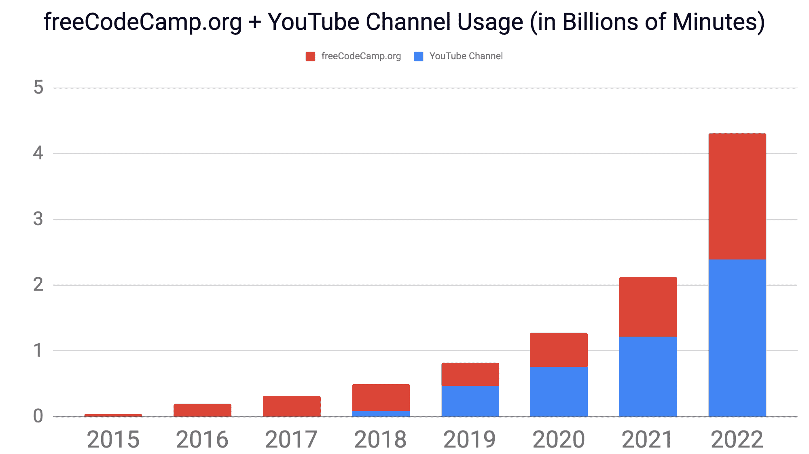
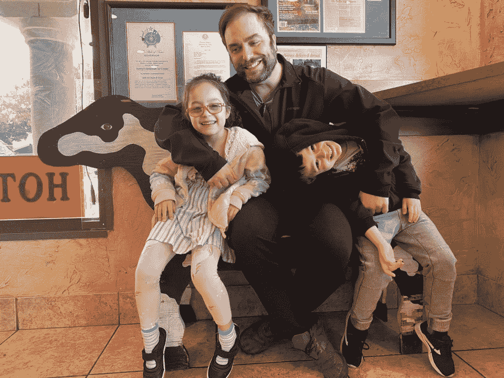

# 2022 年，人们花了 40 亿分钟在免费代码营学习

> 原文：<https://www.freecodecamp.org/news/freecodecamp-2022-usage-statistics/>

那就是 8000 年。那是很多学问。

2022 年对于 freeCodeCamp 社区来说是重要的一年。世界各地的人们都在使用 freeCodeCamp 来扩展他们的技能和促进他们的职业发展。

以下是 freeCodeCamp 社区的四个主要支柱的网站使用分类:/learn(课程)、/news(出版物)、社区论坛和社区 YouTube 频道。

```
+---------+-------------+---------------+---------------+
| Pillar  |    2020     |     2021      |     2022      |
+---------+-------------+---------------+---------------+
| /forum  |  71,977,609 |   103,959,476 |   116,060,348 |
| /learn  | 308,290,683 |   471,104,018 |   622,195,468 |
| /news   | 246,329,943 |   331,995,923 | 1,196,199,035 |
| YouTube | 764,332,218 | 1,217,082,060 | 2,386,030,860 |
+---------+-------------+---------------+---------------+
```

A table of freeCodeCamp's 4 "pillars" in total learner-minutes for 2020, 2021, and 2022

请注意，所有这些数字都直接来自谷歌分析和 YouTube 分析。

还要注意的是，这并不包括所有使用 [freeCodeCamp 的 Android 应用](https://www.freecodecamp.org/news/freecodecamp-mobile-app-curriculum-update/)，在[DeveloperQuiz.org](https://developerquiz.org)上测试自己，收听[代码电台](https://coderadio.freecodecamp.org/)，或者玩[学习编码 RPG](https://www.freecodecamp.org/news/learn-to-code-rpg/) 的人。

看到这么多人在使用我们社区的免费学习资源，真是太疯狂了。为了给你准备这份报告，我每年看着这些数字都要掐自己一把。

但是我记得挑战的规模。世界上有那么多忙碌的成年人在努力学习新技能。

人们正在自学如何使用 SQL、Linux、电子表格和脚本语言等工具。他们正在提高自己的数学技能和职场英语技能。

freeCodeCamp 社区仍然有很大的发展空间，我们可以帮助很多学习者。

我们会在已经忙碌的地方继续遇见他们。在哄孩子睡觉或完成一天的工作后，帮助他们按照自己的时间表学习。



freeCodeCamp 社区的四大支柱今年都有所增长。自 2016 年以来，我们的使用量平均每年增长 60%，今年我们不知何故增长了 100%以上。

我们在 8 年前首次推出了 freeCodeCamp.org，现在已经提供了近 100 亿分钟的指令。


The closet office in my San Francisco Bay Area area apartment where I coded the first lines of the freeCodeCamp open source codebase back in October 2014\. Update: I now have an entire room to work in. With a window.

在我们目前的运营效率水平下，[你捐给 freeCodeCamp](https://www.freecodecamp.org/donate) 的每一美元都可以为世界各地的人们提供几十个小时的学习机会。

我要感谢数百位善良的人们，他们今年自愿为社区贡献了他们的时间和才能。谢谢你。我们编制了一份 2022 年[最佳贡献者](https://www.freecodecamp.org/news/freecodecamp-2022-top-contributors/)名单。

我还要感谢现在每月向我们的慈善机构捐款的 8384 位好心人。平均捐款额是 5 美元，这个数字很快就增加了。

如果你想支持我们的慈善事业和我们的使命，[成为每月支持者](https://www.freecodecamp.org/donate)。我们是一个 501(c)(3)非营利组织，所以你可以从你的税收中扣除你的捐款。



Me with the kids: Jocelyn and Quentin. They'll learn to code when they feel ready :)

再次感谢您成为 freeCodeCamp 社区的一员。祝你假期愉快。