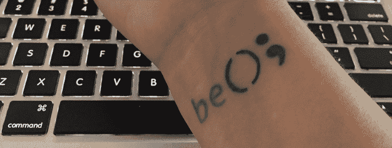
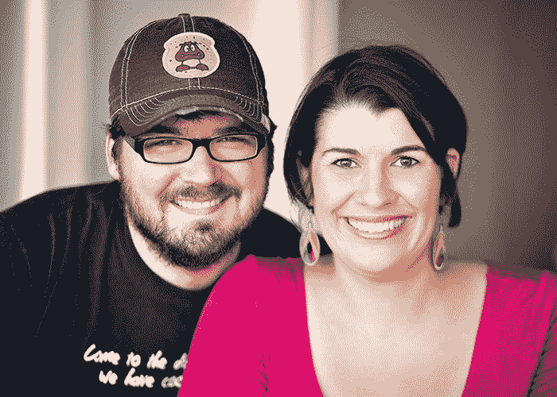

# FreeCodeCamp 和 JavaScript 纹身

> 原文：<https://www.freecodecamp.org/news/freecodecamp-and-the-javascript-tattoo-a3770c547a9d/>

安德烈·古莱特

# FreeCodeCamp 和 JavaScript 纹身

Since enrolling in FreeCodeCamp and getting my tattoo, I have yet to be asked “So, do you code?”

“哇！你的软件生意听起来很棒，安德里亚。那么，告诉我…你也编码吗？”

在过去的六年里，每当我听到这个问题，我的信心都会受到打击。

别介意我是从零开始建立网站的。

不要介意我已经围绕现代化代码库发展了一项业务。

更不用说可以自信地描述诸如降低圈复杂度、重构复制、在源代码控制中使用分支或者测试驱动开发(TDD)之类的技术。

对大多数人来说，我看起来不像一个软件开发人员。因此，当人们遇到我时，会有一个可怕的问题:“那么，你编码吗？”

Me and my business partner. He never gets asked if he knows how to code. Me? All the time.

作为一名高成就者，[我特别容易患上冒名顶替综合症](http://www.forbes.com/sites/margiewarrell/2014/04/03/impostor-syndrome/)，我生活中感到最脆弱的领域是我的技术技能。所以，当有人问我是否编码时，感觉就像在肚子上打了一拳。即使这个问题的答案是明确的“是”，我有时候还是觉得自己像个骗子。

今年，我决定不再这样了。我决心摆脱这种不够好的想法，认真寻找一个项目来帮助我实现我的目标。事实证明，这比我最初想象的更具挑战性。以下是我的标准:

1.  **没有搬迁。**我的家庭太重要了。我有几个小孩，我还在给其中一个喂奶。我们镇上有很多家庭，依靠他们来照顾孩子。离开我的家乡根本不是一个选择。
2.  **自定进度。**我拥有一家企业，经营是首要的。获得认证是成功的必备条件，而不是必须条件。我需要找到一种方法，将这个项目融入到经营企业和抚养孩子的过程中。
3.  **目前的技术。拥有一家软件公司实际上给了我一个很好的视角，让我了解现在大学在教什么。不幸的是，大多数课程都远远落后于时代。我需要确保我所学到的东西适用于我在业务中看到的问题。**
4.  参与现实世界的项目。当我带着真正的问题学习并从中受益时，我做得最好。理论是伟大的，但它只到此为止。
5.  **团体感。作为一个外向的人，每天把自己锁在房间里八个小时来解决问题是一个真正的挑战。我知道如果我要成功，这个项目必须和我能联系到的其他学生的社区联系起来。**

经过大量的寻找和试错，我报名参加了 [FreeCodeCamp](http://www.freecodecamp.com/) 。这有我一直在寻找的所有功能，外加[对学生](http://blog.freecodecamp.com/2014/10/free-code-camp-doesnt-make-money-and.html)完全免费的好处。在经历了六个月的项目后，我为自己取得的进步感到兴奋。作为自由代码营的一名学生，以下是我最喜欢的一些事情:

1.  **看清大局**。我是一个战略家，所以当我能先看到大局，然后再深入细节时，我做得最好。我喜欢 FreeCodeCamp 如何展示[他们整个项目的详细地图](http://www.freecodecamp.com/map)。这给了我一种进步感。
2.  为像我这样的人建造。领导 FreeCodeCamp 团队的昆西·拉森写了关于[他患有冒名顶替综合症的经历](http://www.businessinsider.com/learning-how-to-code-imposter-syndrome-2014-11)。FreeCodeCamp 的许多特性都是因为昆西正在应对一些和我一样的挑战而产生的。
3.  **经营得很好。昆西管理严谨。FreeCodeCamp 的交流和他们创造的社区意识给我留下了深刻的印象。他们是透明的，定期分享有价值的信息。他们有很多参与点，所以即使我想放弃的时候，它也能让我坚持下去。**
4.  **小而常赢。**每个模块在开始时都有一个非常离散的任务。这帮助我快速行动并建立了我的自信心。它还帮助我发现了一些模式，并获得了许多其他程序所没有的灵感。
5.  **面对面的联系。**拥有在线社区很棒，但我喜欢 FreeCodeCamp 鼓励人们面对面聚会的方式。上个月，我在[当地的合作空间](http://www.meetup.com/804RVA/events/224647575/)协调了一次活动。30 个人出现了，我能够指导那些刚刚起步的人。教学是最好的学习形式之一。

当我开始通过 FreeCodeCamp 项目时，我的信心增长了。以至于今年我决定在手腕上纹一个 JavaScript 函数作为生日礼物。现在，当我开始觉得自己是个冒名顶替者时，我低头看看我的手腕，意识到我可以成为我想成为的任何人。我的生活没有定义。这种自信的提升通常正是我在学习新事物的不适中需要的，并专注于解决问题。

现在，如果你不介意的话，我要写些代码。

[*安德里亚·古莱特*](https://twitter.com/andreagoulet) *是 [Corgibytes](http://corgibytes.com) 的首席执行官，这是一家致力于代码库现代化的软件开发公司。她经常谈到作为一名软件行业女性所面临的挑战，并喜欢在她当地的合作空间举办 [FreeCodeCamp](http://www.freecodecamp.com) 活动。她喜欢看她的孩子探索世界，并且非常喜欢一部好的物理纪录片。你可以通过她手腕上的 JavaScript 纹身认出她。*