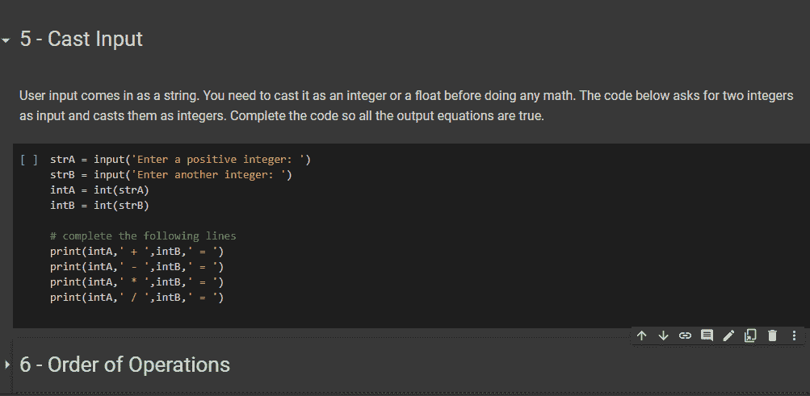
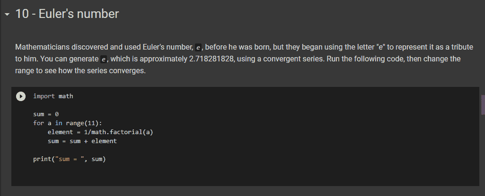

# 在免费代码营学习基础数学——互动数学课程公测版

> 原文：<https://www.freecodecamp.org/news/freecodecamp-foundational-math-curriculum/>

要不要用 Python 解数学题？然后，freeCodeCamp 的新基础数学课程将指导您学习为数据科学课程做准备所需的基本数学知识。

你会得到一个数学复习扭转。您将学习如何编写 Python 代码来为您完成所有计算，而不是使用铅笔、纸张或图形计算器。

一步一步地构建，您将创建可以用作个人超级计算器的项目。本课程使用类似于 Jupyter 笔记本的 Google Colaboratory，在您的 Google Drive 中编写和执行 Python 代码。

有了 Google Colab 应用程序，你甚至可以在手机上编写和运行代码。如果你不熟悉 Google Colaboratory，[这里有一篇关于如何设置它的文章](https://www.freecodecamp.org/news/google-colaboratory-python-code-in-your-google-drive/)。

这只是开始。作为我们即将到来的数据科学课程扩展的一部分，我们正在稳步构建更多以数学和 Python 为重点的课程。

## 为什么数学对开发者有用？

这种代数级别的数学将直接关系到您作为开发人员在工作中进行的统计和数据分析的计算。我们称之为“基础数学”,因为在开发其他应用程序时，您将基于这些技能。

使用坐标将帮助您规划场景或页面的布局。距离公式和角度计算将有助于你的游戏开发(和邻近检测)。

在循环中增加和测试数值将有助于您根据初始值和趋势进行预测。求解未知值将有助于您进行财务规划和商业软件开发。

因为代码(或生活)的任何方面都可以是数字，所以数学是描述关系的语言。你会在数字中发现更深的智慧。

## 我们将在本课程中涵盖的内容

在本课程中，您将学习如何编写代码来显示几乎任何函数的图形，计算几乎任何公式，以及“求解 x”。您还将构建一个将来可以使用和修改的丰富资源。

在课程结束时，你将对数学中的关键概念有一个坚实的理解，你也将拥有自己的应用这些概念的 Colab 笔记本库。

下面是一个早期步骤的示例:

像许多 freeCodeCamp 课程一样，本课程有五个部分。本课程的五个部分都指向一个认证项目，该项目汇总了您在前面步骤中学到的内容。

以下是课程快结束时的一个例子，用来说明学习是如何以可管理的步骤进行的:

## Python 数学课程大纲

在本课程中，你将经历从代数到 Y 轴(Z 轴将在后续课程中出现)的主要数学主题。这个课程还在 beta 测试中，所以我邀请你试用一下，并在论坛中留下评论。

最终，我希望人们讨论数学并为彼此创建 Python 脚本。如果您有 Python 的基础知识，您将能够浏览本课程。

以下是对每个部分的描述，以及指向 Colab 笔记本的链接:

### 第 1 部分–Python 中的数学

一开始，您将在对 Python 的基本理解的基础上，向您展示如何处理输入和应用数学公式。你甚至会学习如何用代码“求解 x”。

*   [第 1 部分的 Colab 笔记本](https://colab.research.google.com/drive/1jT7atuRCOnkdPyDmlgKVJqxouDSx7Ioh)

### 第 2 部分–图表

在这一部分中，您将重点关注图形。您将学习如何绘制点、线和函数。您还将学习如何创建表格和交互式图表。

*   [第二部分的 Colab 笔记本](https://colab.research.google.com/drive/1BHKshb67jWVVZQ9VlzQOpdFA-gzJkSUF)

### 第 3 部分–高等数学

现在，您将深入学习多项式、指数函数和更复杂的公式。您将编写代码来计算抵押付款、估计退休帐户余额，以及做其他有用的事情。

*   [第 3 部分的 Colab 笔记本](https://colab.research.google.com/drive/1zUAVAkwyjat4Z-8nfrajM1ut9UcO18We)

### 第 4 部分-角度和三角学

这一部分将教你如何为图形上的线条和角度编写代码。您将使用三角学来寻找距离、中点和角度。包括动画图表。

*   [第 4 部分的 Colab 笔记本](https://colab.research.google.com/drive/1ildYndIoPIqUV8LPF-CBzQ1AKsAYd5HT)

### 第 5 部分–序列和求和

这一节将带你经历序列和系列计算，然后进入概率。在这个过程中，你将学习求和与计数的原理。

*   [第 5 部分的 Colab 笔记本](https://colab.research.google.com/drive/14Kafh-xYNupr9HrX08uOzgxWJy30xjei)

## 超越木星笔记本

德州仪器 TI-84 计算器最新版本可以运行 Python 代码！TI-84 是任何涉及图形和公式的班级学生的“首选”计算器。你可以在电脑上编写程序，然后在计算器上运行。在本课程中，您将发展自己的数学和 Python 技能来做到这一点。

现在，我们仍然称之为课程的“测试版”,甚至这可能有点乐观。我们将继续改进这些内容，欢迎您的反馈。

我的目标是，这仅仅是一个开始，我们都在谷歌联合实验室中创建更多的笔记本、脚本和功能，并相互分享。

对了，我叫 Ed，教了 18 年高中生，15 年大学生。我创建了这个课程。你可以把你在 ed@freecodecamp.org 的想法发邮件给我，我会把它们分享给 freeCodeCamp 的教师团队。感谢你加入我的旅程。