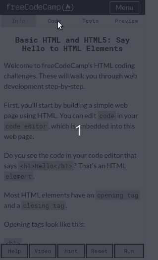
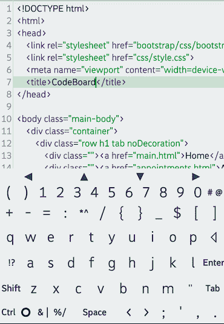
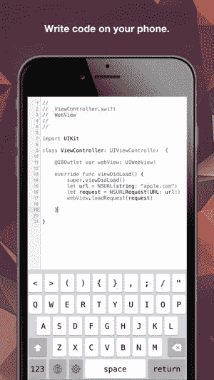

# 如何在手机上使用 freeCodeCamp

> 原文：<https://www.freecodecamp.org/news/freecodecamp-mobile/>

五年来，freeCodeCamp 已经帮助数百万人学习为...良好的...免费！

低成本为那些负担不起训练营或许多昂贵课程的人打开了一个机会之门。然而，对于一些人来说，有一个进入的障碍——必须使用笔记本电脑/台式电脑。

在移动设备上编写 freeCodeCamp 代码已经成为可能，但这从来都不是一种舒适的体验——直到今天！

随着 freeCodeCamp 的 5 岁生日到来，开发者社区得到了一份美妙的礼物:新的*命令行界面，它包括了比以前更好的移动体验。*

The new responsive command line chic interface, with a clean mobile text editor

## 充分利用移动编码

也许你以前尝试过在 freeCodeCamp 上使用移动设备进行编码，并注意到一个令人讨厌的 bug——无法正确删除东西！

如果您遇到了这种情况，问题的原因很简单——您的键盘建议将单个字符视为更长的字符串。我没有详细研究过这个，但是我的直觉是它在删除 html 实体代码。

解决方法很简单——关闭自动建议，或者更好的是**为你的设备**使用专用的编码键盘。

这有一个额外的好处，就是让你在编程中经常使用的键(不是自然语言)更容易使用，比如括号、大括号和其他特殊字符。

## 为您的移动设备编码键盘

CodeBoard for Andoid

[CodeBoard for Android](https://play.google.com/store/apps/details?id=com.gazlaws.codeboard) 提供了一个打包的键盘，包含你在完成 freeCodeCamp 课程时可能需要的所有按键。该板在手机上有点太拥挤了(尽管我仍然使用它，并已经习惯了)，但在平板电脑上它是一个完美的伴侣。

DevKey for iOs

iOs 版的 DevKey 呈现了一个不那么拥挤的界面，同时仍然提供了你可能需要的大部分按键。我个人不能认可这一点，因为我没有 iPhone——但不用说，它比标准键盘提供了更好的移动编码体验。

## 随时随地编码！

现在，您已经增强了移动学习环境，无论您去哪里，您都可以带着这些免费代码营课程，而不需要从您的手机上取下笨重的笔记本电脑。

我非常期待的一件事是使用新的界面和我的移动设置来增加我在[免费代码营论坛](https://freecodecamp.org/forum)的参与度！我总是主要在手机上参与论坛，但由于之前糟糕的移动体验，我一直在努力帮助解决编码挑战。现在，你可以期待从我和其他人那里得到更多的帮助！

祝大家生日快乐，自由代码营，快乐编码！

你可以在 Twitter [@JacksonBates](https://twitter.com/jacksonbates) 上关注我的非正式技术漫谈！