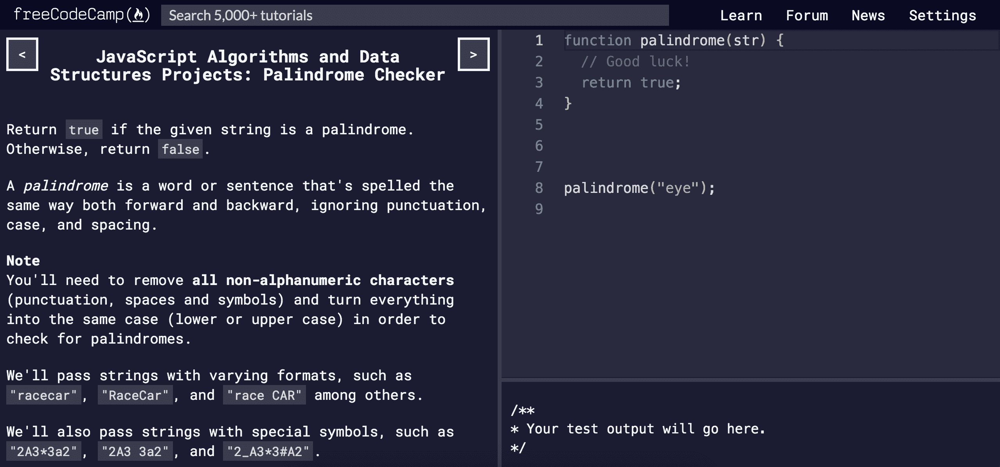
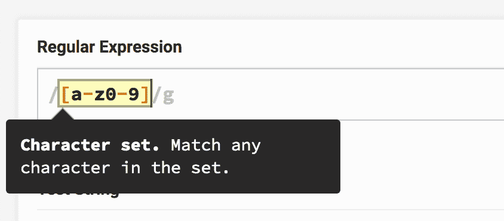
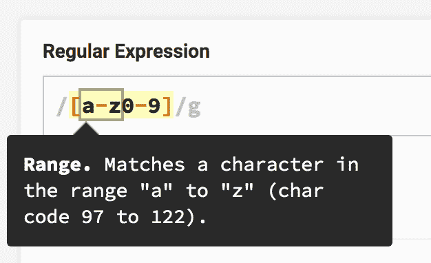
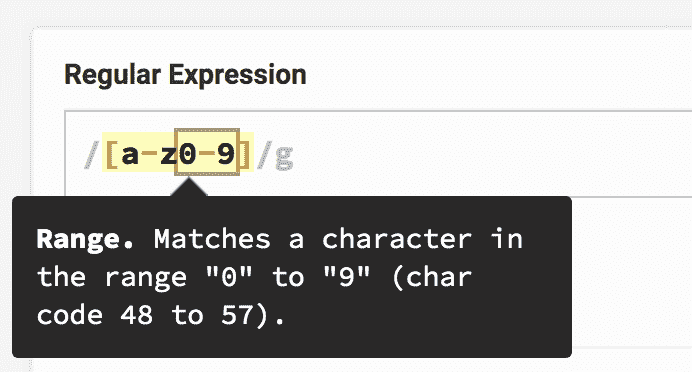
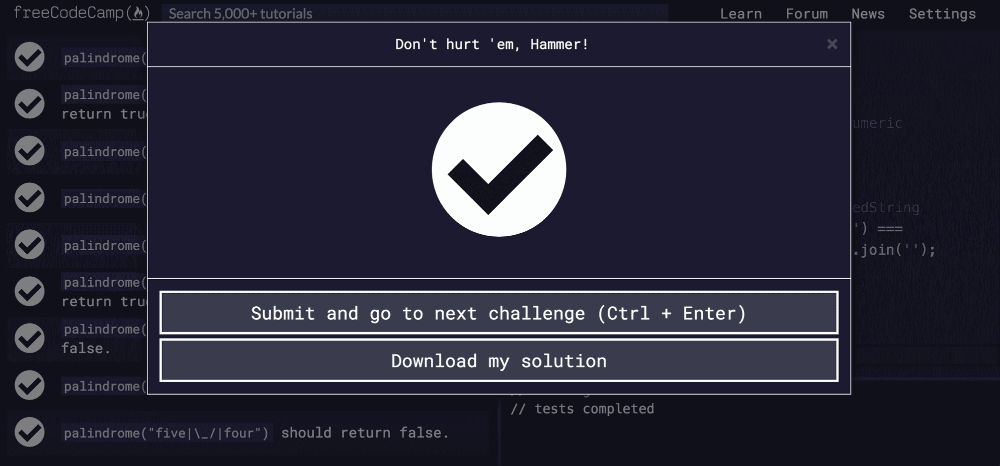

# FreeCodeCamp 回文检查器项目的演练

> 原文：<https://www.freecodecamp.org/news/freecodecamp-palindrome-checker-walkthrough/>

来自 JavaScript Algos 和 DS 认证的项目 1。

这是我的漫游的博客版本。如果你喜欢视频[，这里有 YouTube 视频链接](https://youtu.be/XV5OCibNpLI)。

## 挑战



编写一个名为`palindrome`的函数，它接受一个字符串`str`。如果`str`是回文，返回`true`，否则返回`false`。

## 什么是回文？

回文是一个正反读都一样的单词。一些例子是

*   眼睛
*   赛车
*   一个人，一个计划，一条运河——巴拿马！

无论你从左到右还是从右到左阅读，你都会得到相同的字符序列。我们将忽略标点符号，如逗号、句号、问号、感叹号和大小写。

## 第 0 步-远离代码

我喜欢在任何面试或工作中必须解决的问题中保持这种心态。首先匆忙编写代码通常是一种失败的策略，因为现在你必须在解决问题的同时考虑语法。

> 代码应该放在最后

不要让你的紧张情绪战胜你。与其疯狂地寻找解决方案并升高血压，不如深呼吸，试着把它写在白板或笔记本上。

一旦你想出了一个解决方案，代码就变得简单了。所有的努力都发生在你的头脑和笔记中，而不是键盘上。

## 步骤 1 -平衡所有套管

一个回文是有效的，不管它的大小写是向前还是向后。所以“Racecar”是有效的，尽管它在技术上是反过来拼写“racecaR”。

为了防止任何大小写问题，我将添加一个注释，说明我们将所有内容都小写。

这是我目前为止的代码(注意我还没有写真正的代码)。

```
function palindrome(str) {
  // 1) Lowercase the input
}

palindrome("eye"); 
```

## 步骤 2 -去除非字母数字字符

就像大小写一样，即使标点和空格前后不一致，回文也是有效的。

例如“一个人，一个计划，一条运河——巴拿马！”是有效的，因为我们检查它没有任何标记或空格。如果你这样做，把所有的字母都小写，就变成了这个。

```
"A Man, A Plan, A Canal – Panama!"

// lowercase everything
// strip out non-alphanumeric characters

"amanaplanacanalpanama" 
```

前后读起来是一样的。

### 字母数字是什么意思？

它的意思是“字母和数字”，所以从 a-z 到 0-9 的任何东西都是字母数字字符。为了正确检查我们的输入，非字母数字字符(空格、标点符号等)必须删除。

这是我们更新的伪代码。

```
function palindrome(str) {
  // 1) Lowercase the input
  // 2) Strip out non-alphanumeric characters
}

palindrome("eye"); 
```

## 步骤 3 -将字符串与其反码进行比较

一旦我们的字符串被适当清理，我们可以翻转它，看看它是否读取相同。

我在想沿着这条线做一个比较

```
return string === reversedString 
```

我在 JavaScript 中使用三重等号(`===`)进行比较。如果两个字符串相同，这是一个回文，我们返回`true`！如果没有我们返回`false`。

这是我们更新的伪代码。

```
function palindrome(str) {
  // 1) Lowercase the input
  // 2) Strip out non-alphanumeric characters
  // 3) return string === reversedString
}

palindrome("eye"); 
```

## 执行步骤 1 -小写

这是最简单的一步。如果你不确定如何在 JavaScript 中使用小写字母，在谷歌上快速搜索应该会找到`toLowerCase`方法。

这是一个在所有字符串上都可用的方法，所以我们可以在做任何事情之前用它来小写我们的输入。

我将把小写版本存储在一个名为`alphanumericOnly`的变量中，因为我们最终也将删除字母数字字符。

```
function palindrome(str) {
  // 1) Lowercase the input
  const alphanumericOnly = str.toLowerCase();

  // 2) Strip out non-alphanumeric characters
  // 3) return string === reversedString
}

palindrome("eye"); 
```

## 执行步骤 2 -仅字母数字

我们必须深入一点，因为这是最困难的一步。我们到底要如何净化一串非字母数字字符呢？

### 的。匹配方法

就像`toLowerCase`所有的字符串都支持一个叫做`match`的方法。它接受一个参数，该参数指示您希望在给定的字符串中查找什么字符。

让我们以我的名字为例。

```
myName = 'yazeed';

myName.match('e');
// ["e", index: 3, input: "yazeed", groups: undefined] 
```

如你所见,`.match`返回一个包含一些信息的数组。我们关心的部分是第一个元素，`'e'`。这就是我们在字符串`'yazeed'`中找到的匹配。

但是我的名字有两个 e！我们如何匹配另一个？

### 正则表达式(Regex)

`.match`方法的第一个参数可以是一个*正则表达式*。

> 正则表达式-定义搜索模式的字符序列。也称为“Regex”。

将参数放在正斜杠之间，而不是字符串的引号。

```
myName = 'yazeed';

myName.match(/e/);
// ["e", index: 3, input: "yazeed", groups: undefined] 
```

我们得到同样的结果，所以谁在乎呢？看看这个，regex 允许我们添加*标志*。

> Regex 标志——一个指示符，告诉 Regex 做一些特殊的事情。

```
myName = 'yazeed';

myName.match(/e/g);
// ^^ Notice the little g now ^^
// ["e", "e"] 
```

我们拿回了所有的 e！如果你尝试一个 a 或者 z，你会得到一个只有一个匹配的数组。有道理。

```
myName.match(/a/g);
// ["a"]

myName.match(/z/g);
// ["z"] 
```

### 查找所有字母数字字符

所以 regex 不仅匹配模式，还可以匹配同一种模式的*多个*！这听起来很适合我们算法的下一步。

如果您搜索一下，这可能是您找到的匹配所有字母数字字符的正则表达式。

```
/[a-z0-9]/g 
```

你看到的是字母数字的定义。这个正则表达式可以分为 3 个部分。

1.  字符集`[]` -匹配这些括号之间的任何字符。
2.  `a-z` -匹配所有小写字母
3.  `0-9` -匹配所有号码

在`myName`上运行它会返回每个字母的数组。

```
myName = 'yazeed';

myName.match(/[a-z0-9]/g);
// ["y", "a", "z", "e", "e", "d"] 
```

让我们用项目的一个测试用例来尝试一下。这个他们认为是回文的疯狂的例子怎么样？

```
crazyInput = '0_0 (: /-\ :) 0-0';

crazyInput.match(/[a-z0-9]/g);
// ["0", "0", "0", "0"] 
```

哇，没有疯狂的字符，它只是四个零。是的，这是一个回文！我会更新我们的代码。

```
function palindrome(str) {
  const alphanumericOnly = str
        // 1) Lowercase the input
        .toLowerCase()
        // 2) Strip out non-alphanumeric characters
        .match(/[a-z0-9]/g);

  // 3) return string === reversedString
}

palindrome("eye"); 
```

## 执行步骤 3 -将字符串与其反向进行比较

记住`.match`返回一个匹配的*数组*。我们如何使用这个数组来比较我们清理过的字符串和它的反串呢？

### 数组.反转

`reverse`方法名副其实，反转数组的元素。

```
[1, 2, 3].reverse();
// [3, 2, 1] 
```

这看起来很有用！在匹配了所有的字母数字字符后，我们可以翻转数组，看看是否一切都还正常。

但是比较数组不像比较字符串那么简单，那么我们如何将数组匹配转换回字符串呢？

### 数组.连接

`join`方法将数组的元素缝合成一个字符串，可以选择使用一个*分隔符*。

分隔符是第一个参数，您不需要提供它。它基本上会“字符串化”你的数组。

```
[1, 2, 3].join();
// "1,2,3" 
```

如果您提供了它，分隔符将出现在每个元素之间。

```
[1, 2, 3].join('my separator');
// "1my separator2my separator3"

[1, 2, 3].join(',');
// "1,2,3"

[1, 2, 3].join(', ');
// "1, 2, 3"

[1, 2, 3].join('sandwich');
// "1sandwich2sandwich3" 
```

让我们看看这将如何适应我们的算法。

```
'Ra_Ce_Ca_r   -_-'
    .toLowerCase()
    .match(/[a-z0-9]/g)
    .join('');

// "racecar" 
```

看看这样做是如何简单地重新创建没有标点符号或混合大小写的原始字符串的？

如果我们逆转它呢？

```
'Ra_Ce_Ca_r   -_-'
    .toLowerCase()
    .match(/[a-z0-9]/g)
    // flip it around
    .reverse()
    .join('');

// "racecar" 
```

那是回文！我的名字不会是回文。

```
'yazeed'
    .toLowerCase()
    .match(/[a-z0-9]/g)
    // flip it around
    .reverse()
    .join('');

// "deezay" 
```

看来我们有解决办法了。让我们看看最终的代码。

## 最终代码

```
function palindrome(str) {
    const alphanumericOnly = str
        // 1) Lowercase the input
        .toLowerCase()
        // 2) Strip out non-alphanumeric characters
        .match(/[a-z0-9]/g);

    // 3) return string === reversedString
    return alphanumericOnly.join('') ===
        alphanumericOnly.reverse().join('');
}

palindrome("eye"); 
```

输入这个并运行测试，我们就没事了！



## 摘要

1.  通过`str.toLowerCase()`进行小写输入；
2.  通过`str.match(/[a-z0-9]/g)`使用正则表达式匹配所有字母数字字符。
3.  使用字母数字匹配上的`Array.reverse`和`Array.join`来比较原始的和其颠倒的自我。如果它们相同，我们返回`true`，否则我们返回`false`！

## 感谢阅读

如果你想看更详细的视频，[这是 YouTube 的版本](https://youtu.be/XV5OCibNpLI)！

更多类似的内容，请查看[https://yazeedb.com](https://yazeedb.com)。请告诉我你还想看什么！[我的 DM 在 Twitter 上是公开的。](https://twitter.com/yazeedBee)

下次见！