# 学习 HTML 响应式网页设计学习指南

> 原文：<https://www.freecodecamp.org/news/freecodecamp-responsive-web-design-study-guide/>

HTML(超文本标记语言)是构建网站的重要标记语言。HTML 表示网页的内容。

但是当你第一次学习这些信息时，很难记住所有不同的 HTML 元素。

在本文中，我通过构建一个猫照片应用实践项目，为整个[学习 HTML 创建了一个学习指南。本学习指南充满了额外的信息、链接和视频，以帮助您更好地理解这些概念。](https://www.freecodecamp.org/learn/2022/responsive-web-design/#learn-html-by-building-a-cat-photo-app)

在进行认证时，请随意参考本指南。如果你对 HTML 的详细介绍感兴趣，请通读这篇 freeCodeCamp HTML 文章。

以下是涵盖主题的完整列表。单击下面的任何链接，了解有关该主题的更多信息。

## 目录

*   [标题元素-步骤 1-2、17、18、25、33](#heading-elements)
*   [段落元素-步骤 3](#paragraph-elements)
*   [HTML 注释-步骤 4](#html-comments)
*   [主要元素-步骤 5](#main-element)
*   [HTML 缩进-第 6 步](#html-indentation)
*   [图像元素-步骤 7-9、21、28、29](#image-elements)
*   [锚定元件-步骤 10-11，63](#anchor-elements)
*   [在段落中嵌套锚点元素-步骤 12](#nesting-anchor-elements-inside-paragraphs)
*   [目标属性-步骤 13](#target-attributes)
*   [在锚点标签中嵌套图像-步骤 14](#nesting-images-inside-anchor-tags)
*   [截面元素-步骤 15-16，32](#section-elements)
*   [无序列表元素-步骤 19-20](#unordered-list-elements)
*   [图和图说明元素-步骤 22-23、27、30](#figure-and-figcaption-elements)
*   [重点元素-第 24 步](#emphasis-elements)
*   [有序列表元素-步骤 26](#ordered-list-elements)
*   [强元素-步骤 31](#strong-elements)
*   [表单元素-步骤 34-35](#form-elements)
*   [表格文本输入和提交按钮-步骤 36-42](#form-text-inputs-and-submit-buttons)
*   [表单单选按钮-步骤 43、47、48](#form-radio-buttons)
*   [标记元素-步骤 44-46，55](#label-elements)
*   [字段集和图例元素-步骤 49-52](#fieldset-and-legend-elements)
*   [表单复选框元素-步骤 53-54、56-58](#form-checkbox-elements)
*   [值和检查的属性-步骤 59-60](#value-and-checked-attributes)
*   [页脚元素-步骤 61-62](#footer-elements)
*   [标题和标题元素-步骤 64-65](#head-and-title-elements)
*   [lang 属性-第 66 步](#lang-attribute)
*   [文档类型-第 67 步](#doctype)

## 附加 HTML 资源

*   [学习 HTML 初学者完全教程(2022)](https://www.youtube.com/watch?v=kUMe1FH4CHE)
*   [HTML 全教程——搭建网站教程](https://www.youtube.com/watch?v=pQN-pnXPaVg)
*   [HTML 教程——如何制作一个超级简单的网站](https://www.youtube.com/watch?v=PlxWf493en4)

## 标题元素

HTML 标题元素表示网页的主标题和副标题。

元素代表最重要的标题，在每个网页上应该只使用一次。

```
<h1>I represent the main heading of a web page</h1>
```

`h2`元素代表页面上第二重要的标题。

```
<h2>I am the second most important heading element</h2>
```

总共有六个部分标题元素。

```
<h1>I am the most important heading element</h1>
<h2>I am the second most important heading element</h2>
<h3>I am the third most important heading element</h3>
<h4>I am the fourth most important heading element</h4>
<h5>I am the fifth most important heading element</h5>
<h6>I am the least important heading element</h6>
```

这是呈现在页面上的样子。


要了解更多关于标题元素的信息，请通读这个 [DevDocs 详细的标题元素解释](https://devdocs.io/html/element/heading_elements)。

## 段落元素

段落元素代表网页上的段落。

```
<p>I love learning with freeCodeCamp. They have thousands of free articles and videos to help me learn how to code.</p>
```

这是呈现在页面上的样子。


要了解更多关于段落元素的信息，请通读这个 [DevDocs `p`元素的详细解释](https://devdocs.io/html/element/p)。

## HTML 注释

当您需要为将来的自己或阅读您代码的其他开发人员留下消息时，HTML 注释在代码中会很有帮助。注释不会呈现在网页上。

```
<!--I am a comment. I am not displayed on the web page.-->
<p>I am a paragraph element.</p>
```

这是呈现在网页上的结果。

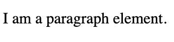

要了解更多关于 HTML 注释的知识，我建议通读这些有用的文章。

*   [注释掉 HTML–代码示例](https://www.freecodecamp.org/news/comment-out-html-code-example/)
*   [HTML 注释–如何在 HTML 中注释掉一行或一个标签](https://www.freecodecamp.org/news/html-comment-how-to-comment-out-a-line-or-tag-in-html/)

## 主要元素

`main`元素用于对网页的所有主要内容进行分组。

```
<h1>What freeCodeCamp has to offer</h1>
<main>
  <p>The core freeCodeCamp curriculum teaches full stack JavaScript and Python. There are hundreds of lessons to go through to get you ready for an entry level developer job.</p>

  <p>freeCodeCamp has thousands of free articles on their news publication. They also have hundreds of videos on their YouTube channel.</p>
</main>
```

这是代码呈现给页面的样子。


要了解更多关于`main`元素的信息，请通读这个 [DevDocs 详细的`main`元素解释](https://devdocs.io/html/element/main)。

## HTML 缩进

每当 HTML 元素嵌套在其他 HTML 元素中时，最好使用缩进。嵌套元素被称为其父元素的子元素。

缩进是为了让你的代码更容易被其他开发者阅读。要缩进代码，需要将元素向右移动两个空格。

这是一个没有缩进的**示例。**

```
<main>
<h2>Let's learn about indentation</h2>
<p>There is no indentation here</p>
</main>
```

但是如果我通过将`h2`和`p`元素向右移动两个空格来编辑代码，现在我们有了正确的缩进。

```
<main>
  <h2>Let's learn about indentation</h2>
  <p>This is indentation</p>
</main>
```

现在我们可以看到`h2`和`p`元素是`main`元素的子元素。

要了解更多关于 HTML 缩进的知识以及为什么它很重要，请通读[这篇有用的缩进文章](https://www.freecodecamp.org/news/how-to-indent-in-html-and-why-it-is-important/)。

## 图像元素

`img`元素用来给网页添加图片。

`src`属性表示图像的位置，而`alt`属性是图像的描述性文本。

```

```

这是代码呈现在页面上的样子。


要了解更多关于`img`元素的信息，请通读这篇有用的 [`img`元素教程](https://www.freecodecamp.org/news/img-html-image-tag-tutorial/)。

## 锚元素

锚元素代表网页上的链接。

下面是基本语法:

```
<a href="link-where-you-want-to-go">anchor text goes here</a>
```

这是呈现在页面上的样子。


您使用`href`属性来告诉超链接去哪里。

```
href="link-where-you-want-to-go"
```

锚文本是在屏幕上显示给用户的内容。

这是一个链接到 freeCodeCamp 的锚标签的例子。

```
<a href="https://www.freecodecamp.org/">freeCodeCamp</a>
```

这是呈现在页面上的样子。


要了解更多关于 HTML 锚元素的知识，我建议通读这些有用的文章。

*   [HTML<标签>锚标签示例代码](https://www.freecodecamp.org/news/the-html-a-tag-anchor-tag-example-code/)
*   [HTML < a >标签–锚链接 HREF 示例](https://www.freecodecamp.org/news/html-a-tag-anchor-link-href-example/)

## 在段落中嵌套锚点元素

如果你想在你的段落中包含链接，那么你可以在段落标签中嵌套锚点标签。

在这个例子中，我们有文本“我爱 freeCodeCamp”。

```
<p>I love freeCodeCamp</p>
```

如果我想将单词 freeCodeCamp 转换成一个链接，那么我会将它包装在一组锚标签中。

```
<p>I love <a href="https://www.freecodecamp.org/">freeCodeCamp</a></p>
```

这是渲染到屏幕上的结果。

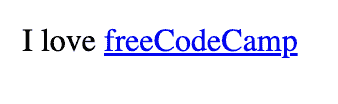

当你想引导你的用户到关于页面主要内容的附加信息时，在段落标签中嵌套链接是很有帮助的。

要了解更多关于在段落中嵌套锚点标签的信息，我建议通读这篇有用的文章。

*   [HTML 链接——如何将图片转换成链接，并在段落中嵌套链接](https://www.freecodecamp.org/news/how-to-turn-text-and-images-into-links-using-html/)

## 目标属性

像这样在开始锚标记中使用`target="_blank"`属性:

```
<a href="website-link-goes-here" target="_blank">
```

当用户点击链接时，一个新的浏览器标签将自动打开该页面。

在这个例子中，我在一组段落标签中嵌套了一个链接，将人们引向 freeCodeCamp。

```
<p>To learn how to code for free, please visit <a href="https://www.freecodecamp.org/learn" target="_blank">freeCodeCamp.org</a></p>
```

当你点击 freeCodeCamp 链接时，它会为你打开一个新的浏览器标签。

[https://codepen.io/jessica-wilkins/embed/preview/zYRRdmQ?default-tabs=html%2Cresult&height=300&host=https%3A%2F%2Fcodepen.io&slug-hash=zYRRdmQ](https://codepen.io/jessica-wilkins/embed/preview/zYRRdmQ?default-tabs=html%2Cresult&height=300&host=https%3A%2F%2Fcodepen.io&slug-hash=zYRRdmQ)

要了解关于目标属性的更多信息，我建议通读这篇有用的文章。

*   [如何在新标签页中打开链接–HTML 目标空白属性讲解](https://www.freecodecamp.org/news/how-to-open-a-link-in-a-new-tab/)

## 在锚点标签中嵌套图像

在 HTML 中，我们可以使用``元素在页面上添加图像。在这个例子中，我们添加了五只猫的图像。

```

```


如果我们想让那张图片成为一个可点击的链接，那么我们可以把它放在一组锚定标签中。

```
<a href="https://en.wikipedia.org/wiki/Cat"></a>
```

我们还可以添加`target="_blank"`属性，让该链接在新的选项卡中打开。

```
<a target="_blank" href="https://en.wikipedia.org/wiki/Cat"></a>
```

当您将鼠标悬停在图像上时，您会看到光标指针，指示它是一个链接，将您导向一篇关于猫的文章。

[https://codepen.io/jessica-wilkins/embed/preview/XWZYRgy?default-tabs=html%2Cresult&height=300&host=https%3A%2F%2Fcodepen.io&slug-hash=XWZYRgy](https://codepen.io/jessica-wilkins/embed/preview/XWZYRgy?default-tabs=html%2Cresult&height=300&host=https%3A%2F%2Fcodepen.io&slug-hash=XWZYRgy)

## 截面元素

元素用于对 HTML 文档中的内容进行分组。

下面是一个`section`元素的例子。

```
<h1>Let's learn about section elements</h1>
<section>
  <h2>Defintion</h2>
  <p>The section element is used to group sections of content in the HTML document.</p>
</section>
```

这是页面呈现的结果。


要了解更多关于`section`元素的信息，请通读此 [DevDocs `section`元素详细解释](https://devdocs.io/html/element/section)。

## 无序列表元素

`ul` list 元素用于显示没有特定顺序的项目列表。`li`元素表示单个列表项。

这是一个食品清单的例子。

```
<h2>Favorite foods</h2>
<ul>
  <li>Salad</li>
  <li>Pizza</li>
  <li>Burger</li>
  <li>Carrots</li>
</ul>
```

这是它呈现在屏幕上的样子。

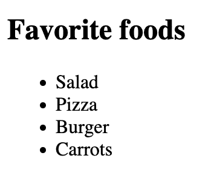

要了解关于无序列表元素的更多信息，请通读这篇有用的文章。

*   [HTML 要点——如何用< ul >标签创建一个无序列表示例](https://www.freecodecamp.org/news/html-bullet-points-how-to-create-an-unordered-list-with-the-ul-tag-example/)

## 图和图标题元素

`figure`元素表示通常与图像和标题一起使用的自包含内容。可选的`figcaption`是图像的简短描述文本。

在这个例子中，我们有一张草地上五只小猫的图片，下面有一个小标题。

```
<figure>
  
  <figcaption>Five kittens looking around in the grass</figcaption>
</figure>
```

这是它在页面上呈现的样子。

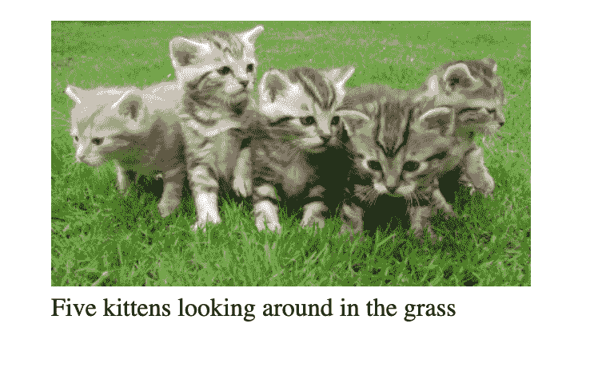

要了解更多关于`figure`和`figcaption`元素的信息，请通读[这篇有用的 DevDocs 解释](https://devdocs.io/html/element/figure)。

## 重点元素

元素的作用是在一段文本上增加额外的强调。

在这个例子中，我们有这样一个句子，“我们需要马上离开大楼！”

```
<p>We need to get out of the building now!</p>
```

如果我现在想强调这个单词，那么我可以用`<em>`标签把它包起来。

```
<p>We need to get out of the building <em>now</em>!</p>
```

这是页面呈现的结果。

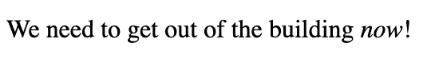

要了解更多关于强调元素的内容，请通读 DevDocs 的解释。

*   [强调元素](https://devdocs.io/html/element/em)

## 有序列表元素

元素的作用是以特定的顺序显示一个项目列表。`li`元素表示单个列表项。

这是一个食谱的一组步骤的例子。

```
<h1>How to bake a cake</h1>
<h2>Directions for recipe</h2>
<ol>
  <li>Prep the oven</li>
  <li>Whisk the flour, sugar and cocoa in a bowl</li>
  <li>Mix the milk, vegetable oil, eggs, and vanilla</li>
  <li>Bake for 30 minutes</li>
  <li>Remove from oven, cool for 10 minutes and frost cake</li>
</ol>
```

这是页面上呈现的结果。

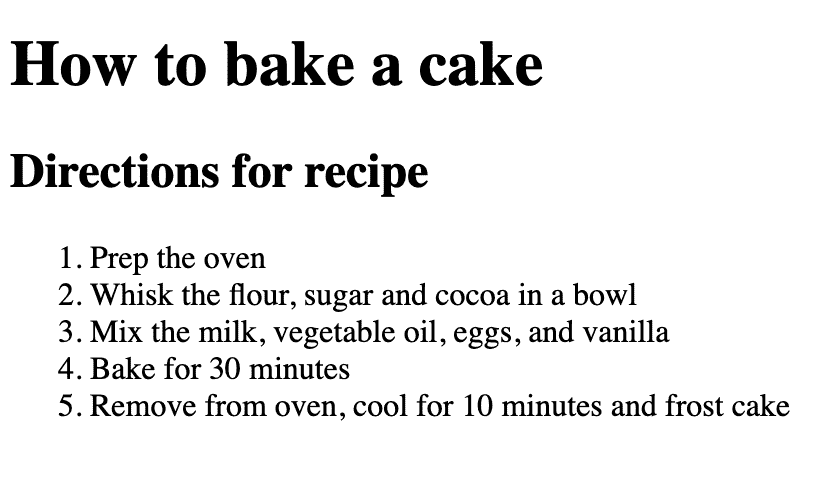

要了解关于有序列表元素的更多信息，请通读这篇有用的文章。

*   [HTML-OL 标签中的有序列表示例](https://www.freecodecamp.org/news/ordered-list-in-html-ol-tag-example/)

## 强元素

强元素是文本中表示紧迫感或严肃性的部分。

在这个例子中，我们有下面的句子:

```
<p>Danger! Unsafe area ahead</p>
```

我们可以用`strong`标签来强调“危险”这个词的强烈严肃感。

```
<p><strong>Danger!</strong> Unsafe area ahead</p>
```

这是页面呈现的结果。

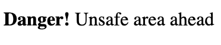

## 表单元素

表单元素用于收集用户的数据，如姓名和电子邮件地址。表单的例子可能是调查表单或加入邮件列表的表单。

以下是表单的基本语法:

```
<form action="url-where-data-should-be-sent-to">
  <!--inputs go inside here-->
</form>
```

`action`属性是用户数据将被发送到的 URL。在`form`标签中，将会有用户提供信息的输入。

输入将在下一节中详细介绍。

## 表单文本输入和提交按钮

文本`input`是一个文本字段，用户可以在其中输入信息。这些输入进入`form`元素内部。

下面是基本语法:

```
<form action="url-where-data-should-be-sent-to">
  <input type="text">
</form>
```

告诉计算机这是一个文本输入。

这是页面呈现的结果。


`name`属性用于表示提交的数据的值。

```
<input type="text" name="username">
```

`placeholder`文本用于向用户提供文本输入内容的信息。

在本例中，占位符文本向用户显示了用户名示例。一旦您开始输入，占位符文本就会消失。

```
 <input type="text" name="username" placeholder="Ex.codergirlrules">
```

[https://codepen.io/jessica-wilkins/embed/preview/oNqvBmb?default-tabs=html%2Cresult&height=300&host=https%3A%2F%2Fcodepen.io&slug-hash=oNqvBmb](https://codepen.io/jessica-wilkins/embed/preview/oNqvBmb?default-tabs=html%2Cresult&height=300&host=https%3A%2F%2Fcodepen.io&slug-hash=oNqvBmb)

submit 按钮用于将表单信息提交给服务器。告诉电脑这是什么类型的按钮。

```
<button type="submit">Submit form</button>
```

`required`属性用于确保用户在提交表单之前必须填写所需的输入。如果您试图在没有完成所需输入的情况下提交表单，则会弹出一条消息，指导您填写该信息。

```
 <input required type="text" name="username" placeholder="Ex.codergirlrules">
```

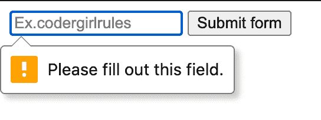

要了解更多关于表单输入的信息，请通读这篇文章。

*   [HTML 表单–输入类型和提交按钮示例](https://www.freecodecamp.org/news/html-form-input-type-and-submit-button-example/)

## 表单单选按钮

单选按钮代表一组可供用户选择的选项。一次只能选择该组中的一个选项。

下面是基本语法:

```
<input type="radio">
```

这是它呈现在屏幕上的样子。

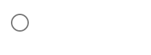

在这个例子中，我们使用了一组单选按钮，用户可以在牛肉、鸡肉、鱼肉或其他食物中进行选择。当使用一组单选按钮时，组中的所有按钮必须具有相同的`name`属性值。

```
<input type="radio" id="beef" name="food">Beef
<input type="radio" id="chicken" name="food">Chicken
<input type="radio" id="fish" name="food">Fish
<input type="radio" id="other" name="food">Other
```

尝试下面的例子，并注意如何一次只能选择一个选项。注意所有的输入都有相同的`name="food"`值。

[https://codepen.io/jessica-wilkins/embed/preview/yLKBPzE?default-tabs=html%2Cresult&height=300&host=https%3A%2F%2Fcodepen.io&slug-hash=yLKBPzE](https://codepen.io/jessica-wilkins/embed/preview/yLKBPzE?default-tabs=html%2Cresult&height=300&host=https%3A%2F%2Fcodepen.io&slug-hash=yLKBPzE)

您可以通过通读[这个 DevDocs 单选按钮文档](https://devdocs.io/html/element/input/radio)来了解更多关于单选按钮的信息。

## 标签元素

元素将标签文本与输入相关联。

下面是一个使用`label`元素将文本“Beef”与输入相关联的例子。

```
 <label for="beef">Beef</label>
  <input type="radio" id="beef" name="food">
```

`for`属性用于将标签连接到输入，这样当用户点击标签文本时，它将选择输入。属性`for`的值与输入的`id`相同。

单击标签文本，尝试以下示例。您将看到选择了无线电输入。

[https://codepen.io/jessica-wilkins/embed/preview/vYRBWdG?default-tabs=html%2Cresult&height=300&host=https%3A%2F%2Fcodepen.io&slug-hash=vYRBWdG](https://codepen.io/jessica-wilkins/embed/preview/vYRBWdG?default-tabs=html%2Cresult&height=300&host=https%3A%2F%2Fcodepen.io&slug-hash=vYRBWdG)

您还可以将输入嵌套在`label`元素中。在这种情况下，您不需要使用`for`属性，因为两个元素之间的关联是隐式的。

```
 <label>Beef
    <input type="radio" id="beef" name="food">
  </label>
```

要了解关于`label`元素的更多信息，请通读这篇有用的文章。

*   [HTML 标签–标签标记示例](https://www.freecodecamp.org/news/html-label-label-tag-example/)

## 字段集和图例元素

元素用于对表单控件进行分组，这些控件是输入和标签。元素用于为`fieldset`元素提供标题。

下面是一个`fieldset`元素的例子:

```
<form action="">
  <fieldset>

  </fieldset>
</form>
```

这是它呈现在屏幕上的样子。

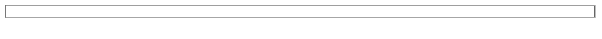

下面是一个`legend`元素的例子:

```
<form action="">
  <fieldset>
    <legend>Choose your favorite programming language</legend>
  </fieldset>
</form>
```

这是它呈现在屏幕上的样子。

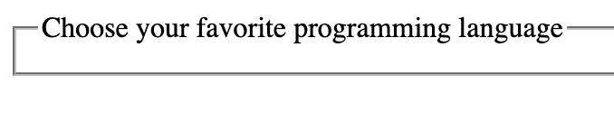

下面是一个完整的例子，展示了`fieldset`和`legend`元素如何处理表单输入和标签。

```
<form action="">
  <fieldset>
    <legend>Choose your favorite programming language</legend>

    <input type="radio" id="JavaScript" name="programming">
    <label for="JavaScript">JavaScript</label>

    <input type="radio" id="Python" name="programming">
    <label for="Python">Python</label>

    <input type="radio" id="Rust" name="programming">
    <label for="Rust">Rust</label>
  </fieldset>
</form>
```

[https://codepen.io/jessica-wilkins/embed/preview/GRxKypM?default-tabs=html%2Cresult&height=300&host=https%3A%2F%2Fcodepen.io&slug-hash=GRxKypM](https://codepen.io/jessica-wilkins/embed/preview/GRxKypM?default-tabs=html%2Cresult&height=300&host=https%3A%2F%2Fcodepen.io&slug-hash=GRxKypM)

## 表单复选框元素

元素是用户可以在表单中选择多个选项的框。

以下是复选框的示例:

```
 <input type="checkbox" id="London" name="London">
    <label for="London">London</label>
```

这是呈现在页面上的样子。

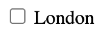

这是一个完整的例子，不同的城市使用多个复选框。

```
<form action="">
  <fieldset>
    <legend>Cities you would like to visit</legend>

    <input type="checkbox" id="London" name="London">
    <label for="London">London</label>

    <input type="checkbox" id="Barcelona" name="Barcelona">
    <label for="Barcelona">Barcelona</label>

    <input type="checkbox" id="Venice" name="Venice">
    <label for="Venice">Venice</label>

    <input type="checkbox" id="Tokyo" name="Tokyo">
    <label for="Tokyo">Tokyo</label>
  </fieldset>
</form>
```

试试下面的例子，你将能够选择多个选项。

[https://codepen.io/jessica-wilkins/embed/preview/wvmwpeE?default-tabs=html%2Cresult&height=300&host=https%3A%2F%2Fcodepen.io&slug-hash=wvmwpeE](https://codepen.io/jessica-wilkins/embed/preview/wvmwpeE?default-tabs=html%2Cresult&height=300&host=https%3A%2F%2Fcodepen.io&slug-hash=wvmwpeE)

要了解更多关于复选框元素的信息，请通读[DevDocs 复选框文档](https://devdocs.io/html/element/input/checkbox)。

## 值和选中的属性

`value`属性表示输入的值。

这里有一个例子。

```
<input type="checkbox" id="London" name="London" value="London">
```

checked 属性用于指示在页面加载时默认情况下应该检查哪些输入。

这里有一个例子。

```
 <input type="checkbox" id="London" name="London" value="London" checked>
    <label for="London">London</label>
```

这是页面呈现的结果。

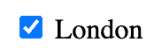

## 页脚元素

`footer`元素位于 HTML 文档的底部，包含版权等信息，或者指向页面其他相关信息的链接。

下面是一个基本的例子:

```
<footer>
  <p>© 2022 Jessica Wilkins</p>
</footer>
```

要了解更多关于`footer`元素的信息，请通读[这个 DevDocs 对`footer`元素](https://devdocs.io/html/element/footer)的解释。

## 标题和标题元素

标签包含由机器处理的信息。在`<head>`标签中，您将嵌套元数据，元数据是向机器描述文档的数据。

```
<head>
  <!--important meta data goes inside here-->
  <!--title element also goes inside here-->
</head>
```

标签是网页的标题。该文本显示在浏览器的标题栏中。

```
 <title>HTML 5 Boilerplate</title> 
```


这是一个真实网页上的`head`的例子。这些信息都不会显示在网页上。

```
 <head>
    <meta charset="UTF-8">
    <meta name="viewport" content="width=device-width, initial-scale=1.0">
    <meta http-equiv="X-UA-Compatible" content="ie=edge">
    <title>HTML 5 Boilerplate</title>
    <link rel="stylesheet" href="style.css">
  </head>
```

对于列出的每个 meta 标签的详细描述，请在 HTML5 样板文件上通读[这篇文章。](https://www.freecodecamp.org/news/basic-html5-template-boilerplate-code-example/)

## `lang`属性

开始标记`<html>`中的`lang`属性设置页面的语言。出于可访问性的原因，包含它也是很好的，因为屏幕阅读器将知道如何正确地发音。

```
<html lang="en">
```

## 文档类型

HTML 代码中的第一行应该是 doctype 声明。doctype 告诉浏览器页面是用什么版本的 HTML 编写的。

```
<!DOCTYPE html>
```

如果您忘记在文件中包含这一行代码，那么浏览器可能不支持一些 HTML 5 标签，如`<article>`、`< footer >`和`<header>`。