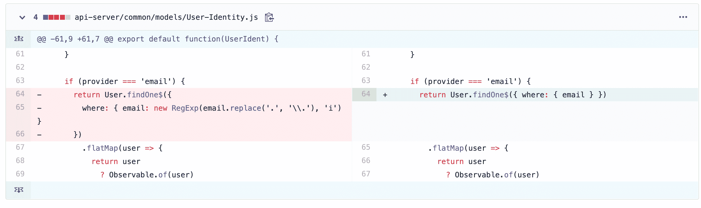
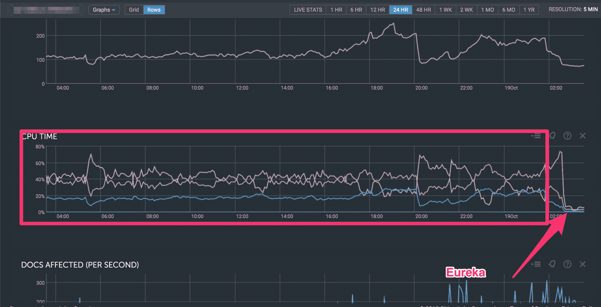
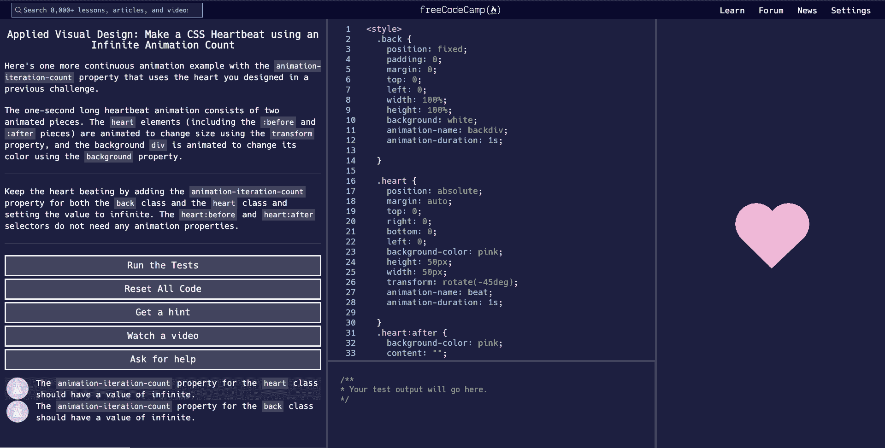

# freeCodeCamp 的服务器到底怎么了？

> 原文：<https://www.freecodecamp.org/news/freecodecamp-servers-update-october-2019/>

**加州时间**17:00 更新:我们现在已经修复了大部分问题。我们仍在解决一些已知的问题，但/learn 现在已全面投入使用。

这就是罪魁祸首——每次有人试图进行身份验证时，基于正则表达式的查询都会对数百万条数据库记录进行操作。



这是我们的集群在修复问题前后的 CPU 使用情况:



Eureka indeed.

这似乎是显而易见的，但是花了 3 天的调查工作才找到瓶颈。

我们的结论是，我们可以用每月 30 美元的工具更早地发现这一点，所以我们停下来买了它供将来使用。

以下是对所发生的事情的更深入的解释。

## 简而言之:

*   周二，我们推出了大量新代码。包括允许我们不断交付新功能和错误修复的代码。
*   我们认为我们已经对新代码进行了足够的负载测试。但是对于突然增加的 2，000 个并发用户来说，它的性能还不够高。
*   /forum 和/news 运行良好，但是/learn 上的登录功能有 3 天不可靠。

## 好的。现在更详细一些。

在过去的 10 个月左右的时间里，我们一直在积累新的特性、错误修复和课程改进。

我们继续将改进合并到我们的主分支中，并将它们部署到我们的测试服务器上。

在过去的两个月里，许多贡献者都有人在使用 freeCodeCamp 的测试版。



在本月庆祝 freeCodeCamp 成立五周年之际，我们希望继续将所有这些改进在 www.freecodecamp.org 投入生产。

周二，我们进行了 3 分钟的计划维护。我们做了最后一次测试，备份了数据库，发了一条“我们马上回来”的推文，并一下子推出了 10 个月的代码。

但是墨菲定律就在拐角后面等着敲我们的膝盖。随着越来越多的流量涌入，我们的服务器崩溃了。

我们几乎可以立即恢复/forum 和/news。但是/learn 要求认证，并触及一些额外的 API 端点和服务器。所以我们花了三天时间努力让它工作。

事实证明，我们的新代码并不像我们想象的那样高性能，我们对 API 服务器的冲击远远超过了必要的程度。

因此，我们确定了代码库中进行不必要的 API 调用的部分，并对它们进行了重构，同时还应对了 DevOps 的挑战。

## 然而，为什么会发生这种情况呢？真的吗？

说到底，这次停电是我的错。

原因如下。

我们 2019 年的总预算只有 30 万美元左右。然而，我们每个月都在帮助数百万人学习编程。

我们现在比其他学习编码的网站如 Udacity 和 Codecademy 获得了更多的流量。我们的流量甚至超过了像 TechCrunch 这样的主流新闻网站。

```
+-------------------+------------+
|      Website      | Alexa Rank |
+-------------------+------------+
| stackoverflow.com |         40 |
| github.com        |         85 |
| theverge.com      |        615 |
| wired.com         |      1,435 |
| freeCodeCamp.org  |      1,596 |
| techcrunch.com    |      1,601 |
| codecademy.com    |      2,040 |
| udacity.com       |      2,348 |
| hackernoon.com    |      3,986 |
| dev.to            |      7,684 |
+-------------------+------------+
```

Popular tech websites and their Amazon Alexa rank (as of Oct. 9, 2019). freeCodeCamp.org is now the 1,596th most-used site on the entire web.

当你以如此微薄的预算进行如此极端的规模运作时，你最终会削减优惠券。

那些巨大的服务器可以给你舒适的峰值开销？太贵了。

那些花哨的 DevOps 服务可以识别瓶颈？太贵了。

我们的 5 名工程师团队最终完成了 10 名工程师的工作。

我的观点是——这是我的错，freeCodeCamp 今年只有 30 万美元。从数字的角度来看，我知道旧金山有一些个人开发者的薪水超过 30 万美元。

工资高没什么不好。旧金山是一个消费很高的城市。

但是当 freeCodeCamp——互联网上最大的教育网站之一——试图以如此可笑的微薄预算运营时，就出现了一个问题。


What is this? A budget for ants?! (image credit: Zoolander)

再说一次，这是我的错。

我在基层筹款方面经验不足。

我仍在学习如何提高人们对我们为社区所做的所有工作的认识。

当我要求你们大家为这项工作捐款时，我感到害羞。

因此，我将齐心协力做得更好，并增加我们的预算。

我不想做广告。

我不想说“Acme 公司为您带来的 freeCodeCamp”

当然，我从来不想向学习者收取学习资源的费用。

到目前为止，我们还没有做这些事情。

但这真的只给我们留下了一个资金来源。我们，人民。

freeCodeCamp 是一个由捐助者支持的基层非营利组织。我们只是需要更好地向人们要钱。

我们即将进入假日季节。这是一年中大约 80%的慈善礼物在美国制造的时候。

所以我会继续关注这件事。我将记录我在实验中学到的东西。最后，我将根据我所学到的知识，为其他由捐助者支持的基层非营利组织编写一本筹款手册。

这有点尴尬，但是我们当前的捐赠页面今天关闭了，因为我们的认证仍然不可靠。

所以我建立了一个 PayPal 页面，你可以在这里向 freeCodeCamp 一次性捐款。

我们仍然欢迎您每月对 freeCodeCamp 的支持。你每个月 5 美元的捐款使 freeCodeCamp 成为可能，也给了我们稳定的预算来提前计划。

但是如果你手头有一些额外的现金用于一次性捐赠，这将是一个巨大的帮助。

# 这是我对你的承诺:

freeCodeCamp 将保持免费。

freeCodeCamp 不会投放广告。

当我们要求你捐赠时，我们会有品位地、诚实地去做。我们不会使用悲情，或者做出其他非营利组织诉诸的那种“除非你马上捐款，否则我们就要破产”的声明。

因为现实是这样的:即使 freeCodeCamp 完全没有钱了，我们仍然会继续下去。

是的，我们必须解雇所有人，包括我自己。但我会去找其他工作，自己支付服务器的费用。

因为 freeCodeCamp 显然是这个世界需要的东西。

我在这个社区倾注了 5 年的心血。我已经从我的教学生涯中拿出了 15 万美元的个人积蓄投入到 freeCodeCamp。

freeCodeCamp 永远不会消亡。

这只是一个 freeCodeCamp 能活得多有活力的问题。

同样，如果你有多余的现金，我们是一个高效的非营利组织，我们会有效地利用它。[捐到这里](https://paypal.me/freecodecamp)。

再次感谢您对/learn 中断的耐心。

一旦我们解决了所有这些问题，我会让你们都知道，我会发表我的 5 周年纪念文章，详细介绍我们为 5 周年纪念所做的所有重大改进。

快乐编码。