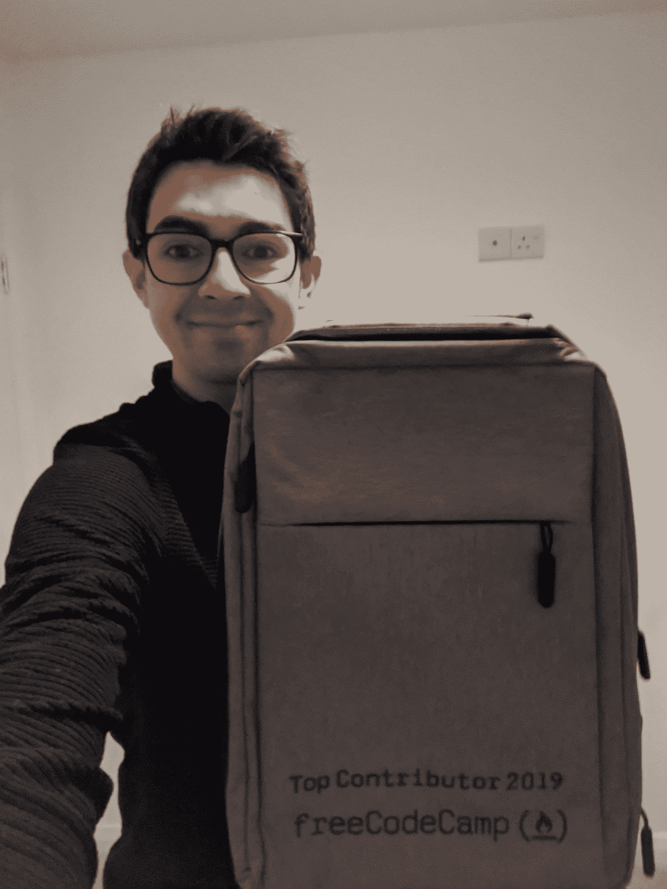

# 免费代码营顶级贡献者——我们如何选择、认可和奖励多产的志愿者

> 原文：<https://www.freecodecamp.org/news/freecodecamp-top-contributors/>

freeCodeCamp.org 之所以成为可能，是因为世界各地成千上万的贡献者帮助扩展和改善了这个社区。他们主要通过以下方式做到这一点:

*   创作关于编程和技术的文章、视频和播客
*   为 freeCodeCamp 的课程、代码库和我们的许多开源项目做出贡献
*   在我们的论坛、聊天室和其他在线社区中帮助人们
*   为我们的课程和教程提供翻译和字幕

每年假期前后，我们都会回顾那些为社区做出贡献的志愿者。我们选择几个关键贡献者，并授予他们令人垂涎的“顶级贡献者”的地位

## 2018 年最佳贡献者

2018 年，我们邀请顶级贡献者参加纽约市、香港和都柏林的派对。

以下是这些活动的一些视频，这些视频是在 freeCodeCamp 的 YouTube 频道上直播的:

[https://www.youtube.com/embed/7NPYwWTjmKs?feature=oembed](https://www.youtube.com/embed/7NPYwWTjmKs?feature=oembed)

[https://www.youtube.com/embed/8TYo9YYfKpc?feature=oembed](https://www.youtube.com/embed/8TYo9YYfKpc?feature=oembed)

下面是[2018 年度最佳贡献者](https://www.freecodecamp.org/news/announcing-our-freecodecamp-2018-top-contributor-award-winners-861da08a77e1/)的完整名单。

## 2019 年最佳贡献者

2019 年，我们制造了特殊的背包，并运往世界各地的顶级贡献者。

Prolific freeCodeCamp author Chris Blakely posing with his 2019 Top Contributor backpack

这里是 2019 年最佳贡献者的完整名单。

## 2020 年最佳贡献者

由于 2020 年不可能举办面对面的活动，我们无法聚集在一起庆祝我们社区的顶级贡献者。但是我们仍然能够在虚拟世界中认出他们。

这里是 2020 年最大贡献者的完整列表。

## 如何成为顶级贡献者

我们的顶级贡献者是来自全球社区的教师、作者、视频创作者、翻译和开源贡献者的良好组合。他们来自世界各地的许多城市，为我们的社区带来了各种各样的技能。

全球 freeCodeCamp 社区有 6000 多名贡献者，每年只有 100 到 200 人上榜。

我们感谢你们所有人的贡献——即使你们不在这个短名单上。我们希望你能出现在明年的名单上！

如果你感兴趣，这里有[如何开始为 freeCodeCamp 社区](https://contribute.freecodecamp.org/#/)做贡献。