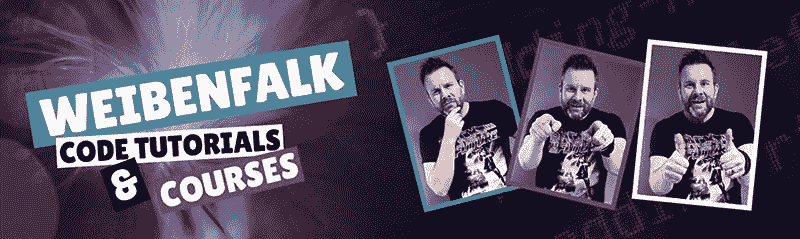

# 自由职业者小贴士:如何更自信，赚更多的钱

> 原文：<https://www.freecodecamp.org/news/freelancing/>

在我 10 年的自由开发者生涯中，许多自由职业者向我寻求建议。他们如何让自由职业为自己服务？

所以我把一些对我有用的小技巧整理出来，就在这个指南里。

？简而言之:

*   我喜欢做企业家。
*   卖，卖，再卖。
*   学会生活中的起起落落。
*   习惯做一只孤独的狼。
*   把你的一生奉献给不断的学习。

这些建议中的一些看起来很明显。但是我可以告诉你，在过去的几年里，他们已经证明了自己的价值。我的职业生涯就是这些建议奏效的活生生的证明。

我也和很多自由职业者合作过，也亲自雇佣过他们，所以我可以说这些也是我在招聘时寻找的品质。

## **热爱成为企业家**

我想很多人都忽略了这一点。我见过很多人想成为自由职业者是为了“自由”或者“做自己”。

老实说，这些也是激励我的事情。我热爱自由，热爱创造自己生活的能力，热爱对自己生活的掌控。但是还有更多。自由职业者也是很多艰苦的工作。**但这是有趣的工作！**？

我一直喜欢创作东西。而且一直想有自己的公司(不只是做个自由职业者)。

残酷的事实是，当你成为自由职业者时，你可能需要经营自己的公司。你可以使用一些服务来发送发票，但我不推荐这样做。他们会拿走你的一部分利润！

相反，要学会热爱经营一家公司，并像对待你最有价值的客户一样对待它。我知道像发票、会计和更多的后勤责任可能真的很无聊，会扼杀你真正想做的事情的乐趣。但是我已经开始喜欢上它了。

例如，为你花了几个小时努力工作的东西寄一份新的发票是很有趣的。你自己出售和工作的时间是别人没有给你的。对我来说，这些收入总是比我作为员工每个月的工资支票更有价值。即使最后钱少了。

所以**开始热爱经营公司的这些方面吧**——它们会很有趣！

## 卖，卖，卖。？

我一直讨厌销售，认为这是一个不好的词。事实上，我们无时无刻不在推销自己——当我们交流、做项目、生活的时候。每个人都是自己的销售人员。我们如何说话，我们如何看，我们如何表达自己。当我们谈论我们做过的值得骄傲的事情时，等等。

接受这个事实，当你是一名自由职业者时，你也是一名销售人员。你需要不断推销自己，让客户相信你的价值以及你能带来什么。这是合乎逻辑的。但我知道这会吓到很多人。我也去过那里。

销售缓慢时很容易失去信心。对销售的恐惧实际上推迟了我开始做自由职业者的决定。我担心没有足够的销售额来获得可观的收入。但我最终创办了自己的公司，再也没有回头路了，即使销售有时很慢。直面你的恐惧！

我希望我能给你一个更好的答案，但是销售是自由职业者的重要组成部分。有时候，我 100%的时间都在销售。其他时候，0%。这让我们直接进入下一部分

## 学会生活中的起起落落

当你致力于自由职业的生活方式时，你需要知道会有一段时间你没有项目。那就意味着没有收入！

这可能很可怕，我经常和无法想象那样生活的人交谈。他们每个月都想要他们的工资支票，所以总会有钱进入他们的银行账户。

嗯，我完全理解。但这实际上也是件好事。我学会了如何更好地珍惜金钱。我不断地存更多的钱，为那些不景气的时候做准备。

我也对金钱的价值有了不同的看法。对我来说，作为一名自由职业者，我的收入实际上比普通薪水更有价值。只是因为我知道我有多容易失去它。

我也知道，比起每月固定的薪水，我更努力地工作来获得这些收入。这让那些钱对我来说更有价值。这也有助于弥补没钱的恐惧。

所以，你必须学会适应起起落落。↕️

## 习惯做独狼？

这其实是一件好事。至少对我来说是这样。作为一名自由职业者，你可能不会像全职员工那样参与项目的方方面面。一些自由职业者对此感到沮丧，但我认为这很好——大多数时候。有时候，如果你真的需要参与到项目的过程中，这是很糟糕的。

自由职业者通常是作为“最后手段”被雇佣的，这意味着你在项目过程的后期加入项目。所以你错过了项目的开始。但实际上这也很好，因为你不必参加所有的会议，也不必做所有的行政工作。至少对我来说，这是一个胜利！

当然，会有跨越很长时间的项目。对于这些项目，你可能会被当作正式员工对待。不过，我的项目通常没有那么广泛。我喜欢灵活，不在同一个地方呆太久。

## 将你的一生奉献给不断的学习

我相信我生命中的每一天都应该学习新的东西。所以即使我不是自由职业者，我仍然会一直学习。但是作为自由职业者更重要。

如果你不断学习新的东西，你就能承担更广泛的任务。作为一名正式员工，在任何事情发生之前，你可以长时间不学习新东西。你可以坐着做你的工作，就像你每天都做的那样。

但是自由职业者经常会因为他们在某个狭窄领域的专业知识而被雇佣。例如，我经常被聘为 React 开发人员——但是如果我不知道 React，我当然不会被聘用。

不断学习新东西可以确保你对任何潜在的招聘人员都有吸引力。

学习也很有趣。我开始在我的 YouTube 频道上创建课程和分享东西，因为它也能帮助我学习。教学实际上是学习新事物的好方法——但那是另一回事了。

感谢阅读。希望这篇文章能让你对自由职业者的生活有所了解。

我是来自瑞典的托马斯·魏本法克？？。我在 React 和 Gatsby 上高级课程。我也有一个 Youtube 频道，我在那里发布每周免费教程:

**Youtube:**[https://www.youtube.com/user/Weibenfalk](https://www.youtube.com/user/Weibenfalk)
**Twitter:**[https://twitter.com/weibenfalk](https://twitter.com/weibenfalk)
**高级课程:**[https://www.weibenfalk.com/](https://www.weibenfalk.com/)