# 我如何在 3 年内从黑客马拉松到一个 20 人的 SaaS 公司的首席技术官

> 原文：<https://www.freecodecamp.org/news/from-hackathon-to-cto-in-3-years/>

在本文中，我将分享我如何成为一家软件即服务(SaaS)公司的 CTO 的故事。这一切都开始于大约 3 年前，当时我为了好玩去参加黑客马拉松。

在文章的最后，你可以找到一些我给有抱负的企业家的建议和忠告，以及一些阅读推荐。

这是——现在仍然是——一次疯狂的旅行！

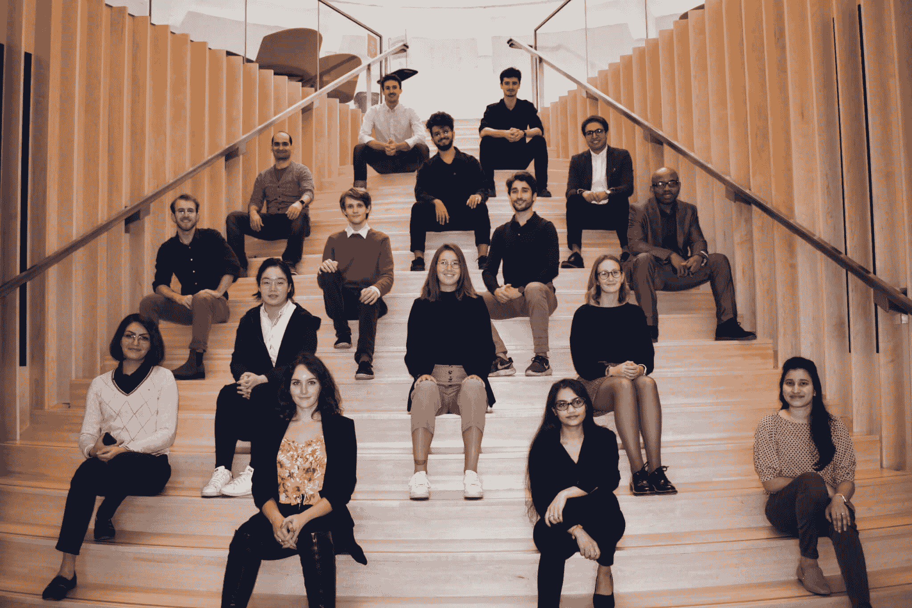

Our company team (we now have 8 more employees!)

虽然我对创业有很好的了解，但不要只从表面上接受我的建议。从书本、从其他企业家、从你的环境中学习，以便三角分析在给定情况下如何最好地行动。

## 我的第一次黑客马拉松——我输了

这听起来可能有点离谱，但 3 年前我对创业或商业一点兴趣都没有。与其说我是一个企业家，不如说我是一个精神研究者。

从研究分子水平的记忆，到帮助精神分裂症患者更好地学习的 T2，或者预测创伤性脑损伤患者意识恢复的 T4，我的思维深深地聚焦于科学的前沿。

然而，我对编程和寻找构建以前不存在的工具的方法有着深深的热情。

比如那次我造了一个[脑机接口，兼容一个经颅直流刺激脑电图耳机](https://mjm.mcgill.ca/article/view/129)(就是通过给电击刺激大脑，让你控制一种乒乓球游戏)。我只是喜欢做东西。

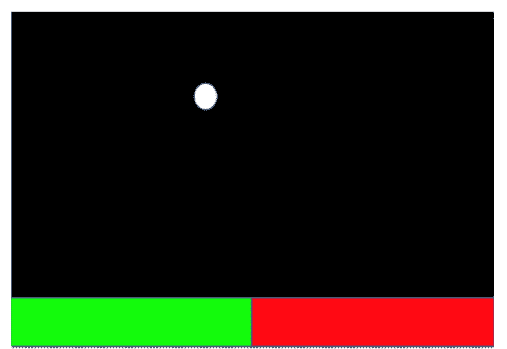

Cutting edge graphic from my brain computer interface

所以三年前，我哥哥想找一份软件开发的新工作。我们发现可以参加黑客马拉松来帮助他引起招聘人员的注意。

这是我第一次参加黑客马拉松，所以花两天时间做点什么让我很兴奋。我们的团队由我自己，我的兄弟，他的朋友，以及另外一名成员(他没有做很多事情，但仍然在那里)组成。

这是两天繁重的编码工作，最后我们想出了一个非常酷的算法，在给定一些特征的情况下，将人与工作进行模式匹配。

最重要的是，我遇到了像我一样热爱建筑的好人。我们最终进入了决赛，并在最后的陈述中获得了第四名。

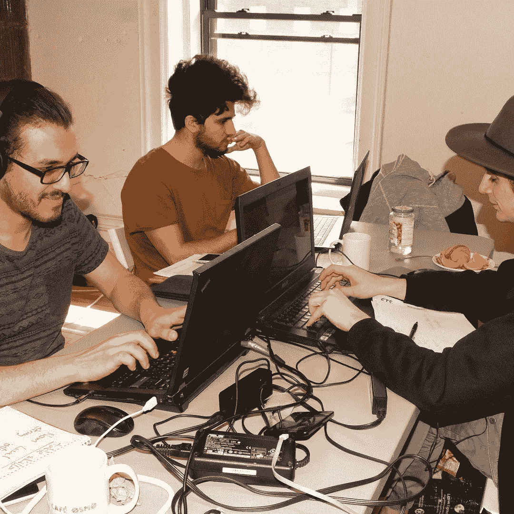

Here I am trying to figure out why the clustering is not working

### 我从第一次黑客马拉松中学到了什么

没有获胜有点令人失望，但我意识到了一些重要的事情:除了参与者，没有人真正关心我在这两天里编写了什么。

最重要的是展示我们想要建造的东西。我们应该多花点时间做一个非常吸引人的 PowerPoint，而不是专注于算法的开发！

这是一次有趣的学习经历，但我哥哥并没有因此找到工作——所以我们又回到了起点。

## 我的第二次黑客马拉松——我们赢得了特别奖

我准备暂时离开黑客马拉松。然而，我哥哥还是决定给我们报名。所以他的朋友和我在第一次之后去参加另一次黑客马拉松。我本来会拒绝的，因为我有其他事情要做，但他已经付了注册费。

这次黑客马拉松比上一次规模稍大，仍然有一群招聘人员在那里。我们认为这是我们给他找工作的第二次机会。

这次黑客马拉松的主题是开放数据和环境。因此，凭借我在机器学习方面的背景，我们处于一个很好的位置，可以做出一些很酷的东西。

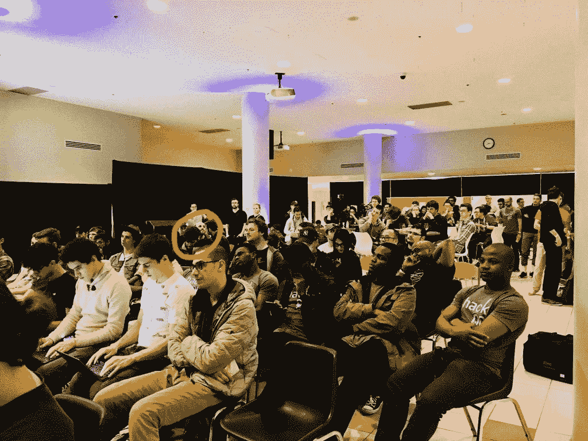

A lot more people where present at HackQC which was nice!

知道演示就是一切，我们决定在这次黑客马拉松中更有策略一点。我们梳理了所有可能赢得的不同奖项，选出了竞争似乎最少的一个。该项目将处理综合污水溢流的预测。

然后，我们将我们的四人团队(我哥哥的另一个朋友也加入了进来)分成了两部分，一半负责编码，另一半负责演示。

我们团队的名字叫“gout Quebec”，意思是魁北克污水处理(品牌不是我们的强项)。以下是我们在 DevPost 上的[比赛日志的法语摘录:](https://devpost.com/software/debordementhackqc18)

> 魁北克污水系统用于预测污水溢漏情况，并向业馀水生生物发出警告。这将有助于希望从事水活动的人避开被污水排放污染的地区。此外，还将向不同社区的人提供咨询意见，以减少溢漏的风险。
> 
> 魁北克污水使用基于人工智能的技术。它可以确定污水何时溢出。它的分析和计算是根据魁北克数据网站上的数据进行的。最后，不同的城市将受益于使用魁北克下水道
> 
> 通过平台的预测和分析，可以将城市资源集中到最有问题的地方。

这一切基本上可以翻译成*“我们找到了一种使用随机森林+一堆数据解决问题的方法”*。

我们最终赢得了 1000 美元的奖金，这在当时是一笔巨款！我们甚至得到了一个水滴形状的漂亮的玻璃奖杯。与之前的黑客马拉松相比，这次挑战性更小，因为我们对需要做的事情有了更好的计划。

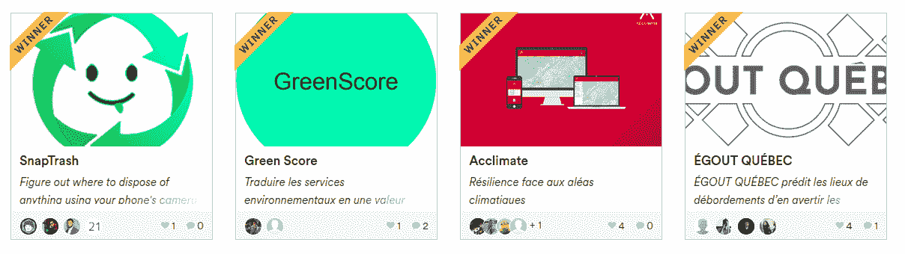

Here we are at the podium (still technically fourth place though).

### 我从第二次黑客马拉松中学到了什么

这次黑客马拉松让我意识到演示的确很重要。但我也发现，专注于人们不感兴趣的问题是增加你脱颖而出的机会的好方法！

获胜的感觉很好，我准备好拿走 1000 美元奖金中属于我的那一份，然后就此收工...

## 我的第三次(也是最后一次)黑客马拉松——我们又输了

然而，1000 美元的奖金伴随着另一场黑客马拉松半决赛的自动快速通道！这一次的赌注更高，有 25，000 美元的奖金。

我们在一家咖啡店碰面，想弄清楚我们是要把钱分了，还是用它来把我们的项目推进到下一个阶段。

在看了其他参与者的项目和比赛规则后，我们认为我们至少有机会进入决赛。这将释放更多的资金，我们可以随意使用，并让我们在夏天去安大略省的一个湖泊进行一次愉快的旅行。

这次黑客马拉松不同于其他的，它全年都在进行。这更像是一次带回家的黑客马拉松，这对我很好，因为我不必在周末做那种疯狂的两天时间紧缩的例行工作。

我们改名为 EGC 实验室，并设法建立了一个网站来宣传我们的下水道溢出预测解决方案(效果出奇的好)。然后我们去了安大略省的半决赛，令我们惊讶的是我们进入了决赛！

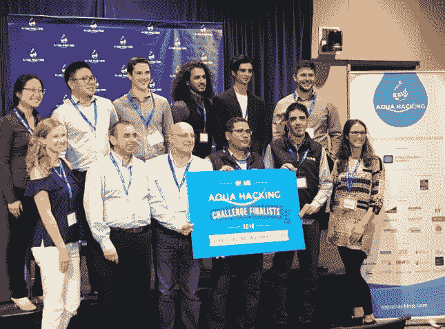

Here we are as finalists! I didn't go all the way to Ontario for the semi-finals, though.

这太棒了！我们有很大的机会赢得不仅仅是一小笔津贴，也许还可以用它来创业。为了帮助我们自助，Aquahacking 慷慨地给了我们 2000 美元，而école de technologie supérieure(éTS)给了我们 1000 美元的旅行费用。

然而，我们的解决方案仍然没有任何客户，这有点问题。

我们试图联系魁北克的一些城市，看看他们是否对我们的污水溢流申请感兴趣。我们与几个城市进行了一些非常先进的讨论，然而他们的进程如此缓慢，以至于我们在没有任何具体验证的情况下就非常接近决赛。

决赛是在一大群观众面前进行 5 分钟的陈述，有一些投资者在场。

当我们离展示日期越来越近的时候，事情变得有点棘手了。我团队的其他人开始变得越来越反应迟钝。我最终无法联系到我哥哥的朋友，他参加了 HackQC 比赛。

紧接着，我哥哥对比赛失去了所有的兴趣，转而关注其他事情。我们只剩下我和我哥哥的另一个朋友(费利克斯)，他一开始就加入了。

他也开始淡出画面，因为似乎没有什么进展，因为我是唯一一个留下来编码的人。我对那个项目也不太感兴趣，但是我讨厌半途而废的项目(尤其是当它们是公开的时候)。

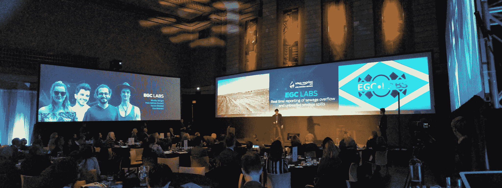

Our faces were plastered everywhere

我觉得这么快就结束是一种浪费。因此，我决定开始这个项目，为应用程序的用户界面编码，打造一些品牌，并为这个活动制作我们的名片。

随着事情开始好转，费利克斯开始变得越来越投入(这是一件幸事，因为他是投手！).

在酒店房间里进行演示的前一天晚上，我们还在最后敲定幻灯片。在所有这些艰苦的工作之后，我们有了相当坚实的东西(无论如何，以我当时的标准来看)。我们最终赢得了比赛的第四名:

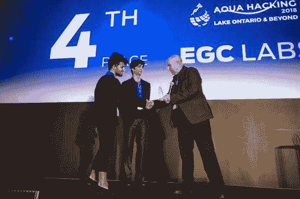

Us receiving the 4th place trophy (again) with no money whatsoever associated with it haha

我们从一个 4 到 2 人的团队发展到现在，并且能够走这么远。然而，这很累人，因为我不得不做许多不属于我核心能力范围的事情。

### 我从上次的黑客马拉松中学到了什么

在那次冒险中，我学到了两个非常重要的教训:

*   在任何努力中，拥有积极的队友是最重要的资产。如果我们每个人都尽自己的职责，我们就有更多的机会获胜！
*   对于一家初创公司来说，拥有客户是衡量成功的最终标准。我们做了所有正确的事情，除了确保我们有付费的顾客。最终这是我们保持第四的原因。

我们在这一部分的竞争中赢得了巨大的 0 美元，我再一次认为就这样了。我编写了一些很酷的 Flask 应用程序，参加了一个大型黑客马拉松的决赛，学到了一些有价值的经验。直到我意识到...

## 我是如何在孵化器中了解创业的

作为 Aquahacking 决赛的一员，你会自动获得一个省级创业孵化器的席位，这恰好是我们魁北克省的 Centech。

我其实并不知道什么是孵化器(除了生物学意义上的)，所以并不是特别兴奋。尽管我们有一个保留位置，但我们必须向孵化器的面板推销我们的“创业公司”。我让费利克斯在没有我的情况下做这件事，因为我有其他事情要做。

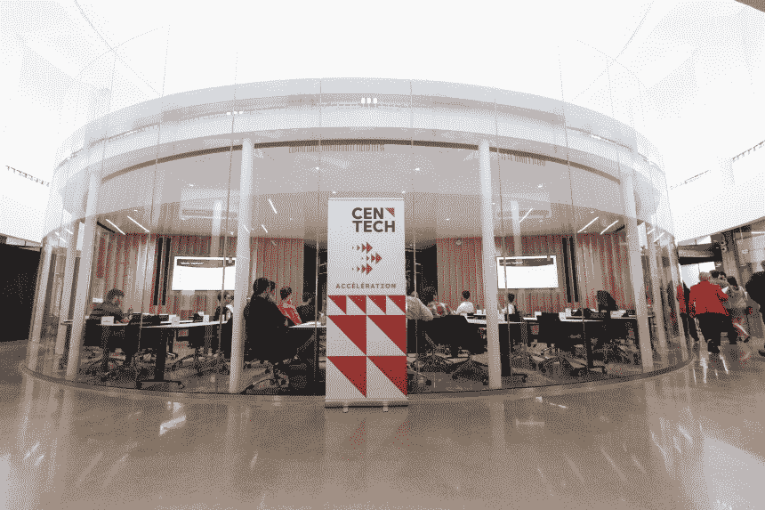

Centech is inside an old planetarium so it has that funky circular shape. It's a pretty cool place.

起初，我不太经常去企业家班，我开始认为这整个黑客马拉松的事情正在成为一个巨大的时间水槽。然而，我坚持了下来，因为费利克斯在整个经历中受到了很大的激励。

所以我决定认真尝试一下。我开始参加企业家课程(这太棒了)，我做了功课，我非常努力地让我们的污水处理公司运转起来。

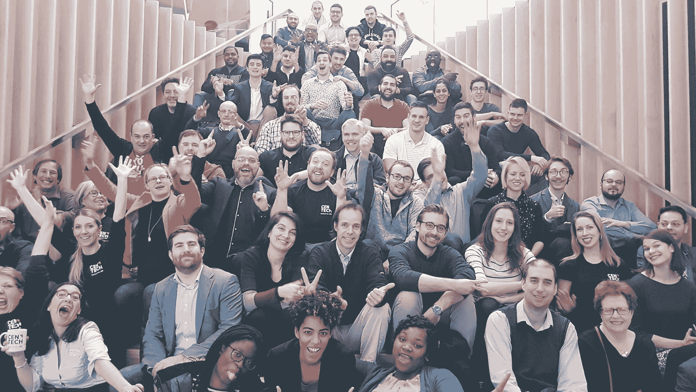

Lots of entrepreneurs in our 2018 cohort, try to find me!

坦率地说，这是惊人的。尝试做一些新奇的东西真的很有趣。被那些制造出帮助数百万人的不可思议的产品的人指导是不可思议的。

我所在的班级也非常具有激励性，因为我们有来自各种背景的人，奇怪的是，他们中的大多数都是研究生，就像我一样！

我真的对创业很感兴趣。这就像做研究一样，只是我可以在几天内直接看到我的实验结果。这就像是将我在做实验时发现的快乐与为一个副业项目编程的自由结合在一起。

然而，在阅读书籍和学习材料后，我意识到我们为萌芽中的初创公司做了一切颠倒的事情。我们甚至在验证这项技术是否有可持续发展的商业价值之前就已经开发了这项技术(我们真傻！).

我们已经为我们的第一个支点做好了准备，用企业家的行话来说，这意味着以一种重要的方式调整你的业务，以免崩溃和烧毁。

## 在得知我们的创业想法注定失败后，我们是如何进行第一次转型的

我们的综合污水溢流预测器工作得很好。然而，没有人愿意在这上面花钱。

我们以城市为目标，是为了让它们能够主动采取措施，解决未经处理的污水溢出到河流中的问题(顺便说一下，这是一个比你想象的更糟糕、更频繁的问题)。但这些城市的销售周期太长，我们永远无法发展这项业务。

在这个项目中，我们意识到的一件事是，竞赛可用的大多数数据都处于非常糟糕的状态。我们花了很多时间进行清理，为了提高清理效率，我们不得不开发一些非常定制的工具集。

我们也和 Aquahacking 的一些法官谈过，他们最感兴趣的是我们业务中与数据清理相关的部分。

原来如此！我们将成为一家数据清理公司。在大约三周的时间里，我们疯狂地寻找客户，制定如何让这种业务运作起来的计划，并编写异常值检测算法。

This would have been us inside the datasets for the rest of our lives: Photo by [mkjr_](https://unsplash.com/@mkjr_?utm_source=ghost&utm_medium=referral&utm_campaign=api-credit) / [Unsplash](https://unsplash.com/?utm_source=ghost&utm_medium=referral&utm_campaign=api-credit)

然而，在与我们的导师在 Centech 会面后，我们意识到我们正在建立的是一家服务公司。几乎没有数据是相似的，尤其是当它来自不同的来源时。

为了在一个行业中变得高效，我们必须获得的领域专业知识的数量不一定会轻易地转移到另一个行业。这涉及到大量的手工工作，我们所有让它更加自动化的想法都失败了。

现在，做服务公司没有错。如果你对你的行业非常感兴趣，这是一个很好的公司类型。但是我们做了一些反思，我们意识到我们对数据清理并没有真正的热情。

我们热衷于通过技术实现工作自动化和提高效率。对于我们来说，建立一家大部分工作都是手动的、效率不高的数据清理公司并不令人兴奋。

我们准备进行第二次转向，这将是我们迄今为止最大的一次转向。

## 我们如何进行第二次转向

在 Centech 项目中，我们遇到了另外两位企业家，他们的问题与我们的问题是互补的。他们得到了潜在客户的大量认可，这些客户的问题可以通过技术解决。然而，他们没有技术技能来制造推动其业务发展所需的技术。

为了让他们开始构建他们的 web 应用程序，我已经帮了他们几次，因为我已经为 EGC 实验室做了类似的事情。

在这种环境下，不求回报地帮助其他企业家是很常见的。我帮助他们越多，我们就越意识到，如果我们是一个 4 人团队，而不是两个 2 人团队，我们可以做得更多。

我们去吃午饭，讨论我们两个想法的潜在“合并”会是什么样子。经过一周的讨论，我们决定完全放弃 EGC 实验室的项目，因为它成功的可能性极小。相反，我们会加入他们的想法，这被称为 GRAD4。

那是费利克斯和我的第二个支点。这意味着完全放弃一个毫无进展的项目，加入另一个我们更感兴趣的项目。

Félix pitching our new company instead of the data cleaning one

在接下来的几周里，我们彻底打败了它。我们做的一切都是对的。我们正式成立了我们的公司。我们制定了一些计划，以了解实际应用程序在功能方面的需求，从而为我们的潜在客户提供价值。但是，我们没等我完成就开始卖了！

其他两位联合创始人已经在路上与对此感兴趣的人交谈了。他们正在收取我们平台的一年订阅费，当时这个平台还不存在。500 美元的年度订阅将从我们推出产品时开始，我们非常坦率地说，我们正在构建它。

让人们对你的项目感兴趣是一回事，但在开发 SaaS 应用程序之前让付费用户参与进来才是商业验证的圣杯。通过这样做，我们能够得到大约 15 张支票，这将有助于资助产品的开发。

大约在同一时间，我们还赢得了 1500 美元的电梯推销比赛，因为费利克斯非常专注于练习他的推销。

所有这些小小的胜利在这个项目中复合在一起，我们在孵化器结束时赢得了 15，000 美元的奖金，称为独角兽奖。

这很棒，但更重要的是，我们在孵化器的下一阶段，即推进计划中获得了一席之地。这将确保我们有一间办公室和一些额外的津贴，这将有助于我们公司的成功。

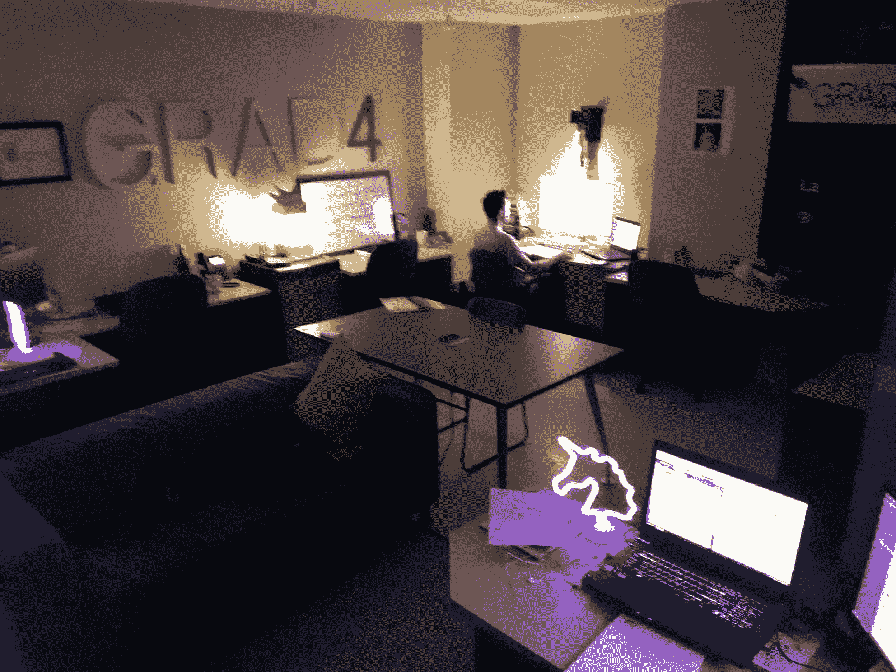

Cozy office in the basement of Centech. It was nice, but there was lots of noise because of pipes. You can see a wild cofounder working through the night.

### 我从我的第一个创业孵化器中学到了什么

在我们年轻公司的冒险历程中，我学到了一些重要的经验:

*   坚持一个想法，因为它是你的，即使所有的分析告诉你这是一个坏主意，这通常是一个坏主意。
*   较大的创始团队比较小的团队更有效率。它还允许更廉价的劳动力，因为没有人在开始时得到报酬。
*   要求客户为一个正在进行的想法付费并没有你想象的那么难。如果对客户来说痛苦足够大，他们通常非常支持找人来解决这个问题。即使成功的概率很低。
*   业务的技术部分并不那么重要。

### 我们有钱了，现在怎么办？

我们现在已经筹到了相当多的钱，摆在我们面前的有多种选择:

*   要么我们留着钱给自己发工资。
*   我们留着钱，不使用它，以防我们无法制作应用程序，我们需要给人报销。
*   我们用这些钱雇人来加快发展。

第一个想法是浪费，它会降低我们公司成功的可能性。第二种选择只会让我们的资金闲置。所以我们决定采取第三种选择。

## 我们如何超越创始团队

在 2019 年夏天，我们进行了第一次正式招聘，以帮助我开发该平台。他们是来自高等技术学校的软件工程实习生。一名实习生将专注于后端，而另一名将专注于前端。

我们的产品是一个简单的 CRUD 应用程序，可以让需要制造金属零件的买家和金属零件的供应商找到彼此。

这基本上是一种市场，买家会创建一个所谓的*报价请求*，供应商会创建一个*报价*来说明他们可以生产多少零件。相当简单！

我们选择使用的技术如下:

*   Django + Django REST API 用于后端。
*   React + Redux 为前端。
*   造型靴。
*   Heroku 托管这两个应用程序。
*   GitHub 用于远程源代码控制。

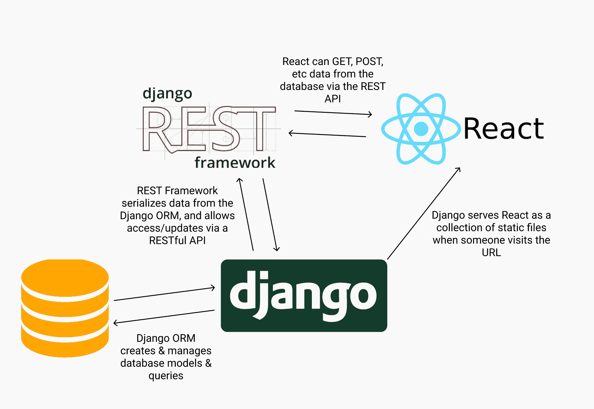

This was our setup at first. Credit: https://blog.usejournal.com/react-on-django-getting-started-f30de8d23504

作为首席技术官，我决定选择哪种技术，我真诚地决定选择我认为长远来看更好的技术。我已经很熟悉弗拉斯克了，但是我也知道一点姜戈。看到我需要的许多功能已经被预先内置到应用程序中，这让我倾向于使用它。

我选择在前端使用 React，因为我在 6 个月前试用过它，发现它比我习惯的传统方式更容易构建应用程序。

然而，回想起来，我认为我会大大简化堆栈。出于以下原因，我只会使用 Flask:

*   比起姜戈，我更熟悉弗拉斯克。
*   我们不需要一个独立的前端，因为我们需要构建的应用程序非常简单。简单的模板已经足够进行第一次概念验证了。

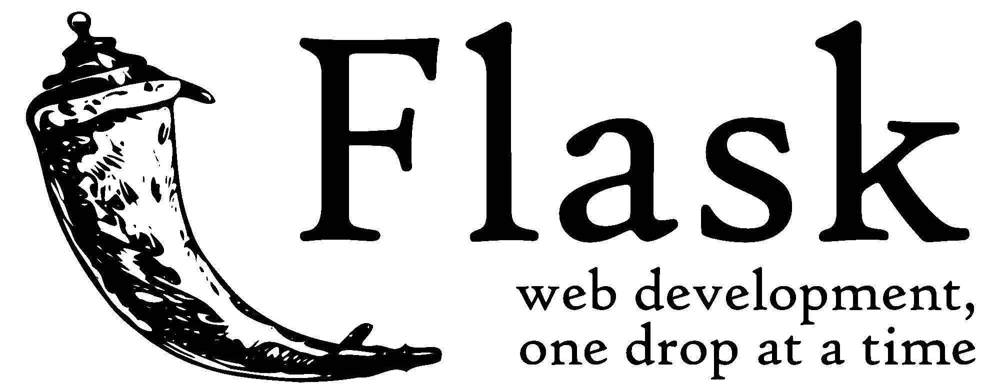

Just this would have been more than enough

然而，我们使用了这项技术，并在这个过程中学到了很多。

### 我在担任首席技术官的头几个月学到了什么

我从第一次尝试开发客户实际使用的应用程序中学到的一个教训是，过度考虑可伸缩性通常是没有用的。

当你学得更快时，用你已经熟悉的东西工作并尽快交付会更有用。这其实是创业公司最重要的。

你学得越多(关于业务、顾客想要什么、如何与他们交谈)，你尝试的下一件事就越有可能成功。

经过几次迭代，我们终于准备好向已经为我们的服务付费的客户发布我们的封闭测试版。

## 我们如何发布我们的第一个产品(封闭测试版)

我们能够在 2019 年夏天结束时制作第一个版本的应用程序，并为我们的用户推出它(比我们承诺的时间晚了 1 个月)。它不漂亮，几乎不起作用。

我们必须在整个过程中照看我们的用户，而应用程序的买方部分是不可用的。我们不得不为我们所有的买家手动完成这项工作，而供应商可以创建报价。

不过，最棒的是，我们继续能够收到感兴趣的人的支票，这有助于推动开发。不过，我们在招聘方面犯了一些错误。我们雇佣了一位创始人的朋友，尽管他很有经验，但对其他初级开发人员来说却是个混蛋。

这是我第一次被解雇，我很高兴我做到了。创造一个愉快的工作环境比技术能力重要得多，因为最终没有人愿意在一个糟糕的环境中长时间工作。

让人们长期留在创业环境中对公司的成功至关重要。我相信这是我们的创业公司仍然活着的原因之一。

随着开发的进行，我们意识到我们必须对公司进行比我们现在所做的更多的调整。感谢 Centech 有如此多的创业公司和成功公司，我们可以互相学习。

那一年，我们专注于融资(这是业务中非常重要的一部分，应该优先考虑)。我们还专注于进行某种营销，做出有意义的实际设计，而不是即兴创作，并确保我们的团队由全职人员组成，而不仅仅是实习生。

我们还从 Centech 的地下室搬到了二楼一个带窗户的办公室，实际上非常不错！然而，我们很快就达到了最大容量，创始人不得不开始在大楼的餐厅工作，以便员工有更多的空间。

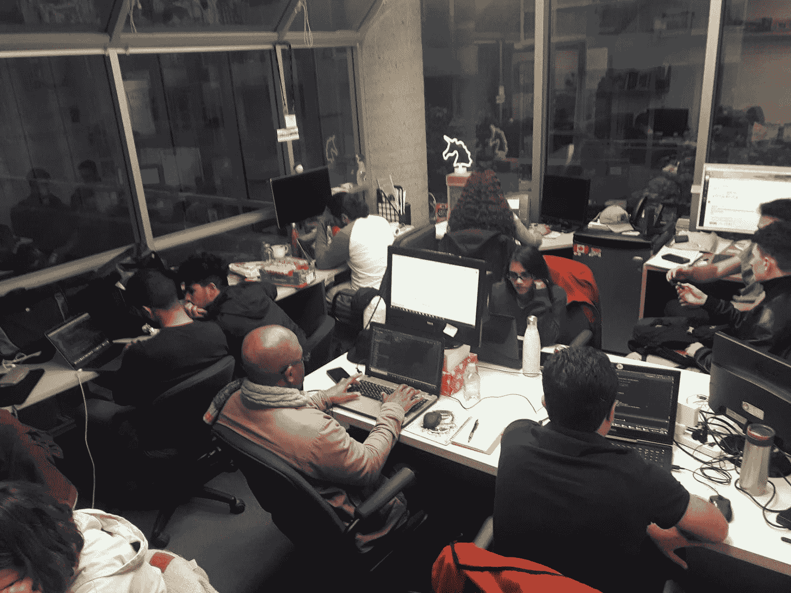

This was way too crowded in retrospect, but at least the view was nice

### 我从第一次发射中学到了什么

在我们第一次发布后，我学到了很多东西:

不要做官方发布。没用。我们给自己施加了如此大的压力，以浮夸的发布给付费客户留下深刻印象，我们担心如果我们不交付，他们会生我们的气。

事实是他们并不真的在乎。当我们发了一封道歉邮件说我们不得不推迟发布时，没有人抱怨。我敢肯定，他们对我们能够如此快速地启动并运行某些东西感到惊讶。

**即使你的 SaaS 应用程序有付费客户，也要优先考虑手工操作，而不是构建应用程序**。回想起来，我应该制作一个简单的表单，买家可以上传一个包含报价请求的 Zip 文件，然后发送到创始人的电子邮件地址。

然后，我们会手动向我们知道会对这类工作感兴趣的制造商发出请求。那会更快地向我们的用户交付价值，并释放开发压力。

这也验证了我们的许多假设，这将加速开发工作。

专注于很少的几件事，并确保这种专注明确地写在某个地方。在某个时候，我正在创建一个区块链驱动的 smart request for quote，因为它是由一位认识区块链科技公司工作人员的联合创始人宣传的。那纯粹是浪费时间，我很高兴我很快就终止了那个项目。

我们开始加速前进，我们终于有了可以向世界展示的东西。这仍然不太好，但是客户看到了我们所创造的价值，我们更清楚什么在创造价值，什么没有。

我们准备开放我们的测试版，以增加我们的应用程序的用户数量！

## 我们如何向更多用户开放我们的产品

在使用早期用户的反馈调整平台后，我们现在对我们到底需要构建什么有了更好的理解。我们现在准备增加使用我们平台的人数，并开始增加销售额(创始人做到了)。

这给我们的应用带来了更大的压力，我们开始经历停机时间。我们知道，如果我们想扩展到更多的用户，我们必须改进我们构建这个产品的方式。

我们询问了一位经验丰富的软件架构师，他现在是团队的全职成员(感谢 [Karim](https://www.linkedin.com/in/karimbesbes/) ！)，来帮我们解围。这真的给了我们一个坚实的方向。以下是我们所做的更改:

*   我们转向 AWS 是为了更好地控制云环境。
*   我们搬到 Gitlab 是为了有一个更易于使用的 CI/CD 环境。
*   我们在应用程序中添加了自动化测试。
*   我们开始向 Material-UI 而不是 Bootstrap 迁移。

在改进了我们的工作方式后，我们现在有了一个完全正常工作的 CI/CD 设置和一个经过严格测试的更健壮的应用程序。我们经历的停机时间大大减少了，开发人员对他们所做的改变更有信心了。这也是一次更愉快的开发经历。

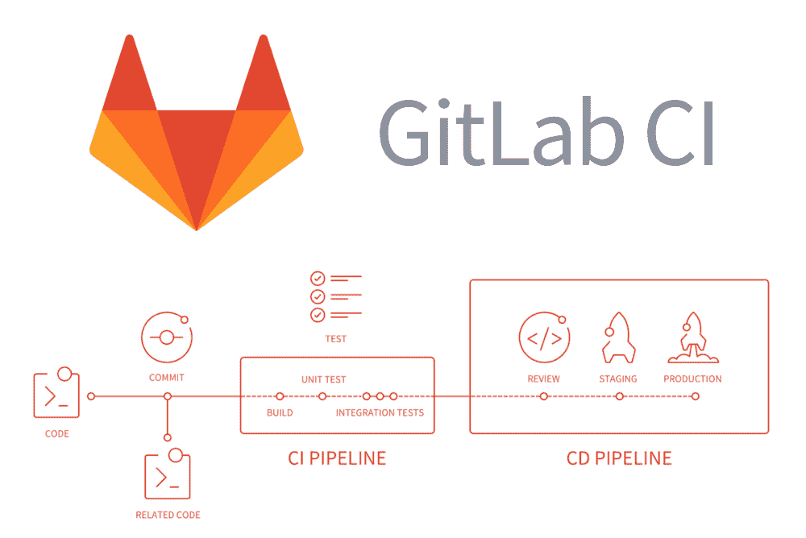

Gitlab is a very enjoyable work environment and reduces a lot of the complexities with lots of tooling. Credit: https://about.gitlab.com/

### 我从第一次公测中学到了什么

在那期间，我了解到产品的最小可行产品(MVP)阶段是必要的。但是当你摆脱这种状态时，你应该毫不犹豫地寻求专家的帮助。

现在，我们的销售给了我们更多的客户(这仍然有点难以获得，但会以稳定的速度增长),应用程序提供了比以前更多的价值。

我们已经准备好申请我们的第一笔真正投资了！

## 我们如何获得第一笔真正的投资

我们从 *[Front Row Ventures](https://blog.frontrow.ventures/)* 申请了一笔资金，这是一个完全由学生管理的风险投资基金，只投资于加拿大各地学生领导的创业公司。

我们和前排的人见了面，解释了我们在做什么，以及我们要去哪里。

最后，我们不得不在一群学生面前做了 25 分钟的演讲，他们问了很多关于业务和技术的实质性问题。

这很棒，因为我们知道如果我们得到了资金，我们不仅会有现金，还会有新的联系，可以回答问题，为我们做战略介绍。

It was great, some of these people went to the same university as I did!

嗯，[我们最终获得了资金，前排的人在公司的许多方面都很有帮助](https://blog.frontrow.ventures/behind-the-deal-grad4-4f0e92b2a547)！

### 我从获得第一笔资金中学到的是

这是我在那段时间学到的另一个重要的经验:当选择一个投资伙伴时，不仅仅是资金的问题。还在于他们能提供多少帮助。

Front Row 最终为我们打开了更多的大门，并确保他们的投资拥有所有可能的成功工具。

## 我们的日常生活是什么样的

在业务方面，我们一切都很顺利。然而，我们跟随的步伐有点令人担忧。我们是一家典型的初创公司，员工朝九晚五，创始人每周工作 80 小时。

周末在办公室开会，计划事情，完成更多的任务是家常便饭。

我对此不太满意，因为这种类型的工作从长远来看是不可持续的——我开始看到其他人筋疲力尽的迹象。我们也不是非常结构化，文档很差，我们几乎没有清晰的流程图。

就在那个时候，我开始阅读更多关于如何恰当地构建一个公司，以最大化我们成功的机会(见最后的阅读材料)。

然后，不知从哪里，我们开始听到疫情袭击我们加拿大海岸的可能性...

## 当新冠肺炎来袭时，我们如何重组

一些员工非常害怕病毒和生病。在加拿大还没有病例，但是一些雇员在国外有家庭，他们在疫情课程中的领域更先进。

我们开始思考我们能做些什么，我们意识到我们不一定需要让人们来办公室工作。所有的工作都可以远程完成——这只是我们建立的文化，要求人们每天朝九晚五。

这种类型的时间表直接取自我们都熟悉的东西，但我们意识到我们不必像我们工作过的所有其他公司那样做。

我们决定让每个不愿意去办公室的人都呆在家里。我个人决定不去办公室，我们的大多数员工都照做了。

As long as people had a the tools they needed, they didn't need to go into the office: Photo by [XPS](https://unsplash.com/@xps?utm_source=ghost&utm_medium=referral&utm_campaign=api-credit) / [Unsplash](https://unsplash.com/?utm_source=ghost&utm_medium=referral&utm_campaign=api-credit)

这很好，因为我们很快意识到，我们公司结构的许多缺点被所有员工每天都在办公室的事实所掩盖。每个人总是试图在随机时间安排一次缩放会议，或者在一天中的任何时间打电话询问操作任务的状态。

我们还意识到，人们很难找到所有信息的位置，许多不同的人多次问同样的问题。

我决定多读一些关于如何有效地构建远程工作的内容，因此我们阅读了 Gitlab 的[远程行动手册，并实施了一些更改:](https://about.gitlab.com/resources/ebook-remote-playbook/)

*   我们通过公开和书面信息的方式消除了不同团队之间的隔阂。
*   我们对文档进行了组织，以便人们将他们的文件放在共享驱动器中，而不是通过即时消息应用程序发送。
*   我们为所有部门设置了看板方法，而不仅仅是从事技术工作的人，因为任务没有被正确地跟踪。
*   我们减少了同步会议，只安排那些必要的会议，并以某种形式传达会议的结果。

这个帮了大忙！然而，它需要时间才能真正站稳脚跟。当每个人都能从谈话中获益时，人们仍在进行私人信息交流讨论。同步会议仍然是许多人共享信息的默认方式。

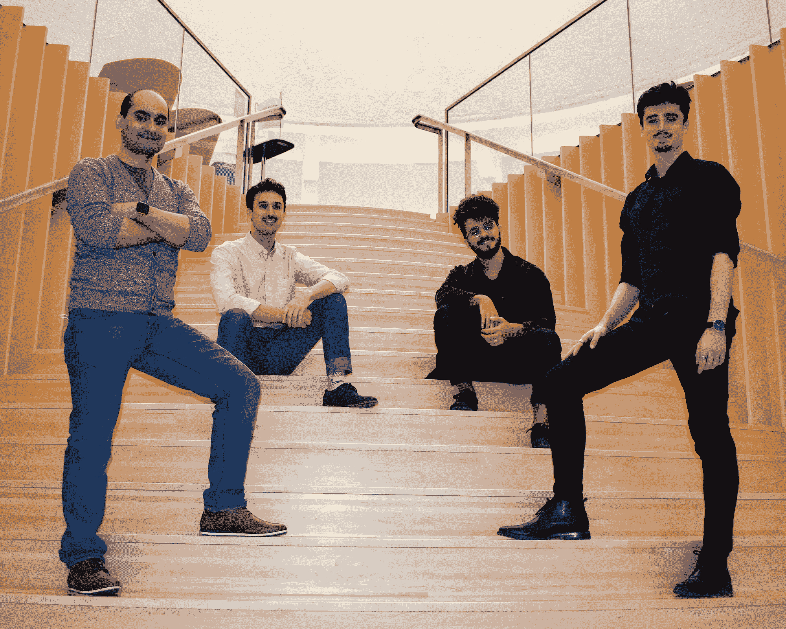

Here are the co-founders trying to keep 2m distance in our first pandemic meetup (and photo shoot) 

但情况有所好转。通过投入大量精力让远程工作发挥作用，我们大幅提高了公司的生产力，远远超过了疫情时代之前的水平。

从某种意义上说，我们被迫体验远程工作是有帮助的(因为我们有一段时间处于完全封闭状态),因为这给了我们从那些怀疑这是否可能的人那里获得必要的认同。

除了全力以赴进行远程工作之外，别无选择，否则公司就会陷入停顿。我们要给员工发工资，所以等着疫情出局不是办法。

从商业角度来说，我们非常幸运，因为我们的平台对那些不能再亲自做生意的制造业非常有用。

我们知道的一些创业公司就没有这么幸运了，他们的整个业务现在不可能在很短的时间内运营。他们中的大多数不得不关闭商店或进行一些激进的改革。

### 我从转向远程公司结构中学到了什么

疫情的头几个月给了我一些非常重要的教训:

**创业是非常非常非常冒险的**。如果你在 2019 年创办了一家拼车创业公司，事情对你来说很棒，一旦 2020 年疫情来袭，你仍然不得不停止这项业务。

无论你准备得多么充分，每天都有风险和不可预见的事件发生。

**为公司工作比作为创始人为公司工作更有价值**。我的意思是，花时间构建公司，调整人们的工作方式，以提高生产率，这是非常宝贵的。你不能指望员工在做好本职工作之外还做那些事。创始人有责任建立一个合理的结构，并不断改进它。

**只有当你花时间让远程工作发挥作用时，远程工作才会比面对面工作(如果可能的话)提高你团队的生产力**。试图复制一种在办公室远程工作的方式会导致生产力的明显下降。为了使这种类型的工作有用，需要进行剧烈的改变，这需要信念的飞跃。

在那段时间里，我们仍然在增长，因为我们雇佣了更多的人来维持我们的快速发展。我们还在创收方式上做了重大调整，将基于订阅的模式转变为交易费模式。这使得我们的销售团队能够快速增加我们在应用程序中注册的公司数量。

考虑到我们从客户那里收集到的所有新信息，我们的第一个应用程序版本开始显示出没有得到最佳调整的迹象。因此，我们正与一个专门的用户界面/UX 团队一起努力改进它的设计和用户体验。

## 应用程序的改进版本

我们发布了新版应用程序(这次没有严格的截止日期)，反响非常好。这时候我开始觉得我们实际上推出了一个真正的产品，而不是一个验证需求的 MVP。

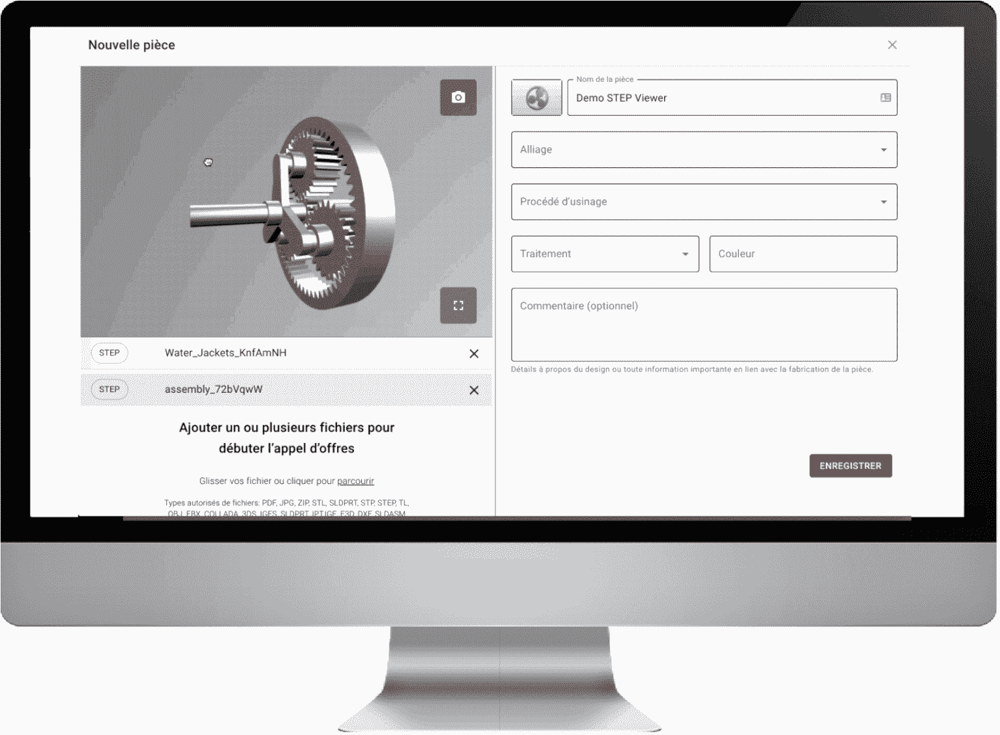

You could now see the part directly on the platform (we've used [xeogl](https://xeogl.org/) for that)! 

由于用户界面非常棒，而且这种体验对潜在用户来说很有意义，我们产品的销量急剧增加。我们继续做一些更大的重构和清理技术债务。

我们知道我们平台上增加的负载意味着我们需要更干净的东西来工作。这一点很重要，因为技术债务总是会慢慢增加，你不能总是构建功能。

我们正慢慢从公司的启动阶段走出来，进入更严肃的领域，这感觉很棒。我们在客户服务和营销方面招聘了更多的员工。我们每月都在改进公司的运营方式。

大约在那个时候，我们决定实施两个系统来提高我们的生产力:

**目标和关键结果系统:**这确实将我们的整个心态从长时间工作转变为致力于目标实现。通过设定具体的目标来改善公司的运营，这使得每个人都可以专注于真正重要的事情。

它还允许我们在人们工作或休假时停止追踪。只要目标得以实现，员工的工作流程并不重要(只要他们没有过度工作)。

**来自 Traction 的 EOS 系统:**该系统是一个非常好的基础系统，可以确保每个人都保持一致。这确实改善了我们的会议结构，并为公司的愿景奠定了基础。

我曾经对拥有愿景或核心价值观的想法嗤之以鼻。但是在阅读了这本书并实施它之后，我不明白我们是如何做到的。

这让每个人都达到了我们认为不可能的水平，并让我们这些创始人为公司做出更好的决策。

现在感觉我们真的在以坚实的步伐奔跑。每个月我们公司都有重大改进或好消息。整个创业过程感觉更容易，也更愉快。

### 我从第二次产品发布会中学到了什么

在发布期间，我学到了另一套很好的经验:

作为创始人，你的工作是“提升和委派”。在某一点上，如果你还在工作的细枝末节上工作，你就是在浪费资源。

通常情况下，雇佣比你更有能力的人来做运营工作，并转移到另一个没有员工的职位，会更有成本效益。通过降低风险，为公司的薄弱部门打好基础，你就确保了雇佣某人是值得的，而且这个人是有起点的。这是无价的。

没有人能有效地在不同的工作类型上每周工作 80 小时。当我们看到公司最薄弱的地方时，我们意识到了这一点。因为没有足够的时间来做高质量的工作，所以总是有人有 3 顶不同的帽子在那里工作。

如果你作为创始人在 3 个不同的岗位上工作，每周工作 80 小时，这相当于做一个疲惫的兼职工人。文档会很差，过程会不存在，错误会开始出现。一旦我们看到有人一周工作超过 40 小时，这就是一个巨大的危险信号，我们需要把负担分配给其他人。

兼职和志愿者通常都是浪费时间。当我们加快速度时，我们发现自己一直在等待兼职人员或志愿者完成他们的工作。这阻碍了我们的发展，所以我们制定了一项政策，不再雇佣兼职员工。然而对实习生来说就不一样了，因为他们有完善的工作安排。例如，我们目前有 3 名实习生从事各种机器学习项目，作为他们博士学位的一部分。这是完美的，因为交给他们的工作是平衡的，我们知道会发生什么。

大约在新平台发布的时候，我们开始了我们的第一个加速器计划。

## 下一代人工智能和生态燃料加速器

那时候我还真不知道什么是加速器。然而，通过一分为二，我很快理解了加速器和孵化器之间的区别。

加速器的工作是为已经启动并运行的初创企业提供工具，以加速它们的发展。另一方面，孵化器通常是创业公司开始的地方。

加速器非常有用的一点是，他们为他们选择的初创公司提供资金。通过 NEXTAI 和 EcoFuel 加速器，我们总共获得了 100，000 美元的资金！

这比我们待过的孵化器快多了。我们与令人难以置信的企业家一起上虚拟课，与 Yoshua Bengio 等机器学习研究人员一起上技术课。

在疫情期间，我们还遇到了其他了不起的科技企业家，他们面临着类似的挑战，试图让创业公司扩大规模。

Here we are keeping the 2m distance for a photo shoot. 

就在那个时候，我们正式成立了公司更“研究”的一面，处理制作人工智能模型和处理我们收集的数据。我们给公司的那个部门配备了博士生和研究生(还有我！).

也是在那个时候，我们决定筹集风险投资(VC)的种子资金。我们做出这个决定是因为我们知道我们有一些很棒的东西，但是我们所处的业务类型需要快速扩展，以便为我们的客户提供最大的价值。

使用这个平台的人越多，它对使用它的人来说就越有价值。因此，获得资金来加快销售和营销是必须的。我们让首席执行官全职工作，因为这确实是一份全职工作。

在 NEXT AI 即将结束的时候，我们遇到了第一个重大的财务缺陷，这将永远改变我们看待公司失败的方式。

我们认为，就像 Centech 一样，我们处于一个非常有利的位置，可以在项目结束时获得融资。然而，我们进入了决赛，但没有进入前 3 名。

这是一个重大的打击，因为我们认为我们在整个项目中非常稳定。

在收集了更多关于我们为什么没有入围的信息后，我们意识到在项目组织者认为我们正在做的和我们正在做的之间存在着重大的沟通差距。

他们没有意识到我们的产品有多先进，也没有意识到我们为了补充我们的产品而构建的所有很酷的人工智能模块。

### 我从我们的第一个创业加速器中学到了什么

这是我们意识到非常非常重要的一课:

其他人对你创业的看法和你实际在做的事情一样重要(如果不是更重要的话)。我们不能责怪项目组织者对我们公司有错误的看法，因为他们甚至不知道我们公司发生的大部分事情。

每天都有很多很酷的事情发生，但相比之下，我们公开展示的东西数量很少。这是有问题的，将来会严重妨碍我们自己。这是我决定公开庆祝公司胜利的时候。

每次发布产品，我都会在我们的社交媒体上公开承认我的团队的工作。如果我们超越了主要的销售里程碑，我会发表声明。该公司人工智能研究的重大进展将在发生的一周内公开。

我过去讨厌在社交媒体上发帖，因为这感觉像是在吹牛，但这是迄今为止我们做出的最重要的改变之一。通过公开庆祝我们的胜利，我们增加了很多好机会的可能性。这是我们每天都在利用的公司的一个重要部分。

带着我们对如何最好地推广公司和提高我们成功概率的新认识，我们申请了另外两家更大的加速器(Creative Destruction Lab 和 MaRS ),并被接受了！

## 公司的现状

到目前为止，二月的最后一周是该公司表现最好的一周。用户活动在不断增加，参与我们项目的人数也在不断增加。我们还处于融资的最后阶段，这将使我们能够大幅加速增长。

不过，也不是说都好了，现在就没事干了。开始了解一个主题并改进工作方式的一个诅咒是意识到还有多少地方需要改进。

我在 Trello 上的公司改进清单永远不会变短。每次我写完一本书，我都会有二十个新的改进想法，每次我和一个导师交谈，我都会有十几个新想法。即使我完成了一个改进的实现，我还会产生三个改进。

不过，知道你为提升自己和创业付出的所有努力都有回报，这非常令人欣慰。此外，意识到你已经创建了一个可以为其他人提供服务的公司是令人惊讶的。

我做了很多努力来摆脱我们旧的创业思维模式。这意味着:

### 所有员工都有无限的假期

这基本上意味着我们不跟踪任何人的休假时间。我唯一一次和员工谈论假期是在我觉得他们休假时间不够的时候。

### 没有工作时间。

如果一名员工想在清晨或深夜工作，我并不在乎(因为我也在乎)。只要合理地满足了目标，就没有什么值得跟踪的。

### 没有人会吹嘘自己被允许堆积的工作量。

没关系。只有目标才重要。如果有人工作时间异常长，我们会向人事关系部门报告，并提议招聘更多员工。

### 我们投资于我们的员工

我们通过购买书籍、课程、会议门票、证书或为他们寻找导师来投资他们。学习是公司文化的重要组成部分，并得到大力提倡。这对我来说也很棒，因为我可以在亚马逊上买到所有我想要的书！

简而言之，我正在努力建立一家我喜欢为之工作的公司。这是我一路走来所做选择背后的指导原则之一，它真的创造了我引以为豪的东西。

## 我对有抱负的 SaaS 企业家的建议

这就是我如何成为我的公司的首席技术官的，我的公司有 20 多名员工，都是通过参加随机的黑客马拉松。这是一个疯狂的旅程，现在仍然是，但我不会用这个来换任何其他工作。

我想以我一路走来学到的给科技企业家(尤其是 SaaS)的一系列建议和提示来结束这一部分。为了方便起见，我把它分成了几个小节。

## 一般产品建议

### 你的产品远没有你想象的那么重要

客户能从你的产品中获得的价值才是最重要的。如果你能以比拥有一个完整的应用程序更简单的方式向你的客户交付同样多的价值，那就去做吧。

你会学得更快，你也能为你的客户创造更多的价值。然而，从某种意义上来说，不断增加你所能提供的价值的唯一方法就是拥有一个好的应用程序。在这一点上，你应该有一个很好的想法，什么是重要的放在里面。

### 在考虑解决方案之前，验证产品的需求

在一个客户不关心的应用上花费时间和精力是对时间的最大浪费。

和他们一起验证每一步，看看你所做的是否有用。甚至以开发时间为代价。

### 你选择的技术没有你想象的那么重要

最重要的问题是，你是否有足够的知识用你选择的技术建造一些东西，你是否能安全地雇佣人来使用它。

花时间寻找最佳的堆栈通常是没有意义的。

### 一开始不要让你的应用程序过于复杂

从一个好的旧的整体开始，在需要的时候逐渐重构它。整块建筑将像一个比你想象的更长久的魅力！

### 在你的应用中加入最少的功能，为你的客户创造最大的价值

您拥有的功能越少，维护就越少，bug 就越少，您积累的技术债务也就越少。如果一个特性没有被你的用户使用，就把它从你的代码库中删除。

### 与您的客户交谈

尽可能多花时间和他们在一起，并真正从他们身上学到东西。您将获得的知识将成为一个主要的竞争优势，并允许您始终向他们提供价值！

### 在某些时候，CI/CD 和一套好的测试是救命稻草。

不必摆弄部署，不必担心在代码中引入回归，这是一种解放。

当您必须阅读测试错误时，它允许您变得更有效率，并且对整个代码库有更好的理解。

### 监控非常重要，应该尽快实施

能够知道正在使用什么，应用程序的状态是什么，以及是否有潜在的问题是必须的。

没有监控工具就像晚上戴着太阳镜在森林公路上开车一样。这有点奇怪，而且通常不是去你想去的地方的安全方式。

### 不要外包你的核心竞争力。

这个建议全是大写的，因为我是在喊它。如果你的核心业务是制作一个 web 应用程序，确保你拥有制作 web 应用程序所需的一切。

依赖那些无法直接接触到你的客户或你的现实的外包公司肯定会把整个事情搞砸。因此，为了不将核心竞争力外包出去，你清楚地定义自己的核心竞争力是非常重要的。

## 人工智能建议

### 人工智能很棒，但向客户交付价值更好

如果你不需要 AI 给客户传递价值，就不要把 AI 放在你给他们的东西里。它会大大降低你的速度。然而，如果你确认你确实需要某种人工智能来为你的客户提供价值，那就把它作为你公司的头等大事。

### 确保你正在为你的人工智能收集正确的数据

如果您正在与合作组织合作，这一点尤其重要，因为他们通常不知道对于给定的问题什么是好数据。在获得更多数据之前，你需要弄清楚这些数据对于你正在处理的问题是否有用。

### 从线性回归开始，逐步深入到具有数千层的深层神经网络

即使你的任务有足够的数据来尝试更大的模型，也要从简单的开始。它将允许对您的数据进行快速反馈，并将帮助您获得一些基线性能，这些性能可以用作更大模型的基准。

### 迭代改进你的 AI 系统，不要等到一切都完美了再推出。

给一个人工智能系统贴上测试版的标签，并开始在更大范围内与用户进行实验，这很好。这适用于你构建的任何产品，但我觉得这在人工智能环境中值得再次提及，因为它经常被遗忘。

## 公司建议

### 加入孵化器

你将得到的指导——甚至是在被接受之前从评委那里得到的指导——是非常重要的。他们已经看到了成千上万的创业想法，他们将能够给你一些非常有价值的建议。

孵化器通常由政府为他们项目中的每一个初创企业支付费用，这意味着这对每个人来说都是一个双赢的局面。

### 加入孵化器后加入加速器

这给了你额外的资源，让你在业务的非常专业的部分(如机器学习或融资)得到非常好的指导。这也是一个非常好的网络方式！

### 为你的公司建立你的核心价值观和愿景

有远见就像一种超能力。一旦有人第 n 次抛出区块链的想法，你可以说它不符合愿景，然后马上把它扔回去。

如果有人态度恶劣，你可以很容易地公开展示你的核心价值观并改正。当所有这一切都建立起来并被整个公司所理解时，招聘和解雇就容易多了。

### 尽快记录您公司的流程

即使在早期阶段，你也会惊讶于你有这么多的过程。你也会惊讶于大家对它的了解是如此之少(包括你自己！).

通过记录这些过程，你将处于一个非常好的状态，开始改进和完善它们，以提高每个人的生产力。

### 你很可能不需要办公室

如果你正在构建一个 SaaS 产品，你的东西很可能会在云上，你的产品将会完全基于软件。了解如何高效设置远程工作环境，并尽早节省办公成本！

### 会议没有你想象的那么重要

面对面的同步会议没有那么有用。我发现，大多数时候，只要有一份谷歌文档，说明你想在会议中解决什么问题，并将其分发给你想见的人，这就是 99%的工作。

你会得到一些关于改变什么的评论，3-4 次异步的来回讨论，然后 *voilà* ！另一个问题修复。

### 会议有时是必要的

不，无论如何会议都是不可能的(我是一个铁杆异步者，甚至我也需要承认这一点)。如果在发送文件后，你有 30 条评论，你陷入了僵局，通常是时候敲响会议的钟声，同时解决争论点。

大多数时候，这是一个沟通不畅的问题。有了这种同步的来回切换，可以更有效地解决问题。

### 向所有员工公开公司的大部分信息

如果与工作相关的事情不必对特定人群保密，那就应该是公开的。通过有机会参与他人的运营讨论，您可以提供非常需要的反馈，从而节省大量时间。

此外，通过让每个人都可以使用这整个知识库，您可以确保人们都知道其他部门正在发生什么。

### 确保私人物品保持私密

这既适用于与安全相关的敏感材料，也适用于私人员工事务。如果员工告诉你一些私人的事情，不要破坏这种信任。

### 不断改善你公司的结构

公司是一个不断成长的有机体。今天最好的结构不一定是一个月后最好的。它需要不断调整和改进，以最大限度地提高人们的工作效率。

### 小心不要与大型实体如城市、跨国公司或政府合作

这些都很慢，最终可能会让你的公司窒息。他们会一次又一次地预约会议，一点一点地推进项目。即使他们付你很多钱，你可以用他们做的学习周期是如此之长，你不会有很大的提高。

与较小的实体合作可以获得更直接的反馈。如果你能收集到足够多的信息，你就能拥有一个更加强大的企业。搁在一千根小柱子上，比搁在两根大柱子上更稳。

## 员工建议:

### 不要仅仅因为他们的技术技能而雇佣混蛋

这是一个大禁忌。如果你这样想，一个人会通过使文化汤变酸来扼杀每个人的生产力。

如果人们因为这个人而害怕去工作，你将会遇到比这个人的代码所能解决的更多的问题。

### 文化契合不是一个选项

清楚地检查这个人是否有你所寻找的技术能力。然而，同样严格地检查这个人是否适合你的公司。

让某人与公司发生冲突或不坚持你的核心价值观之一将弊大于利。

### 团队配合不是一个选项

让团队成为招聘过程中不可或缺的一部分。你会惊讶于这个团队在招聘过程中的挑剔程度和严谨程度。

我们面试的人通过了技术面试和文化面试，但没有通过团队面试，这种情况经常发生。

拒绝团队中的参与者的理由总是有效的，我们不相信我们没有在过程的早期发现它。

### 神经多样性提高生产力

如果你想拥有一家真正高效的公司，你必须抑制住雇用和你想法完全一样的人的冲动。

通过让来自不同背景的人参与进来，你将增加找到解决问题的创造性方法的机会，并且你将减少很多盲点。

### 不要试图在公司里建立一个好的形象，找到一个符合需要的好形象

总是从评估你最迫切的需求开始，然后找到最合适的人来填补这个职位。以另一种方式开始，你会让你的公司变得臃肿，因为那些人并没有真正创造价值。

### 你将不得不解雇员工，这是最好的选择

我不得不解雇公司里的一些人，每一次对各方都有好处。然而，要带着尊重去做。如果你做了所有的工作把某人带到你的船上，你也应该做所有的工作把某人带出来。

这意味着要确保这个人明白为什么不合适，你给出了足够的警告信号，并确保这个人在离开公司后能得到他们需要的支持。

### 确保你的员工真正快乐

如果有人感觉不好，和他们谈谈，帮他们解决问题。祝他们生日快乐。当他们做了伟大的事情时，说谢谢。当他们想要成长时，蔻驰教他们。当他们出错时，调试他们。

作为一家初创公司，拥有快乐的员工是你最有价值的财富之一，也是为什么在这样的公司工作是如此美妙的经历。

## 个人建议:

### 确保创始人或高管不会自相残杀，也不会伤害公司

当你有一个有毒的创业文化，疯狂的工作时间，加上财务压力和客户问题，你会得到什么？公司失败的良方。

确保每周至少留出一个小时，不要谈论公司，而是互相检查，试着公开解决个人问题。

### 跟我念:这是👏a👏马拉松赛跑👏不👏a👏冲刺

疯狂的工作环境不能持续。不是**如果**你会累垮，而是的时候**。**

如果你不能想象在你的余生中保持现在的工作节奏，在为时已晚之前改变它。

我见过太多的创业公司突然崩溃，因为人们认为他们可以永远没有时间休息。

### 为你的个人成长留出空间

了解那个完全留给你创业领域的话题，并享受它。为了你自己的利益去和别人交往吧，没关系。作为一个人，你成长得越多，你的公司的潜在增长就越高。

### 留出放松的空间

即使你喜欢创业，也不要忽视生活的其他方面。

工作之外有其他朋友很好，暂时不联系也很好。如果你做不到这一点，你的公司就有严重的问题需要解决。

### 玩得开心

从头开始创建一家公司真的很有趣。享受在那个使整个 EC2 实例崩溃的讨厌的 bug 上工作的时间吧。享受你打电话给这个对你的工作没什么好评价的客户的时间。

享受所有为你的公司铺平道路的小问题。因为创业只能做两件事:**死亡**，在这种情况下，你会带着美好的回忆回顾那些日子。**成长**，在这种情况下，它将开始成为比你更大的东西，并获得自己的个性！

## 有用(SaaS)创业阅读

### 精益创业:今天的企业家如何利用持续创新创造彻底成功的企业:

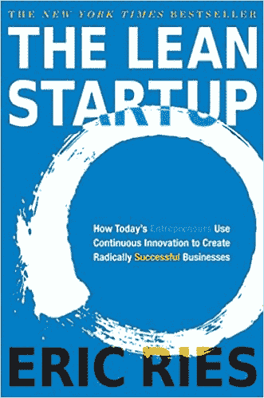

这本书读起来很简单，它教会了我在假设/学习中循环比立刻做最完美的事情更重要。

作为一个热爱技术的技术人员，我不明白为什么技术没有成为每个商业讨论的焦点。

这本书通过对真实用户进行大胆测试的清晰例子，向我展示了为什么在了解用户对产品的看法之前就专注于构建产品是一个坏主意。

### 牵引力:掌控你的生意

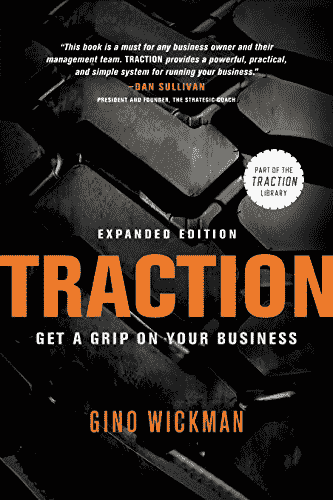

这本书让我明白，一旦我们的公司超越了创始人，该如何构建。我正在从头到尾读第六遍。

有很多有用的信息和实用的指导方针可以使用，以真正获得一个坚实的结构，对下一个增长阶段有意义。

它也有助于在思考未来时创造一种平静感，因为它增加了你对未来会发生什么的意识。

### 衡量什么是重要的:谷歌、博诺和盖茨基金会如何用 OKRs 震撼世界

我在读《牵引》之前读过这本书，然而《牵引》中的 OKR 球门结构和洛克球门结构有很多相似之处。基本的想法是，你只有有限的时间来完成目标/项目，所以做最有影响力的，放弃其他的。

简单地不去想那些低优先级目标的想法真的会在你的头脑中产生一种空间感。确切地知道应该关注什么，并有自由去思考如何实现这一点，也有助于创建一个超合作的结构。我在个人生活中也使用 OKR 系统。这真的帮助我确信自己走在正确的道路上，并允许我对一年中出现的与我的目标不一致的机会说不。

### Peopleware:生产项目和团队

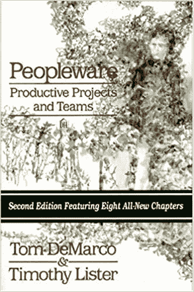

这是一本非常令人愉快的读物。它谈到了软件工程中经常不被考虑的一个方面，那就是人的因素。我绝对喜欢作者使用的直截了当的有机写作风格。

文中给出了大量的例子，并对他们的论点进行了重要的统计补充，这确实有助于衡量要实施哪些非常规变化。

### 驱动力:关于我们动力的惊人真相

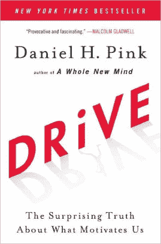

在它所涉及的主题上，Drive 与 Peopleware 有着非常密切的联系。这两者都有助于找出如何创造一个有目的的工作环境，促使人们全力以赴。

我学到了很多关于“胡萝卜加大棒”式的奖励/惩罚在传统的工作场所发挥了多大的作用，以及它如何不是增加动力的最佳方式。

这也让我明白了如何有目的地推动自己实现目标，而不必贿赂和欺骗自己。

### 有效的 DevOps:建立大规模的协作、亲和和工具文化

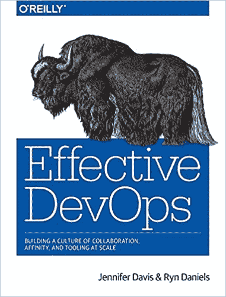

这本书是对 DevOps 文化的广泛介绍，是一本很好的手册，当你对某个方面或情况不确定时可以参考。

这本书更深入地向我介绍了这种思维方式，让我真正理解了它，而不仅仅是表面上的理解。它有一些非常简洁的例子，展示了 DevOps 的所有概念在现实世界中是如何联系在一起的。

然而，这是一本相当冗长的书。它意味着以非线性的方式被咨询。如果你管理一个技术团队，想知道在特定情况下该做什么，我建议你手边准备一本。

### 凤凰计划:一部关于它的小说，DevOps，帮助你的生意成功

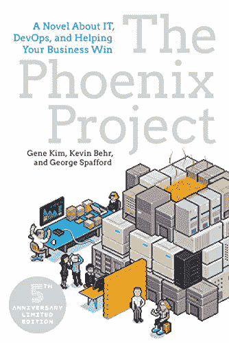

在读完《有效开发计划》之后，我又读了《凤凰计划》。有效的 DevOps 让我对运动有了更深的理解，但真正让一切“咔嚓”的是凤凰计划。

这是一部小说，但以如此有机的方式解释，它可能是一本传记。整个夏天，我在两天内读完了整本书，因为我非常关注主角与低效过程和“不可能”目标的斗争。

读完这本书后，我更加确信我对我的组织所做的改变是正确的。如果我有一本书可以送给一位非技术经理，让他们明白如何让一个技术部门失败，如何让它茁壮成长，那就是这本书。

### 设计数据密集型应用程序

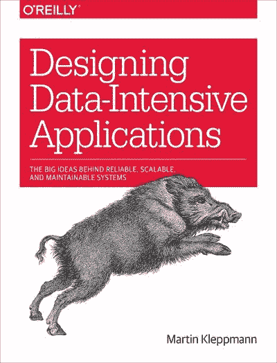

这本书充满了从解决非常困难的问题中获得的信息，当你解决困难的问题时，你可能需要不时地重读一遍。

我学到了很多，无论是互联网这个庞然大物的内部设计，还是这些庞然大物是如何通过面对源源不断的问题建立起来的。

发生在大规模系统中的交易、学习和模糊性的数量是惊人的。当我在我构建的小型(相比之下)系统中遇到各种问题时，它帮助我做好准备并更好地做出反应。同样地，这是那种在构建过程中需要定期阅读的书。

### 用开源打造你的未来:培养你的技能。建立你的人际网络。构建技术的未来

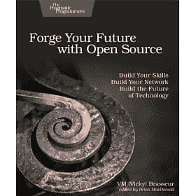

这本书确实帮助我更好地构建了我们的远程公司，这样我们就可以实现我们的业务目标，并帮助我们的员工感到高效和快乐。

我从开源项目的结构中获得了很多灵感，并在这个意义上做了很多改变。它还帮助我更好地理解和欣赏开源项目是如何工作的。

### 雷伊·达里奥的原则

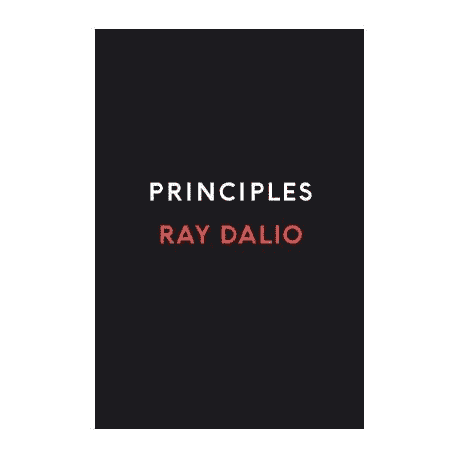

这是一本不可思议的书，书中有大量来自金融领域成功企业家的建议。

里面有用的内容数量惊人，需要多次阅读才能全部提取出来。如果你正在寻找新的想法，让你的组织更有效率，更善于解决问题，或刺激增长，这是必须的！

### 传递快乐:通往利润、激情和目标的道路

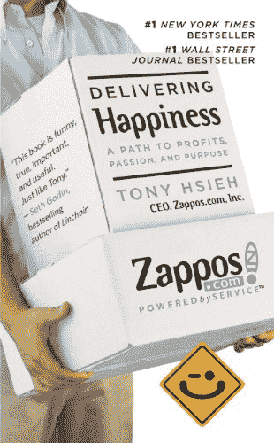

Zappos 已故首席执行官写的一本非常漂亮的书。这是一本不起眼的书，充满了谢家华在他的创业之旅中的好的学习和收获。

这里最重要的部分是专注于确保文化是正确的，因为他在职业生涯中有两个主要的公司成功:一个是没有专注于文化的 LinkExchange，另一个是投入巨资的 Zappos。

后者可以说是更强大的业务。

## 伸手

如果你有兴趣更多地了解我的公司，你可以查看我们的[网站](https://grad4.com/en/)。如果您有任何问题，请随时在 [LinkedIn](https://www.linkedin.com/in/yacine-mahdid-809425163/) 或 [Twitter](https://twitter.com/CodeThisCodeTh1) 上加我聊天:)

我希望这有所帮助！