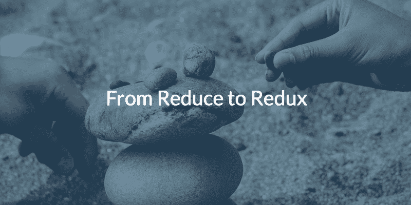

# 从 Redux 到 Redux:通过构建 Redux 来理解 Redux

> 原文：<https://www.freecodecamp.org/news/from-reduce-to-redux-understanding-redux-by-building-redux-918ef08abafe/>

约翰尼·斯内尔格罗夫



# 从 Redux 到 Redux:通过构建 Redux 来理解 Redux

我发现的帮助快速理解概念的两个最重要的技巧是*简化*和*边做边学*。 [Redux](https://redux.js.org/) 是一个非常流行的 JavaScript 库，用于开发“JavaScript 应用的可预测状态容器”它采用函数式方法来建模数据，这挑战了传统的 MVC 模式。

包括我自己在内的许多开发人员发现这种范式转换很困难。然而，理解这种方法是非常有益和有价值的。这些概念超越了语言和框架，在专业上，许多现代前端都采用 Redux 及其相关的功能范例来处理它们的客户端数据层。

在这篇文章中，我们将从头开始构建一个简化的 Redux 库，以便*真正*理解 Redux。从一个简单的 sum 函数开始，我们将逐步为一个简单的游戏代理建立一个 Redux 风格的状态管理系统。

#### 减少什么？

理解 Redux 的关键在于理解 *reduce* 函数的强大之处。来自[的 Mozilla 文档](https://developer.mozilla.org/en-US/docs/Web/JavaScript/Reference/Global_Objects/Array/Reduce):

> " reduce()方法对一个累加器和数组中的每个元素(从左到右)应用一个函数，将其缩减为一个值。"

如果这对你没有意义，不要害怕。 *reduce* 的强大来自于它的通用性，这也让它难以描述。要记住 *reduce()* 做什么，只要记住 *reduce* 和*演绎*押韵就行了。reduce 函数在给定现有状态和转换规则的情况下推导出下一个状态。它对数组中的每个元素都这样做，从左到右，连续传递结果，然后返回最终结果。下面是 *reduce()* 的一个可能实现:

```
function reduce (collection, transitionFn, initialState) {  let accumulator = initialState || collection[0]  for (let i = (initialState ? 0 : 1); i < collection.length; i++) {    accumulator = transitionFn(accumulator, collection[i])  }  return accumulator}
```

*边注:转换函数实际上接受四个参数:累加器、当前值(即集合[i])、当前值的索引和集合本身。然而，出于演示的目的，这里省略了 index 和 collection 参数，因为它们不相关。*

幸运的是， *reduce()* 已经是 JavaScript 中的内置数组方法，使用调用数组作为集合进行 reduce。既然我们对 reduce 函数有了一个概念，那么是时候深入研究一下，开始探索如何用它来建模游戏代理的状态了。

#### 使用 Reduce

为了理解*归约*的威力，我们将从规范的归约函数 *sum():* 开始

```
function sum (nums) {  return nums.reduce((state, nextVal) => state + nextVal)}
```

```
sum([1, 2, 3, 4]) // => 10
```

这个例子从来没有让我“啊哈！”瞬间。可能是因为它模糊了函数签名，并且不是很令人兴奋。这是一个同样的例子，所有内容都被明确地表达出来:

```
function sum (nums) {  function transition (prevState, nextVal) {    return prevState + nextVal  }  const [initialState, ...tail] = nums  return tail.reduce(transition, initialState)}
```

```
sum([1, 2, 3, 4]) // => 10
```

*注意:`const [initialState, …tail] = nums`使用 ES6 [析构](https://developer.mozilla.org/en-US/docs/Web/JavaScript/Reference/Operators/Destructuring_assignment)将数组拆分成第一个元素(initialState)和剩余的元素(tail)。*

这里我们可以看到 reduce 函数将一个转换函数作为它的第一个参数，将一个初始状态作为它的第二个参数。默认情况下，如果没有提供初始状态，reduce 将使用数组中的第一项作为初始状态。

#### 越来越具体

为了从概念上对更有趣的数据建模，我们可以用特定于领域的变量名重写 *sum* :

```
function move (steps) {  return steps.reduce((state, direction) => state + direction)}
```

```
xPosition = -2xPosition = xPosition + move([-1, -1, 0, 1, 1, 1])console.log(xPosition) // => -1
```

这仍然是同一个求和函数，但现在它在实际应用中的用法更加清晰了。我们的游戏角色从-2 的初始位置开始，然后我们结合一个方向列表来确定新的位置。传递给 *move* 函数的数组中的每个值可以被认为是一个**动作**，它将告诉缩减器如何改变它的状态。这里我们的动作没有名字，但是通过遵循一些简单的约定，我们到达 redux 的基础:

```
let store = 0 // initial position
```

```
const reducer = (state, action) => {  switch (action.type) {    case 'MOVE_LEFT':      return state - action.distance    case 'MOVE_RIGHT':      return state + action.distance    case 'WAIT':    default:      return state  }}
```

```
console.log(store) // => 0
```

```
store = [  {type: 'MOVE_LEFT', distance: 2 },  {type: 'MOVE_LEFT', distance: 3 },  {type: 'MOVE_RIGHT', distance: 7 },  {type: 'WAIT'}].reduce(reducer, store)
```

```
console.log(store) // => 2
```

如果我们同意所有的数组元素都是带有*类型*字段的对象，那么我们可以开始显式地处理 reducer 中的动作。此外，通过将现有存储作为初始状态传递给 *reduce()* ，然后用结果覆盖它，我们可以开始跨多个 reduce 调用转换数据。

我们还得到了一个类似于带有实例变量和方法的类的概念。在 OOP 中，*存储库*中的所有东西都可能是实例变量，动作类型可能是方法:

```
class Mover {  constructor (x) {    this.x = x  }
```

```
 moveLeft (distance) {    this.x -= distance  }
```

```
 moveRight (distance) {    this.x += distance  }}
```

```
let agent = new Mover(0)agent.moveLeft(1)agent.moveLeft(1)agent.moveRight(1)
```

#### 复数数据

此时，我们的角色只能左右移动，没有其他有趣的属性。为了让事情变得更有趣，并将这个概念扩展到多维数据，让我们添加上下移动的能力，并给玩家一些健康:

```
let store = { x:0, y:0, health: 100 } // initial state
```

```
const reducer = (state, action) => {  switch (action.type) {    case 'MOVE_LEFT':      return { ...state, x: state.x - action.distance }    case 'MOVE_RIGHT':      return { ...state, x: state.x + action.distance }    case 'MOVE_UP':      return { ...state, y: state.y - action.distance }    case 'MOVE_DOWN':      return { ...state, y: state.y + action.distance }    case 'TAKE_DAMAGE':      return { ...state, health: state.health - action.damage }    case 'DRINK_POTION':      return { ...state, health: state.health + action.health }    case 'WAIT':    default:      return state  }}
```

```
console.log(store) // => { x:0, y:0, health: 100 }store = [  {type: 'MOVE_LEFT', distance: 2 },  {type: 'MOVE_LEFT', distance: 3 },  {type: 'MOVE_RIGHT', distance: 7 },  {type: 'WAIT'},  {type: 'MOVE_DOWN', distance: 7 },  {type: 'TAKE_DAMAGE', damage: 50 },  {type: 'DRINK_POTION', health: 25 },  {type: 'MOVE_UP', distance: 2 },].reduce(reducer, store)console.log(store) // => { x:2, y:5, health: 75 }
```

这里的状态是一个形状为`{x: Float, y: Float, health: Float}`的对象。缩减器必须返回具有相同形状的新对象。为了返回一个新的对象，我们使用 ES6 object destructuring(例如`{...state}`)来创建一个传入状态对象的副本，然后用一个简洁的声明性表达式`return {...oldState, key: newKeyVal}`覆盖我们想要更新的字段。现在我们在用火做饭！

#### 概括和封装

为了包装这个逻辑并使存储具有通用性和可重用性，我们可以编写一个 *createStore* 函数来封装状态，并为读取状态和分派动作提供一致的 API:

```
const createStore = (reducer, initialState) => {  let store = initialState || reducer(undefined, {type: 'INIT'})  return {    dispatch: (action) => {      store = [action].reduce(reducer, store)    },    getState: _ => store  }}
```

```
var moverReducer = (state = { x:0, y:0 }, action) => {  switch (action.type) {    case 'MOVE_LEFT':      return { ...state, x: state.x - action.distance }    case 'MOVE_RIGHT':      return { ...state, x: state.x + action.distance }    case 'MOVE_UP':      return { ...state, y: state.y - action.distance }    case 'MOVE_DOWN':      return { ...state, y: state.y + action.distance }    case 'WAIT':    default:      return state  }}
```

```
let agent = createStore(moverReducer)agent.dispatch({type:'MOVE_UP', distance: 1})agent.dispatch({type:'MOVE_LEFT', distance: 2})agent.dispatch({type:'MOVE_RIGHT', distance: 4})agent.dispatch({type:'MOVE_DOWN', distance: 2})agent.getState() // => { x:-2, y:0 }
```

这里我们可以传递一个初始状态(可能是我们从 localStorage 加载的)，或者它将使用 reducer 的默认状态参数和一个虚拟动作进行初始化。我们的状态是用闭包封装的，对它进行读写的唯一方式是分别通过返回的 *getState()* 和 *dispatch()* 方法。

至此，我们已经有了一个基本但有用的 Redux API 版本！然而，我们省略了存储增强器和订阅，因为它们主要用于副作用和被动更新视图。在最后一节中，我们将简单地使用一个渲染循环和顶级代码来处理这些情况并保持简单。

#### 利弊

reducer 方法的第一个明显的好处是一切都很容易序列化。我们可以轻松地使用 localStorage 来保存和加载状态，序列化动作序列，通过 WebSockets 或 HTTP 请求发送动作，等等，所有这些都不需要构建处理程序来将 JSON 有效负载转换为实例方法调用。

此外，由于 reducers 应该是纯函数，所以不能保证通过更新模型数据不会在应用程序的其他部分产生意外的副作用。商店只关心数据建模和逻辑。这使得我们的数据模型非常具有可移植性，因为它们不关心它们的运行时环境。相同的 reducers 可能会通过 React Native 之类的东西用在 node.js cli 应用程序、web 应用程序或本机应用程序中。移植应用程序变成了编写特定于平台的副作用和视图代码的问题。

最后，我个人觉得减压器要优雅。这个概念更接近于一个数学方程，即从控制器脚本中设置模型中的值。以[Q-学习公式](https://en.wikipedia.org/wiki/Q-learning#Algorithm)为例。它的签名是一个状态/动作对！这使得将公式翻译成代码变得更加容易。

缺点是 redux 对于如何[处理副作用](https://github.com/reactjs/redux/issues/1528)(例如，呈现到 DOM、登录到控制台、保存到 localStorage、启动 Ajax 请求等等)没有很强的意见。你不可能构建一个没有副作用的有趣的应用程序，所以这可能有点令人沮丧。

解决方案通常是将这些代码用于创建方法、中间件，或者将它们移到应用程序的顶层(不理想)。然而，使用这种约束编写模型代码通常是有益的，因为它迫使您编写易于测试的代码，并关注您正在建模的逻辑。

其他缺点包括完成简单任务(如递增计数器)的大量样板文件，以及远离面向对象概念所需的一般认知负荷。然而，这些正是我们的模型如此便携和强大的原因！

#### 裹好衣服四处游荡

为了总结这一切，我们可以添加一个更新循环来调度随机操作并呈现代理的状态(这里我使用 React，但我们可以使用任何我们喜欢的视图层)。在每一次滴答声中，代理人要么朝一个方向移动，等待，服用药剂，要么受到伤害。如果代理的健康为零，它将重置。

请注意逻辑是如何开始在顶级更新/渲染循环中累积的。此外，我们必须复制初始 reducer 状态的代码，以便在代理的健康达到零时重置代理。

我们将在下一篇文章中解决这些和其他问题，但是现在，注意到逻辑至少可以存在于两个地方就足够了:缩减器或动作。在下一篇文章中，我们将看看如何选择放置该逻辑的位置，并继续深入研究，在我们开发越来越智能的游戏代理时，使用函数组合、高阶简化器和动作创建器使我们的模拟更加复杂。