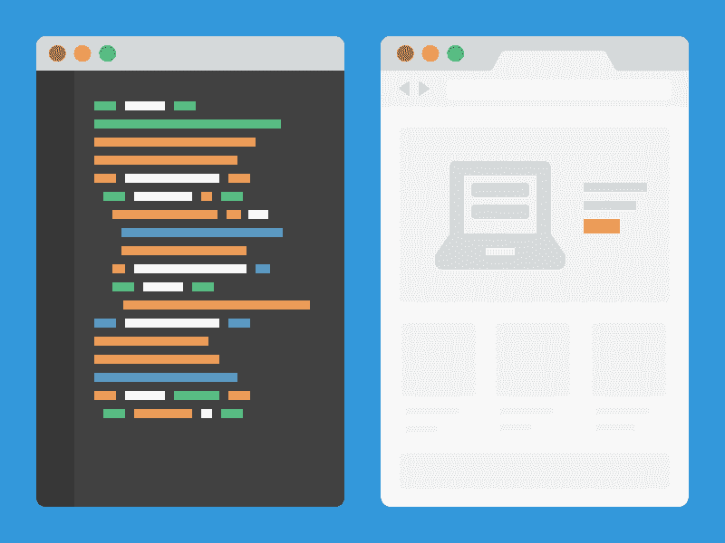
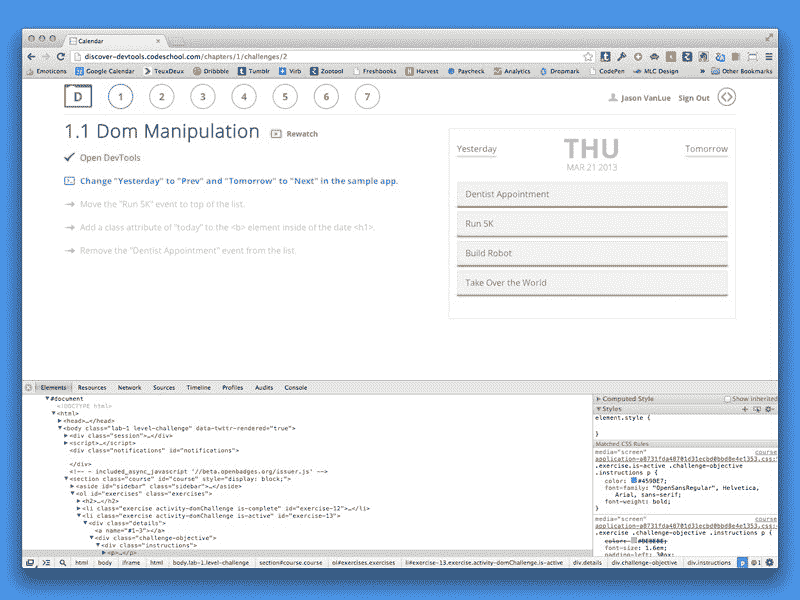
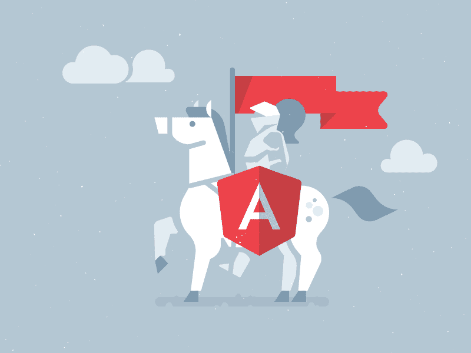
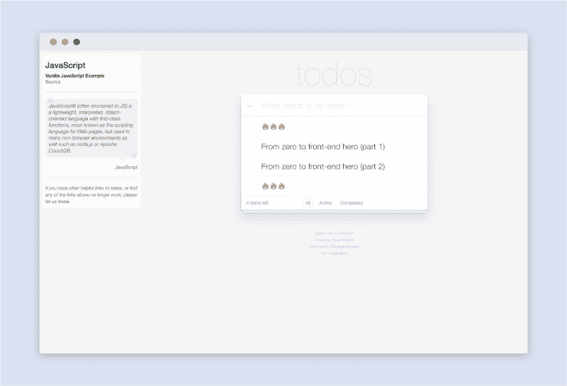
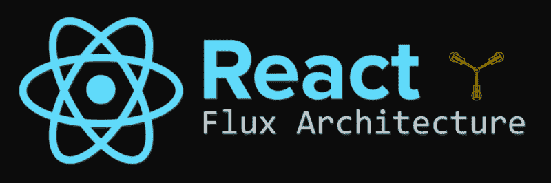

# 从零到前端英雄(下)

> 原文：<https://www.freecodecamp.org/news/from-zero-to-front-end-hero-part-2-adfa4824da9b/>

本文是“从零到前端英雄”系列的第二部分。在第一部分中，你学习了如何用 HTML 和 CSS 创建布局以及一些最佳实践。在第二部分中，我们将重点学习 JavaScript 作为一种独立的语言，如何为界面添加交互性，JavaScript 设计和架构模式，以及如何构建 web 应用程序。

就像 HTML 和 CSS 一样，有大量的 JavaScript 教程。然而，特别是对于刚接触前端的人来说，很难确定使用什么教程以及按照什么顺序来做。本系列的主要目标是为您提供一个路线图，帮助您导航学习成为一名前端人员。

如果你还没有读第一部分，那么在继续读之前先读一遍。

[**从零到前端英雄(上)**](https://medium.com/p/7d4f7f0bff02)
[*前端开发学习完全指南*medium.com](https://medium.com/p/7d4f7f0bff02)

### JavaScript 基础知识


JavaScript 是一种跨平台的编程语言，目前几乎可以用于任何事情，但是一旦您理解了开发人员如何在 web 上使用 JavaScript 的基础知识，我们将在稍后讨论它。

#### 语言

在学习如何将 JavaScript 应用到 web 之前，先了解一下语言本身。首先，阅读 Mozilla Developer Network 的[语言基础速成班](https://developer.mozilla.org/en-US/Learn/Getting_started_with_the_web/JavaScript_basics)。本教程将教你基本的语言结构，如变量、条件和函数。

之后，通读 MDN 的 [JavaScript 指南](https://developer.mozilla.org/en-US/docs/Web/JavaScript/Guide)中的以下部分:

*   [语法和类型](https://developer.mozilla.org/en-US/docs/Web/JavaScript/Guide/Grammar_and_types)
*   [控制流程和错误处理](https://developer.mozilla.org/en-US/docs/Web/JavaScript/Guide/Control_flow_and_error_handling)
*   [循环和迭代](https://developer.mozilla.org/en-US/docs/Web/JavaScript/Guide/Loops_and_iteration)
*   [功能](https://developer.mozilla.org/en-US/docs/Web/JavaScript/Guide/Functions)

不要太担心记住具体的语法。你可以随时查找。相反，应该专注于理解变量实例化、循环和函数等重要概念。如果材料太密，那也没关系。浏览阅读材料；你可以随时回去。随着你将这些概念付诸实践，它们会变得更加清晰。

为了打破基于文本的学习的单调，请查看 Codecademy 的 [JavaScript 课程](https://www.codecademy.com/learn/javascript)。动手又好玩。同样，如果你有时间，对于我上面列出的每个概念，阅读[雄辩 JavaScript](http://eloquentjavascript.net/) 中相应的章节来巩固你的学习。雄辩的 JavaScript 是一个伟大的免费在线书籍，每个有抱负的前端开发人员都应该阅读。

#### 交互性


[One use for JavaScript is for animating your layouts](https://dribbble.com/shots/2067564-Replace)

现在你已经对 JavaScript 语言有了基本的了解，下一步就是把它应用到 web 上。要理解 JavaScript 如何与网站交互，首先必须了解[文档对象模型(DOM)](https://developer.mozilla.org/en-US/docs/Web/API/Document_Object_Model/Introduction) 。

DOM 是 HTML 文档的一种表示结构。它是一个树状结构，由对应于 HTML 节点的 JavaScript 对象组成。要进一步了解 DOM，请阅读 CSSTricks 的[什么是 DOM](https://css-tricks.com/dom/) 。它为 DOM 提供了简单明了的解释。



[Inspecting the dom](https://dribbble.com/shots/1169778-Chrome-and-Sublime-text)

JavaScript 与 DOM 交互来改变和更新它。下面是一个例子，我们选择一个 HTML 元素并更改其内容:

```
var container = document.getElementById(“container”); 
```

```
container.innerHTML = 'New Content!';
```

别担心，那只是一个简单的例子。使用 JavaScript DOM 操作，您可以做更多的事情。要了解更多关于如何使用 JavaScript 与 DOM 交互的信息，请阅读 MDN 章节中的以下指南，[文档对象模型](https://developer.mozilla.org/en-US/docs/Web/API/Document_Object_Model)。

*   [事件](https://developer.mozilla.org/en-US/docs/Web/API/Document_Object_Model/Events)
*   [使用 DOM 进行 web 和 XML 开发的例子](https://developer.mozilla.org/en-US/docs/Web/API/Document_Object_Model/Examples)
*   [如何创建 DOM 树](https://developer.mozilla.org/en-US/docs/Web/API/Document_object_model/How_to_create_a_DOM_tree)
*   [DOM 简介](https://developer.mozilla.org/en-US/docs/Web/API/Document_Object_Model/Introduction)
*   [使用选择器定位 DOM 元素](https://developer.mozilla.org/en-US/docs/Web/API/Document_object_model/Locating_DOM_elements_using_selectors)

再次强调，关注概念胜于语法。能够回答下列问题:

*   这只狗是什么
*   如何查询元素？
*   如何添加事件监听器？
*   如何改变 DOM 节点属性？

关于常见的 JavaScript DOM 交互列表，请查看 PlainJS 的 [JavaScript 函数和助手](https://plainjs.com/javascript/)。这个网站提供了如何在 HTML 元素上设置[样式](https://plainjs.com/javascript/styles/set-and-get-css-styles-of-elements-53/)和[附加键盘事件监听器](https://plainjs.com/javascript/events/getting-the-keycode-from-keyboard-events-17/)的例子。如果你想深入了解，你可以阅读[雄辩的 JavaScript](http://eloquentjavascript.net/13_dom.html) 中关于 DOM 的部分。

#### 检查员

为了调试客户端 JavaScript，我们使用浏览器内置的开发工具。大多数浏览器中都有检查器面板，它让您可以查看网页的源代码。您可以跟踪 JavaScript 的执行，将调试语句打印到控制台，并查看网络请求和资源等信息。

这里有一个关于使用 Chrome 开发者工具的教程。如果你正在使用火狐，你可以看看这个[教程](https://developer.mozilla.org/en-US/docs/Tools/Page_Inspector)。



[Chrome developer tools](https://dribbble.com/shots/995021-Discover-DevTools)

### 练习基础

在这一点上，关于 JavaScript 还有很多东西需要学习。然而，最后一节包含了许多新的信息。我认为是我们休息一下，着手做一些小实验的时候了。它们应该有助于巩固你刚刚学到的一些概念。

#### 实验 1

对于实验 1，去 [AirBnB](https://www.airbnb.com/) ，打开你浏览器的[页面检查器](https://developer.chrome.com/devtools)，点击[控制台标签](https://developer.chrome.com/devtools/docs/console)。在这里，您可以在页面上执行 JavaScript。我们要做的是通过操作页面上的一些元素来获得一些乐趣。看看您是否能完成以下所有 DOM 操作。


[Airbnb.com](https://www.airbnb.com/)

我选择 AirBnB 的网站是因为它们的 CSS 类名相对简单，不会被某些编译器混淆。但是，您可以选择在任何页面上这样做。

*   选择具有唯一类名的 header 标记并更改文本
*   选择页面上的任何元素并删除它
*   选择任何元素并更改其 CSS 属性之一
*   选择一个特定的部分标签，并将其向下移动 250 像素
*   选择任何构件，如嵌板，并调整其可见性
*   定义一个名为 *doSomething* 的函数来提醒“Hello world ”,然后执行它
*   选择一个特定的段落标签，向其添加一个 *click* 事件监听器，并在每次触发事件时运行 *doSomething*

如果遇到困难，请参考 [JavaScript 函数和助手](https://plainjs.com/javascript/)指南。我以此为基础完成了大部分任务。以下是如何完成第一个要点的示例:

```
var header = document.querySelector(‘.text-branding’)
```

```
header.innerText = ‘Boop'
```

这个实验的主要目的是将您学到的关于 JavaScript 和 DOM 操作的一些东西付诸实践。

#### 实验二


[JavaScript enables developers to create interactive interfaces](https://dribbble.com/shots/2716909-Opening-screen-for-banking-App)

使用 [CodePen](https://twitter.com/JonathanZWhite) ，编写一个基本的 JavaScript 重实验，该实验使用 DOM 操作并需要一些[编程逻辑](https://en.wikipedia.org/wiki/Logic_in_computer_science)来运行。这个实验的重点是把你在《T4》中学到的一些东西从《英雄》带到《英雄》第一部分，并把它和 JavaScript 结合起来。这里有几个参考例子，可能会有所启发。

*   [元素周期表](http://codepen.io/tony_the_coder/pen/GZdNQY)
*   [情绪颜色生成器](http://codepen.io/mecarter/pen/RNomVo)
*   [计算器](http://codepen.io/nodws/pen/heILd)
*   [JavaScript 测验](http://codepen.io/jasonchan/pen/wMaEwN)
*   [可玩画布小行星](http://codepen.io/jeffibacache/pen/bzBsp)

### 更多 JavaScript

既然您已经了解了一些 JavaScript，并且已经进行了一些实践，我们将继续学习一些更高级的概念。下面的概念并不直接相关。我在本节中对它们进行了分组，因为它们对于理解如何构建更复杂的前端系统是必要的。一旦您到达实验和框架部分，您将更好地理解如何使用它们。

#### 语言

随着您使用 JavaScript 做更多的工作，您将会遇到一些更高级的概念。这是其中一些概念的列表。当你有时间的时候，浏览一下每一个要点。另外，如果你想补充你的学习，雄辩的 JavaScript 涵盖了大部分内容。

*   [原型遗传](https://developer.mozilla.org/en-US/docs/Web/JavaScript/Inheritance_and_the_prototype_chain)
*   [范围界定](https://spin.atomicobject.com/2014/10/20/javascript-scope-closures/)
*   [关闭](https://developer.mozilla.org/en-US/docs/Web/JavaScript/Closures)
*   [事件循环](https://developer.mozilla.org/en-US/docs/Web/JavaScript/EventLoop)
*   [事件冒泡](http://javascript.info/tutorial/bubbling-and-capturing)
*   [申请、调用和绑定](http://javascriptissexy.com/javascript-apply-call-and-bind-methods-are-essential-for-javascript-professionals/)
*   [回访和承诺](https://www.quora.com/Whats-the-difference-between-a-promise-and-a-callback-in-Javascript)
*   [变量和功能提升](http://adripofjavascript.com/blog/drips/variable-and-function-hoisting)
*   [阿谀奉承](http://www.sitepoint.com/currying-in-functional-javascript/)

#### 命令式与陈述式

JavaScript 如何与 DOM 交互有两种方法:命令式和声明式。一方面，声明式编程关注于*发生了什么*。另一方面，命令式编程关注于*什么*以及*如何。*

```
var hero = document.querySelector('.hero')
```

```
hero.addEventListener(‘click’, function() {  var newChild = document.createElement(‘p’)
```

```
 newChild.appendChild(document.createTextNode(‘Hello world!’))    newChild.setAttribute(‘class’, ‘text’)    newChild.setAttribute(‘data-info’, ‘header’)    hero.appendChild(newChild) })}
```

这是命令式编程的一个例子，我们手动查询一个元素并将 UI 状态存储在 DOM 中。换句话说，关注*如何*实现某事。这段代码最大的问题是它很脆弱。如果有人编写代码，将 HTML 中的类名从 *hero* 改为*反派*，事件监听器将不再触发，因为 DOM 中没有 *hero* 类。

声明式编程解决了这个问题。您不必选择元素，而是将它留给您正在使用的框架或库。这让你专注于*什么*而不是*如何。*更多阅读，请查看[JavaScript 的状态——从命令式到声明式的转变](http://www.tysoncadenhead.com/blog/the-state-of-javascript-a-shift-from-imperative-to-declarative#.Vz0WEZMrIUE)和[Web 开发#1 的三个 D:声明式与命令式](http://developer.telerik.com/featured/three-ds-of-web-development-1-declarative-vs-imperative/)。

本指南首先向您介绍命令式方法，然后介绍声明式方法，包括 Angular 之类的框架和 React 之类的库。我建议按照这个顺序学习，因为它让您看到了声明式 JavaScript 解决的问题。

#### 埃阿斯

在这些文章和教程中，你可能已经看到 Ajax 这个术语被提到过几次。Ajax 是一种允许网页使用 JavaScript 与服务器交互的技术。


[Ajax is what makes content dynamic](https://dribbble.com/shots/1911260-Loading-with-Swift)

例如，当您在网站上提交表单时，它会收集您的输入并发出 HTTP 请求，将数据发送到服务器。当您在 Twitter 上发布 tweet 时，您的 Twitter 客户端向 Twitter 的服务器 API 发出 HTTP 请求，并使用服务器响应更新页面。

关于 Ajax 的阅读，请查看什么是 Ajax。如果你仍然没有完全理解 AJAX 的概念，看看[解释一下，比如我 5 岁，什么是 Ajax](https://www.reddit.com/r/explainlikeimfive/comments/19gvn9/explain_it_like_im_5_what_is_ajax/) 。如果这些还不够，你可以在 HTTP 上阅读雄辩 JavaScript 的[章节](http://eloquentjavascript.net/17_http.html)。

今天，即将到来的发出 HTTP 请求的浏览器标准是 [Fetch](https://developer.mozilla.org/en-US/docs/Web/API/Fetch_API) 。你可以在这篇由[丹·沃什](https://davidwalsh.name/fetch)撰写的文章中读到更多关于 Fetch 的内容。它涵盖了 Fetch 如何工作以及如何使用它。你也可以在这里找到带文档[的获取](https://github.com/github/fetch) [polyfill](http://stackoverflow.com/questions/7087331/what-is-the-meaning-of-polyfills-in-html5) 。

#### jQuery

到目前为止，您一直只用 JavaScript 进行 DOM 操作。事实是，有很多 DOM 操纵库提供 API 来简化您编写的代码。

最流行的 DOM 操作库之一是 jQuery。请记住，jQuery 是一个命令库。它是在前端系统像今天这样复杂之前写的。今天，管理复杂 ui 的答案是声明性框架和库，如 Angular 和 React。但是，我仍然建议您学习 jQuery，因为在您的前端职业生涯中，您很可能会遇到它。


[jQuery is an abstraction on top of plain JavaScript DOM manipulation](https://dribbble.com/shots/2677538-Recipe-Application)

要学习 jQuery 的基础知识，请查看 jQuery 的[学习中心](http://learn.jquery.com/)。它一步一步地介绍了重要的概念，如[动画](http://learn.jquery.com/effects/intro-to-effects/)和[事件处理](http://learn.jquery.com/events/handling-events/)。如果你想要更多的实践教程，你可以试试 Codecademy 的 jQuery 课程。

请记住，jQuery 并不总是强制性 DOM 操作的解决方案。 [PlainJS](https://plainjs.com/javascript/) 和[你可能不需要 jQuery](http://youmightnotneedjquery.com/) 是两个很好的资源，它们向你展示了与常用 jQuery 函数等价的 JavaScript 函数。

#### ES5 与 ES6

关于 Javascript 需要理解的另一个重要概念是 [ECMAScript](https://en.wikipedia.org/wiki/ECMAScript) 以及它与 JavaScript 的关系。您今天将会遇到两种主要的 JavaScript 风格:ES5 和 ES6。ES5 和 ES6 是 JavaScript 使用的 ECMAScript 标准。你可以把它们看作 JavaScript 的版本。ES5 的最终草案是在 2009 年完成的，这也是你到目前为止一直使用的版本。

ES6，也称为 ES2015，是一种新标准，它为 JavaScript 带来了新的语言结构，如[常量](https://developer.mozilla.org/en-US/docs/Web/JavaScript/Reference/Statements/const)、[类](https://developer.mozilla.org/en-US/docs/Web/JavaScript/Reference/Classes)和[模板文字](https://developer.mozilla.org/en-US/docs/Web/JavaScript/Reference/Template_literals)。值得注意的是，ES6 带来了新的语言特性，但仍然根据 ES5 在语义上定义它们。例如，ES6 中的类仅仅是 JavaScript [原型继承](https://developer.mozilla.org/en-US/docs/Web/JavaScript/Inheritance_and_the_prototype_chain)上的[语法糖](https://en.wikipedia.org/wiki/Syntactic_sugar)。

了解 ES5 和 ES6 是很重要的，因为今天你会看到应用程序使用其中的一个。很好的介绍 ES6 的是 [ES5，ES6，ES2016，ES。接下来:JavaScript 版本控制](http://benmccormick.org/2015/09/14/es5-es6-es2016-es-next-whats-going-on-with-javascript-versioning/)和丹·瓦赫林的[如何开始使用 ES6——JavaScript 的下一个版本](http://weblogs.asp.net/dwahlin/getting-started-with-es6-%E2%80%93-the-next-version-of-javascript)。之后，你可以在 [ES6 特性](http://es6-features.org/#Constants)看到从 ES5 到 ES6 的全部变化。如果你想了解更多，可以看看这个包含 ES6 特性的 [Github 库](https://github.com/lukehoban/es6features)。

### 多练习

如果你已经到了这一步，恭喜你自己。您已经了解了很多关于 JavaScript 的知识。让我们把你学到的一些东西付诸实践。

#### 实验三


[Flipboard.com](https://flipboard.com/)

实验 3 将重点教你如何应用像 DOM 操作和 jQuery 这样的技能。在这个实验中，我们将采用一种更加结构化的方法。实验 3 将通过跟随 Codecademy 的 [Flipboard 的主页来克隆 Flipboard 的主页，并添加与 JavaScript](https://www.codecademy.com/skills/make-an-interactive-website) 教程的交互性。

在教程中，着重理解如何使站点具有交互性，何时使其具有交互性，以及如何应用 jQuery。

#### 实验 4


[Dieter Rams Clock](https://dribbble.com/shots/1036844-Clock)

实验 4 将你学到的 HTML 和 CSS 知识与你的 JavaScript 入门课程结合起来。在这个实验中，您将创建一个自己设计的时钟，并让它与 JavaScript 交互。在开始之前，我推荐阅读[解耦你的 HTML、CSS 和 JavaScript](http://philipwalton.com/articles/decoupling-html-css-and-javascript/) 来学习当 JavaScript 被混合时基本的 CSS 类命名约定。我还在 CodePen 上准备了一个笔的列表，你可以在这个实验中用作参考。更多例子，在 CodePen 上搜索[时钟](http://codepen.io/search/pens?q=clock&limit=all&type=type-pens)。

*   [平面时钟](http://codepen.io/stevenfabre/pen/Cyhjb)
*   [jQuery 挂钟](http://codepen.io/mattlitzinger/pen/ruEyz)
*   [花式时钟](http://codepen.io/rapidrob/pen/IGEhn)
*   [复古时钟](http://codepen.io/OfficialAntarctica/pen/VYzvgj)
*   [简单的 JavaScript 时钟](http://codepen.io/dudleystorey/pen/unEyp)

你可以用两种方法之一来做这个实验。您可以先用 HTML 和 CSS 设计和创建布局，然后用 JavaScript 添加交互性。或者您可以先编写 JavaScript 逻辑，然后再进行布局。此外，您可以使用 jQuery，但也可以随意使用普通 JavaScript。

### JavaScript 框架

掌握了 JavaScript 的基础知识之后，是时候学习 JavaScript 框架了。框架是帮助你构建和组织代码的 JavaScript 库。JavaScript 框架为开发人员提供了复杂前端问题的可重复解决方案，如状态管理、路由和性能优化。它们通常用于构建 [web 应用](http://www.visionmobile.com/blog/2013/07/web-sites-vs-web-apps-what-the-experts-think/)。

我不会包含每个 JavaScript 框架的描述。不过这里快速列举几个框架:[角度](https://angularjs.org/)，[反应](https://facebook.github.io/react/) + [通量](https://facebook.github.io/react/docs/flux-overview.html)，[余烬](http://emberjs.com/)，[奥瑞莉亚](http://aurelia.io/)， [Vue](http://vuejs.org/) ，以及[流星](https://www.meteor.com/)。你不必学习每一个框架。挑一个，学好。不要追框架。相反，要理解框架所基于的底层编程哲学和原则。

#### 建筑模式

在看框架之前，理解框架倾向于使用的一些架构模式是很重要的:[模型-视图-控制器](https://en.wikipedia.org/wiki/Model%E2%80%93view%E2%80%93controller)、[模型-视图-视图模型](https://en.wikipedia.org/wiki/Model%E2%80%93view%E2%80%93viewmodel)和[模型-视图-展示者](https://en.wikipedia.org/wiki/Model%E2%80%93view%E2%80%93presenter)。这些模式旨在应用层之间创建清晰的关注点分离。

关注点分离是一个设计原则，它建议将应用程序分成不同的领域特定层。例如，您可以使用 JavaScript 对象(通常称为模型)来存储状态，而不是让 HTML 保存应用程序状态。

要了解更多关于这些模式的信息，首先请阅读位于 Chrome Developers 的 MVC。之后，阅读[了解 MVC 和 MVP(针对 JavaScript 和主干开发者)](https://addyosmani.com/blog/understanding-mvc-and-mvp-for-javascript-and-backbone-developers/)。在那篇文章中，不要担心学习骨干，只需浏览带有 MVC 和 MVP 解释的部分。

艾迪·奥斯曼也在《理解 MVVM——JavaScript 开发者指南》中写了关于 MVVM 的文章。要了解 MVC 的起源和它出现的原因，请阅读马丁·福勒关于 [GUI 架构](http://martinfowler.com/eaaDev/uiArchs.html)的文章。最后，阅读学习 JavaScript 设计模式中的章节 [JavaScript MV*模式](https://addyosmani.com/resources/essentialjsdesignpatterns/book/#detailmvcmvp)。《学习 JavaScript 设计模式》是一本非常棒的免费在线书籍。

#### 设计模式

JavaScript 框架不会重新发明轮子。他们大多依赖于[设计模式](https://en.wikipedia.org/wiki/Software_design_pattern)。您可以将设计模式视为解决软件开发中常见问题的通用模板。

虽然理解 JavaScript 设计模式不是学习框架的先决条件，但我建议在某个时候浏览一下下面的列表。

*   [装饰者](https://addyosmani.com/resources/essentialjsdesignpatterns/book/#decoratorpatternjavascript)
*   [工厂](https://addyosmani.com/resources/essentialjsdesignpatterns/book/#factorypatternjavascript)
*   [单个](https://addyosmani.com/resources/essentialjsdesignpatterns/book/#singletonpatternjavascript)
*   [揭示模块](https://addyosmani.com/resources/essentialjsdesignpatterns/book/#revealingmodulepatternjavascript)
*   [立面](https://addyosmani.com/resources/essentialjsdesignpatterns/book/#facadepatternjavascript)
*   [观察者](https://addyosmani.com/resources/essentialjsdesignpatterns/book/#observerpatternjavascript)

理解并能够实现其中一些设计模式不仅会让你成为一名更好的工程师，还会帮助你理解一些框架在幕后做什么。

#### 安古斯

AngularJS 是一个 JavaScript [MVC](https://addyosmani.com/resources/essentialjsdesignpatterns/book/#detailmvc) 有时是 [MVVM](https://addyosmani.com/resources/essentialjsdesignpatterns/book/#detailmvvm) 框架。它由 Google 维护，在 2010 年首次发布时在 JavaScript 社区掀起了一场风暴。



[AngularJS - what HTML would have been](https://dribbble.com/shots/2445643-Angular-JS-Developers)

Angular 是一个声明性框架。帮助我理解如何从命令式 JavaScript 编程过渡到声明式 JavaScript 编程的最有帮助的读物之一是 StackOverflow 上的[angular js 与 jQuery](http://stackoverflow.com/questions/13151725/how-is-angularjs-different-from-jquery) 有何不同。

如果你想了解更多关于 Angular 的知识，请查阅 Angular [文档](https://docs.angularjs.org/guide)。他们还有一个叫做[角猫](https://docs.angularjs.org/tutorial/step_00)的教程，可以让你马上投入编码。更完整的学习 Angular 的指南可以在 Tim Jacobi 的 [Github 知识库](https://github.com/timjacobi/angular2-education)中找到。另外，看看约翰·帕帕写的权威的[最佳实践风格指南](https://github.com/johnpapa/angular-styleguide)。

#### 反应+通量

Angular 解决了很多开发者在构建复杂前端系统时面临的问题。另一个流行的工具是 [React](https://facebook.github.io/react/) ，这是一个用于构建用户界面的库。你可以把它想象成 MVC 中的 V。因为 React 只是一个库，所以人们经常看到它有一个被称为 [Flux](https://facebook.github.io/flux/) 的架构。


[A JavaScript library for building interfaces](https://dribbble.com/shots/2484828-React-Illustration)

脸书设计了 React 和 Flux 来解决 MVC 的一些缺点及其在大规模应用中的问题。看看他们著名的演讲[黑客之路:在脸书](https://www.youtube.com/watch?list=PLb0IAmt7-GS188xDYE-u1ShQmFFGbrk0v&v=nYkdrAPrdcw)反思 Web 应用开发。它讲述了通量和它的起源。

要开始使用 React 和 Flux，首先要学习 React。一个好的入门是 [React 文档](https://facebook.github.io/react/docs/getting-started.html)。之后，查看 [React.js 简介，了解 jQuery 的人可以通过](http://reactfordesigners.com/labs/reactjs-introduction-for-people-who-know-just-enough-jquery-to-get-by/)帮助你从 jQuery 思维模式中过渡。

一旦你对 React 有了基本的了解，就开始学习 Flux。一个好的起点是官方的通量文档。之后查看 [Awesome React](https://github.com/enaqx/awesome-react) ，这是一个精选的链接列表，可以帮助你进一步学习。

### 使用框架练习

现在，您已经对 JavaScript 框架和架构模式有了一些基本的了解，是时候付诸实践了。在这两个实验中，专注于应用你所学的架构概念。特别是，保持你的代码[干燥](https://en.wikipedia.org/wiki/Don%27t_repeat_yourself)，有[清晰的关注点分离](https://en.wikipedia.org/wiki/Separation_of_concerns)，坚持[单一责任原则](https://en.wikipedia.org/wiki/Single_responsibility_principle)。

#### 实验 5

实验 5 是使用与框架无关的 JavaScript 拆开并重建 Todo MVC 应用程序。换句话说，没有框架的普通旧 JavaScript。这个实验的目的是向你展示 MVC 是如何在不混合框架特定语法的情况下工作的。



首先，在 [TodoMVC](http://todomvc.com/examples/vanillajs/) 查看最终结果。第一步是在本地创建一个新项目，首先建立 MVC 的三个组件。由于这是一个复杂的实验，请参考这个 [Github 资源库](https://github.com/tastejs/todomvc/tree/gh-pages/examples/vanillajs)中的完整源代码。如果你不能完全复制项目或者没有时间，那也没关系。下载 repo 代码，试验不同的 MVC 组件，直到理解它们之间的相互关系。

#### 实验 6

实验 6 是应用 MVC 的一个很好的练习。理解 MVC 是学习 JavaScript 框架的重要一步。实验 6 是按照 Scotch.io 的一个教程，用 Angular 构建一个 Etsy 克隆。


[用 Angular 和 Stamplay 构建 Etsy 克隆](https://scotch.io/tutorials/build-an-etsy-clone-with-angular-and-stamplay-part-1)将教你如何用 Angular 构建一个 web 应用，与[API](https://en.wikipedia.org/wiki/Application_programming_interface)接口，以及如何构建大型项目。完成本教程后，能够回答以下问题。

*   什么是 web app？
*   MVC/MVVM 如何与 Angular 一起应用？
*   什么是 API，它有什么作用？
*   你如何组织和构建大型代码库？
*   将你的 UI 分解成指令组件有什么好处？

如果你想尝试构建更多的 Angular web 应用，试试用 AngularJS & Firebase 构建一个实时状态更新应用。

#### 实验 7



[React and Flux are a powerful combination for building complex web apps](https://egghead.io/series/react-flux-architecture)

现在你已经应用了 MVC，是时候试试 [Flux](https://facebook.github.io/flux/) 了。实验 7 是使用 [React](https://facebook.github.io/react/) 和 Flux 架构建立一个待办事项列表。你可以在[脸书的 Flux 文档网站](https://facebook.github.io/flux/docs/todo-list.html)上找到完整的教程。它将一步一步地教你如何使用 React 构建界面，以及如何将 Flux 应用于构建 web 应用程序。

一旦你完成了这个教程，你就可以进入更复杂的教程，比如[如何使用 React、Redux 和 Immutable.js 构建一个 Todo 应用](https://www.sitepoint.com/how-to-build-a-todo-app-using-react-redux-and-immutable-js/)和[使用 Flux 和 React 构建一个微博应用](http://code.tutsplus.com/courses/build-a-microblogging-app-with-flux-and-react)。

### 保持最新

就像前端的其他部分一样，JavaScript 的发展也很快。保持领先是很重要的。


[The JavaScript landscape changes fast](http://www.deviantart.com/art/Fantasy-Ocean-Landscape-497289755)

下面是一个网站、博客和论坛的列表，这些网站、博客和论坛读起来既有趣又有知识性。

*   [砸弹匣](https://www.smashingmagazine.com/tag/javascript/)
*   [JavaScript 周刊](http://javascriptweekly.com/)
*   [Ng 周刊](http://www.ng-newsletter.com/)
*   [Reddit JavaScript](https://www.reddit.com/r/javascript/)
*   [JavaScript Jabber](https://devchat.tv/js-jabber)

### 通过例子学习

一如既往，最好的学习方法是以身作则。

#### 样式参考线

JavaScript 样式指南是一组编码约定，旨在帮助保持代码的可读性和可维护性。

*   [Airbnb JavaScript style guide](https://github.com/airbnb/javascript)
*   [编写一致、地道的 JavaScript 的原则](https://github.com/rwaldron/idiomatic.js/)
*   [节点样式向导](https://github.com/felixge/node-style-guide)
*   [MDN 编码风格](https://developer.mozilla.org/en-US/docs/Mozilla/Developer_guide/Coding_Style)

#### 代码库

我不能强调阅读好的代码有多大的帮助。学习如何在获得新事物时搜索相关的库。

*   [洛达什](https://github.com/lodash/lodash)
*   [下划线](https://github.com/jashkenas/underscore)
*   [巴别塔](https://github.com/babel/babel)
*   [幽灵](https://github.com/TryGhost/Ghost)
*   [nodeb](https://github.com/NodeBB/NodeBB)
*   [键音](https://github.com/keystonejs/keystone)

### 包裹

在本指南结束时，您应该已经牢固掌握了 JavaScript 基础知识以及如何将它们应用到 web 上。记住，这个指南给你一个大致的路线图。如果你想成为一名前端英雄，花时间在项目上应用这些概念是很重要的。你做的项目越多，对它们越有热情，你学到的就越多。

本文是两部分系列的第二部分。本指南缺少的是对[节点](https://nodejs.org/en/)的介绍，这是一个允许 JavaScript 在服务器上运行的平台。将来，我可能会写第三部分，介绍使用 Node 和类似 [noSQL](https://en.wikipedia.org/wiki/NoSQL) 数据库的服务器端开发。

如果你想让我详细说明什么或有任何问题，请随时给我留言或发推文给我。

另外，如果你喜欢这篇文章，点击推荐按钮或与朋友分享，这将意味着很多。

如果你想了解更多，你可以在 Twitter 上关注我，我会在这里发布一些关于设计、前端开发、机器人和机器学习的无聊言论。

