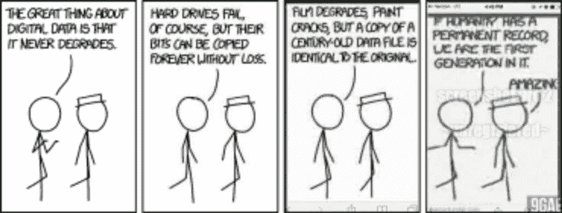
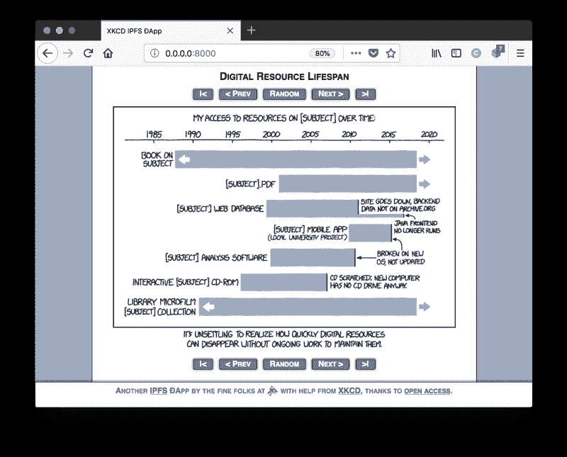

# 从零到星际英雄

> 原文：<https://www.freecodecamp.org/news/from-zero-to-interplanetary-hero-7e62f7d4427/>

作者卡森·法默

# 从零到星际英雄

#### IPFS 上基于浏览器的应用入门指南



[“If you can read this, congratulations—the archive you’re using still knows about the mouseover text”!](https://xkcd.com/1683/)

分散式应用程序现在风靡一时，尤其是在 T2 的区块链以太网上。但是你知道吗？Apps 也可以在[星际文件系统(IPFS)](https://ipfs.io/) 上运行。当然，建立一个并快速运行比你想象的要容易得多。

在本帖中，我们将介绍如何快速、轻松地运行基于 IPFS 的应用程序。我们将利用一些很酷的新 [IPFS 浏览器工具](https://blog.ipfs.io/35-ipfs-companion-2-2-0/#hn2)和我最喜欢的在线漫画。这样做，我们将帮助存档一份珍贵的资源( [xkcd](https://xkcd.com/) ！)给未来的游客。所以这篇文章拥有一切:阴谋、兴奋和对网络未来的承诺！

### 将网络瑰宝归档

本教程的目标是为 xkcd 网站创建一个分布式网络“克隆”。我们将使用 IPFS 从 xkcd 漫画档案中获取图像，并以 xkcd 粉丝熟悉的形式显示它们。

我们想做这样的事情有几个原因。第一，我喜欢 xkcd 漫画，并且总是找借口和他们一起玩。第二，xkcd 和其他一些存档资源可以通过 IPFS 档案馆获得，这使它们成为一个方便的例子。第三，这一点很重要，在 IPFS 的基础上构建基于内容的应用程序有助于网络存档！

我这么说是什么意思？趋势在变，兴趣在变，互联网是个变幻无常的地方。再加上维护服务器、更新基础设施和跟上最新趋势的成本不断增加，你就有了死链的配方。IPFS 和分布式网络是帮助对抗链接腐败的好方法。

以我们的 xkcd 应用程序为例。一会儿，我们将编写一些非常简单的 JavaScript，它将在每次访问我们的应用程序时加载一个随机的 xkcd 漫画。因此，每当有人访问该应用程序时，在其浏览器中运行的对等端就会获取该漫画，并临时缓存该项目，使其他人也有可能检索到它。事实上，我们使用的应用越多，它就越能更好地分发和归档 xkcd。

> 我们通过 IPFS 访问和使用分布式网络上的东西越多，它们就越有可能长期存在

这是一个非常强大的想法:我们通过 IPFS 访问和使用分布式网络上的东西越多，它们就越有可能长期存在。那么那些重要但不太受欢迎的东西呢(比如历史文献)？这就是像 [Filecoin](https://filecoin.io/) 这样的东西将有助于收拾残局的地方。在 [filecoin 世界](https://coincentral.com/filecoin-beginners-guide-largest-ever-ico/)中，你可以付费给网络来为你存储这些东西，而不是依靠流行来保存文档和文件。这是一个非常酷的想法。

### 入门指南

对于那些迫不及待的人来说，完整的应用程序可从 [Textile GitHub repo](https://github.com/textileio/xkcd-dapp-demo) 获得。您可以随意复制它，并按照代码进行操作，以使入门更加容易。既然你刚刚为自己节省了一些时间，为什么不在继续之前[看看胡安·贝尼特在《IPFS 视野》上的这个很棒的视频](https://www.youtube.com/watch?v=HUVmypx9HGI)。你也可以点击这里查看《T4》的现场版。

对于那些想要一步一步来的人来说，这里有一些设置步骤来帮助你开始。

首先，克隆我们的香草 IPFS [Dapp 模板](https://github.com/textileio/dapp-template)，并改变到新的目录:

```
git clone https://github.com/textileio/dapp-template.git xkcd-dappcd xkcd-dapp
```

这个模板非常简单，具有非常小的[依赖性](https://github.com/textileio/dapp-template/blob/carson/xkcd-demo/package.json)。大多数开发依赖只是为了传输 JavaScript，以便我们可以在浏览器中运行我们的应用程序。有关所有这些软件包的详细信息，请参考他们各自的 GitHub repos，或者[联系](https://www.textile.io/)询问一两个问题。

所以首先，检查回购的`README.md`文件。你会注意到它说这个应用程序与`window.ipfs`配合得最好，你可以通过点击其中一个链接来安装 [IPFS 伴侣](https://github.com/ipfs-shipyard/ipfs-companion)网络扩展。

IPFS 伴侣是一个浏览器扩展，通过在你的浏览器中运行一个 [JavaScript IPFS 对等](https://github.com/ipfs/js-ipfs)来简化对 IPFS 资源的访问。比这更好的是，它可以在每个网页上显示一个嵌入的 IPFS 节点`window.ipfs`！这使得我们的应用程序可以检测到`window.ipfs`是否存在，并选择使用它，而不是创建我们自己的一次性`js-ipfs`节点。运行应用程序并不需要*,但它确实让它们运行得更好(更快),我强烈推荐安装它。*

*但是，我们不能期望我们的应用程序的用户在能够使用我们的应用程序之前安装浏览器扩展。所以有一个很好的 JavaScript 模块叫做`[window.ipfs-fallback](https://github.com/tableflip/window.ipfs-fallback)`，它会检测到`window.ipfs`的存在，如果不存在，它会自动从 CDN 下载 IPFS 的最新版本[。因此，当构建一个应用程序时，包含这一点总是一个好主意——如果可以的话，你可以免费获得`window.ipfs`。不错！](https://unpkg.com/ipfs/dist/index.min.js)*

*好了，为了确保一切顺利，让我们继续安装所需的依赖项，并在本地构建和运行我们的应用程序。在您的终端中输入以下内容:*

```
*`yarn installyarn buildyarn start`*
```

*你应该看到一个非常小的(空白页面)应用程序，只有一个页脚，没有其他东西。现在继续，打开你的 Javascript 开发者控制台(Chrome:Ctl+Shift+J(Command+Option+Jon Mac)，Firefox:Ctrl+Shift+K(Command+Option+Kon Mac)，Safari: Command+Option+I)。您应该看到类似于`running js-ipfs/0.29.2 with ID Qm{hash}`的内容，其中`Qm{hash}`是一个长的字母数字散列，代表您的对等 id。*

*恭喜你，你成功地在分散式网络上运行了一个应用程序！现在让我们让它做一些有趣的事情…*

### *在分布式 web 上获取数据*

*好了，让我们为我们的应用程序添加一些功能。我们将从简单地获取一个随机的 xkcd 漫画并在空白页上显示它开始。够简单吧？首先，与其`yarn start`调用我们的应用程序，不如`yarn watch`调用它，这样当我们刷新浏览器窗口时，我们对 JavaScript 所做的任何更改都会自动反映出来。*

*现在，您可以用下面的代码修改`src/main.js`中的`setup`函数:*

*有很多东西需要解析，但基本上发生的是:*

*   *第 3 行和第 5 行定义了要获取哪个随机漫画的*(从我们的档案中获取**
*   *第 8 行和第 10 行初始化一个 IPFS 对等节点，并连接到一个已知正在固定 xkcd 归档的对等节点(第二步并不总是必需的，但我在这里添加它是为了帮助引导应用程序)*
*   *第 14 行实际上是 IPFS 的“魔术”…它在给定的 CID 获取文件并返回一个承诺，我们等待这个承诺，然后在第 15 到 27 行做一些工作…*
*   *第 15 & 16 行简单地遍历上一步返回的二进制对象，并寻找实际的 png 图像*
*   *第 18 & 20 行将二进制图像数据转换成 base64 编码字符串*
*   *最后，第 22 到 27 行创建一个图像元素，并将其添加到“main”div 中进行显示。*

*搞定了。*

### *清理东西*

*从这里开始，任何额外的更改都只是为了让应用程序看起来和感觉上更像最初的 xkcd 漫画网页。*

*我不会在这篇文章中深入讨论细节，但是你可以在 [xkcd-dapp-demo](https://github.com/textileio/xkcd-dapp-demo) repo 中查看完整的代码示例。在那里，我添加了 xkcd 网站的导航按钮和样式，以及一些链接到[的正确归属](https://ipfs.io/ipfs/QmWEAXcqwq5zY2u8Z1mii5m3MXricctd7efFep7sSEWZQz/about.html)、[许可信息](https://ipfs.io/ipfs/QmWEAXcqwq5zY2u8Z1mii5m3MXricctd7efFep7sSEWZQz/license.html)和其他好东西。我们甚至有有趣的悬停评论！它几乎都是普通的 ES6 JavaScript，我很好地利用了 [async/await 模式](https://davidwalsh.name/async-await)来使代码美观易读。*

**

*如你所见，在 IPFS 上开始制作应用程序相对容易。我们的 xkcd 应用程序在 a)本地运行(例如通过`yarn start`)和 b)启用 IPFS 伴侣浏览器扩展时效果最佳。如果你愿意，你可以启动一个本地 IPFS 守护进程，运行`ipfs add -r dist/`，将整个应用程序添加到 IPFS。现在，您可以通过您本地的 IPFS 网关:`http://localhost:5001/ipfs/Qm{hash}/`来测试它(如果您的代码与我的不同，您的 CID 散列可能会不同，请使用上述`ipfs add`命令的输出)。*

### *包扎*

*我们希望[我们的模板](https://github.com/textileio/dapp-template)将提供一种快速简单的方法来引导更多的应用程序，并且基于 IPFS 的应用程序社区将继续增长。在[纺织](https://www.textile.io/)，我们真的很想在 IPFS 支持一个应用程序社区，所以如果你决定使用我们的模板，请告诉我们，我们很乐意添加一个链接到[我们的模板回购](https://github.com/textileio/dapp-template/blob/master/README.md)。我们也会密切关注福克斯，尽我们所能推广他们。*

*我们希望您喜欢我们对 IPFS 应用程序的快速介绍。如果你喜欢这个，来[看看我们的](https://www.textile.photos/)并了解更多我们正在做的事情。当你在做这件事的时候，跳到[纺织品照片等候名单](https://www.producthunt.com/upcoming/textile-photos)上，请求尽早使用一种全新的方法来控制你的照片，这种方法也在 IPFS 和永久网上运行。*