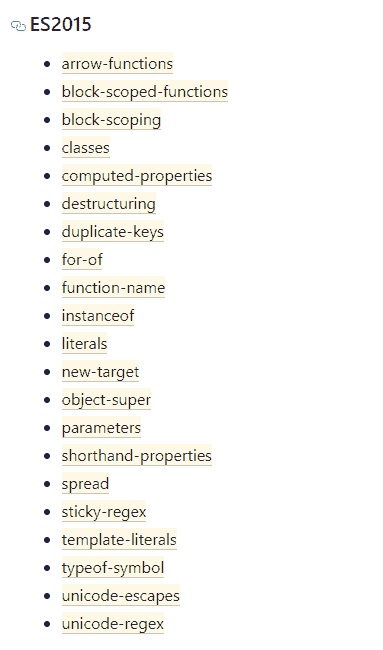
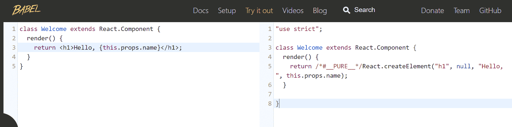
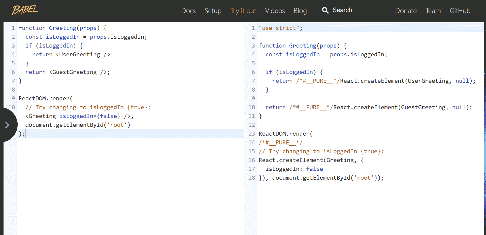
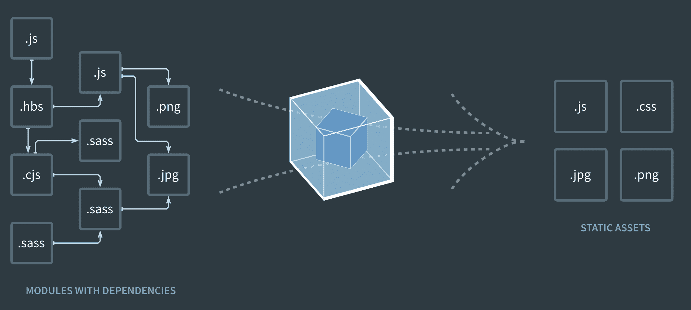
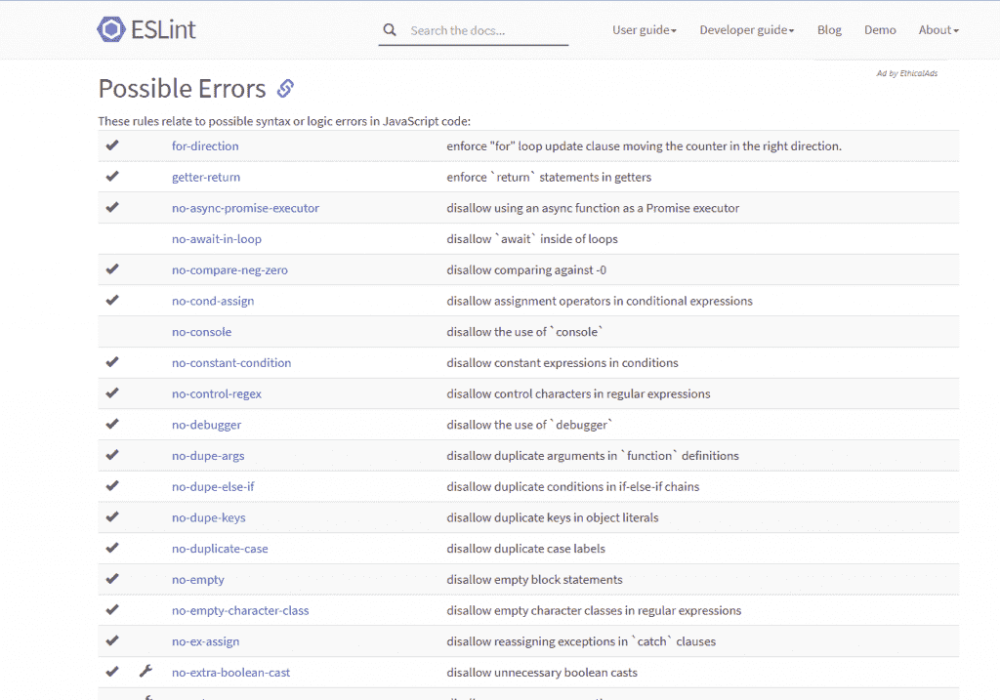

# 你应该知道的流行前端开发工具

> 原文：<https://www.freecodecamp.org/news/front-end-development-tools-you-should-know/>

如果您刚刚开始使用 JavaScript，那么您将会听到大量的工具和技术。您可能很难决定您真正需要哪些工具。

或者也许你对这些工具很熟悉，但是你没有考虑过它们能解决什么问题，没有它们的帮助你的生活会有多悲惨。

我相信对于软件工程师和开发人员来说，理解我们每天使用的工具的用途是很重要的。

这就是为什么，在这篇文章中，我看着 NPM，巴贝尔，网络包，ESLint 和 CircleCI，我试图阐明他们解决的问题，以及他们如何解决这些问题。

## NPM

NPM 是 JavaScript 开发的默认包管理器。它帮助您找到并安装可以在您的程序中使用的包(程序)。

您可以简单地通过使用“ **npm init** ”命令将 npm 添加到项目中。当您运行这个命令时，它会在当前目录下创建一个“ **package.json** 文件。这是列出您的依赖项的文件，npm 将其视为项目的 ID 卡。

您可以使用“ **npm install (package_name)** ”命令添加依赖项。

当您运行此命令时，npm 会转到远程注册表，检查是否存在由该程序包名称标识的程序包。如果找到它，一个新的依赖项将被添加到您的 **package.json** 中，这个包及其内部依赖项将从注册表中下载。

您可以在**“node _ modules”**文件夹下找到下载的包或依赖项。只要记住它通常会变得很大——所以一定要把它加到**里。gitignore** 。

NPM 不仅简化了寻找和下载软件包的过程，还使得在一个项目上的协作更加容易。

没有 NPM，就很难管理外部依赖。当您加入一个现有的项目时，您需要手动下载每个依赖项的正确版本。这将是一个真正的麻烦。

在 npm 的帮助下，您只需运行**“NPM install”**，它就会为您安装所有外部依赖项。然后，只要团队中有人添加新成员，您就可以再次运行它。

## 巴比伦式的城市

Babel 是一个 JavaScript 编译器或 transpiler，它将 ECMAScript 2015+代码翻译成旧 JavaScript 引擎可以理解的代码。

Babel 是最流行的 Javascript 编译器，Vue 和 React 等框架默认使用它。也就是说，我们在这里讨论的概念不仅与 Babel 相关，而且适用于任何 JavaScript 编译器。

### 为什么需要编译器？

“我们为什么需要编译器，JavaScript 不是解释型语言吗？”你可能会问你是否熟悉编译和解释语言的概念。

的确，如果我们把人类可读的代码翻译成 CPU 可以理解的可执行二进制代码，我们通常称之为“编译器”。但这里的情况并非如此。

术语 transpiler 可能更合适，因为它是编译器的子集:trans piler 是将代码从一种编程语言翻译成另一种语言的编译器(在本例中，从现代 JS 翻译成旧版本)。

JavaScript 是浏览器的语言。但是浏览器有一个问题:交叉兼容。JavaScript 工具和语言本身发展迅速，许多浏览器都跟不上这个步伐。这导致了兼容性问题。

您可能希望用最新版本的 JavaScript 编写代码，这样就可以使用它的新特性。但是，如果您的代码运行的浏览器没有实现 JavaScript 引擎中的一些新特性，代码将无法在该浏览器上正确执行。

这是一个复杂的问题，因为每个浏览器以不同的速度实现这些功能。即使他们实现了这些新功能，也总会有人使用旧版本的浏览器。

那么，如果您希望能够使用最近的功能，但又希望您的用户能够毫无问题地查看这些页面，该怎么办呢？

在 Babel 之前，如果浏览器不支持现代功能，我们使用 polyfills 来运行某些代码的旧版本。当你使用 Babel 时，它在幕后使用 polyfills，不需要你做任何事情。

### transpilers 编译器是如何工作的？

Babel 的工作方式与其他编译器类似。它有解析、转换和代码生成阶段。

我们不会在这里深入讨论它是如何工作的，因为编译器是复杂的东西。但是为了理解编译器如何工作的基本原理，你可以看看超级微型编译器项目。在巴别塔的官方文档中也提到它有助于理解巴别塔是如何工作的。

我们通常可以通过了解巴别塔插件和预置来逃脱。插件是 Babel 在幕后使用的代码片段，用于将您的代码编译成旧版本的 JavaScript。你可以把每一个现代功能都想象成一个插件。你可以去[这个](https://babeljs.io/docs/en/plugins/)链接查看插件的完整列表。

List of plugins for ES5

预设是插件的集合。如果你想在 React 项目中使用 Babel，你可以使用预制的包含必要插件的 **@babel/preset-react** 。

React Preset Plugins

您可以通过编辑 Babel 配置文件来添加插件。

### 你的 React 应用需要 Babel 吗？

对于 React，你需要一个编译器，因为 React 代码一般用 JSX，JSX 需要编译。此外，该库是基于使用 ES6 语法的概念构建的。

幸运的是，当你用 **create-react-app** 创建一个项目时，它附带的 Babel 已经配置好了，你通常不需要修改配置。

### 运行中的编译器示例

Babel 的网站上有一个在线编译器，理解它是如何工作的真的很有帮助。只需插入一些代码并分析输出。

## 网络包

Webpack 是一个静态模块捆绑器。当你创建一个新项目时，现在大多数 JavaScript 框架/库都是开箱即用的。

如果短语“静态模块捆绑器”听起来令人困惑，请继续阅读，因为我有一些很好的例子来帮助您理解。

### 你为什么需要捆扎机？

在网络应用中，你会有很多文件。对于单页面应用程序(React、Vue、Angular)来说尤其如此，每个应用程序都有自己的依赖项。

我所说的依赖是一个导入语句——如果文件 A 需要导入文件 B 才能正常运行，那么我们说 A 依赖于 B。

在小项目中，可以用`<script>`标签处理模块依赖关系。但是当项目变得更大时，依赖关系很快变得难以管理。

也许，更重要的是，把代码分成多个文件会让你的网站加载更慢。这是因为与一个大文件相比，浏览器需要发送更多的请求，并且由于 HTTP 头，你的网站开始消耗大量的带宽。

作为开发者，我们希望我们的代码是模块化的。我们把它分成多个文件，因为我们不想处理一个有几千行的文件。尽管如此，我们也希望我们的网站是高性能的，使用更少的带宽，加载速度快。

所以现在，我们将看到 Webpack 如何解决这个问题。

### Webpack 如何工作

当我们谈论 Babel 时，我们提到 JavaScript 代码需要在部署前进行 transpiled。

但是在部署项目之前，用 Babel 进行编译并不是唯一需要的操作。

你通常需要对它进行丑化，转换，如果你使用预处理程序，就把 SASS 或 SCSS 编译成 CSS，如果你正在使用它，就编译类型脚本...如你所见，这个列表很容易变长。

您不希望在每次部署之前处理所有这些命令和操作。如果有一个工具能以正确的顺序和正确的方式为你做所有的事情，那就太好了。

好消息是——有 Webpack。

Webpack 还提供了像带有热重载的本地服务器(他们称之为热模块替换)这样的特性，让你的开发体验更好。

那么什么是热重装呢？这意味着无论何时保存代码，它都会被编译并部署到运行在您机器上的本地 HTTP 服务器上。每当一个文件发生变化，它会向您的浏览器发送一条消息，这样您甚至不需要刷新页面。

如果您曾经使用过“npm run serve”、“npm start”或“npm run dev”，这些命令也会在后台启动 Webpack 的 dev 服务器。

Webpack 从项目的入口点(index)开始，生成文件的抽象语法树。你可以把它想象成解析代码。这个操作也在编译器中完成，然后编译器递归地寻找 import 语句来生成依赖关系图。

然后，它将文件转换成[文件](https://developer.mozilla.org/en-US/docs/Glossary/IIFE#:~:text=An%20IIFE%20(Immediately%20Invoked%20Function,soon%20as%20it%20is%20defined.)来模块化它们(记住，将代码放在函数内部会限制它的作用域)。通过这样做，他们将文件模块化，并确保其他文件无法访问这些变量和函数。

如果没有这个操作，这就像复制和粘贴导入文件的代码，并且该文件将具有相同的作用域。

Webpack 在幕后做许多其他高级的事情，但这足以理解基础知识。

## 奖金-斯拉夫语

代码质量很重要，有助于保持项目的可维护性和可扩展性。虽然我们大多数开发人员都认识到了干净编码的重要性，但在期限的压力下，我们有时会忽略长期的后果。

许多公司决定编码标准，并鼓励开发人员遵守这些标准。但是您如何确保您的代码符合标准呢？

你可以使用 ESLint 这样的工具来执行代码中的规则。例如，您可以创建一个规则来强制或禁止在 JavaScript 代码中使用分号。如果违反了规则，ESLint 会显示一个错误，代码甚至不会被编译——所以除非禁用该规则，否则不可能忽略它。

Linters 可以通过编写自定义规则来执行标准。但是你也可以使用大型科技公司建立的预制 ESLint 配置来帮助开发人员养成编写干净代码的习惯。

你可以看看谷歌的 ESLint 配置[这里](https://github.com/google/eslint-config-google)——这是我更喜欢的一个。

ESLint 帮助您习惯最佳实践，但这不是它唯一的好处。ESLint 还会警告您代码中可能存在的 bugs 错误，以便您可以避免常见错误。

## 奖金–CI/CD(circle CI)

近年来，随着许多公司采用敏捷原则，持续集成/开发得到了广泛的欢迎。

像 Jenkins 和 CircleCI 这样的工具允许您自动化软件的部署和测试，这样您就可以更频繁、更可靠地进行部署，而无需自己经历困难且容易出错的构建过程。

我在这里提到 CircleCI 是因为它是免费的，并且经常在 JavaScript 项目中使用。也挺好用的。

让我们看一个例子:假设您有一个部署/QA 服务器和您的 Git 存储库。您希望将您的更改部署到您的部署/QA 服务器，因此这里有一个示例流程:

1.  将更改推送到 Git
2.  连接到服务器
3.  创建一个 Docker 容器并运行它
4.  将更改拉至服务器，下载所有依赖项(npm 安装)
5.  运行测试以确保没有任何损坏
6.  使用 ESLint/Sonar 之类的工具来确保代码质量
7.  如果一切正常，合并代码

在 CircleCI 的帮助下，你可以自动完成所有这些操作。每当您向 Git 推送更改时，您可以设置并配置它来执行上述所有操作。如果出现任何问题，例如测试失败，它将拒绝推送。

我不会深入讨论如何配置 CircleCI 的细节，因为本文更多的是关于“为什么？”每种工具。但是，如果您有兴趣了解更多信息并看到它的实际应用，您可以查看本教程系列。

## 结论

JavaScript 世界发展迅速，新工具每年都在流行。

通过学习如何使用这个工具，很容易对这种变化做出反应——我们经常太忙而没有时间去思考这个工具变得流行的原因或者它解决了什么问题。

在这篇文章中，我挑选了我认为最流行的工具，并分享了我对它们重要性的看法。我还想让你思考它们解决的问题，而不仅仅是如何使用它们的细节。

如果你喜欢这篇文章，你可以查看并订阅我的[博客](https://erinc.io/),我经常在那里写文章。此外，通过评论让我知道你的想法，这样我们可以集思广益，或者你可以告诉我你喜欢使用的其他工具:)