# HTML 画布的完整概述

> 原文：<https://www.freecodecamp.org/news/full-overview-of-the-html-canvas-6354216fba8d/>

舒坎特·帕尔

# HTML 画布的完整概述

#### 在用 canvas 标签做任何事情之前，必须阅读，即使你已经知道它。

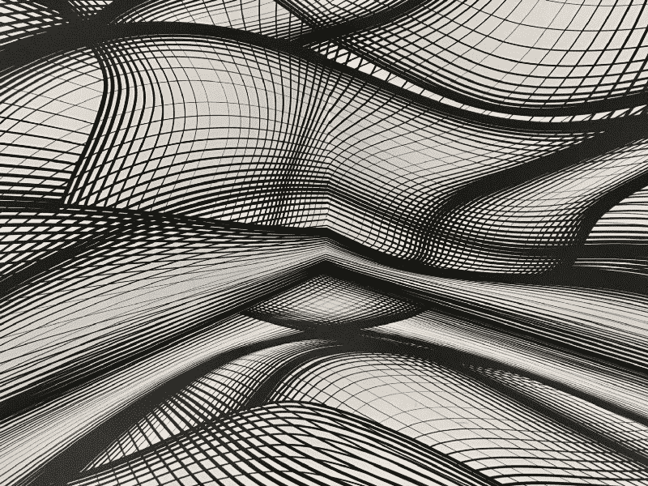

Photo by [Armand Khoury](https://unsplash.com/@armand_khoury?utm_source=medium&utm_medium=referral) on [Unsplash](https://unsplash.com?utm_source=medium&utm_medium=referral)

# 概观

HTML canvas 元素用于在 web 应用程序上绘制“光栅”图形。Canvas API 提供了两种绘图上下文:2D 和 3D，在本指南中，我们将讨论 2D 上下文(为简单起见，我将其称为 Canvas API)。

在我开始之前，我想让你知道非常重要的一点。Canvas 是一个光栅图形 API——你可以在像素级别操作东西。这意味着底层软件不知道你用来显示上下文的模型——它不知道你画的是矩形还是圆形。

我将 Canvas API 分成了独立的块，供您一个一个地阅读:

*   ****路径 API****
*   ****绘画风格****
*   ****渐变和图案****
*   ****直接像素操纵&图像****
*   ****变换****
*   ****击中地区****
*   ****状态和**** 的剪辑()方法

# 设置

要启动画布教程，创建一个 HTML 文件和一个与之链接的 JS 文件。

```
<!DOCTYPE html>
<html>
    <head><title>Canvas Demo</title></head>
    <body>
        <canvas id="canvas-demo" width="400" height="400">
             This will be displayed if your browser doesn't
             support the canvas element. The closing tag is
             necessary.
        </canvas>
        <script src="canvas-demo.js"></script>
    </body>
</html>
```

在您的`canvas-demo.js`文件中，

```
// canvas-demo.js

const demoCanvas = document.getElementById(’canvas-demo’).getContext(’2d’);

window.onload = function() {// make sure to use onload

/* Add code here as we go!!! @nodocs
 */

}
```

# 小路

路径是画布中 2D 像素网格中的点的集合。它们是在这个 API 的帮助下绘制的。W3C 文档将您绘制的路径中的每个形状称为“子路径”。

*   `beginPath()`和`closePath()`:你画的所有形状都被添加到当前路径中。如果你稍后调用`stroke`或`fill`，它将应用于你在当前路径中绘制的所有形状。为了防止这种情况，你通过调用`beginPath`和`closePath`来划分你的绘图。

```
// Calling this isn't necessary, but a good practice.
demoCanvas.beginPath();

/*
 * Drawing code, copy and paste each example (separately) here
 */

demoCanvas.closePath();// this is required if you want to draw
// in a separate path later
```

*   `moveTo(x,y)`:表示从点(x，y)开始构建一个新的形状。
*   `lineTo(x,y)`:从当前形状的最后一点到经过的点画一条线。如果没有创建形状(通过`moveTo`)，那么从(x，y)开始创建一个新的(就像`moveTo`)。
*   `quadraticCurveTo(cpx1,cpy1,x,y)`和`bezierCurveTo(cpx1,cpy1,cpx2,cpy2,x,y)`:绘制一条二次/三次贝塞尔曲线，从形状中的最后一点开始，经过控制点(`cpx1,cpy1`和`cpx2,cpy2`，结束于`x,y`。贝塞尔曲线只是一条“平滑”的曲线，它通过中间的“控制”点，并带有给定的结束点。请注意，曲线不必精确地通过控制点，它可以被平滑。
*   这是一个使用起来有点复杂的方法。假设路径中的当前点是`x0,y0`——`arcTo`将画一条弧线，这条弧线有两条切线连接这两对点`(x1,y1) & (x0,y0)`和`(x1,y1) & (x2,y2)`。圆弧的半径将是给定的半径。半径越大，圆弧离`x1,y1`越远(直观清晰见示例 1.2)。如果你还没有使用过`moveTo`，那么`x0,y0`将默认为`0,0`。
*   `arc(x,y,radius,startAngle,endAngle,counterclockwise)`:将路径中的当前点(默认为`0,0`)连接到圆弧的起点。它从中心`x,y`画出半径`radius`的圆弧，从`startAngle`到`endAngle`。(注:与笔&纸数学不同，角度在画布 API 中是顺时针方向描述的)；但是在四种特殊情况下——`(x0,y0)`等于`(x1,y1)`、`(x1,y1)`等于`(x2,y2)`、`(x0,y0),(x1,y1),(x2,y2)`共线，或者说如果`radius`为零，那么对`arc`的调用将等价于`lineTo(x1,y1)`而被画线代替。
*   `rect(x,y,w,h)`:画一个左上角为`x,y`，宽度为`w`，高度为`h`的矩形。

****例 1.1:****

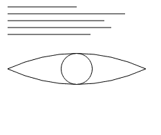

Canvas Demo 1

现在我们需要尝试一个演示——我们将绘制一些随机的水平线，然后是一只眼睛的草图。结果看起来像左边的东西。不要忘记检查代码，修改代码。

```
/* Draw horizontal subpaths (shapes) in one path. */

// Draw a pattern of vertically stack horizontal
// lines.
demoCanvas.moveTo(10, 10);// start at (10,10)
demoCanvas.lineTo(110, 10);
demoCanvas.moveTo(10, 20);// 10 pts below
demoCanvas.lineTo(180, 20);
demoCanvas.moveTo(10, 30);
demoCanvas.lineTo(150, 30);
demoCanvas.moveTo(10, 40);
demoCanvas.lineTo(160, 40);
demoCanvas.moveTo(10, 50);
demoCanvas.lineTo(130, 50);

// try removing this moveTo, the quad-curve will then
// start from from (130, 50), due to the lineTo.
demoCanvas.moveTo(10, 100);// quad-curve starts from here
demoCanvas.quadraticCurveTo(110, 55, 210, 100);// curve upward
demoCanvas.moveTo(10, 100);// back here, let's draw one below
demoCanvas.quadraticCurveTo(110, 145, 210, 100);// curve below
// that forms the eye outline

demoCanvas.moveTo(132.5, 100);// remove this, a horizontal line will be
// drawn from (210, 100) to (132.5, 100) because arc() connects the last
// point to the start of the arc.

demoCanvas.arc(110, 100, 22.5, 0, 2*Math.PI, false);// pupil (circle)

/* We'll talk about this shortly */
demoCanvas.stroke();// draws (by outlining our shapes in the path)
```

****例 1.2:****

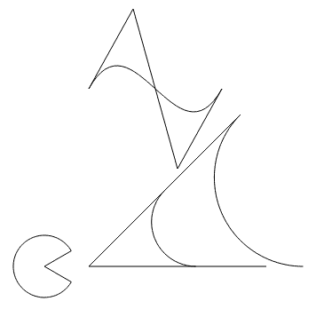

Canvas Demo 2

在下面的例子中，我创建了一条三次曲线(带有视觉指引)，`arcTo` calls 在右中，而一个 pack-man 和`arc()`在左下方。控制点(在三次曲线中)是由三条指导线形成的拐角。

`(x1,y1)`为`arcTo`是两条切线形成的角。

```
// comment this block out if you can see the cubic curve
demoCanvas.moveTo(100, 100);
demoCanvas.lineTo(150, 10);
demoCanvas.moveTo(250, 100);
demoCanvas.lineTo(200, 190);
demoCanvas.moveTo(150, 10);
demoCanvas.lineTo(200, 190)

demoCanvas.moveTo(100, 100);
demoCanvas.bezierCurveTo(150, 10, 200, 190, 250, 100);

// arcTo() is too complicated to use
// demoCanvas.stroke(); demoCanvas.closePath(); demoCanvas.beginPath();
demoCanvas.moveTo(200, 200);// comment out above line (and comment this line),
// then the arc's tangent will come from (0,0)!! Try it.

demoCanvas.arcTo(100, 300, 300, 300, 100);
demoCanvas.moveTo(200, 200);
demoCanvas.arcTo(100, 300, 300, 300, 50);

demoCanvas.moveTo(100, 300);
demoCanvas.lineTo(300, 300);
demoCanvas.moveTo(100, 300);
demoCanvas.lineTo(200, 200);

demoCanvas.moveTo(50, 300);
// packman
demoCanvas.arc(50, 300, 35, Math.PI/6, 11*Math.PI/6, false);
demoCanvas.lineTo(50, 300);

demoCanvas.stroke();
```

# 绘图样式

到目前为止，我们一直在画简单的细线路径。绘画风格将帮助我们使我们的绘画更好。

请注意，您不能在同一路径上应用两种不同的样式。例如，如果你想画一条红线和一条蓝线，你必须创建一个新的路径来画蓝线。如果你没有创建一个新的路径，那么在将你的显示样式颜色设置为蓝色后第二次调用`stroke`时，两行都将被涂成蓝色。因此，样式将应用于所有子路径，无论它们是否已经描边。

为此，定义了 2D 上下文对象`demoCanvas`的一些属性:

*   `lineWidth`:正在绘制的线条的粗细。默认情况下，这是 1；因此，上面的两个例子使用了 1 像素厚的轮廓。
*   `lineCap`:这是应用于子路径(形状)末端的端点。它是一个字符串，可以有三个有效值:“对接”、“圆形”、“方形”(为了直观清晰，请参见示例 1.3)。“对接”将结束没有端点的线条，导致刚性、正交的端点，就像细矩形。“圆形”在两端添加一个半圆，以提供平滑的末端。“方”在末尾加了一个方，但看起来像“屁股”。“圆形”和“方形”给每个子路径增加了一些额外长度。
*   `lineJoin`:这决定了如何连接两条重叠的线。例如，如果你想创建一个向右箭头(>)，那么你可以用这个属性改变拐角的形成方式。这有三个有效值:“圆形”、“斜面”和“斜接”。查看示例 1.4，了解他们是如何改变拐角的。(默认值为“斜接”)。“圆角”会形成圆角，“斜角”会形成刚性的三边角，“斜接”会形成锐边。
*   `miterLimit`:当`lineJoin="miter"`时，决定线的内外角的最大距离 b/w。视觉清晰度见例 1.4(b)。如果斜接限制太高，则锐箭头可能在两条线之间有一个大的公共区域 b/w。如果通过了斜接限制，则显示返回到斜角连接。

****例题 1.3 & 1.4:****

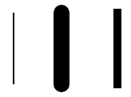

Canvas Demo 3–1.butt, 2.round, 3.square

在左侧的示例 1.3 中，您可以看到圆形和方形线封口的线比默认封口的线长。(注:线条越粗，长度增加越大)

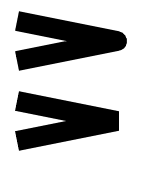

Canvas Demo 4(a) — 1\. lineJoin=”round”, 2\. lineJoin=”bevel”

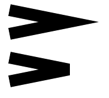

Canvas Demo 4(b)–1.miterLength=10, 2.miterLength=5\. Both are using the default line-join — “miter”. The lines used are identical in both — above and bottom. The miter limit is the maximum distance between the inner corner and outer corner. On lowering it, the miter-limit is passed, causing the bevel join to apply.

在示例 1.4(a)中，您可以看到圆形和斜面连接是如何工作的。创建的线条在上部和下部是相同的。只有`lineJoin`属性不同。

在示例 4.1(b)中，您可以看到斜接连接是如何工作的，以及如果超过斜接长度会发生什么。

定义了其他显示样式属性:

*   `font`:这个字符串定义了你想要的文本样式。例如，`demoCanvas.font="10px Times New Roman"`是一个有效的字体值。
*   `textAlign`:有效值为—“开始”、“结束”、“左”、“右”和“中心”。默认为“开始”。
*   `textBaseline`:有效值为—“上”、“挂”、“中”、“字母”、“表意”、“下”。默认为“字母”。

# 实际绘图方法

在到目前为止的例子中，你可能已经注意到我在关闭每个路径之前使用了`demoCanvas.stroke()`。在那些例子中，笔画方法部分地进行实际绘制。

*   `stroke`:该方法根据`lineWidth`和相关属性在每个子路径(形状)周围绘制轮廓。
*   `fill`:该方法填充路径所描绘的形状的内部。如果路径没有闭合，那么它会通过将最后一个点连接到第一个点来自动闭合路径。

```
demoCanvas.moveTo(10,10);
demoCanvas.lineTo(50, 50);
demoCanvas.lineTo(10, 50);
demoCanvas.fill();
```

上面的代码没有封闭三角形(10，10)，(50，50)，(10，50)，但是调用`fill()`按预期填充它。

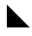

Filled triangle

*   `clearRect(x,y,w,h)`:清除给定参数形成的矩形中的像素。
*   `strokeRect(x,y,w,h)`:相当于先叫`rect`，再叫`stroke`。它不会将矩形添加到当前路径中——因此，您可以稍后更改样式并调用`stroke`,而不会影响形成的矩形。
*   `fillRect(x,y,w,h)`:相当于先叫`rect`，再叫`fill`。这也不会将矩形添加到当前路径中。
*   `strokeText(text,x,y,maxWidth)`和`fillText(text,x,y,maxWidth)`:根据`strokeStyle` / `fillStyle`属性在(x，y)写入文本。`maxWidth`是可选的，定义你希望文本占据的最大像素长度。如果文本较长，则将其缩放为较小的字体。`measureText("text").width`可用于根据当前`font`找到一段文本的显示宽度。

注意:`fillStyle`和`strokeStyle`是可以设置为任何 CSS 颜色字符串来设置填充&笔触颜色的属性。

# 渐变和图案

开箱即用，2D 上下文提供线性和径向梯度。`createLinearGradient`和`createRadialGradient`方法返回`CanvasGradient`对象，然后可以根据我们的需要对其进行修改。

*   `createLinearGradient(x0,y0,x1,y1)`:在`x0,y0`到`x1,y1`的直线上构建一个线性渐变。
*   `createRadialGradient(x0,y0,r0,x1,y1,r1)`:构建一个半径为`r0`的顶部(内圆)和半径为`r1`的底部(外圆)的锥形(圆)径向渐变。第一种颜色的半径为`r0`。

`CanvasGradient`有一个方法:`addColorStop(offset,color)`。渐变从 0 开始，到 1 结束。`offset`位置的颜色将使用此方法设置。比如`addColorStop(.5, "green")`会让中间的颜色变成绿色。颜色 b/w 两个相邻的停止将被插值(混合)。

****例 1.6:****

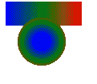

Canvas Demo 6–1\. Linear gradient line, 2\. Radial gradient filled arc

在左边的例子中，你可以看到线性和径向渐变是如何工作的。

```
var linearGrad = demoCanvas.createLinearGradient(5,5,100,5);
linearGrad.addColorStop(0, "blue");
linearGrad.addColorStop(.5, "green");
linearGrad.addColorStop(1, "red");
demoCanvas.strokeStyle=linearGrad;
demoCanvas.lineWidth=50;
demoCanvas.moveTo(5,5);
demoCanvas.lineTo(100,5);
demoCanvas.stroke();// change strokeStyle(l10) to fillStyle(l10)
// and stroke() to fill(). Then, change lineTo(100,5) to rect(5,5,95,50).
// Results should be almost same.

demoCanvas.closePath();
demoCanvas.beginPath();
var radialGrad = demoCanvas.createRadialGradient(50,50,10,50,50,40);
radialGrad.addColorStop(0, "blue");
radialGrad.addColorStop(.5, "green");
radialGrad.addColorStop(1, "red");
demoCanvas.fillStyle=radialGrad;
demoCanvas.arc(50,50,30,0,2*Math.PI,false);
demoCanvas.fill();
```

你可能想知道如果给线性/径向渐变的`x0,y0`和`x1,y1`不等于我们创建的线/弧会怎么样？参见示例 1.7

****例 1.7****

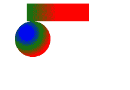

Canvas Demo — 1\. Shifted the line by 100px horizontally, 2\. Shifted the arc by (10,10) to bottom right.

```
var linearGrad = demoCanvas.createLinearGradient(5,5,100,5);
linearGrad.addColorStop(0, "blue");
linearGrad.addColorStop(.5, "green");
linearGrad.addColorStop(1, "red");
demoCanvas.strokeStyle=linearGrad;
demoCanvas.lineWidth=50;
demoCanvas.moveTo(50,5);
demoCanvas.lineTo(155,5);
demoCanvas.stroke();// change strokeStyle(l10) to fillStyle(l10)
// and stroke() to fill(). Then, change lineTo(100,5) to rect(5,5,95,50).
// Results should be almost same.

demoCanvas.closePath();
demoCanvas.beginPath();
var radialGrad = demoCanvas.createRadialGradient(50,50,10,50,50,40);
radialGrad.addColorStop(0, "blue");
radialGrad.addColorStop(.5, "green");
radialGrad.addColorStop(1, "red");
demoCanvas.fillStyle=radialGrad;
demoCanvas.arc(60,60,30,0,2*Math.PI,false);
demoCanvas.fill();
```

* * *

# 直接像素操作和图像

`ImageData`对象可用于操纵单个像素。它有三个属性:

*   `width`:设备显示像素中图像数据的宽度。
*   `height`:设备显示像素中图像数据的高度。
*   `data`:这是一个`Uint8ClampedArray` (MDN doc [这里是](https://developer.mozilla.org/en-US/docs/Web/JavaScript/Reference/Global_Objects/Uint8ClampedArray?source=post_page---------------------------))，它包含了从最上面的像素到右下角像素的一系列(R，G，B，A)字节中的单个像素数据。因此第 **n** 个像素的红色值将在`data[y*width+x]`，绿色值将在`data[y*width+x+1]`，蓝色值将在`data[y*width+x+2]`，阿尔法值将在`data[y*width+x+3]`。

注意:RGBA 值可用于表示颜色，其中 R、G、B 是红色、绿色和蓝色的数量，A 是不透明度(alpha 值)。在画布中，这些元素可以是[0，255]中的任意整数值。

您可以在 Canvas API 中通过以下方法获得一个`ImageData`对象:

*   `createImageData(sw,sh)`:创建一个宽度和高度分别为`sw`和`sh`的`ImageData`对象，用 CSS 像素定义。所有像素将被初始化为透明黑色(十六进制 R，G，B=0，A=0)。

> **CSS 像素可能会映射到对象本身暴露的不同数量的实际设备像素**

*   `createImageData(data)`:复制给定的图像数据并返回副本。
*   `getImageData(sx,sy,sw,sh)`:返回由`ImageData`对象中的`sx,sy,sw,sh`形成的矩形中画布像素的副本。画布外的像素被设定为透明黑色。
*   `putImageData(imagedata,dx,dy,dirtyX,dirtyY,dirtyWidth,dirtyHeight)`:(最后四个‘dirty’参数是可选的)。将`imagedata`中的像素值复制到`dx,dy`处的画布矩形中。如果您提供最后四个参数，它将只复制图像数据中的脏像素(在尺寸`dirtyWidth*dirtyHeight`的`dirtyX,dirtyY`处形成的矩形)。不传递最后四个参数和调用`putImageData(imagedata,dx,dy,0,0,imagedata.width,imagedata.height)`是一样的。

> **对于所有 x 和 y 的整数值，其中 dirtyX ≤ x < dirtyX+dirtyWidth 和 dirtyY ≤ y < dirtyY+dirtyHeight，将`imagedata`数据结构中坐标为(x，y)的像素的四个通道复制到画布底层像素数据中坐标为(dx+x，dy+y)的像素。**

****例 1.8:****

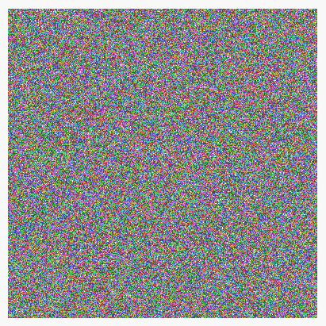

Canvas Demo 1.8(a) — Randomized pixels in a 400x400 canvas

我已经使用`getImageData/putImageData`方法用随机颜色(完全不透明)填充了整个 400x400 的画布。

注意，使用 ImageData API 并不一定要使用`beginPath/closePath`——因为您没有使用 Canvas API 来形成形状/曲线。

```
/* replace this line with demoCanvas.createImageData(390,390) instead. */
var rectData = demoCanvas.getImageData(10, 10, 390, 390);

for (var y=0; y<390; y++) {
  for (var x=0; x<390; x++) {
    const offset = 4*(y*390+x);// 4* because each pixel is 4 bytes
    rectData.data[offset] = Math.floor(Math.random() * 256);// red
    rectData.data[offset+1] = Math.floor(Math.random() * 256);// green
    rectData.data[offset+2] = Math.floor(Math.random() * 256);// blue
    rectData.data[offset+3] = 255;// alpha, fully opaque
  }
}

demoCanvas.putImageData(rectData, 10, 10);

/* beginPath/closePath aren't required for this code */
```

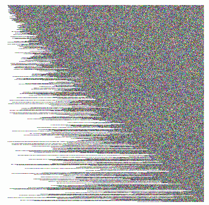

Canvas Demo 1.8(b) — x starts with a random value b/w 1 and y.

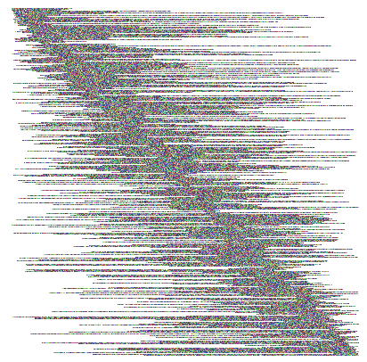

Canvas Demo 1.8(c) — x ends at a random value greater than its initial value.

****图像**** 可以直接绘制到画布上。可以通过三种不同的方式使用`drawImage`来实现。它需要一个`CanvasImageSource`作为像素源。

> **A `CanvasImageSource`可以是以下之一— HTMLImageElement、HTMLCanvasElement、HTMLVideoElement。要复制到画布中，可以使用一个``。你也可以复制现有的画布或视频截图！！！**

*   `drawImage(image,dx,dy)`:将图像源复制到画布上( **dx，dy** )。整个图像被复制。
*   `drawImage(image,dx,dy,dw,dh)`:将图像源复制到尺寸为( **dw，dh** )的( **dx，dy** )的画布矩形中。如有必要，它将被缩小或放大。
*   `drawImage(image,sx,sy,sw,sh,dx,dy,dw,dh)`:将图像源`sx,sy,sw,sh`中的矩形复制到画布`dx,dy,dw,dh`中的矩形，并根据需要放大或缩小。然而，如果矩形`sx,sy,sw,sh`具有实际源之外的部分——那么源矩形被裁剪以包括入站部分，并且目标矩形以相同的比例被裁剪；然而，你不应该传递任何越界的矩形——保持简单，笨蛋。

****例 1.9:****

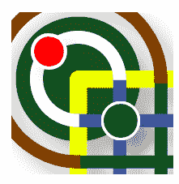

Image copy example

```
var image = document.getElementById('game-img');
demoCanvas.drawImage(image, 50, 50, 200, 200, 100, 100, 200, 200);

/* beginPath/closePath aren't required for this code */
```

注意:将此添加到您的 HTML 中—

```

```

# 转换

现在，我们将进入 Canvas API 的激动人心的部分！！！

画布使用一个 **变换矩阵** 将输入的( **x，y** )坐标变换为显示的( **x，y** )坐标。请注意，在变换之前绘制的像素不会被变换，它们不会被改变。只有应用变换后绘制的材料才会被更改。

有三种内置转换方法:

*   `scale(xf,yf)`:该方法通过水平方向的`xf`和垂直方向的`yf`来缩放输入。如果你想把图像放大`m`倍，那么通过`xf=yf=m`。通过`m`、`xf=m,yf=1`水平拉伸/压缩图像。通过`m`、`xf=1,yf=m`垂直拉伸/挤压图像。
*   `rotate(angle)`:以弧度为单位，顺时针旋转输入一个角度`angle`。
*   `translate(dx,dy)`:将输入移动`dx,dy`。

****例 2.0:****


Drawing a transformed image on top of the original image. Scale=2,2; Rotate=30deg; Translate=10,10

```
var image = document.getElementById('game-img');
demoCanvas.drawImage(image, 0, 0, 400, 400);
demoCanvas.rotate(Math.PI / 6);
demoCanvas.scale(2, 2);
demoCanvas.translate(10, 10);
demoCanvas.drawImage(image, 0, 0, 400, 400);
```

> *在示例 2.0 中，请注意原始图像是如何保持完整的。只有第二个图像(叠加)通过三种方法进行变换—旋转、缩放、变换。*

要恢复所有转换:

```
demoCanvas.setTransform(1, 0, 0, 0, 0, 1);
// sets the transform to the identity matrix
```

注意:

*   更改变换的顺序会影响最终结果。
*   对于高级用户，您可能想看看`transform`和`setTransform`方法。这将让您直接设置 3D 变换矩阵。
*   `getImageData`和`putImageData`不受变换的影响。这意味着如果你使用`putImageData`绘制一个黑色矩形，它不会被变换(旋转/缩放/平移)。
*   由于改变变换只适用于应用后完成的绘图，您不能直接缩放/旋转/平移现有画布(也不能使用`getImageData`和`putImageData`)。你可能需要创建另一个相同大小的隐藏画布——然后将图像数据复制到第二个画布上，然后在第二个画布上使用`drawImage`。
*   查一下这个例子:https://canvasdemo2d.github.io/(来源:[https://github.com/canvasdemo2d/canvasdemo2d.github.io](https://github.com/canvasdemo2d/canvasdemo2d.github.io?source=post_page---------------------------))。将光标移到画布上，看看会发生什么。不幸的是，它在手机上不起作用。层叠效果是因为我正在使用`drawImage`翻译画布 w.r.t mouse。然后写入它正在读取的同一个画布，这导致了重复的模式！

* * *

# 热门地区

截至本文撰写之时(2019 年 3 月)， **对 hit 区域的支持正在 Chrome 和 Firefox 上进行实验** 。手机浏览器甚至根本不支持。因此，我将向你解释“什么”可以击中地区被用来。

点击区域用于捕捉画布上的指针事件，并知道用户单击的“位置”。例如，你可以有两个矩形 A&B——当用户点击 A 时，你想执行动作$A，当用户点击 B 时，你想执行动作$B。让我们来看看整个过程！

热门区域与以下三个因素有关:

*   ****路径:**** 创建点击区域时的当前路径(例如，一个矩形)。路径内的所有指针事件都被路由到该点击区域。
*   ****Id:**** 事件处理程序标识点击区域的唯一 Id 字符串。
*   ****控件:**** 一个替代的 DOM 元素(`HTMLButtonElement`，例如)获取指针事件。

注意:当添加新的点击区域时，路径由画布自动提供。只需要一个(id 或 control)来形成命中区域。

操纵画布的点击区域列表的方法有:

*   `addHitRegion(options)`:取一个`HitRegionOptions`对象，形成一个被当前路径包围的点击区域。`options`参数应该是一个字符串`id`属性或一个`HTMLElement`属性。
*   `removeHitRegion(id)`:移除 id 为`id`的点击区域，使其不再接收任何指针事件。
*   `clearHitRegions()`:删除所有点击区域。

```
demoCanvas.fillStyle = 'red';
demoCanvas.rect(10,10,60,60);
demoCanvas.fill();// first rectangle
demoCanvas.addHitRegion({ id: 'btn1' });

demoCanvas.fillStyle = 'blue';
demoCanvas.rect(10,110,60,60);
demoCanvas.fill();
demoCanvas.addHitRegion({ id: 'btn2' });

document.getElementById('demo-canvas').onpointerdown = function(evt) {
// demoCanvas is the 2d context, not the HTMLCanvasElement

  console.log('Hello id: ' + evt.region);// region is hitregion id
}

// This code might not work due to this being an
// unsupported (new) feature of HTML5.
```

注意:不支持点击区域，但这并不意味着您必须使用它们来捕捉指针事件。您可以创建您自己的“点击区域列表”和区域边界的表示(因为您不能从画布中获得当前路径，这太糟糕了)。在`document.getElementById('demo-canvas').onpointerdown`方法中，获取当前的`clientX,clientY`属性并搜索命中区域列表。基于包含该点的点击区域，您可以执行预期的操作。

* * *

# 状态和 clip()方法

状态保存是 W3C 规范提供的一种便利。您可以存储画布的当前状态并在以后恢复它。

您也可以通过编写自己的 JavaScript 模型来构建这样的系统(部分)。但是你必须保存相当多的东西:转换矩阵、点击区域列表、样式属性等等。此外，您不能直接恢复剪辑区域(我们将在某个时候用到`clip`方法)。

注意:`save` / `restore`方法不保存&恢复的实际绘图/像素。他们只保存其他属性。

因此，我强烈建议使用`save` & `restore`方法来来回回，而不是自己删除内容或创建自己的状态保存机制。

`CanvasRendering2DContext`对象有一个相关的状态堆栈。`save`方法将把当前的画布状态推送到堆栈中，而`restore`方法将从堆栈中弹出最新的状态。

****裁剪区域****

剪辑区域是一个特定的区域，所有的绘图都将在其中完成。显然，默认情况下，裁剪区域是整个画布的矩形。但是，您可能希望在特定区域而不是整个区域进行绘制。比如你可能想画一个由多个`lineTo`方法形成的星星的下半部分。

例如，假设你知道如何在画布上画一颗星星。它触及画布的所有面。但是现在你想只显示星星的下半部分。在这种情况下，您将:

1.  保存画布的状态
2.  剪辑下半部分区域
3.  画出你的星星(好像在整个画布上)
4.  恢复画布状态

要剪辑一个区域，您必须调用`clip()`方法，该方法执行以下操作:

> *`clip()`方法必须使用非零缠绕数规则，通过计算当前裁剪区域和路径描述区域的交集来创建新的裁剪区域。计算剪辑区域时，打开的子路径必须隐式关闭，而不影响实际的子路径。新的剪辑区域将替换当前剪辑区域。*
> 
> *上下文初始化时，裁剪区域必须设置为左上角在(0，0)的矩形，坐标空间的宽度和高度。*
> 
> *—画布 2D 上下文的 W3C 文档*

```
demoCanvas.save();
demoCanvas.rect(0, 200, 400, 200);// lower-half rectangle subpath
demoCanvas.clip();
/* star drawing method */
demoCanvas.restore();
```

目前就这些。我将写一篇关于画布上的动画以及如何在画布上完全编写自定义界面的文章。

延伸阅读:

*   [如何使用 Firebase 构建 Android 多人游戏](https://www.freecodecamp.org/news/match-making-with-firebase-hashnode-de9161e2b6a7)
*   [如何在多个 Android 设备上同步您的游戏应用](https://www.freecodecamp.org/news/how-to-synchronize-your-game-app-across-multiple-devices-88794d4c95a9)
*   [JavaScript 中的循环依赖](https://medium.com/@sukantk3.4/circular-dependencies-in-javascript-34183fc2720?source=post_page---------------------------)

**Shukant Pal 是 Silcos 内核的创造者。他是一个狂热的学习者，现在正在练习高级 web 应用程序开发。他拥有 React 及其生态系统的实践经验。**

* * *

**所有引文均取自 W3C docs for Canvas 2D 上下文。**

嘿，我是舒坎特伙计。我在业余时间开发了很多 web 应用程序。在社交媒体上关注我。