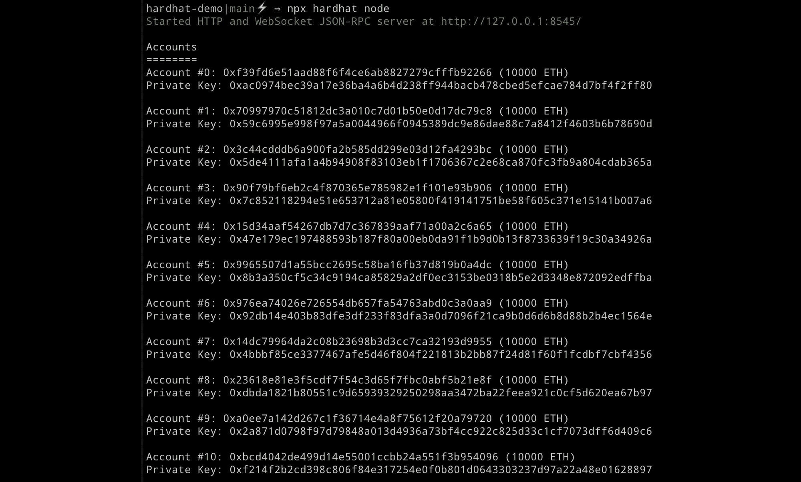
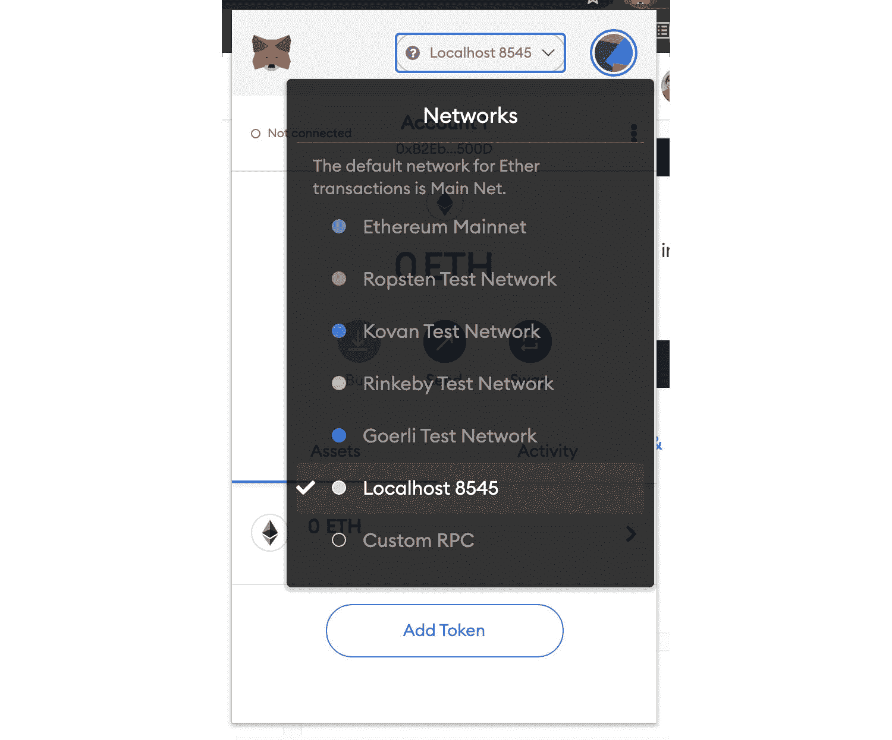
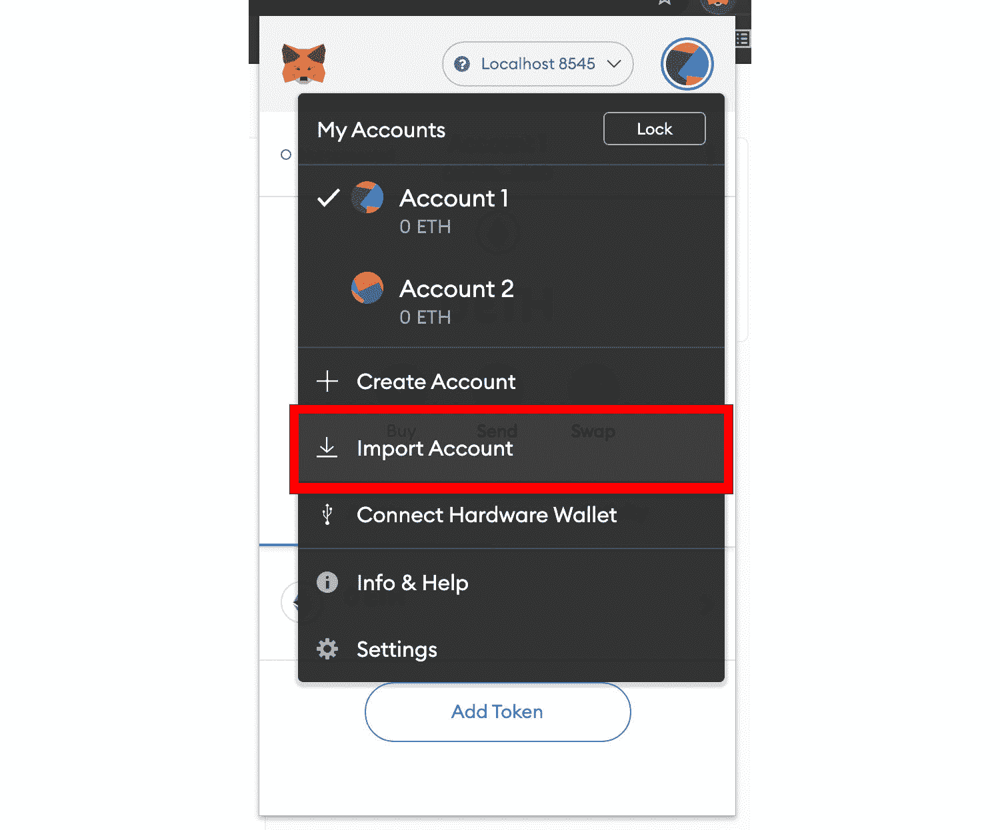
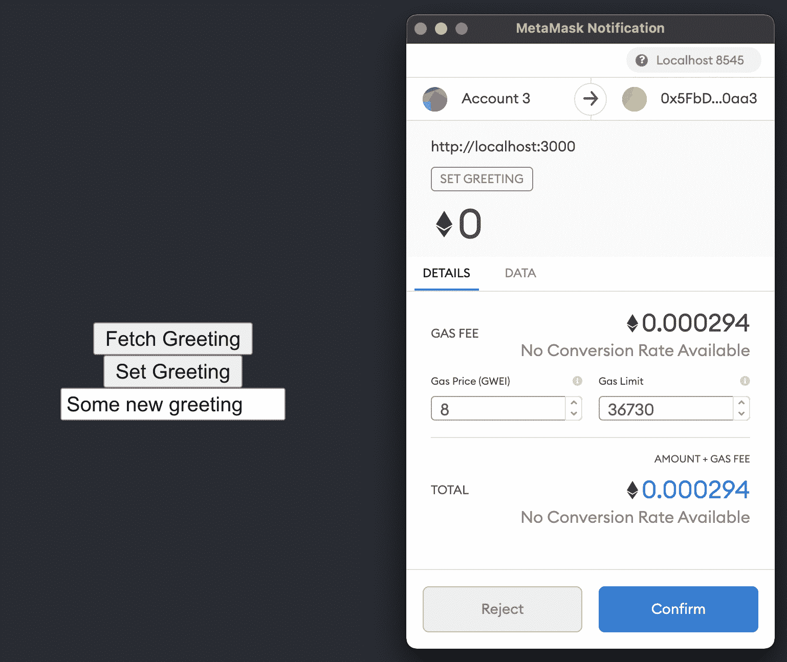
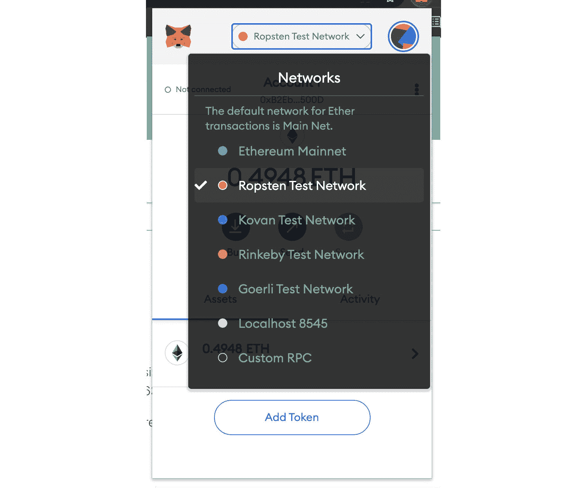
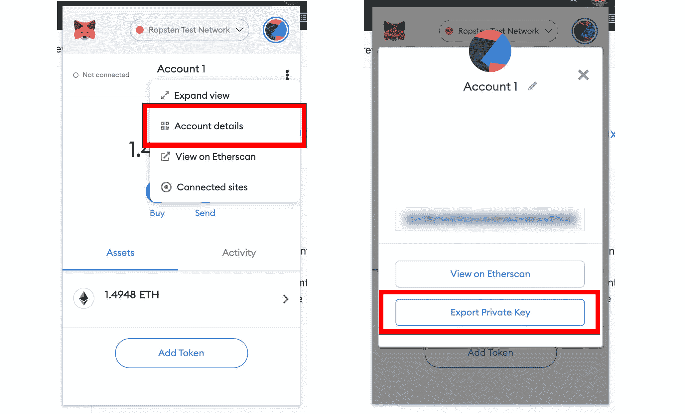
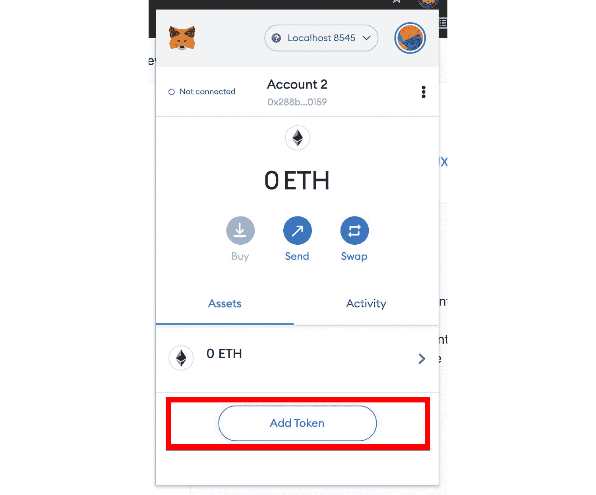

# 全栈以太坊开发完全指南

> 原文：<https://www.freecodecamp.org/news/full-stack-ethereum-development/>

在本文中，您将学习如何使用 React、Ethers.js、Solidity 和 Hardhat 构建全栈 dApps。

你可以在这里找到这个项目的代码。本教程的视频课程是[这里](https://www.youtube.com/watch?v=a0osIaAOFSE)。

我最近以开发者关系工程师的身份加入了 [Edge & Node](https://twitter.com/edgeandnode) ，并一直在深入研究以太坊的智能合约开发。我已经决定了我认为构建可靠的全栈 dApps 的最佳栈:

*   客户端框架—**反应**
*   以太坊开发环境—[**安全帽**](https://hardhat.org/)
*   以太坊 Web 客户端库-[**ethers . js**](https://docs.ethers.io/v5/)
*   API 层—[图形协议](https://thegraph.com/)

但是我在解决这些问题的时候遇到了一个问题。虽然对于这些工具中的每一个都有相当好的文档，但是没有多少文档可以帮助您将它们放在一起并理解它们是如何相互协作的。

有一些非常好的样板文件，比如 [scaffold-eth](https://github.com/austintgriffith/scaffold-eth) (其中也包括 Ethers、Hardhat 和 Graph)，但是对于刚刚入门的人来说，它们可能太难掌握了。

我想要一个端到端的指南，向我展示如何使用最新的资源、库和工具来构建完整的以太坊应用。

我感兴趣的是:

1.  如何创建、部署和测试以太坊智能合约到本地、测试和 mainnet
2.  如何在本地、测试和生产环境/网络之间切换
3.  如何从前端使用各种环境(如 React、Vue、Svelte 或 Angular)连接到合同并与之交互

在花了一些时间搞清楚这一切之后，我终于开始使用我感到非常满意的堆栈了。然后我觉得写下如何使用这个栈来构建和测试一个全栈以太坊应用会很不错。

我希望这个指南不仅对其他可能对这个堆栈感兴趣的人有用，而且对我自己也有参考价值。这是参考文献。

## 我们将使用的技术

让我们回顾一下我们将使用的主要部分，以及它们如何融入堆栈。

### 1.以太坊开发环境

当构建智能契约时，您将需要一种方法来部署您的契约、运行测试和调试 Solidity 代码，而无需处理实际环境。

您还需要一种方法来将 Solidity 代码编译成可以在客户端应用程序中运行的代码——在我们的例子中，是 React 应用程序。稍后我们将进一步了解这是如何工作的。

Hardhat 是一个为全栈开发设计的以太坊开发环境和框架，也是我将在本教程中使用的框架。

生态系统中其他类似的工具还有[加纳切](https://www.trufflesuite.com/ganache)和[松露](https://www.trufflesuite.com/)。

### 2.以太坊 Web 客户端库

在我们的 React 应用程序中，我们需要一种方式来与已经部署的智能合约进行交互。我们将需要一种方法来读取数据以及发送新的事务。

[ethers.js](https://docs.ethers.io/v5/) 旨在成为一个完整而紧凑的库，用于从客户端 JavaScript 应用程序(如 React、Vue、Angular 或 Svelte)与以太坊区块链及其生态系统进行交互。这是我们将要使用的图书馆。

生态系统中另一个流行的选项是 [web3.js](https://web3js.readthedocs.io/en/v1.3.4/)

### 3\. Metamask

[Metamask](https://metamask.io/download.html) 帮助您处理帐户管理并将当前用户连接到区块链。元掩码使用户能够以几种不同的方式管理他们的帐户和密钥，同时将他们与站点上下文隔离开来。

一旦用户连接了他们的 MetaMask 钱包，作为开发人员，您可以与全球可用的 Ethereum API ( `window.ethereum`)进行交互，该 API 可以识别 web3 兼容浏览器的用户(如 MetaMask 用户)。每当您请求事务签名时，MetaMask 将以一种可理解的方式提示用户。

### 4.反应

React 是一个前端 JavaScript 库，用于构建 web 应用程序、用户界面和 UI 组件。它由脸书和许多个人开发者和公司维护。

React 及其庞大的元框架生态系统，如 [Next.js](https://nextjs.org/) 、 [Gatsby](https://www.gatsbyjs.com/) 、 [Redwood](https://redwoodjs.com/) 、 [Blitz.js](https://blitzjs.com/) 等，支持所有类型的部署目标，包括传统的 spa、静态站点生成器、服务器端呈现以及所有三者的组合。

React 似乎继续主导着前端领域，我认为在不久的将来甚至更久以后，它还会继续这样做。

### 5.图表

对于以太坊等大多数基于区块链的应用程序来说，直接从链中读取数据既困难又耗时。因此，在过去，你会看到个人和公司构建他们自己的集中式索引服务器，并从这些服务器提供 API 请求。这需要大量的工程和硬件资源，并且破坏了分散化所需的安全属性。

该图是用于查询区块链数据的索引协议，允许您创建完全分散的应用程序。它通过公开应用程序可以使用的丰富的 GraphQL 查询层来解决这个问题。

在本指南中，我们不会为我们的应用程序构建子图，但会在未来的教程中这样做。

## 我们将会建造什么

在本教程中，我们将构建、部署并连接到几个基本的智能合约:

1.  在以太坊区块链创建和更新消息的合同
2.  铸造代币的合同，允许合同的所有者将代币发送给其他人并读取代币余额，并允许新代币的所有者也将代币发送给其他人。

我们还将构建一个 React 前端，允许用户:

1.  阅读部署到区块链的合同中的问候
2.  更新问候语
3.  将新制造的令牌从它们的地址发送到另一个地址
4.  一旦有人收到令牌，允许他们也将令牌发送给其他人
5.  从部署到区块链的合同中读取令牌余额

### 先决条件

1.  安装在本地计算机上的 Node.js
2.  [MetaMask](https://metamask.io/) 浏览器中安装的 Chrome 扩展

对于本指南，您不需要拥有任何以太坊，因为我们将在整个教程中使用测试网络上的假以太。

## 如何开始使用 create-react-app

首先，我们将创建一个新的 React 应用程序:

```
npx create-react-app react-dapp 
```

接下来，进入新目录，使用 **NPM** 或**纱线**安装 [`ethers.js`](https://docs.ethers.io/v5/) 和 [`hardhat`](https://github.com/nomiclabs/hardhat) :

```
npm install ethers hardhat @nomiclabs/hardhat-waffle ethereum-waffle chai @nomiclabs/hardhat-ethers 
```

## 如何安装和配置以太坊开发环境

接下来，用 Hardhat 初始化一个新的以太坊开发环境:

```
npx hardhat

? What do you want to do? Create a sample project
? Hardhat project root: <Choose default path> 
```

现在，您应该可以在根目录中看到为您创建的以下工件:

*   **hardhat . config . js**–您的整个 hard hat 设置(即您的配置、插件和自定义任务)都包含在这个文件中。
*   **脚本**–包含名为 **sample-script.js** 的脚本的文件夹，该脚本将在执行时部署您的智能合约
*   **test**–一个包含测试脚本示例的文件夹
*   **合同**–保存以太坊智能合同示例的文件夹

因为[一个元掩码配置问题](https://hardhat.org/metamask-issue.html)，我们需要更新我们安全帽配置上的链 ID 为 **1337** 。我们还需要为我们编译的契约更新[工件](https://hardhat.org/guides/compile-contracts.html#artifacts)的位置，这样它们就在 React 应用程序的 **src** 目录中。

要进行这些更新，打开 **hardhat.config.js** ，更新`module.exports`如下所示:

```
module.exports = {
  solidity: "0.8.3",
  paths: {
    artifacts: './src/artifacts',
  },
  networks: {
    hardhat: {
      chainId: 1337
    }
  }
}; 
```

## 我们的智能合同

接下来，让我们看看我们在 **contracts/Greeter.sol** 中的示例合同:

```
//SPDX-License-Identifier: MIT
pragma solidity ^0.7.0;

import "hardhat/console.sol";

contract Greeter {
  string greeting;

  constructor(string memory _greeting) {
    console.log("Deploying a Greeter with greeting:", _greeting);
    greeting = _greeting;
  }

  function greet() public view returns (string memory) {
    return greeting;
  }

  function setGreeting(string memory _greeting) public {
    console.log("Changing greeting from '%s' to '%s'", greeting, _greeting);
    greeting = _greeting;
  }
} 
```

这是一个非常基本的智能合约。部署时，它设置一个问候语变量并公开一个函数(`greet`)，可以调用该函数返回问候语。

它还公开了一个允许用户更新问候语的函数(`setGreeting`)。当部署到以太坊区块链时，用户可以使用这些方法进行交互。

让我们对智能合同做一个小小的修改。因为我们在 **hardhat.config.js** 中将编译器的 solidity 版本设置为`0.8.3`，所以让我们也确保更新我们的合同以使用相同版本的 solidity:

```
// contracts/Greeter.sol
pragma solidity ^0.8.3; 
```

### 如何读写以太坊区块链

有两种方式与智能合同交互-读取或写入/交易。在我们的合同中，`greet`可以认为是阅读，`setGreeting`可以认为是写作/事务性。

当写入或初始化一个交易时，您必须为要写入区块链的交易付费。要做到这一点，你需要支付[汽油](https://www.investopedia.com/terms/g/gas-ethereum.asp#:~:text=What%20Is%20Gas%20(Ethereum)%3F,on%20the%20Ethereum%20blockchain%20platform)，这是在以太坊区块链成功进行交易和执行合同所需的费用或价格。

只要你只是从区块链中读取数据，而不改变或更新任何东西，你就不需要进行交易，这样做也没有任何代价。然后你调用的功能只由你连接的节点执行，所以你不需要付任何煤气费，读取也是免费的。

从我们的 React 应用程序中，我们将使用由 Hardhat 根据合同创建的`ethers.js`库、合同地址和 [ABI](https://docs.soliditylang.org/en/v0.5.3/abi-spec.html) 的组合与智能合同进行交互。

什么是 ABI？ABI 代表应用程序二进制接口。您可以将其视为客户端应用程序和以太坊区块链之间的接口，您将要与之交互的智能合约部署在以太坊中。

ABI 通常由像 Hardhat 这样的开发框架从 Solidity smart contracts 编译而来。您还可以在 [Etherscan](https://etherscan.io/) 上找到智能合约的 ABI

### 如何编译 ABI

现在，我们已经学习了基本的智能合同，并知道 ABI 是什么，让我们为我们的项目编译一个 ABI。

为此，请转到命令行并运行以下命令:

```
npx hardhat compile 
```

现在，您应该在 **src** 目录中看到一个名为**工件**的新文件夹。**工件/合同/Greeter.json** 文件包含作为属性之一的 ABI。当我们需要使用 ABI 时，我们可以从 JavaScript 文件中导入它:

```
import Greeter from './artifacts/contracts/Greeter.sol/Greeter.json' 
```

我们可以这样引用 ABI:

```
console.log("Greeter ABI: ", Greeter.abi) 
```

> 注意 Ethers.js 也支持[人类可读的 ABIs](https://blog.ricmoo.com/human-readable-contract-abis-in-ethers-js-141902f4d917) ，但是在本教程中不会深入讨论。

### 如何部署和使用本地网络/区块链

接下来，让我们将智能合约部署到本地区块链，以便进行测试。

要部署到本地网络，首先需要启动本地测试节点。为此，请打开 CLI 并运行以下命令:

```
npx hardhat node 
```

当我们运行这个命令时，您应该会看到一个地址和私钥列表。



这是为我们创建的 20 个测试帐户和地址，我们可以使用它们来部署和测试我们的智能合同。每个账户还装了一万个假乙醚。稍后，我们将学习如何将测试帐户导入 MetaMask，以便我们可以使用它。

接下来，我们需要将合同部署到测试网络。首先将**脚本/sample-script.js** 的名称更新为**脚本/deploy.js** 。

现在，我们可以运行部署脚本，并为希望部署到本地网络的 CLI 提供一个标记:

```
npx hardhat run scripts/deploy.js --network localhost 
```

一旦这个脚本被执行，智能契约应该被部署到本地测试网络，然后我们应该能够开始与它进行交互。

> 当合约被部署时，它使用我们启动本地网络时创建的第一个帐户。

如果您查看 CLI 的输出，您应该能够看到如下内容:

```
Greeter deployed to: 0x9fE46736679d2D9a65F0992F2272dE9f3c7fa6e0 
```

这个地址是我们将在客户端应用程序中用来与智能合约对话的地址。保持该地址可用，因为我们将需要在从客户端应用程序连接到它时使用它。

要将交易发送到智能合约，我们需要使用运行`npx hardhat node`时创建的帐户之一连接 MetaMask 钱包。在 CLI 注销的合同列表中，您应该会看到一个**账号**和一个**私钥**:

```
➜  react-defi-stack git:(main) npx hardhat node
Started HTTP and WebSocket JSON-RPC server at http://127.0.0.1:8545/

Accounts
========
Account #0: 0xf39fd6e51aad88f6f4ce6ab8827279cfffb92266 (10000 ETH)
Private Key: 0xac0974bec39a17e36ba4a6b4d238ff944bacb478cbed5efcae784d7bf4f2ff80

... 
```

我们可以将这个帐号导入 MetaMask，以便开始使用那里的一些假 Eth。为此，首先打开元掩码，并将网络更新为 Localhost 8545:



接下来，在 MetaMask 中点击账户菜单中的**导入账户**:



复制然后粘贴 CLI 注销的**私钥**中的一个，点击**导入**。帐户导入后，您应该会看到帐户中的 Eth:


现在，我们已经部署了我们的智能合同并设置了我们的帐户，我们可以开始从 React 应用程序与其进行交互。

### 如何连接 React 客户端

在本教程中，我们不会担心用 CSS 构建一个漂亮的用户界面，我们会 100%关注核心功能，让你开始运行。从那里，你可以把它拿走，如果你愿意，可以把它弄得好看些。

话虽如此，让我们回顾一下我们希望 React 应用程序实现的两个目标:

1.  从智能合约中获取`greeting`的当前值
2.  允许用户更新`greeting`的值

那么，我们如何做到这一点呢？为了实现这一目标，我们需要做以下事情:

1.  创建一个输入字段和一些本地状态来管理输入的值(更新`greeting`)
2.  允许应用程序连接到用户的元掩码帐户以签署交易
3.  创建读取和写入智能合同的函数

为此，打开`src/App.js`并用以下代码更新它，将`greeterAddress`的值设置为您的智能合约的地址:

```
import './App.css';
import { useState } from 'react';
import { ethers } from 'ethers'
import Greeter from './artifacts/contracts/Greeter.sol/Greeter.json'

// Update with the contract address logged out to the CLI when it was deployed 
const greeterAddress = "your-contract-address"

function App() {
  // store greeting in local state
  const [greeting, setGreetingValue] = useState()

  // request access to the user's MetaMask account
  async function requestAccount() {
    await window.ethereum.request({ method: 'eth_requestAccounts' });
  }

  // call the smart contract, read the current greeting value
  async function fetchGreeting() {
    if (typeof window.ethereum !== 'undefined') {
      const provider = new ethers.providers.Web3Provider(window.ethereum)
      const contract = new ethers.Contract(greeterAddress, Greeter.abi, provider)
      try {
        const data = await contract.greet()
        console.log('data: ', data)
      } catch (err) {
        console.log("Error: ", err)
      }
    }    
  }

  // call the smart contract, send an update
  async function setGreeting() {
    if (!greeting) return
    if (typeof window.ethereum !== 'undefined') {
      await requestAccount()
      const provider = new ethers.providers.Web3Provider(window.ethereum);
      const signer = provider.getSigner()
      const contract = new ethers.Contract(greeterAddress, Greeter.abi, signer)
      const transaction = await contract.setGreeting(greeting)
      await transaction.wait()
      fetchGreeting()
    }
  }

  return (
    <div className="App">
      <header className="App-header">
        <button onClick={fetchGreeting}>Fetch Greeting</button>
        <button onClick={setGreeting}>Set Greeting</button>
        <input onChange={e => setGreetingValue(e.target.value)} placeholder="Set greeting" />
      </header>
    </div>
  );
}

export default App; 
```

要进行测试，请启动 React 服务器:

```
npm start 
```

当应用程序加载时，您应该能够获取当前的问候并将其注销到控制台。你也应该能够通过用你的 MetaMask 钱包签合同和花费假乙醚来更新问候。



### 如何部署和使用实时测试网络

有几个以太坊测试网络，如 Ropsten、Rinkeby 或 Kovan，我们也可以部署到这些测试网络，以便在不部署到 mainnet 的情况下获得我们的契约的公共可访问版本。

在本教程中，我们将部署到 **Ropsten** 测试网络。

首先，请更新您的 MetaMask 钱包以连接到 Ropsten 网络。



接下来，通过访问[这个测试龙头](https://faucet.ropsten.be/)，给自己发送一些测试乙醚，以便在本教程的剩余部分使用。

我们可以通过注册像 [Infura](https://infura.io/dashboard/ethereum/cbdf7c5eee8b4e2b91e76b77ffd34533/settings) 或 [Alchemy](https://www.alchemyapi.io/) 这样的服务来访问 Ropsten(或任何其他测试网络)。

一旦你在 Infura 或 Alchemy 中创建了应用程序，你将得到一个类似这样的端点:

```
https://ropsten.infura.io/v3/your-project-id 
```

确保在 Infura 或 Alchemy 应用程序配置中设置**allow list ether eum ADDRESSES**,以包括您将从中部署的帐户的钱包地址。

为了部署到测试网络，我们需要用一些额外的网络信息来更新我们的 Hardhat 配置。我们需要设置的一件事是我们将要部署的钱包的私钥。

要获得私钥，可以从 MetaMask 导出它。



> 我建议不要在应用程序中硬编码这个值，而是将其设置为类似环境变量的东西。

接下来，添加一个具有以下配置的`networks`属性:

```
module.exports = {
  defaultNetwork: "hardhat",
  paths: {
    artifacts: './src/artifacts',
  },
  networks: {
    hardhat: {},
    ropsten: {
      url: "https://ropsten.infura.io/v3/your-project-id",
      accounts: [`0x${your-private-key}`]
    }
  },
  solidity: "0.7.3",
}; 
```

要进行部署，请运行以下脚本:

```
npx hardhat run scripts/deploy.js --network ropsten 
```

一旦您的契约被部署，您应该能够开始与它交互。您现在应该能够在[ethers can Ropsten Testnet Explorer](https://ropsten.etherscan.io/)上查看实时合同

## 如何铸造代币

智能合约最常见的用例之一是创建令牌。让我们看看如何做到这一点。因为我们对所有这些是如何工作的有了更多的了解，所以我们将进行得更快一些。

在主**合同**目录下，创建一个名为 **Token.sol** 的新文件。

接下来，使用以下智能合约更新 **Token.sol** :

```
//SPDX-License-Identifier: MIT
pragma solidity ^0.8.3;

import "hardhat/console.sol";

contract Token {
  string public name = "Nader Dabit Token";
  string public symbol = "NDT";
  uint public totalSupply = 1000000;
  mapping(address => uint) balances;

  constructor() {
    balances[msg.sender] = totalSupply;
  }

  function transfer(address to, uint amount) external {
    require(balances[msg.sender] >= amount, "Not enough tokens");
    balances[msg.sender] -= amount;
    balances[to] += amount;
  }

  function balanceOf(address account) external view returns (uint) {
    return balances[account];
  }
} 
```

> 请注意，该令牌合同仅用于演示目的，不符合 [ERC20](https://eips.ethereum.org/EIPS/eip-20) 。我们稍后将介绍 ERC20 令牌。

该合同将创建一个名为“Nader Dabit Token”的新令牌，并将供应量设置为 1000000。

接下来，编译这个契约:

```
npx hardhat compile 
```

现在，更新位于 **scripts/deploy.js** 的部署脚本，以包含这个新的令牌契约:

```
const hre = require("hardhat");

async function main() {
  const [deployer] = await hre.ethers.getSigners();

  console.log(
    "Deploying contracts with the account:",
    deployer.address
  );

  const Greeter = await hre.ethers.getContractFactory("Greeter");
  const greeter = await Greeter.deploy("Hello, World!");

  const Token = await hre.ethers.getContractFactory("Token");
  const token = await Token.deploy();

  await greeter.deployed();
  await token.deployed();

  console.log("Greeter deployed to:", greeter.address);
  console.log("Token deployed to:", token.address);
}

main()
  .then(() => process.exit(0))
  .catch(error => {
    console.error(error);
    process.exit(1);
  }); 
```

现在，我们可以将这个新合同部署到本地或 Ropsten 网络:

```
npx hardhat run scripts/deploy.js --network localhost 
```

一旦部署了契约，您就可以开始将这些令牌发送到其他地址。

要做到这一点，让我们更新我们需要的客户端代码，以便使这一工作:

```
import './App.css';
import { useState } from 'react';
import { ethers } from 'ethers'
import Greeter from './artifacts/contracts/Greeter.sol/Greeter.json'
import Token from './artifacts/contracts/Token.sol/Token.json'

const greeterAddress = "your-contract-address"
const tokenAddress = "your-contract-address"

function App() {
  const [greeting, setGreetingValue] = useState()
  const [userAccount, setUserAccount] = useState()
  const [amount, setAmount] = useState()

  async function requestAccount() {
    await window.ethereum.request({ method: 'eth_requestAccounts' });
  }

  async function fetchGreeting() {
    if (typeof window.ethereum !== 'undefined') {
      const provider = new ethers.providers.Web3Provider(window.ethereum)
      console.log({ provider })
      const contract = new ethers.Contract(greeterAddress, Greeter.abi, provider)
      try {
        const data = await contract.greet()
        console.log('data: ', data)
      } catch (err) {
        console.log("Error: ", err)
      }
    }    
  }

  async function getBalance() {
    if (typeof window.ethereum !== 'undefined') {
      const [account] = await window.ethereum.request({ method: 'eth_requestAccounts' })
      const provider = new ethers.providers.Web3Provider(window.ethereum);
      const contract = new ethers.Contract(tokenAddress, Token.abi, provider)
      const balance = await contract.balanceOf(account);
      console.log("Balance: ", balance.toString());
    }
  }

  async function setGreeting() {
    if (!greeting) return
    if (typeof window.ethereum !== 'undefined') {
      await requestAccount()
      const provider = new ethers.providers.Web3Provider(window.ethereum);
      console.log({ provider })
      const signer = provider.getSigner()
      const contract = new ethers.Contract(greeterAddress, Greeter.abi, signer)
      const transaction = await contract.setGreeting(greeting)
      await transaction.wait()
      fetchGreeting()
    }
  }

  async function sendCoins() {
    if (typeof window.ethereum !== 'undefined') {
      await requestAccount()
      const provider = new ethers.providers.Web3Provider(window.ethereum);
      const signer = provider.getSigner();
      const contract = new ethers.Contract(tokenAddress, Token.abi, signer);
      const transation = await contract.transfer(userAccount, amount);
      await transation.wait();
      console.log(`${amount} Coins successfully sent to ${userAccount}`);
    }
  }

  return (
    <div className="App">
      <header className="App-header">
        <button onClick={fetchGreeting}>Fetch Greeting</button>
        <button onClick={setGreeting}>Set Greeting</button>
        <input onChange={e => setGreetingValue(e.target.value)} placeholder="Set greeting" />

        <br />
        <button onClick={getBalance}>Get Balance</button>
        <button onClick={sendCoins}>Send Coins</button>
        <input onChange={e => setUserAccount(e.target.value)} placeholder="Account ID" />
        <input onChange={e => setAmount(e.target.value)} placeholder="Amount" />
      </header>
    </div>
  );
}

export default App; 
```

接下来，运行应用程序:

```
npm start 
```

我们应该能够点击**获取余额**，并看到我们的帐户中有 1，000，000 枚硬币被注销到控制台。

您还应该能够通过点击**添加令牌**在元掩码中查看它们:



接下来点击**自定义令牌**并输入令牌合同地址，然后**添加令牌**。现在你的钱包里应该有代币了:


接下来，让我们试着把这些硬币寄到另一个地址。

为此，复制另一个帐户的地址，并使用更新的 React UI 将它们发送到该地址。当您检查代币金额时，它应该等于原始金额减去您发送到该地址的金额。

## 如何构建 ERC20 令牌

[ERC20 令牌标准](https://ethereum.org/en/developers/docs/standards/tokens/erc-20/)定义了一组适用于所有 ERC20 令牌的规则，允许它们轻松地相互交互。ERC20 让人们可以很容易地铸造他们自己的代币，这些代币可以与以太坊区块链上的其他代币互通。

让我们看看如何使用 ERC20 标准构建我们自己的令牌。

首先，安装[openzeplin](https://github.com/OpenZeppelin/openzeppelin-contracts)智能契约库，我们将在其中导入基础`ERC20`令牌:

```
npm install @openzeppelin/contracts 
```

接下来，我们将通过扩展(或继承)契约来创建令牌:

```
//SPDX-License-Identifier: MIT
pragma solidity ^0.8.3;

import "@openzeppelin/contracts/token/ERC20/ERC20.sol";

contract NDToken is ERC20 {
    constructor(string memory name, string memory symbol) ERC20(name, symbol) {
        _mint(msg.sender, 100000 * (10 ** 18));
    }
} 
```

构造函数允许您设置令牌名称和符号，`_mint`函数允许您铸造令牌并设置数量。

默认情况下，ERC20 将小数位数设置为 18，因此在我们的`_mint`函数中，我们将 100，000 乘以 10 的 18 次方，以生成总共 100，000 个令牌，每个令牌有 18 个小数位(类似于 1 Eth 是如何由 10 的 18 次方魏组成的)。

为了进行部署，我们需要传入构造函数的值(`name`和`symbol`)，所以我们可能会在部署脚本中做这样的事情:

```
const NDToken = await hre.ethers.getContractFactory("NDToken");
const ndToken = await NDToken.deploy("Nader Dabit Token", "NDT"); 
```

通过扩展原始 ERC20 令牌，您的令牌将继承以下所有功能:

```
function name() public view returns (string)
function symbol() public view returns (string)
function decimals() public view returns (uint8)
function totalSupply() public view returns (uint256)
function balanceOf(address _owner) public view returns (uint256 balance)
function transfer(address _to, uint256 _value) public returns (bool success)
function transferFrom(address _from, address _to, uint256 _value) public returns (bool success)
function approve(address _spender, uint256 _value) public returns (bool success)
function allowance(address _owner, address _spender) public view returns (uint256 remaining) 
```

部署后，您可以使用这些功能中的任何一个与新的智能合约进行交互。对于 ERC20 令牌的另一个示例，请在此处通过示例查看可靠性:[https://solidity-by-example.org/app/erc20/](https://solidity-by-example.org/app/erc20/)。

## 结论

好的，我们在这篇文章中已经讨论了很多。但对我来说，这是开始使用这一堆栈的基础/核心。

这是我想要的，不仅是作为一个正在学习这些东西的人，而且是在未来，如果我需要参考任何我可能需要的东西。我希望你学到了很多。

如果除了 MetaMask 之外，您还想支持多个钱包，请查看[web 3 mode](https://github.com/Web3Modal/web3modal)，它可以通过一个相当简单和可定制的配置，轻松地在您的应用程序中实现对多个提供商的支持。

在我未来的教程和指南中，我将深入研究更复杂的智能契约开发，以及如何将它们部署为[子图](https://thegraph.com/docs/define-a-subgraph)以在其上公开 GraphQL API 并实现分页和全文搜索之类的功能。

我还将探讨如何使用像 IPFS 和 Web3 数据库这样的技术以分散的方式存储数据。

如果你对未来的教程有任何问题或建议，请告诉我。