# 如何使用 Express、Hooks 和 Postgres 建立自己的博客。

> 原文：<https://www.freecodecamp.org/news/fullstack-react-blog-app-with-express-and-psql/>

在本教程中，我们将构建一个完整的 stack React 博客以及一个博客管理后端。

我将详细地向你介绍所有的步骤。

到本教程结束时，你将有足够的知识使用现代工具构建相当复杂的全栈应用程序:React、Express 和 PostgreSQL 数据库。

为了保持简洁，我将做最简单的样式/布局，让读者自己决定。

**竣工工程:**
[https://github.com/iqbal125/react-hooks-complete-fullstack](https://github.com/iqbal125/react-hooks-complete-fullstack)

**管理 App:**
[https://github.com/iqbal125/react-hooks-admin-app-fullstack](https://github.com/iqbal125/react-hooks-admin-app-fullstack)

**启动项目:**
[https://github . com/Iqbal 125/react-hooks-routing-auth-Starter](https://github.com/iqbal125/react-hooks-routing-auth-starter)

**如何构建启动项目:**
[https://www . freecodecamp . org/news/build-a-react-hooks-front-end-app-with-routing-and-authentic ation/](https://www.freecodecamp.org/news/build-a-react-hooks-front-end-app-with-routing-and-authentication/)

**如何给这个项目添加一个 Fullstack 搜索引擎:**
[https://www . freecodecamp . org/news/react-express-full stack-search-engine-with-psql/](https://www.freecodecamp.org/news/react-express-fullstack-search-engine-with-psql/)

你可以在这里
【https://www.youtube.com/playlist? 观看这个教程的视频版本 list = plmc 67 chet-yzxrbobcfhza 4 sboxnr 7 HD D5

> 在 Twitter 上与我联系，了解更多关于未来教程的更新:[https://twitter.com/iqbal125sf](https://twitter.com/iqbal125sf)

## 第 1 节:Express 服务器和 PSQL 数据库设置

1.  **项目结构**
2.  **基本快速设置**
3.  **连接客户端**
    axios vs react-router vs express router
    为什么不使用类似 Sequelize 的 ORM？
4.  **设置数据库**
    PSQL 外键
    PSQL 外壳
5.  **设置快捷路线和 PSQL 查询**

## 第 2 部分:React 前端设置

1.  **使用缩减器、动作和上下文设置全局状态。**
    将用户配置文件数据保存到我们的数据库
    动作和减速器设置
2.  **客户端 React app**
    addpost . js
    edit post . js
    posts . js
    showpost . js
    profile . js
    show user . js

## 第 3 部分:管理应用程序

1.  **管理应用认证**
2.  **全局编辑和删除权限**
3.  **管理仪表板**
4.  **删除用户及其帖子和评论**

## 项目结构

我们将从讨论目录结构开始。我们将有两个目录，即**客户端**和**服务器**目录。**客户端**目录将保存我们在上一个教程中设置的 React 应用程序的内容，而**服务器**将保存我们`express`服务器的内容，并保存我们对数据库的 API 调用的逻辑。**服务器**目录也将保存我们的 **SQL** 数据库的模式。

最终的目录结构将如下所示。

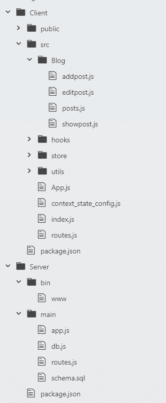

## 基本快速设置

如果您还没有这样做，那么您可以使用命令安装`express-generator`:

`npm install -g express-generator`

这是一个简单的工具，它将通过一个简单的命令生成一个基本的 express 项目，类似于`create-react-app`。这将为我们节省一点时间，不必从头开始设置一切。

我们可以从运行**服务器**目录中的`express`命令开始。这将为我们提供一个默认的快速应用程序，但我们不会使用默认配置，我们必须修改它。

首先让我们删除**路线**文件夹、**视图**文件夹和**公共**文件夹。我们不需要它们。你应该只剩下 3 个文件了。 **bin** 目录下的 **www** 文件、`app.js`文件和`package.json`文件。如果您不小心删除了这些文件中的任何一个，只需生成另一个 express 项目。因为我们删除了那些文件夹，所以我们也必须对代码做一点修改。如下重构您的`app.js`文件:

```
 var createError = require('http-errors');
var express = require('express');
var path = require('path');
var cookieParser = require('cookie-parser');
var logger = require('morgan');

var app = express();

app.use(logger('dev'));
app.use(express.json());
app.use(express.urlencoded({ extended: false }));
app.use(cookieParser());
app.use(express.static(path.join(__dirname, 'public')));

module.exports = app; 
```

我们也可以将`app.js`放在一个名为 **main** 的文件夹中。

接下来，我们需要将 **www** 文件中的默认端口更改为端口 3000 以外的端口，因为这是 React 前端应用程序将运行的默认端口。

```
/**
 * Get port from environment and store in Express.
 */

var port = normalizePort(process.env.PORT || '5000');
app.set('port', port); 
```

除了通过生成 express 应用程序获得的依赖项之外，我们还将添加另外 3 个库来帮助我们:

`cors` **:** 我们将使用这个库来帮助 React 应用程序和 Express 服务器之间的通信。我们将通过 React 应用程序中的代理来实现这一点。如果没有这个，我们将在浏览器中收到一个跨源资源错误。

`helmet` **:** 一个更新 http 头的安全库。这个库将使我们的 http 请求更加安全。

`pg` **:** 这是我们用来与 psql 数据库通信的主库。没有这个库，与数据库的通信将是不可能的。

我们可以继续安装这些库

`npm install pg helmet cors`

我们已经完成了最小服务器的设置，项目结构应该是这样的。

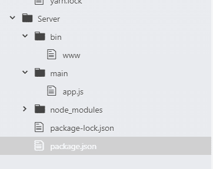

现在我们可以测试我们的服务器是否工作。你在没有**客户端 app** 的情况下运行服务器。 **Express** 是一款功能齐全的应用，将独立于**客户端应用**运行。如果操作正确，您应该会在终端上看到这个。

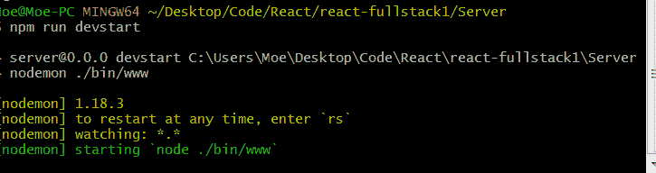

我们可以保持服务器运行，因为我们将很快使用它。

## 连接到客户端

将我们的**客户端应用**连接到我们的服务器非常容易，我们只需要一行代码。转到**客户端目录**中的`package.json`文件，输入以下内容:

`“proxy”: “[http://localhost:5000](http://localhost:5000)"`

就是这样！我们的客户端现在可以通过代理与我们的服务器通信。

* *注意:请记住，如果您在`www`文件中设置了 port:5000 之外的另一个端口，请在代理中使用该端口。

这里有一个图表来分解和解释发生了什么以及它是如何工作的。

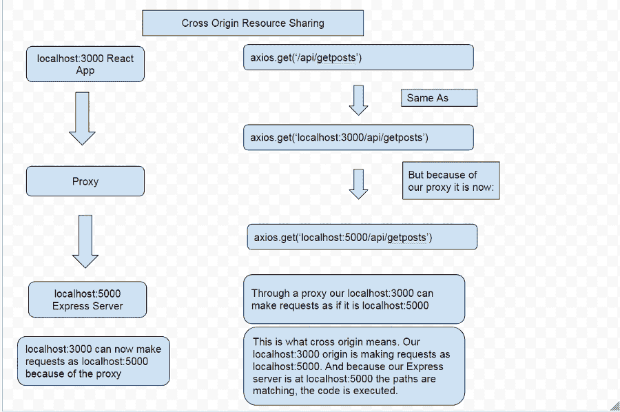

我们的 **localhost:3000** 本质上是通过一个代理中间人发出请求，就好像它是 **localhost:5000** ，这使得我们的**服务器**能够与我们的**客户端**通信。

我们的客户端现在连接到我们的服务器，我们现在要测试我们的应用程序。

我们现在必须回到服务器端，设置`express`路由。在您的**主**文件夹中的**服务器**目录下创建一个名为`routes.js`的新文件。这个文件将保存所有的`express`路线。这允许我们向我们的客户端应用程序发送数据。我们现在可以设定一条非常简单的路线:

```
var express = require('express')
var router = express.Router()

router.get('/api/hello', (req, res) => {
	res.json('hello world')
})

module.exports = router
```

基本上，如果对`/hello`路由进行 API 调用，我们的 **Express 服务器**将以 json 格式的“hello world”字符串作为响应。

我们还必须重构我们的`app.js`文件来使用快速路线。

```
var createError = require('http-errors');
var express = require('express');
var path = require('path');
var cookieParser = require('cookie-parser');
var logger = require('morgan');

var indexRouter = require('./routes')

var app = express();

app.use(logger('dev'));
app.use(express.json());
app.use(express.urlencoded({ extended: false }));
app.use(cookieParser());
app.use(express.static(path.join(__dirname, 'public')));

app.use('/', indexRouter)

module.exports = app;
```

现在，我们的客户端代码在我们的`home.js`组件中:

```
import React, { useState, useEffect } from 'react'
import axios from 'axios';

const Home = props => {
    useEffect(() => {
      axios.get('/api/hello')
        .then(res => setState(res.data))
    }, [])

    const [state, setState] = useState('')

  return(
    <div>
      Home
      <p>{state}</p>
    </div>
 )
};

export default Home;
```

我们正在向正在运行的`express`服务器发出一个基本的`axios` get 请求，如果成功的话，我们应该会看到“hello world”呈现在屏幕上。

是的，它正在工作，我们已经成功地设置了一个 React Node Fullstack 应用程序！

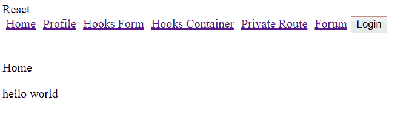

在继续之前，我想回答你可能会有的几个问题，这就是`axios`、`react router`和`express router`之间的区别，以及为什么我没有使用类似**序列**的**形式**。

### Axios vs Express 路由器 vs React 路由器

**TLDR；**我们使用`react router`在应用中导航，使用`axios`与`express`服务器通信，使用`express`服务器与数据库通信。

此时您可能想知道这三个库是如何协同工作的。我们使用`axios`与我们的`express`服务器后端通信，我们将通过在 URI 中包含“/api/”来表示对我们的`express`服务器的调用。`axios`也可用于向任何后端端点发出直接 http 请求。然而，出于安全原因，不建议从客户端向数据库发出请求。

`express router`主要用于与我们的数据库通信，因为我们可以在`express router`函数体中传递 SQL 查询。`express`与 Node 一起用于在浏览器之外运行代码，这使得 SQL 查询成为可能。`express`也是比 axios 更安全的 http 请求方式。

然而，我们需要 React 客户端的`axios`来处理异步 http 请求，我们显然不能在 React 客户端使用`express router` 。`axios`是基于**承诺**的，所以它也可以自动处理异步动作。

我们使用`react-router`在我们的应用程序中导航，因为 React 是一个单页面应用程序，浏览器不会在页面变化时重新加载。我们的应用程序有幕后技术，如果我们请求通过`express`或`react-router`的路线，它会自动知道。

### 为什么不用 Sequelize 这样的 ORM 库呢？

**TLDR；**偏好直接使用 SQL，这比 ORM 允许更多的控制。比 ORM 更多的 SQL 学习资源。ORM 技能是不可转移的，SQL 技能是非常可转移的。

有很多教程展示了如何实现一个使用 SQL 数据库的 ORM 库。这没有错，但我个人更喜欢直接与 SQL 交互。直接使用 SQL 可以让您更好地控制代码，我相信在直接使用 SQL 时稍微增加一点难度是值得的。

SQL 上的资源比任何给定的 ORM 库都多，因此如果您有问题或错误，找到解决方案要容易得多。

此外，您正在使用 ORM 库添加另一个依赖项和抽象级别，这可能会导致错误。如果你使用一个 ORM，当库改变时，你将需要跟踪更新和突破性的改变。另一方面，SQL 非常成熟，已经存在了几十年，这意味着它不太可能有太多的突破性变化。SQL 也有时间进行改进和完善，这通常不是 ORM 库的情况。

最后，ORM 库需要时间来学习，而且知识通常不能转移到其他任何东西上。SQL 是使用最广泛的数据库语言(据我所知，大约 90%的商业数据库都使用 SQL)。学习一个 SQL 系统，比如 PSQL，可以让你直接将这些技能和知识转移到另一个 SQL 系统，比如 MySQL。

这些就是我不使用 ORM 库的原因。

## 设置数据库

让我们通过在服务器目录的主文件夹中创建一个名为`schema.sql.`的文件来设置 SQL 模式

这将保持数据库的形状和结构。要实际设置数据库，您当然必须在 PSQL shell 中输入这些命令。在我们的项目中简单地拥有一个 SQL 文件没有任何作用，它只是一种方式，让我们参考我们的数据库结构，并允许其他工程师访问我们的 SQL 命令，如果他们想使用我们的代码的话。

但是要真正拥有一个正常运行的数据库，我们将在 PSQL 终端中输入这些完全相同的命令。

```
 CREATE TABLE users (
  uid SERIAL PRIMARY KEY,
  username VARCHAR(255) UNIQUE,
  email VARCHAR(255),
  email_verified BOOLEAN,
  date_created DATE,
  last_login DATE
);

CREATE TABLE posts (
  pid SERIAL PRIMARY KEY,
  title VARCHAR(255),
  body VARCHAR,
  user_id INT REFERENCES users(uid),
  author VARCHAR REFERENCES users(username),
  date_created TIMESTAMP
  like_user_id INT[] DEFAULT ARRAY[]::INT[],
  likes INT DEFAULT 0
);

CREATE TABLE comments (
  cid SERIAL PRIMARY KEY,
  comment VARCHAR(255),
  author VARCHAR REFERENCES users(username),
  user_id INT REFERENCES users(uid),
  post_id INT REFERENCES posts(pid),
  date_created TIMESTAMP
); 
```

因此，我们在这里有 3 个表，将持有我们的用户，帖子和评论的数据。按照 SQL 惯例，所有小写文本都是用户定义的列名或表名，所有大写文本都是 SQL 命令。

**主键**:psql 为给定列生成的唯一编号

**VARCHAR(255)** :可变字符，或文本和数字。255 设置行的长度。

**布尔型**:真或假

**引用**:如何设置外键。外键是另一个表中的主键。我将在下面详细解释这一点。

**唯一**:防止一列中出现重复条目。

**默认值**:设定默认值

INT[]DEFAULT ARRAY[]::INT[]:这是一个看起来相当复杂的命令，但却相当简单。我们首先有一个整数数组，然后将该整数数组设置为整数数组类型的空数组的默认值。

**用户表**
我们有一个非常基本的用户表**，大部分数据将来自 auth0，我们将在 **authcheck** 部分看到更多。**

****帖子表**
接下来我们有帖子表。我们将从 React 前端获得我们的标题和正文，我们还将每个帖子与一个`user_id`和`username`相关联。我们用 SQL 的外键将每个帖子与一个用户相关联。**

**我们也有我们的数组`like_user_id`，它将包含喜欢一个帖子的人的所有用户 id，防止来自同一个用户的多个喜欢。**

****评论表**
最后我们有了自己的评论表。我们将从 react 前端获取我们的注释，我们还将每个**用户**与一个**注释**相关联，因此我们使用来自**用户表**的`user id`和`username`字段。我们还需要来自我们的**帖子表**的`post id`,因为评论是针对帖子的，所以评论不是孤立存在的。所以每个评论必须与一个用户**和一个帖子**相关联。**

### **PSQL 外键**

****外键**实质上是另一个表中被原始表引用的字段或列。外键通常引用另一个表中的**主键**，但是正如您可以看到我们的 **posts 表，**也有一个**外键**链接到`username`，这是我们出于显而易见的原因所需要的。为了确保数据的完整性，您可以在`username`字段上使用`UNIQUE`约束，这允许它作为一个外键。**

**使用一个表中的一列引用另一个表中的一列，可以使我们在数据库中的表之间建立关系，这就是为什么 SQL 数据库被称为“关系数据库”。**

**我们使用的语法是:**

```
 `column_name data_type REFERENCES other_table(column_name_in_other_table)` 
```

**因此，我们的 posts 表中的`user_id`列中的一行必须与 **users 表**的`uid`列中的一行相匹配。这将允许我们做的事情，如查找某个用户发表的所有帖子或查找与帖子相关的所有评论。**

****外键约束**
你还必须注意 **PSQL 的外键约束。**哪些限制可以防止您删除被另一个表引用的行。**

**一个简单的例子是**删除帖子而不删除与该帖子**相关的评论。**帖子表**中的**帖子 id** 是**评论表**中的**外键**，用于**建立表**之间的关系。**

**你不能在没有删除评论的情况下就删除文章，因为你的数据库中会有一堆评论，而这些评论都没有 T2 的文章 id 外键。**

**下面的例子展示了如何删除用户及其帖子和评论。**

**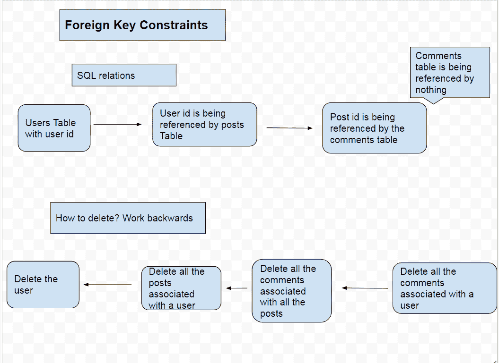**

### **PSQL 外壳**

**让我们打开 **PSQL 外壳**，输入我们刚刚在`schema.sql`文件中创建的这些命令。这个 **PSQL 外壳**应该在你安装 **PSQL** 的时候就已经自动安装好了。如果没有，只需到 **PSQL** 网站下载并重新安装即可。**

**如果您第一次登录到 **PSQL shell** ，系统会提示您设置服务器、数据库名称、端口、用户名和密码。将端口保留为默认的**5432**，并将其余的凭证设置为您想要的任何值。**

**所以现在你应该在终端上看到`postgres#`或者你设置的数据库名称。这意味着我们已经准备好开始输入 **SQL** 命令。让我们用命令`CREATE DATABASE database1`创建一个新的数据库，然后用`\c database1`连接到它，而不是使用默认的数据库。如果操作正确，您应该会看到`database#`。**

**如果你想要所有命令的列表，你可以在 **PSQL shell** 中输入`help`或`\?` 。永远记住用一个`;`结束 SQL 查询，这是使用 SQL 时最常见的错误之一。**

**在 hear 中，我们可以从`schema.sql`文件中复制并粘贴我们的命令。**

**为了查看我们的表列表，我们使用了`\dt`命令，您应该会在终端中看到这个命令。**

**而且我们已经成功建立了数据库！**

**现在我们需要将这个**数据库**连接到我们的**服务器**。做到这一点极其简单。我们可以通过使用`pg`库来做到这一点。安装`pg`库，如果你还没有这样做，并确保你在服务器目录中，我们不想在我们的 React 应用程序中安装这个库。**

**在**主目录**中创建一个名为`db.js`的单独文件，设置如下:**

```
`const { Pool } = require('pg')

const pool = new Pool({
  user: 'postgres',
  host: 'localhost',
  database: 'postgres',
  password: '',
  post: 5432
})

module.exports = pool` 
```

**这些将是您在设置 **PSQL** **shell** 时设置的相同凭证。**

**这就是我们已经建立了我们的数据库与我们的服务器一起使用。我们现在可以开始从我们的 express 服务器对其进行查询。**

### **设置快速路线和 PSQL 查询**

**以下是路由和查询的设置。我们需要对帖子和评论进行基本的 CRUD 操作。所有这些值都将来自我们接下来要设置的 React 前端。**

```
`var express = require('express')
var router = express.Router()
var pool = require('./db')

/*
    POSTS ROUTES SECTION
*/

router.get('/api/get/allposts', (req, res, next ) => {
  pool.query(`SELECT * FROM posts 
              ORDER BY date_created DESC`, 
            (q_err, q_res) => {
                  res.json(q_res.rows)
  })
})

router.get('/api/get/post', (req, res, next) => {
  const post_id = req.query.post_id

  pool.query(`SELECT * FROM posts
              WHERE pid=$1`,
            [ post_id ], (q_err, q_res) => {
                res.json(q_res.rows)
      })
} )

router.post('/api/post/posttodb', (req, res, next) => {
  const values = [ req.body.title, 
                   req.body.body,
                   req.body.uid, 
                   req.body.username]
  pool.query(`INSERT INTO posts(title, body, user_id, author, date_created)
              VALUES($1, $2, $3, $4, NOW() )`,
           values, (q_err, q_res) => {
          if(q_err) return next(q_err);
          res.json(q_res.rows)
    })
})

router.put('/api/put/post', (req, res, next) => {
  const values = [ req.body.title,
                   req.body.body, 
                   req.body.uid, 
                   req.body.pid, 
                   req.body.username]
  pool.query(`UPDATE posts SET title= $1, body=$2, user_id=$3, author=$5, date_created=NOW()
              WHERE pid = $4`, values,
              (q_err, q_res) => {
                console.log(q_res)
                console.log(q_err)
        })
})

router.delete('/api/delete/postcomments', (req, res, next) => {
  const post_id = req.body.post_id
  pool.query(`DELETE FROM comments
              WHERE post_id = $1`, [post_id],
              (q_err, q_res) => {
                  res.json(q_res.rows)
                  console.log(q_err)
        })
})

router.delete('/api/delete/post', (req, res, next) => {
  const post_id = req.body.post_id
  pool.query(`DELETE FROM posts WHERE pid = $1`, [ post_id ],
              (q_err, q_res) => {
                res.json(q_res.rows)
                console.log(q_err)
       })
})

router.put('/api/put/likes', (req, res, next) => {
  const uid = [req.body.uid]
  const post_id = String(req.body.post_id)

  const values = [ uid, post_id ]
  console.log(values)
  pool.query(`UPDATE posts
              SET like_user_id = like_user_id || $1, likes = likes + 1
              WHERE NOT (like_user_id @> $1)
              AND pid = ($2)`,
     values, (q_err, q_res) => {
    if (q_err) return next(q_err);
    console.log(q_res)
    res.json(q_res.rows);
  });
});

/*
    COMMENTS ROUTES SECTION
*/

router.post('/api/post/commenttodb', (req, res, next) => {
  const values = [ req.body.comment, 
    req.body.user_id, 
    req.body.username, 
    req.body.post_id]

  pool.query(`INSERT INTO comments(comment, user_id, author, post_id, date_created)
              VALUES($1, $2, $3, $4, NOW())`, values,
              (q_err, q_res ) => {
                  res.json(q_res.rows)
                  console.log(q_err)
      })
})

router.put('/api/put/commenttodb', (req, res, next) => {
  const values = [ req.body.comment,
                   req.body.user_id, 
                   req.body.post_id, 
                   req.body.username, 
                   req.body.cid]

  pool.query(`UPDATE comments SET comment = $1, user_id = $2, post_id = $3, author = $4, date_created=NOW()
              WHERE cid=$5`, values,
              (q_err, q_res ) => {
                  res.json(q_res.rows)
                  console.log(q_err)
      })
})

router.delete('/api/delete/comment', (req, res, next) => {
  const cid = req.body.comment_id
  console.log(cid)
  pool.query(`DELETE FROM comments
              WHERE cid=$1`, [ cid ],
              (q_err, q_res ) => {
                  res.json(q_res)
                  console.log(q_err)
      })
})

router.get('/api/get/allpostcomments', (req, res, next) => {
  const post_id = String(req.query.post_id)
  pool.query(`SELECT * FROM comments
              WHERE post_id=$1`, [ post_id ],
              (q_err, q_res ) => {
                  res.json(q_res.rows)
      })
})

/*
  USER PROFILE SECTION
*/

router.post('/api/posts/userprofiletodb', (req, res, next) => {
  const values = [req.body.profile.nickname, 
                  req.body.profile.email, 
                  req.body.profile.email_verified]
  pool.query(`INSERT INTO users(username, email, email_verified, date_created)
              VALUES($1, $2, $3, NOW())
              ON CONFLICT DO NOTHING`, values,
              (q_err, q_res) => {
                res.json(q_res.rows)
      })
} )

router.get('/api/get/userprofilefromdb', (req, res, next) => {
  const email = req.query.email
  console.log(email)
  pool.query(`SELECT * FROM users
              WHERE email=$1`, [ email ],
              (q_err, q_res) => {
                res.json(q_res.rows)
      })
} )

router.get('/api/get/userposts', (req, res, next) => {
  const user_id = req.query.user_id
  console.log(user_id)
  pool.query(`SELECT * FROM posts
              WHERE user_id=$1`, [ user_id ],
              (q_err, q_res) => {
                res.json(q_res.rows)
      })
} )

// Retrieve another users profile from db based on username 
router.get('/api/get/otheruserprofilefromdb', (req, res, next) => {
  // const email = [ "%" + req.query.email + "%"]
  const username = String(req.query.username)
  pool.query(`SELECT * FROM users
              WHERE username = $1`,
    [ username ], (q_err, q_res) => {
    res.json(q_res.rows)
  });
});

//Get another user's posts based on username
router.get('/api/get/otheruserposts', (req, res, next) => {
  const username = String(req.query.username)
  pool.query(`SELECT * FROM posts
              WHERE author = $1`,
    [ username ], (q_err, q_res) => {
    res.json(q_res.rows)
  });
});

module.exports = router`
```

****SQL 命令****

**我们如何从数据库中获取数据。返回表格中的所有行。**

**`INSERT INTO table(column1, column2)`:我们如何保存数据并向数据库中添加行。**

**`UPDATE table SET column1 =$1, column2 = $2`:如何更新或修改数据库中的现有行。`WHERE`子句指定要更新哪些行。**

**`DELETE FROM table`:根据`WHERE`子句的条件删除行。**警告**:不包含`WHERE`子句会删除整个表。**

**子句:添加到查询中的可选条件语句。这类似于 javascript 中的`if`语句。**

**`WHERE (array @> value)`:如果值包含在数组中。**

### **快速路线**

**为了设置**快速路线**，我们首先使用我们在顶部用`express.Router()`定义的`router`对象。然后是我们想要的 **http 方法**，它可以是标准方法，如 **GET、POST、PUT** 等。**

**然后在括号中，我们首先传入我们想要的**路线**的字符串，第二个参数是从**客户端**调用**路线**时运行的函数， **Express** 自动监听来自**客户端**的这些路线调用。当**路径**匹配时，主体中的函数被调用，在我们的例子中恰好是 **PSQL 查询**。**

**我们也可以在函数调用中传递参数。我们用 **req，res** 和 **next** 。**

****req:** 是 request 的缩写，包含来自我们客户端的请求数据。这是我们从前端获取数据到服务器的基本方式。**来自 React 前端的数据包含在这个 req 对象**中，我们在这里的**路线**中广泛使用它来访问值。数据将作为 javascript 对象的参数提供给 axios。
对于带有可选参数的 **GET** 请求，数据将通过 **req.query** 获得。对于 **PUT、POST 和 DELETE** 请求，数据将直接出现在带有 **req.body** 的请求体中。数据将是一个 javascript 对象，每个属性都可以用常规的点符号来访问。**

****res:** 是 response 的简称，包含了**快递服务器**的响应。我们想把从我们的**数据库**得到的响应发送给**客户端**，所以我们把数据库响应传递给这个 res 函数，然后这个函数把它发送给我们的客户端。**

****next:** 是中间件，允许你传递回调到下一个函数。**

**请注意，在我们的**快速路线**中，我们正在执行`pool.query`操作，这个`pool`对象与包含我们之前设置并在顶部导入的**数据库**登录凭证的对象相同。**查询函数**允许我们以字符串格式对数据库进行 **SQL 查询**。还要注意，我使用了` ` not 引号，这允许我在多行上查询。**

**然后在我们的 SQL 查询后有一个逗号，下一个参数是在运行**查询**后执行的箭头函数。我们首先向箭头函数传递两个参数，`q_err`和`q_res`表示**查询错误**和**查询响应**。为了向**前端**发送数据，我们将`q_res.rows`传递给`res.json`函数。`q_res.rows`是数据库的响应，因为这是 SQL，数据库会根据我们的查询返回匹配的行。然后我们将这些**行**转换成 **json 格式**，并通过`res`参数将其发送给我们的**前端**。**

**我们还可以向我们的 **SQL 查询**传递可选值，方法是在**查询**之后传递一个**数组**，用逗号分隔。然后，我们可以使用语法`$1`在 **SQL 查询**中访问那个**数组**中的各个元素，其中`$1`是数组中的第一个元素。`$2`将访问数组中的第二个元素**等等。注意，不像 javascript 那样是基于 0 的系统，没有`$0`****

**让我们来分解这些路线，并对每条路线进行简要描述。**

****发布路线****

*   ****/api/get/allposts:** 从数据库中检索我们所有的帖子。允许我们首先显示最新的帖子。**
*   ****/api/post/posttodb:** 将用户帖子保存到数据库中。我们将需要的 4 个值保存到一个值数组中:标题、正文、用户 id、用户名。**
*   ****/api/put/post:** 编辑数据库中现有的帖子。我们使用 SQL `UPDATE`命令并再次传入 post 的所有值。我们用从前端获得的帖子 id 来查找帖子。**
*   ****/API/delete/post comments:**删除与帖子相关的所有评论。由于 **PSQL 的外键**约束，我们必须删除所有与帖子相关的评论，然后才能删除实际的帖子。**
*   ****/api/delete/post:** 删除帖子 id 为的帖子。**
*   ****/api/put/likes** :我们发出一个 put 请求，将喜欢这个帖子的用户的用户 id 添加到`like_user_id`数组中，然后我们将`likes`的计数增加 1。**

****评论路线****

*   ****/api/post/commenttodb:** 将注释保存到数据库中**
*   ****/api/put/commenttodb:** 编辑数据库中的现有注释**
*   ****/api/delete/comment:** 删除单个评论，这不同于删除与帖子相关的所有评论。**
*   ****/API/get/all post comments:**检索与单个帖子相关的所有评论**

****用户路线****

*   ****/API/posts/user profile todb:**将 auth0 中的一个用户配置文件数据保存到我们自己的数据库中。如果用户已经存在，PostgreSQL 不做任何事情。**
*   ****/API/get/user profile fromdb:**通过查找用户的电子邮件来检索用户**
*   ****/api/get/userposts:** 通过查找与用户 id 匹配的所有帖子来检索用户发布的帖子。**
*   ****/API/get/otheruserprofiledb:**从数据库中获取另一个用户的个人资料数据，并在他们的个人资料页面上查看。******
*   ****/api/get/otheruserposts:** 当您查看其他用户的个人资料页面时，获取他们的帖子** 

## **使用缩减器、操作和上下文设置全局状态。**

###  **将用户档案数据保存到我们的数据库**

**在我们开始设置全局状态之前，我们需要一种方法将我们的用户配置文件数据保存到我们自己的数据库中，目前我们只是从 auth0 中获取数据。我们将在我们的`authcheck.js`组件中这样做。**

```
`import React, { useEffect, useContext } from 'react';
import history from './history';
import Context from './context';

import axios from 'axios';

const AuthCheck = () => {
  const context = useContext(Context)

  useEffect(() => {
    if(context.authObj.isAuthenticated()) {
      const profile = context.authObj.userProfile
      context.handleUserLogin()
      context.handleUserAddProfile(profile)
       axios.post('/api/posts/userprofiletodb', profile )
        .then(axios.get('/api/get/userprofilefromdb',
        		{params: {email: profile.profile.email}})
          .then(res => context.handleAddDBProfile(res.data)) )
        .then(history.replace('/') )
    }
    else {
      context.handleUserLogout()
      context.handleUserRemoveProfile()
      context.handleUserRemoveProfile()
      history.replace('/')
      }
    }, [context.authObj.userProfile, context])

    return(
        <div>
        </div>
)}

export default AuthCheck;`
```

**我们在上一个教程中设置了这个组件的大部分，所以我建议查看那个教程以获得详细的解释，但是这里我们正在做一个 **axios post 请求**，紧接着是另一个 **axios get 请求**，以立即获取我们刚刚保存到数据库的用户配置文件数据。**

**我们这样做是因为我们需要由数据库生成的唯一主键 id，这个**允许我们将这个用户与他们的评论和帖子**相关联。我们使用用户的电子邮件来查找他们，因为当他们第一次注册时，我们不知道他们唯一的 id 是什么。最后，我们将数据库用户配置文件数据保存到全局状态。**

***请注意，这也适用于 OAuth 登录，如谷歌和脸书登录。**

### **动作和减速器**

**我们现在可以开始设置动作和 reducers 以及上下文来设置这个应用程序的全局状态。**

**要从头开始设置上下文，请参阅我以前的教程。这里，我们只需要数据库配置文件和所有帖子的状态。**

**首先是我们的动作类型**

```
`export const SET_DB_PROFILE = "SET_DB_PROFILE"

export const REMOVE_DB_PROFILE = "REMOVE_DB_PROFILE"

export const FETCH_DB_POSTS = "FETCH_DB_POSTS"

export const REMOVE_DB_POSTS = "REMOVE_DB_POSTS"`
```

**现在我们的行动**

```
 `export const set_db_profile = (profile) => {
  return {
    type: ACTION_TYPES.SET_DB_PROFILE,
    payload: profile
  }
}

export const remove_db_profile = () => {
  return {
    type: ACTION_TYPES.REMOVE_DB_PROFILE
  }
}

export const set_db_posts = (posts) => {
  return {
    type: ACTION_TYPES.FETCH_DB_POSTS,
    payload: posts
  }
}

export const remove_db_posts = () => {
  return {
    type: ACTION_TYPES.REMOVE_DB_POSTS
  }
}` 
```

**最后是我们的后置还原器和授权还原器**

```
`import * as ACTION_TYPES from '../actions/action_types'

export const initialState = {
  posts: null,
}

export const PostsReducer = (state = initialState, action) => {
    switch(action.type) {
      case ACTION_TYPES.FETCH_DB_POSTS:
        return {
          ...state,
          posts: action.payload
        }
      case ACTION_TYPES.REMOVE_DB_POSTS:
        return {
          ...state,
          posts: []
        }

      default:
        return state
    }
}`
```

```
`import * as ACTION_TYPES from '../actions/action_types'

export const initialState = {
  is_authenticated: false,
  db_profile: null,
  profile: null,
}

export const AuthReducer = (state = initialState, action) => {
    switch(action.type) {
      case ACTION_TYPES.LOGIN_SUCCESS:
        return {
          ...state,
          is_authenticated: true
        }
      case ACTION_TYPES.LOGIN_FAILURE:
        return {
          ...state,
          is_authenticated: false
        }
        case ACTION_TYPES.ADD_PROFILE:
          return {
            ...state,
            profile: action.payload
          }
        case ACTION_TYPES.REMOVE_PROFILE:
          return {
            ...state,
            profile: null
          }
        case ACTION_TYPES.SET_DB_PROFILE:
          return {
            ...state,
            db_profile: action.payload
          }
        case ACTION_TYPES.REMOVE_DB_PROFILE:
          return {
            ...state,
            db_profile: null
          }
      default:
        return state
    }
}`
```

**现在我们必须将这些添加到`<Context.Provider />`**

```
 `...

    /*
      Posts Reducer
    */

    const [statePosts, dispatchPosts] =  useReducer(PostsReducer.PostsReducer,                                                         PostsReducer.initialState)

    const handleSetPosts = (posts) => {
      dispatchPosts(ACTIONS.set_db_posts(posts) )
    }

    const handleRemovePosts = () => {
      dispatchPosts(ACTIONS.remove_db_posts() )
    }
  ...

      /*
      Auth Reducer
    */
    const [stateAuth, dispatchAuth] = useReducer(AuthReducer.AuthReducer,
                                                               AuthReducer.initialState)

    const handleDBProfile = (profile) => {
      dispatchAuth(ACTIONS.set_db_profile(profile))
    }

    const handleRemoveDBProfile = () => {
      dispatchAuth(ACTIONS.remove_db_profile())
    }

  ...

  <Context.Provider
          value={{
          	...

            dbProfileState: stateAuthReducer.db_profile,

            handleAddDBProfile: (profile) => handleDBProfile(profile),
            handleRemoveDBProfile: () => handleRemoveDBProfile(),

            //Posts State
            postsState: statePostsReducer.posts,
            handleAddPosts: (posts) => handleSetPosts(posts),
            handleRemovePosts: () => handleRemovePosts(),

            ...
          }}>
   ...`
```

**就是这样，我们现在准备在我们的组件中使用这个全局状态。**

## **客户端 React 应用**

**接下来，我们将设置客户端反应博客。本节中的所有 API 调用都是在前面的 express routes 一节中设置的。**

**它将由以下 6 个部分组成。**

****addpost.js** :一个提交帖子的表单组件。**

**editpost.js :一个组件，用于编辑已经填充了字段的表单中的文章。**

****posts.js** :呈现所有帖子的组件，就像在典型的论坛中一样。**

****showpost.js** :一个组件，在用户点击一篇文章后呈现一篇文章。**

****profile.js** :呈现与用户关联的帖子的组件。用户仪表板。**

****showuser.js** :显示另一个用户资料和帖子的组件。**

### ****为什么不用 Redux 形式？****

****TDLR；对于大多数用例来说，Redux 形式是多余的。****

**Redux Form 是 React 应用中常用的一个流行库。那么为什么不在这里使用它呢？我尝试了 Redux Form，但是我在这里根本找不到它的用例。我们必须时刻牢记最终用途，我想不出这个应用程序需要在全局 redux 状态下保存表单数据的场景。**

**在这个应用程序中，我们只需从常规表单中获取数据，并将其传递给 Axios，Axios 再将其传递给 express 服务器，express 服务器最终将其保存到数据库中。另一个可能的用例是 editpost 组件，我通过将 post 数据传递给 Link 元素的属性来处理它。**

**试试 Redux Form，看看你是否能想出一个聪明的用法，但我们不需要它在这个应用程序中。此外，没有它，Redux Form 提供的任何功能都可以相对容易地完成。**

**对于大多数用例来说，Redux 表单简直是大材小用。**

**和 ORM 一样，没有理由给我们的应用程序增加另一层不必要的复杂性。**

**用 regular React 设置表单更简单。**

### **addpost.js**

```
`import React, { useContext} from 'react';
import axios from 'axios';

import history from '../utils/history';
import Context from '../utils/context';
import TextField from '@material-ui/core/TextField';

const AddPost = () => {
  const context = useContext(Context)

  const handleSubmit = (event) => {
    event.preventDefault()
    const user_id = context.dbProfileState[0].uid
    const username = context.dbProfileState[0].username
    const data = {title: event.target.title.value,
                  body: event.target.body.value,
                  username: username,
                  uid: user_id}

    axios.post('/api/post/posttodb', data)
      .then(response => console.log(response))
      .catch((err) => console.log(err))
      .then(setTimeout(() => history.replace('/'), 700) )
  }

    return(
      <div>
        <form onSubmit={handleSubmit}>
          <TextField
            id='title'
            label='Title'
            margin='normal'
            />
          <br />
          <TextField
            id='body'
            label='Body'
            multiline
            rowsMax='4'
            margin="normal"
            />
           <br />
           <button type='submit'> Submit </button>
           </form>
        <br />
        <button onClick={() => history.replace('/posts')}> Cancel </button>
      </div>
  )}

export default AddPost;`
```

**在 addpost 组件中，我们有一个简单的 2 字段表单，用户可以在其中输入标题和正文。表单是使用我们创建的`handlesubmit()`函数提交的。`handleSubmit()`函数接受一个包含用户提交的表单数据的事件参数关键字。**

**我们将使用`event.preventDefault()`来阻止页面重新加载，因为 React 是一个单页面应用程序，这是不必要的。**

****axios post** 方法采用参数“data ”,该参数将用于保存将存储在数据库中的数据。我们从上一节讨论的全局状态中得到**用户名**和**用户名**。**

**实际上，将数据发送到数据库是在我们之前看到的带有 SQL 查询的 **express routes** 函数中处理的。我们的 **axios API 调用**然后将数据传递给我们的 express 服务器，后者将信息保存到数据库中。**

### **editpost.js 文件**

**接下来是我们的`editpost.js`组件。这将是一个编辑用户帖子的基本组件。它只能通过用户个人资料页面访问。**

```
`import React, { useContext, useState } from 'react';
import axios from 'axios';
import history from '../utils/history';
import Context from '../utils/context';

import TextField from '@material-ui/core/TextField';
import Button from "@material-ui/core/Button";

const EditPost = (props) => {
  const context = useContext(Context)

  const [stateLocal, setState] = useState({ title: props.location.state.post.post.title,
                                            body: props.location.state.post.post.body
                                          })

  const handleTitleChange = (event) => {
    setState({...stateLocal, title: event.target.value })
  }

  const handleBodyChange = (event) => {
    setState({...stateLocal, body: event.target.value })
  }

  const handleSubmit = (event) => {
    event.preventDefault()

    const user_id = context.dbProfileState[0].uid
    const username = context.dbProfileState[0].username
    const pid = props.location.state.post.post.pid
    const title = event.target.title.value
    const body = event.target.body.value

    const data = {title: title,
                  body: body,
                  pid: pid,
                  uid: user_id,
                  username: username
                 }
    axios.put("/api/put/post", data)
      .then(res => console.log(res))
      .catch(err => console.log(err))
      .then(setTimeout(() => history.replace('/profile'), 700 ))
  }

    return(
        <div>
          <form onSubmit={handleSubmit}>
            <TextField
              id='title'
              label='title'
              margin="normal"
              value={stateLocal.title}
              onChange={handleTitleChange}
            />
            <br />
            <TextField
              id='body'
              label='body'
              multiline
              rows="4"
              margin='normal'
              value={stateLocal.body}
              onChange={handleBodyChange}
              />
          <br />
          <button type="submit"> Submit </button>
          </form>
          <br />
          <Button onClick={() => history.goBack()}> Cancel </Button>
        </div>
    )}

export default EditPost;`
```

**`props.location.state.posts.posts.title`:是**反应路由器**提供的功能。当用户从他们的个人资料页面点击一篇文章时，他们点击的文章数据被保存在 link 元素的 state 属性中，这与来自`useState`钩子的 React 中的本地组件状态不同**。****

**与上下文相比，这种方法为我们提供了一种更容易的保存数据的方式，并且还为我们节省了一个 API 请求。我们将在`profile.js`组件中看到这是如何工作的。**

**在这之后，我们有了一个基本的受控组件表单，并将每次击键的数据保存到 React 状态。**

**在我们的`handleSubmit()`函数中，我们在 axios put 请求中将所有数据发送到我们的服务器之前将它们组合在一起。**

### **posts.js**

```
`import React, { useContext, useEffect, useState } from 'react';

import { Link } from 'react-router-dom';

import axios from 'axios';
import moment from 'moment';
import Context from '../utils/context';

import Button from '@material-ui/core/Button';
import TextField from '@material-ui/core/TextField';

import Card from "@material-ui/core/Card";
import CardContent from "@material-ui/core/CardContent";
import CardHeader from "@material-ui/core/CardHeader";

import '../App.css';
import '../styles/pagination.css';

const Posts = (props) => {
  const context = useContext(Context)

  const [stateLocal, setState] = useState({ posts: [],
                                            fetched: false,
                                            first_page_load: false,
                                            pages_slice: [1, 2, 3, 4, 5],
                                            max_page: null,
                                            items_per_page: 3,

                                            currentPage: 1,
                                            num_posts: null,
                                            posts_slice: null,
                                            posts_search: [],
                                            posts_per_page: 3
                                        })

    useEffect(() => {
     if(!context.postsState) {
        axios.get('/api/get/allposts')
          .then(res => context.handleAddPosts(res.data) )
          .catch((err) => console.log(err))
        }
      if (context.postsState && !stateLocal.fetched) {
        const indexOfLastPost = 1 * stateLocal.posts_per_page
        const indexOfFirstPost = indexOfLastPost - stateLocal.posts_per_page
        const last_page = Math.ceil(context.postsState.length/stateLocal.posts_per_page)

        setState({...stateLocal,
                  fetched: true,
                  posts: [...context.postsState],
                  num_posts: context.postsState.length,
                  max_page: last_page,
                  posts_slice: context.postsState.slice(indexOfFirstPost,
                                                        indexOfLastPost)
                  })
        }
      }, [context, stateLocal])

    useEffect(() => {
      let page = stateLocal.currentPage
      let indexOfLastPost = page * 3;
      let indexOfFirstPost = indexOfLastPost - 3;

      setState({...stateLocal,
                posts_slice: stateLocal.posts.slice(indexOfFirstPost,
                                                    indexOfLastPost) })
    }, [stateLocal.currentPage]) //eslint-disable-line

   const add_search_posts_to_state = (posts) => {
      setState({...stateLocal, posts_search: []});
      setState({...stateLocal, posts_search: [...posts]});
   }

  const handleSearch = (event) => {
     setState({...stateLocal, posts_search: []});
     const search_query = event.target.value
     axios.get('/api/get/searchpost', {params: {search_query: search_query} })
       .then(res => res.data.length !== 0
                      ? add_search_posts_to_state(res.data)
                      : null )
       .catch(function (error) {
         console.log(error);
         })
     }

  const RenderPosts = post => (
    <div >
    <Card >
      <CardHeader
        title={<Link to={{pathname:'/post/' + post.post.pid, state: {post}}}>
                  {post.post.title}
                </Link> }
        subheader={
            <div className="FlexColumn">
              <div className="FlexRow">
              {  moment(post.post.date_created).format('MMMM Do, YYYY | h:mm a') }
              </div>
              <div className="FlexRow">
                By:
                <Link style={{paddingLeft: '5px', textDecoration: 'none'}}
                      to={{pathname:"/user/" + post.post.author, state:{post} }}>
                 { post.post.author }
                 </Link>
               </div>
               <div className="FlexRow">
                <i className="material-icons">thumb_up</i>
                <div className="notification-num-allposts"> {post.post.likes} </div>
              </div>
            </div>
            }
          />
      <br />
      <CardContent>
        <span style={{overflow: 'hidden' }}> {post.post.body} </span>
      </CardContent>
    </Card>
    </div>
  )

  const page_change = (page) => {
    window.scrollTo({top:0, left: 0, behavior: 'smooth'})

    //variables for page change
    let next_page = page + 1
    let prev_page = page - 1

    //handles general page change
    //if(state.max_page < 5 return null)
    if(page > 2 && page < stateLocal.max_page - 1) {
      setState({...stateLocal,
                currentPage: page,
                pages_slice: [prev_page - 1,
                              prev_page,
                              page,
                              next_page,
                              next_page + 1],
              })
     }
     if(page === 2 ) {
       setState({...stateLocal,
                currentPage: page,
                 pages_slice: [prev_page,
                               page,
                               next_page,
                               next_page + 1,
                               next_page + 2],
               })
      }
     //handles use case for user to go back to first page from another page
     if(page === 1) {
       setState({...stateLocal,
                currentPage: page,
                 pages_slice: [page,
                               next_page,
                               next_page + 1,
                               next_page + 2,
                               next_page + 3],
            })
     }
     //handles last page change
     if(page === stateLocal.max_page) {
       setState({...stateLocal,
                 currentPage: page,
                 pages_slice: [prev_page - 3,
                               prev_page - 2,
                               prev_page - 1,
                               prev_page,
                               page],
               })
     }
     if(page === stateLocal.max_page - 1) {
       setState({...stateLocal,
                 currentPage: page,
                 pages_slice: [prev_page - 2,
                               prev_page - 1,
                               prev_page,
                               page,
                               next_page],
               })
     }
   }

  return(
      <div>
      <div style={{opacity: stateLocal.opacity, transition: 'opacity 2s ease'}}>
      <br />
      { context.authState
        ?  <Link to="/addpost">
              <Button variant="contained" color="primary">
                Add Post
              </Button>
            </Link>
        : <Link to="/signup">
              <Button variant="contained" color="primary">
                Sign Up to Add Post
              </Button>
            </Link>
          }
      </div>
      <br />
      <TextField
        id="search"
        label="Search"
        margin="normal"
        onChange={handleSearch}
      />
      <hr />

       <br />
       <div>
         {stateLocal.posts_search
           ? stateLocal.posts_search.map(post =>
             <RenderPosts key={post.pid + 1000} post={post} />
            )
            : null
          }
        </div>

      <h1>Posts</h1>
        <div>
          {stateLocal.posts_slice
            ? stateLocal.posts_slice.map(post =>
              <RenderPosts key={post.pid} post={post} />
             )
            : null
           }
        </div>
        <div>
            <div className="FlexRow">
                <button onClick={() => page_change(1) }> First </button>
                <button onClick={() => page_change(stateLocal.currentPage - 1) }> Prev </button>
                   {stateLocal.pages_slice.map((page) =>
                       <div
                         onClick={() => page_change(page)}
                         className={stateLocal.currentPage === page
                                       ? "pagination-active"
                                       : "pagination-item" }
                         key={page}>
                           {page}
                        </div>
                   )}
                 <button onClick={() => page_change(stateLocal.currentPage + 1)}> Next </button>
                 <button onClick={() => page_change(stateLocal.max_page)}> Last </button>
               </div>
         </div>
      </div>
  )}

export default Posts;`
```

**您会注意到我们有一个相当复杂的`useEffect()`调用来从我们的数据库中获取我们的帖子。这是因为我们将我们的帖子从数据库保存到全局状态，这样即使用户导航到另一个页面，帖子仍然在那里。**

**这样做可以避免对我们的服务器进行不必要的 API 调用。这就是为什么我们使用条件来检查帖子是否已经保存到上下文状态。**

**如果帖子已经保存到全局状态，我们只需将全局状态中的帖子设置为本地状态，这允许我们初始化分页。**

****分页**
我们在`page_change()`函数中有一个基本的分页实现。我们基本上将 5 个分页块设置为一个数组。当页面改变时，数组用新值更新。这见于`page_change()`函数中的第一个`if`语句，其他 4 个`if`语句只是处理前 2 个和后 2 个页面的更改。**

**我们还必须调用一个`window.scrollTo()`来在每次页面改变时滚动到顶部。**

**挑战一下自己，看看是否可以构建一个更复杂的分页实现，但是对于我们的目的来说，这里的这个分页函数就足够了。**

**我们的分页需要 4 个状态值。我们需要:**

*   **`num_posts`:帖子数量**
*   **`posts_slice`:帖子总数的一部分**
*   **`currentPage`:当前页面**
*   **`posts_per_page`:每页的帖子数。**

**我们还需要将`currentPage`状态值传递给`useEffect()`钩子，这允许我们在每次页面改变时触发一个函数。我们通过将`currentPage`乘以 3 得到`indexOfLastPost` ，通过减去 3 得到我们想要显示的`indexOfFirstPost`文章。然后，我们可以将这个新的分片数组设置为本地状态中的新数组。**

**现在轮到我们的 JSX 了。我们正在使用 **flexbox** 来构造和布局我们的分页块，而不是传统使用的水平列表。**

**我们有 4 个按钮，让您可以转到第一页或返回一页，反之亦然。然后我们在我们的`pages_slice`数组上使用一个 map 语句，它为我们的分页块提供值。用户也可以点击分页块，分页块会将页面作为参数传递给`page_change()`函数。**

**我们还有 **CSS** 类，允许我们在分页上设置样式。**

*   **`.pagination-active`:这是一个常规的 CSS 类，而不是你通常在`.item:active`这样的水平列表中看到的伪选择器。我们通过比较`currentPage`和`pages_slice`数组中的页面来切换 React JSX 中的活动类。**
*   **`.pagination-item`:所有分页块的样式**
*   **`.pagination-item:hover`:当用户悬停在分页块上时应用的样式**

```
 `<div className="FlexRow">
                <button onClick={() => page_change(1) }> First </button>
                <button onClick={() => page_change(stateLocal.currentPage - 1)  }>
                	Prev 
                </button>
                   {stateLocal.pages_slice.map((page) =>
                       <div
                         onClick={() => page_change(page)}
                         className={stateLocal.currentPage === page
                                       ? "pagination-active"
                                       : "pagination-item" }
                         key={page}>
                           {page}
                        </div>
                   )}
                 <button onClick={() => page_change(stateLocal.currentPage + 1)}> Next </button>
                 <button onClick={() => page_change(stateLocal.max_page)}> Last </button>
               </div>`
```

```
 `.pagination-active {
  background-color: blue;
  cursor: pointer;
  color: white;
  padding: 10px 15px;
  border: 1px solid #ddd; /* Gray */
}

.pagination-item {
  cursor: pointer;
  border: 1px solid #ddd; /* Gray */
  padding: 10px 15px;
}

.pagination-item:hover {
  background-color: #ddd
}`
```

****RenderPosts**
`<RenderPosts />`是我们用来渲染每个帖子的功能组件。帖子的标题是一个`Link`,点击后会将用户带到每个带有评论的帖子。你还会注意到我们将整个帖子传递给了`Link`元素的`state`属性。这个`state`属性不同于我们当地的州，这实际上是`react-router`的属性，我们将在`showpost.js`组件中看到更多细节。我们对帖子的作者也做了同样的事情。**

**您还会注意到与搜索帖子相关的一些其他事情，我将在后面的部分中讨论这些事情。**

**我还将讨论`showpost.js`组件中的“likes”功能。**

### **showpost.js**

**现在我们有了这个应用程序中最复杂的组件。别担心，我会一步一步地把它完全分解，它并不像看起来那么可怕。**

```
`import React, { useContext, useState, useEffect } from 'react';

import { Link } from 'react-router-dom';
import axios from 'axios';
import history from '../utils/history';
import Context from '../utils/context';

import TextField from '@material-ui/core/TextField';

import Button from '@material-ui/core/Button';

const ShowPost = (props) => {
  const context = useContext(Context)

  const [stateLocal, setState] = useState({ comment: '',
                                            fetched: false,
                                            cid: 0,
                                            delete_comment_id: 0,
                                            edit_comment_id: 0,
                                            edit_comment: '',
                                            comments_arr: null,
                                            cur_user_id: null,
                                            like_post: true,
                                            likes: 0,
                                            like_user_ids: [],
                                            post_title: null,
                                            post_body: null,
                                            post_author: null,
                                            post_id: null
                                           })

    useEffect(() => {
      if(props.location.state && !stateLocal.fetched) {

        setState({...stateLocal,
                  fetched: true,
                  likes: props.location.state.post.post.likes,
                  like_user_ids: props.location.state.post.post.like_user_id,
                  post_title: props.location.state.post.post.title,
                  post_body: props.location.state.post.post.body,
                  post_author: props.location.state.post.post.author,
                  post_id: props.location.state.post.post.pid})
        }
      }, [stateLocal,
          props.location])

  useEffect( () => {
    if(!props.location.state && !stateLocal.fetched) {

      const post_id = props.location.pathname.substring(6)

      axios.get('/api/get/post',
                  {params: {post_id: post_id}} )
        .then(res => res.data.length !== 0
                ?   setState({...stateLocal,
                        fetched: true,
                        likes: res.data[0].likes,
                        like_user_ids: res.data[0].like_user_id,
                        post_title: res.data[0].title,
                        post_body: res.data[0].body,
                        post_author: res.data[0].author,
                        post_id: res.data[0].pid
                      })
                 : null
              )
        .catch((err) => console.log(err) )
    }
  }, [stateLocal,
      props.location])

   useEffect(() => {
     if(!stateLocal.comments_arr) {
       if(props.location.state) {
         const post_id = props.location.pathname.substring(6)
         axios.get('/api/get/allpostcomments',
                     {params: {post_id: post_id}} )
           .then(res => res.data.length !== 0
                          ? setState({...stateLocal, comments_arr: [...res.data]})
                          : null )
           .catch((err) => console.log(err))
       } 
     }
   }, [props.location, stateLocal])

    const handleCommentSubmit = (submitted_comment) => {
        if(stateLocal.comments_arr) {
            setState({...stateLocal, comments_arr: [submitted_comment,
                                                  ...stateLocal.comments_arr]})
         } else {
           setState({...stateLocal, comments_arr: [submitted_comment]})
         }
     };

     const handleCommentUpdate = (comment) => {
       const commentIndex = stateLocal.comments_arr.findIndex(com => com.cid === comment.cid)
       var newArr = [...stateLocal.comments_arr ]
       newArr[commentIndex] = comment

       setTimeout(() => setState({...stateLocal, comments_arr: [...newArr], edit_comment_id: 0 }), 100)
     };

     const handleCommentDelete = (cid) => {
       setState({...stateLocal, delete_comment_id: cid})
       const newArr = stateLocal.comments_arr.filter(com => com.cid !== cid)
       setState({...stateLocal, comments_arr: newArr})
     };

     const handleEditFormClose = () => {
       setState({...stateLocal, edit_comment_id: 0})
     }

    const RenderComments = (props) => {
      return(
      <div className={stateLocal.delete_comment_id === props.comment.cid
                        ? "FadeOutComment"
                        : "CommentStyles"}>
        <div>
        <p>{props.comment.comment} </p>
        <small>
          { props.comment.date_created === 'Just Now'
            ?  <div> {props.comment.isEdited
                  ? <span> Edited </span>
                  : <span> Just Now </span> }</div>
            :  props.comment.date_created
          }
        </small>
        <p> By: { props.comment.author} </p>
        </div>
        <div>
        {props.cur_user_id === props.comment.user_id
          ? !props.isEditing
            ?  <div>
                  <Button onClick={() => setState({...stateLocal,
                                                  edit_comment_id: props.comment.cid,
                                                  edit_comment: props.comment.comment
                                                  })
                                     }>
                     Edit
                   </Button>
                </div>
            :   <form onSubmit={(event, cid) => handleUpdate(event, props.comment.cid) }>
                  <input
                    autoFocus={true}
                    name="edit_comment"
                    id="editted_comment"
                    label="Comment"
                    value={stateLocal.edit_comment}
                    onChange={handleEditCommentChange}
                  />
                    <br />
                    <Button type='submit'>
                       Agree
                    </Button>
                    <Button type="button" onClick={handleEditFormClose}>
                     Cancel
                    </Button>
                    <button onClick={() => handleDeleteComment(props.comment.cid)}>
                      Delete
                    </button>
                  </form>
            : null }
          </div>
      </div>
    );
   }

    const handleEditCommentChange = (event) => (
      setState({...stateLocal,
                edit_comment: event.target.value})
    );

    const handleSubmit = (event) => {
      event.preventDefault()
      setState({...stateLocal, comment: ''})

      const comment = event.target.comment.value
      const user_id = context.dbProfileState[0].uid
      const username = context.dbProfileState[0].username
      const post_id = stateLocal.post_id
      const current_time = "Just Now"
      const temp_cid = Math.floor(Math.random() * 1000);

      const submitted_comment = {cid: temp_cid,
                                 comment: comment,
                                 user_id: user_id,
                                 author: username,
                                 date_created: current_time }

      const data = {comment: event.target.comment.value,
                    post_id: post_id,
                    user_id: user_id,
                    username: username}

      axios.post('/api/post/commenttodb', data)
        .then(res => console.log(res))
        .catch((err) => console.log(err))
      window.scroll({top: 0, left: 0, behavior: 'smooth'})
      handleCommentSubmit(submitted_comment)
    }

    const handleUpdate = (event, cid) => {
      event.preventDefault()
      console.log(event)
      console.log(cid)
      const comment = event.target.editted_comment.value
      const comment_id = cid
      const post_id = stateLocal.post_id
      const user_id = context.dbProfileState[0].uid
      const username = context.dbProfileState[0].username
      const isEdited = true
      const current_time = "Just Now"

      const edited_comment = {cid: comment_id,
                              comment: comment,
                              user_id: user_id,
                              author: username,
                              date_created: current_time,
                              isEdited: isEdited }

      const data = {cid: comment_id,
                    comment: comment,
                    post_id: post_id,
                    user_id: user_id,
                    username: username}

      axios.put('/api/put/commenttodb', data)
        .then(res => console.log(res))
        .catch((err) => console.log(err))
      handleCommentUpdate(edited_comment);
    }

    const handleDeleteComment = (cid) => {
      const comment_id = cid
      console.log(cid)
      axios.delete('/api/delete/comment', {data: {comment_id: comment_id}} )
        .then(res => console.log(res))
        .catch((err) => console.log(err))
      handleCommentDelete(cid)
    }

    const handleLikes = () => {
        const user_id = context.dbProfileState[0].uid
        const post_id = stateLocal.post_id

        const data = { uid: user_id, post_id: post_id }
        console.log(data)
        axios.put('/api/put/likes', data)
          .then( !stateLocal.like_user_ids.includes(user_id) && stateLocal.like_post
                    ? setState({...stateLocal,
                                likes: stateLocal.likes + 1,
                                like_post: false})
                    : null )
          .catch(err => console.log(err))
      };

    return(
        <div>
          <div>
            <h2>Post</h2>
            {stateLocal.comments_arr || props.location.state
              ? <div>
                  <p>{stateLocal.post_title}</p>
                  <p>{stateLocal.post_body}</p>
                  <p>{stateLocal.post_author}</p>
                </div>
            : null
           }

              <div style={{cursor: 'pointer'}} onClick={context.authState
                                                        ? () => handleLikes()
                                                        : () => history.replace('/signup')}>
                  <i className="material-icons">thumb_up</i>
                  <small className="notification-num-showpost">
                    {stateLocal.likes}
                  </small>
                </div>
          </div>
          <div>

            <h2> Comments:</h2>
            {stateLocal.comments_arr
              ? stateLocal.comments_arr.map((comment) =>
                 <RenderComments comment={comment}
                                 cur_user_id={context.dbProfileState
                                                ? context.dbProfileState[0].uid
                                                : null  }
                                 key={comment.cid}
                                 isEditing={comment.cid === stateLocal.edit_comment_id
                                              ? true
                                              : false }
                       />)
              : null
            }
          </div>
          <div>
            <form onSubmit={handleSubmit}>
              <TextField
                id="comment"
                label="Comment"
                margin="normal"
              />
              <br />

              {context.authState
                ? <Button variant="contained" color="primary" type="submit">
                    Submit
                  </Button>
                : <Link to="/signup">
                     <Button  variant="contained" color="primary">
                         Signup to Comment
                      </Button>
                   </Link>
               }
            </form>
          </div>
          <div>
          </div>
        </div>
    )}

export default ShowPost;`
```

**你首先会注意到一个巨大的`useState`呼叫。我将解释每一个属性是如何工作的，因为我们在这里一次探索我们的组件。**

****useEffect()和 API 请求**
我们首先需要知道的是，用户可以通过两种不同的方式访问一篇文章。**从论坛**访问或**使用直接网址**导航至该论坛。**

```
`useEffect(() => {
      if(props.location.state && !stateLocal.fetched) {
        setState({...stateLocal,
                  fetched: true,
                  likes: props.location.state.post.post.likes,
                  like_user_ids: props.location.state.post.post.like_user_id,
                  post_title: props.location.state.post.post.title,
                  post_body: props.location.state.post.post.body,
                  post_author: props.location.state.post.post.author,
                  post_id: props.location.state.post.post.pid})
        }
      }, [stateLocal,
          props.location])

  useEffect( () => {
    if(!props.location.state && !stateLocal.fetched) {

      const post_id = props.location.pathname.substring(6)

      axios.get('/api/get/post',
                  {params: {post_id: post_id}} )
        .then(res => res.data.length !== 0
                ?   setState({...stateLocal,
                        fetched: true,
                        likes: res.data[0].likes,
                        like_user_ids: res.data[0].like_user_id,
                        post_title: res.data[0].title,
                        post_body: res.data[0].body,
                        post_author: res.data[0].author,
                        post_id: res.data[0].pid
                      })
                 : null
              )
        .catch((err) => console.log(err) )
    }
  }, [stateLocal,
      props.location])

   useEffect(() => {
     if(!stateLocal.comments_arr) {
       if(props.location.state) {
         const post_id = props.location.pathname.substring(6)
         axios.get('/api/get/allpostcomments',
                     {params: {post_id: post_id}} )
           .then(res => res.data.length !== 0
                          ? setState({...stateLocal, 
                                      comments_arr: [...res.data]})
                          : null )
           .catch((err) => console.log(err))
       }
     }
   }, [props.location, stateLocal])`
```

**如果他们**从论坛**访问它，我们在`useEffect()`调用中检查这一点，然后将我们的本地状态设置为 post。因为我们在`<Link />`元素中使用了 **react router 的** `state`属性，所以我们可以通过 props 访问已经可用的全部 post 数据，这为我们节省了一个不必要的 API 调用。**

**如果用户**在浏览器中输入帖子的直接 URL** ，那么我们别无选择，只能发出 API 请求来获取帖子，因为用户必须点击来自`posts.js`论坛的帖子，将帖子数据保存到 react-router 的`state`属性中。**

**我们首先用 react-router 的`pathname`属性从 URL 中提取**文章 id** ，然后在我们的 **axios 请求**中使用它作为参数。在 API 请求之后，我们只需将响应保存到本地状态。**

**之后，我们还需要用 API 请求来**获取注释。我们可以使用相同的帖子 id URL 提取方法来查找与帖子相关的评论。****

****渲染评论和动画**
这里我们有我们的`<RenderComments />`功能组件，我们用它来显示一个单独的评论。**

```
`....

const RenderComments = (props) => {
      return(
      <div className={stateLocal.delete_comment_id === props.comment.cid
                        ? "FadeOutComment"
                        : "CommentStyles"}>
        <div>
        <p>{props.comment.comment} </p>
        <small>
          { props.comment.date_created === 'Just Now'
            ?  <div> {props.comment.isEdited
                  ? <span> Edited </span>
                  : <span> Just Now </span> }</div>
            :  props.comment.date_created
          }
        </small>
        <p> By: { props.comment.author} </p>
        </div>
        <div>
        {props.cur_user_id === props.comment.user_id
          ? !props.isEditing
            ?  <div>
                  <Button onClick={() => setState({...stateLocal,
                                                  edit_comment_id: props.comment.cid,
                                                  edit_comment: props.comment.comment
                                                  })
                                     }>
                     Edit
                   </Button>
                </div>
            :   <form onSubmit={(event, cid) => handleUpdate(event, props.comment.cid) }>
                  <input
                    autoFocus={true}
                    name="edit_comment"
                    id="editted_comment"
                    label="Comment"
                    value={stateLocal.edit_comment}
                    onChange={handleEditCommentChange}
                  />
                    <br />
                    <Button type='submit'>
                       Agree
                    </Button>
                    <Button type="button" onClick={handleEditFormClose}>
                     Cancel
                    </Button>
                    <button onClick={() => handleDeleteComment(props.comment.cid)}>
                      Delete
                    </button>
                  </form>
            : null }
          </div>
      </div>
    );
   }

 ....

   <h2> Comments:</h2>
   {stateLocal.comments_arr
     ? stateLocal.comments_arr.map((comment) =>
         <RenderComments comment={comment}
                         cur_user_id={context.dbProfileState
                                        ? context.dbProfileState[0].uid
                                        : null  }
                          key={comment.cid}
                          isEditing={comment.cid === stateLocal.edit_comment_id
                                         ? true
                                         : false }
                       />)
              : null
            }
          </div>

....`
```

```
 `.CommentStyles {
  opacity: 1;
}

.FadeInComment {
  animation-name: fadeIn;
  animation-timing-function: ease;
  animation-duration: 2s
}

.FadeOutComment {
  animation-name: fadeOut;
  animation-timing-function: linear;
  animation-duration: 2s
}

@keyframes fadeIn {
  0% {
    opacity: 0;
  }
  100% {
    opacity: 1;
  }
}

@keyframes fadeOut {
  0% {
    opacity: 1;
  }
  100% {
    opacity: 0;
    width: 0;
    height: 0;
  }
}`
```

**我们首先在 div 的`className`属性中使用一个三元表达式来切换样式类。如果我们本地状态中的`delete_comment_id`与当前评论 id 匹配，那么它将被删除，并且一个**淡出动画**将被应用于该评论。**

**我们使用`@keyframe`来制作动画。我发现 css `@keyframe`动画比基于 javascript 的方法简单得多，比如有了`react-spring`和`react-transition-group`这样的库。**

**接下来，我们显示实际的注释**

**后面跟着一个三元表达式，它根据用户的操作设置创建日期、“编辑”或“刚刚”的**评论。****

**接下来我们有一个相当复杂的嵌套三元表达式。我们首先将`cur_user_id`(从我们的`context.dbProfileState`状态获得并在我们的 JSX 中设置)与**评论用户 id** 进行比较。如果有匹配，我们显示一个**编辑按钮**。**

**如果用户点击**编辑按钮**，我们将评论设置为`edit_comment`状态，并将`edit_comment_id`状态设置为**评论 id** 。这也使得 **isEditing** 属性为 true，从而打开表单并让用户编辑评论。当用户点击同意时，我们接下来将看到的`handleUpdate()`函数被调用。**

****Comments CRUD Operations**
这里我们有处理 CRUD operations for comments 的函数。你会看到我们有**两组函数**，一组**处理客户端 CRUD** ，另一组**处理 API 请求**。我会在下面解释原因。**

```
`....
//Handling CRUD operations client side

const handleCommentSubmit = (submitted_comment) => {
        if(stateLocal.comments_arr) {
            setState({...stateLocal,
                      comments_arr: [submitted_comment,                                                  ...stateLocal.comments_arr]})
         } else {
           setState({...stateLocal,
                     comments_arr: [submitted_comment]})
         }
     };

     const handleCommentUpdate = (comment) => {
       const commentIndex = stateLocal.comments_arr.findIndex(com => com.cid === comment.cid)
       var newArr = [...stateLocal.comments_arr ]
       newArr[commentIndex] = comment

       setTimeout(() => setState({...stateLocal,
                                  comments_arr: [...newArr],
                                  edit_comment_id: 0 }), 100)
     };

     const handleCommentDelete = (cid) => {
       setState({...stateLocal, delete_comment_id: cid})
       const newArr = stateLocal.comments_arr.filter(com => com.cid !== cid)
       setState({...stateLocal, comments_arr: newArr})
     };

.... 

//API requests

    const handleSubmit = (event) => {
      event.preventDefault()
      setState({...stateLocal, comment: ''})

      const comment = event.target.comment.value
      const user_id = context.dbProfileState[0].uid
      const username = context.dbProfileState[0].username
      const post_id = stateLocal.post_id
      const current_time = "Just Now"
      const temp_cid = Math.floor(Math.random() * 1000);

      const submitted_comment = {cid: temp_cid,
                                 comment: comment,
                                 user_id: user_id,
                                 author: username,
                                 date_created: current_time }

      const data = {comment: event.target.comment.value,
                    post_id: post_id,
                    user_id: user_id,
                    username: username}

      axios.post('/api/post/commenttodb', data)
        .then(res => console.log(res))
        .catch((err) => console.log(err))
      window.scroll({top: 0, left: 0, behavior: 'smooth'})
      handleCommentSubmit(submitted_comment)
    }

    const handleUpdate = (event, cid) => {
      event.preventDefault()
      console.log(event)
      console.log(cid)
      const comment = event.target.editted_comment.value
      const comment_id = cid
      const post_id = stateLocal.post_id
      const user_id = context.dbProfileState[0].uid
      const username = context.dbProfileState[0].username
      const isEdited = true
      const current_time = "Just Now"

      const edited_comment = {cid: comment_id,
                              comment: comment,
                              user_id: user_id,
                              author: username,
                              date_created: current_time,
                              isEdited: isEdited }

      const data = {cid: comment_id,
                    comment: comment,
                    post_id: post_id,
                    user_id: user_id,
                    username: username}

      axios.put('/api/put/commenttodb', data)
        .then(res => console.log(res))
        .catch((err) => console.log(err))
      handleCommentUpdate(edited_comment);
    }

    const handleDeleteComment = (cid) => {
      const comment_id = cid
      console.log(cid)
      axios.delete('/api/delete/comment', {data: {comment_id: comment_id}} )
        .then(res => console.log(res))
        .catch((err) => console.log(err))
      handleCommentDelete(cid)
    }`
```

**这是因为如果用户提交、编辑或删除一条评论，在没有重新加载页面的情况下， **UI 不会更新**。您可以通过发出另一个 API 请求或者设置一个 web socket 来监听数据库的更改来解决这个问题，但是一个简单得多的解决方案是在客户端以编程方式处理它。**

**所有客户端 CRUD 函数都在各自的 API 调用中被调用。**

****客户端 CRUD:****

*   **`handleCommentSubmit()`:通过在数组的开头添加注释来更新`comments_arr`。**
*   **`handleCommentUpdate()`:找到数组中的注释并用索引替换，然后更新并设置新数组为`comments_arr`**
*   **`handleCommentDelete()`:在**注释 id 为**的数组中找到注释，然后`.filter()`取出，将新数组保存到`comments_arr`。**

****API 请求:****

*   **我们从表单中获取数据，然后组合我们需要的不同属性，并将数据发送到我们的服务器。`data`和`submitted_comment`变量是不同的，因为我们的客户端 CRUD 操作需要的值与我们的数据库略有不同。**
*   **`handleUpdate()`:该功能与我们的`handleSubmit()`功能几乎相同。主要的区别是我们正在做一个 **put** 请求，而不是 **post** 。**
*   **`handleDeleteComment()`:简单的**使用**注释 id 删除**请求。****

****处理喜欢**
现在我们可以讨论当用户喜欢一个帖子时如何处理。**

```
 `....

     const handleLikes = () => {
        const user_id = context.dbProfileState[0].uid
        const post_id = stateLocal.post_id

        const data = { uid: user_id, post_id: post_id }
        console.log(data)
        if(!stateLocal.like_user_ids.includes(user_id)) {
        	axios.put('/api/put/likes', data)
          		.then( !stateLocal.like_user_ids.includes(user_id)
          					&& stateLocal.like_post
                    ? setState({...stateLocal,
                                likes: stateLocal.likes + 1,
                                like_post: false})
                    : null )
          		.catch(err => console.log(err))
      };
     }      

 .... 

 <div style={{cursor: 'pointer'}}
 	  onClick={context.authState
                 ? () => handleLikes()
                 : () => history.replace('/signup')}>
   <i className="material-icons">thumb_up</i>
     <small className="notification-num-showpost">
        {stateLocal.likes}
     </small>
 ....`
```

```
`.notification-num-showpost {
  position:relative;
  padding:5px 9px;
  background-color: red;
  color: #941e1e;
  bottom: 23px;
  right: 5px;
  z-index: -1;
  border-radius: 50%;
}`
```

**在`handleLikes()`函数中，我们首先设置**帖子 id** 和**用户 id** 。然后我们使用一个条件来检查**当前用户 id** 是否不在`like_user_id`数组中，该数组记住了已经喜欢这个帖子的用户的所有**用户 id**。**

**如果没有，那么我们向我们的服务器发出一个 **put** 请求，在我们使用另一个条件并检查用户是否已经喜欢这个带有`like_post`状态属性的 post 客户端之后，更新喜欢。**

**在 JSX 中，我们在 div 中使用一个`onClick`事件来调用`handleLikes()`函数或者重定向到注册页面。然后我们使用一个材质图标来显示拇指向上的图标，然后用一些 CSS 对其进行样式化。**

**就是这样！不算太坏吧。**

### **简介. js**

**现在我们有了我们的`profile.js`组件，它本质上将是我们的用户仪表板。它将在一侧包含用户的个人资料数据，在另一侧包含他们的帖子。**

**我们在这里显示的配置文件数据不同于用于数据库操作的`dbProfile`。我们在这里使用从 auth0(或其他 oauth 登录)获得的另一个配置文件，因为它包含我们在`dbProfile`中没有的数据。例如，也许他们的脸书个人资料图片或昵称。**

```
`import React, { useContext, useState, useEffect } from 'react';
import Context from '../utils/context';

import { Link } from 'react-router-dom';
import history from '../utils/history';
import axios from 'axios';

import Card from '@material-ui/core/Card';
import CardContent from '@material-ui/core/CardContent';
import CardHeader from '@material-ui/core/CardHeader';
import Dialog from '@material-ui/core/Dialog';
import DialogActions from '@material-ui/core/DialogActions';
import DialogContent from '@material-ui/core/DialogContent';
import DialogContentText from '@material-ui/core/DialogContentText';
import DialogTitle from '@material-ui/core/DialogTitle';
import Button from '@material-ui/core/Button';

const Profile = () => {
  const context = useContext(Context)

  const [stateLocal, setState] = useState({ open: false,
                                            post_id: null,
                                            posts: []
                                          })

  useEffect(() => {
    const user_id = context.dbProfileState[0].uid
    axios.get('/api/get/userposts', {params: { user_id: user_id}})
      .then((res) => setState({...stateLocal, posts: [...res.data] }))
      .catch((err) => console.log(err))
  })

  const handleClickOpen = (pid) => {
    setState({open: true, post_id: pid })
  }

  const handleClickClose = () => {
    setState({open: false, post_id: null })
  }

  const DeletePost = () => {
    const post_id = stateLocal.post_id
    axios.delete('api/delete/postcomments', {data: { post_id: post_id }} )
      .then(() => axios.delete('/api/delete/post', {data: { post_id: post_id }} )
          .then(res => console.log(res) ) )
      .catch(err => console.log(err))
      .then(() => handleClickClose())
      .then(() => setTimeout(() => history.replace('/'), 700 ) )
  }

  const RenderProfile = (props) => {
    return(
      <div>
        <h1>{props.profile.profile.nickname}</h1>
        <br />
        
        <br />
        <h4> {props.profile.profile.email}</h4>
        <br />
        <h5> {props.profile.profile.name} </h5>
        <br />
        <h6> Email Verified: </h6>
        {props.profile.profile.email_verified ? <p>Yes</p> : <p>No</p> }
        <br />
      </div>

     )
   }

  const RenderPosts = post => (
    <Card style={{width: '500px', height: '200px', marginBottom: '10px', paddingBottom: '80px' }}>
      <CardHeader
        title={<Link to={{pathname:'/post/' + post.post.pid, state: {post}}}>
                  {post.post.title}
                </Link> }
        subheader={
            <div className="FlexColumn">
              <div className="FlexRow">
                {post.post.date_created}
              </div>
              <div className="FlexRow">
                <Link to={{pathname:'/editpost/' + post.post.pid, state:{post} }}>
                  <button>
                   Edit
                  </button>
                </Link>
                <button onClick={() => handleClickOpen(post.post.pid) }>
                 Delete
                </button>
              </div>
            </div>
            }
          />
      <br />
      <CardContent>
        <span style={{overflow: 'hidden' }}> {post.post.body} </span>
      </CardContent>

    </Card>
  );

      return(
          <div>
            <div>
            <RenderProfile profile={context.profileState} />
            </div>
            <div>
              {stateLocal.posts
                ? stateLocal.posts.map(post =>
                  <RenderPosts post={post} key={post.pid} /> )
                : null }
            </div>
            <Dialog
              open={stateLocal.open}
              onClose={handleClickClose}
              aria-labelledby="alert-dialog-title"
              aria-describedby="alert-dialog-description"
            >
              <DialogTitle id="alert-dialog-title"> Confirm Delete? </DialogTitle>
                <DialogContent>
                  <DialogContentText
                    id="alert-dialog-description"
                    >
                      Deleteing Post
                    </DialogContentText>
                    <DialogActions>
                      <Button onClick={() => DeletePost() }>
                        Agree
                      </Button>
                      <Button onClick={() => handleClickClose()}>
                        Cancel
                      </Button>
                  </DialogActions>
                </DialogContent>
            </Dialog>

          </div>
  )}

export default (Profile);` 
```

```
 `.FlexProfileDrawer {
  display: flex;
  flex-direction: row;
  margin-top: 20px;
  margin-left: -90px;
  margin-right: 25px;
}

.FlexColumnProfile > h1 {
  text-align: center;
}

FlexProfileDrawerRow {
  display: flex;
  flex-direction: row;
  margin: 10px;
  padding-left: 15px;
  padding-right: 15px;
}

.FlexColumn {
  display: flex;
  flex-direction: column;
}

.FlexRow {
  display: flex;
  flex-direction: row;
}`
```

**这个组件中的绝大多数功能我们以前都见过。我们首先在我们的`useEffect()`钩子中发出一个 API 请求，使用**用户 id** 从数据库中获取我们的帖子，然后将帖子保存到我们的本地状态。**

**然后我们有了我们的`<RenderProfile />`功能组件。我们在认证期间获取**配置文件数据，并将其保存到全局状态，这样我们就可以在这里访问它，而无需发出 API 请求。****

**然后我们有了`<RenderPosts />`，它显示一篇文章，并允许用户访问、编辑或删除一篇文章。他们可以通过点击标题进入文章页面。点击**编辑按钮**会将它们带到`editpost.js`组件，点击**删除按钮**会打开对话框。**

**在`DeletePost()`函数中，我们首先使用帖子 id 删除与该帖子相关的所有评论。因为如果我们只是删除了帖子而没有删除评论，我们的数据库中只会有一堆评论，而没有帖子。之后我们就把帖子删了。**

### **showuser.js**

**现在我们有了一个组件，当用户在论坛中点击他们的名字时，它显示另一个用户的帖子和评论。**

```
`import React, { useState, useEffect } from 'react';

import { Link } from 'react-router-dom';

import axios from 'axios';
import moment from 'moment';
import Card from '@material-ui/core/Card';
import CardContent from '@material-ui/core/CardContent';
import CardHeader from '@material-ui/core/CardHeader';

import Button from '@material-ui/core/Button';

const ShowUser = (props) => {

  const [profile, setProfile ] = useState({})
  const [userPosts, setPosts ] = useState([])

  useEffect(() => {
    const username = props.location.state.post.post.author
    axios.get('/api/get/otheruserprofilefromdb',
              {params: {username: username}} )
      .then(res =>  setProfile({...res.data} ))
      .catch(function (error) {
          console.log(error);
        })
     axios.get('/api/get/otheruserposts',
               {params: {username: username}} )
       .then(res =>  setPosts([...res.data]))
       .catch(function (error) {
           console.log(error);
         })
      window.scrollTo({top: 0, left: 0})
    }, [props.location.state.post.post.author] )

  const RenderProfile = (props) => (
    <div>
      <div className="FlexRow">
         <h1>
            {props.profile.username}
         </h1>
         </div>
         <div className="FlexRow">
         <Link to={{pathname:"/sendmessage/", 
                   state:{props} }}>
             <Button variant="contained" color="primary" type="submit">
                Send Message
             </Button>
          </Link>
        </div>
    </div>
    );

  const RenderPosts = (post) => (
    <div>
     <Card className="CardStyles">
        <CardHeader
          title={<Link to={{pathname:"/post/" + post.post.pid,
      						state: {post} }}>
                { post.post.title }
                </Link>}
          subheader={
                    <div>
                      <div >
                      {  moment(post.post.date_created).format('MMMM Do, YYYY | h:mm a') }
                      </div>
                      <div >{post.post.author}</div>
                    </div> }
        />
        <CardContent>
            <span style={{ overflow: 'hidden'}}>{ post.post.body } </span>
        </CardContent>
      </Card>
    </div>
  );

   return (
     <div>
     <div className="FlexRow">
        {profile
          ? <RenderProfile profile={profile} />
          : null
         }
     </div>

    <br />
    <hr className="style-two" />

     <h3> Latest Activity: </h3>
       <div className="FlexColumn">
       { userPosts ?
          userPosts.map(post =>
          <div key={ post.pid }>
             <RenderPosts  post={post} />
             <br />
          </div>
           )
       : null
       }
       </div>
     </div>
  )
}

export default (ShowUser);`
```

**我们从我们的`useEffect()`钩子中的 2 个 API 请求开始，因为我们需要其他用户的个人资料数据和他们的帖子，然后将它们保存到本地状态。**

**我们用在`showpost.js`组件中看到的 **react-routers** `state`属性获得用户 id。**

**我们有常用的`<RenderProfile />`和`<RenderPosts />`功能组件来显示个人资料数据和帖子。然后我们在 JSX 展示它们。**

**这就是这个组件，这里没有任何新的或含糊不清的东西，所以我保持简短。**

## **管理应用程序**

**没有一个完整的栈博客是不完整的管理应用程序，所以这是我们接下来要设置的。**

**下面是一个图表，将显示基本上如何管理应用程序将如何工作。你可以把你的管理应用放在普通应用的不同路径上，但是把它完全分开放在自己的应用中会让你的应用更加安全。**

**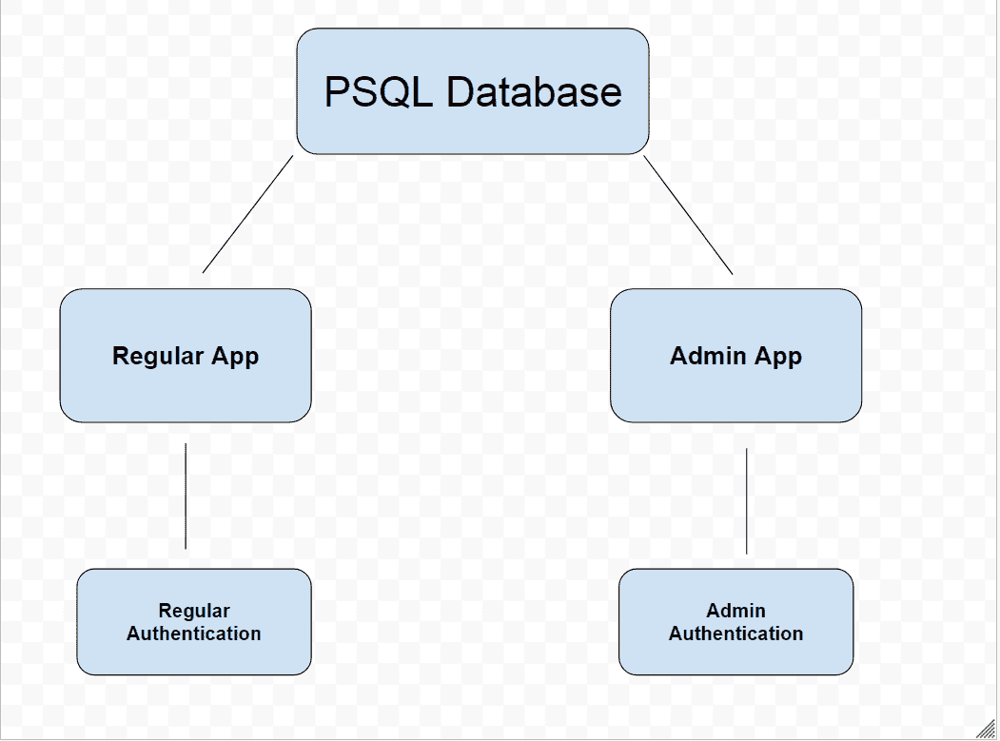**

**因此，管理应用程序将是自己的应用程序，有自己的认证，但连接到我们的常规应用程序相同的数据库。**

### **管理应用程序验证**

**管理应用程序的身份验证将与我们的常规应用程序略有不同。主要的区别是，将有**没有注册选项**的管理应用程序，管理员将不得不手动添加。因为我们不希望随机的人注册我们的管理应用程序。**

**和正规 app 类似，我会用 Auth0 进行认证。**

**首先，我们将从管理控制面板开始。**

**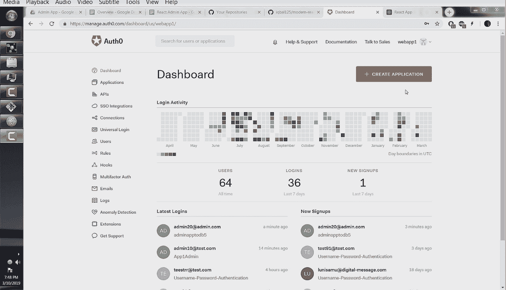**

**接下来点击**创建应用**按钮。**

**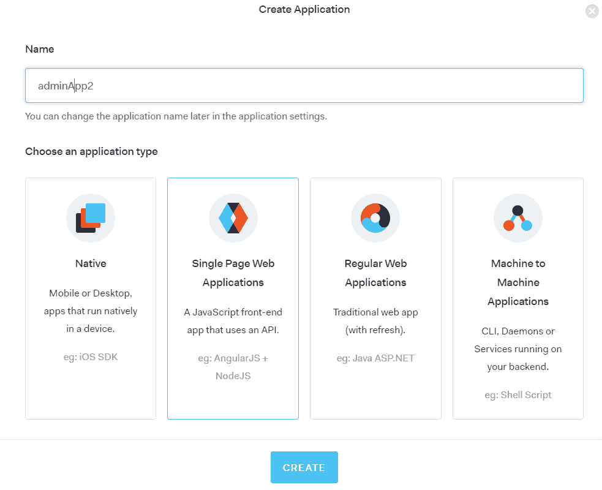**

**接下来，我们必须创建一个数据库连接。转到**连接**部分，点击**创建数据库连接**。**

**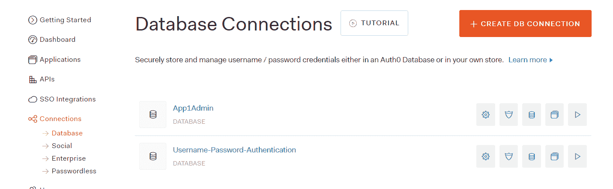**

**我们将把我们的新连接称为“adminapp2db”。
*** *重要提示:**勾选标有“禁用注册”的滑动按钮。我们不希望随机的人注册我们的管理应用程序。**

**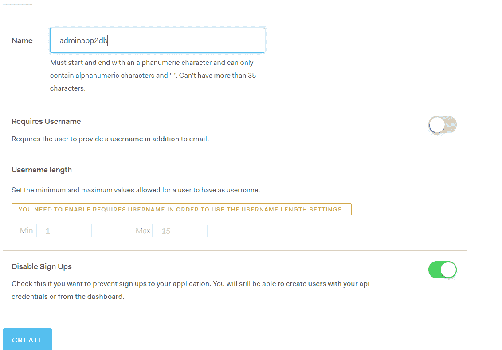**

**点击**创建**并转到**应用**选项卡。单击我们在上一步中创建的 **adminapp2** 的滑块按钮。**

**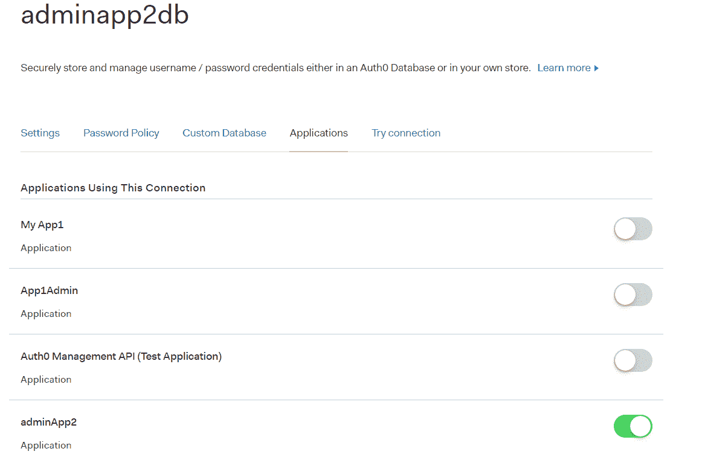**

**接下来，我们希望手动添加用户，以便能够登录到我们的管理应用程序。转到**用户**部分，点击**创建用户**。**

**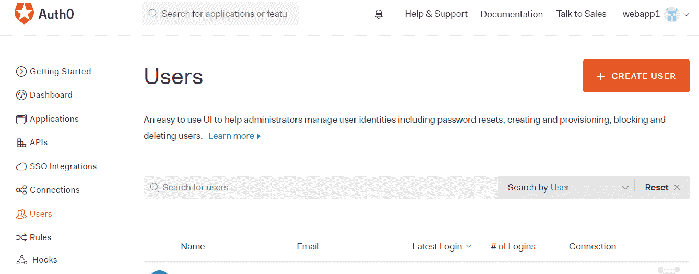**

**将电子邮件和密码字段填写为您想要的登录信息，并将**连接**设置为我们在上一步中创建的 **adminapp2db** 连接。然后点击**保存。****

****

 **就这样。我们现在可以测试我们的登录是否正常。返回到**连接**部分并点击 **adminapp2db** 连接。点击**试连接**选项卡。在**创建用户**步骤中输入您的登录信息。您也不应该看到注册选项卡。**

**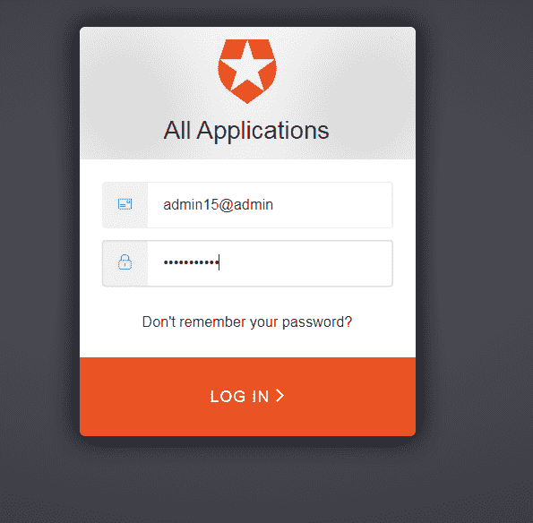**

 **如果成功，您应该会看到:**

**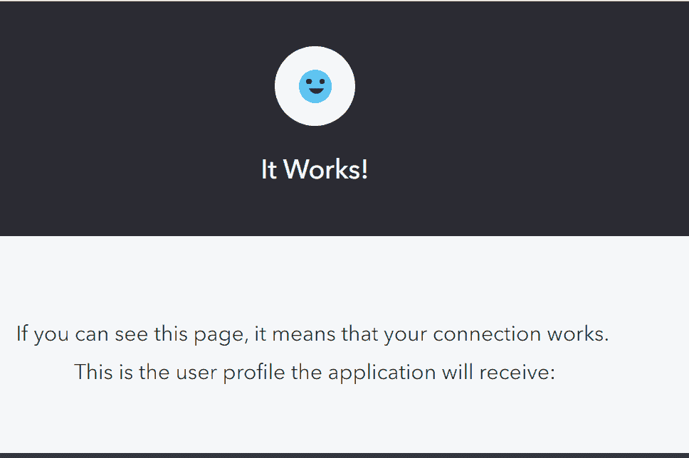**

**这意味着我们的身份验证已经设置好，只有我们手动添加的管理员才能登录。太好了！**

### **全局编辑和删除权限**

**管理应用程序的主要功能之一将是拥有全局编辑删除权限，这将允许管理员或版主对用户的帖子和评论进行编辑或删除垃圾邮件。这是我们将在这里建造的。**

****我们将如何做的基本想法是移除编辑和删除帖子和评论的认证检查，**但同时确保帖子和评论仍然属于其原始作者。**

**我们不必从零开始，我们可以使用我们在前面几节已经建立的相同的应用程序，并添加一些管理特定的代码。**

**我们可以做的第一件事是去掉我们的`addpost.js`和`showpost.js`组件中的“注册添加帖子/评论”按钮，因为管理员不能自己注册这个应用程序。**

**接下来，在`handleSubmit()`函数的`editpost.js`组件中，我们可以用之前见过的**反应路由器道具**来访问`user_id`和`username`。**

**这将确保即使我们作为管理员编辑帖子，它仍然属于原始用户。**

```
`const handleSubmit = (event) => {
    event.preventDefault()

    const user_id = props.location.state.post.post.user_id
    const username = props.location.state.post.post.author
    const pid = props.location.state.post.post.pid
    const title = event.target.title.value
    const body = event.target.body.value

    const data = {title: title,
                  body: body,
                  pid: pid,
                  uid: user_id,
                  username: username
                 }
    axios.put("/api/put/post", data)
      .then(res => console.log(res))
      .catch(err => console.log(err))
      .then(setTimeout(() => history.replace('/'), 700 ))
  }`
```

**`addpost.js`组件可以保持原样，因为管理员应该能够正常发布帖子。**

**回到我们的`posts.js`组件，我们可以将**编辑**和**删除**按钮添加到我们的`<RenderPosts />`功能中。**

```
`....

const RenderPosts = post => (
  <div >
  <Card >
 ...   
    <button>
      <Link to={{pathname:"/editpost/" + post.post.pid, state:{post} }}>
        Edit
      </Link>
    </button>
    <button onClick={() => deletePost(post.post.pid)}>
      Delete
    </button>
  </Card>
  </div>
)

....`
```

**该功能仅在我们常规应用程序的用户仪表板上可用，但我们可以直接在管理应用程序的主论坛中实现，这给了我们对所有帖子的全局编辑和删除权限。**

**其余的`posts.js`组件可以保持原样。**

**现在，在我们的`showpost.js`组件中，我们可以做的第一件事是删除当前用户 id 与允许编辑的评论用户 id 的比较。**

```
`....    
	// props.cur_user_id === props.comment.user_id
    const RenderComments = (props) => {
      return(
      <div className={stateLocal.delete_comment_id === props.comment.cid
                        ? "FadeOutComment"
                        : "CommentStyles"}>
        <div>
        {true
          ? !props.isEditing
            ?  <div>
  ....`
```

**接下来在`handleUpdate()`函数中，我们可以将用户名和用户 id 设置为评论的原作者。**

```
`....

    const handleUpdate = (event, cid, commentprops) => {
      event.preventDefault()

       ....
      const user_id = commentprops.userid
      const username = commentprops.author

  ....`
```

**我们的服务器和数据库可以保持原样。**

**就是这个！我们已经实现了我们的应用程序的全局编辑和删除功能。**

### **管理仪表板**

**管理应用程序中另一个非常常见的功能是拥有一个带有约会时间和日期的日历，这是我们在这里必须实现的。**

**我们将从**服务器**和 **SQL** 开始。**

```
 `CREATE TABLE appointments (
  aid SERIAL PRIMARY KEY,
  title VARCHAR(10),
  start_time TIMESTAMP WITH TIME ZONE UNIQUE,
  end_time TIMESTAMP WITH TIME ZONE UNIQUE
);`
```

**我们这里有一个简单的设置。我们有`PRIMARY KEY`。然后是约会的标题。在那之后我们有`start_time`和`end_time`。`TIMESTAMP WITH TIME ZONE`给出了日期和时间，我们使用`UNIQUE`关键字来确保不会有重复的约会。**

```
`/*
      DATE APPOINTMENTS
*/

router.post('/api/post/appointment', (req, res, next) => {
  const values = [req.body.title, req.body.start_time, req.body.end_time]
  pool.query('INSERT INTO appointments(title, start_time, end_time)
             VALUES($1, $2, $3 )', 
    	values, (q_err, q_res) => {
    		if (q_err) return next(q_err);
    		console.log(q_res)
    		res.json(q_res.rows);
  });
});

router.get('/api/get/allappointments', (req, res, next) => {
  pool.query("SELECT * FROM appointments", (q_err, q_res) => {
    res.json(q_res.rows)
  });
});`
```

**这里有我们的**路线**和**预约查询**。为了简洁起见，我省略了编辑和删除路径，因为我们以前已经多次看到过这些查询。挑战你自己，看看你是否能创建这些查询。这些是基本的`INSERT`和`SELECT`语句，在这里没什么不寻常的。**

**我们现在可以去我们的**客户端。****

**在写这篇文章的时候，我没有找到一个好的日历库可以在 React Hooks 组件中工作，所以我决定用`react-big-calendar`库实现一个类组件。**

**这仍然很容易理解，我们不会使用 Redux 或任何复杂的类功能，这些功能不能用于反应钩子。**

**`componentDidMount()`相当于`useEffect(() => {}, [] )`。其余的语法基本上是相同的，只是在访问属性值时在开头添加了`this`关键字。**

**我将在这里用管理仪表板替换常规的`profile.js`组件，我们可以这样设置它。**

```
`//profile.js

import React, { Component } from 'react'

import { Calendar, momentLocalizer, Views } from 'react-big-calendar';
import moment from 'moment';
import 'react-big-calendar/lib/css/react-big-calendar.css';

import history from '../utils/history';

import Button from '@material-ui/core/Button';
import Paper from '@material-ui/core/Paper';
import Dialog from '@material-ui/core/Dialog';
import DialogActions from '@material-ui/core/DialogActions';
import DialogContent from '@material-ui/core/DialogContent';
import DialogContentText from '@material-ui/core/DialogContentText';
import DialogTitle from '@material-ui/core/DialogTitle';

import axios from 'axios';

const localizer = momentLocalizer(moment)

const bus_open_time = new Date('07/17/2018 9:00 am')
const bus_close_time = new Date('07/17/2018 5:00 pm')

let allViews = Object.keys(Views).map(k => Views[k])

class Profile extends Component {
  constructor(props) {
  super(props)
    this.state = {
      events: [],
      format_events: [],
      open: false,
      start_display: null,
      start_slot: null,
      end_slot: null
     }
  }

  componentDidMount() {
    axios.get('api/get/allappointments')
    .then((res) => this.setState({events: res.data}))
    .catch(err => console.log(err))
    .then(() => this.dateStringtoObject())
   }

   handleClickOpen = () => {
      this.setState({ open: true });
    };

    handleClose = () => {
      this.setState({ open: false });
    };

 dateStringtoObject = () => {
    this.state.events.map(appointment => {
      this.setState({
        format_events: [...this.state.format_events,
          { id: appointment.aid,
            title: appointment.title,
            start: new Date(appointment.start_time),
            end: new Date(appointment.end_time)
       }]})
     })
   }

   handleAppointmentConfirm = () => {
     const time_start = this.state.start_slot
     const time_end = this.state.end_slot
     const data = {title: 'booked', start_time: time_start, end_time: time_end }
     axios.post('api/post/appointment', data)
       .then(response => console.log(response))
       .catch(function (error) {
         console.log(error);
       })
       .then(setTimeout( function() { history.replace('/') }, 700))
       .then(alert('Booking Confirmed'))
    }

    showTodos = (props) => (
      <div className="FlexRow">
        <p> { props.appointment.start.toLocaleString() }</p>
      </div>
    )

   BigCalendar = () => (
     <div style={{height: '500px'}} >
       <Calendar
         selectable
         localizer={localizer}
         events={this.state.format_events}
         min={bus_open_time}
         max={bus_close_time}
         views={allViews}
         defaultDate={new Date('07/12/2018')}
         onSelectEvent={event => alert(event.start)}
         onSelectSlot={slotInfo =>
           {
             this.setState({start_slot: slotInfo.start,
                            end_slot: slotInfo.end,
                            start_display: slotInfo.start.toLocaleString()
              });
             this.handleClickOpen();
          }}
       />
     </div>
   )

 render() {
    return (
    <div className="FlexRow">
      <div className="FlexColumn">
        <div className="FlexRow">
         <h1> Admin Dashboard </h1>
        </div>

        <h4>Appointments: </h4>
          <div className="FlexRow">
           <Paper>
            <div className="FlexDashAppointCol">
            { this.state.format_events ?
              this.state.format_events.map(appointment =>
                <this.showTodos key={appointment.id} appointment={appointment} />)
             : null
            }
            </div>
         </Paper>
        </div>
        <br />
        <br />
        <div className="FlexRow">
        { this.state.format_events ?
          <this.BigCalendar />
         : null
        }
        </div>
        <hr />
      </div>

      <Dialog
          open={this.state.open}
          onClose={this.handleClose}
          aria-labelledby="alert-dialog-title"
          aria-describedby="alert-dialog-description"
        >
          <DialogTitle id="alert-dialog-title"> Confirm Appointment? </DialogTitle>
          <DialogContent>
            <DialogContentText id="alert-dialog-description">
              Confirm Appointment:  {this.state.start_display}
            </DialogContentText>
          </DialogContent>
          <DialogActions>
            <Button color="primary" onClick={() => this.handleAppointmentConfirm() }>
            Confirm
            </Button>
            <Button color="primary" onClick={() => this.handleClose() }>
              Cancel
            </Button>
          </DialogActions>
        </Dialog>
    </div>
    )}
}

export default (Profile);` 
```

**我们将从通常的进口开始。然后我们将使用`moment.js`库初始化日历本地化程序。**

**接下来，我们将在`bus_open_time`和`bus_close_time`变量中设置营业开始和结束时间，我已经在上午 9:00 到下午 5:00 设置了该时间。**

**然后我们设置`allViews`变量，这将允许日历拥有月、周和日视图。**

**接下来，我们在构造函数中有一个本地变量`state`，它相当于`useState`钩子。**

**出于我们的目的，没有必要理解`constructors`和`super()`方法，因为它们是相当大的主题。**

**接下来我们有我们的`componentDidMount()`方法，我们用它向我们的服务器发出一个`axios`请求来获取我们的约会，并将它们保存到本地**州**的`events`属性中。**

**`handleClickOpen()`和`handleClose()`是助手函数，当用户确认约会时，它们打开和关闭我们的对话框。**

**接下来我们有`dateStringToObject()`函数，它从我们的请求中提取原始数据，并将其转换成日历可用的格式。`format_events`是保存格式化事件的状态属性。**

**之后我们有了`handleAppointmentConfirm()`函数。我们将使用这个函数向服务器发出 API 请求。这些值我们将从我们的`<Calendar />`组件中得到，我们马上就会看到。**

**我们的`<showTodos />`是我们显示每个约会的方式。**

**接下来我们有了真正的日历。大多数道具应该是不言自明的，但是我们可以关注的两个是`onSelectEvent`和`onSelectSlot`。**

**`onSelectEvent`是一个函数，每当用户点击日历上现有的事件时都会被调用，我们只是提醒他们事件的开始时间。**

**`onSelectSlot`是一个函数，每当用户点击日历上的一个空位置时，这个函数就会被调用，这就是我们从日历中获取时间值的方法。当用户点击一个槽位**时，我们将包含在 slotInfo 参数中的时间值保存到我们的本地状态**，然后我们打开一个对话框来确认预约。**

**我们渲染方法是相当标准的。我们在一个`<Paper />`元素中显示我们的事件，下面是日历。我们还有一个标准对话框，允许用户确认或取消请求。**

**这就是管理仪表板。您应该会看到如下所示的内容:**

**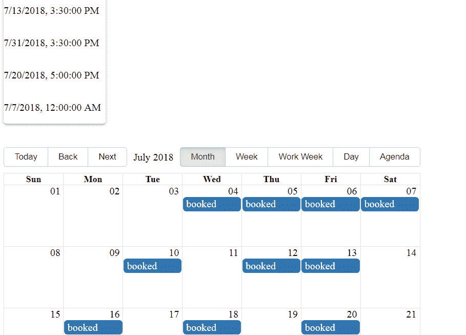**

### **删除用户及其帖子和评论**

**现在，在本教程的最后一部分，我们可以删除用户及其相关评论和帖子。**

**我们将从我们的 API 请求开始。我们这里有相当简单的`DELETE`语句，我将用前端代码解释更多。**

```
 `/*
    Users Section
*/

router.get('/api/get/allusers', (req, res, next) => {
  pool.query("SELECT * FROM users", (q_err, q_res) => {
    res.json(q_res.rows)
  });
});

/*
 Delete Users and all Accompanying Posts and Comments
*/

router.delete('/api/delete/usercomments', (req, res, next) => {
  uid = req.body.uid

  pool.query('DELETE FROM comments 
             WHERE user_id = $1', [ uid ], (q_err, q_res) => {
    res.json(q_res);
  });
});

router.get('/api/get/user_postids', (req, res, next) => {
  const user_id = req.query.uid

  pool.query("SELECT pid FROM posts 
             WHERE user_id = $1", [ user_id ], (q_err, q_res) => {
    res.json(q_res.rows)
  });
});

router.delete('/api/delete/userpostcomments', (req, res, next) => {
  post_id = req.body.post_id

  pool.query('DELETE FROM comments 
             WHERE post_id = $1', [ post_id ], (q_err, q_res) => {
    res.json(q_res);
  });
});

router.delete('/api/delete/userposts', (req, res, next) => {
  uid = req.body.uid
  pool.query('DELETE FROM posts
             WHERE user_id = $1', [ uid ], (q_err, q_res) => {
    res.json(q_res);
  });
});

router.delete('/api/delete/user', (req, res, next) => {
  uid = req.body.uid
  console.log(uid)
  pool.query('DELETE FROM users 
             WHERE uid = $1', [ uid ], (q_err, q_res) => {
    res.json(q_res);
    console.log(q_err)
  });
});

module.exports = router`
```

**现在对于我们的组件，你会注意到我们在`handleDeleteUser()`函数中使用了所有的 API 请求。**

```
`import React, { useState, useEffect } from 'react'

import axios from 'axios';
import history from '../utils/history';

import Button from '@material-ui/core/Button';
import Table from '@material-ui/core/Table';
import TableBody from '@material-ui/core/TableBody';
import TableCell from '@material-ui/core/TableCell';
import TableHead from '@material-ui/core/TableHead';
import TableRow from '@material-ui/core/TableRow';
import Paper from '@material-ui/core/Paper';

import Dialog from '@material-ui/core/Dialog';
import DialogActions from '@material-ui/core/DialogActions';
import DialogContent from '@material-ui/core/DialogContent';
import DialogContentText from '@material-ui/core/DialogContentText';
import DialogTitle from '@material-ui/core/DialogTitle';

const Users = () => {
  const [state, setState] = useState({ users: [],
                                       open: false,
                                       uid: null
                                     })

  useEffect(() => {
    axios.get('api/get/allusers')
      .then(res => setState({users: res.data}))
      .catch(err => console.log(err))
  }, [])

  const handleClickOpen = (user_id) => {
      setState({ open: true, uid: user_id });
    };

  const handleClose = () => {
      setState({ open: false });
    };

  const handleDeleteUser = () => {
      const user_id = state.uid
      axios.delete('api/delete/usercomments',
      					{ data: { uid: user_id }})
        .then(() => axios.get('api/get/user_postids',
        					{ params: { uid: user_id }})
          .then(res => res.data.map(post => 
          		axios.delete('/api/delete/userpostcomments', 
          				{ data: { post_id: post.pid }})) )
        )
        .then(() => axios.delete('api/delete/userposts',
        					{ data: { uid: user_id }})
          .then(() => axios.delete('api/delete/user',
          							{ data: { uid: user_id }} )
      ))
        .catch(err => console.log(err) )
        .then(setTimeout(history.replace('/'), 700))
    }

  const RenderUsers = (user) => (
    <TableRow>
      <TableCell>
      <br/>
      <p> { user.user.username } </p>
      <p> { user.user.email } </p>
      <br />
      <button onClick={() => handleClickOpen(user.user.uid)}>
        Delete User
      </button>
      </TableCell>
    </TableRow>
  );

    return (
    <div>
      <h1>Users</h1>
      <div className="FlexRow">
      <Paper>
      <div className="FlexUsersTable">
      <Table>
        <TableHead>
          <TableRow>
            <TableCell> User</TableCell>
          </TableRow>
        </TableHead>
        <TableBody>
             {state.users ?
                state.users.map(user =>
                  <RenderUsers key={ user.uid } user={user} />)
             : null
             }
          </TableBody>
        </Table>
      </div>
    </Paper>
    </div>

    <Dialog
        open={state.open}
        onClose={handleClose}
        aria-labelledby="alert-dialog-title"
        aria-describedby="alert-dialog-description"
      >
        <DialogTitle id="alert-dialog-title"> Delete User </DialogTitle>
        <DialogContent>
          <DialogContentText id="alert-dialog-description">
          Deleteing User will delete all posts and comments made by user
          </DialogContentText>
        </DialogContent>
        <DialogActions>
          <Button onClick={() => {handleDeleteUser(); handleClose()} }>
            Delete
          </Button>
          <Button onClick={handleClose} color="primary">
            Cancel
          </Button>
        </DialogActions>
      </Dialog>
     </div>
    )
}

export default (Users);` 
```

****handleDeleteUser()**
我将从`handleDeleteUser()`函数开始。我们做的第一件事是定义我们想要删除的用户的**用户 id** ，它是从本地状态获取的。当管理员点击一个用户名并弹出对话框时，用户 id 被保存到本地状态。**

**这种设置的合理性是因为 **PSQL 的外键约束**，在这里，我们不能在删除另一个表引用的表上的一行之前，先删除该行。请参见 **PSQL 外键约束**部分复习。**

**这就是为什么我们必须反向操作，删除所有与用户相关的评论和帖子，然后才能删除实际的用户。**

**第一个 axios 删除请求就是删除所有存在我们刚刚定义的匹配用户 id 的评论。我们这样做是因为在删除帖子本身之前，我们不能删除与帖子相关的评论。**

**在我们的**第一个** `.then()` **语句**中，我们查找该用户发表的所有帖子，并检索这些**帖子 id**。你会注意到我们的第二个`.then()`语句实际上是在第一个`.then()`语句里面的*。这是因为我们想要的是`axios.get('api/get/user_postids')`请求的响应，而不是**第一个 axios 删除请求**的响应。***

****在我们的第二个`.then()`** **语句**中，我们正在获取与我们想要删除的用户相关联的帖子的帖子 id 的数组，然后在该数组上调用`.map()`。然后，我们将删除与该帖子相关的所有评论，不管是哪个用户发表的。这将使`axios.delete('/api/delete/userpostcomments')` **成为三重嵌套的 axios 请求**！**

**我们的**第三** `**.then()**` **语句**正在删除用户实际发表的帖子。**

**我们的第四条**第四条**T0**语句**最终将用户从数据库中删除。然后，我们的第五个**`.then()`将管理员重定向到主页。我们的**第四条`.then()`语句**在我们的**第三条**第三条`.then()`第十五条语句内，原因与我们的**第二条** **`.then()`** **语句**在我们的**第一条**语句内一样。**** 

****其他的都是我们之前见过几次的功能，这将结束我们的教程！****

****感谢阅读！****