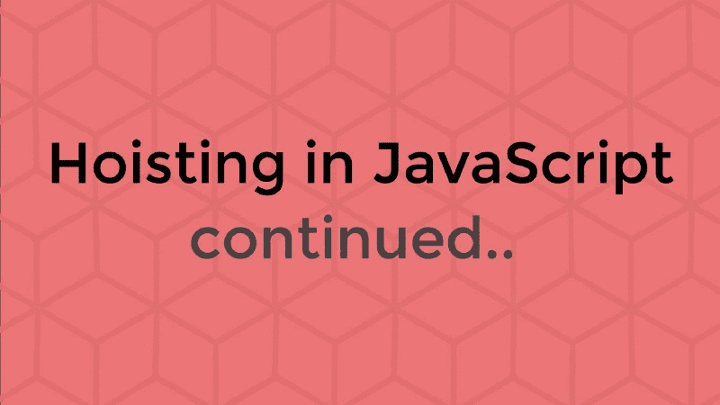

# 功能提升&提升面试问题

> 原文：<https://www.freecodecamp.org/news/function-hoisting-hoisting-interview-questions-b6f91dbc2be8/>

布万·马利克

# 功能提升&提升面试问题



这是我上一篇关于提升的文章的第 2 部分，标题是“[JavaScript 变量提升指南？用 let 和 const"](https://medium.freecodecamp.org/what-is-variable-hoisting-differentiating-between-var-let-and-const-in-es6-f1a70bb43d) 。所以，在开始阅读这篇文章之前，请务必先阅读这篇文章。

之前我谈到变量提升只是因为 JavaScript 中的函数提升和变量提升不一样，它有自己独特的方式。在这一篇中，我将详述函数提升，以及一些关于提升(变量和函数)的常见和棘手的面试问题，这些问题是任何接受 JavaScript 面试的人几乎肯定会遇到的。

希望在完成这两个部分之后，你就可以从你的 JavaScript 准备清单中划掉提升了！

我们开始吧。

### 功能提升

JavaScript 中创建函数有两种方式，通过**函数声明**和通过**函数表达式**。让我们看看这些是什么，以及吊装如何影响它们。

#### 函数声明

**函数声明**用指定的参数定义了一个函数。
语法:

```
function name(param1, param2, ...) {  [statements]}
```

在 JavaScript 中，函数声明提升了函数定义。

所以这些函数在声明之前可以**用**。
举例:

```
hoisted() // output: "Hoisted"
```

```
function hoisted() {  console.log('Hoisted')}
```

在幕后，JavaScript 解释器是这样看上面的代码的:

```
// Hoisted codefunction hoisted() {  console.log('Hoisted')}
```

```
// Rest of the codehoisted() // output: "Hoisted"
```

如果在全局作用域或函数作用域(在 JavaScript 中基本上是局部作用域)中有函数声明，这种行为是真实的。

这可能是有帮助的，因为您可以在代码的开头使用您的高级逻辑，使它更具可读性和可理解性。

**注意:**不要在 if/else 块中使用函数声明。

#### 函数表达式

关键字`**function**`也可以用来定义表达式中的函数。
语法:

```
const myFunction = function [name](param1, param2, ...) {  [statements]}
```

`[name]`是可选的，因此这些可以是匿名函数。我们也可以像这样使用箭头函数:

```
const myFunction = (param1, param2, ...) => {  [statements]}
```

JavaScript 中的函数表达式是不吊的。

因此，在定义函数表达式之前，不能使用它们。
举例:

```
notHoisted() // TypeError: notHoisted is not a function
```

```
const notHoisted = function() {  console.log('foo')}
```

从吊装的角度来看，这是创建功能时需要记住的全部内容。现在来回答一些面试问题！

### 提升面试问题

吊装及其反常行为是采访中的热门话题。利用我的[上一篇文章](https://medium.freecodecamp.org/what-is-variable-hoisting-differentiating-between-var-let-and-const-in-es6-f1a70bb43d)和这篇文章中的知识，人们可以解决这个话题上的任何问题。说了这么多，我们来看看一些常见的问题。

#### 问题 1

```
var a = 1;
```

```
function b() {  a = 10;  return;
```

```
 function a() {}}
```

```
b();
```

```
console.log(a);
```

**输出:1，**什么那个？！？

这是因为`function a() {}`语句现在已经创建了一个具有函数/局部范围的局部`a`。这个新的`a`现在随着它的声明和定义被提升到它的封闭函数`b()`的顶部。这是幕后发生的事情:

```
var a = 1;
```

```
function b() {  // Hoisted  function a() {}
```

```
 a = 10;  return;}
```

```
b();
```

```
console.log(a)
```

因此，语句`a = 10;`不再改变保持为 1 的全局`a`的值，而是将局部`a`从一个函数改变为整数值 10。因为我们正在记录全局`a`，所以输出是 1。

如果没有语句`function a() {}`,输出应该是 10。

#### 问题 2

```
function foo(){    function bar() {        return 3;    }    return bar();    function bar() {        return 8;    }}alert(foo());
```

**输出:8 个**

两个`bar()`函数都是函数声明，因此将被提升到`foo()`局部作用域的顶部。然而，`bar()`返回 8 将在返回 3 之后被吊起。因此，返回 8 的那个将被执行。

幕后:

```
function foo(){    //Hoisted before    function bar() {        return 3;    }    // Hoisted after    function bar() {        return 8;    }
```

```
 return bar();    }alert(foo());
```

#### 问题 3

```
function parent() {    var hoisted = "I'm a variable";    function hoisted() {        return "I'm a function";    }    return hoisted(); }console.log(parent());
```

**输出:“类型错误:提升不是一个函数”**

这个很棘手。它的函数 vs .变量！我们来分解一下。

我们知道在变量提升的时候，只提升声明(值为“undefined”)而不是定义！

在函数声明的情况下，定义也被提升！

现在，在这种使用相同标识符的多个声明(相同作用域中的变量和函数)的情况下，变量的提升就简单地被**忽略**。解释器遇到了函数声明并把它举起来。
最后执行变量赋值的语句(没有被吊起)将“我是变量”赋给`hoisted`，它是一个简单的字符串值，不是函数。因此出现了错误！

下面是这个问题的幕后情况:

```
function parent() {
```

```
 // Function declaration hoisted with the definition    function hoisted() {        return "I'm a function";    }
```

```
 // Declaration ignored, assignment of a string    hoisted = "I'm a variable"; 
```

```
 return hoisted(); 
```

```
}console.log(parent());
```

#### 问题 4

```
alert(foo());function foo() {  var bar = function() {    return 3;  };  return bar();  var bar = function() {    return 8;  };}
```

**输出:3 个**

这个很简单。函数`foo()`本身将作为它的一个函数声明被提升到全局范围。至于内部的`foo()`，这是两个`bar()`函数的函数表达式的清晰例子。

第二个`bar()`不会被解释器提前读取(无提升)。第一个将被执行并返回。

#### 问题 5

```
var myVar = 'foo';
```

```
(function() {  console.log('Original value was: ' + myVar);  var myVar = 'bar';  console.log('New value is: ' + myVar);})();
```

**输出:“原始值为:未定义”、“新值为:bar”**

在这个例子中，`myVar` `(‘foo’)`的全局值也不在画面中。这是因为变量`myVar`是在局部函数范围内声明和定义的，因此被提升到[生命](https://developer.mozilla.org/en-US/docs/Glossary/IIFE)的顶部，其值为“未定义”，首先被记录。值“bar”随后被分配和记录。

我这边的 JavaScript 提升到此结束。？

希望这两篇文章对你有所帮助。

如果你想学习箭头函数和其他与函数相关的 ES6 功能，请查看下面的文章。

[**JavaScript ES6 函数:好的部分**](https://medium.freecodecamp.org/es6-functions-9f61c72b1e86)
[*ES6 提供了一些很酷的新功能特性，使 JavaScript 编程更加灵活。让我们来谈谈…*medium.freecodecamp.org](https://medium.freecodecamp.org/es6-functions-9f61c72b1e86)

和平✌️