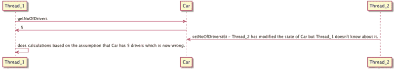
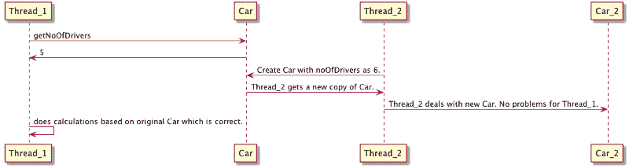
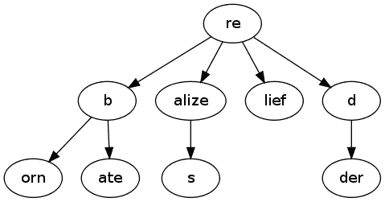

# 面向 Android 开发人员的函数式编程—第 2 部分

> 原文：<https://www.freecodecamp.org/news/functional-programming-for-android-developers-part-2-5c0834669d1a/>

作者:阿努普·考库尔

# 面向 Android 开发人员的函数式编程—第 2 部分


在上一篇文章中，我们学习了*纯度*、*副作用*和*排序。*在这一部分，我们来谈谈*不变性*和*并发性*。

如果您尚未阅读第 1 部分，请在此阅读:

[**面向 Android 开发者的函数式编程——第一部分**](https://medium.com/@anupcowkur/functional-programming-for-android-developers-part-1-a58d40d6e742)
[*最近，我花了很多时间学习 Elixir——一种非常棒的友好的函数式编程语言……*medium.com](https://medium.com/@anupcowkur/functional-programming-for-android-developers-part-1-a58d40d6e742)

### 不变

不变性是指价值一旦被创造就不能被修改。

比方说我有一辆*车*级*T3 这样:*

**Java**

```
public final class Car {    private String name;    public Car(final String name) {        this.name = name;    }    public void setName(final String name) {        this.name = name;    }    public String getName() {        return name;    }}
```

**锅炉**

```
class Car(var name: String?)
```

因为它在 Java 中有一个 setter，在 Kotlin 中是一个可变属性，所以我可以在构造完汽车后修改它的名称:

**Java**

```
Car car = new Car("BMW");car.setName("Audi");
```

**锅炉**

```
val car = Car("BMW")car.name = "Audi"
```

这个类是*不是*不可变的。创建后可以修改。

让它成为不可改变的。为了在 Java 中做到这一点，我们必须:

*   使名称变量*成为最终变量。*
*   拆下设定器。
*   使类*也成为 final* ，这样另一个类就不能扩展它和修改它的内部。

**Java**

```
public final class Car {    private final String name;    public Car(final String name) {        this.name = name;    }    public String getName() {        return name;    }}
```

在 Kotlin 中，我们只需要让名字成为一个不可变的值。

**锅炉**

```
class Car(val name: String)
```

现在，如果有人需要创建一辆新车，他们需要初始化一个新对象。一旦我们的车被制造出来，没有人能修改它。这个类现在是不可变的。

但是 Java 中的 *getName()* getter 或者 Kotlin 中的 *name* 访问器呢？它把我们的名字变量返回给外界，对吗？如果有人从这个 getter 获得对 *name* 值的引用后修改了它，会怎么样呢？

在 Java 中，[字符串默认是不可变的](http://stackoverflow.com/questions/1552301/immutability-of-strings-in-java)。即使有人引用了我们的*名称*字符串并对其进行了修改，他们也会得到一个*名称*字符串的副本，而原始字符串将保持不变。

但是那些不是不变的东西呢？或许是一份名单？我们来修改一下 *Car* 类，让它有一个开它的人的列表。

**Java**

```
public final class Car {    private final List<String> listOfDrivers;    public Car(final List<String> listOfDrivers) {        this.listOfDrivers = listOfDrivers;    }    public List<String> getListOfDrivers() {        return listOfDrivers;    }}
```

在这种情况下，有人可以使用 *getListOfDrivers()* 方法来获取对我们内部列表的引用并修改它，从而使我们的类*成为可变的*。

为了使它不可变，我们必须在 getter 中传递一个独立于我们的列表的深层列表副本，以便调用者可以安全地修改新列表。我们还必须对传递给我们的构造函数的列表进行深层复制，以便在汽车构造完成后，没有人能够从外部修改它。

深度复制意味着我们递归地复制所有相关数据。例如，如果列表是一个由*驱动*对象组成的列表，而不仅仅是简单的字符串，我们就必须复制每一个*驱动*对象。否则，我们将会创建一个新的列表，引用原始的*驱动*对象，这些对象可能会发生变异。在我们的类中，由于列表是由不可变的字符串组成的，我们可以像这样做一个深度复制:

**Java**

```
public final class Car {    private final List<String> listOfDrivers;    public Car(final List<String> listOfDrivers) {        this.listOfDrivers = deepCopy(listOfDrivers);    }    public List<String> getListOfDrivers() {        return deepCopy(listOfDrivers);    }    private List<String> deepCopy(List<String> oldList) {        List<String> newList = new ArrayList<>();        for (String driver : oldList) {            newList.add(driver);        }        return newList;    }}
```

现在这个类是真正不可变的。

在 Kotlin 中，我们可以简单地在我们的类定义中声明这个列表是不可变的，然后就可以安全地使用它了(除非你从 Java 或者其他类似的边缘环境中调用它)

**锅炉**

```
class Car(val listOfDrivers: List<String>)
```

### 并发

好吧，所以*不变性*很酷，但是为什么要麻烦呢？正如我们在第 1 部分中所讨论的，纯函数允许我们轻松地并发，如果一个对象是不可变的，那么在纯函数中使用它是非常容易的，因为你不能修改它并引起副作用。

让我们看一个例子。假设我们在 Java 中添加了一个 *getNoOfDrivers()* 方法到我们的 *Car* 类中，并且我们还通过允许外部调用者像这样修改 Drivers 变量的数量，使它在 Kotlin 和 Java 中都是*可变的*:

**Java**

```
public class Car {    private int noOfDrivers;    public Car(final int noOfDrivers) {        this.noOfDrivers = noOfDrivers;    }    public int getNoOfDrivers() {        return noOfDrivers;    }    public void setNoOfDrivers(final int noOfDrivers) {        this.noOfDrivers = noOfDrivers;    }}
```

**锅炉**

```
class Car(var noOfDrivers: Int)
```

假设我们跨两个线程共享这个 *Car* 类的一个实例: *Thread_1* 和 *Thread_2。Thread_1* 想要根据驱动程序的数量做一些计算，所以它在 Java 中调用 *getNoOfDrivers()* 或者在 Kotlin *中访问 *noOfDrivers* 属性。*同时 *Thread_2* 进来并修改*nooddrivers*变量。 *Thread_1* 不知道这一变化，并愉快地继续它的计算。这些计算将是错误的，因为世界的状态已经被修改，而 *Thread_2* 和 *Thread_1* 对此一无所知。

下面的序列图说明了这个问题:



这是一个经典的竞争条件，称为读-修改-写问题。解决这个问题的传统方法是使用[锁和互斥](https://en.wikipedia.org/wiki/Mutual_exclusion)，这样一次只有一个线程可以操作共享数据，一旦操作完成就释放锁(在我们的例子中， *Thread_1* 会锁定 *Car* ，直到它完成它的计算)。

众所周知，这种基于锁的资源管理很难安全地完成，并且会导致极难分析的并发错误。许多程序员因为死锁和活锁而失去了理智。

你说不变性如何解决这个问题？让我们让*车*再次成为不可改变的:

**Java**

```
public final class Car {    private final int noOfDrivers;    public Car(final int noOfDrivers) {        this.noOfDrivers = noOfDrivers;    }    public int getNoOfDrivers() {        return noOfDrivers;    }}
```

**锅炉**

```
class Car(val noOfDrivers: Int)
```

现在， *Thread_1* 可以无忧无虑地执行它的计算，因为它保证了 *Thread_2* 不能修改汽车对象。如果 *Thread_2* 想要修改 *Car，*那么它会创建自己的副本来这样做，而 *Thread_1* 将完全不受其影响。不需要锁。



不变性确保共享数据在默认情况下是线程安全的。不应该修改的东西**不能修改*。*

#### *如果我们需要全局可修改的状态呢？*

*为了编写真实世界的应用程序，我们在许多情况下需要共享的可修改状态。可能真的需要更新 noOfDrivers 并在整个系统中反映出来。当我们在下一章讨论*功能架构*时，我们将通过使用状态隔离和将副作用推到我们系统的边缘来处理这样的情况。*

### *持久数据结构*

*不可变对象可能很棒，但如果我们无限制地使用它们，它们将使垃圾收集器过载，并导致性能问题。函数式编程还为我们提供了专用的数据结构，以便在最小化对象创建的同时使用不变性。这些专门的数据结构被称为*持久数据结构。**

*持久数据结构在被修改时总是保留其自身的先前版本。这种数据结构实际上是不可变的，因为它们的操作不会(明显地)就地更新结构，而是总是产生新的更新结构。*

*假设我们有以下几个想要存储在内存中的字符串:**重生，返利，实现，实现，救济，红，更红。***

*我们可以将它们分别存储，但那样会占用更多的内存。如果我们仔细观察，我们会发现这些字符串有许多共同的字符，我们可以用这样的单个 [*trie*](https://en.wikipedia.org/wiki/Trie) 数据结构来表示它们(不是所有的尝试都是持久的，但尝试是我们可以用来实现持久数据结构的工具之一) :*

*

source: [http://merrigrove.blogspot.in/2010/05/dictionary-trie.html](http://merrigrove.blogspot.in/2010/05/dictionary-trie.html)* 

*这是持久数据结构如何工作的基本思想。当要添加一个新的字符串时，我们只需创建一个新的节点，并将它链接到适当的位置。如果使用这种结构的对象需要删除一个节点，我们只需停止从该对象中引用它，但实际的节点并没有从内存中删除，从而避免了副作用。这确保了引用该结构的其他对象可以继续使用它。*

*当没有其他对象引用它时，我们可以 GC 整个结构来回收内存。*

*Java 中的持久数据结构并不是一个激进的想法。Clojure 是一种运行在 JVM 上的函数式语言，拥有完整的标准持久数据结构库。你可以在 Android 代码中直接使用 Clojure 的标准库，但是它的大小和方法数量都很大。我发现一个更好的选择是一个叫做[收藏馆](https://pcollections.org/)的图书馆。它有 [427 个方法和 48Kb 的索引大小](http://www.methodscount.com/?lib=org.pcollections%3Apcollections%3A2.1.2)，这使得它非常适合我们的目的。*

*例如，下面是我们如何使用 PCollections 创建和使用持久链表:*

***Java***

```
*`ConsPStack<String> list = ConsPStack.empty();System.out.println(list);  // []ConsPStack<String> list2 = list.plus("hello");System.out.println(list);  // []System.out.println(list2); // [hello]ConsPStack<String> list3 = list2.plus("hi");System.out.println(list);  // []System.out.println(list2); // [hello]System.out.println(list3); // [hi, hello]ConsPStack<String> list4 = list3.minus("hello");System.out.println(list);  // []System.out.println(list2); // [hello]System.out.println(list3); // [hi, hello]System.out.println(list4); // [hi]`*
```

*正如我们所看到的，没有一个列表被就地修改，但是每次需要修改时都会返回一个新的副本。*

*PCollections 有一堆为各种用例实现的标准持久数据结构，值得探索。他们还可以很好地使用 Java 的标准集合库，这非常方便。*

*Kotlin 附带了一个标准库，其中已经有了不可变的集合，所以如果你正在使用 Kotlin，你就可以开始了。*

*持久数据结构是一个庞大的主题，本节只是触及了冰山的一角。如果你有兴趣了解更多，强烈推荐 Chris Okasaki 的纯函数式数据结构。*

### *摘要*

*不可变性和*纯度*是一个强有力的组合，允许我们编写安全的并发程序。在下一部分，我们将学习高阶函数和闭包。*

#### *阅读下一页*

*[**面向 Android 开发者的函数式编程—第三部分**](https://medium.com/@anupcowkur/functional-programming-for-android-developers-part-3-f9e521e96788)
[*在上一篇帖子中，我们学习了不变性和并发性。这一次，我们将看看高阶函数和……*medium.com](https://medium.com/@anupcowkur/functional-programming-for-android-developers-part-3-f9e521e96788)*

#### ***额外积分***

*我在印度机器人大会上做了一个关于不变性和并发性的演讲。尽情享受吧！*

**如果您喜欢，请点击？下面。我注意到了每一个人，我感谢他们中的每一个人。**

*如果你想了解更多关于编程的想法，请关注我，这样当我写新帖时你会得到通知。*