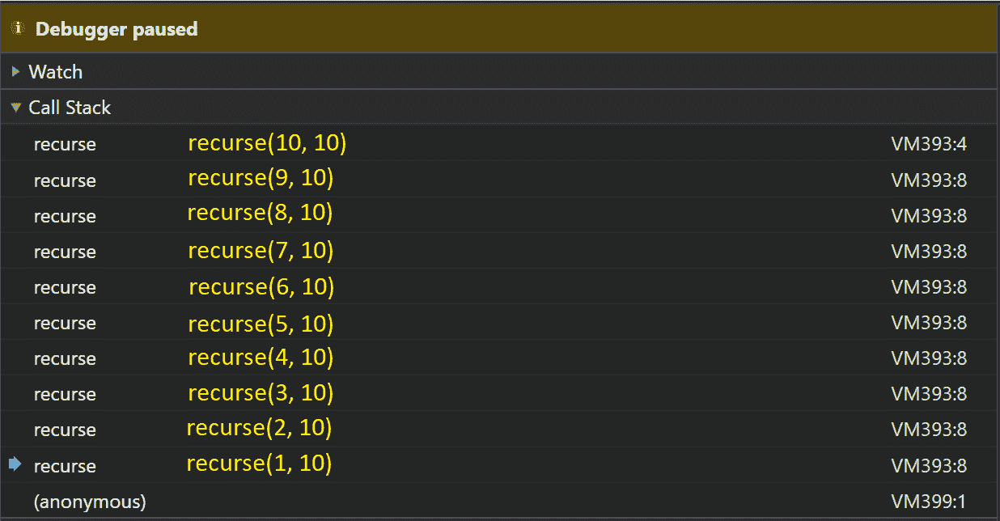

# 什么是函数式编程？初级 JavaScript 指南

> 原文：<https://www.freecodecamp.org/news/functional-programming-in-javascript/>

JavaScript 是一种多范式语言，可以按照不同的编程范式编写。编程范式本质上是您在编写代码时遵循的一系列规则。

这些范例的存在是因为它们解决了程序员面临的问题，并且它们有自己的规则和指令来帮助你编写更好的代码。

每个范例都帮助你解决一个特定的问题。因此，对它们中的每一个都有一个概述是很有帮助的。我们将在这里讨论函数式编程。

在本文的最后，如果您喜欢这篇介绍，您可以使用一些资源来更进一步。

还有一个 GitHub 词汇表，可以帮助你解读函数式编程使用的一些术语。

最后，您将找到一个地方，通过实际的例子和一个 GitHub repo，您可以用它来了解更多信息。所以让我们开始吧。

## 声明式与命令式编程范例

我在开始时谈到的这些范例的一个例子是面向对象编程。另一个是函数式编程。

那么到底什么是函数式编程呢？

函数式编程是**声明式编程**范式的一个子范式，在编写代码时有自己的规则可循。

### 什么是声明式编程范式？

如果你用一种遵循声明性范例的语言编码，你写的代码指定了你想要做什么，而没有说如何做。

一个非常简单的例子就是 SQL 或 HTML:

```
SELECT * FROM customers
```

```
<div></div>
```

在上面的代码示例中，您没有实现`SELECT`或者如何呈现`div`。你只是告诉电脑*做什么*，而没有告诉*如何做*。

从这个范例开始，还有子范例，比如**函数式编程。**更多详情请见下文。

### 什么是命令式编程范式？

如果你用一种遵循命令式/过程式范式的语言编码，你写的代码告诉**如何做某事。**

例如，如果你做了如下的事情:

```
for (let i = 0; i < arr.length; i++) {
     increment += arr[i];
}
```

你在告诉电脑该做什么。遍历名为`arr`的数组，然后`increment`数组中的每一项。

### 声明式编程与命令式编程

你可以用**声明性范式**或**命令性范式编写 JavaScript。**这就是人们说它是多范例语言的意思。只是功能代码遵循了**声明性范例**。

如果有助于记忆的话，陈述性命令的一个例子是让计算机给你沏杯茶(我不管你怎么沏的，给我沏杯茶就行)。

同时，你必须说:

*   去厨房。
*   如果房间里有一个水壶，并且它有足够的水沏一杯茶，打开水壶。
*   如果房间里有一个水壶，而它的水不够一杯茶喝，那就把水壶装满足够一杯茶喝的水，然后打开水壶。
*   *以此类推*

### 那么什么是函数式编程呢？

那么这对功能代码意味着什么呢？

因为它是声明性范例的一个子范例，这影响了你编写功能性代码的方式。这通常会减少代码，因为 JavaScript 已经有了很多您通常需要的内置函数。这是人们喜欢功能代码的一个原因。

它还允许你抽象出很多东西(你不需要深入理解事情是如何完成的)，你只需要调用一个函数来为你做这件事。

导致功能代码的规则是什么？

函数式编程可以简单地通过在代码中遵循以下两条法则来解释:

1.  **你用纯粹的、孤立的功能来设计你的软件**
2.  你避免了可变性和副作用

让我们深入研究一下。

## 1.从纯粹的、孤立的功能中构建你的软件

让我们从头开始，

功能代码大量使用了一些东西:

### 纯函数

相同的输入总是给出相同的输出(**幂等性**)，而且没有副作用。

一个**幂等函数**，当你再次将结果应用于该函数时，不会产生不同的结果。

```
/// Example of some Math.abs uses
Math.abs('-1');     // 1
Math.abs(-1);       // 1
Math.abs(null);     // 0

Math.abs(Math.abs(Math.abs('-1')));           // Still returns 1
Math.abs(Math.abs(Math.abs(Math.abs('-1')))); // Still returns 1
```

An example of an idempotent function.

副作用是当您的代码与外部可变状态交互(读取或写入)时。

外部可变状态实际上是函数之外会改变程序中数据的任何东西。设置功能？在对象上设置布尔值？删除对象的属性？函数之外的所有状态变化。

```
function setAvailability(){
	available = true;
}
```

An example of mutable state being set inside your functions.

### 隔离功能

它不依赖于程序的状态，包括可能发生变化的全局变量。

我们将进一步讨论这一点，但是您需要的任何东西都应该作为参数传递给函数。这使得您的依赖项(函数完成工作所需要的东西)看起来更清楚，也更容易发现。

好吧，那你为什么要这样做？

我知道这看起来有很多限制，让你的代码变得不必要的困难。但是它们不是限制，而是试图阻止你陷入通常会导致错误的模式的指导方针。

当你不改变你的代码执行时，根据`Boolean`的状态用`if`分叉你的代码，在你的代码中的多个地方设置，你使代码更可预测，更容易推理发生了什么。

当你遵循函数范式时，你会发现代码的执行顺序并不重要。

这有很多好处——例如，要复制一个 bug，你不需要在运行函数之前知道每个`Boolean`和`Object`的确切状态。只要你有一个调用栈(你知道什么函数正在运行/在你之前已经运行过),它就可以复制错误，并更容易地解决它们。

### 通过高阶函数实现可重用性

可以赋值给一个变量，传递给另一个函数，或者像任何其他正常值一样从另一个函数返回的函数，称为**一级函数**。

在 JavaScript 中，所有的函数都是一级函数。具有一级状态的函数允许我们创建**更高阶的函数**。

一个 ****高阶函数**** 是一个要么接受一个函数作为自变量，要么返回一个函数，或者两者兼有的函数！您可以使用高阶函数来停止在代码中重复自己。

大概是这样的:

```
// Here's a non-functional example
const ages = [12,32,32,53]
for (var i=0; i < ages.length; i++) {
    finalAge += ages[i];
}

// Here's a functional example
const ages = [12,32,32,53]
const totalAge = ages.reduce( function(firstAge, secondAge){
    return firstAge + secondAge;
}) 
```

内置的 JavaScript `Array`函数`.map`、`.reduce`和`.filter`都接受一个函数。它们是**高阶函数、**的优秀例子，因为它们迭代一个数组，并为数组中的每一项调用它们接收到的函数。

所以你可以做:

```
// Here's an example of each
const array = [1, 2, 3];

const mappedArray = array.map(function(element){
    return element + 1;
});
// mappedArray is [2, 3, 4]

const reduced = array.reduce(function(firstElement, secondElement){
	return firstElement + secondElement;
});
// reduced is 6

const filteredArray = array.filter(function(element){
    return element !== 1;
});
// filteredArray is [2, 3]
```

在中，将函数的结果传递给其他函数，甚至传递函数本身，这在函数代码中极为常见。我包含了这个简短的解释，因为它经常被使用。

这些函数也经常被使用，因为它们不改变底层函数(不改变状态)，而是对`array`的副本进行操作。

## 2.避免可变性和副作用

第二个规则是避免可变性——我们在前面讨论限制对外部可变状态的更改时简单地提到了这一点——以及副作用。

但这里我们将进一步展开。基本上归结到这一点:不要改变事物！一旦你做了，它就**不可变**(不随时间变化)。

```
var ages = [12,32,32,53]
ages[1] = 12;  // no!
ages = [];     // no!
ages.push("2") // no!
```

This code isn't written in the functional pattern.

如果您的数据结构需要更改，请对副本进行更改。

```
const ages = [12,32,32,53]
const newAges = ages.map(function (age){
    if (age == 12) { return 20; }
    else { return age; }
})
```

Much better!

你能看到我做了必要的修改后的副本吗？

这个元素被一遍又一遍地重复。不要改变状态！

如果我们遵循这条规则，我们会大量使用`const`这样我们就知道事情不会改变。但它必须走得更远。下面的怎么样？

```
const changingObject = {
    willChange: 10
}

changingObject.willChange = 10;  // no!
delete obj.willChange            // no! 
```

应该完全锁定`changingObject`的属性。`const`只会保护你免于初始化 over 变量。

```
const obj = Object.freeze({
    cantChange: 'Locked' }) // The `freeze` function enforces immutability.

obj.cantChange = 0      // Doesn't change the obj!
delete obj.cantChange   // Doesn't change the obj!
obj.addProp = "Gotcha!" // Doesn't change the obj!
```

Use persistent data structures

如果我们不能改变全局变量的状态，那么我们需要确保:

*   我们声明函数参数——函数内部的任何计算都只依赖于参数，而不依赖于任何全局对象或变量。
*   我们不改变变量或对象——创建新的变量和对象，并在需要时从函数中返回它们。

### 使您的代码在引用上透明

当你遵循永不改变状态的规则时，你的代码就变成了**透明的**。也就是说，您的函数调用可以替换为它们所表示的值，而不会影响结果。

作为检查您的代码是否**引用透明的简单示例，**请看下面的代码片段:

```
const greetAuthor = function(){
    return 'Hi Kealan'
}
```

您应该能够将该函数调用与它返回的`string`交换，并且没有任何问题。

如果你习惯于**面向对象**，那么使用引用透明表达式的函数式编程会让你开始以不同的方式思考你的代码。

但是为什么呢？

因为代码中不再有对象和可变状态，而是开始有纯函数，没有状态变化。您非常清楚地知道您期望您的函数返回什么(因为它从不改变，而通常它可能根据函数外部的状态返回不同的数据类型)。

它可以帮助你更好地理解流程，通过略读理解一个函数正在做什么，并且更加严格地对待每个函数的职责，以提出更好的解耦系统。

你可以在这里了解更多关于参考透明的信息[。](https://medium.com/@olxc/referential-transparency-93352c2dd713)

### 不要迭代

希望，如果你已经注意到了，你会看到我们没有改变状态。所以要明确的是`for`循环已经过时了:

```
for(let i = 0; i < arr.length; i++) {
    total += arr[i];
}
```

因为我们在改变一个变量的状态。使用`map`高阶函数。

## 函数式编程的更多特性

我希望在这一点上，你已经很好地了解了什么是功能代码，什么不是。但是有一些在函数式代码中大量使用的最终概念我们必须涵盖。

在我读过的所有函数式代码中，这些概念和工具用得最多，我们必须涵盖它们以获得我们的基础知识。

所以我们开始吧。

## 函数式程序设计中的递归

在 JavaScript 中可以从函数本身调用函数。

所以我们可以做的是:

```
function recurse(){
    recurse();
}
```

This might not be a great idea.

这个的问题是它没有用。它最终会运行，直到你的浏览器崩溃。但是递归的思想是一个函数从它的函数体调用它自己。让我们来看一个更有用的例子:

```
function recurse(start, end){
    if (start == end) {
        console.log(end)
        return;
    } else {
        console.log(start)
        return recurse(start+1, end)
    }
}

recurse(1, 10);
// 1, 2, 3, 4, 5, 6, 7, 8, 9, 10
```

这段代码片段将从`start`参数开始计数到`end`参数。它通过再次调用自己的函数来实现这一点。

所以它的顺序应该是这样的:



A call stack example for this recursive function.

如果对您没有意义，请在 if 块中添加一个调试器来跟踪它。递归是一种可以用来在函数式编程中迭代的工具。

第一个例子和第二个例子有什么不同？第二个是我们所说的**【基础案例】**。基本情况是让函数最终无限地停止调用自身。当`start`等于`end`时，我们可以停止递归。正如我们所知，我们已经计算到了循环的最末端。

但是函数的每次调用都是再次调用自己的函数，并添加函数参数。

我刚刚为计数示例包含的代码示例不是一个纯函数。这是为什么呢？

因为`console`是状态！我们将`string`记录到其中。

这是对递归的一个简单介绍，但是你可以到这里了解更多的内容。

### 为什么要用递归？

首先，递归允许我们停止改变状态变量。

当用递归求解时，也有一些数据结构(树结构)更有效。它们通常需要较少的代码，所以一些编码者喜欢递归的可读性。

## 函数式编程中的 Currying

Currying 是另一个在函数代码中大量使用的工具。函数的 **arity** 是指它接收多少个参数。

```
// Let's talk arity
function arity2(arg1, arg2){}             // Function has an arity of 2
function arity0(){}                       // Function has an arity of 0
function arity2(arg1, arg2, arg3, arg4){} // Function has an arity of 4
```

**curry**一个函数把一个 arity 大于 1 的函数变成 1。它通过返回一个内部函数来获取下一个参数。这里有一个例子:

```
function add(firstNum, secondNum){
	return firstNum + secondNum;
}

// Lets curry this function

function curryAdd(firstNum){
	return function(secondNum){
            return firstNum + secondNum;
    }
}
```

本质上，它重新构造了一个函数，使其接受一个参数，但它随后返回另一个函数来接受下一个参数，次数视需要而定。

### 为什么使用 currying？

currying 的最大好处是，当您需要多次重用同一个函数，但只更改一个(或更少)参数时。因此您可以保存第一个函数调用，如下所示:

```
function curryAdd(firstNum){
	return function(secondNum){
            return firstNum + secondNum;
    }
}

let add10 = curryAdd(10);
add10(2); // Returns 12

let add20 = curryAdd(20);
add20(2); // Returns 22
```

Currying 也可以让你的代码更容易重构。您不必更改传入错误函数参数的多个位置——只需更改将第一个函数调用绑定到错误参数的一个位置。

如果您不能一次为一个函数提供所有参数，这也很有帮助。当你有了所有的参数后，你可以返回第一个函数来调用内部函数。

## 函数式编程中的局部应用

类似地，部分应用意味着您一次将几个参数应用于一个函数，并返回应用于更多参数的另一个函数。下面是我从 MDN 文档中找到的最好的例子:

```
const module = {
  height: 42,
  getComputedHeight: function(height) {
    return this.height + height;
  }
};

const unboundGetComputedHeight = module.getComputedHeight;
console.log(unboundGetComputedHeight(32)); // The function gets invoked at the global scope
// outputs: NaN
// Outputs NaN as this.height is undefined (on scope of window) so does 
// undefined + 32 which returns NaN

const boundGetComputedHeight = unboundGetComputedHeight.bind(module);
console.log(boundGetComputedHeight(32));
// expected output: 74
```

`bind`是部分应用的最好例子。为什么？

因为我们返回一个分配给被调用的`boundGetComputedHeight`的内部函数，正确设置了`this`的作用域，并在稍后传入一个新的参数。我们没有一次分配所有的参数，而是返回一个函数来接受其余的参数。

### 为什么使用部分应用程序？

当您不能一次传递所有参数时，可以使用部分应用程序，但是可以从高阶函数返回`function` s 来处理其余的参数。

## 函数式编程中的函数组合

我认为功能代码的最后一个主题是**功能组合**。

**函数组合**允许我们获取两个或更多的函数，并将它们转换成一个函数，该函数执行两个(或更多)函数所执行的功能。

```
// If we have these two functions

function add10(num) {
	return num + 10;
}
function add100(num) {
    return num + 100;
}

// We can compose these two down to =>
function composed(num){
	return add10(add100(num));
}

composed(1) // Returns 111
```

如果您的用例需要，您可以进一步创建函数来将任意数量的多个 arity 函数组合在一起。

### 为什么要用函数合成？

组合允许你用可重用的函数来构建你的代码，以避免重复。您可以开始将函数视为可以组合在一起实现更复杂输出的小积木。

这些就变成了你程序中的“单位”或计算能力。它们是许多一般工作的小函数，全部组合成更大的函数来做“真正的”工作。

这是构建您的代码的一种强大的方式，并且使您不必创建复制和粘贴的巨大函数，它们之间只有微小的差异。

它还可以帮助您测试代码何时不是紧耦合的。并且它使你的代码更加可重用。您可以只更改函数的组成，或者在组成中添加更多小函数，而不是将所有代码复制并粘贴到整个代码库中(当您需要它做与另一个函数相似但不完全相同的事情时)。

下面的例子是为了帮助你理解，但是我希望你能看到**函数组合的威力。**

```
/// So here's an example where we have to copy and paste it
function add50(num) {
	return num + 50;
}

// Ok. Now we need to add 30\. But we still ALSO need elsewhere to add 50 still
// So we need a new function
function add30(num){
	return num + 30;
}

// Ugh, business change again
function add20(num){
	return num + 20;
}

// Everytime we need to change the function ever so slightly. We need a new function

//Let's use composition

// Our small, reusable pure function
function add10(num){
	return num + 10;
}

function add50Composed(num){
	return add10(add10(add10(add10(addNum(num)))));
}

function add30Composed(num){
	return add10(add10(add10(num)));
}

function add20Composed(num){
	return add10(add10(num));
}
```

你看到我们是如何把更小的纯函数组合成新函数的吗？

## 结论

这篇文章涵盖了很多内容。但是我希望它已经简单地解释了功能性代码，以及您将在功能性甚至非功能性代码中反复看到的一些重复模式。

功能代码不一定是最好的，面向对象的代码也不一定是最好的。函数式代码通常用于更基于数学的问题，如数据分析。它对于高可用性实时系统也非常有用，比如用 Erlang(一种函数式语言)编写的东西。但这确实取决于不同的问题。

我在推特上发布我的文章。如果你喜欢这篇文章，你可以在那里读到更多。

## 如何了解更多

从这里开始[，从 freeCodeCamp 的 JavaScript 函数式编程介绍开始。](https://www.freecodecamp.org/learn/javascript-algorithms-and-data-structures/functional-programming/learn-about-functional-programming)

查看[这里](https://github.com/xgrommx/awesome-functional-programming#javascript)一些你可以包含和使用的库，以真正掌握函数式编程。

仔细阅读[这篇](https://github.com/leandrotk/functional-programming-learning-path)很好的概述了许多功能概念。

最后，[这里是](https://github.com/hemanth/functional-programming-jargon)一个极好的术语表。