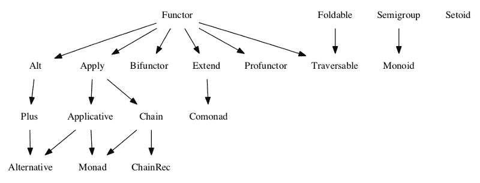
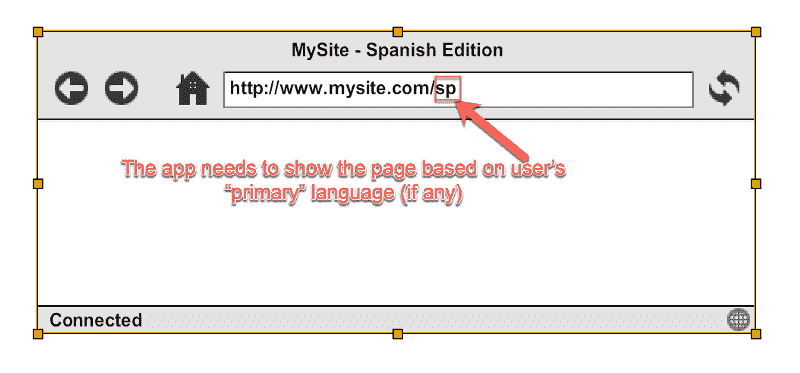

# JavaScript 中的函数式编程——带实际例子(第 1 部分)

> 原文：<https://www.freecodecamp.org/news/functional-programming-in-js-with-practical-examples-part-1-87c2b0dbc276/>

作者 rajaraodv

# JavaScript 中的函数式编程——带实际例子(第 1 部分)


函数式编程(FP)可以更好地改变你的编程方式。但是这很难学，而且许多帖子和教程都没有详细介绍 Monads、Applicative 等等，似乎也没有使用实际的例子来帮助我们在日常生活中使用强大的 FP 技术。这就是为什么我想到写一个帖子，让大家更容易使用 FP 技术。

> 请注意:这篇博客的重点是**为什么需要** xyz 特性，而不仅仅是**什么是** xyz 特性。

在第 1 部分中，你将通过几个例子学习函数式编程的基础，Currying，纯函数，“幻境”规范，“函子”，“单子”，“可能单子”和“要么单子”。

### 函数式编程

函数式编程是通过简单地组合一组函数来编写程序的一种风格。

从本质上说，FP 要求我们将几乎所有的东西都包装在函数中，编写许多小的可重用函数，然后简单地一个接一个地调用它们，以得到类似于:( **func1.func2.func3** )或者以一种组合的方式，比如: **func1(func2(func3()))** 。

但是，为了以这种风格实际编写程序，函数需要遵循一些规则，并克服一些挑战，如下所述:

#### FP 挑战:

如果所有事情都可以通过组合一组函数来完成..

1.  我们如何处理 if-else 条件？(**提示:“要么”单子**)
2.  我们如何处理空异常(**提示:“也许”单子**)？
3.  如何保证函数真正“可重用”，在任何地方都可以重用，(**提示:** **纯函数，** **参照透明**)？
4.  如何确保我们传递给它的数据不变，以便我们可以在其他地方重用这些数据(**提示:** **纯函数，不变性**)？
5.  如果一个函数接受多个值，但是链接只能传递一个值，我们如何让它成为一个链的一部分(**提示:****“currying”和“高阶函数”**)？
6.  更多..<add your="" question="" here="">。</add>

#### FP 解决方案:

为了应对所有这些挑战，像 Haskell 这样的全函数式编程语言提供了各种工具和数学概念，如“单子”、“函子”等等。

虽然 JavaScript 没有提供很多现成的工具，但谢天谢地，它有足够的 FP 特性，允许人们编写库。

### 幻境规格和 FP 库

想要提供函子、单子等特性的库，需要实现遵循一些规范的函数/类，以便像在 Haskell 等语言中那样提供功能。

幻想世界规范是解释每个 JS 函数/类应该如何表现的重要规范之一。



上图显示了所有的规格及其依赖关系。规范本质上是法律，类似于 Java 中的“接口”。从 JS 的角度来看，您可以将 specs 视为“类”或构造函数，它们根据规范实现一些方法，如( **map** 、的**、 **chain** 等等)。**

例如:

如果 JS 类实现了一个“map”方法，那么它就是一个“仿函数”。映射方法必须按照规范工作(ps:这是简化版本，有更多的规则)。

类似地，如果 JS 类按照规范实现了“map”和“ap”函数，那么它就是一个“Apply Functor”。

类似地，JS 类是一个“Monad”(又名 Monad Functor)，如果实现了“Functor”、“Apply”、“Applicative”、“Chain”和“Monad”本身的要求(因为依赖链)。

> 注意:依赖可能看起来像继承，但不是必须的。例如:Monad 实现了“应用的”和“链的”规范(以及其他规范)。

#### 符合幻想世界规范的库

有几个库实现了 FL 规范。比如: [**monet.js、**](https://cwmyers.github.io/monet.js/) **[勉强功能](https://github.com/cullophid/barely-functional)、 [folktalejs](http://folktalejs.org/) 、 [ramda-fantasy](https://github.com/ramda/ramda-fantasy) (基于 ramda)、 [immutable-ext](https://github.com/DrBoolean/immutable-ext) (基于 ImmutableJS)、 [Fluture](https://github.com/Avaq/Fluture) 等等。**

### 我应该使用什么库？

像 [**lodash-fp**](https://github.com/lodash/lodash/wiki/FP-Guide) **， [ramdajs](http://ramdajs.com/)** 这样的库，只能让你以 fp 风格开始写作。但是它们没有提供函数来使用关键的数学概念，如单子、函子、可折叠来实际解决现实世界的问题。

所以，除了它们之外，你必须使用一个遵循幻想世界规范的库。这样的库有: **[monet.js、](https://cwmyers.github.io/monet.js/)** [](https://cwmyers.github.io/monet.js/)**勉强可用、 [folktalejs](http://folktalejs.org/) 、 [ramda-fantasy](https://github.com/ramda/ramda-fantasy) (基于 ramda)、 [immutable-ext](https://github.com/DrBoolean/immutable-ext) (基于 ImmutableJS)、 [Fluture](https://github.com/Avaq/Fluture) 等等。**

> 注:我用的是 [**ramdajs**](http://ramdajs.com/) 和 [**ramda-fantasy**](https://github.com/ramda/ramda-fantasy)

好了，现在我们知道了基础知识，让我们看看一些实际的例子，并通过这些例子学习各种 FP 的特性和技术。

### 示例 1 —处理空支票

***主题涵盖:函子，单子，也许单子，奉承。***

**用例:**我们希望根据用户的“**主要”** **语言**(内部用户偏好，见下文)显示不同的索引网页。我们还需要编写 **getUrlForUser** ，它从用户的(**joeUser**)**primary**】language("**Spanish "**)的 URL 列表( **indexURLs** )中返回适当的URL **。**



问题是:主要语言可能为空。用户本身可能为空(未登录)。我们的索引 URL 列表中可能没有主要语言。因此，我们必须处理大量的“空”或“未定义”问题。

#### 解决方案(命令式与 FP 式):

> PS:如果 FP 版本看起来很难理解，不要担心，我会在这篇文章的后面一步一步地介绍它们。

好了，我们先来了解一下这个方案中用到的几个 FP 概念和技术。

#### 函子

任何存储一个值并实现“map”方法的类(或构造函数)或数据类型都称为“函子”。

比如:数组就是一个“函子”。因为数组可以存储值，并且有“map”方法，允许我们将函数映射到它存储的值。

```
const add1 = (a) => a+1;
```

```
let myArray = new Array(1, 2, 3, 4); //store values
```

```
myArray.map(add1) // -> [2,3,4,5] //applies functions
```

我们来写自己的函子“MyFunctor”。它只是一个 JS 类(构造函数),存储一些值并实现一个“map”方法。这个“map”方法将函数应用于存储的值，然后根据结果创建一个新的 Myfunctor，并返回这个新的 MyFunctor。

> PS:除了“地图”之外，函子还需要实现其他规范(参见 [Fantasyland 规范](https://github.com/fantasyland/fantasy-land)),但我不打算在这里介绍它们。

#### 单子

单子也是函子，也就是说，它们有“ **map** 方法，但实现的方法不仅仅是“map”。如果你再看一下规格依赖图，你会发现还需要在不同的规格中实现各种其他特性，比如:“[应用](https://github.com/fantasyland/fantasy-land#apply)”(**AP**方法)、“[应用](https://github.com/fantasyland/fantasy-land#applicative)”(方法的 **ap** 和**)、“[链](https://github.com/fantasyland/fantasy-land#chain)”(**链**方法)。**


***简化解释:*** *在 JS 中，单子是存储一些数据的类或构造函数，实现“map”、“ap”、“of”和“chain”方法，按照规范对存储的数据做一些事情。*

下面是一个示例实现，因此您可以了解 Monad 的内部结构。

现在，一般的单子通常不被使用，但是更具体和更有用的单子，像“也许单子”或“任一单子”经常在 FP 编程中使用。那么，我们来看看《也许是单子》。

**“也许”单子**

“也许”单子是一个实现单子规范的类。但是 Monad 的特别之处在于它处理“空”或“未定义”的值。

**具体来说，如果存储的数据为空或未定义，那么它的“映射”函数根本不会运行给定的函数，从而避免了任何空或未定义的问题**。它用于我们处理空值的情况。

> 下面的代码显示了 ramda-fantasy 对 Maybe Monad 的实现。它创建两个不同子类之一的实例，**只是**或**什么都不是，**取决于值(即有用值 V/s 分别为空/未定义)。

> 虽然 **Just** 和 **Nothing** 都有类似的方法(map，orElse 等)，但是 Just's 实际上做了一些事情，而 Nothing's 什么都不做。

> **特别注意**下面的“map”和“orElse”方法

让我们看看如何使用 Maybe monad 来处理“空”检查。

请遵循以下步骤:

1.  如果有任何对象可能是空的或者有空的属性，用它创建一个 Monad 对象。
2.  使用一些像 ramdajs 这样的库，它们“可能知道”如何在 Monad 中访问 w/的值并对其进行处理。
3.  如果实际值恰好为空，则提供默认值(即预先处理空错误)。

### Currying —(帮助处理全局数据和多参数函数)

涉及主题:**纯函数**和**合成**

如果我们想将一系列函数链接在一起，如:func1.func2.func3 或(func1(func2(func3()))，所有这些函数每个只能接收一个输入参数。比如 func2 带两个参数 func2(param1，param2)，那么我们就不能链它！

但是实际上，许多函数都有多个参数。那么如何在作文中运用它们呢？解决方法:“阿谀奉承”。

Currying 将一个接受多个参数的函数转换为一次接受一个参数的函数。在所有参数都通过之前，它不会运行这个函数。

#### 此外，Currying 还可以用在我们访问全局值的情况下。即使其“纯净”。

让我们再来看看我们的解决方案:

### 示例 2—处理抛出错误的函数，并在出错后立即退出

**涵盖的主题:【任一单子】**

如果我们有“缺省”值来代替空错误，也许 Monad 很棒。但是真正需要抛出错误的函数呢？当我们链接多个抛出错误的函数时，如何知道哪个函数抛出了错误(即我们想要快速失败)？

例如:如果我们有 **func1.func2.func3…** 并且如果 **func2** 抛出一个错误，我们应该跳过 **func3** 和其他未来的函数，并适当地显示来自 **func2** 的错误，这样我们就可以处理它。

### **任一单子**

当函数都有可能抛出错误，并希望在错误发生后立即退出，以便我们能够确定错误发生的位置时，这两种单子都非常适合处理多个函数。

**用例:**例如，在下面的命令性代码片段中，我们为**项**计算“**税**”和“**折扣**，并最终显示 **showTotalPrice** 。

请注意，如果价格不是数字，函数“ **tax** 将抛出错误。同样，如果价格不是数字，函数“**折扣**将抛出错误，如果商品的价格小于 10，函数也将抛出错误。

> 所以 **showTotalPrice** 有多重错误检查。

让我们看看 **showTotalPrice** 如何通过使用 Monad 来改进，并以 FP 风格重写所有内容。

要么 Monad 提供两个构造函数:“要么。左“和”任一。对”。可以把它们看作是其中任何一个的子类。**左和右都是单子！** **想法是在左边存储错误/异常，在右边存储有用的值**。

即创建任一实例。向左或向右。视价值而定。一旦我们这样做了，我们就可以对这些值运行 map、chain 等等来组合它们。

> 当**左**和**右**都提供“地图”、“链”等时，**左**构造器不做任何事情，因为它存储了错误。其中右边的**构造函数实现了所有的函数，因为它包含了实际的结果。**

**好，让我们看看如何将我们的祈使句改为 FP**

**第一步:**将返回值左右换行

> 注意:“包装”意味着创建某个类的实例。这些函数在内部调用“new ”,所以我们不必这样做。

**步骤 2:** 将初始值包装在**右侧**中，因为它是一个有效值，所以我们可以对其进行组合。

```
const getItemPrice = (item) =&gt; Right(item.price);
```

步骤 3: 创建两个函数，一个处理最终错误，另一个处理结果。并在**中扭曲它们，要么**(这个来自 [ramda-fantasy.js api](https://github.com/ramda/ramda-fantasy/blob/master/src/Either.js#L33) )。

> **要么，要么**带 3 个参数。成功处理程序、错误处理程序和“非此即彼”单子。都是咖喱。所以我们现在可以传递处理程序，稍后再传递第三个参数。

> 一旦接收到所有 3 个参数，它就将第 3 个参数“要么”传递给成功处理程序或错误处理程序，这取决于要么是“右”要么是“左”。

```
const displayTotal = (total) => { console.log(‘Total Price: ‘ + total) };
```

```
const logError = (error) => { console.log(‘Error: ‘ + error.message); };
```

```
const eitherLogOrShow = Either.either(logError, displayTotal);
```

**第四步:**使用“**链**的方法组合多个错误抛出函数。将结果传递给要么.要么(要么 LogOrShow ),后者负责将结果传递给成功处理程序或失败处理程序。

```
const showTotalPrice = (item) => eitherLogOrShow(getItemPrice(item).chain(apply25PercDisc).chain(addCaliTax));
```

将所有这些放在一起:

感谢您的阅读！如果你喜欢这个帖子，请？并在推特上分享！？？

**最新:**[*JS 中的函数式编程—结合实例(下)*](https://medium.com/@rajaraodv/functional-programming-in-js-with-practical-examples-part-2-429d2e8ccc9e#.r2mglxozr)

### 我的其他帖子

#### 函数式编程

1.  [*JavaScript 是图灵全集——解释*](https://medium.com/@rajaraodv/javascript-is-turing-complete-explained-41a34287d263#.6t0b2w66p)
2.  [*JS 中的函数式编程—结合实例(上)*](https://medium.com/@rajaraodv/functional-programming-in-js-with-practical-examples-part-1-87c2b0dbc276#.fbgrmoa7g)
3.  [*JS 中的函数式编程—结合实例(下)*](https://medium.com/@rajaraodv/functional-programming-in-js-with-practical-examples-part-2-429d2e8ccc9e#.r2mglxozr)

#### 是六个

1.  [*ES6*](https://medium.com/@rajaraodv/5-javascript-bad-parts-that-are-fixed-in-es6-c7c45d44fd81#.7e2s6cghy)中修复的 5 个 JavaScript“坏”部分
2.  [*ES6 中的“类”是新的“坏”的部分吗？*](https://medium.com/@rajaraodv/is-class-in-es6-the-new-bad-part-6c4e6fe1ee65#.4hqgpj2uv)

#### 网络包

1.  [*Webpack —令人困惑的部分*](https://medium.com/@rajaraodv/webpack-the-confusing-parts-58712f8fcad9#.6ot6deo2b)
2.  [*Webpack &热模块更换【HMR】*](https://medium.com/@rajaraodv/webpack-hot-module-replacement-hmr-e756a726a07#.y667mx4lg)*(引擎盖下)*
3.  [*Webpack 的 HMR 和 React-Hot-Loader —失踪手册*](https://medium.com/@rajaraodv/webpacks-hmr-react-hot-loader-the-missing-manual-232336dc0d96#.fbb1e7ehl)

#### Draft.js

1.  [*为什么选择 Draft.js，为什么要投稿*](https://medium.com/@rajaraodv/why-draft-js-and-why-you-should-contribute-460c4a69e6c8#.jp1tsvsqc)
2.  [*draft . js 如何表示富文本数据*](https://medium.com/@rajaraodv/how-draft-js-represents-rich-text-data-eeabb5f25cf2#.hh0ue85lo)

#### 反应和还原:

1.  [*逐步构建 React Redux 应用指南*](https://medium.com/@rajaraodv/step-by-step-guide-to-building-react-redux-apps-using-mocks-48ca0f47f9a#.s7zsgq3u1)
2.  [*React Redux CRUD App 构建指南*](https://medium.com/@rajaraodv/a-guide-for-building-a-react-redux-crud-app-7fe0b8943d0f#.g99gruhdz) *(3 页 app)*
3.  [*在 React Redux 应用中使用中间件*](https://medium.com/@rajaraodv/using-middlewares-in-react-redux-apps-f7c9652610c6#.oentrjqpj)
4.  [*添加一个健壮的表单验证来反应 Redux 应用程序*](https://medium.com/@rajaraodv/adding-a-robust-form-validation-to-react-redux-apps-616ca240c124#.jq013tkr1)
5.  [*用 JWT 令牌保护 React Redux 应用*](https://medium.com/@rajaraodv/securing-react-redux-apps-with-jwt-tokens-fcfe81356ea0#.xci6o9s6w)
6.  [*在 React Redux 应用中处理交易邮件*](https://medium.com/@rajaraodv/handling-transactional-emails-in-react-redux-apps-8b1134748f76#.a24nenmnt)
7.  [*解剖一个 React Redux App*](https://medium.com/@rajaraodv/the-anatomy-of-a-react-redux-app-759282368c5a#.7wwjs8eqo)

#### 销售力量

1.  [*在 Salesforce 的 Visualforce 中开发 React Redux 应用*](https://medium.com/@rajaraodv/developing-react-redux-apps-in-salesforce-s-visualforce-3ad7be560d1c#.f6bao6mtu)