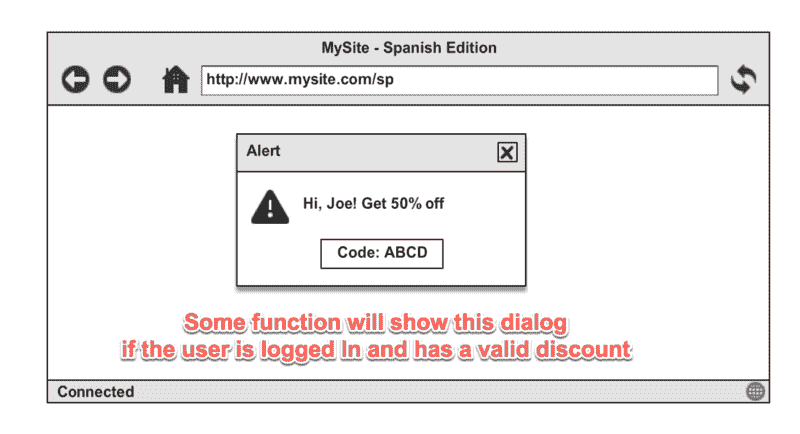
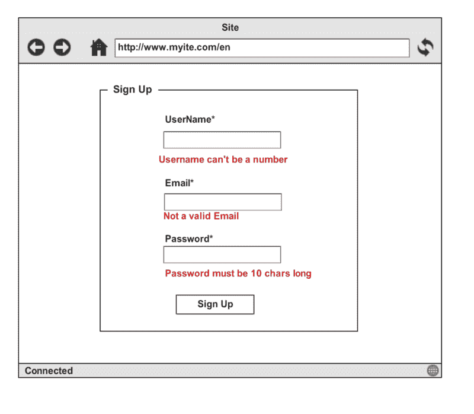

# JavaScript 中的函数式编程——带实例(第 2 部分)

> 原文：<https://www.freecodecamp.org/news/functional-programming-in-js-with-practical-examples-part-2-429d2e8ccc9e/>

作者 rajaraodv

# JavaScript 中的函数式编程——带实例(第 2 部分)

[**在第 1 部分**](https://medium.com/@rajaraodv/functional-programming-in-js-with-practical-examples-part-1-87c2b0dbc276#.8dao66cag) 中，我们通过几个例子讨论了:函数式编程基础、curry、纯函数、“幻境”规范、、“函子”、“单子”、“可能单子”和“要么单子”。

在这一部分，我们将讨论:可应用的、curryN 函数和“验证可应用的”。

> 感谢 FP 大师 [Brian Lonsdorf](https://www.freecodecamp.org/news/functional-programming-in-js-with-practical-examples-part-2-429d2e8ccc9e/undefined) 、 [keithalexander](https://www.freecodecamp.org/news/functional-programming-in-js-with-practical-examples-part-2-429d2e8ccc9e/undefined) 等人对*的点评？？*

### *示例 3—为潜在的空对象赋值*

****FP 使用的概念:【适用的】****

***用例:**假设我们想给用户折扣，如果用户已经登录，并且我们正在进行促销(即存在折扣)。*

*假设我们正在使用下面的**应用折扣**方法。可以想象，如果用户(左侧)或折扣(右侧)为 null，applyDiscount 可能会抛出 null 错误。*

*`//Adds discount to the user object if BOTH user and discount exists.`*
*`//Throws null errors if either user or discount is nullconst applyDiscount = (user, discount) => {    let userClone = clone(user);// use some lib to make a copy  `*
*`  **userClone.discount = discount.code;**   return userClone;`*
*`}`*

让我们看看如何用“适用的”来解决这个问题。

***适用:***

任何拥有方法“ap”并实现应用规范的类都被称为应用类。应用程序可以用在处理等式左边(用户)和右边(折扣)的空值的函数中。

原来“也许”单子(以及每个单子)也实现“ap”规范，因此也是“应用程序”，而不仅仅是单子。所以我们可以用“也许”单子在函数级处理 null。

让我们看看如何使用 Maybe 作为“适用的”来解决 applyDiscount 的问题。

#### ***第一步:**将我们潜在的空值包装在可能的单子中*

【T2`const maybeUser = Maybe(user);`
*`const maybeDiscount = Maybe(discount);`*

#### ***第二步:**重写函数并运行它，这样我们可以一次传递一个参数。*

*`//Rewrite the function and curry it so we can`*
*`//pass one param at a time`*
*`var applyDiscount = curry(function(user, discount) {    `*
*`      user.discount = discount.code;    `*
*`      return user;`*
**

#### ***第三步:**我们通过“map”传递第一个参数(maybeUser)来 applyDiscount。*

【T2`//pass the first argument to applyDiscount via "map"`
*`**const maybeApplyDiscountFunc = maybeUser.map(applyDiscount);**//Note, since applyDiscount is "curried", and "map" will only pass 1 parameter, the return result (**maybeApplyDiscountFunc**) will be a Maybe wrapped "applyDiscount" function that now has maybeUser(1st param) in it's closure.**In other words, we now have a function wrapped in a Monad!**`*

#### ***第四步:处理** maybeApplyDiscountFunc*

*现阶段 maybeApplyDiscountFunc 可以是:*
*1。如果用户确实存在，那么 maybeApplyDiscountFunc 是一个包装在 Maybe 中的函数。*
*2。如果用户不存在，那么 maybeApplyDiscountFunc 将是“Nothing”(Maybe 的子类)*

*如果用户不存在，则返回“无”,任何进一步的交互都被完全忽略。所以如果我们通过第二个论点，什么都不会发生。也不会抛出空错误。*

*但是在用户实际存在的情况下，我们可以尝试通过“map”将第二个参数传递给 maybeApplyDiscountFunc 来执行如下函数:*

*T2`maybeDiscount.map(maybeApplyDiscountFunc)! // PROBLEM!`*

***呃哦！“地图”不知道如何运行函数(** maybeApplyDiscountFunc) **当函数本身在一个 MayBe 里面的时候！***

这就是为什么我们需要一个不同的界面来处理这种情况。原来那是“ap”！

***第五步:**让我们重述一下“ap”函数。“ap”方法采用另一个 Maybe monad，并将当前存储的函数传递/应用到该 Maybe。*

因此，我们可以简单地对 maybe discount func 应用(" ap") maybeApplyDiscountFunc，而不是像下面这样使用" map ",它将会非常有效！

【T2`maybeApplyDiscountFunc.**ap**(maybeDiscount)//Internally it is doing the following because applyDiscount is store in the this.val of maybeApplyDiscountFunc wrapper:`
*`maybeDiscount.map(applyDiscount)//Now, if maybeDiscount actually has the discount, then the function is is run.If maybeDiscount is Null, then nothing happens.`*

> 仅供参考:显然 FL 规范有所改变，旧版本有(例如):‘just(f)’。ap(Just(x))`(其中` f '是一个函数，而` x '是一个值)但是新版本会让你写` Just(x)。ap(Just(f))`但是实现大部分还没有改变。感谢[凯赛勒斯](https://www.freecodecamp.org/news/functional-programming-in-js-with-practical-examples-part-2-429d2e8ccc9e/undefined)

总而言之，如果你有一个函数处理多个可能都为空的参数，你首先搜索它，然后把它放在一个可能里面。此外，还将所有参数放在一个 Maybe 中，然后使用“ap”来运行该函数。

### *curryN 函数*

*我们熟悉“咖喱”。它只是转换一个接受多个参数的函数，一个接一个地接受它们。*

*`**//Curry Example:**`*
*`const add = (a, b) =>a+b;const curriedAdd = R.curry(add);const add10 = curriedAdd(10);//pass the 1st argument. Returns a function that takes 2nd (b) parameter.//run function by passing 2nd argument`*
*`add10(2) // -> 12 //internally runs "add" with 10 and 2.`*

但是如果 **add** 函数能够将传递给它的所有数字相加，而不是仅仅将两个数字相加，那会怎么样呢？

*T2`const add = (...args) => R.sum(args); //sum all the numbers in args`*

*我们仍然可以通过使用 **curryN** 来限制参数的数量，如下:*

*`**//curryN example**`*
*`const add = (...args) => R.sum(args);//CurryN Example:`*
*`const add = (...args) => R.sum(args);const add3Numbers = R.**curryN**(3, add);`*
*`const add5Numbers = R.**curryN**(5, add);`*
*`const add10Numbers = R.**curryN**(10, add);add3Numbers(1,2,3) // 6`*
*`add3Numbers(1) // returns a function that takes 2 more params.`*
**

#### *使用“curryN”等待函数调用次数*

假设我们想写一个函数，只有调用 3 次(忽略第 1 次和第 2 次调用)才会记录。大概如下:

*`//impure`*
*`let counter = 0;`*
*`const logAfter3Calls = () => {`*
*`if(++counter == 3)`*
*`  console.log('called me 3 times');`*
*`}logAfter3Calls() // Nothing happens`*
*`logAfter3Calls() // Nothing happens`*
*`logAfter3Calls() // 'called me 3 times'` `if(++counter == 3)`*

我们可以像下面这样用 curryN 来模拟。

*`//Pure`*
*`const log = () => {`*
*`  console.log('called me 3 times');`*
*`}**const logAfter3Calls = R.curryN(3, log);**//call`*
*`**logAfter3Calls('')('')('')**//'called me 3 times'//Note: We are passing '' to satisfy CurryN that we are passing some parameter.`*

> ***注意:我们将在应用验证中使用这种技术。***

### *示例 4—收集并显示多个错误*

*涵盖的主题:**验证(又名“验证函子”、“验证应用”、“验证单子”)**。*

> ***验证**通常被称为**验证应用型**，因为它通常使用其“ap”(应用)功能进行验证。*

***验证**类似于**单子**，用于组合多个抛出错误的函数。但是与任何一个单子不同，我们通常使用它的“chain”方法来组合，在验证单子中，我们通常使用“ap”方法来组合。不像任何一种“链”方法，我们只收集第一个错误，**“AP”方法，特别是在验证单子中允许我们收集一个数组中的所有错误**。*

它们通常用在表单验证中，我们可能想同时显示所有的错误。

***用例:**我们有一个注册表单，使用 3 个函数(isUsernameValid，isPwdLengthCorrect 和 ieEmailValid)验证用户名、密码和电子邮件。如果所有 1、2 或 3 个错误同时发生，我们需要显示它们。*

In order to show multiple errors, use “Validation” Functor

*好了，让我们看看如何用“验证适用”来实现它。*

> 我们将使用来自 [folktalejs](https://github.com/folktale/data.validation) 的 data.validation 库，因为 ramda-fantasy 还没有实现它。

*类似于“要么”单子，它有两个构造函数:**成功**和**失败**。这些就像子类，每个子类都实现了各自的规范。*

***步骤 1:** 为了使用验证，我们需要做的就是将有效值和错误封装在**成功**和**失败**构造函数中(即创建这些类的实例)。*

> ****对所有错误抛出验证函数重复该过程。****

****第二步:**创建一个虚拟函数来保存验证成功。**

**T2`const returnSuccess = () => 'success';//simply returns success`**

****第三步:使用 curryN 重复应用“AP”****

**“AP”的问题是左边应该是包含**函数**的函子(或者单子)。**

**例如，假设我们想要重复应用如下所示的“ap”。只有在 monad1 包含函数的情况下才有效。而 monad1.ap(monad2)即 **resultingMonad** 的结果也是一个有函数的 monad，这样我们就可以“ap”到 monad3。**

**`**let finalResult = monad1.ap(monad2).ap(monad3)**//Can be rewritten as:`*
*`let resultingMonad = monad1.ap(monad2)`*
*`let **finalResult** = resultingMonad.ap(monad3)**//will only work if: monad1 has a function and monad1.ap(monad2) results in another monad (resultingMonad) with a function**`**

> *一般来说，我们需要两个有函数的单子来应用“ap”两次。*

*在我们的例子中，我们需要应用 3 个函数。*

*假设我们做了如下的事情。*

**`Success(returnSuccess)`*
*`       .ap(isUsernameValid(username)) //works`*
*`       .ap(isPwdLengthCorrect(pwd))//wont work`*
*`       .ap(ieEmailValid(email))//wont work`**

**以上都行不通，因为成功(returnSuccess)。ap(isUsernameValid(username))将产生一个值。我们不能再继续在第二和第三个函数上做“ap”了。**

**输入 curryn。**

*我们可以使用 curryN 来保持返回函数，直到它被调用“N”次。*

**所以我们可以简单地做:**

*【T2`//3 coz we are calling "ap" 3 times.`
*`let success = R.curryN(3, returnSuccess);`**

**现在，curried **成功保持返回函数 3 次。****

**`function validateForm(username, pwd, email) {`*
*`   //3 coz we are calling "ap" 3 times.`*
*`   let success = R.curryN(3, returnSuccess);    return Success(success)// default; used for 3 "ap"s`*
*`       .ap(isUsernameValid(username))`*
*`       .ap(isPwdLengthCorrect(pwd))`*
*`       .ap(ieEmailValid(email))`*
***

**将所有这些放在一起:**

****如果您喜欢该帖子，通过点击？并在推特上分享！感谢阅读！**？？**

### **我的其他帖子**

****最新:** [*浏览器的内部运作方式——针对 JavaScript & Web 开发者*](https://medium.com/@rajaraodv/the-inner-workings-of-the-browser-for-javascript-web-developers-course-d26f11270f41) ***使用代码:INNER15 即可获得五折优惠！*****

#### **功能编程**

1.  **[*JavaScript 图灵全集—解说*](https://medium.com/@rajaraodv/javascript-is-turing-complete-explained-41a34287d263#.6t0b2w66p)**
2.  **[*JS 中的函数式编程—结合实例(上)*](https://medium.com/@rajaraodv/functional-programming-in-js-with-practical-examples-part-1-87c2b0dbc276#.fbgrmoa7g)**
3.  **[*JS 中的函数式编程—结合实例(下)*](https://medium.com/@rajaraodv/functional-programming-in-js-with-practical-examples-part-2-429d2e8ccc9e#.mmpv20wsv)**

#### **ES6**

1.  **[*5 ES6*](https://medium.com/@rajaraodv/5-javascript-bad-parts-that-are-fixed-in-es6-c7c45d44fd81#.7e2s6cghy)*中修复的 JavaScript“坏”部分*
2.  **[*ES6 中的“类”是新的“坏”的部分吗？*](https://medium.com/@rajaraodv/is-class-in-es6-the-new-bad-part-6c4e6fe1ee65#.4hqgpj2uv)**

#### **网络包**

1.  **[*Webpack —令人困惑的部分*](https://medium.com/@rajaraodv/webpack-the-confusing-parts-58712f8fcad9#.6ot6deo2b)**
2.  **[*Webpack &热模块更换【HMR】*](https://medium.com/@rajaraodv/webpack-hot-module-replacement-hmr-e756a726a07#.y667mx4lg)*(引擎盖下)***
3.  **[*Webpack 的 HMR 和 React-Hot-Loader —失踪手册*](https://medium.com/@rajaraodv/webpacks-hmr-react-hot-loader-the-missing-manual-232336dc0d96#.fbb1e7ehl)**

#### **Draft.js**

1.  **[*为什么要投稿*](https://medium.com/@rajaraodv/why-draft-js-and-why-you-should-contribute-460c4a69e6c8#.jp1tsvsqc)**
2.  **[*draft . js 如何表示丰富的文本数据*](https://medium.com/@rajaraodv/how-draft-js-represents-rich-text-data-eeabb5f25cf2#.hh0ue85lo)**

#### **反应并还原:**

1.  **[*逐步建立 React Redux 应用指南*](https://medium.com/@rajaraodv/step-by-step-guide-to-building-react-redux-apps-using-mocks-48ca0f47f9a#.s7zsgq3u1)**
2.  **[*React Redux CRUD App*](https://medium.com/@rajaraodv/a-guide-for-building-a-react-redux-crud-app-7fe0b8943d0f#.g99gruhdz)*(3 页 app)** 构建指南*
3.  **[*在 React Redux Apps 中使用中间件*](https://medium.com/@rajaraodv/using-middlewares-in-react-redux-apps-f7c9652610c6#.oentrjqpj)**
4.  **[*添加一个健壮的表单验证来反应 Redux Apps*](https://medium.com/@rajaraodv/adding-a-robust-form-validation-to-react-redux-apps-616ca240c124#.jq013tkr1)**
5.  **[*用 JWT 令牌保护 React Redux 应用*](https://medium.com/@rajaraodv/securing-react-redux-apps-with-jwt-tokens-fcfe81356ea0#.xci6o9s6w)**
6.  **[*在 React Redux 应用中处理事务性邮件*](https://medium.com/@rajaraodv/handling-transactional-emails-in-react-redux-apps-8b1134748f76#.a24nenmnt)**
7.  **[*解剖一个 React Redux App*](https://medium.com/@rajaraodv/the-anatomy-of-a-react-redux-app-759282368c5a#.7wwjs8eqo)**

#### **Salesforce**

1.  **[*在 Salesforce 的 Visualforce 中开发 React Redux 应用*](https://medium.com/@rajaraodv/developing-react-redux-apps-in-salesforce-s-visualforce-3ad7be560d1c#.f6bao6mtu)**