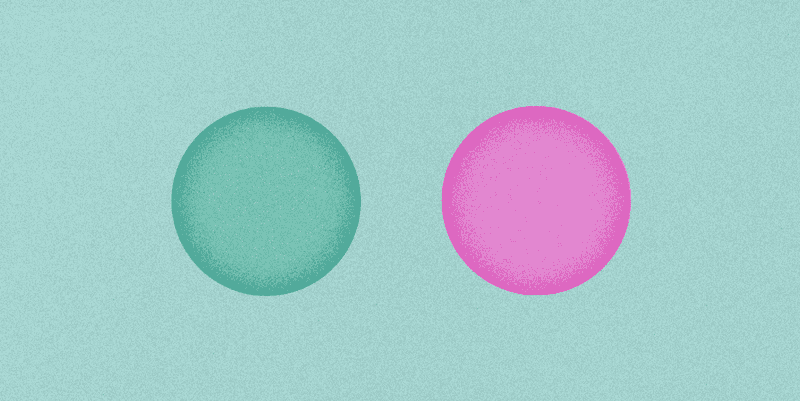
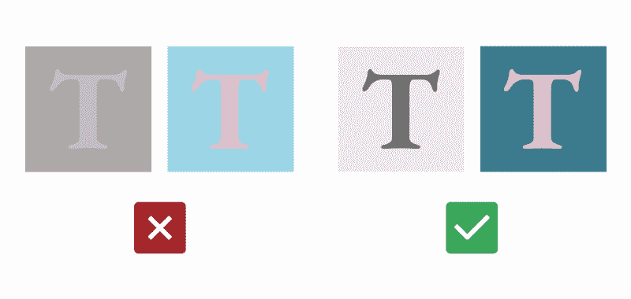
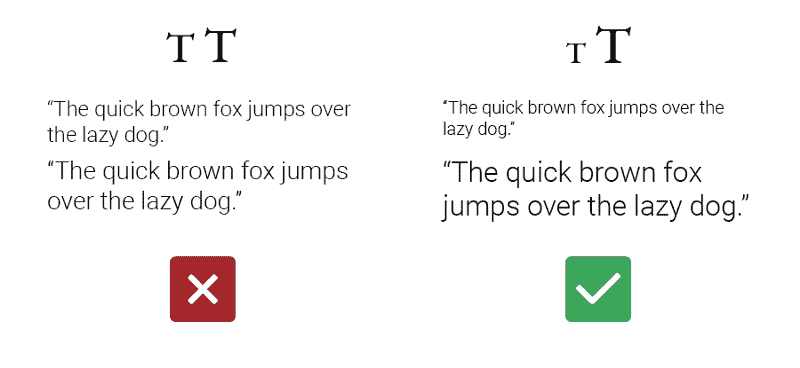
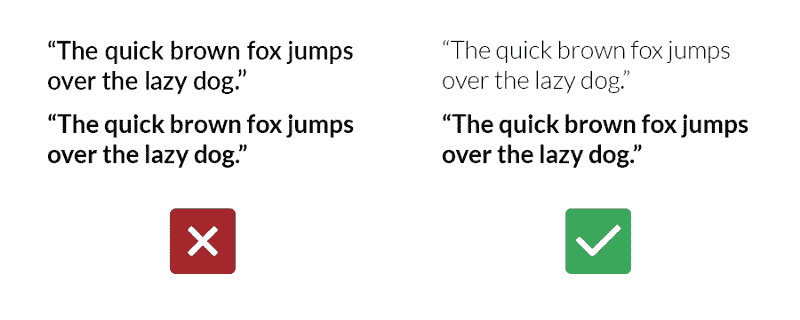
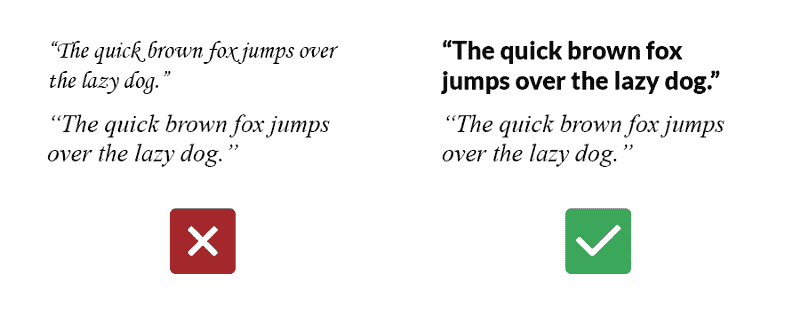
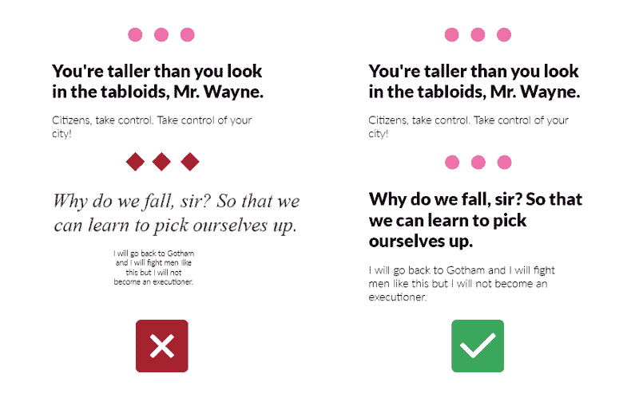
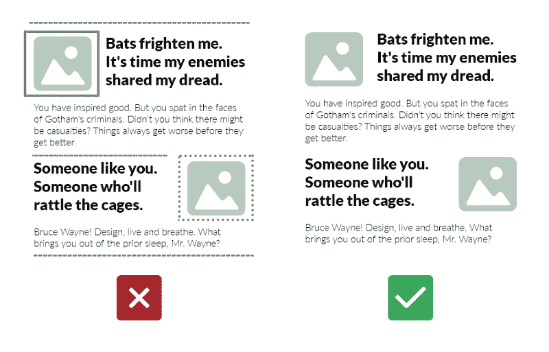
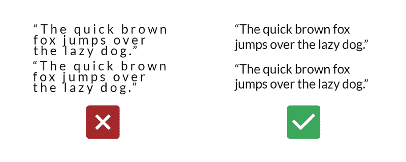
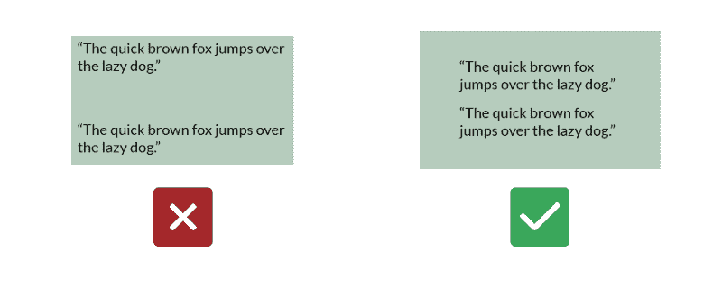
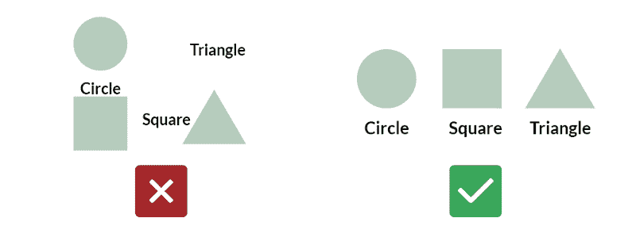

# 非设计人员的基本设计原则

> 原文：<https://www.freecodecamp.org/news/fundamental-design-principles-for-non-designers-ad34c30caa7/>

by Anna 4erepawko Mészáros

# 非设计人员的基本设计原则

这是写给那些没钱请专业设计师的内容创作者的，也是写给团队中的非设计师的，因为设计师总是太忙而无法提供帮助。如果你能遵循这些简单的步骤，我保证你的设计会更好看。

这个列表是我多年来观察我的非设计师朋友、家人和同事努力设计他们日常生活中需要的东西的结果。个人简讯、简历和作品集、脸书或 Instagram 上帖子的图片、YouTube 上的视频缩略图等等。

所有这些人都来向我寻求帮助和建议，告诉我如何让事情变得更好。我是整个“授人以鱼”思想的坚定信徒，所以我没有为他们设计东西，而是试图给他们有价值的建议，这些建议可能有助于将来解决类似的问题。

随着时间的推移，我意识到我一直在一遍又一遍地给人们同样的提示。每次我都用不同的措辞来表达，但是我所有的建议都可以归结为**这四个原则**。

我知道有成千上万个类似的列表，但是我发现这些列表太多了。作为一个非设计师，你不可能始终如一地遵循 25 个“简单”的步骤(没有包含 25 个部分的东西是真正“简单”的)。你也不必这样做。

这会帮助你创造闪亮美丽的设计吗？不会。这能帮助你创造出伟大的、清晰的、易于理解的设计，让每个人都容易理解并与之互动吗？绝对的。所以，事不宜迟，我向你们介绍:

### 任何人都可以遵循的 4 个基本设计原则，以实现伟大的成果

### 对比

确保所有元素之间有足够的对比度。

为什么？因为那些略有不同，但又不够不同的事物，创造了一种[恐怖谷](https://en.wikipedia.org/wiki/Uncanny_valley)。它们对人眼来说感觉怪异和令人厌恶，和/或难以理解。现在我们不想在设计中出现这种情况，对吧？

你的设计元素要么是**完全相同的**，要么是**显著不同的**。

反差问题主要表现在四个不同方面:

1.颜色:在浅色上使用深色，反之亦然。

***例如:*** *千万不要用灰色搭配略深的灰色或者淡粉色搭配浅蓝色——它们极难阅读/互动。*

2.**大小:**只将大小**完全相同的**或者大小**相差很大的元素放在一起。**

***例如:*** *不要把 32pt 和 36pt 的文本行放在一起。另一方面，18pt 和 36pt 会配合得很好。*

3.**重量:**与尺寸相同，只是将重量**完全相同的**或者重量**相差很大的元素放在一起。**

***举例:*** *不要把相同字体的“粗体”和“黑色”粗细放在一起——因为它们看起来太像了。另一方面,“轻”和“粗”的重量会配合得很好。*

4.不要把一种斜体放在另一种斜体旁边，或者一种衬线字体放在另一种衬线字体旁边。把不同的东西结合起来。

***例如:*** *不要把“泰晤士报新罗曼”和“佐治亚州”放在一起——它们看起来太相似了。组合风格迥异的字体。*

### 一致性

确保相似的元素以相似的方式出现。

为什么？首先，通过保持事物的一致性(因此也是简单的)，你可以让人们把注意力集中在你设计的重要方面，而不是被一直在变化的事物分散注意力。

第二，一致性增加了信任，**让事情看起来实际上是设计好的**，而不是快速拼凑起来的。

一旦你选择了要坚持的事情:

*   字样/字体
*   调色板/颜色的深浅
*   格子
*   对齐
*   装饰元素风格

等等...

Placeholder text courtesy of [Batman Ipsum](http://batman-ipsum.com/)

当你在处理许多彼此相邻的不同作品时(例如，你的 YouTube 频道的视频缩略图，或者你的媒体文章的封面)，为它们选择一种整体风格并坚持下去。

### 奥卡姆剃刀

#### 又名减少视觉噪音

设计中使用的元素越少越好。

为什么？对于人类大脑来说，在超负荷输入的情况下，很难处理信息和做出决策。使用尽可能少的装饰元素(字体、颜色、阴影、框架、笔画、图标、图案等等)。

将设计版本的[奥卡姆剃刀](https://en.wikipedia.org/wiki/Occam%27s_razor)应用于一切:

如果只用两个元素就能完成某件事，就不要用三个。如果一件事用 10 个元素就能完成，那就不要用 20 个。你明白了。

Placeholder text courtesy of [Batman Ipsum](http://batman-ipsum.com/)

如果你不喜欢古老的英国经院哲学家，而更喜欢你能在网飞上看到的东西，当然:成为你自己设计的玛丽·近藤。任何不能激发快乐的东西(或者不是设计中有用的部分)，都必须被删除。

### 空间

事物的定位方式传达了关于其意义的元层面信息。

为什么这很重要？因为注意你如何放置东西以及在它们周围增加多少空间有助于降低设计的复杂性，从而使它看起来更赏心悦目，更容易交互。

要在设计中利用空间来传达意义，请记住以下三点:

**1。接近度=相关度**

与其他元素相比，彼此之间距离**更近**的事物，被认为彼此之间的关联**比与其他元素的关联**。

这一条是最重要的，因为我感觉它被忽视的次数太多了(甚至被一些自称专业设计师的人，不点名)。

它可以以多种不同的方式应用，例如:

*   行与行之间的空间应该比一行中每个单词之间的空间大，同样，不同段落之间的空间也应该比一个段落中的行与行之间的空间大。

*   设计元素之间的空间应该比这些元素与作品边缘之间的空间小。

*   标签和支持信息应放在它们所描述/涉及的元素附近。

**2。** **负空间**

结合奥卡姆剃刀，给你的设计尽可能多的负空间，使它们变得杂乱，使它们的意义更加明显。

在有限的空间里放入太多的元素就像试图同时听三首不同的歌。很难理解正在说什么。

Look at Apple’s website. One can very clearly understand what is being said (or, rather, sold).

**3。** **重要性和顺序**

这是一个非常普通的常识，但我觉得我仍然必须在这里提到它。

你把最重要的事情放在第一位，或者让它们占据最大的空间。用事物的顺序来传达秩序。等等。剩下的你肯定能想出来。

### 结束了

**祝贺你！**如果你在制作你正在制作的东西时遵循了所有这些步骤，按照行业标准，它看起来很可能非常好。

其他的东西，总有一个设计师。

*****

我叫 Mészáros Anna，是一名平面/界面设计师，后来成为 UX/界面设计师，拥有哲学学术背景，对所有设计伦理感兴趣。我喜欢与更多志同道合的人联系，所以请随时给我留言，在[媒体](https://medium.com/@4erepawko)或[推特](https://twitter.com/4erepawko)上关注我。