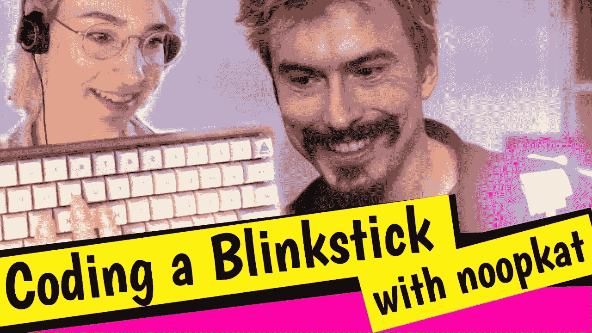

# 经过 5 年的有趣功能，编码传奇 MPJ 继续他的下一个大旅程

> 原文：<https://www.freecodecamp.org/news/funfunfunction-mpj-developer-journey/>

5 年前，马蒂亚斯·皮特·约翰逊——更为人熟知的名字是 MPJ——已经是一名知名的开发商。

他因在 Quora 上回答数百个编码问题[而出名。他从戏剧系学生变成了多产的开发者，开发了一款被黑莓收购的产品。](https://www.quora.com/profile/Mattias-Petter-Johansson/answers)

因此，在 2015 年夏天，MPJ 在他的祖国瑞典的 Spotify 担任前端开发人员，处于他所在领域的巅峰。

就在那时，他决定——似乎不知道从哪里开始——推出一个 YouTube 节目频道。

我清楚地记得，当我父母的第一个视频上线时，我正坐在他的客厅里喝着热茶。我当然点击了它。因为你怎么能不点击一个叫好玩好玩功能的视频呢？

“你好！”MPJ 在他的第一个视频中兴奋地喊道[。"在这个视频系列中，我将教你如何用 JavaScript 进行函数式编程."](https://www.youtube.com/watch?v=BMUiFMZr7vk)

当时我们谁也不知道这个“视频系列”会持续 5 年，跨度超过 200 集，并最终成为 MPJ 的全职焦点。

## 给开发人员社区带来编码的乐趣

除了函数式编程，MPJ 还涉及了许多其他编程主题。

A [video on Lua](https://www.youtube.com/watch?v=7pmGFGoiyUI), a popular language for game development that is frequently taught in high schools.

在整个表演中，有两个可靠的固定装置:MPJ 的高能量，和他不断变化的头发颜色。

Redux creator and React maintainer Dan Abramov came on Fun Fun Function to [discuss React Hooks with MPJ](https://www.youtube.com/watch?v=G-aO5hzo1aw).

这些年来，MPJ 和一些最令人兴奋的科技教师进行了交流。

An episode where MPJ teamed up with coding live-streamer and mechanical keyboard aficionado Noopkat to do some [LED strip hardware hacking with JavaScript](https://www.youtube.com/watch?v=zkn-GzSksYA).

他还分享了许多关于如何进入软件开发领域，以及如何在职业生涯中继续进步的见解。

MPJ talks with career coaches Ingrid Kocjan and Megan Vallee about [career advancement as a developer](https://www.youtube.com/watch?v=sWwuL6o366A).

## 天下没有不散的宴席

所以今天，我怀着复杂的心情看了他最后的视频。

如果你有 15 分钟的时间，我鼓励你观看视频——即使你以前从未看过他的频道。因为这是一堂大师课，教你如何负责任地、果断地退出一个长期项目。

[https://www.youtube.com/embed/IfHWE36B1go?feature=oembed](https://www.youtube.com/embed/IfHWE36B1go?feature=oembed)

MPJ's final Fun Fun Function video.

我从这个视频中对 MPJ 以及他是什么样的人的了解，可能比我从他所有其他滑稽、有思想的视频中了解的还要多。

## 不管你有多好，你仍然可以变得更好

MPJ 是一个热爱编程和教学的热情开发人员。所有这些都在他的视频中闪耀。但他也认为自己一生的工作基本上没有完成。

他谦逊地意识到自己能力的极限，并继续探索和超越它们。

正如他在最后一段视频中解释的那样:

> “当我开始 Fun Fun Fun Fun Fun Fun Fun Fun Fun Fun Fun Fun Fun Fun Fun Fun Fun Fun Fun Fun Fun Fun Fun Fun Fun Fun Fun Fun Fun Fun Fun Fun Fun Fun Fun Fun Fun Fun Fun Fun Fun Fun Fun Fun Fun Fun Fun Fun Fun Fun Fun Fun Fun Fun Fun Fun Fun Fun Fun Fun Fun Fun Fun Fun Fun Fun Fun Fun Fun Fun Fun Fun Fun Fun Fun Fun Fun Fun Fun Fun Fun Fun Fun Fun Fun Fun Fun
> 
> *当我全职(在 Fun Fun Fun Fun Function 上)的时候，我所做的一切都是在谈论创造——而不是真正的创造。当我创作时，是工具促进了创作——抽动覆盖之类的东西。*
> 
> *不要误会，这是一种很棒的消磨时间的方式。我从成千上万的人那里听说了我如何通过与世界分享我的激情和知识来帮助他们成为更好、更有灵感的开发人员。*
> 
> *但我认为现在，5 年后，我已经没有东西可以分享了。*
> 
> *我已经分享了我在程序员工作期间学到的所有东西。我也失去了一点对这个行业本身的热情，比如编码。所以在这一点上，我也没有太大的热情。*
> 
> *所以现在我该回到你们所有人的地方去了。”*

## 更高的使命

最重要的是，MPJ 希望在应对人类面临的一个重要挑战——精神健康挑战方面发挥作用。

他解释道:

> “我想回去生产产品，把东西放到世界上，花一些时间思考我关心的是什么。我应该创造什么？
> 
> 我关心很多事情。但是最近有一件事很突出，那就是心理学和精神健康。
> 
> 我在频道上不太谈论这个，但在我十八九岁的时候，我母亲自杀了。这是在与慢性抑郁症和苯二氮卓类药物成瘾进行了长期斗争之后。
> 
> 在过去一年左右的时间里，我自己一直在接受治疗，面对许多已经存在了许多年的内心恶魔。当我这样做的时候，我意识到心理健康是一个多么大、多么有趣、多么重要的问题。我越来越认为心理健康是一个需要更多人努力的领域。
> 
> 全球每年有超过 80 万人自杀。在几乎所有国家，自杀是比他杀更常见的死亡方式——有时是他杀的 10 到 20 倍。每 40 秒钟就有一个人自杀。”

我们可能不会得到更多有趣的功能视频，但令人振奋的是，知道像 MPJ 这样的人正在努力解决人类面临的大问题。

我将永远感激 MPJ 留给我们的许多真知灼见。

你可以在这里浏览他有趣的功能视频的完整档案。

马蒂亚斯——如果你正在读这篇文章——祝你未来的努力一帆风顺。程序员 YouTube 没有你就不一样了。