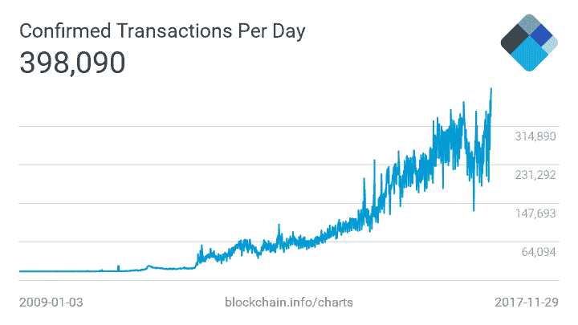
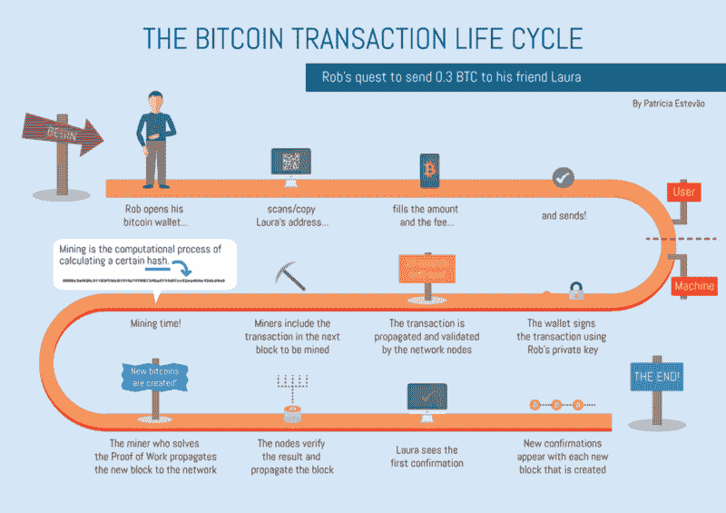
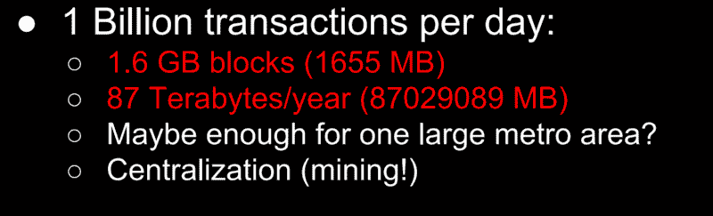
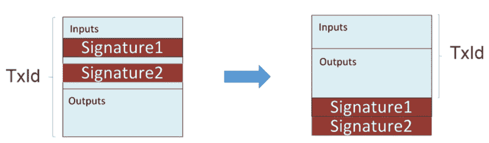
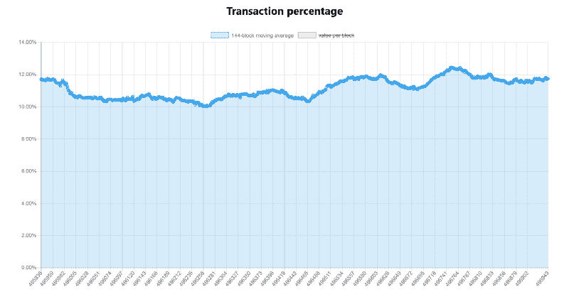
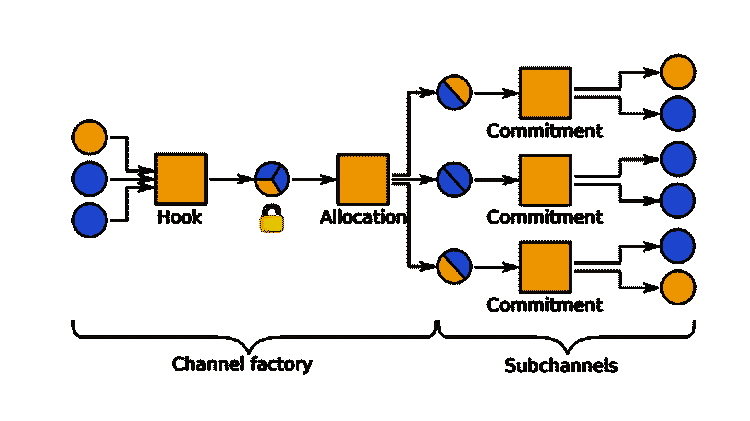
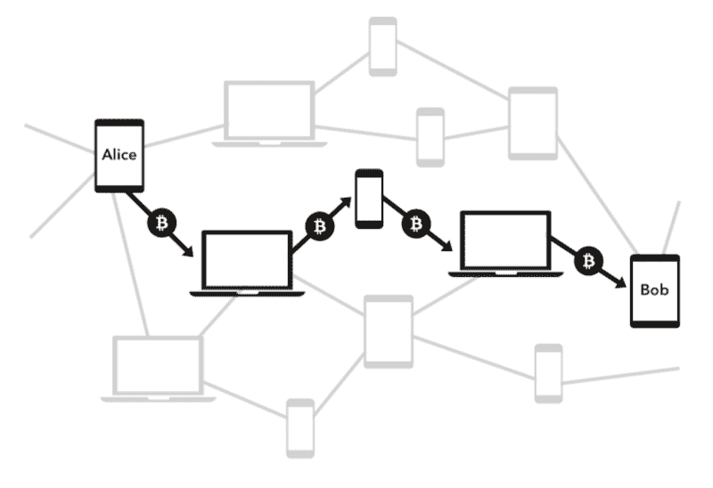
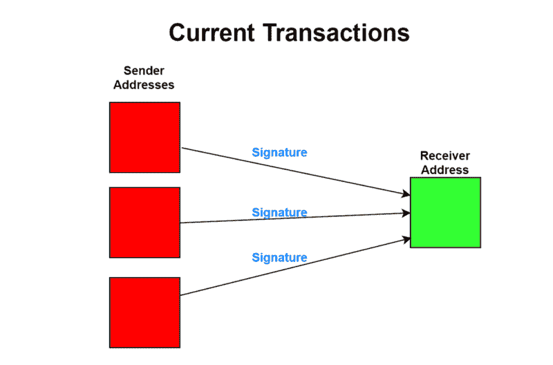
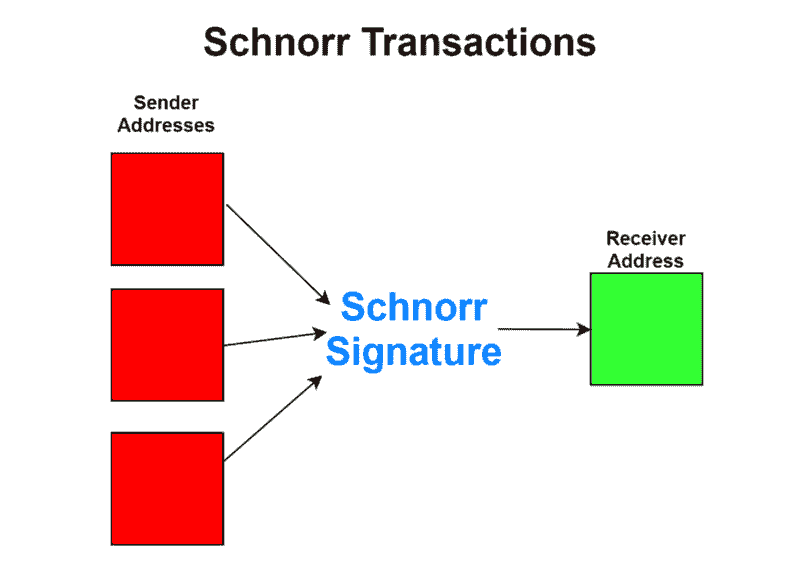
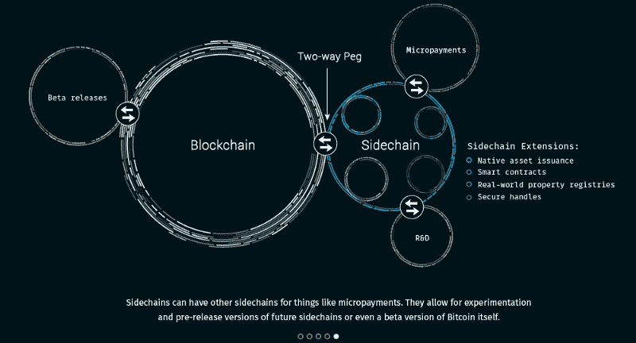

# 关于比特币技术的未来，你需要知道什么

> 原文：<https://www.freecodecamp.org/news/future-of-bitcoin-cc6936ba0b99/>

Subhan Nadeem

# **关于比特币技术的未来，你需要知道什么**

比特币(BTC)最近突破了 11，400 美元的历史高点，随后在几个小时内跌至 8，595 美元。不要在混乱中迷失方向，并随时了解比特币的技术进展是非常重要的。

任何考虑购买比特币的人至少应该学会两件事:

1.  比特币背后的技术历史
2.  更重要的是，比特币的未来会如何。

正如比特币专家 Andreas M. Antonopoulos 所说，“(T2)投资教育而不是投机(T3)。”

随着比特币及其基础区块链成为如此令人难以置信的新技术概念，试图研究和理解其基础技术细节有时会令人望而生畏。本文旨在强调比特币面临的可扩展性问题，以及对该问题的预期或建议解决方案。这篇文章讨论了一些真正令人兴奋的问题！

我写这篇文章是因为我自己正在学习比特币，从无数的来源收集了大量关于比特币未来的信息。在写这篇文章的时候，我考虑到了那些没有编程背景的人。然而，假设读者对比特币作为一种货币以及什么是区块链有非常基本的了解。Coindesk 有一个很棒的 5 分钟阅读，如果你刚刚开始使用比特币或需要复习，应该可以让你跟上速度[这里](https://www.coindesk.com/information/what-is-bitcoin/)。

先说比特币面临的可扩展性问题。

### **交易吞吐量问题**

当比特币首次被引入世界时，它的创造者 Satoshi Nakomoto 在[比特币白皮书](https://bitcoin.org/bitcoin.pdf)中描述比特币为“一种纯粹的点对点版本的电子现金，允许在线支付直接从一方发送到另一方，而不经过金融机构。”

比特币的基本价值之一是即时和安全的点对点支付交易。现在，比特币比以往任何时候都更加成为全球市场上的主流加密货币，仅在去年一年就增长了 1，200%以上。

由于这种前所未有的增长，比特币区块链的交易数量也在增加，每天进行高达 [40 万笔交易。事务的快速增长给区块链带来了严重的可伸缩性问题，目前](https://blockchain.info/charts/n-transactions)[有超过 90，000 个事务](https://blockchain.info/unconfirmed-transactions)因未确认而积压。

As Bitcoin’s price skyrockets, so does its usage. Note the stagnation at around 400,000 transactions per day

为了理解为什么交易被积压，首先必须解释比特币交易。

每当用户从他或她的钱包向另一个人发送比特币交易时，该交易就会被添加到**内存池** (mempool)，该内存池本质上是比特币网络中所有未确认交易的池。这个池由机器上的单个内存池维护，这些内存池也保存着区块链总账的副本，称为**节点**。

从 mempool 中，矿工选择他们想要验证的事务。一旦矿工验证了交易(即确认发送者实际上有足够的比特币发送给接收者)，他们就将其添加到一个新的块中，最终发布到区块链。然后，其他节点遍历这个新发布的块的事务，以确保该块是有效的，然后接受该块作为其分类帐的一部分。

A diagram of the transaction lifecycle, source: [weusecoins.com](https://www.weusecoins.com/en/questions/)

让我们来计算事务的吞吐量:

*   中值事务大小[大约 250 字节](https://tradeblock.com/blog/analysis-of-bitcoin-transaction-size-trends)
*   块的大小限制为 1MB (1000000 字节)
*   因此，一个块包含大约 4000 个事务(1MB 除以 250 字节)
*   一个块平均每 10 分钟(600 秒)只能发布到区块链一次。
*   每 600 秒发布 4000 个事务(最多)，速率为 **6.66 个事务/秒**

mempool 中有超过 90，000 个未确认的事务，矿工如何选择要验证的事务呢？交易费用！交易的发送者可以选择将定制的交易费用添加到其针对挖掘者的交易中，激励挖掘者选择交易并更快地对其进行验证。矿商将选择附加费用最高的交易，以实现利润最大化。理论上，你可以免费发送交易。但如果池中有交易的费用比你高，为什么你的会被选中呢？

随着比特币用户群的增长，平均交易费用也在增长。每秒钟最多只能处理 7 笔交易，每个人都希望自己的交易首先得到验证。目前，平均交易费用约为[3.58 美元](https://bitinfocharts.com/comparison/bitcoin-median_transaction_fee.html)。这笔费用当然不理想——如果你想给你的朋友送几美元的比特币，你最终可能会花更多的交易费，而不是交易价值本身！这就是问题所在，如果所有其他因素保持不变，由于交易瓶颈，交易费用预计会上升。

### **解决吞吐量问题**

这个瓶颈给比特币社区带来了巨大的争议，一个建议的解决方案是简单地从最初的 1MB 限制提高块大小，从而允许每个块更多的交易。

每当链中的块大小增加时，都需要一个**硬分支**，这意味着必须创建链的全新副本，因此需要比特币社区的一致同意。因为数百万人使用比特币，所以获得共识很难，应该努力避免。此外，尽管块大小可以增加到足以容纳当前积压的交易，但随着比特币用户群的持续增长，最终会出现另一个未确认交易的积压，因此需要再次增加块大小，并随后进行另一次硬分叉。

那么，我们为什么不把块的大小做得足够大，以确保吞吐量永远不会成为瓶颈，不管有多少人在使用它？首先，一个区块大小的数学模型即使大到足以处理大规模采用也是不切实际的，并且会将采矿限制在只有大公司才能维护的极其强大的机器上，从而引入了集中化的元素。

Given a block size big enough for just one city’s population, it would restrict node hosting and mining to only those with the most powerful machines, i.e. massive businesses, source: [Lightning Network](https://lightning.network/lightning-network.pdf)

此外，回想一下，一旦挖掘出一个块，所有其他节点都必须在接受它之前验证该块。如果块的大小非常大，并且有人要发布一个无效的块，节点将会浪费大量的时间来尝试验证该块，然后将其作为无效块丢弃并移动到下一个块。拒绝服务攻击本质上可以通过反复向网络发布巨大的无效数据块，长时间阻止有效数据块被处理来实现。正如区块链先锋 Nick Szabo 在本次采访中所说的那样，小块大小是一个技术安全参数，可以防止网络泛滥。

在我写的一篇文章中，你可以读到更多关于如果比特币接管世界，块大小增加的全面影响。

如果我们不能增加块大小，我们能做什么？幸运的是，为了解决这个问题，有几个解决方案正在开发中。

### **隔离证人(SegWit)**

截至 2017 年 8 月，隔离见证(SegWit)实际上已经在比特币网络中实施。这是一个根本性的网络变化，它修改了事务的格式，从本质上缩小了事务的大小，并允许更多的事务放入一个块中，从而提高了吞吐量。SegWit 被认为是一个**软分支**，这意味着它完全向后兼容现有的比特币协议，尽管节点和钱包必须升级才能利用 SegWit 的所有功能。

每笔交易都有来自发送者的签名，或者换句话说，**见证数据**；这通常是交易的最大部分。这个数据实际上并不是验证交易所必需的，所以 SegWit 将这个数据移到交易的末尾，*隔离*它。如果将此事务发送到传统节点(未升级到 SegWit 的节点)，则该节点会在将见证数据插入块之前，从事务的末尾剥离见证数据，从而减小整体事务大小并节省空间。这样做的额外好处是，节点不能再修改见证数据，改变事务来自谁，这是节点以前拥有的能力。这为我们即将讨论的多层解决方案的实现铺平了道路。用户还节省了交易费用，因为它们通常是按每个交易字节计算的，SegWit 减少了总的交易规模。

SegWit moves signature data to the end of transaction, after which stripped before being stored in a block, source: [Programming Blockchains](https://programmingblockchain.gitbooks.io/programmingblockchain/content/other_types_of_ownership/p2wpkh_pay_to_witness_public_key_hash.html)

此外，SegWit 改变了块的定义:块不再用字节来定义，而是用“权重”来定义；一个块的最大重量可以是 4，000。传统事务的权重为 4，而 SegWit 事务的权重为 0.25，因此一个块可以包含更多的 SegWit 事务，并且大小稍大(最多约 2 兆字节)。节点必须升级到 SegWit 以遵循该定义，并且钱包必须包含 SegWit 以发送 SegWit 交易。因此，SegWit 的采用非常缓慢，仅占当前流量的 12%。

Current state of SegWit adoption hovers around 12% of all transactions, source: [segwit.party](http://segwit.party/charts/)

由于 SegWit 的上述好处，我强烈建议阅读这篇文章的人使用集成了 SegWit 的钱包来加速 SegWit 的应用。你可以在这里找到一份整洁的清单(我个人最喜欢的是安卓系统的 T2 钱包)。如果你想进一步了解 SegWit 的复杂性， [Jimmy Song](https://www.freecodecamp.org/news/future-of-bitcoin-cc6936ba0b99/undefined) 写了一篇关于它的文章:

[**了解 Segwit 块大小**](https://medium.com/@jimmysong/understanding-segwit-block-size-fd901b87c9d4)
[*在我写完我的上一篇文章之后，我被关于标题 2MB 部分的抗议所震惊(标题从此…*medium.com](https://medium.com/@jimmysong/understanding-segwit-block-size-fd901b87c9d4)

### **多层解决方案**

就目前情况来看，比特币区块链不太适合微支付。如果你想买一杯 2 美元的咖啡，你可能要支付超过 2 美元等值 BTC 的交易费，而且交易不会立即得到确认——你必须等待交易在链上的验证块中发布，这最多会在 10 分钟内出现。

第二层和第三层解决方案是位于比特币区块链之上的网络，使用户能够几乎立即发送几笔小额比特币交易，而且没有交易费用。

**闪电网络**是目前正在开发的分层网络，有望缓解比特币的规模问题。这个网络由两个附加层组成，使用户能够在彼此之间打开直接通道，以即时方式向对方发送有效的无限数量的付款。

[**雷电网络**](https://lightning.network/)
[*雷电网络依赖于区块链的底层技术。通过使用真实的比特币/区块链…* lightning.network](https://lightning.network/)

#### 第二层

用户通过在区块链上进行交易来加入第二层网络，该交易声明用户承诺一定数量的比特币将在分层网络中使用。然后，用户加入一组相互连接的节点，称为**通道工厂**。这些节点本质上支持潜在地想要彼此进行交易的个人的游说。然后，通道工厂允许在第三层(因此称为工厂)在各方之间创建无限数量的微支付通道。

From the [whitepaper](https://www.tik.ee.ethz.ch/file/a20a865ce40d40c8f942cf206a7cba96/Scalable_Funding_Of_Blockchain_Micropayment_Networks%20(1).pdf): users are hooked into a channel factory upon joining the network, which then allocates multiple micropayment channels

#### 第三层

微支付通道的建立是为了保证第三层的两个用户之间的直接支付。因为区块链不再存在于该层中，所以它不能用于验证交易和确保一方支付给另一方。取而代之的是智能合同技术，例如**多重签名地址**，这意味着可以由多个用户签署的地址，以实现资金的移动，以及**散列时间锁定合同**，这是一种加密安全的自动化合同，可以在一定时间内锁定资金，以确保一方不能欺骗另一方。这些技术消除了微支付渠道中连接的用户之间的信任需求。

以下是 Lightning Network 微支付渠道如何工作的示例:

1.  爱丽丝想把 1 个比特币专用于鲍勃之间的一个微支付通道。她声明这 1 个比特币将用于比特币区块链上的**承诺交易**。这 1 个比特币随后被锁在一个**多址**中，如果双方想关闭通道，可以签字同意。这个地址被一个**散列时间锁合同**保护着，合同上写着“爱丽丝有 1 个 BTC，鲍勃有 0 个 BTC，将在一小时内释放”。这意味着爱丽丝拥有的 1 个比特币被锁定 1 小时，之后将被归还给爱丽丝，并再次发布到比特币区块链。
2.  然后，爱丽丝决定给鲍勃 0.1 BTC。该事务用新的散列时间锁契约来记录，该契约声明“爱丽丝有 0.9 个 BTC，鲍勃有 0.1 个 BTC，将在 50 分钟后到期”。此合同的到期时间为 50 分钟，这意味着它将在声明爱丽丝拥有 1 个 BTC 的原始合同之前发布到区块链。因此，Bob 立即知道他有 0.1 BTC，因为这个新合同将在原始合同之前被发布给区块链，实质上使得旧合同无效。
3.  一个小时过去后，微支付通道关闭，爱丽丝和鲍勃之间的最终余额被发布到区块链。如果 Alice 和 Bob 想继续交易，他们可以根据自己的意愿延长通道的到期时间。如果其中一人想要提前关闭通道，他们中的一人需要在存储比特币的原始 multisig 地址上签字。

网络通过使用通道中的其他连接用户作为中介，使交易能够将自身路由到其最终目的地。即使无法通过当前的微支付渠道找到目标用户的直接连接，这种情况也会发生。例如，如果爱丽丝与鲍勃有一个开放的通道，鲍勃与马克有一个通道，爱丽丝想给马克发送一些比特币，网络可以通过鲍勃将支付路由给马克，同时确保任何一方都不必信任另一方。

In the lightning network, transactions are routed through intermediate users in order to reach its final destination

lightning 网络交易的实现及其缺乏信任的本质可能会变得非常复杂，这一点在本次会议的 Lightning 开发人员[中或者在接下来的由](https://www.youtube.com/watch?v=8zVzw912wPo) [ecurrencyhodler](https://www.freecodecamp.org/news/future-of-bitcoin-cc6936ba0b99/undefined) 撰写的系列文章中可以得到最好的解释:

[**闪电网络(第一部分)**](https://medium.com/the-litecoin-school-of-crypto/a-primer-to-the-lightning-network-part-1-be909c403bde)
[*Multisig 地址:闪电网络的积木*medium.com](https://medium.com/the-litecoin-school-of-crypto/a-primer-to-the-lightning-network-part-1-be909c403bde)

理想情况下，用户很少会创建到第二层的承诺事务，因为他或她会在分层网络中停留很长时间来处理他们的大部分日常事务。一旦用户想要退出这个多层网络，在区块链上进行**结算交易**，宣布用户在所有第二层活动之后的最终比特币余额。这将在与原始承诺交易进行比较后，调整他们在区块链的比特币总余额。总的来说，只进行了两次区块链交易，以便让用户在第二层免费进行无限次数的交易。

如前所述，SegWit 为 lightning 网络铺平了道路，因为它消除了节点修改见证数据的能力，而见证数据是用来识别用户进入第二层的数据。如果因为引用用户的见证数据被更改而找不到用户的承诺事务，则在尝试协调用户的结算事务时会有更大的难度。

包含渠道工厂的闪电网络的第二层是最近在本白皮书的[中介绍的。它仍在大力开发中，所以它的许多概念都是抽象地解释的。然而，该网络将于 2018 年推出，并将是迄今为止交易可扩展性方面最大的改进。](https://www.tik.ee.ethz.ch/file/a20a865ce40d40c8f942cf206a7cba96/Scalable_Funding_Of_Blockchain_Micropayment_Networks%20(1).pdf)

### **施诺尔签名**

当用户发送比特币交易时，交易的输入(您发送的金额)是通过从区块链中检索您之前收到的未用完的比特币总额来计算的。比如说:

*   从一个空钱包开始，我在交易#1 中收到 1 个比特币，然后在单独的交易#2 中又收到 1 个比特币
*   我现在想在一次交易中发送 2 个比特币。该交易将有两个输入:交易#1 和交易#2，总计 2 个比特币

在当前用于生成签名的算法(椭圆曲线数字签名算法)下，每个输入都需要其自己的签名。这增加了总交易规模，因此增加了交易费用。

Currently, each input requires a signature, increasing total transaction size

[Schnorr 签名](https://bitcoincore.org/en/2017/03/23/schnorr-signature-aggregation/)是在交易中存储签名数据的另一种更有效的方法。所有输入被累加，然后利用 Schnorr 算法存储为单个签名，这极大地节省了事务中的空间，并通过允许块平均存储更多事务来进一步帮助提高事务吞吐量。

All sender signatures are stored as one signature under the Schnorr algorithm

Schnorr 签名也可以通过有利于 CoinJoin 交易来帮助比特币提高隐私性。CoinJoin 是一种将匿名引入比特币交易的方法。它的工作原理是在向收款人付款时，将交易输入与其他人的交易汇集在一起。当支付被集中在一起时，跟踪哪个用户发送了什么输入变得很困难，实际上使它们变得匿名。然而，CoinJoin 交易增加了费用，因为在单个交易中输入的数量更多，导致签名的数量更多。利用 Schnorr 签名可以将一个交易中的所有签名压缩成一个签名，从而大大节省交易费用，并鼓励使用 CoinJoin。

此外，Schnorr 为需要多方签准的复杂多 sig 交易铺平了道路；无论一个交易需要多少方的签名，所有的交易都需要一个 Schnorr 签名。

由于 SegWit 的实现，Schnorr 签名现在才成为可能；因为签名数据不能被第三方修改，所以现在可以用它来有效地创建 Schnorr 签名。

### **MimbleWimble**

MimbleWimble 是对比特币架构提出的一项激进但非常强大的变革，它是通过 2016 年 7 月的这份[白皮书](https://download.wpsoftware.net/bitcoin/wizardry/mimblewimble.txt)匿名推出的。

以哈利波特系列中的[结舌咒命名，其目的是从区块中完全移除交易。在 mimble 下，交易只包含输入量、输出量和一个签名。交易的签名只能由接收者解密，因此交易验证留给接收者。](http://harrypotter.wikia.com/wiki/Tongue-Tying_Curse)

通过扩展，块仅由所有交易的所有交易输入金额、所有交易输出金额及其相应签名的列表组成。然后，块可以与之前的块无缝合并，因为它们只是成对的输入和输出量。然后，节点能够加密地确保块中的交易不会产生额外的比特币(即，它们在块中的输入和输出之间的净差为 0)，而不必解密交易。

这种交易存储的移除通过剥夺生成交易历史的能力而授予所有用户完全匿名性。此外，根据白皮书，由于块仅包含**未用完的交易输出(**表示在一个地址中已收到但尚未移出的比特币数量)，区块链大小可以减少 60%以上。这种大小的减少意味着，为了验证 mimble 区块链，节点将只需要查看未用完的事务输出集，而不是整个事务集，这将指数级地提高性能。

mimble 的数学细节超出了本文的范围，但是在白皮书中有详细的解释。尽管 MimbleWimble 呈现出一些明显的优势和技术突破，但它的实现需要移除比特币的脚本系统，而现有架构的很大一部分都依赖于该系统。因此，MimbleWimble 在比特币区块链上的实现在技术上并不可行。

然而，有人提议让 mimble 作为一个侧链存在。侧链是一个独立的区块链，通过使用双向挂钩与比特币区块链直接相连。这种挂钩使两个链之间的资产可以交换，并将侧链资产的价值与比特币的价值“挂钩”。在这种设置下，用户可以将比特币兑换成 MimbleWimble 币，在 MimbleWimble 链上进行完全私人的快速交易，然后随时将他们的 MimbleWimble 币兑换成比特币。

Sidechain coins are pegged to the Bitcoin blockchain, operating alongside it with a fixed exchange rate, source: [Blockchain.com](http://blockchain.com)

事实上，一群开发人员已经在开发 mimble 作为一种独立的加密货币，名为[GRIN](https://github.com/mimblewimble/grin)；它最近被部署在一个测试网络上，并可能在不久的将来推出。

### **根茎**

[**根茎——比特币区块链上的智能合约**](https://medium.com/@CryptoIQ.ca/rootstock-smart-contracts-on-the-bitcoin-blockchain-e52b065421a8)
[*作为一个概念根茎[1]平台是那些一旦被提出就很明显是一个伟大的概念……*medium.com](https://medium.com/@CryptoIQ.ca/rootstock-smart-contracts-on-the-bitcoin-blockchain-e52b065421a8)

无论出于什么原因，根茎是比特币技术中较少被谈论的进步之一，但却是迄今为止最酷的进步之一。根茎被描述为“第一个与比特币双向挂钩的开源智能合约平台，该平台还通过合并挖掘奖励比特币矿工，让他们积极参与智能合约革命。”

与 MimbleWimble 非常相似，Rootstock 正被开发为比特币区块链的侧链解决方案。它的基本价值在于它对智能合约的关注。根茎的目标是成为一个[图灵完全](https://simple.wikipedia.org/wiki/Turing_complete)(完全可编程的)智能合同平台，它将向后兼容以太坊的虚拟机。这意味着根茎将能够执行任何为以太坊平台开发的智能合约，并拥有为自己的平台开发的智能合约。

根茎旨在实现这种多功能的智能合约功能，同时通过充当双向挂钩的侧链，利用比特币相对主导的用户群和价值。它还被设计为由现有的比特币采矿网络保护，因此不需要激励矿工保护自己的区块链。Rootstock 还旨在通过实现自己版本的多层解决方案来解决事务可伸缩性问题，该解决方案名为 [Lumino](https://uploads.strikinglycdn.com/files/9dcb08c5-f5a9-430e-b7ba-6c35550a4e67/LuminoTransactionCompressionProtocolLTCP.pdf) 。有了它，每秒钟可以完成 20，000 次交易。

根茎的目标是在 2017 年年底[发布。总体而言，该平台旨在与比特币完美融合，如果其主张成立，无疑将为比特币网络带来前所未有的效用。](https://www.coindesk.com/bitcoin-startup-rsk-launch-smart-contracts-sidechain-2017/)

如果你已经走了这么远，恭喜你！我希望你能对比特币的未来有所了解，并和我一样对此感到兴奋。

比特币并不完美，面临着其社区必须努力解决的挑战。然而，它得到了一个令人难以置信的专注和蓬勃发展的开发人员社区的支持，他们日复一日地工作来解决这些问题。每天都有不断的创新发生，我相信当你读完这篇文章的时候，区块链又提出了一个令人兴奋的比特币新提案。

这篇文章并没有涵盖所有的内容；如果你知道我没有提到的任何事情，请在评论中提及！

如果你将来对这些更深入、信息更丰富的文章感兴趣，请在 [Twitter](https://twitter.com/SubhanNadeem19) 和 Medium 上关注我！

我自己也是一个相对的比特币初学者，所以如果有任何错误或任何反馈，请不要犹豫，让我知道！

*BTC 地址:3 mggujhw 1 BM 95 tdqjz 3 b 8 ysbwzlj 77 CGG 1*

*如果您有兴趣了解更多信息，这里有一些资源:*

*   **[安德里亚斯·m·安托诺普洛斯](https://www.freecodecamp.org/news/future-of-bitcoin-cc6936ba0b99/undefined)* 撰写的综合书籍*
*   *[*比特币维基*](http://bitcoin.it)*
*   *[*比特币白皮书*](https://lopp.net/pdf/bitcoin.pdf)*
*   *[*比特币资源集合*](https://lopp.net/bitcoin.html)*by[Jameson Lopp](https://www.freecodecamp.org/news/future-of-bitcoin-cc6936ba0b99/undefined)**
*   *[*这是由*](https://www.google.ca/url?sa=t&rct=j&q=&esrc=s&source=web&cd=2&cad=rja&uact=8&ved=0ahUKEwiznZ-Oo-zXAhUW02MKHZ0aAhcQtwIILzAB&url=https%3A%2F%2Fwww.youtube.com%2Fwatch%3Fv%3D3FA3UjA0igY&usg=AOvVaw0JIy-AaKaXyDsGm8psm7Qj)*[蒂姆·费里斯](https://www.freecodecamp.org/news/future-of-bitcoin-cc6936ba0b99/undefined)* 主持的对尼克·萨博斯 *的高度知识性采访**
*   *[*Youtube 上的伊凡科技*](https://www.youtube.com/channel/UCrYmtJBtLdtm2ov84ulV-yg) *，他在分解比特币的技术概念方面绝对令人惊叹**