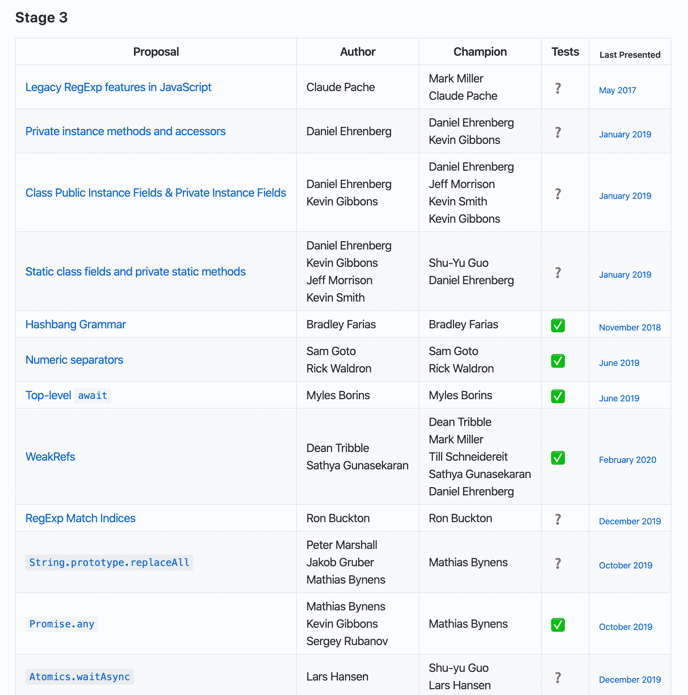

# 为什么 JavaScript 是未来的编程语言

> 原文：<https://www.freecodecamp.org/news/future-of-javascript/>

JavaScript 是我学会的第一门编程语言。嗯，其实我是从 HTML 和 CSS 开始的。就像许多其他 web 开发人员一样，使用 JavaScript 是显而易见的。这仅仅是因为它与 HTML 和 CSS 融合得如此之好，实际上也增强了你的 HTML/CSS 技能。我用各种其他编程语言开发过应用程序和游戏，包括 Java、Swift、C++、Dart。但是 JavaScript 提供的灵活性是无与伦比的——尽管它可能被认为对初学者不利，因为它提供了比完成简单任务所需更多的选项。

今天，JavaScript 是这个星球上最强大的语言之一，因为它的性能和无处不在。

就我个人而言，我觉得 JavaScript 有潜力进入许多热门行业，如机器学习和数据分析，Python 仍然主宰着游戏。甚至现在用 Tensorflow.js 这样的工具也在发生！

然而，以前 JavaScript 绝对不是这种情况。早期，它是一种弱的、非表演性的语言，不被人喜欢。JavaScript 是为“失败者”准备的。

但现在不是了。让我们看看 JavaScript 在过去的 10 年里是如何扭转局面的，为什么它变得比以往任何时候都更强大，为什么它会留在这里。

# V8:驱动 JavaScript 的野兽

V8 实际上是一个 JavaScript 引擎。你可能会问，什么是 JavaScript 引擎？JavaScript 引擎是执行 JavaScript 代码的解释器。JavaScript 引擎可以实现为标准解释器，或者将 JavaScript 编译成某种形式的字节码的实时(JIT)编译器。

V8 是 Google 开源的高性能 JavaScript 和 WebAssembly JIT 引擎，用 C++编写。它被用于 Chrome 和 Node.js 等等。V8 可以独立运行，也可以嵌入到任何 C++应用中。

这是一个高度优化你的 JS 代码并将其转换成机器代码供 CPU 执行的软件。V8 处理的一些任务是:

1.  碎片帐集
2.  编译成机器码
3.  内嵌缓存
4.  指针压缩
5.  和更多的优化

事实上，指针压缩是 V8 中的一项非常新的技术，用于促进内存优化，同时对性能没有任何影响。如果你是一个极客，你可以在 V8 官方博客上阅读更多关于它是如何实现的。

由此得出的结论是，您可以编写 JavaScript 并在晚上睡个好觉，因为您的 JS 代码掌握得非常好。

# 成熟的生态系统和社区

JavaScript 拥有编程语言可能拥有的最成熟的生态系统之一——如果不是最成熟的话。JavaScript 的社区非常庞大，进入门槛非常低。

你可以启动一个浏览器(100%的个人电脑上都有)，打开控制台，你会发现一个 JS 引擎在等着你运行代码！这是其他如此复杂的编程语言从来没有过的情况。

好像庞大的社区还不够，我们还有`npm`和`yarn`包系统。只要你说出它的名字，在`npm`注册中心就有一个包——从创建随机字符串到用 JavaScript 处理流和缓冲区的一切。JavaScript 开发人员中有一句非常著名的话:

> 用 JavaScript 能做的事情，最终也会用 JavaScript 来完成

很好笑，但是低调，我相信这个。

如果你作为一个初学者进入，你很少有机会遇到一个以前没有人遇到过的问题。这是因为简单的 JavaScript 问题的所有可能的错误可能已经在 Stack Overflow 等网站上被询问和存档了。

React、Angular 和 Vue 等框架和库为未来应用程序的构建铺平了道路。他们正在将视角转向声明式编程而不是命令式编程，转向“是什么”而不是“如何”。这使得开发人员可以开发高质量的应用程序，而不必担心底层的高性能代码。

## 无所不在

JavaScript 存在于:

1.  前端(浏览器)
2.  后端(节点，非节点)
3.  Android/iOS (React Native，NativeScript 等。)
4.  桌面(电子)
5.  混合(离子)

是什么让这成为可能？像 V8 这样的 JS 引擎都是用 C/C++写的，甚至可以在嵌入式系统上编译！对于其他平台，因为浏览器总是存在的(比如在 Andorid/iOS 上)，所以它们附带了一个 JS 引擎，可以用来运行任何 JS 代码，甚至是 React Native 中的本机应用程序。

## 前沿特性和进步

JavaScript 标准是由 ECMA-262 TC39 社区领导的，哇，这些人真快！ECMAScript 每年都会发布一个新的 JavaScript 标准(参见 ECMAScript2020 的新特性！).作为一名开发人员，你甚至可以要求在语言中加入新的特性。

例如，下面是一些悬而未决的前沿特性，它们可能会在不久的将来成为 JavaScript:

你可以在这里找到所有提案: [TC39 提案](https://github.com/tc39/proposals)。

## JavaScript 速度快且可伸缩

当然，没有什么比 C/C++/Rust 更好的了，但是 JavaScript 是一种速度很快的软件——从这个意义上来说，V8 可以通过监控代码的执行方式、延迟不使用的执行位以及优化反复使用的代码段来生成高度优化的代码。尤其是与 Python 等最接近的竞争对手相比。随着 V8 的进步，它的性能和内存效率变得更高。

JavaScript (Node)是高度可伸缩的(有 TypeScript 这样的超集)。在单线程架构上运行，人们经常批评 Node 缺乏线程环境，但事实是这并不重要。

扩展节点应用程序的方式与扩展多线程应用程序的方式不同。Node 的字面意思是“节点”——流程树中的单个节点。通过运行节点的多个实例并管理群集来扩展节点。

JavaScript 引领业界的异步事件驱动编程模型，并且不需要线程来扩展。相反，可以产生单独的节点进程来处理和利用整个 CPU 核心。稍后将详细介绍缩放节点！

## 结论

我喜欢 JavaScript，用它我为像你这样的开发者创建了一个开发平台。在那里，您不仅可以学习 JavaScript，还可以学习各种其他语言，如 C、C++、Java、Node、Python 等等！[免费加入此处](https://codedamn.com)，直接从浏览器中向其他开发人员学习！

JavaScript 将继续存在，并统治这个行业十年。你同意吗？在我的 [twitter](https://twitter.com/mehulmpt) 和 [Instagram](https://instagram.com/mehulmpt) 手柄上告诉我——让我们联系吧！