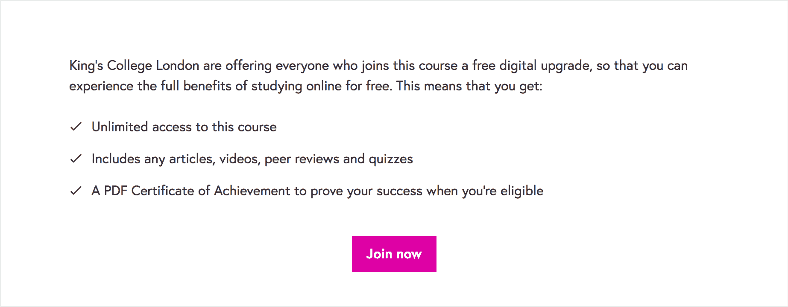

# 17 门仍然提供免费证书的课程

> 原文：<https://www.freecodecamp.org/news/futurelearn-free-certificate/>

啊，过去的好时光！早在 [Class Central](https://www.classcentral.com/) 开始覆盖[大规模开放在线课程(mooc)](https://www.classcentral.com/help/moocs)的时候，几乎所有的课程[证书都是免费的。然后，一个接一个，主要的 MOOC 平台开始为认证证书提供付费升级，然后几乎停止发放免费证书。](https://www.classcentral.com/report/death-of-free-certificates/)

这并不是说没有免费的好内容。事实上，Class Central 列出了超过 1150 门仍然完全免费的 Coursera 课程。我们还在[列出了近 400 门你可以免费选修的课程](https://www.classcentral.com/report/free-for-credit-moocs/)，这些课程基本上与在线学位课程中提供的学分课程相同。

事实证明，甚至有一些课程你仍然可以获得免费证书。在试图收集 FutureLearn 课程的定价数据时，我发现 FutureLearn 平台上有 17 门课程提供免费的“数字升级”，包括无限制地访问课程、测验和完成后的成绩证书。这些课程涵盖了从土壤科学到社交媒体的广泛主题。他们来自埃森哲这样的私人公司，英国文化协会这样的公共机构，以及伦敦大学国王学院这样受人尊敬的大学。

请参见下面的完整列表:

[****基础英语 1:初级****](https://www.classcentral.com/course/futurelearn-basic-english-1-elementary-11195)
**伦敦国王学院 via FutureLearn 学习**
通过这个在线课程学习日常情景的基础英语，提高你的听力技能。
★★★★☆ ( [1 评分](https://www.classcentral.com/course/futurelearn-basic-english-1-elementary-11195#reviews))

[****基础英语 2:预备中级****](https://www.classcentral.com/course/futurelearn-basic-english-2-pre-intermediate-11196)
**伦敦大学国王学院 via FutureLearn**
培养你在不同日常情境中使用的英语，并对你的听力技巧建立更多信心。
★★★★([1 评分](https://www.classcentral.com/course/futurelearn-basic-english-2-pre-intermediate-11196#reviews))

[****数字技能:网络分析****](https://www.classcentral.com/course/futurelearn-digital-skills-web-analytics-9779)
**埃森哲 via FutureLearn 学习**
了解分析在商业中的作用、使用的分析类型和技术以及它们的重要性。
★★★★([1 评分](https://www.classcentral.com/course/futurelearn-digital-skills-web-analytics-9779#reviews))

[****数字技能:社交媒体****](https://www.classcentral.com/course/futurelearn-digital-skills-social-media-9777)
**埃森哲 via FutureLearn 学习**
学习如何利用社交媒体开展业务，从创建社交媒体到衡量成功。
★★★☆☆ ( [2 评分](https://www.classcentral.com/course/futurelearn-digital-skills-social-media-9777#reviews))

[****关爱独自流动的儿童:保护无人陪伴和失散的儿童****](https://www.classcentral.com/course/futurelearn-caring-for-children-moving-alone-protecting-unaccompanied-and-separated-children-13484)
**斯特拉斯克莱德大学 via FutureLearn**
了解无人陪伴和失散的难民和移民儿童。

[****细菌基因组:使用 Artemis 比较工具的比较基因组学(ACT)****](https://www.classcentral.com/course/futurelearn-bacterial-genomes-comparative-genomics-using-artemis-comparison-tool-act-13645)
**惠康基因组校园 via FutureLearn**
学会使用比较基因组学来提高您对微生物基因组的认识。

[****数字技能:用户体验****](https://www.classcentral.com/course/futurelearn-digital-skills-user-experience-9780)
**埃森哲 via FutureLearn 学习**
了解为什么用户体验(UX)很重要，研究和设计基础知识，以及在 UX 使用的工具和测试技术

[****数字技能:零售****](https://www.classcentral.com/course/futurelearn-digital-skills-retail-9781)
**埃森哲 via FutureLearn 学习**
了解数字技术对零售业的影响以及对客户的意义。

[****创造更美好世界的理念:通过政策制定引领变革****](https://www.classcentral.com/course/futurelearn-ideas-for-a-better-world-leading-change-through-policymaking-13689)
**英国文化协会 via FutureLearn**
学习如何通过政策制定实现有效变革，并培养在该行业工作所需的技能。

[****数字技能:移动****](https://www.classcentral.com/course/futurelearn-digital-skills-mobile-9782)
**埃森哲 via FutureLearn 学习**
了解移动设计、开发和创造移动体验，以及与移动技术相关的更大概念。

[****什么是遗传咨询？****](https://www.classcentral.com/course/futurelearn-what-is-genetic-counselling-13700)
**威康基因组校园 via FutureLearn**
通过这个面向医疗保健专业人士的在线课程，了解遗传咨询以及如何成为一名遗传咨询师。

[****卫生系统强化****](https://www.classcentral.com/course/futurelearn-health-systems-strengthening-13711)
**墨尔本大学 via FutureLearn**
全球卫生需求系统强化干预措施的最大挑战与进展。

[****留学英国:准备在英国学习和生活****](https://www.classcentral.com/course/futurelearn-study-uk-prepare-to-study-and-live-in-the-uk-11784)
**英国文化协会 via FutureLearn**
让自己熟悉英国文化和高等教育，为英国大学学习做好准备。

[****公民科学:活的土壤，种植食物****](https://www.classcentral.com/course/futurelearn-citizen-science-living-soils-growing-food-10589)
**邓迪大学 via FutureLearn**
了解有助于土壤再生和解决环境问题的粮食种植方法。

[****护理入门:世界各地护士的角色****](https://www.classcentral.com/course/futurelearn-introduction-to-nursing-the-role-of-nurses-around-the-world-13231)
**伦敦国王学院 via FutureLearn**
了解护士的角色:从个人护理，到支持家庭和社区，到公共卫生和感染控制。

[****数字技能:发展你的职业****](https://www.classcentral.com/course/futurelearn-digital-skills-grow-your-career-9776)
**埃森哲 via FutureLearn 学习**
了解数字如何改变工作世界，以及如何在数字时代成功发展你的职业。

[****数字技能:数字营销****](https://www.classcentral.com/course/futurelearn-digital-skills-digital-marketing-9778)
**埃森哲 via FutureLearn 学习**
了解一些可供企业使用的不同数字营销策略和技巧。