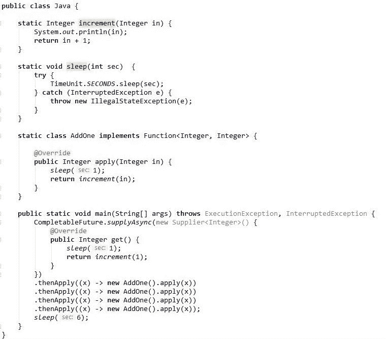

# Scala 让未来变得简单

> 原文：<https://www.freecodecamp.org/news/futures-made-easy-with-scala-da1beb3bb281/>

马丁·布迪

# Scala 让未来变得简单


Future 是一个抽象概念，用来表示异步操作的完成。今天，它在从 Java 到 Dart 的流行语言中被广泛使用。然而，随着现代应用程序变得越来越复杂，组合它们也变得越来越困难。Scala 使用了一种函数式方法，使得可视化和构建未来的组合变得容易。

这篇文章旨在以实用的方式解释基础知识。没有行话，没有外国术语。你甚至不需要成为一名 Scala 程序员。您只需要对一些高阶函数有所了解:map 和 foreach。所以让我们开始吧。

在 Scala 中，未来可以像这样简单地创建:

```
Future {"Hi"} 
```

现在让我们运行它，做一个“嗨世界”。

```
Future {"Hi"} .foreach (z => println(z + " World"))
```

就这些了。我们只是使用`foreach`运行了一个未来，稍微处理了一下结果，并将其打印到控制台上。

但是怎么可能呢？因此，我们通常将 foreach 和 map 与集合相关联:我们打开内容并对其进行修补。如果你观察它，它在概念上类似于我们想要解开`Future{}`的输出并操纵它的方式。为了让这发生，未来需要首先被完成，因此“运行”它。这是 Scala Future 函数组合背后的推理。

在实际应用中，我们希望同时协调不止一个，而是几个未来。一个特别的挑战是如何安排它们依次运行**或同时运行**。****

#### ******顺序运行******

****当几个期货像接力赛一样一个接一个开始时，我们称之为连续跑。典型的解决方案是简单地将一个任务放在前一个任务的回调中，这种技术被称为链接。这个概念是正确的，但它看起来并不漂亮。****

****在 Scala 中，我们可以使用 for-comprehension 来帮助我们抽象它。为了了解它的样子，让我们直接看一个例子。****

```
**`import scala.concurrent.ExecutionContext.Implicits.global

object Main extends App {

  def job(n: Int) = Future {
    Thread.sleep(1000)
    println(n) // for demo only as this is side-effecting 
    n + 1
  }

  val f = for {
    f1 <- job(1)
    f2 <- job(f1)
    f3 <- job(f2)
    f4 <- job(f3)
    f5 <- job(f4)
  } yield List(f1, f2, f3, f4, f5)
  f.map(z => println(s"Done. ${z.size} jobs run"))
  Thread.sleep(6000) // needed to prevent main thread from quitting 
                     // too early 
}`**
```

****首先要做的是导入 *ExecutionContext* ，它的作用是管理线程池。没有它，我们的未来将无法运行。****

****接下来，我们定义我们的“大作业”,它只需等待一秒钟，然后返回加 1 的输入。****

****然后，我们有我们的理解障碍。在这个结构中，里面的每一行用`&l` t 将一个作业的结果赋给一个值；-然后可用于任何随后的期货。我们已经安排好了我们的工作，所以除了第一个，每个人都接受前一个工作的产出。****

****此外，请注意，for-comprehension 的结果也是一个未来，其输出由 **yield 决定。**执行后，结果会在`map`里面。出于我们的目的，我们简单地将所有作业的输出放在一个列表中，并计算它的大小。****

****让我们运行它。****

****

Sequential run**** 

****我们可以看到五个期货一个接一个地被炒。需要注意的是，只有当未来依赖于先前的未来时，才应该使用这种安排。****

#### ******同时或并行运行******

****如果期货是相互独立的，那么它们应该同时启动。为此，我们将使用 *Future.sequence* 。这个名字有点混乱，但原则上它只是简单地接受一个未来的列表，并将其转换为一个列表的未来。然而，评估是异步完成的。****

****让我们创建一个混合顺序期货和平行期货的例子。****

```
**`val f = for {
  f1 <- job(1)
  f2 <- Future.sequence(List(job(f1), job(f1)))
  f3 <- job(f2.head)
  f4 <- Future.sequence(List(job(f3), job(f3)))
  f5 <- job(f4.head)
} yield f2.size + f4.size
f.foreach(z => println(s"Done. $z jobs run in parallel"))`**
```

****Future.sequence 获取我们希望同时运行的未来的列表。这里我们有包含两个并行作业的 f2 和 f4。因为输入 Future.sequence 的参数是一个列表，所以结果也是一个列表。在实际应用中，可以将结果组合起来用于进一步的计算。这里我们用`.head`从每个列表中取出第一个元素，然后分别传递给 f3 和 f5。****

****让我们来看看它的实际应用:****

****

Parallel run**** 

****我们可以看到 2 和 4 中的作业同时启动，这表明并行成功。值得注意的是，并行执行并不总是有保证的，因为它依赖于可用的线程。如果没有足够的线程，那么只有一些作业会并行运行。然而，其他的将会等到更多的线程被释放。****

#### ******从错误中恢复******

****Scala Future 整合了 **recover** ，当错误发生时充当备份 Future**。**这使得将来的合成即使失败也能完成。为了说明这一点，请考虑以下代码:****

```
**`Future {"abc".toInt}
.map(z => z + 1)`**
```

****当然，这是行不通的，因为“abc”不是 int。使用 **recover，**我们可以通过传递一个默认值来挽救它。让我们试着传递一个零:****

```
**`Future {"abc".toInt}
.recover {case e => 0}
.map(z => z + 1)`**
```

****现在代码将运行并产生一个结果。在写作中，我们可以像这样微调每个未来，以确保这个过程不会失败。****

****然而，也有我们想要明确拒绝错误的时候。为此，我们可以使用*future . successful 和 Future.failed* 来表示验证结果。如果我们不在乎单个的失败，我们可以定位 recover 来捕捉*组合中的任何*错误。****

****让我们使用 for-comprehension 编写另一段代码，检查输入是否是有效的 int 且小于 100。Future.failed 和 Future.successful 都是未来，所以我们不需要把它们放在一起。Future.failed 特别需要一个 *Throwable* ，所以我们将为大于 100 的输入创建一个自定义的 Throwable。将所有这些放在一起后，我们将得到如下内容:****

```
**`val input = "5" // let's try "5", "200", and "abc"
case class NumberTooLarge() extends Throwable()
val f = for {
   f1 <- Future{ input.toInt }
   f2 <- if (f1 > 100) {
            Future.failed(NumberTooLarge())
          } else {
            Future.successful(f1)
          }
} yield f2
f map(println) recover {case e => e.printStackTrace()}`**
```

****请注意 recover 的定位。使用这种配置，它将简单地拦截块内发生的任何错误。让我们用几个不同的输入“5”、“200”和“abc”来测试它:****

```
**`"5"   -> 5
"200" -> NumberTooLarge stacktrace
"abc" -> NumberFormatException stacktrace`** 
```

****“5”到达终点没有问题。“200”和“abc”抵达恢复。现在，如果我们想分别处理每个错误呢？这就是模式匹配发挥作用的地方。扩展恢复块，我们可以得到如下结果:****

```
**`case e => 
  e match {
    case t: NumberTooLarge => // deal with number > 100
    case t: NumberFormatException => // deal with not a number
    case _ => // deal with any other errors
  }
}`**
```

****您可能已经猜到了，但是像这样的全有或全无的情况在公共 API 中很常见。这种服务不会处理无效的输入，但需要返回一条消息来通知客户端他们做错了什么。通过分离异常，我们可以为每个错误传递一个定制的消息。如果你喜欢构建这样的服务(用一个非常快速的 web 框架)，请阅读我的文章。****

#### ****【Scala 之外的世界****

****我们已经谈论了很多关于 Scala Future 有多简单的话题。但真的是这样吗？要回答这个问题，我们需要看看在其他语言中是如何做到的。可以说最接近 Scala 的语言是 Java，因为两者都运行在 JVM 上。此外，Java 8 引入了具有 *CompletableFuture* 的并发 API，它也能够链接期货。让我们用它重做第一个序列示例。****

****

Sequential run in Java**** 

****那确实是很多东西。为了编写这个代码，我不得不在文档的众多方法中查找*supply sync*和*theapply*。即使我知道所有这些方法，它们也只能在 API 的上下文中使用。****

****另一方面，Scala Future 并不基于 API 或外部库，而是一个函数式编程概念，也用于 Scala 的其他方面。因此，通过在基础方面的初始投资，您可以获得更少的开销和更高的灵活性的回报。****

#### ****包扎****

****基本的就这些了。Scala 的未来还不止这些，但是我们已经为构建现实生活中的应用提供了足够的基础。如果你喜欢阅读更多关于 Future 或 Scala 的内容，一般来说，我会推荐 [Alvin Alexander 教程](https://alvinalexander.com/scala/how-use-multiple-scala-futures-in-for-comprehension-loop)、 [AllAboutScala](http://allaboutscala.com/tutorials/chapter-9-beginner-tutorial-using-scala-futures/) 和 [Sujit Kamthe 的文章](https://medium.com/beingprofessional/understanding-functor-and-monad-with-a-bag-of-peanuts-8fa702b3f69e)，它们提供了易于理解的解释。****