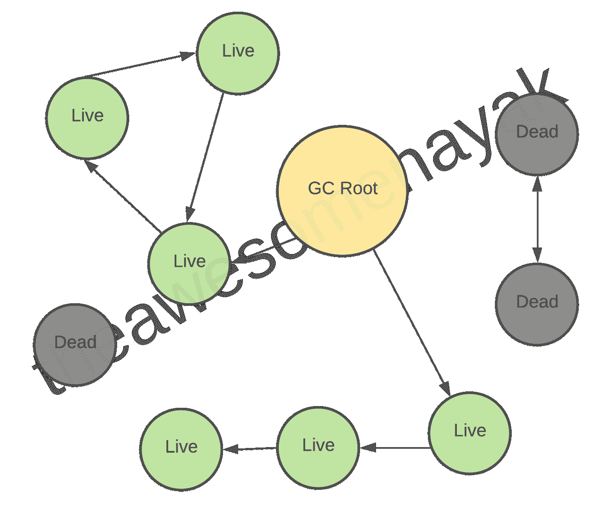
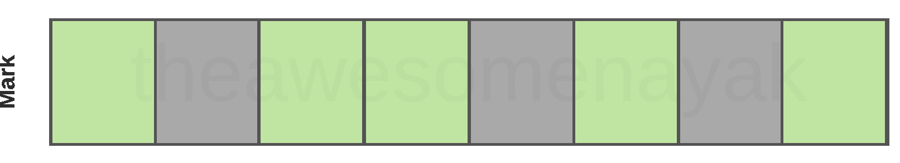
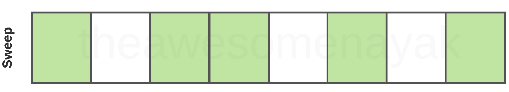
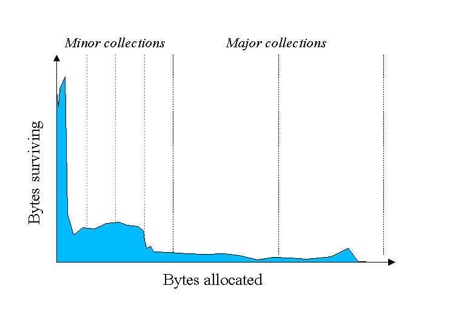
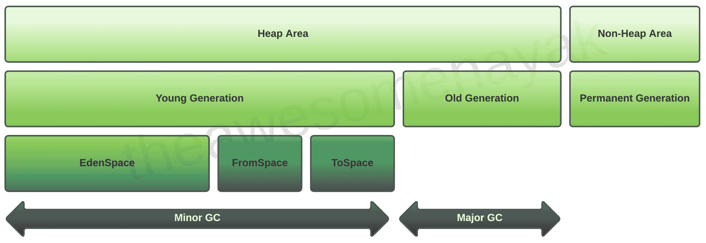
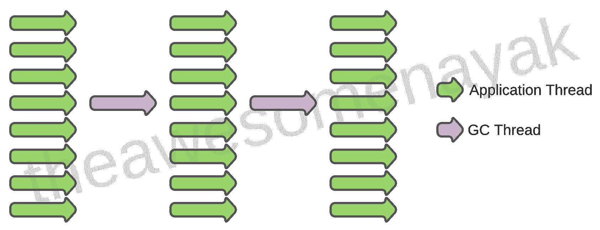
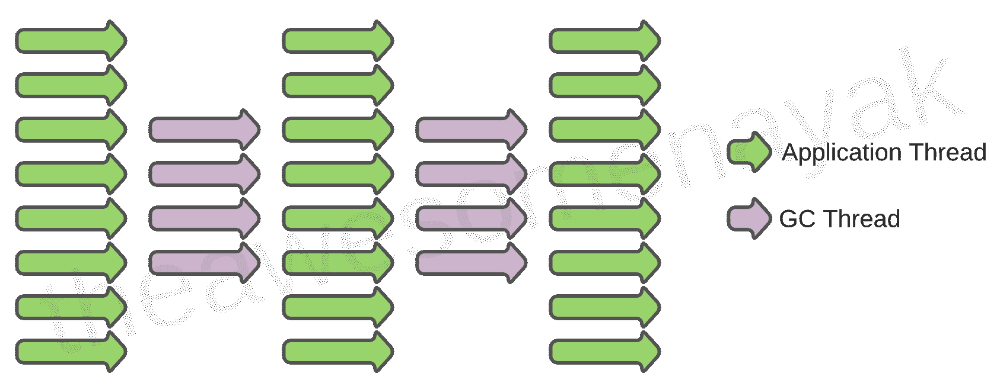
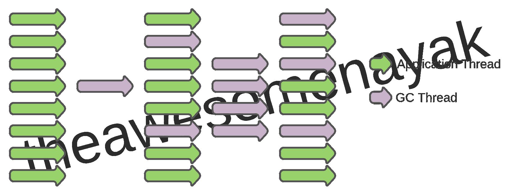
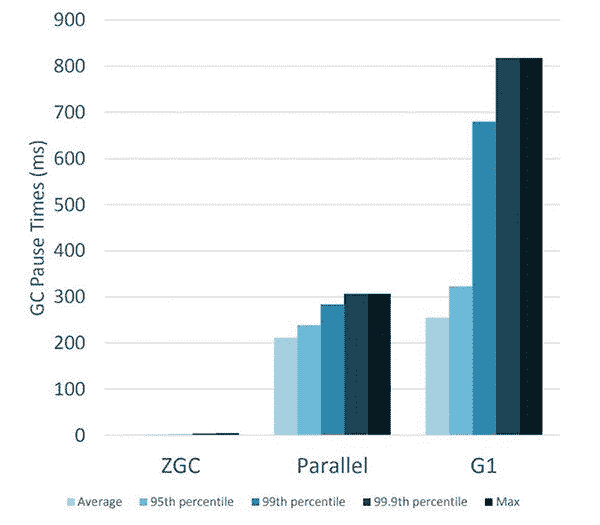

# Java 中的垃圾收集——什么是垃圾收集，它在 JVM 中是如何工作的

> 原文：<https://www.freecodecamp.org/news/garbage-collection-in-java-what-is-gc-and-how-it-works-in-the-jvm/>

在我之前的[文章](https://www.freecodecamp.org/news/jvm-tutorial-java-virtual-machine-architecture-explained-for-beginners/)中，我写了 Java 虚拟机(JVM)并解释了它的架构。作为执行引擎组件的一部分，我还简要介绍了 Java 垃圾收集器(GC)。

在本文中，您将了解更多关于垃圾收集器的知识，它是如何工作的，以及 Java 中可用的各种类型的 GC 及其优点。我还将介绍一些新的实验性垃圾收集器，它们在最新的 Java 版本中是可用的。

## Java 中的垃圾收集是什么？

垃圾收集是通过销毁未使用的对象来回收运行时未使用的内存的过程。

在像 C 和 C++这样的语言中，程序员负责对象的创建和销毁。有时，程序员可能会忘记销毁无用的对象，分配给它们的内存没有被释放。系统的已用内存不断增长，最终系统中没有剩余内存可供分配。这样的应用程序遭受“*内存泄漏*”的困扰。

在某个点之后，没有足够的内存用于创建新对象，并且整个程序由于 OutOfMemoryErrors 而异常终止。

您可以使用类似 C 中的`free()`和 C++中的`delete()`的方法来执行垃圾收集。在 Java 中，垃圾收集在程序的生命周期中自动发生。这消除了释放内存的需要，从而避免了内存泄漏。

Java 垃圾收集是 Java 程序执行自动内存管理的过程。Java 程序被编译成可以在 Java 虚拟机(JVM)上运行的字节码。

当 Java 程序在 JVM 上运行时，对象是在堆上创建的，堆是程序专用的一部分内存。

在 Java 应用程序的生命周期中，会创建和释放新的对象。最终，一些对象不再需要。可以说，在任何时间点，堆内存都由两种类型的对象组成:

*   *Live* -这些对象正在被其他地方使用和引用
*   *死亡* -这些对象不再被任何地方使用或引用

垃圾收集器找到这些未使用的对象，并删除它们以释放内存。

## 如何在 Java 中解引用一个对象

垃圾收集的主要目的是通过销毁不包含引用的对象来释放堆内存。当没有对一个对象的引用时，它被认为是死的，不再需要。因此对象占用的内存可以被回收。

有多种方法可以释放对对象的引用，使其成为垃圾收集的候选对象。其中一些是:

### 通过使引用为空

```
Student student = new Student();
student = null;
```

### 通过将引用分配给另一个

```
Student studentOne = new Student();
Student studentTwo = new Student();
studentOne = studentTwo; // now the first object referred by studentOne is available for garbage collection
```

### 通过使用匿名对象

```
register(new Student());
```

## Java 中的垃圾收集是如何工作的？

Java 垃圾收集是一个自动的过程。程序员不需要明确标记要删除的对象。

垃圾收集实现存在于 JVM 中。每个 JVM 都可以实现自己的垃圾收集版本。但是，它应该满足标准的 JVM 规范，即处理堆内存中存在的对象，标记或识别不可到达的对象，并通过压缩销毁它们。

## Java 中的垃圾收集根是什么？

垃圾收集器基于*垃圾收集根* (GC 根)的概念来识别活的和死的对象。

这种垃圾收集根的示例有:

*   由系统类装入器装入的类(不是自定义类装入器)
*   活动线程
*   当前正在执行的方法的局部变量和参数
*   JNI 方法的局部变量和参数
*   全球 JNI 参考
*   用作同步监视器的对象
*   JVM 出于自身目的从垃圾收集中保留的对象

垃圾收集器遍历内存中的整个对象图，从这些垃圾收集根开始，沿着从根到其他对象的引用。



## Java 中的垃圾收集阶段

标准的垃圾收集实现包括三个阶段:

### 将对象标记为活动的

在这一步中，GC 通过遍历对象图来识别内存中所有的*活动*对象。

当 GC 访问一个对象时，它将它标记为可访问的，因此是活动的。垃圾收集器访问的每个对象都被标记为活动的。所有不能从 GC 根目录到达的对象都是垃圾，被认为是垃圾收集的候选对象。



### 清扫死亡物体

在标记阶段之后，我们有了被活的(已访问的)和死的(未访问的)对象占据的内存空间。扫描阶段释放包含这些死对象的内存碎片。



### 压缩内存中剩余的对象

在扫描阶段移除的死物体不一定彼此相邻。因此，您最终可能会拥有碎片化的内存空间。

在垃圾收集器删除死对象后，可以压缩内存，以便剩余的对象位于堆开始处的连续块中。

压缩过程使得按顺序为新对象分配内存变得更加容易。


## Java 中什么是分代垃圾收集？

Java 垃圾收集器实现了一种分代垃圾收集策略,它根据年龄对对象进行分类。

必须标记和压缩 JVM 中的所有对象是低效的。随着分配的对象越来越多，对象列表也会增长，导致垃圾收集时间变长。对应用程序的经验分析表明，Java 中的大多数对象都是短命的。



Source: oracle.com

在上面的例子中，Y 轴显示分配的字节数，X 轴显示一段时间内分配的字节数。如您所见，随着时间的推移，分配的对象越来越少。

事实上，大多数物体的寿命都很短，如图表左侧较高的值所示。这就是为什么 Java 将对象分类成代，并相应地执行垃圾收集。

JVM 中的堆内存区域分为三个部分:



## 年轻一代

新创建的对象从年轻一代开始。年轻一代进一步细分为:

*   伊甸园空间 -所有新对象都从这里开始，初始内存分配给它们
*   **幸存者空间(FromSpace 和 ToSpace)** -在幸存一个垃圾收集周期后，对象从伊甸园移到这里。

当对象是从年轻一代开始的垃圾收集时，它是一个*小垃圾收集事件*。

当 Eden 空间充满对象时，会执行一次小的 GC。所有死的对象被删除，所有活的对象被移动到一个幸存者空间。Minor GC 还检查幸存者空间中的对象，并将它们移动到另一个幸存者空间。

以下面的序列为例:

1.  伊甸园拥有所有的对象(活的和死的)
2.  发生小规模的垃圾收集——所有死对象都从 Eden 中移除。所有活的物体都被移到 S1(来自太空)。伊甸园和 S2 现在都空了。
3.  新对象被创建并添加到 Eden 中。伊甸园和 S1 中的一些物品变得死气沉沉。
4.  小规模的垃圾收集发生了——所有死亡的对象都被从伊甸园和 S1 中移除。所有活的物体都被移到 S2 (ToSpace)。伊甸园和 S1 现在都空了。

所以，在任何时候，总有一个幸存者空间是空的。当幸存对象达到在幸存空间周围移动的某个阈值时，它们被移动到老一代。

您可以使用`-Xmn`标志来设置年轻一代的规模。

## 老一代

长寿的对象最终从年轻一代转移到老一代。这也称为保留生成，包含在幸存者空间中保留了很长时间的对象。

为对象的期限定义了一个阈值，该阈值决定了在将对象转移到旧代之前，它可以存活多少个垃圾收集周期。

当对象是从老一代开始的垃圾收集时，这是一个*重大垃圾收集事件*。

您可以使用`-Xms`和`-Xmx`标志来设置堆内存的初始大小和最大大小。

因为 Java 使用分代垃圾收集，所以一个对象存活的垃圾收集事件越多，它在堆中得到的提升就越大。它开始于年轻的一代，如果存活的时间足够长，最终会在终身任职的一代结束。

请考虑以下示例，以了解对象在空间和层代之间的升级:

当一个对象被创建时，它首先被放入 ****年轻一代**** 的 ****伊甸园空间**** 。一旦发生小规模的垃圾收集，来自 **Eden** 的活动对象将从空间提升到**。当下一次小的垃圾收集发生时，来自空间**的**伊甸园**和**的活动对象被移动到**目标空间**。**

这个循环持续特定的次数。如果该对象在该点之后仍然被使用，下一个垃圾收集周期将把它移动到 ****老代**** 空间。

## 永久世代

诸如类和方法之类的元数据存储在永久层代中。它由 JVM 在运行时根据应用程序使用的类来填充。不再使用的类可能是从永久代中收集的垃圾。

您可以使用`-XX:PermGen`和`-XX:MaxPermGen`标志来设置永久代的初始和最大大小。

## MetaSpace

从 Java 8 开始，**元空间**内存空间取代了 **PermGen** 空间。实现不同于 PermGen，堆的这个空间现在会自动调整大小。

这避免了应用程序由于堆的永久空间大小有限而耗尽内存的问题。元空间内存可以进行垃圾收集，当元空间达到其最大大小时，不再使用的类可以自动清理。

[https://www.youtube.com/embed/X1DkoRGVRp4?feature=oembed](https://www.youtube.com/embed/X1DkoRGVRp4?feature=oembed)

## Java 虚拟机中垃圾收集器的类型

垃圾收集提高了 Java 内存的效率，因为它从堆内存中移除了未被引用的对象，并为新对象释放了空间。

Java 虚拟机有八种类型的垃圾收集器。让我们详细看看每一个。

## 串行 GC

这是 GC 最简单的实现，是为运行在单线程环境中的小型应用程序设计的。所有垃圾收集事件都在一个线程中连续进行。压缩在每次垃圾收集后执行。



当它运行时，会导致一个“停止世界”事件，整个应用程序暂停。由于整个应用程序在垃圾收集期间被冻结，所以在要求低延迟的真实场景中，不建议这样做。

使用串行垃圾收集器的 JVM 参数是`-XX:+UseSerialGC`。

## 并行 GC

并行采集器适用于在多处理器或多线程硬件上运行的中型到大型数据集的应用程序。这是 JVM 中 GC 的默认实现，也称为吞吐量收集器。

在年轻一代中，多线程用于较小的垃圾收集。在老一代中，单个线程用于主要的垃圾收集。



运行并行 GC 还会导致“停止世界事件”和应用程序冻结。因为它更适合多线程环境，所以可以在需要完成大量工作并且可以接受长时间暂停的情况下使用，例如运行批处理作业。

使用并行垃圾收集器的 JVM 参数是`-XX:+UseParallelGC`。

## 并行旧 GC

这是 Java 7u4 以来默认的并行 GC 版本。除了年轻一代和老一代都使用多线程之外，它与并行 GC 相同。

使用并行垃圾收集器的 JVM 参数是`-XX:+UseParallelOldGC`。

## CMS(并发标记清除)GC

这也称为并发低暂停收集器。多线程用于少量垃圾收集，使用与并行相同的算法。主要的垃圾收集是多线程的，就像传统的并行垃圾收集一样，但是 CMS 与应用程序进程同时运行，以最大限度地减少“停止世界”事件。



因此，CMS 收集器比其他 GC 使用更多的 CPU。如果您可以分配更多的 CPU 以获得更好的性能，那么 CMS 垃圾收集器是比并行收集器更好的选择。CMS GC 中不执行压缩。

使用并发标记清除垃圾收集器的 JVM 参数是`-XX:+UseConcMarkSweepGC`。

## G1(垃圾优先)

G1GC 旨在替代 CMS，是为具有大堆大小(大于 4GB)的多线程应用程序而设计的。它像 CMS 一样是并行和并发的，但是与旧的垃圾收集器相比，它的工作方式非常不同。

尽管 G1 也是分代的，但它并没有区分年轻一代和年老一代。相反，每一代是一组区域，这允许以灵活的方式调整年轻一代的大小。

它将堆划分为一组大小相等的区域(1MB 到 32MB——取决于堆的大小),并使用多个线程来扫描它们。在程序运行期间的任何时候，一个区域可能是旧区域，也可能是新区域。

在标记阶段完成后，G1 知道哪些区域包含最多的垃圾对象。如果用户对最短的暂停时间感兴趣，G1 可以选择只疏散几个地区。如果用户不担心暂停时间或者已经陈述了一个相当大的暂停时间目标，G1 可能会选择包含更多的区域。

因为 G1GC 会识别垃圾最多的区域，并首先对该区域执行垃圾收集，所以它被称为垃圾优先。


除了 Eden、Survivor 和 Old memory 区域，G1GC 中还有两种类型的区域:

*   *巨大的* -用于大尺寸对象(大于堆大小的 50%)
*   *可用空间* -未使用或未分配的空间

使用 G1 垃圾收集器的 JVM 参数是`-XX:+UseG1GC`。

## Epsilon 垃圾收集器

Epsilon 是一个什么都不做(no-op)的垃圾收集器，作为 JDK 11 的一部分发布。它处理内存分配，但不实现任何实际的内存回收机制。一旦可用的 Java 堆耗尽，JVM 就会关闭。

它可以用于对延迟极其敏感的应用程序，在这些应用程序中，开发人员确切地知道应用程序的内存占用，甚至拥有(几乎)完全无垃圾的应用程序。否则，不鼓励在任何其他情况下使用 Epsilon GC。

使用 Epsilon 垃圾收集器的 JVM 参数是`-XX:+UnlockExperimentalVMOptions -XX:+UseEpsilonGC`。

## 谢南多厄河

Shenandoah 是一个新的 GC，作为 JDK 12 的一部分发布。Shenandoah 相对于 G1 的主要优势是，它与应用程序线程同时进行更多的垃圾收集周期工作。G1 只能在应用程序暂停时清空其堆区域，而 Shenandoah 可以在应用程序运行的同时重新定位对象。

Shenandoah 可以压缩活动对象，清理垃圾，并在检测到空闲内存后几乎立即将 RAM 释放回操作系统。因为所有这些都是在应用程序运行时并发发生的，所以 Shenandoah 更加占用 CPU 资源。

使用 Epsilon 垃圾收集器的 JVM 参数是`-XX:+UnlockExperimentalVMOptions -XX:+UseShenandoahGC`。

## ZGC

ZGC 是作为 JDK 11 的一部分发布的另一个 GC，并在 JDK 12 中得到改进。它适用于要求低延迟(小于 10 毫秒的暂停)和/或使用非常大的堆(数 TB)的应用程序。

ZGC 的主要目标是低延迟、可伸缩性和易用性。为了实现这一点，ZGC 允许 Java 应用程序在执行所有垃圾收集操作的同时继续运行。默认情况下，ZGC 取消对未使用内存的提交，并将其返回给操作系统。

因此，ZGC 通过提供极低的暂停时间(通常在 2 毫秒之内)带来了优于其他传统 GC 的显著改进。



Source: oracle.com

使用 Epsilon 垃圾收集器的 JVM 参数是`-XX:+UnlockExperimentalVMOptions -XX:+UseZGC`。

**注:**谢南多厄和 ZGC 都计划在 JDK 15 进行生产，并退出实验阶段。

## 如何选择正确的垃圾收集器

如果您的应用程序没有严格的暂停时间要求，您应该运行您的应用程序并允许 JVM 选择正确的收集器。

大多数时候，默认设置应该就可以了。如有必要，您可以调整堆大小以提高性能。如果性能仍然不能满足您的目标，您可以根据您的应用要求修改收集器:

*   **Serial** -如果应用程序有一个小数据集(大约 100 MB)和/或它将在一个没有暂停时间要求的处理器上运行
*   **并行** -如果应用程序的最高性能是优先考虑的，并且没有暂停时间要求，则一秒或更长时间的暂停是可以接受的
*   **CMS/G1** -如果响应时间比整体吞吐量更重要，垃圾收集暂停必须保持在大约一秒钟以内
*   **ZGC**——如果响应时间是一个高优先级，并且/或者您正在使用一个非常大的堆

## 垃圾收集的优势

Java 中的垃圾收集有很多好处。

首先，它使你的代码变得简单。您不必担心适当的内存分配和释放周期。您只需在代码中停止使用某个对象，它所使用的内存就会在某个时候被自动回收。

使用没有垃圾收集的语言(如 C 和 C++)的程序员必须在他们的代码中实现手动内存管理。

它还使 Java 内存高效，因为垃圾收集器从堆内存中移除未引用的对象。这将释放堆内存来容纳新对象。

虽然一些程序员认为手动内存管理优于垃圾收集，但垃圾收集现在是许多流行编程语言的标准组件。

对于垃圾收集器对性能产生负面影响的场景，Java 提供了许多选项来调优垃圾收集器，以提高其效率。

## 垃圾收集最佳实践

### 避免手动触发

除了垃圾收集的基本机制之外，关于 Java 中的垃圾收集，需要理解的最重要的一点是它是不确定的。这意味着在运行时没有办法预测垃圾收集何时发生。

可以在代码中包含使用`System.gc()`或`Runtime.gc()`方法运行垃圾收集器的提示，但是它们不能保证垃圾收集器会实际运行。

### 使用工具进行分析

如果您没有足够的内存来运行您的应用程序，您将会遇到速度变慢、长时间的垃圾收集、“停止世界”事件，并最终出现内存不足的错误。这可能表明您的堆太小，但也可能意味着您的应用程序中存在内存泄漏。

你可以从像`jstat`或 *Java 飞行记录器*这样的监控工具中获得帮助，看看堆的使用是否无限增长，这可能表明你的代码中有一个 bug。

### 默认设置是好的

如果您正在运行一个小型的独立 Java 应用程序，您很可能不需要任何类型的垃圾收集调优。默认设置应该就可以了。

### 使用 JVM 标志进行调优

调优 Java 垃圾收集的最佳方法是在 JVM 上设置标志。标志可以调整要使用的垃圾收集器(例如串行、G1 等等)、堆的初始和最大大小、堆段的大小(例如年轻代、老代)等等。

### 选择正确的收集器

被调优的应用程序的性质是设置的良好初始指南。例如，并行垃圾收集器是高效的，但会频繁地导致“停止世界”事件，这使它更适合后端处理，在后端处理中，长时间的垃圾收集暂停是可以接受的。

另一方面，CMS 垃圾收集器旨在最大限度地减少暂停，使其成为基于 web 的应用程序的理想选择，在这些应用程序中，响应是非常重要的。

[https://www.youtube.com/embed/4sBhc-pSILs?feature=oembed](https://www.youtube.com/embed/4sBhc-pSILs?feature=oembed)

## 结论

在本文中，我们讨论了 Java 垃圾收集，它是如何工作的，以及它的各种类型。

对于许多简单的应用程序来说，Java 垃圾收集不是程序员需要有意识地考虑的事情。然而，对于想要提高 Java 技能的程序员来说，理解 Java 垃圾收集是如何工作的非常重要。

这也是一个非常受欢迎的面试问题，无论是初级还是高级后端角色。

谢谢你一直陪着我。希望你喜欢这篇文章。你可以在 LinkedIn 上和我联系，我经常在那里讨论技术和生活。也看看一些[我的其他文章](https://www.freecodecamp.org/news/author/theawesomenayak/)和我的 [YouTube 频道](https://www.youtube.com/channel/UCmWAaPgfWAkl-Jep5mY-NNg?sub_confirmation=1)。快乐阅读。🙂