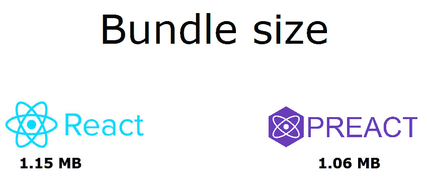
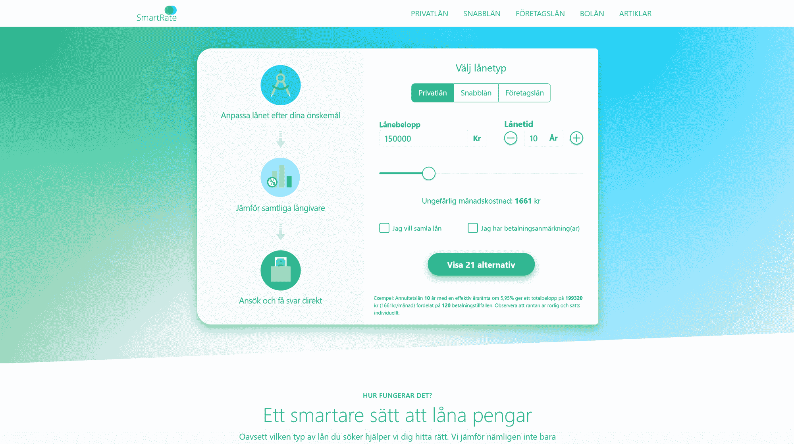
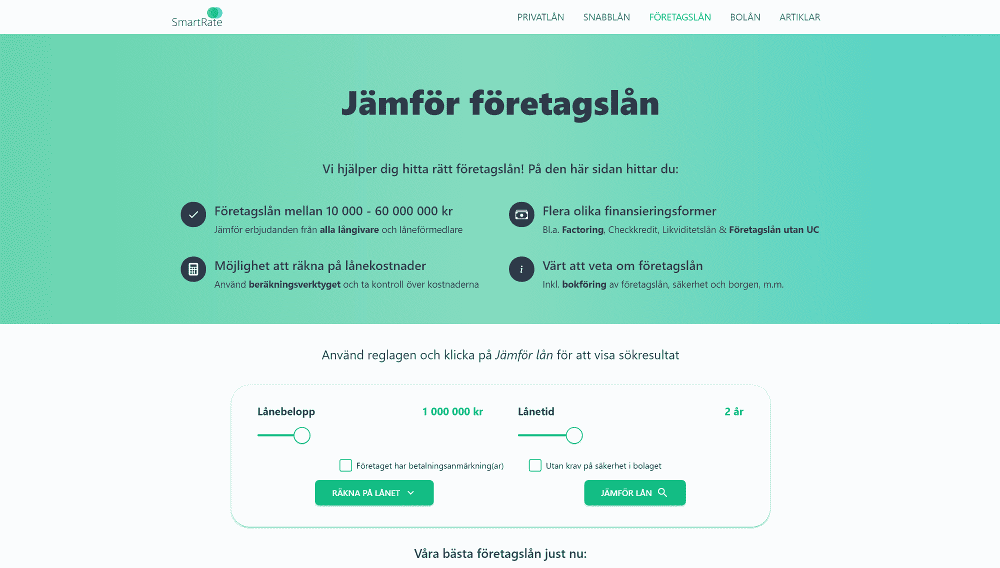
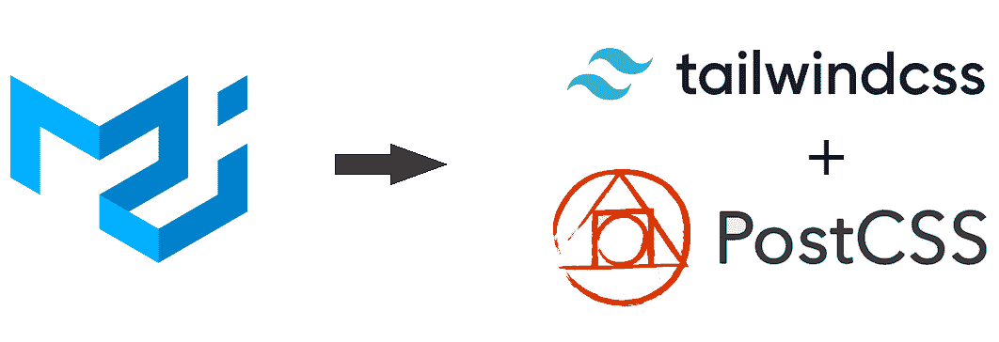
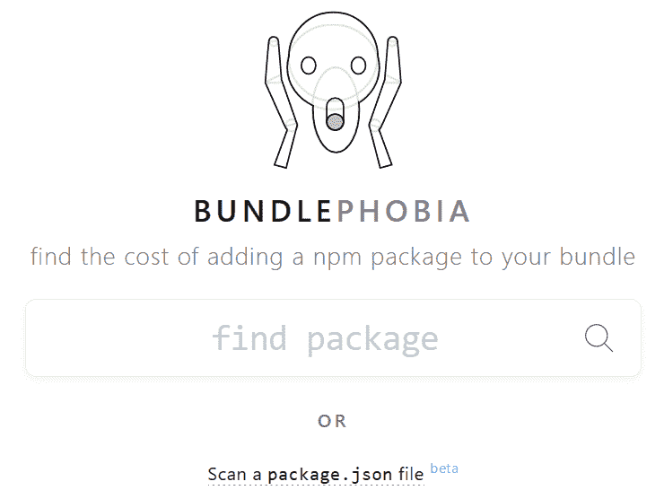
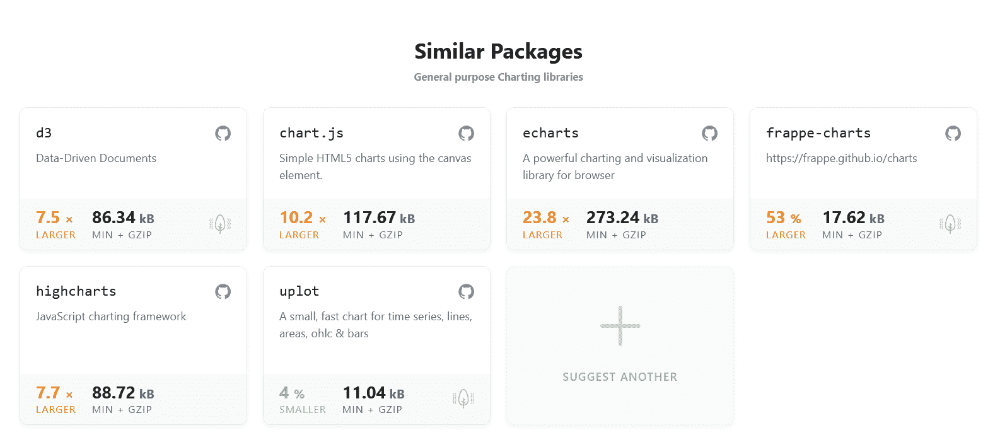
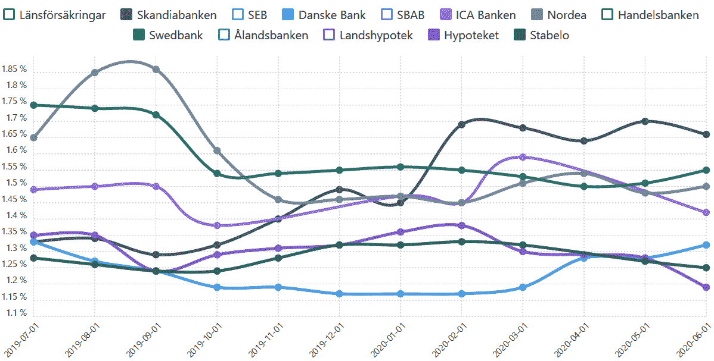
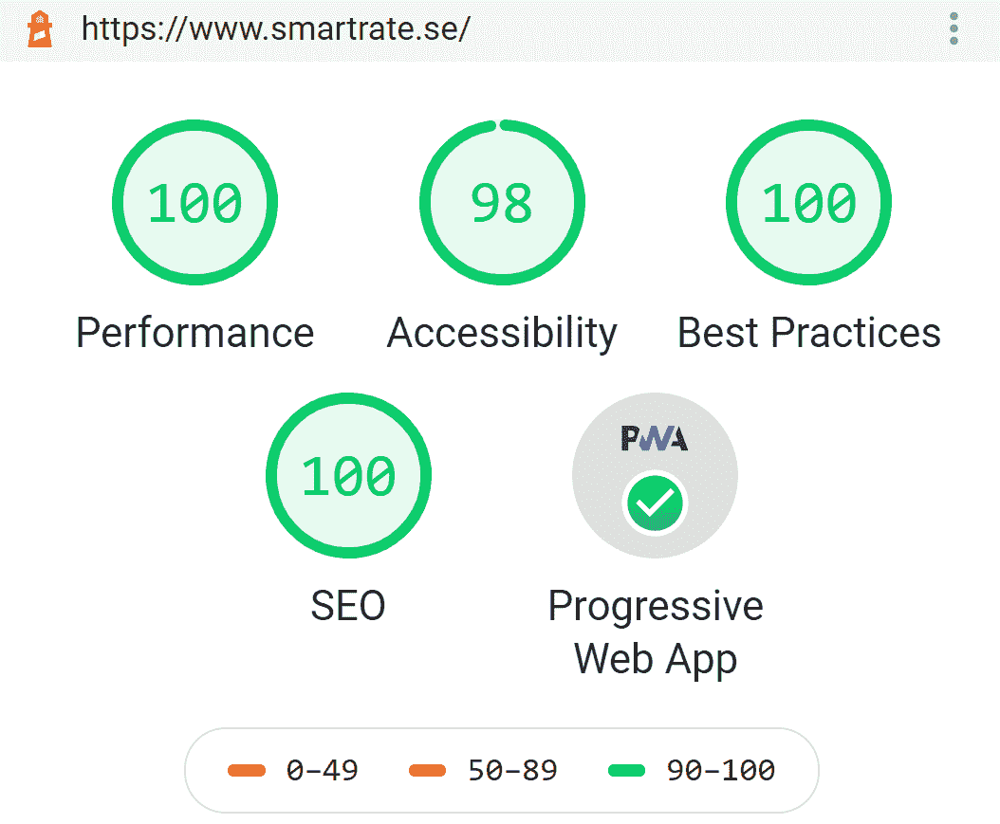

# 你的盖茨比网站如何在版本 6 更新后获得完美的谷歌灯塔评分

> 原文：<https://www.freecodecamp.org/news/gatsby-perfect-lighthouse-score/>

Google Lighthouse 是一款免费的搜索引擎优化工具，用于确定网站的整体健康状况。

输入你的网址，Google Lighthouse 会对你网站的*性能指标*进行评分，包括页面速度、可访问性、最佳实践和页面搜索引擎优化。

随着今年早些时候 **Lighthouse 版本 6** 的发布，许多开发者**发现他们网站的性能指标大幅下降**。

这对于使用流行的基于 React 的框架 GatsbyJS 的开发人员社区来说尤其令人震惊，该框架因其速度和性能而受到称赞。

作为一名 GatsbyJS 开发人员，我也感到困惑。我们已经习惯了看到那些甜蜜的、绿色的、90+的表现评级，而对我们来说并没有太多的努力。

然而，在版本 6 更新后，我们的网站跌入橙色，跌至 60 分！我们中的一些人甚至经历了红色，[低于 40 分分数](https://github.com/gatsbyjs/gatsby/issues/24332)。

我想和你分享我为了重新达到完美的 100 谷歌灯塔分数而采取的步骤。

## 第一步。快速简单的解决方法:切换到 Preact

随着 Lighthouse version 6 的[发布，引入了三个新的性能指标:最大内容绘制(LCP)、累积布局偏移(CLS)和总阻塞时间(TBT)。](https://web.dev/lighthouse-whats-new-6.0/)

在搜索了 [Gatsby Github repo](https://github.com/gatsbyjs/gatsby) 以及 Lighthouse docs 之后，似乎很明显*的总阻塞时间* (TBT)是阻碍许多网站性能得分的罪魁祸首。

[总阻塞时间](https://web.dev/tbt/) (TBT)定义为第一次内容丰富的绘画(FCP)和交互时间(TTI) 之间的*总时间。*

简单来说，TBT 是衡量浏览器的*主线程*被长任务阻塞多长时间的指标，比如解析 JavaScript (JS)。

也就是说，任何减少 JS 数量以及 JS 执行时间的措施都会通过减少 TBT 对网站性能产生积极影响。

Preact 是一个小的(3kb)，[快速替代反应](https://preactjs.com/)。感谢 [gatsby-plugin-preact](https://www.gatsbyjs.com/plugins/gatsby-plugin-preact/) ，将你的 Gatsby-site 从运行 react 切换到 preact 非常容易。

导航到您的项目根目录，并使用 NPM 安装以下软件包:

```
npm install --save gatsby-plugin-preact preact preact-render-to-string 
```

...或纱线:

```
yarn add gatsby-plugin-preact preact preact-render-to-string 
```

然后简单补充一下

```
...
`gatsby-plugin-preact`,
... 
```

你的 gatsby-config.js

那就跑

```
yarn gatsby build 
```

如果您使用 [webpack bundle analyzer](https://www.gatsbyjs.com/plugins/gatsby-plugin-webpack-bundle-analyser-v2/) ，您现在应该会看到一个大约 100kb 的小 bundle！不错吧。

看看下图中这个开关对我们的包大小的影响。



An 8 percent decrease in bundle size for one line of code - not bad!

切换到 Preact 应该会将您的绩效分数提高大约 **5-10 分**。

## 第二步。重新考虑*英雄形象*的必要性

另一个让我们的网站 [SmartRate](https://www.smartrate.se/) 在性能方面大获全胜的指标是[最有内容的绘画](https://web.dev/lcp/) (LCP)。

LCP 是测量*感知负载速度*的指标。加上总阻塞时间，LCP 和 TBT 占 Lighthouse 性能总得分的 50%。

记住这一点，即使使用 webp 格式进行优化，覆盖 80%折叠的图像也会对 LCP 度量产生负面影响，这并不奇怪。

我们调整了英雄图像，通过禁用淡入并将加载从默认参数(lazy)切换到 eager，取得了部分成功:

```
 
```

然而，在 Lighthouse 中，改进只是边缘性的，几乎不明显(大约 2-4 分)，所以我们决定重组和重新思考。

我们英雄形象的真正目的是什么？

英雄形象通常用来抓住用户的注意力，并传达一个中心信息来强化你的品牌。

然而，在我们的例子中，这不是我们使用折叠的方式。



A screenshot of the fold as it looks today, showing the *hero-unit* and user-input area.

从图中可以看到，*文件夹*专用于*用户输入*。我们在当前照片之前使用的英雄形象只是一张模糊的照片，目的是给照片增添一些氛围。

经过一点思考，我们意识到我们不能证明使用英雄形象的合理性，因为它对我们的绩效指标有负面影响。

相反，受 Spotify.com 等网站的启发，我们决定使用 SVG 背景。

这个决定将初始页面负载的大小减少了 65kb！

从大约 67kb 的优化 webp 图像到同样大小的仅 2kb 的 SVG。

在发现这一解决方案完全解决了我们的 LCP 指标问题后，我们很快放弃了使用我们最重要的子页[中的*英雄形象*-商业贷款的想法。](https://www.smartrate.se/foretagslan/)



Current sub-page design utilizing a hero-unit (although not a hero-image)

对于这个，以及我们的其他子页面，我们选择了微妙的三色 CSS 渐变，以使*英雄消息*突出。

这种解决方案可能不如使用定制的图像那么时髦，但是它确实有效，并且极大地改进了我们的子页面的 LCP。

这让我想到...

### 如果你的网站使用英雄形象，关键的考虑因素

根据我们的经验，放弃英雄图像而选择 SVG 或 CSS 背景将会解决由低 LCP 分数引起的问题。

然而，根据你英雄单位的目的，这个解决方案可能并不适合你。

所以，在你决定做什么之前，你应该考虑几件事:

*   英雄形象**是为你的网站**定制的**还是库存照片**？
*   英雄形象给你的品牌增加价值了吗？
*   在**你的网站**上折叠的目的是什么？

如果你的英雄形象为你的网站增加了巨大的品牌价值，也许为了更好的表现而进行的交易是不值得的。

然而，如果你准备好尝试我的建议，你会很高兴听到以下资源。

### SVG 背景的绝佳资源

下面我为那些想从使用英雄形象转向使用 SVG/CSS 模式的人整理了一个有价值的资源和工具的简短列表:

*   Steve Schoger
    开发的英雄模式一个提供多种可定制 SVG 模式的伟大工具。

*   另一个免费的 SVG 模式图库。

*   杰克·阿奇博尔德
    的 SVGOMG 一个伟大的，免费的缩小 SVG 文件的资源。都是为了减少
    这些 kb，对吗？

下一步更具情境性，但是对于那些使用 UI 库的人来说，仍然与*非常相关*。对我们来说，这一步与改进指标的前两步一样重要。

## 第三步。用于尾翼的拖放材料 UI

让我直截了当地声明，我是 [Material UI](https://material-ui.com/) 的超级粉丝。我并不是唯一这样想的人。直到最近，MUI 一直是 Github 上最受欢迎的 React UI 库(目前排名第二)。

当我们开始开发我们的站点时，设计完全基于 MUI 组件。

唯一的问题是，*它降低了站点*的性能。

很多。

尤其是对于移动用户。

在 Lighthouse 版本 6 发布后，由于非常高的*总阻塞时间* (TBT)，我们根本无法获得 70 分以上的移动性能评级。

起初，我们所做的一切似乎都无关紧要。我们甚至尝试使用[可加载组件](https://loadable-components.com/docs/code-splitting/)进行代码拆分，以及惰性加载非必要的有效负载。

经过一番挖掘之后，**我们发现材质 UI 是性能下降的根源**。

在页面渲染过程中，布局计算(和重新计算)似乎无处不在，这导致 TBT 增加。

我们开始一个接一个地移除 MUI 组件，但是这并没有改善性能。

最后，我们只剩下一个 MUI 组件和一个近乎干净的样板网站。

我们仍然经历着低性能评级。

这怎么可能？

嗯，正如它所显示的那样，导入一个单一的 MUI 组件会将整个素材 UI 库引入到包中。加载登录页面需要用户下载材料 UI 的整个 CSS 和 JS。

但是我能听到你说[摇树](https://webpack.js.org/guides/tree-shaking/)呢？

对此，我只能回应说，我们遵循了 MUI 的建议来最小化包的大小。然而，我们的努力没有得到回报。

通过删除最后一个 MUI 导入，我们注意到**包大小惊人地减少了约 170kb！**

最后，我们网站的表现飙升到绿色，90+点，*甚至在移动！*

TBT 现在不存在了，但我们网站的布局也不存在了。

因此，我们开始寻找替代方案，我记得不久前曾读到过 TailwindCSS 与 Gatsby 的整合。

引起我注意的一个短语是*“清除你的 CSS”*。

PurgeCSS ，现在内置在 TailwindCSS 中，做你认为它做的事情——删除未使用的 CSS！

完美。



By transitioning from Material UI to TailwindCSS, we could obtain a material-ish design *with* a great performance score.

简单地遵循盖茨比文档中的[顺风安装指南就足以让我们开始了。我们通过 PostCSS 使用 Tailwind 慢慢开始设计看起来像材质的组件。](https://www.gatsbyjs.com/docs/tailwind-css/)

不如 MUI 组件好看，但也相差不远。考虑到巨大的性能提升，这是完全值得的。

对于完全的初学者，我必须说使用 **Tailwind 设计组件是令人惊讶的直观**。你很快就掌握了窍门。

### 重新连接到第一步

使用 Preact 而不是 react 的另一个小好处是可以使用 class 参数而不是 className 参数(仍然有效)。这使得设计组件变得更快——尤其是从他们的官方网站上复制 markdown 的时候。

如果您决定放弃 Material UI、Bootstrap 或其他任何您正在使用的基于 React 的 UI 库，转而使用 Tailwind，您会很高兴了解以下资源:

*   由 TailwindCSS 的创造者制作的 Tailwind UI 是一个 repo，在这里你可以找到漂亮的、预先设计好的组件。其中有几个可以免费使用。
*   [Tailwind Components](https://tailwindcomponents.com/) 是一个回购免费使用的社区制作的 Tailwind 组件。

## 额外提示:管理你的捆绑包大小

正如您可能想象的那样，优化包的大小和重建我们站点的整个 UI 是相当费力的。如果说我在这个过程中学到了一个重要的教训，那就是:

注意包裹的大小！

随着我们越来越意识到捆绑包大小如何影响我们网站的性能，我们偶然发现了一个叫做 **[捆绑恐惧症](https://bundlephobia.com/)** 的工具。



Bundlephobia landing page.

这个伟大的工具将*“找出将 npm 包添加到您的包中的成本”*。不仅如此，它还会向您显示类似的包，以及它们与您当前正在查看的包在大小上的关系。

当我们开发[bolon](https://www.smartrate.se/bolan/)(抵押贷款利率)子页面时，这对我们非常有用。我们需要一个图表库，让我们能够将多个折线图放在一起，显示瑞典最大的银行在过去 12 个月的平均抵押贷款利率。

我们找不到任何其他网站这样做，所以我们认为这将是一个伟大的，免费的服务提供给我们的访客。

然而，从早期的经验中我们发现，我们并不热衷于简单地使用我们遇到的第一个图表库。

使用 bundlephobia，我们比较了不同图表库的包大小，发现根据我们的需要， [chartist.js](https://gionkunz.github.io/chartist-js/) 对我们来说就足够了。



Bundlephobia showing similar libraries (and their respective package-size) to chartist.js



And an image of the resulting line charts showing historical mortgage rates.

如果我们的需求仅仅是显示交互式折线图，为什么要支付比我们需要的更多的费用呢？

换句话说，如果我们可以选择在对性能影响最小的情况下获得想要的功能，那么这个选项应该是我们的默认选择。

然而，同样重要的是要认识到，设计和性能之间的决策几乎总是意味着一种权衡。*应该明智地考虑这种取舍*。

**我们优先考虑的是性能，如下面的结果所示:**



A near perfect Google Lighthouse score! Only two points off on *Accessibility* for having too low of a contrast ratio on some buttons. But hey, design has to prevail somewhere, right?

在这篇文章中，我们讲述了为了获得近乎完美的 Google Lighthouse 分数所采取的步骤:

*   通过从 React 切换到 Preact 来改进指标*总阻塞时间*
*   通过优化英雄图像的参数，或者将英雄图像切换为 SVG 模式，来改进度量标准*最大内容绘制*
*   通过从 Material UI 切换到 TailwindCSS，并使用 PurgeCSS 清除未使用的 CSS，改进指标*总阻塞时间*
*   减小整体束尺寸

我真诚地希望我们学到的经验教训也能激励和有益于你！