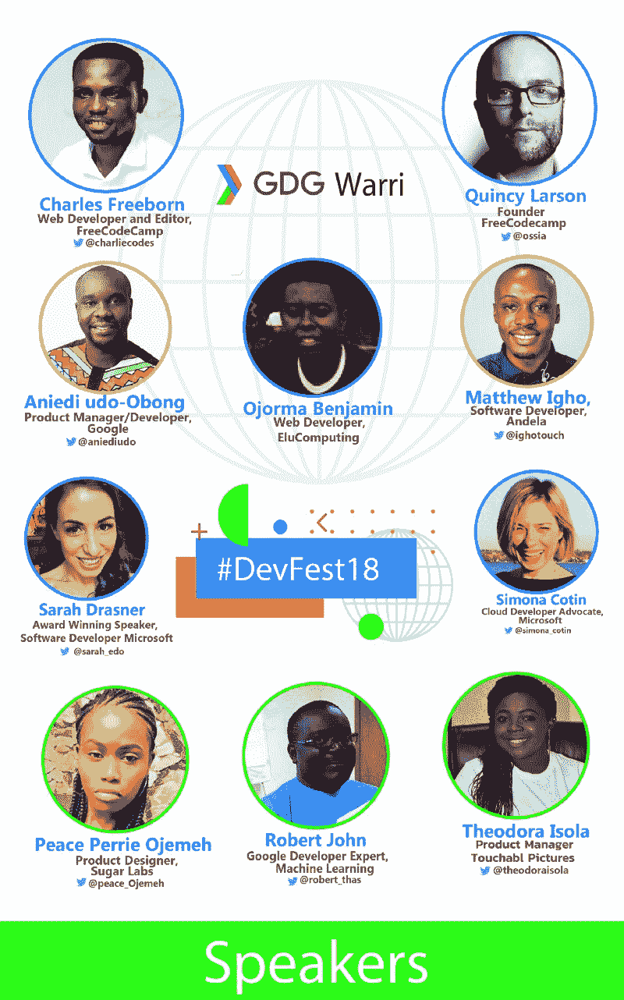

# GDG·瓦里尼日利亚将在瓦里举办她的首次(也是最大的)开发者节——加入我们吧！

> 原文：<https://www.freecodecamp.org/news/gdg-warri-nigeria-to-host-her-maiden-and-largest-developers-festival-in-warri-devfest18-90a3a29eea51/>

> 当开发人员聚在一起交流想法时，神奇的事情就会发生。— [发展节](https://devfest.withgoogle.com/)

受通过技术建设社区这一共同愿景的启发，[尼日利亚 GDG 瓦里](https://www.meetup.com/GDG-Warri)将于 2018 年 10 月 6 日举办一场历史性的活动，邀请数百名开发人员(以及有抱负的开发人员)— #DevFestWarri，这是尼日利亚南部三角洲州瓦里市首次举办此类活动。

#DevFestWarri 将举办各种技术会议，包括网络、机器学习、多样性和技术包容性，以满足每位与会者的需求！

如果你在瓦里市、三角洲州或尼日利亚南部，并且你是一名开发人员(或有抱负的人)、人工智能/人工智能爱好者、技术爱好者，甚至对技术着迷，那么你应该[在这里回复以获得一张免费入场券](https://www.meetup.com/GDG-Warri/events/253573754/)！您可以参加我们于 2018 年 10 月 6 日周六在达尔塔州 Effurun-Warri 机场路 128 号 Dandani hall 举办的#DevFestWarri 活动。

#### 什么是 DevFest？

> DevFests 是由社区领导的开发者活动，由全球各地的 GDG 分会主办，专注于社区建设和技术学习。每个 DevFest 都受到开发者社区和主办地区的启发，并根据他们的需求量身定制。— [DevFest 官网](https://devfest.withgoogle.com/)

#### 你为什么要参加？

今年在瓦里开始，作为一个开发者的小社区—[GDG 瓦里](https://www.meetup.com/GDG-Warri/)——聚集在一起聚会，现在已经成长为一个超过 440 个活跃成员的力量。我们现在在尼日利亚的三角洲州举办第一届也是最大的开发者节。

参加#DevFestWarri 将激励您超越自己的极限，因为您将从更广泛的技术社区中一些最出色的技术领导者和开发人员分享的知识财富中受益。

你会遇到其他有相似兴趣的人，你会接触网络并分享知识。也许你甚至会开始友谊，这不仅会使惊人的事情发生，而且还会为我们的一些本地(甚至全球)挑战提供技术解决方案。

你会受到启发，你应该参加！

#### 看看#DevFestWarri 的演讲者阵容

#DevFestWarri Speakers

*   Quincy Larson freeCodeCamp 创始人将加入我们，就技术写作和围绕软件开发创造引人注目的内容进行远程演讲。
*   微软获奖演讲人、作家和高级开发者倡导者 Sarah Drasner 将远程加入我们，发表关于 SVG 的演讲。
*   查尔斯·弗里伯恩(Charles Freeborn)将在 DevFest 上做主题演讲。对此我很兴奋。
*   Matthew Igho，软件开发人员， [Andela](https://www.freecodecamp.org/news/gdg-warri-nigeria-to-host-her-maiden-and-largest-developers-festival-in-warri-devfest18-90a3a29eea51/undefined) 将加入我们的现场演讲，讨论渐进式网络应用——PWAs。
*   SugarLabs 的 UI/UX 设计师 Peace Ojemeh (Perrie) 将就无障碍设计发表演讲。
*   开发人员关系，Interswitch 将发表一篇关于使用 Firebase 云功能实现无服务器化的演讲。
*   微软云开发者倡导者新美乐股份公司·科廷将发表一个关于使用 GraphQL 和无服务器构建可扩展 API 的远程演讲。
*   [提奥多拉·伊索拉](https://twitter.com/theodoraisola)，Touchabl Pictures 将在现场就科技的多样性和包容性发表演讲。
*   [谷歌云开发者社区 Ado Ekiti 的软件开发人员和社区经理奥拉因卡·彼得·奥卢瓦费米](https://www.linkedin.com/in/olayinkapeter/)将在现场发表关于探索使用谷歌视觉 API 进行机器学习的演讲。
*   EluComputing 创始人兼网站开发者 Odumah Benjamin 将在#DevFestStories 上分享他的科技之旅。
*   罗伯特·约翰，谷歌开发专家，机器学习将发表关于使用谷歌云视觉 API 过滤露骨图像的演讲。
*   谷歌撒哈拉以南非洲开发者关系部的 Aniedi Udo-Obong 将致闭幕词。

你可以在这里找到完整的节目表[。](https://docs.google.com/document/d/1sW1ZX07FAp8NKitGciREnYmdIDR8mCczrme0_pqvylw/edit?usp=sharing)

#### 是的。感谢我们出色的赞助商，免费入场

举办如此规模的开发者节是一项事业，但我们能够支持免费入场！我们非常感谢我们的赞助商给予我们的支持。

特别感谢我们了不起的赞助商——谷歌开发者、[微软云倡导者](https://twitter.com/azureadvocates)、[莎拉·德拉斯纳](https://twitter.com/sarah_edo)、 [GitLab](https://www.freecodecamp.org/news/gdg-warri-nigeria-to-host-her-maiden-and-largest-developers-festival-in-warri-devfest18-90a3a29eea51/undefined) 、 [JetBrains](https://www.jetbrains.com/) 、 [GatsbyJS](https://www.gatsbyjs.org/) 和[尼日利亚瓦里 Skysenx Hub](https://skysenx.com/)。

点击[回复此处](https://www.meetup.com/GDG-Warri/events/253573754/)参加 2018 年 10 月 6 日的#DevFestWarri，您可以获得最后一分钟的免费入场券。