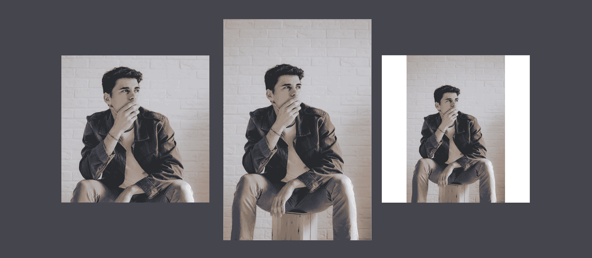
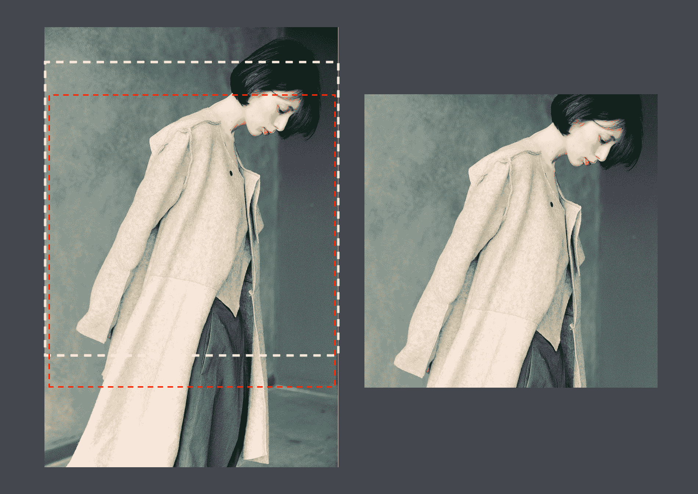
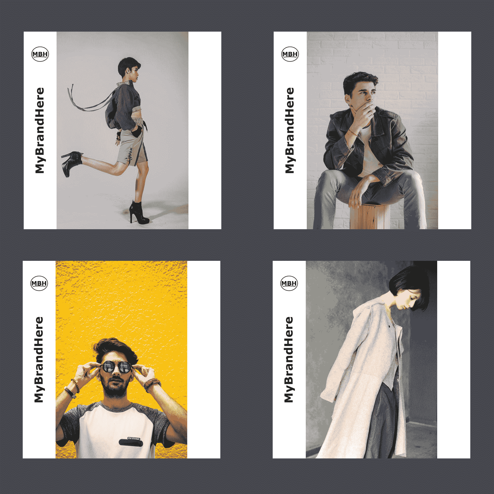

# 如何为亚马逊、Instagram、Zalando 和天猫生成产品图片

> 原文：<https://www.freecodecamp.org/news/generation-of-product-images-for-amazon-zalando-tmall-instagram-asos/>

数百万人已经从传统电视转向在线内容，从传统商场转向在线商店。因此，电子商务和营销团队需要为他们的业务部署和维护强大的在线存在。

这通常意味着经营品牌自己的网上商店，并在覆盖不同地区和人群的不同市场占有一席之地。展示、推广和销售产品的潜在市场永无止境，而且越来越长。

更糟糕的是，不同的市场对图像有不同的要求和限制，这会给开发人员和营销团队增加负担。这也是品牌公众形象不一致的一个来源。

在这里，我们将回顾在为全渠道图像的无缝生产建立一个干净的管道时要考虑的主要方面。

## 通过单个管道的单个主映像

为了简化工作流程并保持其可持续性，一个好的做法是将全渠道原则应用于图像。这基本上意味着为从相同的主映像或原始映像创建变体设置一个单一的、易于配置的管道。在这种方法下，我们可以对每个渠道使用**相同的产品形象。**

我们的管道应该接收主图像，并产生供给市场所需的衍生品。至少，它应该能够处理这样的工作流。

[https://store.abraia.me/05bf471cbb3f9fa9ed785718e6f60e28/product-images-for-amazon-zalando-tmall-lamoda-ssg/generation-of-variants/index.html](https://store.abraia.me/05bf471cbb3f9fa9ed785718e6f60e28/product-images-for-amazon-zalando-tmall-lamoda-ssg/generation-of-variants/index.html)

Simple workflow to create image variants with [Abraia bulk processing tool](https://abraia.me/workflows/).

当然，一个前端和云存储并不是必须的。管道可能只是通过观察一个热文件夹并在主图像到达那里时创建变体来工作。我们还会看看这个。

## 图像转换和优化

每个网络频道都有自己的网页设计和布局。至于图像，这意味着不同和具体的长宽比。此外，每个市场通常都有一个图像政策，限制图像的分辨率和重量，并设置可接受的图像格式。通常，它还指定了其他样式准则。

让我们看看我们希望通过管道完成的主要操作。

### 调整大小、裁剪、填充

为了改变图像的纵横比，我们可以对其进行裁剪或填充。为了从垂直的图像中得到正方形的图像，我们可以切掉上下两部分，或者用白色条纹填充左右两边。

有一些开源工具——比如 ImageMagick——可以让你有效地执行这些操作。使用 ImageMagick 调整图像大小以将其最大尺寸限制为 800 px 非常简单:

```
convert input.jpg -resize 800x800 resized.jpg 
```

本指令尊重纵横比。如果原始图像不是方形的，则调整后的图像的维度低于 800 px。假设图像是垂直的，我们希望它用于天猫，这需要 800x800 px 的正方形图像。那么我们可以这样填充它:

```
convert resized.jpg  -gravity center -extent 800x800 padded.jpg
```

此外，我们可以简单地裁剪它以适应尺寸:

```
convert input.jpg -gravity Center  -crop 800x800+0+0 +repage crop.jpg
```

虽然天猫等一些市场鼓励用白色条纹填充图像，并用徽标标记它们，以便在类别页面中使用，但亚马逊或 Lamoda 等其他市场禁止这种做法。



Cropping (left), Resizing (center), Resizing and padding (right)

当我们填充图像以匹配长宽比时，我们不会冒删除重要部分的风险。其实填充是保持长宽比不变的一招。然而，当我们裁剪图像时，风险是真实的。

因此，在工作室里确保我们遵守每个频道设定的一些作曲要求是一个很好的做法。我们应该制作与我们将要交付的不同纵横比兼容的产品视图的主图像。

### 智能裁剪

有一些受人类注意力和美感启发的算法，可以提供针对不良自动作物的增强保护。在下一个例子中，通过智能图像裁剪(白线)，我们避免了像简单的中心裁剪(红线)那样裁剪面部。



Example of smart cropping with a [cloud service](https://abraia.me/workflows/) vs center cropping

此选项在某些云服务中可用。如果我们要使用它，我们应该验证它是否适合我们，因为许多解决方案只使用注意力地图，而没有考虑美学方面。通常选择若干个有代表性的图像，用它们做一些测试，最后验证结果，就足以得到很好的把握。

### 覆盖徽标和文本

我们可能还需要添加我们的品牌标志，或者通过叠加矢量图形或文本来为图像添加信息。此外，在许多情况下，我们需要一些适当的内容本地化策略，如根据市场区域定制折扣和语言。坚持我们的例子，使用 ImageMagick 我们可以在填充的图像上覆盖文本。

```
convert -fill black -pointsize 70 -gravity center -draw "rotate -90 text 0,-330 'MyBrandHere'" padded.jpg padded-with-brand.jpg
```

一旦我们为一个图像配置了它，我们就可以将它应用到具有相同维度的任何其他图像。



Examples of batch image branding using [Abraia's cloud service](https://abraia.me/workflows/)

否则，在具有一定复杂性的工作流程中，处理排版和不同的设置可能会变得棘手。在这方面，一个[云服务](https://abraia.me/workflows/)通常会提供一个前端，使配置直观快捷，处理起来更方便。它还处理其他东西，如排版或图像再压缩中的质量保持。

## 工作流程

有许多方法可以部署图像处理管道。根据图像的流量，我们可能需要支持不同类型的工作流。

### 成批处理

在最简单的情况下，当流速较低时，批量图像处理解决方案可能就足够了。使用 ImageMagick，我们可以使用 *mogrify* (而不是 convert)来处理一个文件夹中的所有图像。

在某些情况下，比如不同语言文本的图像版本，我们可能需要编写一个脚本，但这也没什么大不了的。为了让它变得更容易，我们可以使用云批处理工具，在其中我们放下图像，它会返回我们需要的所有变量，就像本文开头的视频中一样。

### 常用文件夹

对于内部部署，我们需要的不仅仅是简单的批量图像处理，使用热文件夹可能是一个不错的选择。在这种情况下，我们应该设置一个监视文件夹的工人。每当一个图像进入文件夹，观察者就会触发创建我们需要的所有变量的过程。

在这方面，Gulp 非常方便地实现了一个文件夹监视管道。这个 GitHub 库带来了一个基于 Gulp 的 hot folder 的现成实现。它允许我们使用 Abraia 的云服务来转换图像，或者使用 Imagemin(一种开源解决方案)来优化图像。安装后，只需在终端中输入一条命令，就可以轻松启动观察器。

```
$ gulp
```

这个视频展示了工作过程。

[https://store.abraia.me/05bf471cbb3f9fa9ed785718e6f60e28/product-images-for-amazon-zalando-tmall-lamoda-ssg/hot-folder-gulp/index.html](https://store.abraia.me/05bf471cbb3f9fa9ed785718e6f60e28/product-images-for-amazon-zalando-tmall-lamoda-ssg/hot-folder-gulp/index.html)

Example of [hot folder using Gulp](https://github.com/abraia/workflows)

### 全云

云服务通常带来最灵活、最快速部署的解决方案。尽管如此，实现完全云还是有不同的方式。从用户角度来看，最简单的方法是由映像管理和优化服务负责转换。它还管理向最终用户(通过 CDN)或其他网络渠道(如市场和社交网络)的交付。用户只需要上传主图像并配置转换，通常使用直观的图形界面。

在管理自己的云的大中型公司中，来自不同提供商的服务通常是组合在一起的。在这种情况下，我们可能必须管理私有和公共存储桶。我们可以让一个服务访问一个桶，创建变量，交付资源或者只是将它们返回到不同的桶。

此外，云管道可以部分在内部实现。在这种情况下，我们有无限的可能性。然而，这样的开发工作只有在没有服务符合需求，并且有理由需要定制的解决方案时才有意义。

## 摘要

工作室拍摄和摄影修图都是费时费钱的操作。能够在任何地方使用相同的主材料对于控制时间和成本非常重要。

我们已经回顾了负责创建图像变体的完整管道的主要方面。一方面，我们研究了需要执行的转换，从调整大小、裁剪或填充，到文本和图形的叠加。另一方面，我们研究了要实施的工作流，从批处理到热文件夹或完整的云解决方案。我们已经回顾了一些重要的开源资源(如 ImageMagick 或 Gulp ),它们使得实现您自己开发的管道成为可能。

最后，在决定使用内部服务还是云服务时，有两个主要因素需要考虑。首先，您必须评估自己承担开发工作的意愿。第二，你需要决定你需要什么样的功能，从一个易于使用的配置变体的界面到像智能裁剪这样的高级功能。