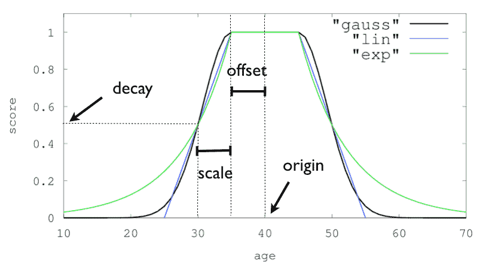

# 如何使用 Elasticsearch 在你的应用中设置地理位置搜索

> 原文：<https://www.freecodecamp.org/news/geolocation-search-elasticsearch/>

如今，基于位置的功能在应用程序中相当普遍。这些功能可能看起来很复杂，但实际上可以用 Elasticsearch 很容易地实现。

Elasticsearch 是一个基于文档结构的 NoSQL 数据库。它经常被用作搜索引擎。它还提供了自己的语法和许多工具来帮助您尽可能灵活地进行搜索。

在这篇文章中，我将向你展示一个简单的方法来搜索地理位置，通过坐标范围得到一个城市列表。

## 如何安装 Elasticsearch


你可以在 Elasticsearch 的网站上找到简单易懂的[安装指南](https://www.elastic.co/guide/en/elasticsearch/reference/7.4/install-elasticsearch.html)。在我写这篇文章的时候，我使用的是 elastic search 7 . 4 . 2 版本。

请记住，Elasticsearch 在最近的版本中做了很多改变，其中之一就是移除了映射类型。因此，如果你使用的是另一个版本的 Elasticsearch，这里的一些东西可能无法完全工作。

完成安装后，不要忘记运行您的 Elasticsearch 服务，他们在安装指南中明确强调了这一点(对于 Linux，请执行此操作`./bin/elasticsearch`)。

**使用 GET 请求进入本地机器的端口 9200，确保您的 elasticsearch 正在运行**，如下: [`GET http://localhost:9200`](http://localhost:9200)

## 如何制作你的弹性搜索指数

索引类似于常规数据库中的表。对于这个例子，让我们制作一个名为`cities`的索引，它将包含我们的数据。

让我们为我们的数据定义一个简单的模型:

*   `id` : `keyword`为我们的标识符
*   `name` : `text`为城市名称
*   `coordinate` : `geo_point`存储我们的城市坐标(很简单，他们已经有这个数据类型了)

在 Elasticsearch 中，我们通过将 curl 制作成 API 来创建索引。在我们的例子中，我们的请求如下:

```
PUT http://localhost:9200/cities
```

```
{
    "settings": {
        "number_of_shards": 1,
        "number_of_replicas": 1
    },
    "mappings": {
        "properties": {
            "id": {
                "type": "keyword"
            },
            "name": {
                "type": "text"
            },
            "coordinate": {
                "type": "geo_point"
            }
        }
    }
}
```

当您使用这个 curl 时，您应该得到这样的响应，以验证您的索引已经创建:

```
{
    "acknowledged": true,
    "shards_acknowledged": true,
    "index": "cities"
} 
```

做得好！现在您的索引可以使用了。让我们继续使用新创建的索引。

## 如何填充弹性搜索数据

我们现在将用文档填充我们的弹性搜索索引。如果您不熟悉这个术语，只需知道它非常类似于 SQL 数据库中的行。

在 Elasticsearch 中，可能会存储与我们预定义的模式不匹配的数据。但是我们不会在这里这样做——相反，我们将插入与我们预定义的模式相匹配的数据。

由于我们将一次插入多个数据，我们将使用 Elasticsearch 提供的 [bulk](https://www.elastic.co/guide/en/elasticsearch/reference/current/docs-bulk.html) API，它允许在一个 API 调用中多次插入。

在下面的例子中，我将在我的索引中插入 9 个城市。如果你愿意，可以随意添加。

`POST '[http://localhost:9200/cities/_bu](http://localhost:9200/cities/_bu)lk`

```
{ "index":{"_index": "cities" } }
{ "id": 1, "name": "Jakarta", "coordinate": {  "lat": -6.2008, "lon": 106.8456}}
{ "index":{"_index": "cities" } }
{ "id": 2, "name": "Tokyo", "coordinate": {  "lat": 35.6762, "lon": 139.6503} }
{ "index":{"_index": "cities" } }
{ "id": 3, "name": "Hong Kong", "coordinate": {  "lat": 22.3193, "lon": 114.1694} }
{ "index":{"_index": "cities" } }
{ "id": 4, "name": "New York", "coordinate": {  "lat": 40.7128, "lon": -74.0060} }
{ "index":{"_index": "cities" } }
{ "id": 5, "name": "Paris", "coordinate": {  "lat": 48.8566, "lon": 2.3522} }
{ "index":{"_index": "cities" } }
{ "id": 6, "name": "Bali", "coordinate": {  "lat": -8.3405, "lon": 115.0920} }
{ "index":{"_index": "cities" } }
{ "id": 7, "name": "Berlin", "coordinate": {  "lat": 52.5200, "lon": 13.4050} }
{ "index":{"_index": "cities" } }
{ "id": 8, "name": "San Fransisco", "coordinate": {  "lat": 37.7749, "lon": -122.4194} }
{ "index":{"_index": "cities" } }
{ "id": 9, "name": "Beijing", "coordinate": {  "lat": 39.9042, "lon": 166.4074} } 
```

有效载荷可能看起来很奇怪，因为它采用了不正确的 JSON 格式，但是不要担心——它应该就是这样设计的。

然后，它应该会向您回复类似以下内容的响应:

```
{
    "took": 72,
    "errors": false,
    "items": [
        //will contains item for each data inserted
        ...
    ]
}
```

## 如何查询您的 Elasticsearch 文档


Photo by [Chris Lawton](https://unsplash.com/@chrislawton?utm_source=ghost&utm_medium=referral&utm_campaign=api-credit) / [Unsplash](https://unsplash.com/?utm_source=ghost&utm_medium=referral&utm_campaign=api-credit)

现在有趣的部分来了。我们将对之前插入的文档进行一些查询。

Elasticsearch 支持多种类型的查询搜索语法。它也有地理定位类型搜索，我们今天会玩。

我们可以像这样简单地用 curl 搜索我们的城市:

`POST '[http://localhost:9200/cities/_sear](http://localhost:9200/cities/_sear)ch`

```
{
  "query": {
    "bool": {
      "filter": {
        "geo_distance": {
          "distance": "10km",
          "coordinate": {
            "lat": 37.76,
            "lon": -122.42
          }
        }
      }
    }
  }
}
```

这个查询应该给我旧金山，坐标 37.7749 和-122.4194 应该在我们坐标的 10 公里半径内(由 Google 提供)。

```
{
    "took": 7,
    "timed_out": false,
    "_shards": {
        "total": 1,
        "successful": 1,
        "skipped": 0,
        "failed": 0
    },
    "hits": {
        "total": {
            "value": 1,
            "relation": "eq"
        },
        "max_score": 0.0,
        "hits": [
            {
                "_index": "cities",
                "_type": "_doc",
                "_id": "eKPspHYBivyIhfWHb2vl",
                "_score": 0.0,
                "_source": {
                    "id": 8,
                    "name": "San Fransisco",
                    "coordinate": {
                        "lat": 37.7749,
                        "lon": -122.4194
                    }
                }
            }
        ]
    }
}
```

恭喜你！现在你有了自己的位置搜索引擎。但是让我们再多做一点实验。假设您想要在该位置获取更多的城市。

让我们尝试通过改变有效载荷将距离扩大到 4500 公里:

```
{
  "query": {
    "bool": {
      "filter": {
        "geo_distance": {
          "distance": "4500km",
          "coordinate": {
            "lat": 37.76,
            "lon": -122.42
          }
        }
      }
    }
  }
}
```

你应该会得到这样的回应:

```
{
    "took": 8,
    "timed_out": false,
    "_shards": {
        "total": 1,
        "successful": 1,
        "skipped": 0,
        "failed": 0
    },
    "hits": {
        "total": {
            "value": 2,
            "relation": "eq"
        },
        "max_score": 0.0,
        "hits": [
            {
                "_index": "cities",
                "_type": "_doc",
                "_id": "dKPspHYBivyIhfWHb2vl",
                "_score": 0.0,
                "_source": {
                    "id": 4,
                    "name": "New York",
                    "coordinate": {
                        "lat": 40.7128,
                        "lon": -74.0060
                    }
                }
            },
            {
                "_index": "cities",
                "_type": "_doc",
                "_id": "eKPspHYBivyIhfWHb2vl",
                "_score": 0.0,
                "_source": {
                    "id": 8,
                    "name": "San Fransisco",
                    "coordinate": {
                        "lat": 37.7749,
                        "lon": -122.4194
                    }
                }
            }
        ]
    }
}
```

它给出了两个结果:纽约和旧金山。结果看起来是正确的，但是定位可能有点奇怪。旧金山应该排在第一位，因为它更近，对吗？

不完全是，因为我们所做的只是过滤。我们的查询只是过滤，并不关心哪一个离你最近。

但是，如果我们想做一些计算来显示哪些位置可能是最近的呢？别担心，Elasticsearch 也可以做到这一点。我们可以使用一种叫做函数分数查询的查询。

### 如何在 Elasticsearch 中使用函数分数查询

Elasticsearch 计算(评分)它将向用户显示什么文档。通过使用[函数分数查询](https://www.elastic.co/guide/en/elasticsearch/reference/current/query-dsl-function-score-query.html)，我们可以修改分数，这样我们就可以确定应该返回哪些文档。

这里，我们将使用[衰变查询函数](https://www.elastic.co/guide/en/elasticsearch/reference/current/query-dsl-function-score-query.html#function-decay)。有三种衰减函数:指数函数、线性函数和高斯函数。他们每个人都有不同的行为。



Image [source](https://www.elastic.co/guide/en/elasticsearch/reference/current/query-dsl-function-score-query.html#function-decay)

我们在这里使用的是线性类型函数。我们还将指定坐标以及偏移量和比例。

`POST '[http://localhost:9200/cities/_sear](http://localhost:9200/cities/_sear)ch`

```
{
  "query": {
    "function_score": {
      "functions": [
        {
          "linear": {
            "coordinate": {
              "origin": "37, -122",
              "offset": "100km",
              "scale":"2500km"
            }
          }
        }
      ],
       "min_score":"0.1"
    }
  }
}
```

现在，我们应该得到最高分排序的结果。

```
{
    "took": 32,
    "timed_out": false,
    "_shards": {
        "total": 1,
        "successful": 1,
        "skipped": 0,
        "failed": 0
    },
    "hits": {
        "total": {
            "value": 2,
            "relation": "eq"
        },
        "max_score": 1.0,
        "hits": [
            {
                "_index": "cities",
                "_type": "_doc",
                "_id": "eKPspHYBivyIhfWHb2vl",
                "_score": 1.0,
                "_source": {
                    "id": 8,
                    "name": "San Fransisco",
                    "coordinate": {
                        "lat": 37.7749,
                        "lon": -122.4194
                    }
                }
            },
            {
                "_index": "cities",
                "_type": "_doc",
                "_id": "dKPspHYBivyIhfWHb2vl",
                "_score": 0.19508117,
                "_source": {
                    "id": 4,
                    "name": "New York",
                    "coordinate": {
                        "lat": 40.7128,
                        "lon": -74.0060
                    }
                }
            }
        ]
    }
}
```

这就结束了！

## 结论

在本文中，我们介绍了如何使用 Elasticsearch 实现基于位置的搜索。但这并不是结束——我在这里展示的只是你能做的事情的表面。

我希望你觉得这篇文章有趣并且有用。如果是这样的话，继续学习更多关于它的知识，并尝试结合功能评分进行实验。会很有趣的，我保证。

> 永远保持好奇心，你会学到新的东西。