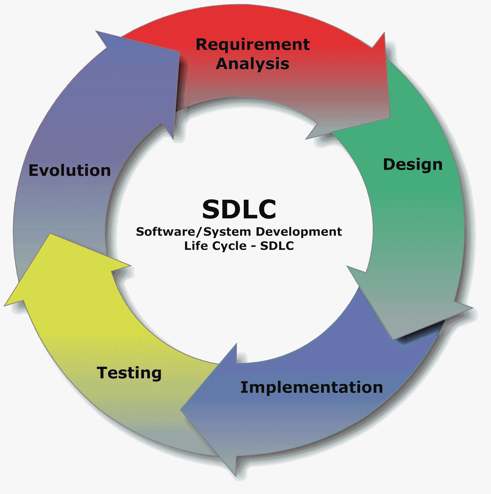

# SDLC 指南–软件开发生命周期阶段和方法

> 原文：<https://www.freecodecamp.org/news/get-a-basic-understanding-of-the-life-cycles-of-software-development/>

大约四年前，当我决定自学编程时，我从未听说过软件开发生命周期，更不用说考虑了。

作为一名全新的开发人员，我专注于学习能帮助我获得梦寐以求的第一份开发工作的技术，而不是那些团队如何运作的细微差别。

当我真的了解它们时，我认为它们对我来说毫无用处，因为我认为自己是一名网络开发人员，而不是软件开发人员。

从那以后，我认识到这与事实相去甚远，这些原则/实践在我的日常活动中起着很大的作用(不管我是否意识到)。

我很幸运地看到我编写的代码、我构建的特性以及我无意中引入的错误(我不愿承认)是如何影响最终用户及其体验的。这种经历帮助我形成了如何思考为用户构建产品和解决问题的过程。

我花了一些时间来思考这些方法的不同之处(和相似之处)。在他们的核心，每一个都致力于尽可能高效和经济地交付高质量的软件。

从专业角度来说，我只用过其中的一两种方法。但我仍然认为至少对它们有一个基本的了解是有价值的。

所有这些方法都遵循类似于下图的一系列阶段:

Requirement Analysis -> Design -> Implementation -> Testing -> Evolution

所以，下面是软件开发生命周期方法(排名不分先后):

*   [精益](https://en.wikipedia.org/wiki/Lean_software_development)
*   [敏捷](https://www.agilealliance.org/agile101/)
*   [瀑布](https://en.wikipedia.org/wiki/Waterfall_model)
*   [迭代](https://en.wikipedia.org/wiki/Iterative_and_incremental_development)
*   [螺旋形](https://en.wikipedia.org/wiki/Spiral_model)
*   [开发运营](https://en.wikipedia.org/wiki/DevOps)

让我们深入探讨每种方法的异同。

## 倾斜

精益方法在很大程度上依赖于七个原则，并由七个原则组成。

它们没有特定的顺序:

1.  消除浪费
2.  加强学习
3.  尽可能晚地决定
4.  尽可能快地交付
5.  授权给团队
6.  建立诚信
7.  看到/优化整体

每个原则都有一个特定的目的，其好处是相辅相成的。

*消除浪费*(额外的功能、未完成的工作、管理约定等)为客户创造更多价值，从而提高满意度。

*强化学习*允许团队对他们向客户交付产品的能力进行再投资。

*尽可能晚地做出决策*指的是所有重大决策，给团队一个基于选项或基于集合的方法。这允许团队收集事实而不是意见来帮助影响决策。

*尽可能快地交付*是不言自明的——尽可能快地构建产品并交付给客户进行评估/迭代。

在一个典型的场景中，经理向开发人员分配任务/工作。在精益方法中，开发人员“教导”管理者如何倾听“战壕中的人”，从而影响管理层的决策/选择。

这有助于团队感受到更多的*授权*来谈论 ide 和解决方案。

使*完整性*成为规则而不是例外意味着客户对正在构建的系统有信心。客户知道系统的构建是为了承受适当的增长和“扩展”(如果需要)。

我喜欢像坐在椅子上一样思考正直的部分。当你坐在椅子上时，你相信它是用最好的材料建造的，在椅子的使用寿命中，每次你坐在上面，它都会把你托起。客户需要对正在生产的产品有同样的信心。

最后，*查看和优化整体*指的是正在构建的系统的整体。通过整体优化，我们不把软件看作许多组件的总和，而是看作一个为效率而优化的大实体。

这意味着在开发过程中，产品被分解成易于管理的部分，不经意的错误不仅被发现，而且被迅速解决。

## 敏捷

这是构建软件的“快速失败”方法。

它把重点放在小的、增量的、持续的发布周期上。在每次迭代中，团队都努力在小问题变成大问题之前识别并解决它们。

这也意味着团队必须让涉众(代码最终会影响的人/组织，如经理、技术领导、CTO 和客户)参与进来，以获得他们的反馈。

如果你是一名自由职业者，你的利益相关者就是你的客户——最终你需要确保他们对工作满意，然后再继续。

敏捷在技术上是精益方法的一个分支，有一些显著的不同——主要是它从一开始就优先考虑客户满意度，并允许团队快速响应客户反馈。

尽管这超出了本文的范围，但是敏捷中还有另一个更复杂的框架，叫做 [SCRUM](https://en.wikipedia.org/wiki/Scrum_%28software_development%29) 。这种方法被用于大型的、极其复杂的项目，甚至被用于软件开发之外。

## 瀑布

大多数人认为瀑布方法是列表中最古老的方法。它从来就不是软件开发的模型，而是从建筑和制造业开始的。

这种方法的结构很简单——在进入下一个阶段之前完成一个阶段的所有部分，随着阶段的完成，项目的完成会有更多的动力。每个阶段的开始(除了第一阶段)和完成都取决于前一阶段的完成/信息传递。

在瀑布方法下，每个阶段都有自己严格的项目计划，以测试之前完成的工作结束。应该注意的是，由于上述的刚性，这种方法不推荐用于更大/更长期的项目。

想想这种方法的起源，你会更理解它。它来自于建筑/制造业，在那里一次完成一个阶段是很常见的。在建造房子的过程中，你不会在框架搭好之前就开始安装管道。

这不是软件开发通常的工作方式。众所周知，有时有必要重温一个之前被认为已经结束的阶段。

## 重复的

这被称为“重复的方法”或者“下一轮做得更好”的方法，因为它在每个循环迭代中提供了不同的机会来改进产品。

我有偏见(因为我们都是:D)，但这恰好是我最喜欢的发展生命周期。我相信它最适合我目前的情况，无论是在我的自由职业生涯中还是在职业道路上，因为它让我不断“前进，同时让事情变得更好。”

使用迭代方法，团队实现一个解决方案，测试这个解决方案，评估它的有效性/吞吐量，然后确定进一步改进的领域。开发过程的每个周期(迭代)都会发生这种情况。

随着每个版本的发布，都会有另一次迭代，直到最终产品完成并准备好向用户展示。

迭代方法的一个重要特征是你和你的团队在开发过程的早期得到一个软件的工作版本。这对于向利益相关者展示以评估他们的反应/反馈特别有用。

这种方法的一个很大的缺点是它会非常快地消耗大量的资源。想象一下在开发周期的每一次迭代中投入的所有人员、时间、bug 修复和工资，你会对资源使用情况有一个很好的了解。

在这种方法中有一个由 Rational 软件公司(被 IBM 收购)开发的原则子集，叫做 [Rational 统一过程(R.U.P.)](https://en.wikipedia.org/wiki/Rational_Unified_Process) ，它包括 4 个阶段:

*   开始
*   详细阐述
*   建筑
*   过渡(产品发布)

这套原则应该是灵活的，并根据使用它的每个团队的需要而定制。

## 螺旋形

螺旋方法可能是六种方法中最灵活的。这是一种建立在风险基础上的方法——识别和否定风险。风险(认同和厌恶)驱动着这个模型中的每一个决策。它分为四个子阶段:

*   规划(目标)
*   风险分析(识别可能的障碍)
*   开发和测试(当前和下一版本)
*   评估(当前阶段的审查和下一阶段的计划)

每个阶段的每次迭代都从规划下一个阶段开始。这样，潜在的风险在遇到之前就被发现了。这也允许在所述风险出现时制定行动计划。

在阶段期间，团队还致力于减轻这些风险及其对螺旋开发的未来迭代的影响。

随着开发过程的继续，这四个子阶段中的每一个都以螺旋方式重复。这允许对每个子阶段进行多轮细化，直到完成。

## 开发运营

如果你快速搜索一下，你会发现这种开发生命周期方法的信息并不缺乏。正是这个新来的家伙将软件开发和信息技术运营团队带入了同一个圈子。

这些团队协同工作，为频繁出现的产品提供小而有效的更新。反过来，这创造了一个驱动开发的持续反馈和改进循环。

这种特殊的方法也以自动化开发的手工部分而闻名(想想部署)。

像大多数其他方法一样，这种方法的总体目标是缩短开发生命周期并提供高质量的产品。

这种方法的一个缺点是组织内部的思维方式和文化发生了显著的变化。可能已经习惯于做很多事情的团队发现他们的任务缩小到只有一两个。

例如，通用开发人员可能会发现他们现在只负责测试部分或最终用户体验部分。

## 把一切带回家

Photo by [Clever Visuals](https://unsplash.com/@clever_visuals?utm_source=unsplash&utm_medium=referral&utm_content=creditCopyText) on [Unsplash](https://unsplash.com/s/photos/bright-idea?utm_source=unsplash&utm_medium=referral&utm_content=creditCopyText)

我希望你现在能看到这些方法的重要性和好处。每一种都有自己的优点和缺点。

在最基本的层面上，它们是一套指导方针和原则，旨在向利益相关者交付高质量、高效率的工作。

当我第一次开始学习编程时，我没有导师。通过分享我所学到的，我希望能帮助那些正在学习编码的人。

我希望尽可能多地与其他开发人员分享信息和经验。如果你正在自学编码，或者你是一个经验丰富的开发人员，我希望这篇文章能有所帮助，即使是很小的帮助。

查看我的博客，我经常在那里发布关于 web 开发的文章。

既然你在那里，为什么不订阅我的时事通讯呢？你可以在博客主页的右上方这样做。我喜欢不时地为开发人员发送有趣的文章(我的和其他人的)、资源和工具。

如果你对这篇文章有任何疑问，或者只是一般而言，我的 DMs 是开放的-来在 [Twitter](https://twitter.com/jj_goose) 或我的任何其他社交媒体帐户上打招呼，你可以在时事通讯下面找到在主页上注册或在我的个人资料这里:)

祝你有美好的一天和快乐的编码，朋友！