# D3 zoom —缺失的手册

> 原文：<https://www.freecodecamp.org/news/get-ready-to-zoom-and-pan-like-a-pro-after-reading-this-in-depth-tutorial-5d963b0a153e/>

作者拉尔斯·弗斯波尔

# D3 Zoom:缺失的手册

#### 如何使用 SVG 和 Canvas 缩放和平移数据可视化

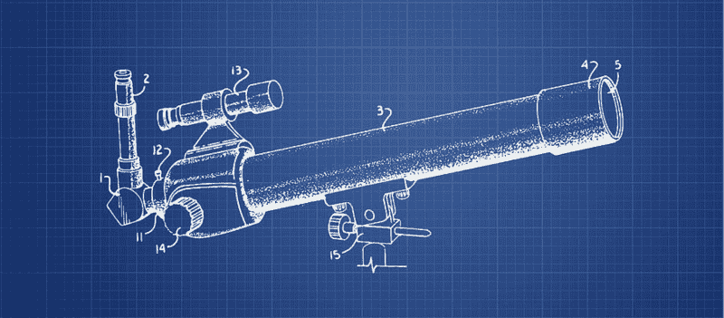

‘[Telescope Zoom Lens Patent From 1999 — Blueprint](https://fineartamerica.com/featured/telescope-zoom-lens-patent-from-1999-blueprint-aged-pixel.html)’ by [Aged Pixel](https://www.agedpixel.com/)

一篇 D3 zoom 文章的最佳开头段落已经写好了，是这样的:

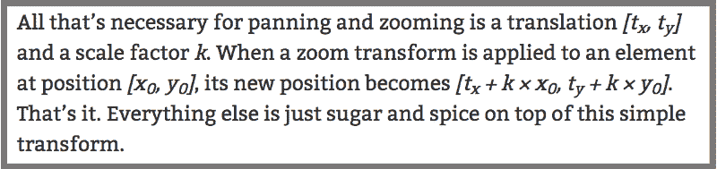

Peter Kerpedijec on Empty Pipes (see [sources](#28f2) below)

挺好的。用四句话，它准确地告诉你什么是变焦，它能做什么，而且——可能更重要的是——它消除了你对变焦的恐惧。

那么，都说完了吗？从来没有过。拥有众多不同的视角总是好的，尤其是在那些让你宝贵的视觉效果在商店里到处移动，并由你的用户随意缩放的事件中。

不久前，我做了一个相当复杂的可视化，有许多移动的元素和一长串的交互，包括缩放和平移，在它最初黑暗的中心。静态视觉本身已经相对复杂，但添加缩放和平移感觉有点像把我儿子的 4 乘 6 英尺的乐高城堡绑在逃跑的水牛身上。

这里的概念问题是缩放和平移从根本上干扰了我们的工作。它们似乎控制了我们相当多的手工视觉化，这很少是一个单一的整体，而是位置、比例和轴线的精心组合。这在最好的情况下会让人困惑，在最坏的情况下会让人害怕。

因此，在我的缩放和平移动作越来越有信心，并在其他几个项目中得到测试后，写下它们的时机似乎成熟了。也许为时已晚，你们几年前就已经破解了，但即便如此，换个角度看问题可能还是有帮助的。

我们的旅程将分为三个部分:

1.  缩放和平移的同步方法
2.  构建视觉效果
3.  在 SVG 和画布中实现缩放和平移

作为奖励，我们将添加程序缩放，使我们的视觉漂亮。

现在，你可能会看那边的滚动条，想着当你读到这些的时候你会错过晚餐。它之所以详细是有原因的，但我会让你容易浏览和挑选，因为我会指出你可以跳过而不会错过关键内容的部分。所以你可以让这次旅行尽可能的短或彻底，无论如何你都可以从中得到一些东西。

### 一个简单的缩放和平移方法

这第一部分是这篇文章的主干。这是一个简短的手册，只不过是在构建缩放和平移事件时可以遵循的五个简单点。本手册将为您提供一个类似生命线的序列，说明如何将缩放和平移集成到您的应用程序中。一系列同步和简单的步骤通常有助于异步和打结的编程世界。

#### 就一些术语达成一致

在我们开始之前，让我们先定义一些有用的术语:

*   **缩放变换**是由 D3 产生和维护的对象。在缩放和平移上下文中，它是您最有价值的财产，它包含三个值: *x* 和 *y* 平移以及由 *k* 表示的比例因子。我们将很快看到它在何时何地产生和改变。这是它在初始状态下的样子:

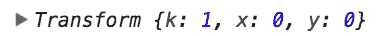

*   它说:*“用户还没有缩放，或者平移视图。因此，缩放比例因子为 1，x 和 y 平移为 0。*
*   **缩放行为**是跟踪并传递变换值的事件系统。监听器消耗(注意)用户的动作。一旦被激活，它将向一个处理函数发送一个包含该事件信息的事件对象。您将编写这个处理程序并使用事件对象的信息。缩放处理程序将收到的最重要的信息是每次缩放活动中的上述转换。无论我们想对变换值做什么，我们都将在缩放处理程序中完成。这听起来可能很多，但最简单的形式是这样设置缩放行为:

```
var zoom = d3.zoom().on(‘zoom’, zoomed);
```

*   正如他们所说，**缩放基础**是缩放附加到的父元素或在上注册的*。它做两件事:1)它是接受用户所有动作和手势的表面，2)它保存变换对象(T4 x T5、T6 y T7 和比例因子 T8 k T9)。*
*   **缩放目标**是我们想要移动的所有元素。如果你想放大和缩小一个圆，那么这个圆就是你的缩放目标。

此外，我们可能希望区分两种类型的缩放。当我们转到我们的示例时，它们会变得更加清晰，但是首先在顶层定义它们会很有帮助:

*   **几何缩放**(或*图形缩放*)意味着元素只是被放大或缩小，没有任何区别。他们所有的财产都会被放大或缩小。可以把它想象成移动或缩放各个元素的坐标系。上面的所有东西都会被任意缩放和移动。几何缩放最接近我们的真实体验。当我们走向一所房子时，每走一步，房子的每一面都显得更大。同样，如果我们缩放一个轴，它的所有部分都会变大或变小——线条、域路径、标签。例如，一个 14px 轴的标签按比例因子 2 放大后会显示为 *14 × 2 = 28px* 大。
*   **语义缩放**(或*非几何缩放*)是指我们在缩放时控制每个单个元素的属性。例如，如果我们有一个轴，标签的大小为 14px，我们在语义上放大该轴，我们可以命令标签为每个比例因子保留其原始大小。线条可能会变得更大更细，轴会根据缩放比例重新定位，但我们的标签仍将保持 14px 大。

我们在下面不会触及这一点，但真正的语义缩放可以走得更远。它不仅允许我们控制元素的属性，还允许我们根据缩放级别控制元素的表示。例如，谷歌地图缩小时显示国家，中等放大时显示州或行政区，放大时显示较小的城市。

#### 分 5 步缩放和平移

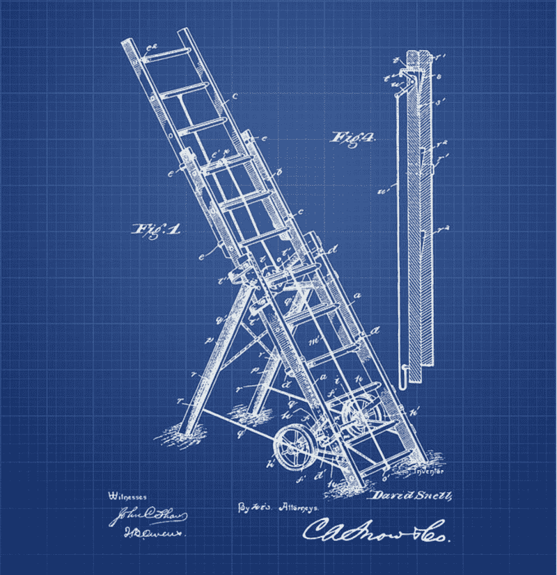

‘[1895 Firemans Ladder Patent — Blueprint](https://fineartamerica.com/featured/1895-firemans-ladder-patent-blueprint-aged-pixel.html)’ by [Aged Pixel](https://www.agedpixel.com/)

我们现在已经为此做好了准备。下面是我们的缩放和平移的五个简单步骤:

#### 1.首先建立你的静态视觉

为了放大图像，你需要一个图像。

#### 2.确定你的缩放基准和缩放目标

拿一张纸，指定一个监听的元素(*缩放基准*，并写下应该移动的元素的列表(*缩放目标*)。

*   首先选择您的**缩放基准**元素。确定要用于缩放基础的 DOM 元素。您可以将缩放附加到`svg`、`g`、`rect`或鼠标可以访问的任何其他元素。注意，这里的`g`元素只能注册有填充子元素的事件。所以，如果你有一个半径为 1 的大的`g`元素，你的缩放手势只能在那个小圆上起作用。通常最好设置一个专用的 SVG 矩形(`rect`)，填充不透明度为 0，设置`pointer-events`为`all`来注册缩放监听器。您可能需要取消上行元素的指针事件。
*   确定您的**变焦目标**元素并写下来。请记住，缩放目标是您想要移动的元素。列出所有缩放目标元素。
*   对于每个目标，确定是否要使用**几何**或**语义缩放**。
*   记下来。下面是一个示例表，您可能会看到:

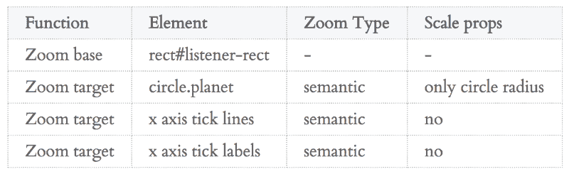

#### 3.设置缩放行为

现在你要建立一种能让听者倾听的行为。

*   至少通过以下方式创建缩放行为:

```
var zoom = d3.zoom().on(‘zoom’, zoomed);
```

*   查看 d3.zoom() 的 [D3 API 参考，了解类似`scaleExtent`和`translateExtent`的帮助方法。](https://github.com/d3/d3-zoom)
*   将基本元素的缩放行为称为:

```
zoomBaseElement.call(zoom)
```

*注意，你当然不用叫你的变焦基* `zoomBaseElement` *。*

#### 4.编写处理程序

这是缩放和平移发生的地方。当用户滚动或拖动时，`transform`对象会不断更新 *x* 、 *y、*和 *k* ，这将是操作者最珍贵的财产。您将把这些应用到您的缩放目标。

*   您要做的第一件事是在每次用户交互(滚轮或鼠标)时捕获监听器传递给处理程序的`transform`对象:

```
var transform = d3.event.transform;
```

*   现在你已经有了缩放和平移参数( *tx* 、 *ty* 、 *k* ，你可以用它做任何你想做的事情...
*   如果您只想管理**几何缩放**，您只需调用:

```
zoomTargetElement  .attr(‘transform’,         ‘translate(‘ + transform.x + ‘, ‘ + transform.y + ‘)          scale(‘ + transform.k + ‘)’);
```

或者更简单:

```
zoomTargetElement.attr(‘transform’, transform.toString());
```

…完全一样。这假设您想要应用所有变换值。你也可以只关注 *tx* 、 *ty* 或者音阶 *k* 当然。

*   如果你想要语义缩放，你需要重新缩放。
*   假设您的所有数据值都经过了从数据到屏幕空间的转换，这种转换会随着缩放而改变。如果您的数据点 x = 10 在缩放之前被转换到像素空间 50，缩放将把它移动到不同的点。
*   如果将 x 平移 5 倍并缩放 2 倍，新位置将是:

> x2 = x1 × k + tx
> x2 = 50 × 2 + 5 = 105

*   幸运的是，您不必(也不应该)自己进行这些计算，但是您可以在每次缩放时重新调整您的比例，并将其应用到您想要更改的目标属性。这些包括轴或圆或`rects`或任何你有的目标形状和组件。
*   使用名为`xScale`的音阶，您可以使用 sugar 函数`.rescaleX()`并像这样应用它:

```
var updatedScale = transform.rescaleX(xScale);
```

*   现在你可以在你的缩放函数中使用`updatedScale`来更新所有你想要更新的元素。例如一个轴:

```
xAxis.scale(updatedScale); gAxis.call(xAxis);
```

*   或者一组圆 x 位置:

```
circles.attr(‘cx’. function(d) { return updatedScale(d.value); })
```

#### 5.您是否需要以编程方式将目标移动到某个位置？

*   计算/确定位置和比例
*   在 D3 自己的`transform`生产函数中确定新的位置 *tx* 和 *ty* 以及新的刻度 *k* 如下:

```
var t = d3.zoomIdentity.translateBy(tx, ty).scale(k);
```

*   将对象存储在缩放基础中，并通过调用第一个缩放处理程序来传播更改，该处理程序将通过以下方式移动目标:

```
zoomBaseElement.call(zoom.transform, t);
```

*   现在启用用户触发缩放:

```
zoomBaseElement.call(zoom)
```

给您我想他们称之为执行摘要。然而，我们只是肤浅地触及了关键概念，甚至没有提到不同的渲染器。让我们用一个真实的例子来补充一些细节。

### 我们制造什么

这是我们将顺便建造的豚鼠:

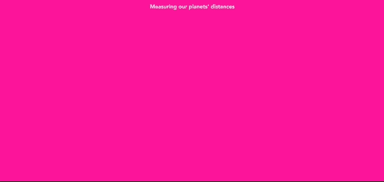

[this looks even better on the final site.](https://bl.ocks.org/larsvers/raw/c894849af45ce94dc85d76467980f922/)

这是我们太阳系行星的形象化图，显示了它们与太阳的距离。缩放将方便地允许概览，平移传达了一些距离感。另外，所有的圆球都是粉色的！

哦，你真的不需要，但是如果你想，你可以跟着去。[点击此处查看所有注释代码](https://github.com/larsvers/Understanding-Zoom)。或者，你可以一步一步地玩[这个应用程序。每当我们有进展的时候，我都会放一个链接。](https://bl.ocks.org/larsvers/93b2f692217845d51fc75cd43c029303)

### 构建我们的静态视觉

和几乎所有的观想一样，数据是我们的起点。这是它的全部内容:


我们有八颗行星，一颗叫做太阳的恒星，还有冥王星，它实际上不再是一颗行星了，但是因为浪漫的原因还在这里。我们也知道每颗行星离太阳的距离和它们的半径。这就是我们所需要的。但是为了把它变成这样:

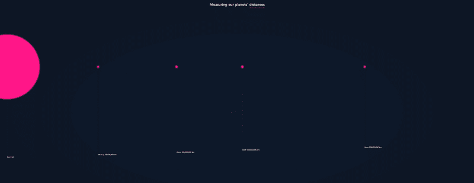

…我们需要写一些代码。

请注意:这篇文章是关于缩放的，而不是关于构建我们太阳系的静态图像。尽管如此，我还是会浏览一下代码，让您了解一下这个应用程序。然而，如果你只是为了缩放，请随意浏览这一部分，并快速进入第一个缩放构建步骤[，确定我们的缩放基础和缩放目标](#c311)(请注意，稍后可能值得阅读[计算尺寸](#b9f7)部分)。

让我们从稀疏的 HTML 开始:

```
<h1 id="headline">Measuring our planets'   <span id="pink">     <a href="http://bit.do/solar-system">distances</a>   </span> </h1> 
```

```
<div id="vis"></div>
```

就是这样。我们有一个带有链接和`span`的标题，给它一个适当的粉红色底部边框和一个用于我们的 vis 的容器`div`。现在，我们将迅速转向 JavaScript，跳过 CSS，直到这篇文章的结尾才邀请 CSS

我们做的第一件事是加载数据:

```
d3.csv('planets.csv', row, function(error, data) {   if (error) throw error;    make(data); 
```

```
}); 
```

```
function row(d) {   return {     planet: d.planet,     distance: +d.distance,     radius: +d.radius   }; }
```

我们正在加载我们的 *planets.csv* 通过`row()`函数来传送它，这确保我们的数字确实是数字。然后我们调用`make()`函数，它将是所有后续代码的归宿。

`make()`功能执行以下操作:

1.  它设定了我们视觉的维度
2.  它构建了一个`svg`和一个缩放表面
3.  它计算我们的尺度
4.  它构建了我们的轴心
5.  它建造了行星

让我们从设置我们的视觉尺寸开始。

#### 计算尺寸 [^](#3f43)

边距和高度的计算很简单:

```
var margin = {   top: window.innerHeight * 0.3,   left: 50,   bottom: window.innerHeight * 0.4,   right: 50 }; 
```

```
var height = window.innerHeight - margin.top - margin.bottom;
```

我们希望`svg`元素覆盖整个屏幕。所以我们的高度是 T1 减去一些空白。我们定义了相对于`window.innerHeight`的顶部和底部边距，以保持它们之间的相对性。

在宽度上，只需要多一点思考:

```
var maxDist = d3.max(data, function(d) { return d.distance; }); 
```

```
var mapScale = 1/10e4; 
```

```
// The full width of all planets var chartWidth = maxDist * mapScale; 
```

```
// svg width will only be as large as screen var screenWidth = window.innerWidth - margin.left - margin.right;
```

我们宽度计算的要点是我们想要**两个**宽度。一个用于图表，一个用于`svg`。有什么区别？嗯，这个图表会很宽，因为它需要把我们所有的星球都放在上面。然而，`svg`不需要很宽。`svg`的任务是向我们展示适合我们浏览器窗口的行星。窗户尺寸的一个`svg`从此就足够了。它看起来会像这样:

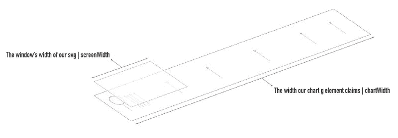

Our chart is wider than our svg

请注意，这仅可能使用缩放行为。如果我们想让用户在没有缩放和平移魔法的情况下看到所有的行星，我们需要一个和图表一样宽的`svg`。因此，浏览器会给我们滚动条，用户可以使用滚动条向左或向右移动——就像在奇妙的[中，如果月亮只有 1 像素](http://joshworth.com/dev/pixelspace/pixelspace_solarsystem.html)的视觉效果。

然而，使用 D3 zoom，我们将初始化的 zoom transform 对象将跟踪我们的手势:我们向右、向左以及沿着 z 轴“滚动”了多远，沿着我们的视线几乎穿透了屏幕。

基于转换，我们可以重新定位我们的元素。如果它们碰巧在屏幕坐标内，它们就会显示在我们的基座上`svg`。如果没有也没什么坏处，他们只是不会被发现。

因此，我们的`svg`的宽度将得到`screenWidth`,也就是`window.innerWidth`减去边距。我们的`chartWidth`，所有行星的基地，会有多宽？我们将用我们的`mapScale`将两个相距最远的天体(即太阳和冥王星)之间的距离缩小 10e4，即 1:10000。当冥王星在真实空间中距离太阳 5，913，000，000 公里时，在我们的视觉中，它将距离太阳中心 59，130 像素。

那还不算太糟。向前！

#### 扩建基地

首先，我们构建我们的`svg`基础:一个边距转换的`g`元素悬挂在一个`svg`元素上:

```
var svg = d3.select('#vis')   .append('svg')     .attr('width', screenWidth + margin.left + margin.right)         .attr('height', height + margin.top + margin.bottom)      .append('g')     .attr('class', 'chart')     .attr('transform', 'translate(' + margin.left + ', '            + margin.top + ')');
```

然后我们用一个`rect`元素覆盖它，我们将使用它作为我们的**缩放基础**。这个`rect`将会监听所有的鼠标事件和手势，因此我们大胆地称它为`listenerRect`:

```
var listenerRect = svg   .append('rect')     .attr('class', 'listener-rect')     .attr('x', 0)     .attr('y', -margin.top)    .attr('width', screenWidth)     .attr('height', height)    .style('opacity', 0);
```

这里需要注意的是，我们的缩放基准与缩放目标——我们想要缩放的元素——在同一点上。我们将把我们的缩放基础`listenerRect`附加到`svg`(事实上，它是边距转换后的`g.chart`元素，你可以在上面看到一个代码块)，这也是我们稍后将绘制的行星圆的位置。

scalenext。

#### 设置我们的秤

我们将两个度量映射到屏幕坐标:距离和半径。因此，我们需要两种尺度。这是第一个，以千米为单位将我们星球的半径映射到屏幕半径上:

```
var rExtent = d3.extent(data, function(d) { return d.radius; }); 
```

```
var rScale = d3.scaleLinear()   .domain([0, rExtent[1]])   .range([3, height/2 * 0.9]);
```

首先，我们得到半径比例。我们计算域并将这些值映射到 3px 到略小于窗口高度一半的范围内，保持测量相对于窗口。

我们的第二个尺度是距离尺度:

```
var xScale = d3.scaleLinear()   .domain([0, maxDist])   .range([0, chartWidth]);
```

我们将数据范围映射到完整的`chartWidth`。如果你把它映射到`screenWidth`，所有的行星都会站起来:

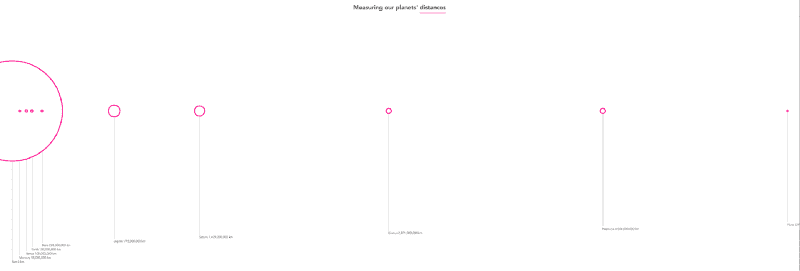

Too dense

我们可以通过使用更紧的半径比例来纠正这一点，但我们希望它们最初可以拉伸，然后允许用户放大或缩小。

#### 绘制轴


‘[Fountain Pen Patent From 1884 — Blueprint](https://fineartamerica.com/featured/fountain-pen-patent-from-1884-blueprint-aged-pixel.html)’ — by [Aged Pixel](https://www.agedpixel.com/)

我们将使用一个普通的 D3 轴组件来构建轴。然而，正如你在上面的图像中看到的，我们将交错标签，使它们不重叠。

首先，我们构建 axis 组件:

```
var xAxis = d3.axisBottom(xScale)   .tickSizeOuter(0)   .tickPadding(10)   .tickValues(data.map(function(el) { return el.distance; }))   .tickFormat(function(d, i) {     return data[i].planet + ' ' + d3.format(',')(d) + ' km';   });
```

我们通过将行星距离值的数组传递给`.tickValues()`来确定刻度标签的确切数量:

```
[0, 58000000, 108000000, 150000000, 228000000, 778000000,   1429000000, 2871000000, 4504000000, 5913000000]
```

轴现在将只为这些值绘制刻度标签。我们使用`.tickFormat()`来指定标签将要表达的内容。在我们的例子中，它将是 *<行星名称> <距离*太阳> <公里>。

现在，我们生产 axis' `g`'底座，并释放其上的组件:

```
var xAxisDraw = svg.insert('g', ':first-child')  .attr('class', 'x axis')   .call(xAxis);
```

像我们的`listenerRect`一样，轴成为我们标记为`svg`的`g.chart`元素的子元素。为什么要插入？我们希望我们的缩放基础位于悬挂在`svg`上的所有其他元素之上，这样它就可以消耗所有事件。看这个 DOM 应该是`svg`的最后一个孩子。为了实现这一点，我们将在 `listenerRect`之前插入轴，很快插入行星*。*

继续我们的轴标签。默认情况下，所有标签将绘制在相同的 *y* 水平上。但是我们希望它们错开，所以我们需要写一些代码来实现这些步骤。这是我们应用的交错巫术:

```
// Move the axis-labels and -lines down 
```

```
var labelHeight = xAxisDraw.select('text').node().getBBox().height; 
```

```
xAxisDraw.attr('transform', 'translate(0, ' +                 (height + labelHeight * data.length) + ')'); 
```

```
// Position the axis text 
```

```
xAxisDraw.selectAll('text')   .attr('y', function(d, i) {     return -(i * labelHeight + labelHeight);   })   .attr('dx', '-0.15em')   .attr('dy', '1.15em')   .style('text-anchor', 'start');
```

不要觉得有义务跟着我进入这个兔子洞——简而言之，我们将它们全部向下移动 *#个标签×它们的标签高度*。然后我们通过*他们的高度×他们的索引*将每个标签上移。结果，例如，太阳不会向上移动，因为它将被 *0 × labelHeight = 0* 抬起，但是水星(太阳的下一颗行星)将向上移动 *1 × labelHeight* 等等。

刻度线需要多一点关注，因为我们必须考虑它的 *y1* 和 *y2* 值:

```
// Draw the axis lines 
```

```
xAxisDraw.selectAll('line')   .attr('y1', function(d, i) {     return -(i * labelHeight + labelHeight);   })   .attr('y2', function(d, i) {       return -(i * labelHeight + labelHeight + from axis-y 0            // ^ this label’s start position              (data.length-1-i) * labelHeight +             // ^ the distance from the start position             //   to the bottom of the chart area               height);             // ^ the height    });
```

好消息。我们现在可以(几乎)在一条 D3 链中画出我们的行星:

```
var gPlanets = svg  .insert('g', '.listener-rect')  .attr('class', 'planet-group');
```

```
var planets = gPlanets.selectAll('.planet')     .data(data)  .enter().append('circle')     .attr('class', 'planet')     .attr('id', function(d) { return d.planet; })     .attr('cx', function(d) { return xScale(d.distance); })     .attr('cy', 0)     .attr('r', function(d) {       d.scaledRadius = rScale(d.radius);       return d.scaledRadius;     });
```

首先，我们为所有的行星创建一个组，并通过在`rect.listener-rect`前插入`g.planet-group`来确保`listenerRect`也覆盖这些行星。然后，我们将数据加入到虚拟的“T4”中，这些虚拟的“”将显示为圆圈，分别以 x 位置和 d 半径表示缩放后的距离。所以在那里:

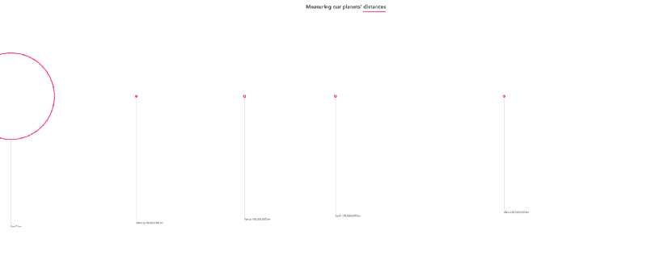

A sensible planetary layout

太好了！我们看到了。现在让我们来看看变焦镜头…

### 确定我们的缩放基数和缩放目标 [^](#3f43)

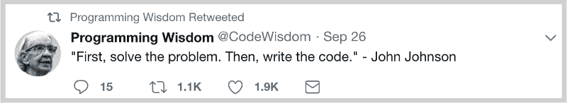

在一头扎进代码之前，先想想自己想做什么通常是一个明智的想法。在设置我们的缩放之前，让我们确定**什么**和**如何**我们想要缩放和平移。我们问 3 个问题:

1.  我们的缩放基础是什么——我们将用于缩放的“传感器元件”?
2.  我们的缩放目标是什么——我们要移动的元素？
3.  我们希望每个元素的缩放类型是什么——几何缩放还是语义缩放？

#### 确定我们的缩放基数

让我们首先选择缩放基础元素。您可以将缩放附加到`svg`、`g`、`rect`或鼠标可以访问的任何其他元素。注意这里的`g`元素只能注册有设置了`fill`属性的子元素的事件。因此，如果你有一个半径为 1 的大的`g`元素，你的缩放手势将只在那个小圆上起作用。

因此，设置一个专用的`rect`填充，但不透明通常是明智的。你必须确保缩放基数可以消耗所有事件。因此，它应该在所有其他元素之上，或者它的`pointer-events`应该被设置为`all`，而所有其他元素的`pointer-events`被设置为`none`。

事实上，我们已经完全决定设置一个额外的`rect`元素来监听事件。我们明智地将它缓存在`listenerRect`变量中，我们可以在设置时引用它。完成了。

#### 确定我们的变焦目标

现在让我们确定我们的目标元素并写下来。缩放和平移时，我们希望移动哪些元素？让我们列一个清单:

*   行星
*   轴及其所有元素(仅刻度线和刻度文本；我们没有显示轴路径)。

现在我们知道了我们的缩放基准和目标，我们希望确保它们在初始缩放状态下共享相同的坐标系——此时尚未发生缩放或平移。这就是为什么我们把变焦基座和目标(行星，轴)连接到上面的同一个`g`。

这真是太好了！

#### 识别缩放类型

最后，让我们决定**如何**缩放它们——几何缩放还是语义缩放？首先，这种区分只对缩放有意义，对平移没有意义。我们已经在上面定义了它，但是出于冗余完整性的目的，让我们重复几何缩放很简单:所有元素只是被均匀地放大或缩小。语义缩放稍微复杂一点，因为您可以决定想要放大或缩小什么。

在我们的例子中，我们可能想要放大行星的尺寸，但是保持线宽为 4px。为此，我们需要语义缩放。出于我们的教育目的，让我们实现这两种类型！为什么不呢？

#### 设置缩放

对于我们决定实现的任何缩放，我们都需要首先设置它。你可能会同意，这再简单不过了:

```
var zoom = d3.zoom() .on('zoom', zoomed);
```

调用`d3.zoom()`将返回一个对象和一个函数。与 D3 API 的许多部分一样，该对象允许我们配置函数中使用的变量。所以我们在上面做的是用一个方法配置`d3.zoom()`函数的使用:`.on()`附加一个名为`zoomed`的处理函数。`zoomed`每次都会叫我们`zoom`。这是我们让元素移动的地方。

我们有另外两个缩放周期事件来触发功能，`start`和`end`。猜测他们何时触发回调应该相对容易。

我们将返回的函数存储在创造性命名的变量`zoom`中。接下来，我们可以将这个函数用作`zoom(<listener-elemen` t >，或者更常见的用法是`in D3 <listener-element>`；。像这样呼叫(缩放):

```
listenerRect.call(zoom);
```

这很好，但这意味着什么呢？这意味着`listenerRect`现在是我们 zoom 的官方主页。我们的**变焦基地**！此时此刻，它有两件事情悬而未决:事件和缩放变换。如果我们`console.dir(d3.select(‘#listener-rect’).node())`并检查我们的属性，我们会在列表的最底部找到这两个 D3 属性:

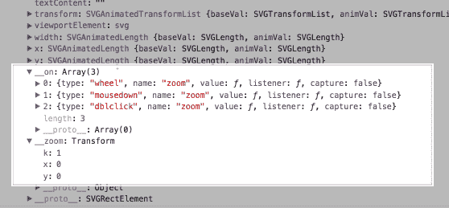

`__on`对象保存我们的监听器信息，而`__zoom`对象是一个 transform 对象，保存我们在本文开始时讨论的 3 个值:缩放和平移时的 *x* 和 *y* 平移，以及缩放时改变的比例因子 *k* 。

您可以随时来到您的缩放基准(我们称之为`listenerRect`)来查询当前的变换值。但是，您不需要经常这样做，因为在事件对象中，可以从我们的`zoomed`处理函数中方便地访问转换。没错。为了我们生命中的爱——让我们最终变焦。

### SVG 几何缩放

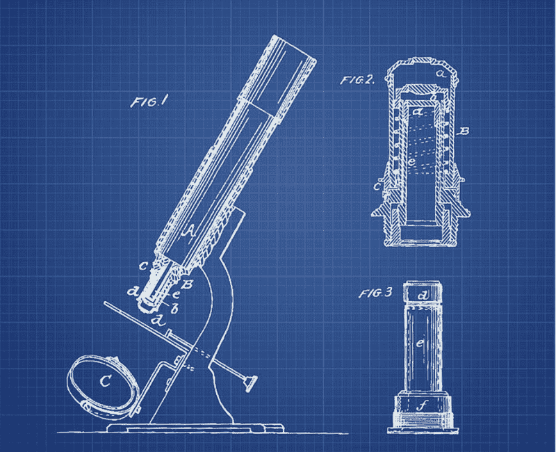

‘[Microscope Patent From 1865 — Blueprint](https://fineartamerica.com/featured/microscope-patent-from-1886-blueprint-aged-pixel.html)’ by [Aged Pixel](https://www.agedpixel.com/)

我们有静态图像了。我们已经设置了变焦。我们把它安装在变焦底座上。让我们最终决定我们要用哪种变焦方式。事情是这样的:轴应该在语义上缩放，其他元素由您决定。回到我们的缩放目标，让我们在一张羊皮纸上的一个表格中发布这个命令:


现在，让我们编写缩放处理程序:

```
function zoomed() { 
```

```
 var transform = d3.event.transform; 
```

```
 gPlanets.attr('transform', transform.toString()); 
```

```
}
```

我们还没有完全完成，但这是最简单的变焦可能，并已经移动我们的星球。我们缓存悬挂在变量`transform`中的`d3.event`对象的变换对象，该对象在每次缩放和平移时被传递。然后我们通过更新我们的圆的`transform`属性来移动我们的行星。

只是 transform 对象给我们的一个方便的方法。它使我们不必键入转换属性的值。对于身份转换`{ k: 1, x: 0, y: 0 }`，它返回字符串`"translate(0, 0) scale(1)"`

这个看起来怎么样？

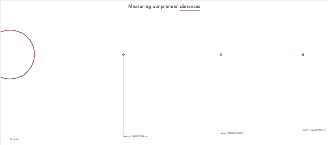

Super! The planets move (all over the shop)

非常好！行星在移动，其余的没有移动。我们需要做三件事来改善这种情况:

1.  让我们禁止行星向右移动(太阳的左边没有行星，所以这是徒劳的)。
2.  让我们也禁止行星上下移动。
3.  移动天平。

1 和 2 很简单；我们只是在使用变换对象之前对其进行操作，如下所示:

```
function zoomed() { 
```

```
 var transform = d3.event.transform;     transform.x = Math.min(0, transform.x);   transform.y = 0; 
```

```
 gPlanets.attr('transform', transform.toString()); 
```

```
}
```

结果， *x* 永远不会大于 0，因此我们不能向右移动。同样， *y* 将始终为 0。结果如我们所料:

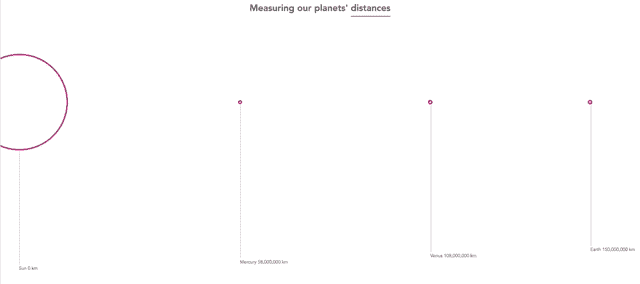

The planets move (..only over the sensible shop parts)

接下来，让我们让轴在语义上移动。我们的轴由标签和线条组成。我们选择语义缩放而不是几何缩放，因为我们只想在缩放时改变它们的**位置**——而不是标签大小或线宽。

轴元素(使标签和线条移动的东西)背后的主要定位引擎是秤。秤有什么作用？比例将我们的数据值映射到我们的`svg`元素的宽度。如果我们想用 D3 改变一个标度，我们通常更新标度的域和/或范围。但是由于重定坐标轴对于 D3 zoom 来说是一个很常见的活动，我们让`rescaleX()`和`rescaleY()`方法悬挂在`transform`对象上。它会根据缩放比例为我们更新贴图。我们可以用完美的句法糖来创建一个更新的音阶:

```
var xScaleNew = transform.rescaleX(xScale);
```

下一节叫做用 SVG 进行*语义缩放*，将会详细介绍这个`rescaleX()`方法。但是现在，让我们像这样信任地使用`xScaleNew`:

```
xAxis.scale(xScaleNew); xAxisDraw.call(xAxis);
```

我们更新了`xAxis`的比例，并用新的轴组件重绘了轴。我们需要对轴做的最后一件事是再次交错我们的标签和线条，就像我们上面做的那样。

```
// Stagger the axis-labels xAxisDraw.selectAll('text')   .attr('y', function(d, i) {     return -(i * labelHeight + labelHeight);   }) 
```

```
// Stagger the axis-lines xAxisDraw.selectAll('line')   .attr('y1', function(d, i) {     return -(i * labelHeight + labelHeight);   })   .attr('y2', function(d, i) {     return -(i * labelHeight + labelHeight            + (data.length-1-i) * labelHeight + height);   });
```

记住，所有这些都发生在我们的`zoomed`处理程序中。

它起作用了:

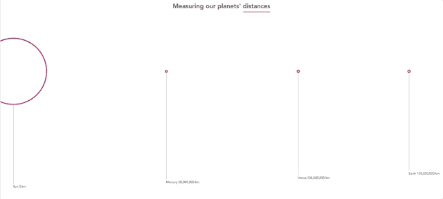

Geometric zoom with SVG [with](https://bl.ocks.org/larsvers/95115f57fb67ac8c0a568fdd28ae8c00) and [without code](https://bl.ocks.org/larsvers/raw/95115f57fb67ac8c0a568fdd28ae8c00)

### SVG 语义缩放

这个标题来的有点晚。我们已经在语义上缩放了我们的轴。但是现在让我们也把它应用到我们的行星上，开始重新标度的过程。这是我们更新的准备表:

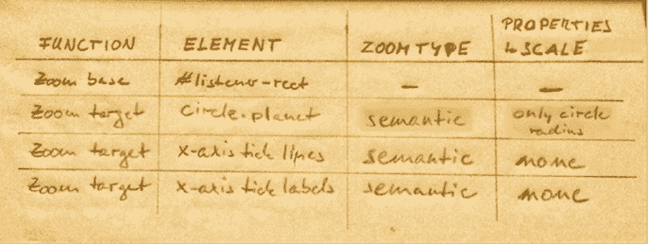

#### 圆的语义缩放

首先，我们为什么要在行星上使用语义缩放？我猜上面的 gif 很好地展示了语义需求。随着行星变小，它们的轮廓几乎看不见了。通过语义缩放，我们可以控制哪些元素属性会改变或保持不变。在我们的例子中，缩放应该改变行星的位置和大小，但是轮廓笔画的宽度应该保持不变，为 4px。

我们要做的很简单:

```
function zoomed() { 
```

```
 var transform = d3.event.transform; 
```

```
 transform.x = Math.min(0, transform.x); 
```

```
 var xScaleNew = transform.rescaleX(xScale); 
```

```
 planets     .attr('cx', function(d) {       return xScaleNew(d.distance);     })    .attr('r', function(d) {       return d.scaledRadius * transform.k;     }); 
```

```
 // Zoom and pan the axis here (…) 
```

```
}
```

首先，我们删除我们的几何行星缩放。然后我们抓取我们的行星，而不是转换它们，我们只访问它们的`cx`和`r`属性。将使用更新后的`xScaleNew`重新计算 *x* 位置，半径只需乘以比例因子。这里不需要翻译。

就是这样:

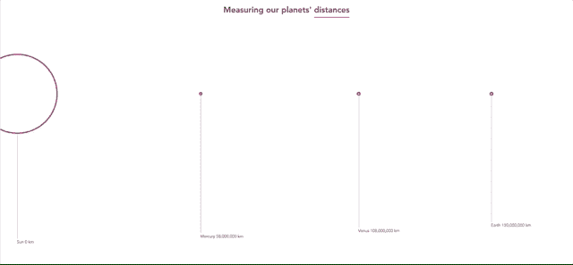

Semantic zoom with SVG [with](https://bl.ocks.org/larsvers/1333b243c89809d39290e42bb3d79924) and [without code](https://bl.ocks.org/larsvers/raw/1333b243c89809d39290e42bb3d79924)

无论我们放大或缩小多远，我们的行程保持在 4px，即使它们被完全缩小，我们也能看到我们的行星。

#### 了解缩放比例

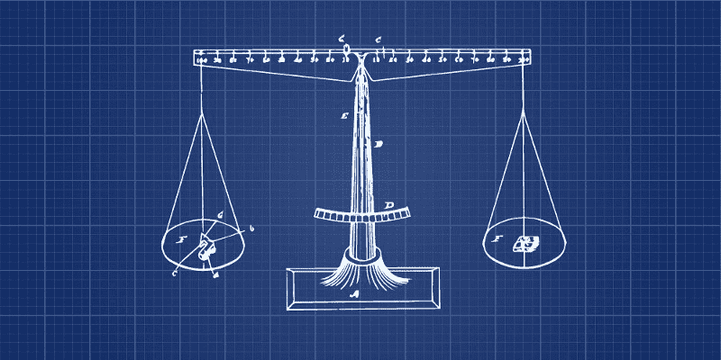

some non-related scales

语义缩放要求我们有选择地缩放和平移属性。我们上面的语义行星缩放只改变了`cx`和`r`属性，同时保持笔画宽度为 4px。为了具体改变`cx`，我们需要更新我们的比例——我们可视化的主要定位引擎——以便它根据新的变换来定位我们的元素。

如上所述，D3 提供了方便的方法`rescaleX()`和`rescaleY()`来根据变换更新比例。当然，在不知道内部工作原理的情况下使用这些方法是完全没问题的，所以请随意直接跳到下一节的[。但是，如果你对重新标度究竟是如何发生的感到好奇，请继续关注我。还会有彩色图像。](#6867)

我们将使用一个非常简单的例子。假设我们只看 x 维，我们想把一个覆盖 0 到 100 的域的数据空间映射到 1000 像素宽的屏幕上。因此，我们有一个数据域[0，100]，我们希望映射到宽度范围[0，1000]。我们的规模应该是这样的:

```
var xScale = d3.scaleLinear()   .domain([0, 100])   .range([0, 1000]);
```

我们还假设有一个数据值为 20 的圆形，它将被映射到像素值 200:

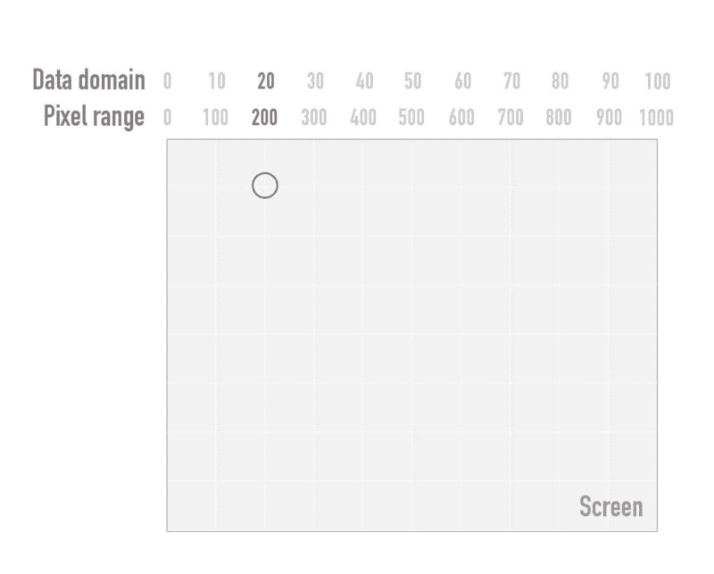

简单。现在我们放大，这样我们的比例因子将会是 2。没有翻译，只是放大。因此，我们的圆将根据我们在本文开始时使用的缩放变换公式移动: *tx + x × k* ，这将导致 *0 + 200 × 2 = 400* :

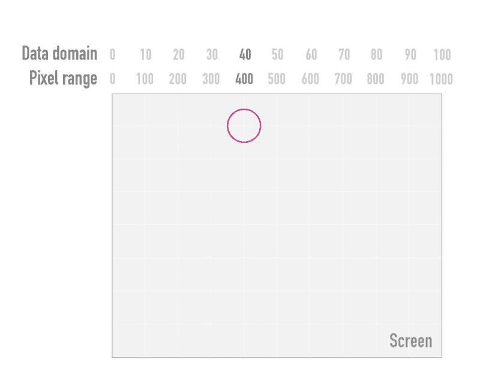

请注意，我们还将其半径放大了 2 倍。目前一切都好吗？太好了。

在这种情况下，我们可以只对圆进行变换计算。但是继续使用我们的量表要简单得多，更方便，也更一致。但是，我们需要更新它，因为我们的数据值 10 不应该扩展到 100 像素，而是 200 像素！

我们如何做到这一点？正如我们上面所做的，我们只是将我们的`xScale`传递给`transform.rescaleX()`函数。这将分别返回更新后的`newXScale`，我们使用圆的数据值来确定`cx`位置:

```
var newXScale = transform.rescaleX(xScale); 
```

```
circle.attr(‘cx’, function(d) { return d.dataValue; }); // note: d.dataValue is from a fictitious dataset
```

但是这种重新标度到底有什么作用呢？我们先看一下[来源](https://github.com/d3/d3-zoom/blob/master/src/transform.js#L33) [代码](https://github.com/d3/d3-zoom/blob/master/README.md#transform_rescaleX)再考虑它的逻辑。引擎盖下的重新标度看起来像这样:

```
function rescaleX(x) { 
```

```
 var range = x.range().map(transform.invertX, transform), 
```

```
 domain = range.map(x.invert, x); 
```

```
 return x.copy().domain(domain); 
```

```
}
```

正如您在最后一行中看到的，它将返回原始的 scale **和更新的域**。范围将保持不变。如果你在我看这段代码之前问我，我会猜到 D3 会更新范围并保持域不变。直接多了。但是反过来了。这是有意义的，因为像素范围是一个更静态的概念。在我们的例子中，1000 是屏幕的宽度——缩放时不会改变。

(小)缺点是新的域计算比新的范围计算稍微复杂一些。在每次缩放和平移移动时，计算新域涉及 4 个步骤:

1.  我们首先取原始比例尺的范围。在我们的例子中，这将是[0，1000]。
2.  然后我们对它进行逆变换，这将返回[0，500]。
3.  接下来，我们将使用标尺的`.invert()`方法来查找与范围值 0 和 500 相关联的数据值，在我们的示例中为[0 和 50]。
4.  最后，我们用这个新域覆盖当前的 x-scale 域并返回它。

但是为什么呢？让我们从概念上考虑一下…

首先，我们通过对 *x* 值取变换函数的反函数来计算新的范围。现在我们知道了 *x 的缩放变换函数是 tx + x × k* 。它的逆是 *(x — tx) / k* 。

如果你从未遇到过反函数，它们正好相反——与主函数相反。如果你有 **f(x) = 3 × x** ，那么反过来就是 **g(y) = y/3** 。将 2 代入主函数 **f(x)** 返回 6 —将这 6 代入反函数 **g(y)** 再次返回 2。它反转了主函数的过程。

为什么我们的范围是相反的？我们希望调整域，但将范围保持在[0，1000]。获取更新的属性域的最简单方法是首先计算更新的范围范围值(最小值和最大值),以便从中获得新的属性域范围值。

让我们用一个值来演示一下。让我们取最大范围值 1000。我们当前的比例将最大数据值 100 映射到最大范围值 1000 像素。

当我们缩放 2 倍时，最大范围值是多少？缩放 2 意味着我们在放大。因此，我们当前的最大范围值 1000 将移动到 2000 *(0 + 1000 × 2)* 。但是，我们想知道缩放时移动到屏幕边缘的新像素点。之前的 1000 点和现在的 2000 点对我们没有帮助，因为它现在已经超出了屏幕区域。那么，在我们缩放后，哪个点在我们窗口的边缘呢？哪一点是我们新的最大距离值？

为了达到这一点，我们不会问:我们当前的最大范围值 1000 缩放到哪里？我们问，新的最大射程值从何而来！逻辑上，这是相反的或者说**逆**的问题。相应地，我们应用逆缩放变换:*(x-tx)/k*。我们插入之前的最大范围值 1000px，我们的 *tx* 为 0，scale *k* 为 2，得到:*(1000–0)/2 = 500*。

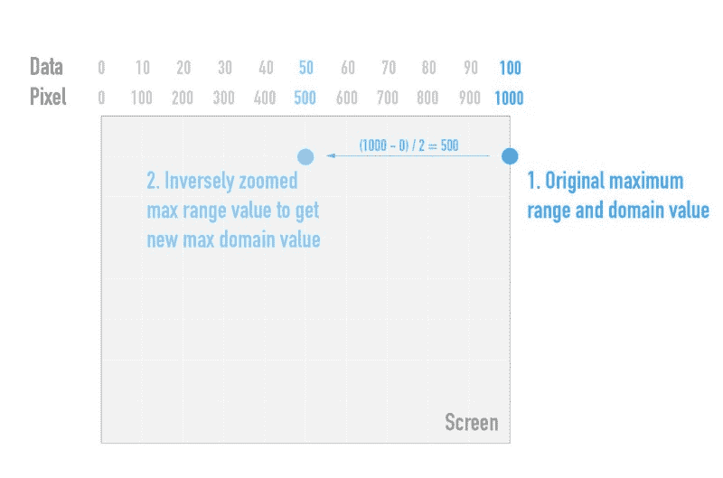

我们现在可以说我们的新的最大范围值将来自像素位置 500。

我们为什么要再做一次？这是不是有点愚蠢，因为我们无论如何都要将范围保持在[0，1000]？是的。不，这并不愚蠢，因为我们没有在新的量程输入中使用这个新的最大量程值。我们只是用它来找到我们新的最大 data domain 值。

我们采用原始标度，该标度映射了 0 到 0 像素的数据值、100 到 1000 像素的数据值以及相应的所有中间值。现在我们问哪个数据值映射到像素值 500？对于这个简单的例子，我们可以使用我们的大脑，或者更好的是，我们使用我们最初的 x-scale 的`.invert()`方法。`xScale.invert(500)`大概会像预期的那样返回 50。

让我们记住这里，我们仍然有我们的原始范围[0，1000]。我们所做的所有距离计算都是为了到达新的区域。我们新的 x-scale 仍然将数据值 0 映射到像素 0，但是现在将新的最大数据域值 50 映射到忠实的最大范围值 1000。


同样，我们的圆心 x 值仍然有数据值 10，它现在没有映射到 100 而是映射到 200。我们成功地放大了，是的。

干得好！现在，开始画吧。相同的游戏—不同的棋盘…

### 用画布进行几何缩放 [^](#102a)

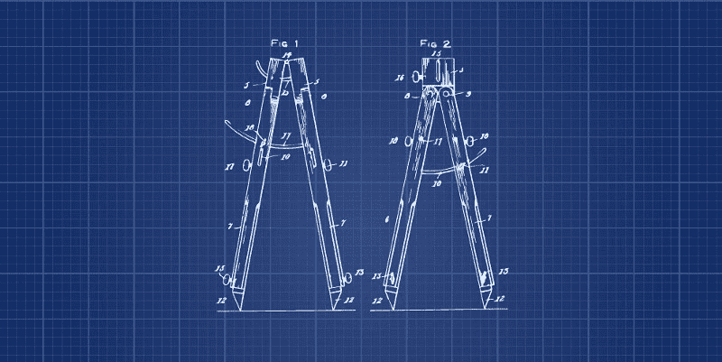

我们的网站上只有 10 个圈子。然而，当然还有更多的球体可以想象。可视化超过 1000 个可能会让你陷入渲染性能问题，你可以尝试用画布来解决。

与 SVG 不同，Canvas 为您的绘图生成单个位图。屏幕上的 1000 颗行星将被绘制到一个 DOM 元素中，即`canvas`。在 SVG 中，1000 个行星将产生 1000 个圆形元素，浏览器必须维护这些元素，这会影响性能。如果你想知道更多，在下面的[来源](#28f2)部分有一个画布资源列表，但是不要担心，你不需要一个画布学位。

我们将在我们的应用程序中改变很少。作为一个快速提醒，以下是我们实现这一目标的主要步骤:

1.  加载数据
2.  计算我们视觉的维度
3.  **构建 SVG 基底和监听器矩形**
4.  计算比例
5.  定义并绘制轴
6.  **构建 SVG 视图**
7.  **缩放**

我们将改变上面的第 3、6 和 7 点，其余的保持不变。事实上，我们不会产生一个纯画布绘图，而是将在画布上绘制行星，并将轴保留在 SVG 中。这被称为**混合模式渲染，**，如果你有轴要画，这真的很聪明。在 SVG 中，D3 很好地解决了绘制轴的问题，但是在画布上却很麻烦。( [Elijah Meeks](https://www.freecodecamp.org/news/get-ready-to-zoom-and-pan-like-a-pro-after-reading-this-in-depth-tutorial-5d963b0a153e/undefined) 在他的书 [D3js in Action](https://www.manning.com/books/d3-js-in-action) 的第 11 章中专门用了很好的一节来介绍混合模式渲染)

#### 添加画布基底

与 SVG 一样，我们需要一个基础来借鉴。对于 Canvas，我们需要两样东西,`canvas`元素和它的绘图上下文——我们可以用来在画布上绘图的工具。在我们的`svg`基础下，我们添加了下面的画布基础片段:

```
var canvas = d3.select('#vis').append('canvas')   .attr('width', screenWidth + margin.left + margin.right)     .attr('height', height + margin.top + margin.bottom); 
```

```
var context = canvas.node().getContext('2d');
```

跳过画布的边距惯例通常是明智的(我们没有可以移动的`g`)。但是，特别是在绘制 SVG 轴时，我们要抓住我们的边界。

我们还想将我们的`canvas`元素完美地覆盖在`svg`元素及其子元素，行星`g`和`listenerRect`上。为了实现这一点，我们需要给它与`svg`元素相同的大小，并将画布绝对放置在`svg`的顶部。这是我们的 CSS:

```
canvas {   position: absolute;   top: 0;   left: 0;   pointer-events: none; }
```

注意，我们还从我们的`canvas`中移除了所有的指针事件，这样`listenerRect`就可以接收所有的手势。因此，我们有相当多的层:

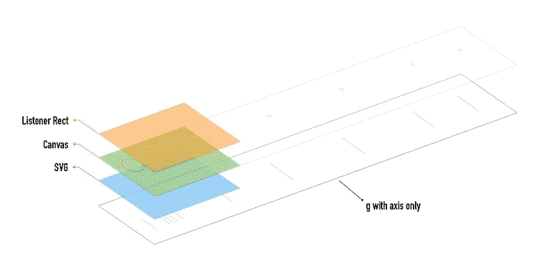

Our layer cake with SVG axis and Canvas planets

`g`现在只包含我们的轴，我们可以通过`svg`查看。`canvas`将显示我们的行星，但只有上面绿色的部分(其他行星在这里画出来是为了完整，但最初是看不见的)。顶层是`listenerRect`，它消耗所有指针事件，并通知我们缩放和平移。

#### 在画布上画行星圈

我们去掉了构建 SVG 行星的逻辑，取而代之的是画出我们的画布圆圈。我们将在一个函数中绘制它。在运行之前，让我先向您展示一下这个画布绘制函数的代码。我们开始吧:

```
function drawGeometricCircles(data, transform) {
```

我们传递数据和转换。如果我们只想建立一个静态的视觉效果，我们不需要担心转换，但是缩放是我们的使命！

```
 context.clearRect(0, 0, screenWidth + margin.left + margin.right,                       height + margin.top + margin.bottom);
```

接下来，我们访问画布上下文(缓存在`context`变量中)并运行一个名为`.clearRect`的方法。你肯定能猜到它的作用——它清除了`canvas`。我们传递给它`canvas`维度，每次我们调用这个函数时，它都会清除`canvas`。

这就是我们对画布所做的。不像在 SVG 中，我们在 DOM 中为我们的圆指定了节点，我们在`canvas`上只有一个像素图像。我们不需要移动 DOM 节点，只需移除之前绘制的图像，并绘制一个新图像，其中元素的位置略有不同。那是给你的画布。

```
 context.save();
```

然后我们`.save()`默认的和不变的上下文，我们`.restore()`它在所有的绘图完成之后。这样，我们不仅得到了一块空白的画布，而且每当我们画一颗新的行星时，也得到一块空白的背景。

```
 context.lineWidth = 4;   context.strokeStyle = 'deeppink';   context.fillStyle = 'white';
```

接下来，我们定义我们的画笔。我们想要一个 4px 的线宽，我们想要一个深粉红色的笔画颜色和白色填充。这些美学属性将在我们设置后应用于我们绘制的所有东西。直到我们改变他们。

```
 context.translate(transform.x + margin.left, margin.top);       context.scale(transform.k, transform.k);
```

接下来的两行是几何缩放。我们通过相应的变换值来平移和缩放我们绘制的整个图像。

```
 for (var i = 0; i < data.length; i++) {
```

```
 context.beginPath();    context.arc(xScale(data[i].distance), 0,                 rScale(data[i].radius), 0, 2 * Math.PI, false);     context.stroke();     context.fill(); 
```

```
 context.fill(); 
```

```
 } 
```

```
 context.restore(); 
```

```
}
```

最后，我们画圆。如果你还没有见过很多画布，这可能看起来有点原始。事实上，D3 通过将数据加入到我们随后可以访问、定位和样式的选择中，为我们内在化了这个循环。

在画布上，我们自己来做。我们遍历数据，开始一条路径，用`context.arc()`方法把路径画成一个圆，最后描边，填充路径。

剩下的就是一段代码了。我们只需要在这里调用它，然后用我们的数据和身份，转换，这就是简单的`{ k: 1, x: 0, y: 0 }`:

```
drawGeometricCircles(data, d3.zoomIdentity);
```

每当我们缩放时，我们用以下代码替换移动 SVG 行星的代码:

```
drawGeometricCircles(data, transform);
```

我不会给你 gif，因为它看起来就像我们在上面看到的几何 SVG 缩放。但是代码的工作实现只需要点击一下！

### 带画布的语义缩放

让我们通过摆脱它来庆祝我们的几何缩放壮举。事实上，要实现语义缩放而不是几何缩放，我们只需重命名并更改我们的 draw 函数。我们会恰当地称之为`drawSemanticCircles()`。

在 Canvas 中从几何缩放更改为语义缩放需要相同的高级操作。我们将根据变换改变行星的位置和半径，而不是平移和缩放行星的坐标系。

`drawSemanticCircles()`将清空我们的画布，然后用`drawCircle()`绘制所有的圆:

```
function drawSemanticCircles(data, transform) { 
```

```
 context.clearRect(0, 0, screenWidth + margin.left + margin.right,                     height + margin.top + margin.bottom); 
```

```
 for (var i = 0; i < data.length; i++) {     drawCircle(data[i], transform);   } 
```

```
}
```

`drawCircle()`将对每个数据元素运行，取数据元素和当前变换:

```
function drawCircle(elem, transform) { 
```

```
 var x = (transform.x + transform.k * xScale(elem.distance))           + margin.left;  var y = margin.top;   var r = transform.k * rScale(elem.radius); 
```

```
 context.lineWidth = 4; context.strokeStyle = 'deeppink';     context.fillStyle = 'white'; 
```

```
 context.beginPath();   context.arc(x, y, r, 0, 2 * Math.PI);   context.stroke();   context.fill(); 
```

```
}
```

我们首先确定 *x* 和 *y* 位置以及半径 *r* 。然后我们为我们的圈子定义风格。最后，我们把我们的银河球体画成弧线。就这样…

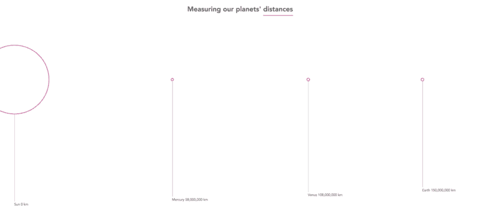

Semantic zoom in Canvas [with](https://bl.ocks.org/larsvers/32f2ef58c910e1d4ada8a462f7474b75) and [without code](https://bl.ocks.org/larsvers/raw/32f2ef58c910e1d4ada8a462f7474b75)

太好了！我们已经在两个渲染器中讨论了两种类型的缩放。关于奖金轨道:程序化缩放和使我们的星系漂亮…

### 程序化缩放

将我们的视觉效果移到某个特定的位置通常是有帮助的。你可以让用户将地图居中，将一个长条形图移动到开头，或者放大和缩小太阳系。

我们既没有地图也没有条形图，所以让我们在加载时有计划地缩小和缩小到我们的星球。为此，我们回到 SVG，因为我们在这里并不真正需要画布。由于它的水平较低，我建议只有在你需要或者像母语一样说的时候才使用 Canvas。因为我们这里只有 10 个圈可以转，所以我们不需要它。

以下是我们想要实现的目标:

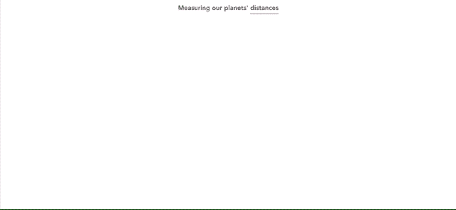

Programmatic zoom in SVG [with](https://bl.ocks.org/larsvers/4b39be68e8cb77e7c402bd96df292db0) and [without code](https://bl.ocks.org/larsvers/raw/4b39be68e8cb77e7c402bd96df292db0)

我们从一个放大了 20 倍的图像开始。然后我们缩小到最小的缩放比例，这样所有的行星都可以舒适地放在页面上。最后，我们放大到默认的缩放比例 1。

为了实现这一点，我们将编程逻辑附加到我们所有应用程序代码所在的`make()`函数的底部。我们首先放大到 20 的比例因子，而不平移:

```
var initialTransform = d3.zoomIdentity.scale(20); listenerRect.call(zoom.transform, initialTransform);
```

`d3.zoomIdentity`返回我们已经遇到过几次的恒等式变换。我们将变换比例更改为 20，并将其缓存在`initialTransform`中。然后我们使用`zoom.transform()`功能。这个函数明显不同于我们的 transform 对象，而是直接操纵它。我们在这里将它与我们上面遇到的 D3 自己的`<selection>.` call()方法一起使用。我们 `call zoom.trans`形成的选择()将是它的第一个参数。这将是我们的 zoom `base listen` erRect，我们当前变换对象的 home。第二个参数必须是一个新的转换对象。它将替换该节点上的当前变换。

最重要的是，我们可以将缩放基数作为一个简单的选择来传递，而不是作为一个过渡来传递。记住(或注意)过渡只是派生的选择，所以传入`listenerRect.transition()`实际上会将我们的视觉从一个变换过渡到另一个。

但是到目前为止，我们刚刚把图像放大到 20 倍。让我们开始过渡吧。首先是我们之前定义的标度`minZoom`，然后是标度 1。我们是这样做的:

```
// Trigger programmatic zoom progZoom()
```

我们来写吧。这不需要任何争论:

```
function progZoom() {
```

我们首先为我们想要缩放的`minZoom`定义变换:

```
var zoomOutTransform = d3.zoomIdentity.scale(minZoom);
```

在下面几行中，我们将`listenerRect`转换成一个转换，并再次调用`zoomTransform()`。使用`.call()`,我们传递我们刚刚构建的转换作为第一个参数和`zoomOutTransform`——我们刚刚保存的`minZoom`转换:

```
listenerRect   .transition()   .duration(5000)   .call(zoom.transform, zoomOutTransform)     .on('end', zoomToNormal)
```

在缩放结束时，我们调用一个名为`zoomToNormal`的函数。除了转换-缩放到身份转换之外，它与我们刚才所做的完全一样:

```
function zoomToNormal() {   listenerRect     .transition()     .duration(3000)     .ease(d3.easeQuadInOut)     .call(zoom.transform, d3.zoomIdentity) }
```

除了缩放到不同的变换，我们还设置了不同的持续时间和不同的缓动功能。

```
}
```

这是我们的第一条奖金赛道。转到第二轨道…

### 让我们的视觉更加美丽

明智的做法是让你的视觉效果首先是黑白的(在我们的例子中是粉色和白色)。但最后，舔一舔油漆也没什么坏处。为了到达这里…


Our final app [with](https://bl.ocks.org/larsvers/c894849af45ce94dc85d76467980f922/) and [without code](https://bl.ocks.org/larsvers/raw/c894849af45ce94dc85d76467980f922/)

…我们只需要改变一些东西，其中行星的光芒可能是最精致的。让我们先看看剩下的部分:

我们将添加一个深蓝色的背景，径向渐变从一个稍微亮一点的渐变到深蓝色。这是我们的 CSS 中的一行:

```
body {   font-family: Avenir, sans-serif;  sans-serif;   font-size: 0.75rem;   margin: 0;   background: radial-gradient(#091C33, #091426); }
```

我们将文本和线条的颜色改为灰白色(`#ddd`)，而不是实线，我们使用宽间隙的虚线:

```
.tick line, .lines {   stroke: #ddd;   stroke-width: 0.5;   shape-rendering: crispEdges;   stroke-dasharray: 1,5; }
```

最后，我们用我们最喜欢的`deeppink`填充行星，并添加辉光。光晕是我们应用于每个星球的 SVG 过滤器。这里我就不赘述了，但是你可以在这里找到代码注释。简而言之，在用高斯模糊羽化之前，我们将行星加粗一点。我们填充模糊`deeppink`,惊叹由此产生的辉光。过滤器得到一个 id`#soft-glow`，我们的行星可以用`filter`属性引用它:

```
var planets = gPlanets.selectAll('.planet')     .data(data)  .enter().append('circle')     .attr('class', 'planet')     // (…)     .attr('filter', 'url(#soft-glow)');
```

就是这样！

我们已经走了很长一段路，希望你现在能更好地理解 D3 zoom。我们已经研究了一个简短的方法，你可以在缩放和平移之前和期间遵循。然后，我们将这个蓝图应用到一个带有粉色球体的真实项目中，在 SVG 和 Canvas 中进行几何和语义缩放渲染。作为奖励，我们研究了程序化缩放，并最终使其微妙的粉红色的脸更加粉红色。多么有趣

另外两件事可能会有帮助:一个关于将你的缩放从 D3 v3 更新到 v4 的快速说明，以及一个资源列表。

### 将缩放从 v3 更新到 v4

在 2016 年(和许多代之前一样)，D3 v4 取代了 v3，做出了一些重大但突破性的改变。一些概念上的改变，包括缩放行为，让开发者们夜不能寐(包括我自己)。这些变化是一致的和明智的，但值得注意的是，它们可能会帮助你找到睡眠:

*   与 v3 一样，放大 v4 只是关于 x 和 y 平移以及缩放，即变换参数。当然，这是残酷地简化了复杂性，但这是你在陷入僵局时应该尝试的一句口头禅。
*   在 v4 中，变换参数与缩放基准一起存储，而在 v3 中，它们与行为一起存储。行为现在只是将变换传递给目标。当我们想要在缩放处理程序之外检索转换时，知道这一点很有好处。
*   v3 行为会自动调整您的秤重。在 v4 中，您需要在缩放功能中手动调整比例，并更新所有基于比例的形状和组件。这需要多做一点工作，但是魔法要少得多，关注点的分离要清晰得多。

### 来源[^](#07df)^

没有大量的 D3 (v4)缩放相关的帖子和教程。缺少这些是我写这篇教程的原因之一。然而，有一些缩放宝石以及一些有用的进一步画布相关材料，你可以看看:

文章补充:

*   [GitHub repo 我们在本文中讨论的所有代码](https://github.com/larsvers/Understanding-Zoom)
*   [我们在上面使用代码](https://bl.ocks.org/larsvers/93b2f692217845d51fc75cd43c029303)作为工作应用程序所采取的所有步骤

缩放教程:

*   [缩放由空管解释](http://emptypipes.org/2016/07/03/d3-panning-and-zooming/)
*   [由 Puzzlr 解释的缩放](http://www.puzzlr.org/zoom-in-d3-v4/)
*   [用 React 和 D3 缩放](https://swizec.com/blog/two-ways-build-zoomable-dataviz-component-d3-zoom-react/swizec/7753)

变焦技术:

*   [迈克·博斯托克的变焦示例](https://bl.ocks.org/mbostock/3680958)
*   [几何与语义缩放](http://infovis-wiki.net/index.php/Semantic_Zoom)
*   [D3 v4 缩放 API 参考对象](https://github.com/d3/d3-zoom)

画布:

*   [D3 和画布(不要脸的自引)](https://medium.freecodecamp.org/d3-and-canvas-in-3-steps-8505c8b27444)
*   [更多 D3 和画布](https://www.visualcinnamon.com/2015/11/learnings-from-a-d3-js-addict-on-starting-with-canvas.html)
*   [甚至更多的 D3 和画布](https://bocoup.com/blog/2d-picking-in-canvas)

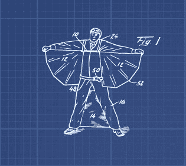

我真心希望你喜欢读这篇文章。如果你想传播消息，请鼓掌，在 [Twitter](https://twitter.com/lars_vers) 和 [do say hello](mailto:lars@datamake.io?Subject=Hello) 上关注我，要么只是打个招呼，要么告诉我其他缩放方式。

知识是片面的，我们都是来学习的…

*最初发布于 [www.datamake.io](http://www.datamake.io/blog/d3-zoom) 。*