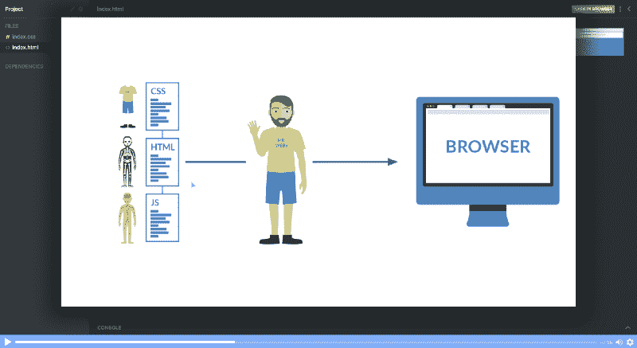
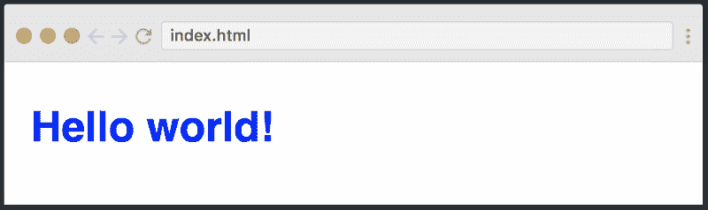
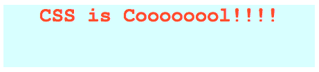

# 5 分钟学会 CSS 初学者教程

> 原文：<https://www.freecodecamp.org/news/get-started-with-css-in-5-minutes-e0804813fc3e/>

#### 网页设计语言快速教程。



Want to take our free CSS course? [Click here!](https://scrimba.com/g/gintrotocss?utm_source=freecodecamp.org&utm_medium=referral&utm_campaign=gintrotocss_5_minute_article)

CSS(层叠样式表)使网页看起来更好，更像样。这是现代 web 开发的重要组成部分，也是任何 web 设计师和开发人员的必备技能。

在本文中，我将给你一个快速的介绍来帮助你开始使用 CSS。

我们还在 Scrimba 上推出了免费的全长度 CSS 课程。 **[点击这里查看。](https://scrimba.com/g/gintrotocss?utm_source=freecodecamp.org&utm_medium=referral&utm_campaign=gintrotocss_5_minute_article)**

我假设你对 HTML 有基本的了解，但除此之外，本教程没有任何先决条件。

### 入门指南

让我们从学习如何在我们的项目中包含 CSS 开始。我们通常有三种方法。

#### 1.内嵌 CSS

首先，我们可以在 HTML 元素中直接包含 CSS。为此，我们使用了`style`属性，然后为它提供属性。

```
<h1 style="color: blue"> Hello world! </h1> 
```

这里我们赋予它属性`color`，并将值设置为`blue`，结果如下:



如果需要，我们还可以在`style`标签中设置多个属性。然而，我不想继续沿着这条路走下去，因为如果我们的 HTML 中充斥着大量的 CSS，事情就会变得一团糟。

这就是引入包含 CSS 的第二种方法的原因。

#### 2.内部 CSS

包含 CSS 的另一种方法是在 HTML 文档的`head`部分使用`style`元素。这就是所谓的内部风格。

```
<head>  
    <style>  
        h1 {  
            color: blue;  
        }  
    </style>  
</head> 
```

在 style 元素中，我们可以通过选择元素并提供样式属性来赋予 HTML 元素样式。就像我们将`color`属性应用于上面的`h1`元素一样。

#### 3.外部 CSS

第三种也是最推荐的包含 CSS 的方法是使用外部样式表。我们创建一个扩展名为`.css`的样式表，并将它的链接包含在 HTML 文档中，如下所示:

```
<head>  
    <link rel="stylesheet" href="style.css">  
</head> 
```

在上面的代码中，我们已经使用`link`元素包含了`style.css`文件的链接。然后，我们将所有的 CSS 都写在一个名为`style.css`的单独样式表中，这样就很容易管理了。

```
h1 {  
   color: blue;  
} 
```

这个样式表也可以导入到其他的`HTML`文件中，所以这对于重用性来说是非常好的。

### CSS 选择器

正如我们之前讨论的，CSS 是一种设计语言，用于设计 HTML 元素的样式。为了设计元素的样式，首先必须选择它们。您已经大致了解了它的工作原理，但是让我们更深入地研究 CSS 选择器，看看选择 HTML 元素的三种不同方式。

#### 1.元素

选择 HTML 元素的第一种方法是简单地使用名称，这就是我们上面所做的。让我们看看它是如何工作的:

```
h1 {  
    font-size: 20px;  
}  
p {  
    color: green;  
}  
div {  
    margin: 10px;  
} 
```

上面的例子几乎是不言自明的。我们选择不同的元素，如`h1`、`p`、`div`，并赋予它们不同的风格属性。`font-size`控制文本的大小，`color`设置文本颜色，`margin`增加元素周围的间距。

#### 2.班级

选择 HTML 元素的另一种方法是使用 class 属性。在 HTML 中，我们可以给元素分配不同的类。每个元素可以有多个类，每个类也可以应用于多个元素。

让我们来看看它的实际应用:

```
<div class='container'>  
    <h1> This is heading </h1>  
</div> 
```

```
 .container {  
    margin: 10px;  
} 
```

在上面的代码中，我们已经将类`container`分配给了 div 元素。在样式表中，我们使用`.className`格式选择我们的类，并给它一个`10px`边距。

#### 3.身份证明

像类一样，我们也可以使用 id 来选择 HTML 元素并对它们应用样式。class 和 ID 的唯一区别是一个 ID 只能分配给一个 HTML 元素。

```
<div>  
    <p id='para1'> This is a paragraph </p>  
</div> 
```

```
 #para1 {  
    color: green;  
    font-size: 16px;  
} 
```

上面的例子展示了我们如何给段落元素分配一个 ID，然后使用样式表中的 ID 选择器来选择段落并对其应用样式。

### Fonts & Colors

CSS 为我们提供了数百种选择，让我们可以使用字体和颜色，让 HTML 元素看起来更漂亮。我们可以从两种字体系列名称中进行选择:

**1。Generic Family:** 一组具有相似外观的字体族(如“Serif”或“Monospace”)

**2。字体系列:**特定的字体系列(如“Times New Roman”或“Arial”)

对于颜色，我们可以使用预定义的颜色名称，或者 RGB、十六进制、HSL、RGBA、HSLA 值。

```
<div class='container'>  
    <h1 class='heading1'>  
        CSS is Coooooool!!!!  
    </h1>  
</div> 
```

```
.container {  
    width: 500px;  
    height: 100px;  
    background-color: lightcyan;  
    text-align: center;  
}

.heading1 {  
    font-family: 'Courier New';  
    color: tomato;  
} 
```



正如你在上面的例子中看到的，我们有一个 div 元素，它的类是`container`。在这个 div 中，有一个带有一些文本的`h1`标签。

在样式表中，我们选择容器类并设置它的`width`、`height`、`background-color`和`text-align`。

最后，我们选择应用于`h1`标签的`.heading1`类，并赋予它`font-family`和`color`的属性。

### 结论

你可能会对这些信息感到有点不知所措，但是不要担心。

只需在 Scrimba 上查看我们的[免费 CSS 入门课程，你将在不到一个小时内成为一名网页设计忍者。](https://scrimba.com/g/gintrotocss?utm_source=freecodecamp.org&utm_medium=referral&utm_campaign=gintrotocss_5_minute_article)

* * *

感谢阅读！我的名字叫 Per Borgen，我是最简单的学习编码方法——Scrimba 的联合创始人。如果你想学习建立专业水平的现代网站，你应该看看我们的[响应式网页设计训练营](https://scrimba.com/g/gresponsive?utm_source=freecodecamp.org&utm_medium=referral&utm_campaign=gintrotocss_5_minute_article)。


[Click here to get to the advanced bootcamp.](https://scrimba.com/g/gresponsive?utm_source=freecodecamp.org&utm_medium=referral&utm_campaign=gintrotocss_5_minute_article)