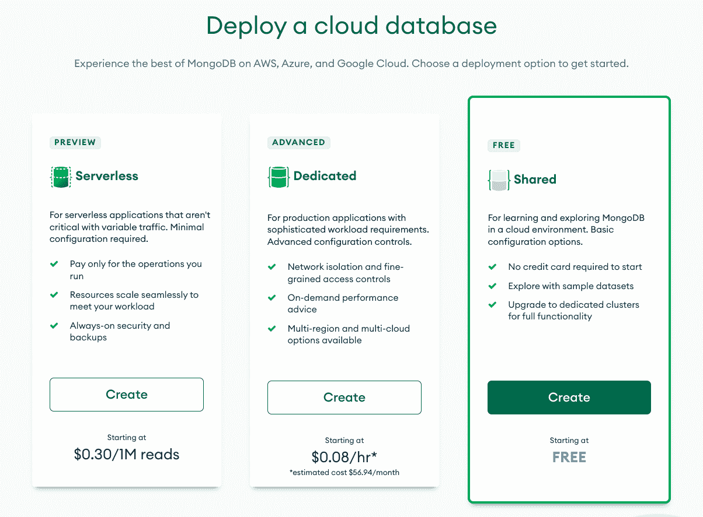
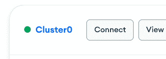

# MongoDB Atlas 教程–如何开始

> 原文：<https://www.freecodecamp.org/news/get-started-with-mongodb-atlas/>

对于下面的挑战，您将使用 MongoDB 来存储数据。为了简化配置，您将使用一个名为 MongoDB Atlas 的服务。

## 创建一个 MongoDB Atlas 帐户

MongoDB Atlas 是一个 MongoDB 数据库即服务平台，这意味着他们为您配置和托管数据库。然后，您唯一的责任就是用重要的东西填充您的数据库:数据。

*   [点击这里](https://account.mongodb.com/account/register)注册一个新的 MongoDB Atlas 账户。
*   在注册表中填写您的信息，然后点击**注册**。

## 创建新的集群

*   在下一页上，填写您的组织名称、项目名称，选择 JavaScript 作为您的首选编程语言，然后单击绿色的**继续**按钮。
*   一旦您创建并验证了您的帐户，请回答入职问题(您的目标、您正在构建的应用程序类型、您首选的编程语言等。)并点击绿色的**完成**按钮。
*   在“部署云数据库”页面上，单击共享集群类型下的**创建**按钮。这应该是唯一的免费选项:

*   在**云提供商&地区**下拉列表中，将所有内容保留为默认值，通常是 AWS N. Virginia (us-east-1)。
*   在**集群层**下拉列表中，将其保留为默认的 M0 沙盒(共享 RAM，512 MB 存储)。
*   在**集群名称**下拉列表中，您可以为您的集群命名，或者保留默认名称 Cluster0。
*   点击屏幕底部的绿色**创建集群**按钮。
*   您现在应该会看到消息“M0 集群配置...这个过程需要 3-5 分钟。”等到集群创建完成后，再继续下一步。

## 为数据库创建新用户

*   在屏幕左侧的**安全下，**点击**数据库访问**。
*   点击绿色的**添加新的数据库用户**按钮。
*   在**认证方式**下，确保选择了**密码**，然后输入您用户的用户名和密码。
*   在**数据库用户权限**下，将此作为默认选项，**读取和写入任何数据库**。
*   点击**添加用户**按钮创建您的新用户。

## 允许来自所有 IP 地址的访问

*   在屏幕左侧的**安全**下，点击**网络访问**。
*   点击绿色的**添加 IP 地址**按钮。
*   在模态中，点击**允许从任何地方访问**按钮。您应该在访问列表输入字段中看到`0.0.0.0/0`。
*   点击绿色的**确认**按钮。

## 连接到您的群集

*   在屏幕左侧的**部署**下，点击**数据库**。
*   点击集群的**连接**按钮:

*   在弹出模式中，点击**连接您的应用**。
*   您应该看到您将用来连接到您的数据库的 URI 字符串，如下所示:`mongodb+srv://<username>:<password>@<cluster-name>.prx1c.mongodb.net/<db-name>?retryWrites=true&w=majority`。
*   点击**复制**按钮，将 URI 复制到剪贴板。

请注意，您复制的 URI 的`<username>`和`<cluster-name>`字段已经为您填写好了。您所需要做的就是用您在上一步中创建的字段替换`<password>`字段，并确保在查询字符串(`?retryWrites=true&w=majority`)之前添加您的数据库的名称。

您可以将数据库命名为任何名称，但是最好为项目取一个容易记忆的名称。例如，如果您正在处理“MongoDB 和 Mongoose”挑战，您可以用`fcc-mongodb-and-mongoose`或类似的东西替换`<db-name>`。

## 连接到现有数据库

如果您已经创建了一个集群和一个数据库，并希望将其连接到一个新的应用程序，请按照下列步骤操作:

*   在屏幕左侧的**部署**下，点击**数据库**。
*   找到您的集群并单击**浏览集合**按钮查看现有数据库和集合的列表。
*   复制您想要连接的数据库名称，并用它替换上面 URI 字符串中的`<db-name>`。

就这样，现在您就可以将 URI 添加到您的应用程序并连接到您的数据库了。请将此 URI 放在安全的地方，以便以后使用。