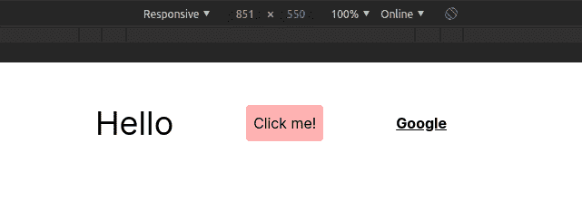
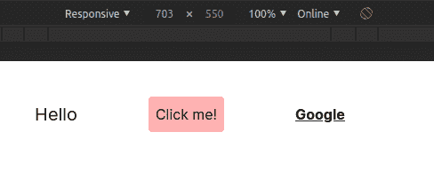

# 如何开始使用 TailwindCSS

> 原文：<https://www.freecodecamp.org/news/get-started-with-tailwindcss/>

TailwindCSS 是一个非常棒的实用第一的 CSS 库，用较少定制的 CSS 创建漂亮的布局。

你很有可能听说过顺风。但是，你试过用吗？

在本文中，我将分享使 Tailwind 不同于我所知道的其他组件库的东西。我将讨论为什么你应该开始使用它。

**注意**这里的一切都是我的看法。我不是说我用过世界上所有的组件库，lol。

## 尾翼前

...举几个例子，有像 Bootstrap 和 Material UI 这样的组件库。这些库带有一组预定义的组件。例如，最常见的(或听说过的)可能是`PrimaryButton`。

这些库减少了用 CSS 从头设计元素的麻烦。这些库中的大部分在使组件可由用户定制方面也做得非常出色，因此它们不必遵循创建者的决定。

然而，这种可定制性在大多数情况下涉及到覆盖。例如，创建新的类来覆盖库提供的现有样式。

这本身并不是一个大问题(取决于用户，对我来说是)，但是你仍然必须回答“我喜欢这种风格吗？不。让我改写一下“那种流动。

一些开发人员可能认为这些已经制作好的组件正是他们所需要的。但是创作者不能总是为每个用户做出完美的东西。谢天谢地，如前所述，他们在使组件可定制化方面做得很好。

## 然后是 TailwindCSS

Tailwind 是一个实用至上的 CSS 库。这意味着他们专注于公用事业。它们提供诸如边框、颜色、背景色等实用类。它们不一定定义组件的外观。你决定使用他们提供的不同的类。

这就是我喜欢顺风的原因。当然，在这里覆盖样式仍然是可能的，但是那是非常罕见的。产品背后的优秀团队为不同的需求创建了许多类。无需覆盖，您可以在配置文件中配置希望库使用的默认样式。很棒吧？

如果这些术语中的任何一个现在对你没有意义，不要担心。随着文章的继续，我们将会更详细地讨论。

## 实用程序类别的示例

在我们开始使用 TailWindCSS 之前，让我向您展示几个让这个工具变得非常棒的类。

*   `rounded`:给一个元素加一个 0.25rem 的`border-radius`。
*   `text-gray-400`:添加浅灰色(`#cbd5e0`)。300 加些浅色的 500 加些深色的。
*   `bg-gray-100`:添加浅灰色(`#f7fafc`)背景色。
*   `md:text-gray-100`:为元素添加媒体查询，使屏幕宽度大于或等于中等屏幕(默认为 768px)的元素应用非常浅的灰色(`#f7fafc`)。很好是吗？
*   `hover:underline`:当鼠标悬停在文本上时，给文本添加下划线。
*   `xs:text-lg`:与`md..`类似，对元素进行媒体查询，当屏幕宽度大于或等于超小屏幕(默认为 640px)时，对元素使用 1.125rem(默认为)的字体大小。
*   `mt-20`:对一个元素应用 5rem 的`margin-top`。
*   `awesome-responsive`:好吧，这个不存在？

当然，所有这些选项也是可定制的。我们将在本文后面看到这一点。

正如在类中所看到的，它们并不(自己)决定一个元素或页面布局的最终外观。这是他们的组合，由你这个开发者来决定。这使您可以完全控制，而不必覆盖。

在这一点上，我想相信你觉得 TailWindCSS 很棒，所以让我们开始使用它吧。

## 安装和配置

他们的安装文档详细解释了安装过程。为了完整起见，我在这里分享一下安装步骤。

### 1.使用 npm 安装软件包

```
npm install tailwindcss 
```

### 2.在你的 CSS 中添加顺风

```
@tailwind base;
@tailwind components;
@tailwind utilities;
h1 {
  color: purple;
} 
```

`@tailwind`不是有效的 CSS 语法。但是，tailwind 使用这些指令(正如它们被称为的那样)来生成构建的 CSS。`h1`也将按原样添加到样式表中。

`h1`不是强制性的。我想告诉你任何其他的东西都是可以添加的。

### 3.创建您的配置文件

这一步**是可选的**，但是它允许你指定一些默认值。使用这种配置，tailwind 将生成正确的 CSS。*记得我之前说过覆盖会很小，因为顺风允许你配置默认风格*。

要创建配置文件，请执行以下操作:

```
npx tailwindcss init 
```

`npx`因为顺风没有全球安装。这样，就可以使用本地安装的软件包。

上面的代码将创建一个模板配置文件，如下所示:

```
module.exports = {
  purge: [],
  theme: {
    extend: {},
  },final
  variants: {},
  plugins: [],
} 
```

[本文档](https://tailwindcss.com/docs/configuration/)解释了如何配置文件。

### 4.使用带 PostCSS 的顺风

[PostCSS](https://github.com/postcss/postcss) 帮助顺风样式表的构建过程输出正确的 CSS 代码。在您的`postcss.config.js`文件中，添加以下内容:

```
module.exports = {
  plugins: [
    // ...
    require('tailwindcss'),
    require('autoprefixer'),
    // ...
  ]
} 
```

还添加了`autoprefixer`(PostCSS 的一个插件)来将[供应商前缀](https://developer.mozilla.org/en-US/docs/Glossary/Vendor_Prefix)添加到属性中。

要构建 css，请运行以下命令:

```
npx postcss tailwind.css -o public/style.css 
```

这将获取 tailwind.css 文件(带有指令)，并将处理后的内容输出到提供的公共样式表。

现在你已经准备好使用顺风了。

## 如何在你的项目中使用顺风

填充公共样式表后，链接到该样式表的所有页面都可以使用这些样式。一个例子是:

```
<div
  className='flex justify-center mt-10 items-center'
>
  <h1 className='text-xl md:text-4xl'>
    Hello
  </h1>
  <button
    className='bg-red-300 p-2 rounded mx-20 hover:bg-red-600 hover:text-white'
  >
    Click me!
  </button>
  <a
    href='https://google.com'
    className='underline font-bold'
  >
    Google
  </a>
</div> 
```

下面是这些类为元素做的事情:

*   `flex` - `display: flex`。
*   `justify-center` - `justify-content: center`。
*   `mt-10` - `margin-top: 2.5rem`
*   `items-center` - `align-items: center`
*   `text-xl` - `font-size: 1.25rem`
*   `md:text-xl` - md 表示中等大小。默认值是 768px，但是您可以在配置文件中更改它。

以下是该课程为您提供的帮助:

```
 @media only screen and (min-width:768px) {
    element {
      font-size: 1.25rem;
    }
  } 
```

*   `bg-red-300` - `background-color: #feb2b2`
*   `rounded` - `border-radius: 0.25rem`
*   `mx-20` - `margin-left: 5rem`和`margin-right: 5rem`
*   `hover:bg-red-600` -在悬停伪状态上应用背景色`#e53e3e`。
*   `hover:text-white` -在悬停伪状态下应用白色。
*   `underline` : `text-decoration: underline`
*   `font-bold` : `font-weight: bold`

这是大于 768 像素的屏幕的结果:



而对于小于 768px 的屏幕:


注意到`h1`元素的不同了吗？

这篇文章不可能包含 Tailwind 的所有(甚至是最特殊的)特性。您可以[从这里](https://tailwindcss.com/docs/utility-first/)开始了解更多信息。

## 包裹

那是对美丽顺风的介绍！

总之，TailwindCSS 没有定义组件的外观。您可以通过将几个类组合在一起来定义它。

我个人喜欢 TailwindCSS，因为它给我香草 CSS 感觉(我爱我的香草 CSS？)同时让我的事情变得简单。

虽然它为我抽象了风格，但我并不是完全不知道发生了什么。例如，对于`PrimaryButton`，我不知道组成该组件的填充和颜色。但是有了`mt-10`，我明白它只是简单的`margin-top:2.5rem`。

如果对本文有任何疑问或投稿，可以在[小鸟 app 上找我？](https://twitter.com/iamdillion)