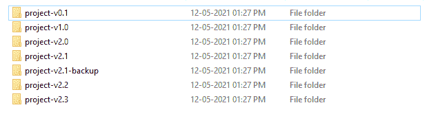
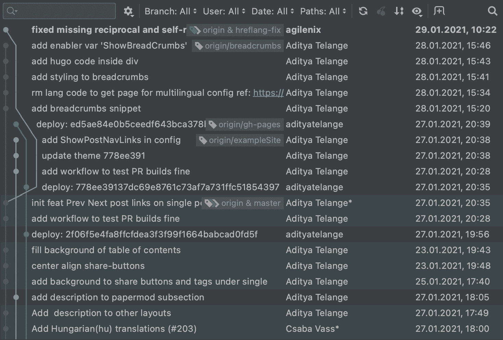
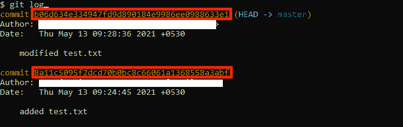
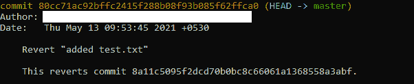
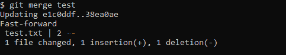
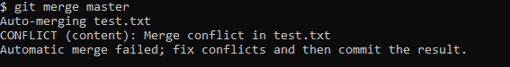
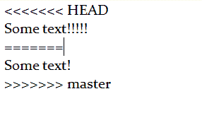
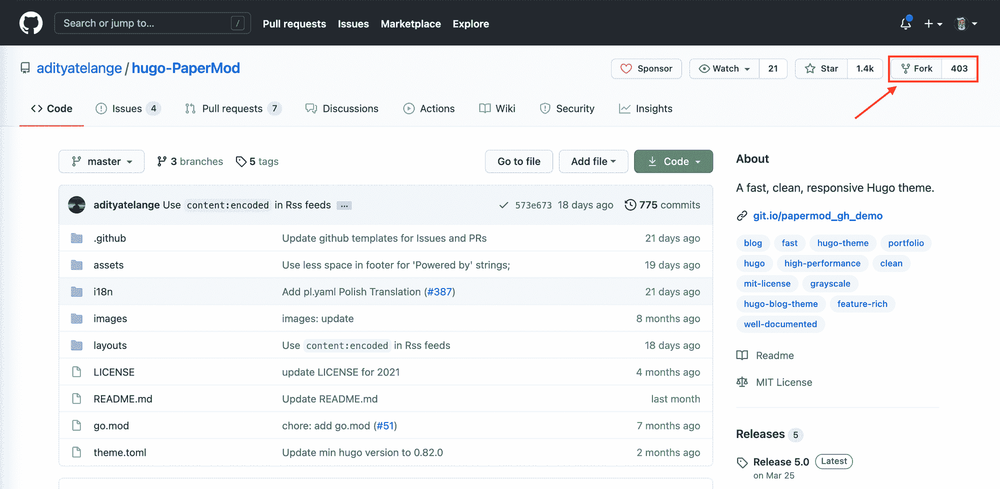

# 如何开始使用 Git 进行版本控制

> 原文：<https://www.freecodecamp.org/news/get-started-with-version-control-and-git/>

在本教程中，您将学习什么是版本控制，以及如何使用 **Git** 为开源项目做出贡献。

我们将学习 Git 的基础知识，我会给你任何网络开发人员不可或缺的知识。

## 什么是 **Git** ？

Git 是一个版本控制软件，可以让你和其他程序员合作。 **Git** 解决的最大问题是，它帮助开发者跟踪他们正在工作的代码库的不同版本。

在版本控制系统发明之前，不同的开发人员很难同步他们的工作。

## 为什么要用 **Git** ？

如果你不使用 **Git** ，创建一个项目看起来会像这样:



而有了 **Git** ，看起来优雅多了，像这样:



## 如何安装 **Git**

可以从官网下载安装 **Git** 。

确保将 **Git** 添加到`Path`中，以防你在 **Windows** 上使用它。

在 Linux 中，您可以使用以下命令从终端直接安装它:

```
sudo apt-get install git 
```

安装完成后，您可以通过执行以下命令来检查 **Git** 是否安装正确:

```
git --version 
```

如果您获得了当前安装的版本，安装就成功了，您就可以开始了。

## **转**基

现在我们通过一些小例子来学习 **Git** 的基础知识。

首先，让我们讨论一下如何为你的代码创建一个单一的真实来源。

就 Git 而言，存储代码的地方称为**库**。

### 如何初始化一个空的 Git 仓库

在项目中使用 **Git** 的第一步是初始化一个 **Git** 库。您可以使用以下命令初始化一个 **Git** 存储库:

```
git init 
```

该命令在当前目录下创建一个子目录`.git`。它将保存所有的内部 Git 元数据，比如提交历史。

### 如何在 Git 中进行变更

我们需要创建一些文件来*阶段变更*并*提交*(我将在下面讨论)。让我们创建`test.txt`并在其中插入一些文本。

Staging 意味着告诉 Git 您准备将哪些文件提交(添加)到存储库中。当您有正在进行的工作并且想要提交单个文件时，它非常有用。

现在，我们已经准备好实施我们的变革了。您可以单独列出要转移的文件，如下所示:

```
git add test.txt 
```

一旦我们执行了这个命令，Git 就知道`test.txt`已经准备好提交了。

或者，您可以使用以下命令转移所有文件:

```
git add . 
```

当你有一堆文件并且不想键入每一个文件名时，这很有用。

### 如何在 Git 中提交更改

提交更改会在给定的时间点创建代码库的快照。您可以在以后的某个时间点回到这个快照，或者与您的队友分享，以便他们可以从您的进展中积累经验。

请记住，只有为提交而暂存的文件才会包含在其中。如果你不上演什么，你就无法承诺。

在准备好我们的变更之后，是时候*提交*变更了。要*提交*更改，请使用:

```
git commit -m "<message describing the change>" 
```

一旦我们执行了`git commit`，我们就完成了对代码库的修改。

### 如何在 Git 中查看日志

您可能希望查看项目中的更改日志。您可以使用以下命令来完成此操作:

```
git log 
```

日志看起来像这样:


如您所见，有两次提交。第一个显示我们已经创建了一个新文件，第二个描述了对它的修改。

请记住，Git 不会自动跟踪您所做的更改。您应该手动暂存和提交它们。

### 如何在 Git 中重置和恢复提交

如果您在提交中出错，您可能想要撤消更改。

有两种方法可以撤消更改:

1.  重置
2.  归还

#### 去重置

重置命令的一般语法如下:`git reset <reset types> HEAD~<number of commits to undo>`

最常用的**复位类型**有:

*   **-软**:取消提交并保留更改
*   **-硬**:取消提交并删除变更

如果我们想从 Git 取消提交更改，但保留代码的本地修改，我们使用以下命令:

```
git reset --soft HEAD~1 
```

当您意外暂存了一些不属于提交的文件时，这很有用。

重置后，您可以暂存必要的更改并提交它们。

#### Git Revert

您可能还注意到，每次提交都与一个散列相关联。



您还可以使用哈希来撤消特定的提交:

```
git revert 8a11c5095f2dcd70b0bc8c66061a1368558a3abf 
```

这不同于重置，因为它允许您撤消在特定提交中所做的更改。

当我们分解命令时，我们找到了`git revert <commit hash>`。

当您恢复更改时，Git 会添加一个额外的提交。



### 如何使用 Git 分支

Git 允许你创建不同的分支。这些分支让你保持代码版本范围的分离(例如， *bug 修复*、*开发*、*生产*等等——所有不同的分支)。

要创建新分支，请使用以下命令:

```
git checkout -b <new branch name> 
```

要切换到现有的分支，删除`-b`标志并使用现有的分支名称，而不是新的名称:

```
git checkout <branch name> 
```

### 如何合并 Git 分支

在一个分支中进行更改后，您可能希望用另一个分支中的代码更新一个主分支。为此，首先移动到要更新的分支，并使用以下命令:

```
git merge <update source branch name> 
```



如果一切顺利，这个操作将在目标分支中创建一个合并提交，并将所有提交添加到那里。

### 如何解决 Git 中的冲突

在合并分支时，可能会发生同一文件的同一部分在每个分支中被更新的情况。

在这种情况下，一个**冲突**发生了，因为 **Git** 不知道保留哪个变更和丢弃哪个变更。所以 Git 创建了一个**冲突**消息，并提示您手动选择哪个分支是正确的。



冲突消息概述了冲突发生的位置以及当前和即将到来的更改。



在决定如何解决冲突之后，您需要添加一个 commit 来解决冲突。

## 如何使用远程 Git 存储库

为了与其他人合作，您需要在远程存储库上工作。我们将关注如何与 **GitHub** 合作使用 **Git** ，但你也可以使用任何其他类似的网站，如 **GitLab** 或 **BitBucket** 。

要与其他人合作，您需要在网站上创建一个帐户。现在你已经准备好为 GitHub 上的一个开源项目做贡献了。

不久前，我在我的[编程博客](https://learn.coderslang.com)中使用的开源 Hugo 主题 [Papermod](https://github.com/adityatelange/hugo-PaperMod) 中发现了一个小问题。

修复非常简单，我想为这个项目做点贡献来改进它。

投稿步骤:

1.  找到您想要贡献的存储库。或者，如果您在公司环境中工作，您的公司可能会提供一个存储库供您使用。
2.  **叉**储存库。现在您已经有了一个存储库的副本。



3.复制此处找到的克隆链接:


4.执行以下命令:

```
 git clone <clone link> 
```

将在您的计算机上创建一个存储库副本。添加 *Upstream* remote，这只是源存储库的一个别出心裁的名字，使用:

```
 git remote add <upstream remote name> <source repository clone link> 
```

现在你可以使用你学到的 **Git** 基础知识来修改代码。

提交更改后，您可以使用以下命令更新源存储库:

```
 git push origin <branch name to push changes> 
```

现在您可以[在源代码库中创建一个*拉请求*](https://www.freecodecamp.org/news/how-to-make-your-first-pull-request-on-github-3/) ，维护人员会检查并合并您的代码。

## 结论

在本文中，我们学习了 **Git** 的基础知识。现在你有了使用*版本控制*的工具，你可以在你自己的项目中使用它，或者为成千上万的在线开源项目做贡献。

如果你对现代网络开发有兴趣，看看我的[全栈 JavaScript 课程](https://js.coderslang.com)和一本[免费电子书，里面有 35 个最常见的 JS 面试问题](https://learn.coderslang.com/free-ebooks/)。