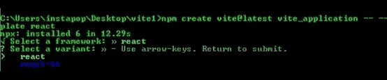
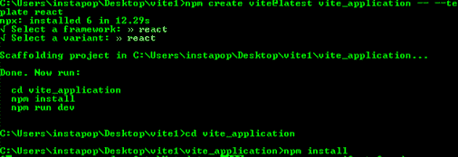
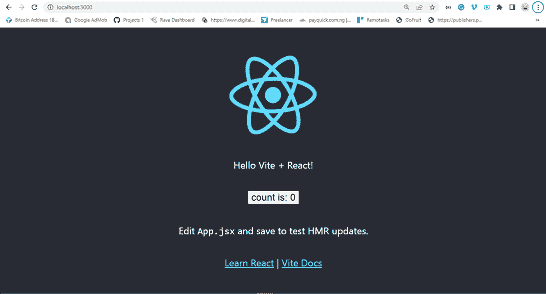
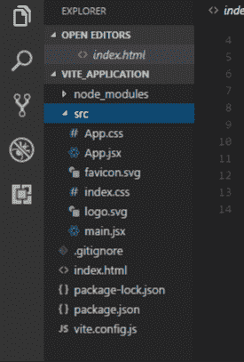

# Vite.js 教程——如何在 Web 项目中安装和使用 Vite

> 原文：<https://www.freecodecamp.org/news/get-started-with-vite/>

[Vite.js](https://www.freecodecamp.org/news/p/e534a679-ce3c-4cf1-842b-96087d30944d/Vite.js) 是现代 web 项目的快速开发工具。它通过改善开发体验来关注速度和性能。

Vite 使用本地浏览器 es 导入来支持现代浏览器，而无需构建过程。

Vite 由两个主要部分组成:

*   dev 服务器支持热模块替换(HMR ),用于在应用程序执行期间更新模块。当对应用程序的源代码进行更改时，只更新更改，而不是重新加载整个应用程序。这个特性有助于加快开发时间。
*   build 命令使开发人员能够将他们的代码与 Rollup 捆绑在一起，预先配置为输出高度优化的静态资产用于生产。

## Vite.js 如何工作

当 ES2015 中引入 ES 模块时，许多浏览器对 ES6 模块的支持很差。为了解决这个问题，现代浏览器现在支持本地 ES 模块。这允许开发人员在本地使用`import`和`export`语句。

在本机 ES 中，导入必须获得相对或绝对 URL，因为它不支持裸模块导入，例如:

```
import { someMethod } from 'my-dep'
```

上面的代码将在浏览器中抛出一个错误，因为许多浏览器不支持 ES6 模块。所以现在的问题是 Vite 如何处理这件事？

Vite 将自动检测从源文件导入的裸模块，并对它们执行以下两个操作:

*   Vite 将预捆绑源文件以加速页面加载，并将 CommonJS / UMD 模块转换为 ESM。
*   为了允许浏览器导入模块而不抛出错误，Vite 将把导入重写为一个有效的 URL，如下所示

```
/node_modules/.vite/my-dep.js?v=f3sf2ebb
```

# 为什么要用 Vite？

现在我们知道了 Vite 是什么以及它是如何工作的，您可能想知道为什么您应该使用 Vite。

有很多原因可以解释为什么你应该在你的项目中使用 Vite。让我们简单看一下其中的一些。

## 表演

使用 Vite 的 ESbuild 进行预捆绑比使用其他 JS 捆绑器要快 10 到 100 倍。这是因为它有助于提高页面速度，并将 CommonJS / UMD 模块转换为 ESM。

根据 Vite 文档，

> “预捆绑步骤是使用 esbuild 执行的，这使得 Vite 的冷启动时间明显快于任何基于 JavaScript 的捆绑器。”

## 热模块更换(HMR)

Vite 使用 HMR 功能来跟踪应用程序中的变化，而无需重新加载整个页面。使用 HMR API，浏览器将只加载页面中被修改的部分，并且仍然保留应用程序的状态。

无需在应用中手动配置 HMR API。在应用程序安装期间，它会自动添加到您的项目中。

凭借 HMR 性能，无论应用的模块数量或规模如何，您都可以设计出更轻、更快的应用。

## 配置选项

通过使用`vite.config.js`或`vite.config.ts`扩展默认配置，Vite 允许您对项目的配置有更多的控制。它们位于项目的基本根目录中。

您还可以使用`--config` CLI 选项指定不同的配置文件，如下所示:

```
vite --config my-config.js
```

# 你需要什么

在创建 Vite 项目之前，必须在计算机上安装以下软件:

*   [Node.js 版本 12.2.0](https://nodejs.org/en/download/) 或更高版本(要检查您的计算机上是否安装了 Node，请在终端上运行 **`node -v`**
*   [Npm](https://www.npmjs.com/get-npm) / [纱](https://classic.yarnpkg.com/en/)

一旦在您的计算机上安装了这些，您现在就可以创建一个 Vite 项目了。

# 如何创建一个 Vite 项目

要创建 Vite 应用程序，请打开您的终端并导航到您想要保存 Vite 程序的文件夹。然后运行以下命令:

```
npm create @vitejs/app my-vite-app
```

**注意:** **`my_vite_app`** 是我们要创建的 Vite 应用程序的名称。你可以把它改成你喜欢的任何名字。

运行上述命令后，会提示您选择一个`framework`和`template`(变量)。出于本教程的目的，我们将使用 React，但是您可以选择您熟悉的任何框架和模板。



接下来，运行以下命令完成安装:

```
cd vite_application
npm install
```



安装可能需要几分钟，所以请等待安装完成。

# 如何运行 Vite 应用程序

要在终端上运行您的 Vite 应用程序，导航到应用程序文件夹(`vite_application`)，然后运行下面的 dev 命令来启动开发服务器:

```
npm run dev
```

运行上面的命令将启动开发服务器。然后打开你的终端，输入 [`http://localhost:3000`](http://localhost:3000) 。

您应该会在浏览器中看到类似这样的内容:



React application

# Vite 文件夹结构

让我们来看看如何组织 Vite 应用程序文件夹。我们还将详细了解一些文件夹和文件。

注意:如果您使用不同的框架和模板，文件名将不会相同。



Vite folder structure 

### **节点 _ 模块文件夹**

node_modules 文件夹包含应用程序所需的所有依赖项，这些依赖项在 package.json 文件中指定。

一旦运行`npm install`命令，package.json 中所有已配置的依赖项将被下载到 node_modules 文件夹中。

当把你的源代码推送到 GitHub 时，你不需要推 node_modules 文件夹，因为用户可以通过 package.json 安装你的应用中使用的所有必要的依赖项。

您可以在应用程序父目录中找到 package.json 文件。

### **src 文件夹**

src 文件夹是我们在开发 Vite 应用程序时交互最多的文件夹之一。该文件夹包含 app.jsx、main.jsx、app.css 和 index.js。

您的应用程序的所有资产，如图像、视频和其他文件，都必须存储在 src 文件夹中，因为 Vite 会自动对 index.html 内的所有 URL 进行重新设置。

### App.jsx 和 main.jsx

app.jsx 文件是基本组件，用作应用程序中使用的所有其他组件的容器。

main.jsx 文件是您从 index.html 获取根 id 并呈现应用程序中使用的所有组件的地方。

### index.css 和 app.css

这些文件包含程序中使用的所有 CSS 样式。您可以添加自己的 CSS 文件或更改样式。

# 结论

我们已经了解了什么是 Vite，它是如何工作的，以及它的一些特性。我们还学习了如何创建 Vite 应用程序。

为了改进您的开发工作流程并通过创建更轻更快的应用程序来提高工作效率，您可以在其文档中了解更多关于 [Vite 的信息。](https://vitejs.dev/)