# 如何用一行代码获得任意字符的 ASCII 值

> 原文：<https://www.freecodecamp.org/news/get-the-ascii-value-of-any-character-with-one-line-of-code/>

当您处理项目或计算机程序时，您可能需要使用某个字符的 ASCII 值。

这也是竞争性编程中的一个常见现象——在解决各种在线平台(如 HackerRank、Codeforces 和 Codechef)上的一些问题时，我们通常需要使用字符的 ASCII 值。

在这种情况下我们该怎么办？我们大多数人只是在互联网上搜索 ASCII 值，就像这样:

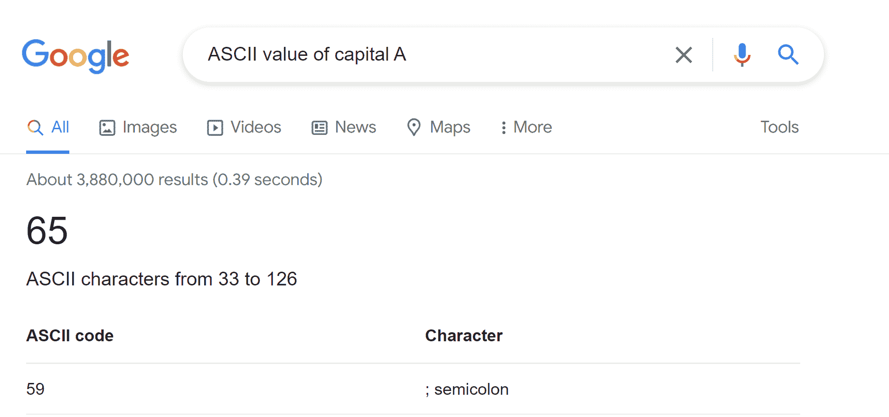

没错，确实我们可以通过搜索互联网直接得到任意字符的 ASCII 值。但有时你可能无法在网上找到它们。例如，如果你正在参加考试，你可能会被禁止在考试期间访问互联网。

那么如果你不记得你需要的字符的 ASCII 值，而且你也被禁止在网上搜索，你会怎么做？

不用慌！在这篇文章中，我将为你解决这个问题。你再也不需要互联网来搜索任何字符的 ASCII 值了。

## 入门指南

假设你正在写一个 C 程序，你也需要知道一个字符的 ASCII 值。不要害怕！您不需要仅仅为了使用代码获得价值而转换到其他语言——您可以在您的 C 代码中做到这一点！遵循以下代码:

```
#include<stdio.h>
int main()
{
    char ch = 'A';
    printf("%c\n" , ch);
}
```

你能告诉我在输出中我们会得到什么吗？如果你认为你会在输出中得到字符本身，那么你是正确的！

```
// A 
```

我在这里用了`//`来表示评论。

让我给你一个漂亮的截图如下:

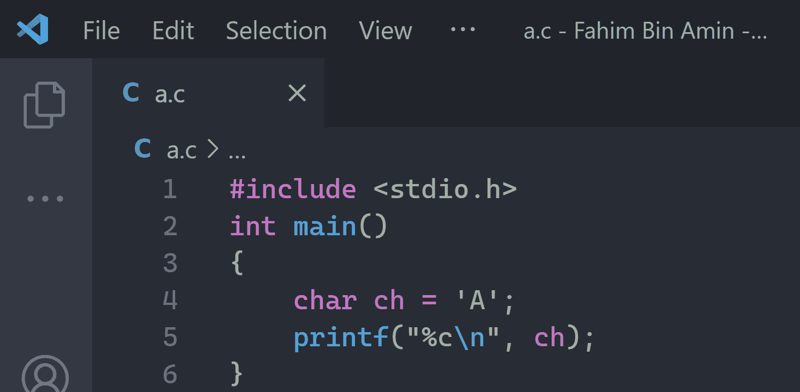

在第 4 行，我将一个字符类型数据作为`ch`，并且我将一个字符赋给这个变量。现在，我取字符“A ”,然后在第 5 行打印字符本身。

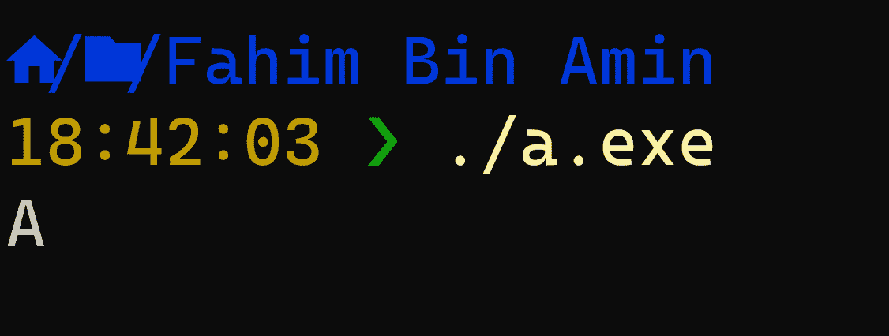

但是如果我使用`%d`而不是`%c`，那么我是在告诉它打印字符的整数值，而不是字符本身。

如果我们讨论一个字符的整数值，那么它可以代表一件事——字符的 ASCII 值，对吗？示例代码如下所示:

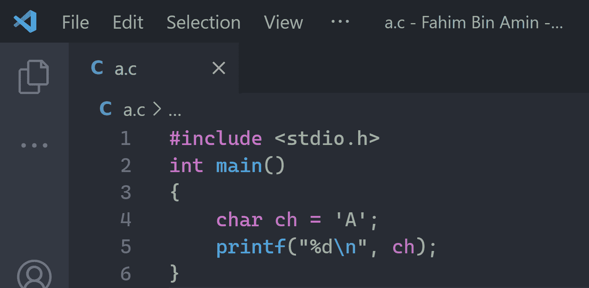

Sample input

在输出中，我们将获得字符' A '的 ASCII 值。


这就是我们如何使用上面的代码获得任何字符的 ASCII 值。

我现在给你介绍一个更有趣的东西。由于我只向您展示了获取英文字母表的 ASCII 值的过程，您可能会想知道该代码是只适用于获取字母表字母的 ASCII 值，还是适用于任何有效字符。

好消息是，这个过程适用于任何有效的字符！让我先给你看更多的例子。

## 如何获取一个空格的 ASCII 值( )

空格也被视为有效字符。在代码中，通常我们用一个空格来表示，比如`char ch = ' '`。因此，如果我在上面的代码中使用空格——但这次我使用空格而不是字母——那么代码将如下所示:

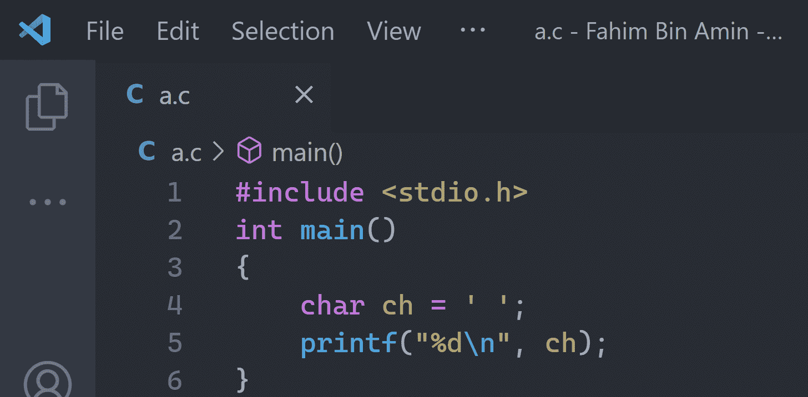

在第 4 行，我们给名为`char`的字符变量分配了一个空格。现在，如果我运行代码，我会得到一个空格的 ASCII 值，也就是 32。

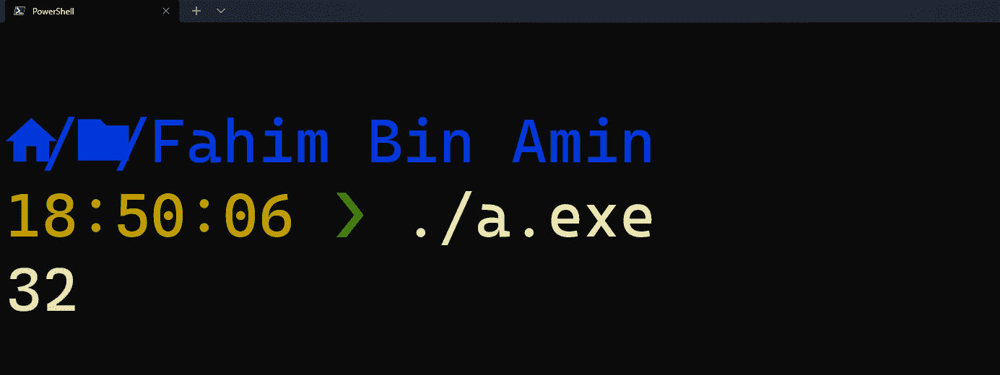

现在，如果你能理解这是如何工作的，那么让我给你一个简单的任务。在所有代码中，我们手动分配字符数据，并通过在输出中打印值来检查 ASCII 值。

在这个过程中，如果我们想得到各种字符的 ASCII 值，那么每次都需要手动修改代码。但是，如果我们想要一个类似 ASCII 计算器的东西，用户将提供字符作为输入，代码将提供精确的 ASCII 值作为终端的输出，这可能会很麻烦。

你认为你现在可以自己创造吗？不要向下滚动，直到你已经尝试写下代码至少一次！

好的，我希望你已经试着通过一点点调整代码来制作计算器。如果你挣扎着这样做，那么不要担心，因为我会保护你。

## 如何制作一个 ASCII 计算器

之前我们在代码中手工分配了每个字符。由于我们希望用户自己提供角色，我们将对代码做一点调整。

这一次，我们不会在字符变量中分配字符值。我们将首先声明一个字符变量，以便以后可以将字符赋给变量。然后我们会要求用户在终端中提供一个角色。

从用户那里获得输入后，我们将把值赋给我们的字符变量。然后我们将简单地在终端中打印字符的 ASCII 值。就这么简单！

只需遵循下面的代码，我将在下面再次解释所有的步骤:

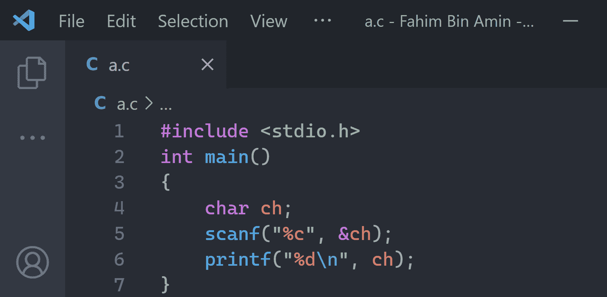

Our ASCII Calculator using the C programming language

我先解释一下我在代码里做了什么。然后我会通过运行程序向你展示结果。


正如您所看到的，我在第 1 行包含了基本的和必须需要的标准头文件。`stdio`代表标准输入输出格式。

基本上，`stdio.h`是一个头文件，它包含了我们程序中输入/输出相关函数的必要信息。因为我们肯定要处理输入和输出，所以它是 C 程序中一个必要的头文件。


在第 2 行，我添加了 main 函数。main 是 C 语言中预定义的关键字或函数。任何 C 程序的执行总是从 **main** 函数开始——记住这一点。

我们必须提供函数的返回类型。我使用了`int`以便 main 函数可以返回任何整数值。但是正如你所看到的，我实际上不会在以后归还任何东西。所以，我也可以在第二行用`void`代替`int`。输出将完全相同。 **Void** 表示不返回任何东西。


在第 3 行和第 7 行，我用了花括号`{` `}`。通常我们用花括号将一组语句分组。因为从第 4 行到第 6 行的所有语句(或者可以说是代码行)都包含在 main 函数中，所以我用花括号将它们表示为一组语句或代码块。


在第 4 行，我声明了一个字符变量。我们用`char`来表示字符数据类型。

在声明数据类型之后，我们需要提供字符的名称。我使用了`ch`作为我的变量名，但是你可以使用任何你想要的名字，除了 [C 关键字](https://www.javatpoint.com/keywords-in-c)。在 C 编程语言中有一些命名变量的惯例你也可以看看。

分号(`;`)是 C 编程语言中的结束语句。我们使用`;`来表示一行代码的结束。


在第 5 行，我使用了`scanf`函数。我们用它来获取用户的输入。我从用户那里获取一个字符值作为输入。这里，`%c`指的是字符型数据。

在接受用户输入的字符值后，我们将该值存储到我们的字符变量`ch`中。(如果我们不存储数据，那么我们将如何对它们进行计算，对吗？).

`&`是地址运算符，`&`运算符用于获取变量的地址。当我们使用`&ch`时，它表明我们在告诉 C 编译器我们在`ch`变量中给出或传递输入数据值。我们把`&`读作**与号。**


在第 6 行，我打印了字符的 ASCII 值(我们从用户那里得到的输入字符)。

我说了很多，不是吗？😅现在，是时候向您展示我们非常简单的 ASCII 计算器的结果了。

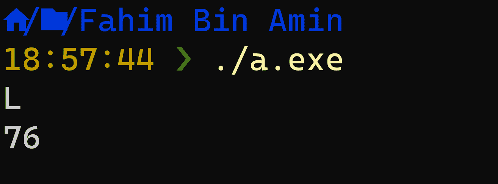

这里我提供了`L`作为输入来获取`L`的 ASCII 值。在下一行中，程序提供 76 作为输出，76 是`L`的精确 ASCII 值。

现在让我们检查一些不同的东西。我现在检查一下`!`的 ASCII 值。

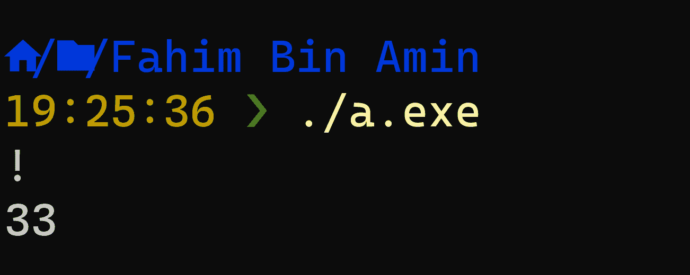

正如你所看到的，它的工作完美无缺！现在让我们使代码更漂亮。

你看，由于我们已经写了完整的代码，我们可以理解我们必须首先给出一个字符值作为输入。然后程序提供 ASCII 值。

但是其他用户可能不理解。他们还可能对运行代码后应该做什么感到困惑——比如，代码会直接提供任意随机字符的 ASCII 值还是其他什么？我们不想让其他人对我们简单而方便的项目感到困惑，对吗？

让我们先提供一些语句，让用户在执行代码后更容易明白他们需要做什么。代码应该是这样的:

```
#include <stdio.h>
void main()
{
    char ch;
    printf("Enter a character: ");
    scanf("%c", &ch);
    printf("The ASCII value of %c is: %d\n", ch, ch);
} 
```

我们都想要一个好看的截图。让我给你一个:

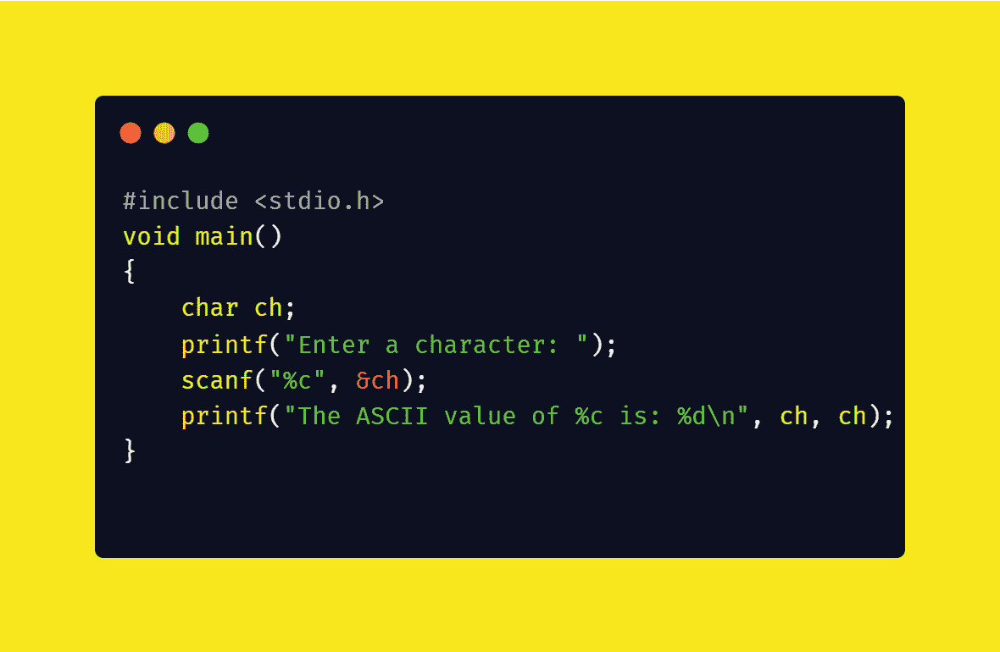

Our simple yet handy ASCII Calculator

不要害怕！我现在将解释所有修改的部分:


在第 5 行，我添加了一个 print 语句，在用户每次执行代码时显示给定的字符串。我想让用户知道他们只需要在运行程序后在终端输入一个字符。


在第 7 行，我稍微修改了打印函数。我希望代码生成一个漂亮的行，并提供给定字符的 ASCII 值。`%c`表示我们将在这里提供字符本身，`%d`表示像前面一样打印整数值。

现在让我通过提供随机字符作为输入来展示结果。


The ASCII value for `a`

看起来很美，对吧？至少，比早期的代码漂亮，因为用户将在这里得到一切——他们需要做什么，程序在输出中提供什么值，等等，对吗？

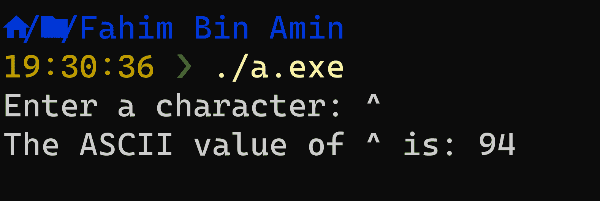

The ASCII value for `^`

我还在我的公共要点中添加了最后一段代码。

我们的 ASCII 计算器准备好了！我们学到了很多，尽管我们只使用了一些简单的代码。

如果您想知道我们在本文中使用了 C 编程语言，但是我们不能使用其他编程语言吗？答案是肯定的！我本来想用其他语言向您展示精确的 ASCII 计算器，但这会让这篇文章变得更大。所以我保留这个任务，让你自己去做。

您还可以定制代码以满足您的需求，添加漂亮的 GUI 等等。探索编程的奇妙世界:)

## 结论

我希望这篇文章能帮助你理解 basic C 程序是如何工作的。

非常感谢你阅读整篇文章。如果你有任何建议，你可以通过我的 [Twitter](https://twitter.com/Fahim_FBA) 或 [LinkedIn](https://www.linkedin.com/in/fahimfba/) 个人资料与我联系。

如果你对开源感兴趣，那么你也可以在 [GitHub](https://github.com/FahimFBA) 上关注我，因为我非常积极地为开源项目做贡献。

如果你喜欢编程相关的教程，那么我有两个 YouTube 频道。在一个频道中，[我定期发布孟加拉语内容](https://www.youtube.com/channel/UCEF4lxmpBKV2oYCSFH6ExIQ)，[，而我定期在另一个频道发布英语内容](https://www.youtube.com/channel/UCG97GCUifMS2Vm28tgXQi0Q)。

祝你有美好的一天！