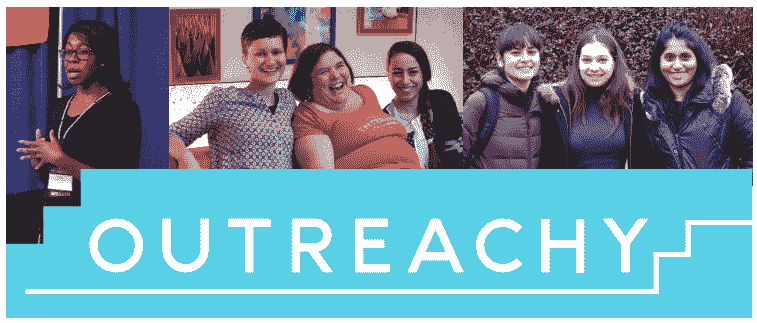

# 充分利用你的外展实习生申请过程

> 原文：<https://www.freecodecamp.org/news/get-the-most-out-of-your-outreachy-application-process-937d4a8ab4bf/>

作者:乔安娜·南杰凯

# 充分利用你的外展实习生申请过程

Outreachy 为那些在技术领域代表性不足的人提供三个月的带薪实习机会。实习生的薪水是 5500 美元，还有 500 美元的旅行津贴。

Outreachy 实习生与来自自由和开源软件(FOSS)社区的导师一起远程工作，从事编程、用户体验、文档、插图和图形设计以及数据科学任务的项目。

我和 [Ceph](https://ceph.com/) 一起参加了 2017 年 5 月到 8 月的第 14 轮外展。我正在为 Ceph 的 Rados 网关扩展 S3 测试。这个机会彻底改变了我的职业生涯。从让我开始使用开源软件，到让我成为一名自信的工程师，再到给我很多工作机会的平台。

Image from [Planet Outreachy](https://www.planeteria.info/outreach/)

外展实习申请每年开放两次——二月为五月至八月，九月为十二月至三月。

嗯，就像我在申请过程中一样，你可能在想“我怎么才能通过呢？”如果你是申请人。从一些直接的信息和 pings 我已经得到了这个在过去，我将分享一些想法。

### 该过程

在我分享如何经历这个过程的想法之前，我要指出一个免责声明。这些想法并不能保证你会被录取，在我看来，它们只是可以帮助你的指导方针。

在你迷失在这篇文章的众多细节之前，申请一份外展实习是一个非常吸引人的过程。它要求你做许多决定，并把做出贡献的努力作为被接受的要求的一部分。

为了充分利用您的申请流程，您需要确保:

*   你早点出发
*   将你的项目选择缩小到最多两个
*   设定你的目标
*   经常与社区和项目导师接触
*   关注进步而不是完美
*   记住过程比结果更重要

我来阐述一下这些。

#### 早点开始

你需要做的事情之一是不要拖到截止日期前一周。申请过程很吸引人。您需要尽早开始这个过程，以便项目指导者和社区能够了解您并与您互动，以及您在这个过程的早期能够实现的奇迹。

如果导师们更早、更长时间地了解你，那么他们选择你的决定会比你在截止日期前几天来的时候更明智。

#### 缩小项目选择范围

Outreachy 通常有一个组织列表，其中大多数都有你想参与的有趣项目。事实上，当我申请外展实习时，我想去任何地方。但你不可能。这是事实，如果你试图无处不在，你被录取的机会就会变得很少。

你需要专注于几个项目的原因是，这将使你能够专注于成为那个项目的优秀候选人。这意味着你将花更多的时间理解项目，与导师交流，并反过来为项目做出重大贡献——而不是到处都是，在许多项目上取得半生不熟的进展。

#### 设定一些目标

在你选择了你想要申请的项目之后，你将会向导师寻求关于第一次工作任务的指导——或者你可以查看项目的潜在任务问题列表。为你想从事的工作和你想成为什么样的候选人设定一些目标。

例如，你可以说“我想为我的申请过程做出 5 点贡献，并有一个好的建议”。有了自己的目标，你就不会成为不必要压力的牺牲品。这不应该是和其他申请人的竞争。有了设定的目标，你就是在和自己的目标竞争，而不是和别人。

#### 经常联系社区和项目导师

了解项目并获得更多帮助的方法之一是经常与项目导师和社区交流。

这让你很早就习惯与导师和社区一起工作，因为在实习期间你需要这样做。讨论你将要做什么，你正在做什么，甚至讨论补丁。这给人的印象是你知道自己在做什么，但也有助于你尽早得到反馈。

遇到困难时提问，开源项目是作为一个社区来开发的。没必要带着阻断器去死。

任务并不意味着杀人，但是在你找到独立解决一些问题的方法之间应该有一个平衡。

在问之前做一些功课，在问之前做一些研究。如果你找不到解决方案，那就尽快联系你的导师。挑战让我们每天都有动力工作，所以尝试挑战，然后问你的导师。不要花两个小时在阻滞药上，只要伸出手。

#### 进步而非完美

当你接到一个任务时，你可能会忍不住想把自己藏在地下室里，这样一周后你就能想出一个解决方案，这个方案很棒，经过了单元测试，你脑子里想的都是这个任务的最佳解决方案。

重点是尽早提交，并尽早获得反馈，以便在尽可能短的时间内完成补丁合并。补丁只有在提交后才变得完美。正是我们从评论者和社区那里得到的反馈使补丁变得完美。因此，退出地下室，与社区合作。

#### 与导师讨论实习项目

通常会有一个项目，你会一直在做，直到你被接受成为一名外展实习生。当你做出贡献的时候，如果你被录取了，创造一些时间和你的导师讨论你将要从事的项目的里程碑。让你的导师就范围和时间线给你建议。

这将告诉你如何创建一个时间线，当你填写外展申请表。你将带着对项目任务的了解来填写这份表格，这在他们评估你的时候是一个加分。

此外，请在截止日期前就建议书/申请表的内容征求反馈意见。反馈总是会让你做得更好。

#### 过程比结果重要得多

你的外展申请的严峻事实是，要么你被接受，要么你没有被接受。我有机会了解这两个决定的感受。

现在让我告诉你，外展的真正魅力在于过程。我第一次申请外展服务时没有被录取。

但是我学了戈朗。我在我的下一个项目中使用了这个技能。我第二次被录取了，现在我在做几个 Go 项目。也许这还不够有说服力。

我申请了一个不接受我的组织。但是从我从事的关于 Python 兼容性的工作中，我受到了启发，写了我的第一本关于 [Python 2 和 3 兼容性](https://www.amazon.com/Python-Compatibility-Six-Python-Future-Libraries/dp/1484229541)的书。由于这方面的资料很少，阿普莱斯很高兴地接受了出版。

申请过程应该是每个人都尝试过的。不管你进不进去，都是一场胜利。你将为一个项目做出贡献，这个项目将成为你下一次机会的项目参考。

如果你是一个自由/开源软件的初学者，你就已经开始使用开源软件了。如果你想继续做贡献，自由/开源软件的导师总是愿意指导你。

你将被介绍给这个科技行业中最优秀、最受欢迎的人，并向他们学习，为你未来的机会做准备。

如果你在这里忘记了什么，不要忘记这样一个事实，申请 Outreachy 永远是一个胜利，无论接受与否。别忘了下一轮再申请。如果你失败了——继续努力，直到你被录取。

祝所有申请的人好运！！！愿原力与你同在。如往常一样，如果你有任何问题，请联系我。