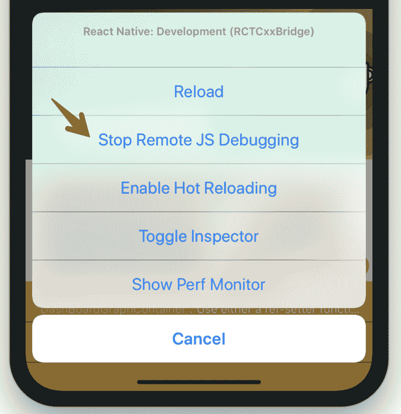
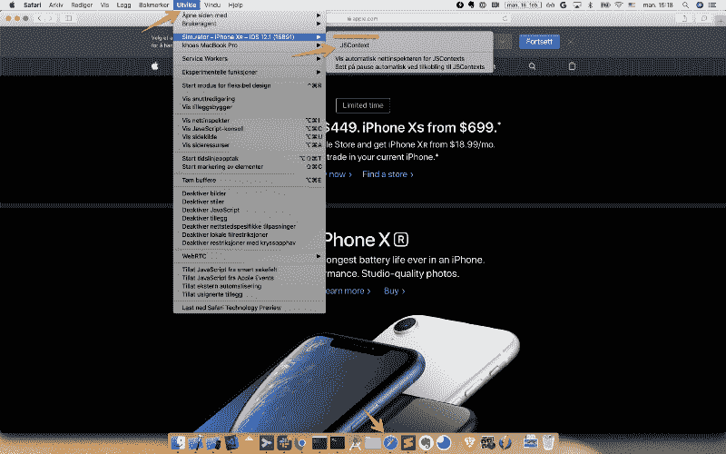
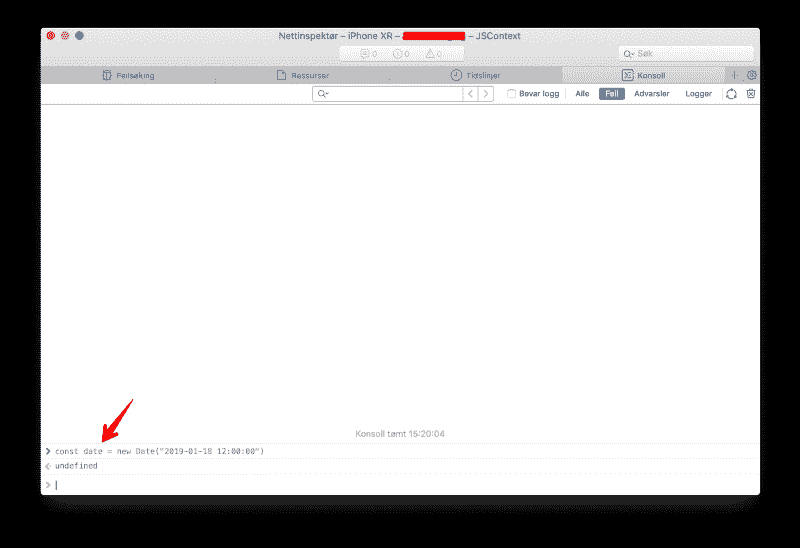
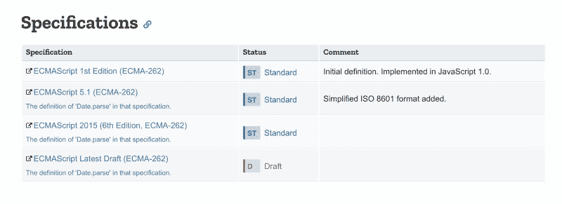

# 在 React Native 中了解不同的 JavaScript 环境

> 原文：<https://www.freecodecamp.org/news/get-to-know-different-javascript-environments-in-react-native-4951c15d61f5/>

作者 Khoa Pham

# 在 React Native 中了解不同的 JavaScript 环境


Source: [Sport Diver](https://www.sportdiver.com/secret-to-diving-with-blue-whales-in-sri-lanka)

React Native 可以非常容易地[开始](https://facebook.github.io/react-native/docs/getting-started.html)使用，然后在某个时候出现问题，我们需要深入研究它。

前几天，我们发现了一个奇怪的 bug，它只出现在生产版本中，而且只出现在 iOS 中。应用程序中的一个长回溯显示，这是由于`Date`构造函数失败。

```
const date = new Date("2019-01-18 12:00:00")
```

这在调试模式下返回正确的`Date`对象，但在发布模式下返回`Invalid Date`。`Date`建造师有什么特别之处？这里我用的是 react 原生 0.57.5，没有`Date`库。

### 日期构造函数

学习 Javascript 的最佳资源是通过 Mozilla web docs，输入[日期](https://developer.mozilla.org/en-US/docs/Web/JavaScript/Reference/Global_Objects/Date):

> 创建一个 JavaScript `**Date**`实例，代表一个单独的时刻。`Date`对象使用一个 [Unix 时间戳](http://pubs.opengroup.org/onlinepubs/9699919799/basedefs/V1_chap04.html#tag_04_16)，一个整数值，它是自 1970 年 1 月 1 日 UTC 以来的毫秒数。

注意日期是如何由 dateString 构造的:

> `dateString`表示日期的字符串值。字符串应该是由`[Date.parse()](https://developer.mozilla.org/en-US/docs/Web/JavaScript/Reference/Global_Objects/Date/parse)`方法识别的格式(符合 [IETF 的 RFC 2822 时间戳](http://tools.ietf.org/html/rfc2822#page-14)和 ISO8601 的[版本)。](http://www.ecma-international.org/ecma-262/5.1/#sec-15.9.1.15)

所以`Date`构造函数在幕后使用静态方法`Date.parse`。这对于它所支持的日期字符串的格式有非常具体的要求

> 日期时间字符串的标准字符串表示是对 ISO 8601 日历日期扩展格式的简化(有关更多详细信息，请参见 ECMAScript 规范中的[日期时间字符串格式](https://tc39.github.io/ecma262/#sec-date-time-string-format)部分)。例如，`"2011-10-10"`(只有日期的形式)、`"2011-10-10T14:48:00"`(日期-时间形式)、或者`"2011-10-10T14:48:00.000+09:00"`(有毫秒和时区的日期-时间形式)可以被传递，并将被解析。当没有时区偏移量时，仅日期格式被解释为 UTC 时间，日期-时间格式被解释为本地时间。

> ECMAScript 规范声明:如果字符串不符合标准格式，函数可能会退回到任何特定于实现的试探法或特定于实现的解析算法。在 ISO 格式的字符串中包含非法元素值的不可识别的字符串或日期将导致`Date.parse()`返回`[NaN](https://developer.mozilla.org/en-US/docs/Web/JavaScript/Reference/Global_Objects/NaN)`。

我们在 iOS 中得到无效日期的原因一定是因为代码在两个不同的 JavaScript 环境中运行，它们在某种程度上对日期解析函数有不同的实现。

### JavaScript 环境

React Native guide 有一个关于 [JavaScript 环境](https://facebook.github.io/react-native/docs/javascript-environment)的专门章节。

使用 React Native 时，您将在两种环境中运行 JavaScript 代码:

*   在大多数情况下，React Native 将使用为 Safari 提供动力的 JavaScript 引擎 [JavaScriptCore](http://trac.webkit.org/wiki/JavaScriptCore) 。注意，在 iOS 上，由于 iOS 应用中缺少可写的可执行内存，JavaScriptCore 不使用 JIT。
*   使用 Chrome 调试时，所有 JavaScript 代码都在 Chrome 本身内部运行，通过 WebSockets 与原生代码通信。Chrome 使用 [V8](https://code.google.com/p/v8/) 作为其 JavaScript 引擎。

虽然两种环境非常相似，但您可能会遇到一些不一致的地方。我们将来可能会尝试其他 JavaScript 引擎，所以最好避免依赖任何运行时的细节。

React Native 也使用 Babel 和一些 polyfills 来拥有一些不错的语法转换器，所以我们写的一些代码可能不一定被`JavascriptCore`原生支持。

现在很清楚，当我们通过 Chrome 调试器调试我们的应用程序时，它可以工作，因为 V8 引擎可以处理它。现在尝试关闭远程 JS 调试:我们可以看到上面的 Date 构造函数失败了，这意味着它正在使用`JavascriptCore`。



为了确认这个问题，让我们在 Xcode 中运行我们的应用程序，然后在 MacOS 上进入 Safari 应用程序，进入开发菜单。选择活动模拟器，并在当前 iOS 应用程序上选择 JSContext。记得关闭远程 JS 调试，以便应用程序使用 JavascriptCore:



现在，在 Safari dev tools 中打开控制台，我们应该可以访问应用程序中的 JavascriptCore。尝试运行上面的`Date`构造函数来确认它是否失败:



### 什么是合法的日期字符串格式？

自 2016 年起， [JavascriptCore](https://webkit.org/blog/6756/es6-feature-complete/) 支持大部分 ES6 特性:

> 截至 [r202125](https://trac.webkit.org/changeset/202125) ，JavaScriptCore 支持 [ECMAScript 6 (ES6)语言规范](https://tc39.github.io/ecma262/#sec-integerindexedelementget)中的所有新特性

一年后，这一点在 JSC 得到了完全证实？ES6

> [ES2015](http://www.ecma-international.org/ecma-262/6.0/) (也称为 ES6)，2015 年批准的 JavaScript 规范版本，是对该语言表达能力的巨大改进，这要归功于诸如[类](http://www.2ality.com/2015/02/es6-classes-final.html)、 [for-of](https://hacks.mozilla.org/2015/04/es6-in-depth-iterators-and-the-for-of-loop/) 、[destructing](http://www.2ality.com/2015/01/es6-destructuring.html)、 [spread](https://developer.mozilla.org/en-US/docs/Web/JavaScript/Reference/Operators/Spread_operator) 、 [tail calls](http://www.2ality.com/2015/06/tail-call-optimization.html) 和[more more](http://kangax.github.io/compat-table/es6/)等特性

> WebKit 的 JavaScript 实现叫做 JSC (JavaScriptCore)，[实现了所有的 ES6](https://webkit.org/blog/6756/es6-feature-complete/)

有关不同 JavaScript 引擎支持的 JavaScript 特性的更多详细信息，请访问此 [ECMAScript 对照表](https://kangax.github.io/compat-table/es6/)。

现在对于日期字符串格式，从 [Date.parse](https://developer.mozilla.org/en-US/docs/Web/JavaScript/Reference/Global_Objects/Date/parse) 开始，让我们访问 ECMAScript 2015 规范，看看它对[日期字符串格式](https://www.ecma-international.org/ecma-262/6.0/#sec-date-time-string-format)说了些什么:



ECMAScript 基于 ISO 8601 扩展格式的简化定义了日期-时间的字符串交换格式。格式如下:`**YYYY-MM-DDTHH:mm:ss.sss*Z***`

其中字段如下所示:

`**"T"**`字面上出现在字符串中，表示时间元素的开始。

所以`JavascriptCore`需要`T`说明符，V8 没有它也能工作。现在解决办法是总是包含测试说明符。这样，我们总是遵循 ECMAScript 标准，以确保它可以跨不同的 JavaScript 环境工作。

```
const date = new Date("2019-01-18 12:00:00".replace(' ', 'T'))
```

现在它返回正确的`Date`对象。iOS 和 macOS 上的 JavascriptCore 之间以及不同的 iOS 版本之间可能存在差异。这里学到的经验是，我们应该总是在生产和设备上彻底测试我们的应用程序，以确保它按预期工作。