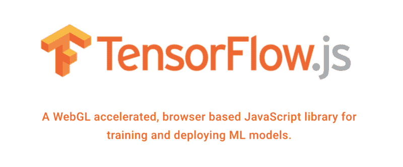
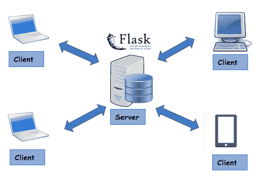
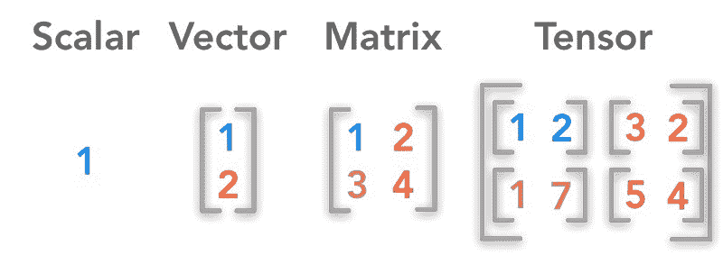
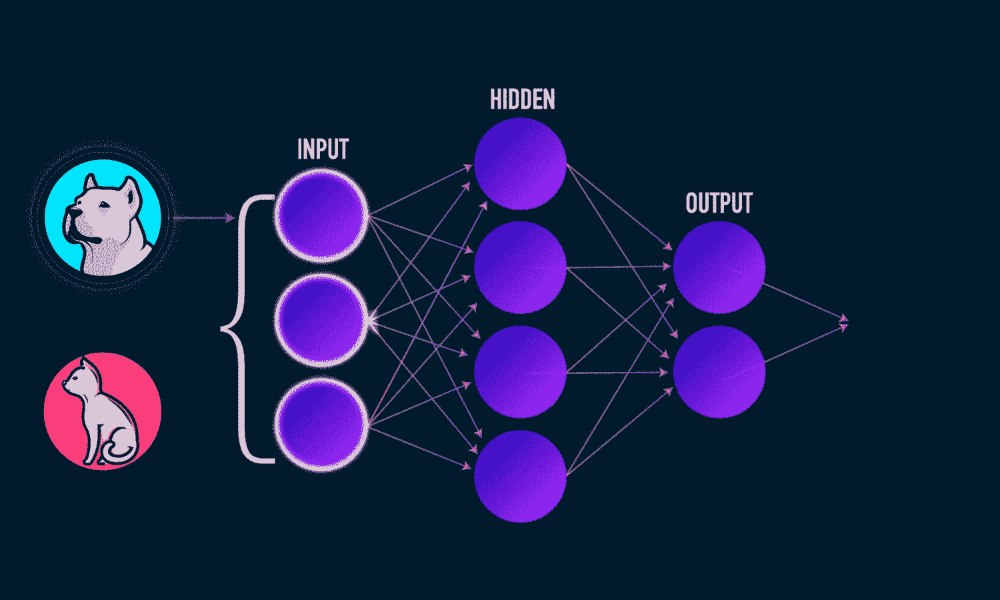
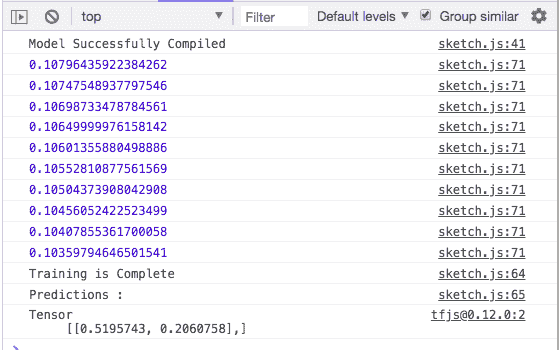

# 7 分钟了解 TensorFlow.js

> 原文：<https://www.freecodecamp.org/news/get-to-know-tensorflow-js-in-7-minutes-afcd0dfd3d2f/>

通过 ADL

#### 并了解如何在浏览器中直接运行 ML/DL 模型

越来越多的开发者在他们的机器学习项目中使用 TensorFlow。今年 3 月，谷歌的 TensorFlow 团队宣布了备受期待的 JavaScript 框架 TensorFlow.js(之前称为 DeepLearn.js)的到来。



Image Source : Tensorflow.js Website

现在，开发人员可以构建轻量级模型，并使用 JavaScript 在浏览器中运行它们。让我们了解一下开发这个框架的需求是什么。

#### 历史

在去 TensorFlow.js 之前，我想先从 TensorFlow 说起。

TensorFlow 是谷歌在 2011 年开发的，作为他们在谷歌的机器学习/深度学习应用程序的安抚库。该库于 2015 年在 Apache 许可下开源。

TensorFlow 内置于 C++中，这使得代码能够在非常低的级别执行。TensorFlow 绑定到不同的语言，如 Python、R 和 Java。这使得 TensorFlow 可以在这些语言中使用。

所以，显而易见的问题是:JavaScript 呢？

传统上，在 JavaScript 中，ML/DL 是通过使用 API 来执行的。使用某个框架制作了一个 API，并在服务器上部署了该模型。客户端使用 JavaScript 发送了一个请求，以从服务器获取结果。



Client Server Architecture

2017 年，出现了一个名为 Deeplearn.js 的项目，旨在启用 JavaScript 中的 ML/DL，没有 API 的麻烦。

但是速度有问题。众所周知，JavaScript 代码不能在 GPU 上运行。为了解决这个问题，引入了 WebGL。这是一个 OpenGL 的浏览器界面。WebGL 支持在 GPU 上执行 JavaScript 代码。

2018 年 3 月，DeepLearn.js 团队被并入谷歌的 TensorFlow 团队，并更名为 TensorFlow.js。

观看以下视频了解更多详情:

### TensorFlow.js

Tensorflow.js 提供了两个东西:

*   CoreAPI，处理底层代码
*   LayerAPI 构建于 CoreAPI 之上，通过提高抽象层次使我们的生活变得更加简单。

#### 入门指南

在项目中获取 TensorFlow.js 有两种主要方法:

#### 1.通过

将以下代码添加到 HTML 文件中:

```
<html>  <head>    <!-- Load TensorFlow.js -->    <script src="https://cdn.jsdelivr.net/npm/@tensorflow/tfjs@0.12.0"> </script>  </head>
```

```
<body>      Hello  </body></html>
```

#### 2.经由 NPM

使用 yarn 或 npm 将 TensorFlow.js 添加到项目中。

```
yarn add @tensorflow/tfjs
```

```
npm install @tensorflow/tfjs
```

在您的主 js 文件中:

```
import * as tf from '@tensorflow/tfjs';
```

### CoreAPI

#### 1.张量

那么，什么是张量呢？



*   标量是一个单一的数字。例如，x = 1
*   向量是一组数字。例如， *x* =[1，2]
*   矩阵是一个二维数组
    ([[1，2]，
    ，【3，4】，
    ])
*   一个张量是一个 *n-* 维数组，其中 *n* > 2

TensorFlow.js 具有针对标量、1D、2D、3D 和 4D 张量等常见情况的实用函数，以及许多以对机器学习有用的方式初始化张量的函数。

#### 代码示例

tf.tensor():

```
// Pass an array of values to create a vector.tf.tensor([1, 2, 3, 4]).print();
```

tf.scalar():

```
tf.scalar(3.14).print();
```

诸如此类…

观看以下视频，深入了解 TensorFlow.js 中的张量:

#### 2.变量和操作

张量是不可变的数据结构。这意味着它们的值一旦设置就不能更改。

但是，`tf.variable()` 是在 TensorFlow.js 中引入的，`tf.variable()`真正的用例是在我们需要频繁改变数据的时候，比如在机器学习中调整模型权重的时候。

代码示例:

```
const x = tf.variable(tf.tensor([1, 2, 3]));x.assign(tf.tensor([4, 5, 6]));x.print();
```

#### 操作

TensorFlow.js 中有各种运算，为了对张量进行数学计算，我们使用运算。张量是不可变的，所以所有操作总是返回新的张量，从不修改输入的张量。所以为了节省内存可以使用 `tf.variable()`。

让我们来看看一些操作:

**tf.add() —将两个 [tf 相加。张量](https://js.tensorflow.org/api/0.12.0/#class:Tensor) s 元素式**

```
const a = tf.tensor1d([1, 2, 3, 4]);const b = tf.tensor1d([10, 20, 30, 40]);a.add(b).print();  // or tf.add(a, b)
```

TensorFlow.js 中有很多操作，其他操作可以查看[文档](https://js.tensorflow.org/api/0.12.0/#Operations)。这里我再演示一个操作: **tf.matmul()**

**tf.matmul() —计算两个矩阵 A * B 的点积**

```
const a = tf.tensor2d([1, 2], [1, 2]);const b = tf.tensor2d([1, 2, 3, 4], [2, 2]);
```

```
a.matMul(b).print();  // or tf.matMul(a, b)
```

观看以下视频，深入了解变量和操作:

#### **3。内存管理**

内存管理是机器学习/深度学习任务中的关键，因为它们通常计算量很大。

TensorFlow.js 提供了两种主要的内存管理方式:

1.  tf .排列()
2.  tf.tidy()

他们通常做同样的事情，但他们做的方式不同。

#### tf.tidy()

这将执行所提供的函数`fn`,并且在它被执行后，清除所有由`fn`分配的中间张量，除了那些由`fn`返回的。

有助于避免内存泄漏。一般来说，它将对操作的调用包装在`[tf.tidy()](https://js.tensorflow.org/api/0.12.0/#tidy)`中，用于自动内存清理。

代码示例:

```
const y = tf.tidy(() => {   // aa, b, and two will be cleaned up when the tidy ends.   const two= tf.scalar(2);   const aa = tf.scalar(2);   const b = aa.square();   console.log('numTensors (in tidy): ' + tf.memory().numTensors);   // The value returned inside the tidy function will return   // through the tidy, in this case to the variable y.   return b.add(two);});console.log('numTensors (outside tidy): ' + tf.memory().numTensors);y.print();
```

#### tf .排列()

处置任何 [tf。在提到的物体中发现张量](https://js.tensorflow.org/api/0.12.0/#class:Tensor)。

代码示例:

```
const two= tf.scalar(2);
```

```
two.dispose()
```

### LayersAPI

层是构建 ML/DL 模型的主要构件。每层通常会执行一些计算，将其输入转换为输出。引擎盖下，每一层都使用 Tensorflow.js 的 CoreAPI。

层将自动创建和初始化它们运行所需的各种内部变量/权重。因此，基本上它通过提高抽象层次使生活变得更容易。

我们将使用 LayerAPI 制作一个简单的前馈网络示例。我们将建立的前馈网络如下:



Image is my own

#### 代码:

Index.html

```
<html><head><title></title><script src=”https://cdn.jsdelivr.net/npm/@tensorflow/tfjs@0.12.0"> </script><script src=”main.js” type=”text/javascript”></script>
```

```
</head>
```

```
<body>Tensorflow JS Demo
```

```
</body></html>
```

主页. js

```
const model = tf.sequential();
```

```
//config for layerconst config_hidden = {  inputShape:[3],  activation:'sigmoid',  units:4}const config_output={  units:2,  activation:'sigmoid'}
```

```
//defining the hidden and output layerconst hidden = tf.layers.dense(config_hidden);const output = tf.layers.dense(config_output);
```

```
//adding layers to modelmodel.add(hidden);model.add(output);
```

```
//define an optimizerconst optimize=tf.train.sgd(0.1);
```

```
//config for modelconst config={optimizer:optimize,loss:'meanSquaredError'}
```

```
//compiling the modelmodel.compile(config);
```

```
console.log('Model Successfully Compiled');
```

```
//Dummy training dataconst x_train = tf.tensor([  [0.1,0.5,0.1],  [0.9,0.3,0.4],  [0.4,0.5,0.5],  [0.7,0.1,0.9]])
```

```
//Dummy training labelsconst y_train = tf.tensor([  [0.2,0.8],  [0.9,0.10],  [0.4,0.6],  [0.5,0.5]])
```

```
//Dummy testing dataconst x_test = tf.tensor([  [0.9,0.1,0.5]])
```

```
train_data().then(function(){  console.log('Training is Complete');  console.log('Predictions :');  model.predict(x_test).print();})
```

```
async function train_data(){  for(let i=0;i<10;i++){  const res = await model.fit(x_train,y_train,epoch=1000,batch_size=10);   console.log(res.history.loss[0]);  }}
```

输出:



观看以下视频，了解深入见解和代码解释:

我理解这是对 Tensorflow.js 库的一个小概述。我觉得在你阅读[文档](https://js.tensorflow.org/api/0.12.0/)和体验一些真实世界的应用之前，这可以是一个起点。

我将使用 TensorFlow.js 发布真实世界的示例，如下所示:

更多真实世界的例子即将推出… [敬请关注](https://goo.gl/u72j6u) …

### 我对此的看法

这对熟悉 JavaScript 并试图在 ML/DL 世界中找到出路的程序员来说是极好的！

对于没有 ML/DL 背景，但希望了解这个领域的人来说，这让事情变得简单多了。这方面的用例很多，我个人认为这是我们目前需要的。

在我的下一篇文章和视频中，我将谈论在 TensorFlow.js 上构建的[ML5](https://ml5js.org/)。[ML5](https://ml5js.org/)在纽约大学构建，正在积极开发中。

如何看待 TensorFlow.js？请在下面的评论区告诉我。如果你喜欢这篇文章，你也会喜欢我在 Youtube 上的[视频。](https://goo.gl/u72j6u)

如果你喜欢我的文章，请点击？下面 A nd 跟我上 M**edium**:


如果你有任何问题，请在下面的评论中或者 [**Twitter**](https://twitter.com/I_AM_ADL) 告诉我。